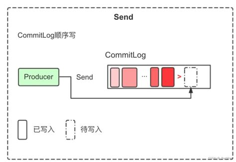
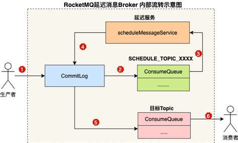
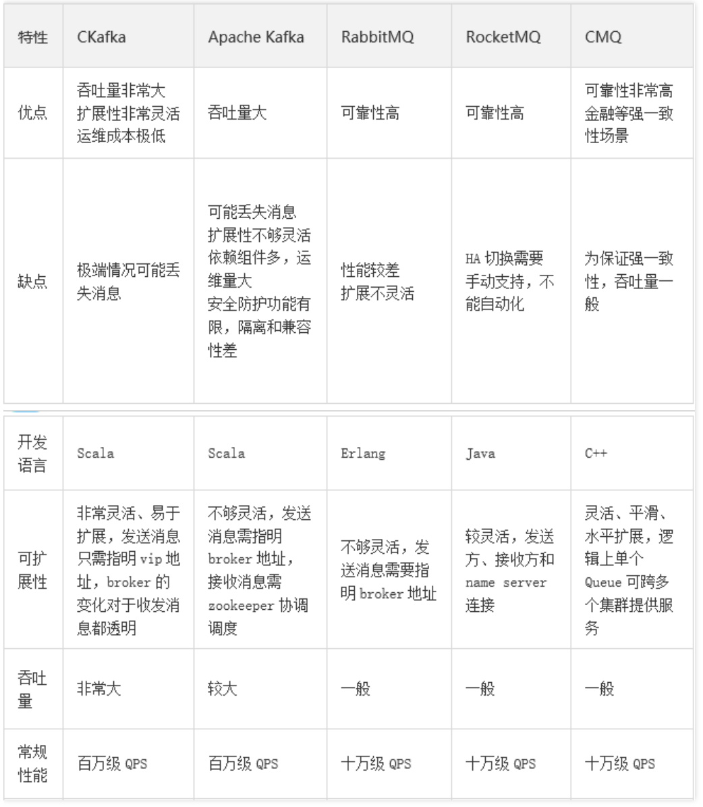

# 为什么 RocketMQ 一个 CommitLog文件就能抗住百万QPS

更详细的内容查看 [🚛 RocketMQ5.x教程-从安装到实战到经典面试题](https://www.yuque.com/tulingzhouyu/db22bv/pcztmw6gdpmg3l83)

 RocketMQ能够通过单个CommitLog文件支撑百万QPS的性能，主要依赖其设计上的高效机制和底层技术优化。以下是关键原因及证据支持：

### 1. **顺序写入与零拷贝机制**
+ **顺序写入**：RocketMQ将所有消息按顺序写入单个CommitLog文件，避免了多文件的随机写入开销。这种设计消除了多文件切换的随机写性能瓶颈，显著提升写入效率。
+ **零拷贝（mmap）** ：通过内存映射（mmap）技术，RocketMQ直接操作文件的物理内存，跳过内核缓冲区的拷贝步骤，减少数据在内存与磁盘之间的复制，从而降低延迟并提升吞吐量。

### 2. **PageCache缓存加速**
+ **批量读取**：CommitLog文件的随机读取利用操作系统的PageCache机制，将磁盘数据批量加载到内存中缓存，后续读取可直接从内存中获取，避免频繁磁盘IO。这种设计使得读取性能接近内存，即使在高并发下也能保持稳定。

### 3. **固定大小文件与顺序管理**
+ **单文件管理**：每个CommitLog文件默认大小为1GB，写满后自动创建新文件，且同一时刻仅允许一个文件被写入。这种设计简化了文件管理，同时通过顺序写入确保数据一致性。  

+ **避免碎片化**：固定大小的文件减少了磁盘碎片，提升存储效率，并通过文件名按起始偏移量命名，便于定位和管理。

### 4. **高可靠性与刷盘机制**
+ **同步刷盘**：RocketMQ支持同步刷盘（Sync Flush）和异步刷盘（Async Flush）。同步刷盘虽可靠性更高，但会牺牲部分性能；异步刷盘则通过副本机制（如DLedger）保证数据不丢失，同时提升吞吐量。
+ **副本机制**：通过多副本存储和主从同步，RocketMQ在保证数据可靠性的同时，避免了单点故障，进一步支撑高QPS。

### 5. **消费队列（ConsumeQueue）的高效索引**
+ **逻辑索引**：ConsumeQueue仅存储消息在CommitLog中的偏移量和队列信息，作为逻辑索引文件。其顺序读取和PageCache加速，使得消费端无需频繁访问磁盘，从而释放CommitLog的读取压力。

### 总结
RocketMQ通过**顺序写入**、**零拷贝**、**PageCache加速**、**固定大小文件管理**以及**高效消费索引**，将单个CommitLog文件的写入和读取性能最大化。

这些设计不仅降低了系统复杂度，还通过硬件和软件协同优化，实现了百万级QPS的吞吐能力。

相比之下，其他中间件（如Kafka）因异步刷盘和多副本机制牺牲了部分性能，而RabbitMQ则因同步刷盘和复杂架构导致QPS较低。

> 更新: 2025-06-04 20:25:44  
> 原文: <https://www.yuque.com/tulingzhouyu/db22bv/wp0sptu2ox10kgwl>