# 💎Spring 面试题集合

# <font style="color:#01B2BC;">当使用@Component Bean的Name默认是什么？</font>
很多同学觉得Bean的名字不就是类名首字母小写吗？其实并不是全都这样。

在解析@Component注册为BeanDefinition时会调用`<font style="color:#080808;background-color:#c6eecb;">AnnotationBeanNameGenerator.buildDefaultBeanName</font>`


# <font style="color:#01B2BC;">单例设计模式与Bean单例</font>
<font style="color:rgb(18, 18, 18);">Singleton模式主要作用是保证在Java应用程序中，一个Class有且仅有一个实例。它的好处非常显然的，可以避免不必要的重复操作，以及防止踩踏事件。在很多操作中，比如建立目录 数据库连接都需要这样的单线程操作。一些资源管理器常常设计成单例模式。</font>

<font style="color:rgb(18, 18, 18);">诸如数据库的连接，外部资源中如一台电脑可对应多个端口，但系统会集中管理这些端口，内部资源如采用一个对象管理存放系统配置的一个或多个属性文件。</font>

**<font style="color:rgb(18, 18, 18);">但是</font>**<font style="color:rgb(18, 18, 18);">，单例设计模式与Bean单例具有一定的区别，主要在于它们运行环境，java单例设计模式的环境是JVM，而Bean单例的环境在于Bean容器。一个Spring程序可以有很多个Bean，但一个Java程序通常有且仅有一个自己的JVM。所以，虽然Spring的Bean单例在一个容器中有且仅有一个，但如果程序具有多个Bean容器，而且都有某个Bean，那么这个Bean在这个程序中并非只有一个。但在实际应用中，如果将对象的生命周期完全交给Spring管理(不在其他地方通过new、反射等方式创建)，其实也能达到单例模式的效果。</font>

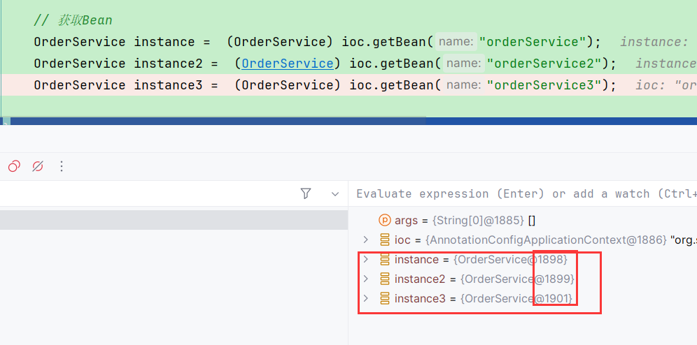

ByType-->byName

# <font style="color:#01B2BC;">@Transactional(readOnly=true) 真的是提高性能的灵丹妙药吗？</font>
<font style="color:rgb(0, 0, 0);">很多同学都说</font><font style="color:rgb(30, 107, 184);">@Transactional(readOnly = true)</font><font style="color:rgb(0, 0, 0);">提高了性能。那我们不得不思考：</font>

+ <font style="color:rgb(30, 107, 184);">@Transactional(readOnly = true)</font> Spring对它做了什么？真的提高了性能吗？ 

## @Transactional(readOnly = true)是如何工作的 ？Spring对它做了什么
```java
/**
	 * Prepare the transactional {@code Connection} right after transaction begin.
	 * <p>The default implementation executes a "SET TRANSACTION READ ONLY" statement
	 * if the {@link #setEnforceReadOnly "enforceReadOnly"} flag is set to {@code true}
	 * and the transaction definition indicates a read-only transaction.
	 * <p>The "SET TRANSACTION READ ONLY" is understood by Oracle, MySQL and Postgres
	 * and may work with other databases as well. If you'd like to adapt this treatment,
	 * override this method accordingly.
	 * @param con the transactional JDBC Connection
	 * @param definition the current transaction definition
	 * @throws SQLException if thrown by JDBC API
	 * @since 4.3.7
	 * @see #setEnforceReadOnly
	 */
	protected void prepareTransactionalConnection(Connection con, TransactionDefinition definition)
			throws SQLException {

		if (isEnforceReadOnly() && definition.isReadOnly()) {
			try (Statement stmt = con.createStatement()) {
				stmt.executeUpdate("SET TRANSACTION READ ONLY");
			}
		}
	}
```

<font style="color:rgb(0, 0, 0);">所以， 实际上就是利用数据库的SET TRANSACTION READ ONLY， 开启只读事务，那只读事务对数据库意味着什么呢？</font>

1. <font style="color:rgb(13, 13, 13);"> 通过执行 </font>**<font style="color:rgb(13, 13, 13);">SET TRANSACTION READ ONLY</font>**<font style="color:rgb(13, 13, 13);">，将当前事务设置为只读事务。这意味着在此事务内部，任何修改数据的操作（如 </font>**<font style="color:rgb(13, 13, 13);">INSERT</font>**<font style="color:rgb(13, 13, 13);">、</font>**<font style="color:rgb(13, 13, 13);">UPDATE</font>**<font style="color:rgb(13, 13, 13);">、</font>**<font style="color:rgb(13, 13, 13);">DELETE</font>**<font style="color:rgb(13, 13, 13);">）都将被禁止，只能执行读取操作（如 </font>**<font style="color:rgb(13, 13, 13);">SELECT</font>**<font style="color:rgb(13, 13, 13);">）。</font>
2. <font style="color:rgb(0, 0, 0);">只读事务依然会运用上隔离级别（MVCC），需要事务隔离级别需要一定性能开销。</font>

## <font style="color:rgb(0, 0, 0);">所以很多人一直纠结查询到底要不要设置只读，不设置是不是一样的？</font>
<font style="color:rgb(13, 13, 13);">一般情况下，执行查询时不开启事务的性能可能会稍微优于开启只读事务。这是因为不开启事务的查询操作不会涉及事务管理和隔离级别的开销，因此可能更为轻量级和高效。</font>

<font style="color:rgb(13, 13, 13);">当执行查询操作时，如果不需要事务的隔离级别和一致性保证，并且不需要使用事务管理的功能，那么不开启事务可能是更为合适的选择。这种情况下，查询操作将立即执行并返回结果，不会受到事务管理和隔离级别的开销影响。</font>

<font style="color:rgb(13, 13, 13);">然而，需要注意的是，如果应用需要保证数据的一致性和隔离性，并且希望查询操作与其他事务的修改行为相互独立，那么开启只读事务是必要的。在这种情况下，虽然可能会有一些额外的性能开销，但可以保证数据的一致性和隔离性，避免了并发操作可能引起的数据不一致问题。</font>

<font style="color:rgb(13, 13, 13);">综上所述，选择是否开启只读事务还是不开启事务，取决于具体的应用场景和需求。如果应用需要保证数据的一致性和隔离性，那么开启只读事务是必要的；如果不需要这些保证，并且追求查询操作的性能优化，那么不开启事务可能更为合适。</font>

# <font style="color:#01B2BC;">单例bean和单例模式有什么区别</font>
## <font style="color:rgb(36, 41, 47);">定义和用途：</font>
    - <font style="color:rgb(36, 41, 47);">单例Bean：在Spring框架中，单例Bean是指在整个应用程序中只存在一个实例的Bean对象。单例Bean的作用是共享和复用对象实例，以提高性能和减少资源消耗。</font>
    - <font style="color:rgb(36, 41, 47);">单例模式：单例模式是一种设计模式，用于确保一个类只有一个实例，并提供一个全局访问点来获取该实例。单例模式的目的是限制类的实例化次数，以保证全局唯一性和避免资源浪费。</font>

## <font style="color:rgb(36, 41, 47);">实现方式：</font>
    - <font style="color:rgb(36, 41, 47);">单例Bean：在Spring中，单例Bean的创建和管理由Spring容器负责。Spring容器在启动时会创建单例Bean的实例，并在整个应用程序的生命周期中共享该实例。</font>
    - <font style="color:rgb(36, 41, 47);">单例模式：单例模式的实现方式可以有多种，常见的方式包括饿汉式（在类加载时就创建实例）、懒汉式（在第一次使用时创建实例）等。</font>

## <font style="color:rgb(36, 41, 47);">适用范围：</font>
    - <font style="color:rgb(36, 41, 47);">单例Bean：单例Bean适用于需要共享和复用对象实例的场景，例如数据库连接池、线程池等。</font>
    - <font style="color:rgb(36, 41, 47);">单例模式：单例模式适用于需要确保全局唯一性和避免资源浪费的场景，例如配置信息管理、日志记录器等。</font>

## <font style="color:rgb(36, 41, 47);">小结：</font>
<font style="color:rgb(36, 41, 47);">单例Bean是Spring框架中的概念，用于共享和复用对象实例；</font>

<font style="color:rgb(36, 41, 47);">而单例模式是一种设计模式，用于</font>**<font style="color:rgb(36, 41, 47);">确保一个类只有一个实例</font>**<font style="color:rgb(36, 41, 47);">。虽然单例Bean使用了单例设计模式，但是它们的实现方式和适用范围有所不同。也不能简单的将单例Bean等同于单例设计模式，因为同一个class可以在容器中存在2个不同name的实例， 这一点不符合单例设计模式的原则。    </font>

# <font style="color:#01B2BC;">spring 自动装配 bean 有哪些方式</font>
## <font style="color:rgb(36, 41, 47);">根据名称自动装配（byName）</font>
1. <font style="color:rgb(36, 41, 47);">Spring容器会根据Bean的名称自动将相应的依赖注入到需要的地方。在XML配置中，可以使用autowire="byName"来启用byName自动装配。</font>

```xml
<bean id="bean1" class="com.example.Bean1" autowire="byName">
    <!-- Bean1的属性和依赖 -->
</bean>
```

## <font style="color:rgb(36, 41, 47);">根据类型自动装配（byType）</font>
2. <font style="color:rgb(36, 41, 47);">Spring容器会根据Bean的类型自动将相应的依赖注入到需要的地方。在XML配置中，可以使用autowire="byType"来启用byType自动装配。</font>

```xml
<bean id="bean2" class="com.example.Bean2" autowire="byType">
    <!-- Bean2的属性和依赖 -->
</bean>
```

## <font style="color:rgb(36, 41, 47);">构造函数自动装配（constructor）</font>
3. <font style="color:rgb(36, 41, 47);">Spring容器会根据构造函数的参数类型自动将相应的依赖注入到构造函数中。在XML配置中，可以使用autowire="constructor"来启用构造函数自动装配。</font>

```xml
<bean id="bean3" class="com.example.Bean3" autowire="constructor">
    <!-- Bean3的构造函数参数 -->
</bean>
```

## <font style="color:rgb(36, 41, 47);">自动装配注解（Autowired）</font>
4. <font style="color:rgb(36, 41, 47);">通过在需要自动装配的字段、构造函数或方法上使用@Autowired注解，Spring容器会自动将相应的依赖注入到标注了@Autowired的位置。</font>

```java
@Component
public class Bean4 {
    @Autowired
    private Dependency dependency;
    
    // 构造函数自动装配
    @Autowired
    public Bean4(Dependency dependency) {
        this.dependency = dependency;
    }
    
    // 方法自动装配
    @Autowired
    public void setDependency(Dependency dependency) {
        this.dependency = dependency;
    }
    
    // Bean4的其他属性和方法
}
```

<font style="color:rgb(36, 41, 47);">需要注意的是，自动装配需要满足一定的条件，如Bean的定义必须在Spring容器中，且只能有一个匹配的依赖项。如果存在多个匹配的依赖项，可以使用@Qualifier注解或@Primary注解来指定具体的依赖项。</font>

# <font style="color:#01B2BC;">AutoWired 与 Resource 区别</font>
这两个我们在项目中经常能看到，只知道是进行自动注入的，本文就以最简单的方式给大家总结下两者有什么区别，主要是从以下四个维度：

1. 来源不同；
2. 依赖查找的顺序不同；
3. 支持的参数不同；
4. 依赖注入的用法支持不同；

## 来源不同
@Autowired 和 @Resource 来自不同的“父类”，其中 @Autowired 是 Spring2.5 定义的注解

同时宣布支持@Resource ，而 @Resource 是 Java 定义的注解，它来自于 JSR-250（Java 250 规范提案）

## 依赖查找的顺序不同
依赖注入的功能，是通过先在 Spring IoC 容器中查找对象，再将对象注入引入到当前类中。而查找有分为两种实现：按名称（byName）查找或按类型（byType）查找，其中 @Autowired 和 @Resource 都是既使用了名称查找又使用了类型查找，但二者进行查找的顺序却截然相反。

### @AutoWired注解
@Autowired 注解在查找要注入的 bean 时，首先会按照类型进行匹配。如果有多个匹配的 bean，就会根据名称进行匹配。  
具体来说，如果被注入的属性或构造函数参数的类型在容器中有且只有一个对应的 bean，那么 @Autowired 注解就会直接将该 bean 注入到该属性或构造函数参数中。例如：

```java
@Autowired
private UserService userService;
```

在这个例子中，如果容器中只有一个类型为 UserService 的 bean ，那么它就会被自动注入到userService 属性中。  
但是，如果容器中存在多个类型为 UserService 的 bean，就需要通过名称进行匹配。此时，可以在 @Autowired 注解中使用 @Qualifier 注解来指定要注入的bean的名称，如果不使用 @Qualifier 注解就会使用属性名。  
例如：

```java
@Autowired
@Qualifier("userService2")
private UserService userService;
```

在这个例子中，如果容器中有多个类型为 UserService 的 bean，那么它会根据 @Qualifier 注解中指定的名称来匹配要注入的 bean。如果找到了名为 "userService2" 的 bean，就会将它注入到 userService 属性中。

### @Resource注解
在Spring中，@Resource注解可以通过名称或者类型来注入bean，具体取决于@Resource注解的两个属性：name和type。  
如果@Resource注解中指定了name属性，Spring将会根据该名称来查找对应的bean，并将其注入到被注解的属性或者方法参数中。例如：

```java
@Resource(name = "myBean")
private MyBean myBean;
```

上述代码将会根据名称“myBean”来查找对应的bean，并将其注入到myBean属性中。  
如果@Resource注解没有指定name属性，而是指定了type属性，Spring将会根据该类型来查找对应的bean，并将其注入到被注解的属性或者方法参数中。例如：

```java
@Resource(type = MyBean.class)
private MyBean myBean;
```

上述代码将会根据类型MyBean来查找对应的bean，并将其注入到myBean属性中。  
如果@Resource注解既没有指定name属性，也没有指定type属性，那么它会默认按照名称来查找对应的bean，并将其注入到被注解的属性或者方法参数中。例如：

```java
@Resource
private MyBean myBean;
```

上述代码将会默认按照名称“myBean”来查找对应的bean，并将其注入到myBean属性中。

## 支持的参数不同
@Autowired 和 @Resource 在使用时都可以设置参数，但二者支持的参数以及参数的个数完全不同，其中 @Autowired 只支持设置一个 required 的参数，而 @Resource 支持 7 个参数，支持的参数如下图所示：

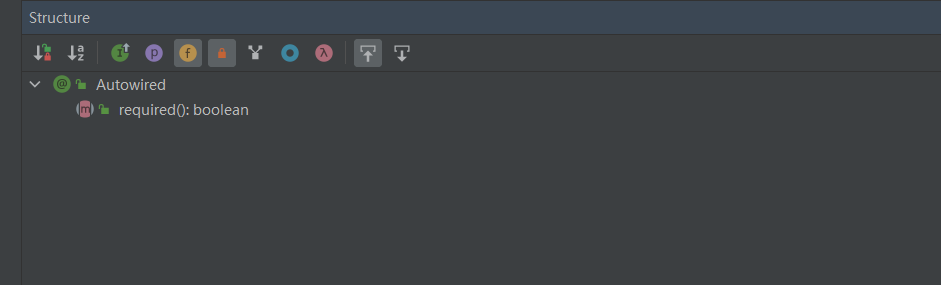

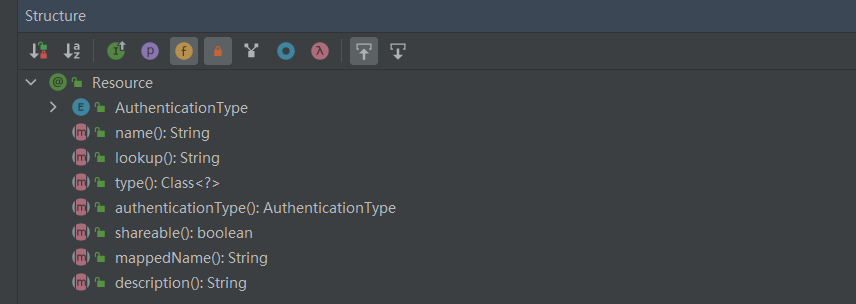

## 依赖注入的用法支持不同
@Autowired 和 @Resource 支持依赖注入的用法不同，常见依赖注入有以下 3 种实现：

1. 属性注入
2. 构造方法注入
3. Setter 注入

@Autowired 支持属性注入、构造方法注入和 Setter 注入，而 @Resource 只支持属性注入和 Setter 注入

```java
@RestController
public class UserController {
    // 属性注入
    @Autowired
    private UserService userService;

    @RequestMapping("/add")
    public UserInfo add(String username, String password) {
        return userService.add(username, password);
    }
}

@RestController
public class UserController {
    // 构造方法注入
    private UserService userService;

    @Autowired
    public UserController(UserService userService) {
        this.userService = userService;
    }

    @RequestMapping("/add")
    public UserInfo add(String username, String password) {
        return userService.add(username, password);
    }
}

@RestController
public class UserController {
    // Setter 注入
    private UserService userService;

    @Autowired
    public void setUserService(UserService userService) {
        this.userService = userService;
    }

    @RequestMapping("/add")
    public UserInfo add(String username, String password) {
        return userService.add(username, password);
    }
}
```

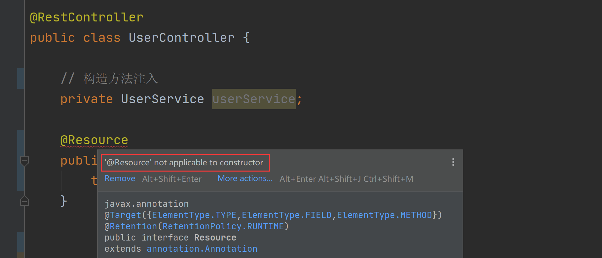

## <font style="color:rgb(24, 24, 24) !important;">总结</font>
<font style="color:rgb(36, 41, 46);">@Autowired 和 @Resource 都是用来实现依赖注入的注解（在 Spring/Spring Boot 项目中），但二者却有着 4 点不同：</font>

1. <font style="color:rgb(36, 41, 46);">来源不同：@Autowired 来自 Spring 框架，而 @Resource 来自于（Java）JSR-250；</font>
2. <font style="color:rgb(36, 41, 46);">依赖查找的顺序不同：@Autowired 先根据类型再根据名称查询，而 @Resource 先根据名称再根据类型查询；</font>
3. <font style="color:rgb(36, 41, 46);">支持的参数不同：@Autowired 只支持设置 1 个参数，而 @Resource 支持设置 7 个参数；</font>
4. <font style="color:rgb(36, 41, 46);">依赖注入的用法支持不同：@Autowired 既支持构造方法注入，又支持属性注入和 Setter 注入，而 @Resource 只支持属性注入和 Setter 注入；</font>

# <font style="color:#01B2BC;">单例Bean是单例模式吗？</font>
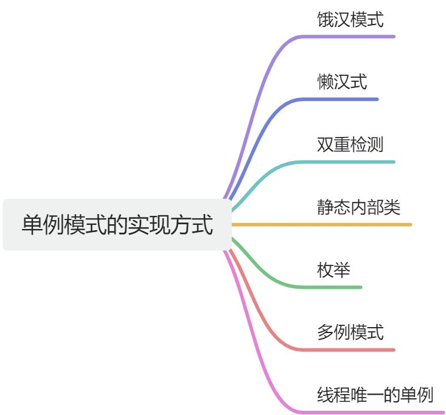

<font style="color:rgb(36, 41, 46);">通常来说，单例模式是指在一个JVM中，一个类只能构造出来一个对象，有很多方法来实现单例模式，比如懒汉模式，但是我们通常讲的单例模式有一个前提条件就是规定在一个JVM中，那如果要在两个JVM中保证单例呢？那可能就要用分布式锁这些技术，这里的重点是，我们在讨论单例模式时，是要考虑范围的。</font>

<font style="color:rgb(36, 41, 46);">而Spring中的单例Bean也是一种单例模式，只不过范围比较小，范围是beanName，一个beanName对应同一个Bean对象，不同beanName可以对应不同的Bean对象（就算是同一个类也是可以的）。</font>

<font style="color:rgb(36, 41, 46);">比如：</font>

```java
@Component
public class ZhouyuService {


}
```

<font style="color:rgb(36, 41, 46);">以上我们定义了一个单例Bean，beanName为zhouyuService，类型为ZhouyuService，我们可以继续用@Bean来进一步定义：</font>

```java
@ComponentScan("com.zhouyu")
public class AppConfig {
    
    @Bean
    public ZhouyuService zhouyuService1(){
        return new ZhouyuService();		
    }

    @Bean
    public ZhouyuService zhouyuService2(){
        return new ZhouyuService();
    }
}
```

<font style="color:rgb(36, 41, 46);">以上，Spring容器中将有三个ZhouyuService类型的bean对象，他们的名字不一样。</font>

# <font style="color:#01B2BC;">Bean的实例化和Bean的初始化有什么区别？</font>
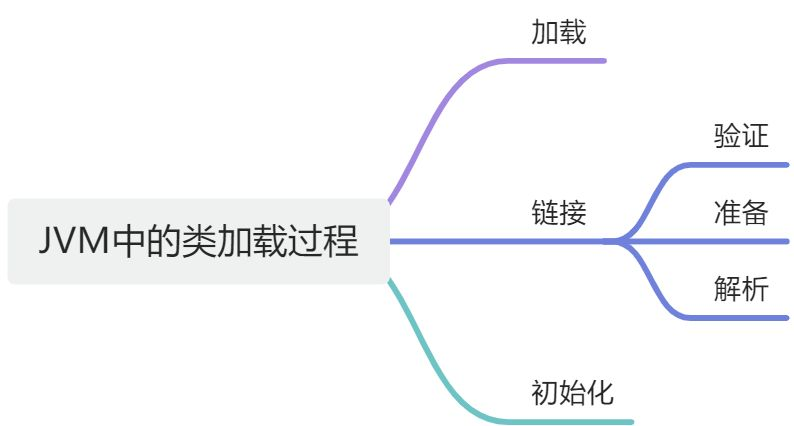

<font style="color:rgb(36, 41, 46);">Spring在创建一个Bean对象时，会先创建出来一个Java对象，会通过反射来执行类的构造方法从而得到一个Java对象，而这个过程就是Bean的实例化。</font>

<font style="color:rgb(36, 41, 46);">得到Java对象后，会进行依赖注入，依赖注入之后就会进行初始化了，而Bean的初始化就是调用前面创建出来的Java对象中特定的方法，比如Java对象实现了InitializingBean接口，那么初始化的时候就会执行Java对象的afterPropertiesSet()，Spring只会执行这个方法，并不关心方法做了什么，我们可以在这个方法中去对某个属性进行验证，或者直接给某个属性赋值都是可以的，反正Bean的初始化就是执行afterPropertiesSet()方法，或者执行init-method指定的方法，比如：</font>

```java
@Component
public class ZhouyuService {

	public void a(){
		System.out.println("zhouyu init");
	}
	
}
```

```java
@ComponentScan("com.zhouyu")
public class AppConfig {

	@Bean(initMethod = "a")
	public ZhouyuService zhouyuService1(){
    	return new ZhouyuService();		
	}
}
```

# <font style="color:#01B2BC;">Spring AOP是如何实现的？它和AspectJ有什么区别？</font>
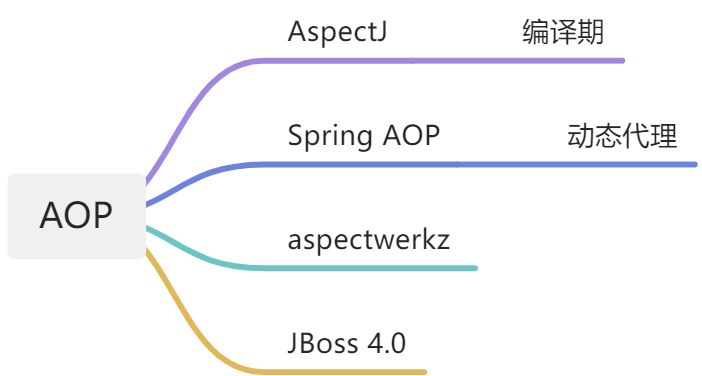

<font style="color:rgb(36, 41, 46);">Spring AOP是利用的动态代理机制，如果一个Bean实现了接口，那么就会采用JDK动态代理来生成该接口的代理对象，如果一个Bean没有实现接口，那么就会采用CGLIB来生成当前类的一个代理对象。代理对象的作用就是代理原本的Bean对象，代理对象在执行某个方法时，会在该方法的基础上增加一些切面逻辑，使得我们可以利用AOP来实现一些诸如登录校验、权限控制、日志记录等统一功能。</font>

<font style="color:rgb(36, 41, 46);">Spring AOP和AspectJ之间并没有特别强的关系，AOP表示面向切面编程，这是一种思想，各个组织和个人都可以通过技术来实现这种思想，AspectJ就是其中之一，它会在编译期来对类进行增强，所以要用AspectJ，得用AspectJ开发的编译器来编译你的项目。而Spring AOP则是采用动态代理的方式来实现AOP，只不过觉得AspectJ中设计的那几个注解比较好，比如@Before、@After、@Around等，同时也不给程序员造成困扰，所以Spring AOP中会对这几个注解进行支持，虽然注解是相同的，但是底层的支持实现是完全不一样的。</font>

# <font style="color:#01B2BC;">Spring中的事务是如何实现的？</font>
1. <font style="color:rgb(36, 41, 46);">Spring事务底层是基于数据库事务和AOP机制的</font>
2. <font style="color:rgb(36, 41, 46);">首先对于使用了@Transactional注解的Bean，Spring会创建一个代理对象作为Bean</font>
3. <font style="color:rgb(36, 41, 46);">当调用代理对象的方法时，会先判断该方法上是否加了@Transactional注解</font>
4. <font style="color:rgb(36, 41, 46);">如果加了，那么则利用事务管理器创建一个数据库连接</font>
5. <font style="color:rgb(36, 41, 46);">并且修改数据库连接的autocommit属性为false，禁止此连接的自动提交，这是实现Spring事务非常重要的一步</font>
6. <font style="color:rgb(36, 41, 46);">然后执行当前方法，方法中会执行sql</font>
7. <font style="color:rgb(36, 41, 46);">执行完当前方法后，如果没有出现异常就直接提交事务</font>
8. <font style="color:rgb(36, 41, 46);">如果出现了异常，并且这个异常是需要回滚的就会回滚事务，否则仍然提交事务</font>
9. <font style="color:rgb(36, 41, 46);">Spring事务的隔离级别对应的就是数据库的隔离级别</font>
10. <font style="color:rgb(36, 41, 46);">Spring事务的传播机制是Spring事务自己实现的，也是Spring事务中最复杂的</font>
11. <font style="color:rgb(36, 41, 46);">Spring事务的传播机制是基于数据库连接来做的，一个数据库连接一个事务，如果传播机制配置为需要新开一个事务，那么实际上就是先建立一个数据库连接，在此新数据库连接上执行sql</font>


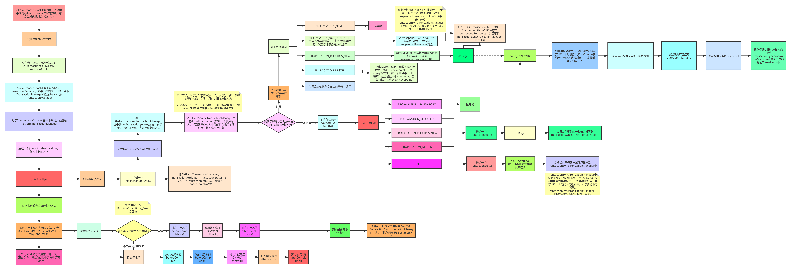

# <font style="color:#01B2BC;">你是如何理解Spring事务的传播机制的？底层是如何实现的？</font>
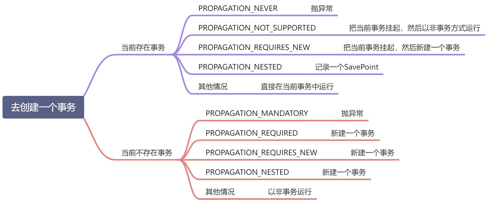


<font style="color:rgb(36, 41, 46);">一个线程在运行过程中，可能会连续调用好几个方法，在调用某一个方法时，可能就开启了一个Spring事务，那么在调用接下来的方法时，到底是共用同一个事务呢？还是新开一个事务呢？这就是传播机制，程序员可以根据不同的业务场景进行配置，比如：</font>

1. <font style="color:rgb(36, 41, 46);">REQUIRED(Spring默认的事务传播类型)：如果当前没有事务，则自己新建一个事务，如果当前存在事务，则加入这个事务</font>
2. <font style="color:rgb(36, 41, 46);">SUPPORTS：当前存在事务，则加入当前事务，如果当前没有事务，就以非事务方法执行</font>
3. <font style="color:rgb(36, 41, 46);">MANDATORY：当前存在事务，则加入当前事务，如果当前事务不存在，则抛出异常。</font>
4. <font style="color:rgb(36, 41, 46);">REQUIRES_NEW：创建一个新事务，如果存在当前事务，则挂起该事务。</font>
5. <font style="color:rgb(36, 41, 46);">NOT_SUPPORTED：以非事务方式执行,如果当前存在事务，则挂起当前事务</font>
6. <font style="color:rgb(36, 41, 46);">NEVER：不使用事务，如果当前事务存在，则抛出异常</font>
7. <font style="color:rgb(36, 41, 46);">NESTED：如果当前事务存在，则在嵌套事务中执行，否则和REQUIRED的操作一样（开启一个事务）</font>

<font style="color:rgb(36, 41, 46);">在Spring中，一个Spring事务就是对应一个数据库连接，新开一个Spring事务其实就是新开一个数据库连接，比如执行某个方法时需要开启一个Spring事务，那么就会创建一个数据库连接，然后开始执行方法，如果方法中调用了其他方法，此时就会看这个其他方法怎么配置的：</font>

1. <font style="color:rgb(36, 41, 46);">比如是REQUIRES_NEW，那么就会新开一个数据库连接，这个其中方法中的sql就会在这个新开的数据库连接中执行</font>
2. <font style="color:rgb(36, 41, 46);">比如是REQUIRED，那么就不会新开，而是基于之前的数据库连接来执行方法中的sql</font>

# <font style="color:#01B2BC;">哪些情况下会导致Spring事务失效，对应的原因是什么？</font>
**<font style="color:#DF2A3F;">图灵课堂-周瑜</font>**

1. <font style="color:rgb(36, 41, 46);">方法内的自调用：Spring事务是基于AOP的，只要使用代理对象调用某个方法时，Spring事务才能生效，而在一个方法中调用使用this.xxx()调用方法时，this并不是代理对象，所以会导致事务失效。</font>
    1. <font style="color:rgb(36, 41, 46);">解放办法1：把调用方法拆分到另外一个Bean中</font>
    2. <font style="color:rgb(36, 41, 46);">解决办法2：自己注入自己</font>
    3. <font style="color:rgb(36, 41, 46);">解决办法3：AopContext.currentProxy()+@EnableAspectJAutoProxy(exposeProxy = true)</font>
2. <font style="color:rgb(36, 41, 46);">方法是private的：Spring事务会基于CGLIB来进行AOP，而CGLIB会基于父子类来失效，子类是代理类，父类是被代理类，如果父类中的某个方法是private的，那么子类就没有办法重写它，也就没有办法额外增加Spring事务的逻辑。</font>
3. <font style="color:rgb(36, 41, 46);">方法是final的：原因和private是一样的，也是由于子类不能重写父类中的final的方法</font>
4. <font style="color:rgb(36, 41, 46);">单独的线程调用方法：当Mybatis或JdbcTemplate执行SQL时，会从ThreadLocal中去获取数据库连接对象，如果开启事务的线程和执行SQL的线程是同一个，那么就能拿到数据库连接对象，如果不是同一个线程，那就拿到不到数据库连接对象，这样，Mybatis或JdbcTemplate就会自己去新建一个数据库连接用来执行SQL，此数据库连接的autocommit为true，那么执行完SQL就会提交，后续再抛异常也就不能再回滚之前已经提交了的SQL了。</font>
5. <font style="color:rgb(36, 41, 46);">没加@Configuration注解：如果用SpringBoot基本没有这个问题，但是如果用的Spring，那么可能会有这个问题，这个问题的原因其实也是由于Mybatis或JdbcTemplate会从ThreadLocal中去获取数据库连接，但是ThreadLocal中存储的是一个MAP，MAP的key为DataSource对象，value为连接对象，而如果我们没有在AppConfig上添加@Configuration注解的话，会导致MAP中存的DataSource对象和Mybatis和JdbcTemplate中的DataSource对象不相等，从而也拿不到数据库连接，导致自己去创建数据库连接了。</font>
6. <font style="color:rgb(36, 41, 46);">异常被吃掉：如果Spring事务没有捕获到异常，那么也就不会回滚了，默认情况下Spring会捕获RuntimeException和Error。</font>
7. <font style="color:rgb(36, 41, 46);">类没有被Spring管理</font>
8. <font style="color:rgb(36, 41, 46);">数据库不支持事务</font>

# <font style="color:#01B2BC;">Spring中的Bean创建的生命周期有哪些步骤</font>
<font style="color:rgb(36, 41, 46);">Spring中一个Bean的创建大概分为以下几个步骤：</font>

1. <font style="color:rgb(36, 41, 46);">推断构造方法</font>
2. <font style="color:rgb(36, 41, 46);">实例化</font>
3. <font style="color:rgb(36, 41, 46);">填充属性，也就是依赖注入</font>
4. <font style="color:rgb(36, 41, 46);">处理Aware回调</font>
5. <font style="color:rgb(36, 41, 46);">初始化前，处理@PostConstruct注解</font>
6. <font style="color:rgb(36, 41, 46);">初始化，处理InitializingBean接口</font>
7. <font style="color:rgb(36, 41, 46);">初始化后，进行AOP</font>

<font style="color:rgb(36, 41, 46);">当然其实真正的步骤更加细致，可以看下面的流程图</font>

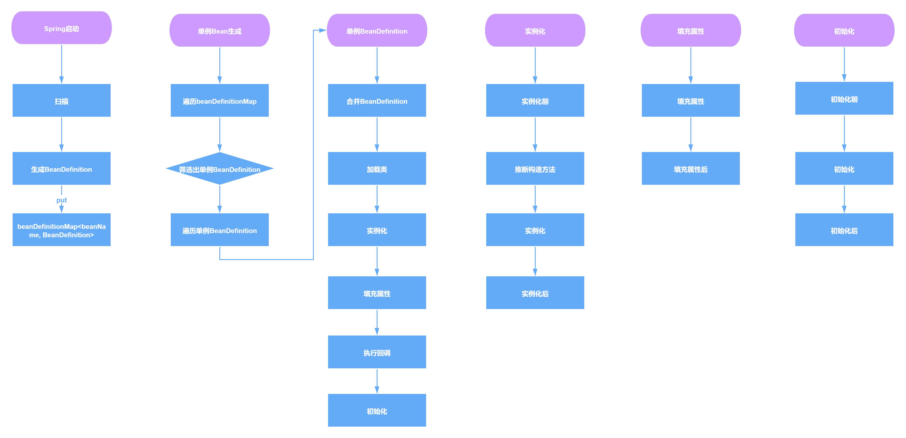


**<font style="color:#DF2A3F;"></font>**

# <font style="color:#01B2BC;">Spring中Bean是线程安全的吗</font>
<font style="color:rgb(36, 41, 46);">Spring本身并没有针对Bean做线程安全的处理，所以：</font>

1. <font style="color:rgb(36, 41, 46);">如果Bean是无状态的，那么Bean则是线程安全的</font>
2. <font style="color:rgb(36, 41, 46);">如果Bean是有状态的，那么Bean则不是线程安全的</font>

<font style="color:rgb(36, 41, 46);">另外，Bean是不是线程安全，跟Bean的作用域没有关系，Bean的作用域只是表示Bean的生命周期范围，对于任何生命周期的Bean都是一个对象，这个对象是不是线程安全的，还是得看这个Bean对象本身。</font>

# <font style="color:#01B2BC;">（简）ApplicationContext和BeanFactory有什么区别</font>
<font style="color:rgb(36, 41, 46);">BeanFactory是Spring中非常核心的组件，表示Bean工厂，可以生成Bean，维护Bean，而ApplicationContext继承了BeanFactory，所以ApplicationContext拥有BeanFactory所有的特点，也是一个Bean工厂，但是ApplicationContext除开继承了BeanFactory之外，还继承了诸如EnvironmentCapable、MessageSource、ApplicationEventPublisher等接口，从而ApplicationContext还有获取系统环境变量、国际化、事件发布等功能，这是BeanFactory所不具备的</font>

# <font style="color:#01B2BC;">Spring容器启动流程是怎样的</font>
1. <font style="color:rgb(36, 41, 46);">在创建Spring容器，也就是启动Spring时：</font>
2. <font style="color:rgb(36, 41, 46);">首先会进行扫描，扫描得到所有的BeanDefinition对象，并存在一个Map中</font>
3. <font style="color:rgb(36, 41, 46);">然后筛选出非懒加载的单例BeanDefinition进行创建Bean，对于多例Bean不需要在启动过程中去进行创建，对于多例Bean会在每次获取Bean时利用BeanDefinition去创建</font>
4. <font style="color:rgb(36, 41, 46);">利用BeanDefinition创建Bean就是Bean的创建生命周期，这期间包括了合并BeanDefinition、推断构造方法、实例化、属性填充、初始化前、初始化、初始化后等步骤，其中AOP就是发生在初始化后这一步骤中</font>
5. <font style="color:rgb(36, 41, 46);">单例Bean创建完了之后，Spring会发布一个容器启动事件</font>
6. <font style="color:rgb(36, 41, 46);">Spring启动结束</font>
7. <font style="color:rgb(36, 41, 46);">在源码中会更复杂，比如源码中会提供一些模板方法，让子类来实现，比如源码中还涉及到一些BeanFactoryPostProcessor和BeanPostProcessor的注册，Spring的扫描就是通过BenaFactoryPostProcessor来实现的，依赖注入就是通过BeanPostProcessor来实现的</font>
8. <font style="color:rgb(36, 41, 46);">在Spring启动过程中还会去处理@Import等注解</font>

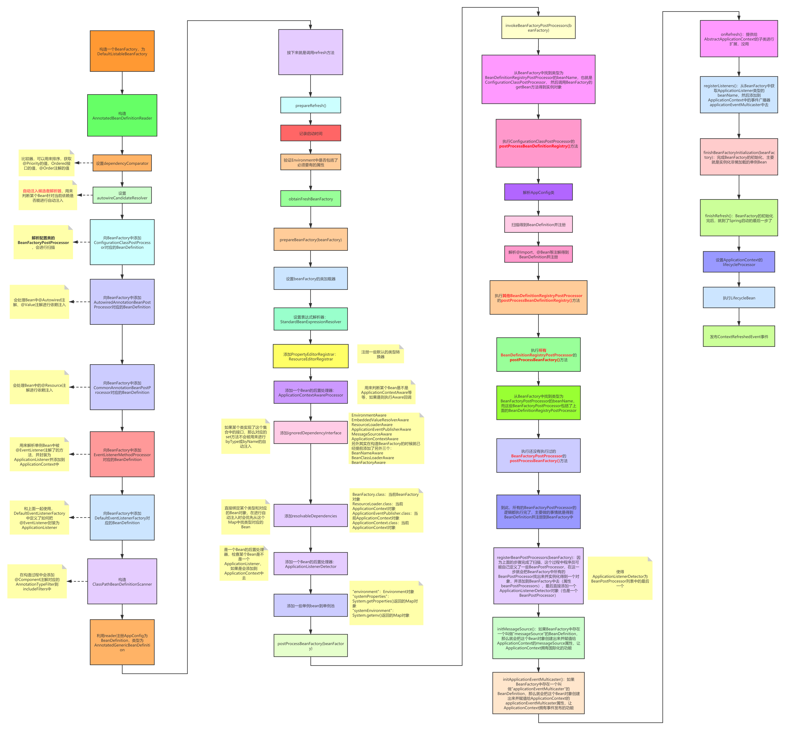

# <font style="color:#01B2BC;">@SpringBootApplication注解有什么用？为什么一定要写它？</font>
<font style="color:rgb(36, 41, 46);">@SpringBootApplication是一个复合注解：</font>

```java
@SpringBootConfiguration
@EnableAutoConfiguration
@ComponentScan
public @interface SpringBootApplication {


}

```

<font style="color:rgb(36, 41, 46);">是以上三个注解的整合，在一个类上只要加了@SpringBootApplication，就相当于同时加了以上的三个注解，当Spring容器在启动时，当解析到一个类上有@SpringBootApplication，那么就相当于这个类上有：</font>

1. <font style="color:rgb(36, 41, 46);">@ComponentScan，从而Spring容器会进行扫描，扫描路径为当前在解析的这个类所在的包路径。</font>
2. <font style="color:rgb(36, 41, 46);">@EnableAutoConfiguration，这个注解会负责进行自动配置类的导入，也就是将项目中的自动配置类导入到Spring容器中，从而得到解析</font>
3. <font style="color:rgb(36, 41, 46);">@SpringBootConfiguration，它其实就相当于是@Configuration，表示当前类是一个配置类</font>

<font style="color:rgb(36, 41, 46);">所以，在使用SpringBoot时，我们一般会加上@SpringBootApplication这个注解，因为只要加上了它，SpringBoot就会进行扫描，就会导入自动配置类并解析解析。</font>

# <font style="color:#01B2BC;">SpringBoot中的spring.factories文件有什么作用？</font>
<font style="color:rgb(36, 41, 46);">spring.factories是SpringBoot SPI机制实现的核心，SPI机制表示扩展机制，所以spring.factories文件的作用就是用来对SpringBoot进行扩展的，比如我们可以通过在该文件中去添加ApplicationListener、ApplicationContextInitializer、配置类等等，只需要在该文件中添加就可以了，而不用额外的去写什么代码。</font>

<font style="color:rgb(36, 41, 46);">SpringBoot在启动的过程中，会找出项目中所有的spring.factories文件，包括jar中spring.factories，从而向Spring容器中添加各个spring.factories文件中指定的ApplicationListener、ApplicationContextInitializer、配置类等组件，使得对SpringBoot做扩展非常容易了，只要引入一个jar，这个jar中有spring.factories文件，就可以把ApplicationListener等添加到Spring容器中。</font>

# <font style="color:#01B2BC;">你是如何理解SpringBoot中的自动配置的？</font>
<font style="color:rgb(36, 41, 46);">在Spring中，我们通常需要去配置很多的Bean：</font>

+ <font style="color:rgb(36, 41, 46);">比如用Mybatis，我们要配置SqlSessionFactory的Bean对象</font>
+ <font style="color:rgb(36, 41, 46);">用AOP，我们需要配置@EnableAspectJAutoProxy注解</font>
+ <font style="color:rgb(36, 41, 46);">用Spring事务，我们需要配置DataSourceTransactionManager的Bean对象</font>
+ <font style="color:rgb(36, 41, 46);">用RabbitMQ，我们要配置RabbitTemplate的Bean对象</font>
+ <font style="color:rgb(36, 41, 46);">等等</font>

<font style="color:rgb(36, 41, 46);">而我们用SpringBoot时，我们基本不用再去配这些了，因为SpringBoot帮我们配置好了，怎么做到的呢？其实就是SpringBoot内置了很多的配置类，比如</font>

1. <font style="color:rgb(36, 41, 46);">RabbitAutoConfiguration</font>
2. <font style="color:rgb(36, 41, 46);">AopAutoConfiguration</font>
3. <font style="color:rgb(36, 41, 46);">ElasticsearchDataAutoConfiguration</font>
4. <font style="color:rgb(36, 41, 46);">DataSourceTransactionManagerAutoConfiguration</font>
5. <font style="color:rgb(36, 41, 46);">等等</font>

<font style="color:rgb(36, 41, 46);">内置的这些配置类，也可以叫做自动配置类，我们在依赖了spring-boot-starter-web后，会间接的依赖到spring-boot-autoconfigure这个jar，这个jar中都包含了很多的自动配置类：</font>

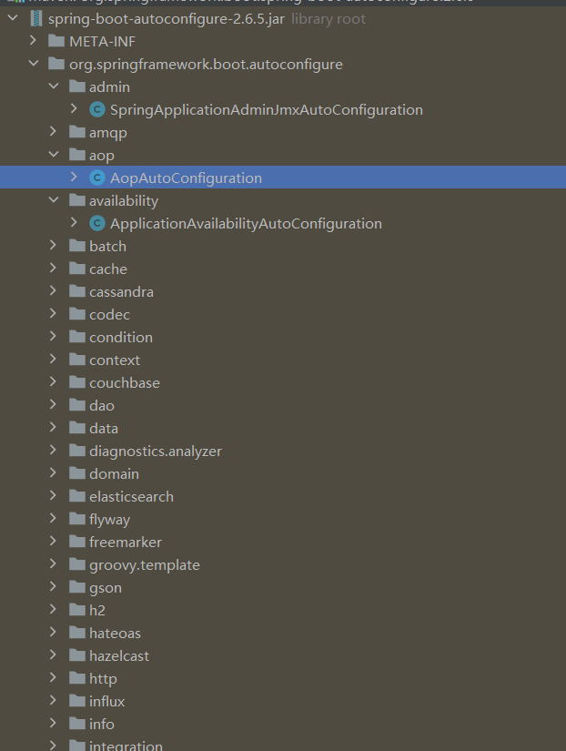


<font style="color:rgb(36, 41, 46);">这其实就是SpringBoot的自动配置，帮程序员提前配置了很多东西，Bean或者注解。</font>

# <font style="color:#01B2BC;">Spring Boot启动过程中做了哪些事情？</font>
1. <font style="color:rgb(36, 41, 46);">首先，判断当前的应用类型，比如是不是web应用，如果是，那是servlet应用还是webflux应用，不同类型后续会创建不同的Spring容器</font>
2. <font style="color:rgb(36, 41, 46);">根据应用类型</font>**<font style="color:rgb(36, 41, 46);">创建Spring容器</font>**
3. <font style="color:rgb(36, 41, 46);">解析启动类，从而进行扫描、导入自动配置类并解析解析</font>
4. <font style="color:rgb(36, 41, 46);">启动Tomcat或者jetty、undertow</font>
5. <font style="color:rgb(36, 41, 46);">调用ApplicationRunner或CommandLineRunner</font>

<font style="color:rgb(36, 41, 46);"></font>

<font style="color:rgb(36, 41, 46);">以上至少一些核心的，其实整个启动过程中还包含了SpringApplicationRunListeners的调用、banner的打印、ApplicationContextInitializer的执行等，具体可以参照源码。</font>

# <font style="color:#01B2BC;">SpringMVC处理请求的流程是什么？</font>
1. <font style="color:rgb(36, 41, 46);">在启动Tomcat过程中，会创建DispatcherServlet对象，并执行它的初始化逻辑</font>
2. <font style="color:rgb(36, 41, 46);">DispatcherServlet初始化过程中会创建Spring容器（根据用户的Spring配置）</font>
3. <font style="color:rgb(36, 41, 46);">然后初始化过程中还是初始化HandlerMapping、HandlerAdapter等等</font>
4. <font style="color:rgb(36, 41, 46);">SpringMVC中默认提供了好几个HandlerMapping，其中有一个为RequestMappingHandlerMapping</font>
5. <font style="color:rgb(36, 41, 46);">RequestMappingHandlerMapping的作用是去寻找Spring容器中有哪些加了@RequestMapping的方法</font>
6. <font style="color:rgb(36, 41, 46);">找到这些方法后，就会解析该注解上的信息，包含了指定的path，然后就把path作为key，Method作为value存到一个map中</font>
7. <font style="color:rgb(36, 41, 46);">当DispatcherServlet接收到请求后，RequestMappingHandlerMapping就会负责根据请求路径从map中找到对应的Method</font>
8. <font style="color:rgb(36, 41, 46);">然后准备执行Method，只不过，在执行Method之前，会解析该方法的各个参数</font>
9. <font style="color:rgb(36, 41, 46);">比如参数前面加了@RequestParam注解，那SpringMVC就会解析该注解，并从请求中取出对应request param中的数据传给该参数</font>
10. <font style="color:rgb(36, 41, 46);">解析完各个参数并从请求中拿到了对应的值之后，就会执行方法了</font>
11. <font style="color:rgb(36, 41, 46);">执行完方法得到了方法返回值后，SpringMVC会进一步解析</font>
12. <font style="color:rgb(36, 41, 46);">比如方法上如果加了@ResponseBody，那么就直接把返回值返回给浏览器</font>
13. <font style="color:rgb(36, 41, 46);">如果方法上没有加@ResponseBody，那么就要根据返回值找到对应的页面，并进行服务端渲染，再把渲染结果返回给浏览器</font>

# <font style="color:#01B2BC;">SpringMVC中的重定向和转发分别是如何实现的？</font>
1. <font style="color:rgb(36, 41, 46);">我们可以使用</font>**forward:**<font style="color:rgb(36, 41, 46);">来对当前请求进行转发</font>
2. <font style="color:rgb(36, 41, 46);">可以用</font>**redirect:**<font style="color:rgb(36, 41, 46);">来对当前请求进行重定向</font>
3. <font style="color:rgb(36, 41, 46);">当SpringMVC接收到一个请求后，会先处理请求，如果后续方法要进行转发，就会利用RequestDispatcher将当前请求转发到指定地址，这种情况下，一直是同一个请求，只不过两次请求的路径不一样，并且转发对于浏览器而言是透明的</font>
4. <font style="color:rgb(36, 41, 46);">而如果SpringMVC接收到一个请求，并进行处理后，发现要进行重定向，此时SpringMVC会向浏览器响应303，同时会告诉浏览器要重定向的路径，表示告诉浏览器要访问另外一个路径，由浏览器自己来访问，所以重定向是需要浏览器参与的，是不同的两个请求</font>

# <font style="color:#01B2BC;">BeanDefinitionReader 与 MetadataReader 的区别</font>
### <font style="color:rgba(0, 0, 0, 0.82);">BeanDefinitionReader</font>
<font style="color:rgba(0, 0, 0, 0.82);">BeanDefinitionReader 是 Spring 框架中用于读取 bean 定义信息的接口。它负责从各种来源（如 XML 文件、注解、Java 配置类等）读取并解析 bean 的定义，然后转换为 BeanDefinition 对象，最终注册到 BeanDefinitionRegistry 中。</font>

<font style="color:rgba(0, 0, 0, 0.82);">主要实现包括：</font>

+ <font style="color:rgba(0, 0, 0, 0.82);">XmlBeanDefinitionReader：读取 XML 配置文件</font>
+ <font style="color:rgba(0, 0, 0, 0.82);">AnnotatedBeanDefinitionReader：读取带有注解的类</font>
+ <font style="color:rgba(0, 0, 0, 0.82);">ClassPathBeanDefinitionScanner：扫描指定路径下的类</font>

### <font style="color:rgba(0, 0, 0, 0.82);">MetadataReader</font>
<font style="color:rgba(0, 0, 0, 0.82);">MetadataReader 是 Spring 的核心组件，主要用于读取和访问类的元数据信息，而不仅限于 bean 定义。它提供了对类、方法、字段等元数据的访问能力，包括类的注解信息、类的结构信息等。</font>

<font style="color:rgba(0, 0, 0, 0.82);">MetadataReader 通常与 ASM 库结合使用，可以不需要加载整个类就能获取类的元数据信息，这对于提高性能非常重要。</font>

### <font style="color:rgba(0, 0, 0, 0.82);">主要区别</font>
1. **<font style="color:rgba(0, 0, 0, 0.82);">功能范围</font>**<font style="color:rgba(0, 0, 0, 0.82);">：</font>
    - <font style="color:rgba(0, 0, 0, 0.82);">BeanDefinitionReader 专注于读取和解析 bean 定义</font>
    - <font style="color:rgba(0, 0, 0, 0.82);">MetadataReader 范围更广，用于读取类的各种元数据信息</font>
2. **<font style="color:rgba(0, 0, 0, 0.82);">使用场景</font>**<font style="color:rgba(0, 0, 0, 0.82);">：</font>
    - <font style="color:rgba(0, 0, 0, 0.82);">BeanDefinitionReader 主要用于 Spring IoC 容器的初始化阶段</font>
    - <font style="color:rgba(0, 0, 0, 0.82);">MetadataReader 可用于各种需要获取类元数据的场景，如注解扫描、条件化配置等</font>
3. **<font style="color:rgba(0, 0, 0, 0.82);">抽象层次</font>**<font style="color:rgba(0, 0, 0, 0.82);">：</font>
    - <font style="color:rgba(0, 0, 0, 0.82);">BeanDefinitionReader 工作在较高的抽象层次，直接与 Spring bean 相关</font>
    - <font style="color:rgba(0, 0, 0, 0.82);">MetadataReader 工作在较低的抽象层次，关注类的元数据信息</font>
4. **<font style="color:rgba(0, 0, 0, 0.82);">输出结果</font>**<font style="color:rgba(0, 0, 0, 0.82);">：</font>
    - <font style="color:rgba(0, 0, 0, 0.82);">BeanDefinitionReader 的输出是 BeanDefinition 对象</font>
    - <font style="color:rgba(0, 0, 0, 0.82);">MetadataReader 提供的是类的元数据信息，如 ClassMetadata 和 AnnotationMetadata</font>

<font style="color:rgba(0, 0, 0, 0.82);">两者在 Spring 框架中扮演不同但相互补充的角色，共同支持 Spring 的依赖注入和控制反转功能。</font>

# <font style="color:#01B2BC;">ApplicationContext和BeanFactory有什么区别</font>
## <font style="color:rgba(6, 8, 31, 0.88);">1. 基本概念</font>
### <font style="color:rgba(6, 8, 31, 0.88);">BeanFactory</font>
<font style="color:rgba(6, 8, 31, 0.88);">BeanFactory是Spring框架中最基础的接口，它提供了最简单的容器功能，主要负责：</font>

+ <font style="color:rgba(6, 8, 31, 0.88);">实例化对象</font>
+ <font style="color:rgba(6, 8, 31, 0.88);">获取对象</font>

<font style="color:rgba(6, 8, 31, 0.88);">它是Spring容器家族的根接口，可以理解为IoC容器的基础规范。</font>

### <font style="color:rgba(6, 8, 31, 0.88);">ApplicationContext</font>
<font style="color:rgba(6, 8, 31, 0.88);">ApplicationContext（应用上下文）继承了BeanFactory接口，是Spring提供的更高级的容器实现，在BeanFactory基础上增加了许多企业级功能。它是BeanFactory的子接口，拥有BeanFactory的所有功能，同时提供了更完善的框架功能。</font>

## <font style="color:rgba(6, 8, 31, 0.88);">2. 主要区别</font>
### <font style="color:rgb(77, 77, 77);">2.1 两者装载bean的区别</font>
+ **<font style="color:rgba(6, 8, 31, 0.88);">BeanFactory</font>**<font style="color:rgba(6, 8, 31, 0.88);">：采用延迟加载策略，容器启动较快</font>
    - <font style="color:rgba(6, 8, 31, 0.88);">只有当客户端请求获取Bean时，才进行实例化</font>
    - <font style="color:rgba(6, 8, 31, 0.88);">第一次调用getBean()方法时才初始化相应的Bean</font>
+ **<font style="color:rgba(6, 8, 31, 0.88);">ApplicationContext</font>**<font style="color:rgba(6, 8, 31, 0.88);">：容器启动时就完成所有单例Bean的实例化</font>
    - <font style="color:rgba(6, 8, 31, 0.88);">在启动时就把所有单例Bean提前进行实例化（除非配置了lazy-init="true"）</font>
    - <font style="color:rgba(6, 8, 31, 0.88);">这样在系统运行期就不需要等待对象的实例化，提高响应速度</font>
    - <font style="color:rgba(6, 8, 31, 0.88);">能够在启动阶段就发现系统中的配置问题</font>

### <font style="color:rgba(6, 8, 31, 0.88);">2.2 功能差异</font>
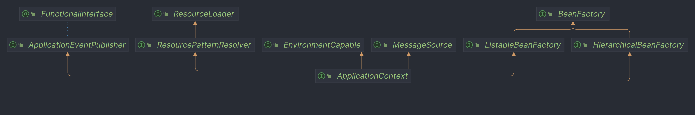

<font style="color:rgba(6, 8, 31, 0.88);">ApplicationContext比BeanFactory提供了更多的企业级功能：</font>

#### <font style="color:rgba(6, 8, 31, 0.88);">(1) 国际化支持（MessageSource）</font>
<font style="color:rgba(6, 8, 31, 0.88);">ApplicationContext实现了MessageSource接口，支持信息国际化和参数化：</font>

```java
// 获取不同语言的消息  
String message = context.getMessage("message.welcome", new Object[]{"John"}, Locale.US);
```

#### <font style="color:rgba(6, 8, 31, 0.88);">(2) 资源访问（ResourceLoader）</font>
<font style="color:rgba(6, 8, 31, 0.88);">ApplicationContext实现了ResourceLoader接口，可以统一加载各种资源文件：</font>

```java
// 从类路径加载资源  
Resource resource = context.getResource("classpath:config.xml");  

// 从文件系统加载资源  
Resource fileResource = context.getResource("file:///path/to/file.txt");
```

#### <font style="color:rgba(6, 8, 31, 0.88);">(3) 事件机制（ApplicationEventPublisher）</font>
<font style="color:rgba(6, 8, 31, 0.88);">ApplicationContext实现了事件发布功能，允许Bean通过事件交互：</font>

```java
// 自定义事件  
public class UserCreatedEvent extends ApplicationEvent {  
    private String username;  

    public UserCreatedEvent(Object source, String username) {  
        super(source);  
        this.username = username;  
    }  
    // getter...  
}  

// 发布事件  
context.publishEvent(new UserCreatedEvent(this, "张三"));  

// 事件监听器  
@Component  
public class EmailService implements ApplicationListener<UserCreatedEvent> {  
    @Override  
    public void onApplicationEvent(UserCreatedEvent event) {  
        System.out.println("发送邮件给: " + event.getUsername());  
    }  
}
```

#### <font style="color:rgba(6, 8, 31, 0.88);">(4) 标准Context事件</font>
<font style="color:rgba(6, 8, 31, 0.88);">ApplicationContext内置支持多种容器事件：</font>

+ <font style="color:rgba(6, 8, 31, 0.88);">ContextRefreshedEvent：容器刷新完成时触发</font>
+ <font style="color:rgba(6, 8, 31, 0.88);">ContextStartedEvent：容器启动时触发</font>
+ <font style="color:rgba(6, 8, 31, 0.88);">ContextStoppedEvent：容器停止时触发</font>
+ <font style="color:rgba(6, 8, 31, 0.88);">ContextClosedEvent：容器关闭时触发</font>

#### <font style="color:rgba(6, 8, 31, 0.88);">(5) 获取其他组件引用</font>
<font style="color:rgba(6, 8, 31, 0.88);">ApplicationContext可以获取Bean工厂本身：</font>

```java
// 获取到bean工厂  
ConfigurableListableBeanFactory factory = ((ConfigurableApplicationContext)context).getBeanFactory();
```

### <font style="color:rgba(6, 8, 31, 0.88);">2.3 使用选择</font>
### <font style="color:rgba(6, 8, 31, 0.88);">何时使用BeanFactory</font>
+ <font style="color:rgba(6, 8, 31, 0.88);">在资源受限的环境中（如移动设备）：采用延迟加载策略，在内存受限的环境（如嵌入式系统）中可以减少启动时的资源消耗</font>
+ <font style="color:rgba(6, 8, 31, 0.88);">当应用程序的依赖关系较少且简单时</font>
+ <font style="color:rgba(6, 8, 31, 0.88);">对启动性能有极高要求，且可以接受首次请求延迟的场景</font>

### <font style="color:rgba(6, 8, 31, 0.88);">何时使用ApplicationContext（推荐）</font>
+ <font style="color:rgba(6, 8, 31, 0.88);">开发企业级应用时（几乎所有场景）</font>
+ <font style="color:rgba(6, 8, 31, 0.88);">需要处理国际化消息时</font>
+ <font style="color:rgba(6, 8, 31, 0.88);">需要发布和监听事件时</font>
+ <font style="color:rgba(6, 8, 31, 0.88);">在Web应用中（使用WebApplicationContext）它针对Web环境做了优化 </font>
+ **需要使用AOP特性时**


> 更新: 2025-04-13 21:29:24  
> 原文: <https://www.yuque.com/tulingzhouyu/db22bv/hnf1tsxt4echn1eb>