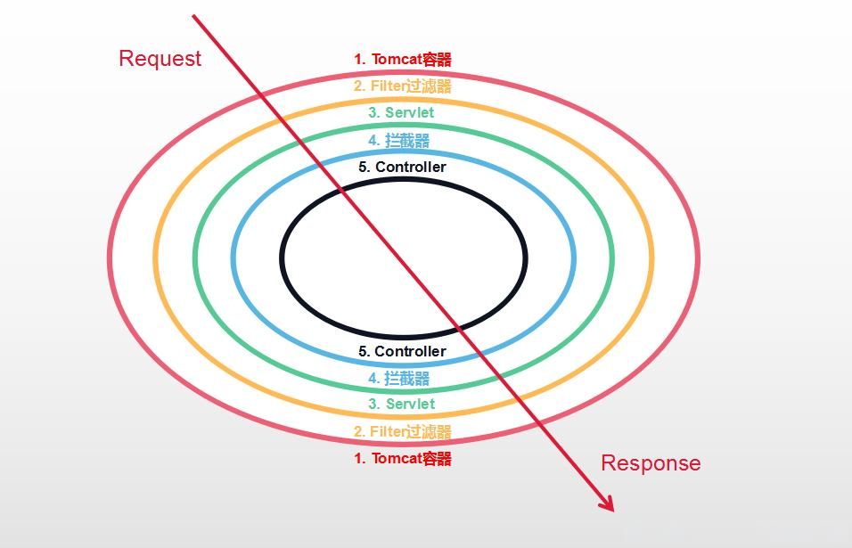

# 短视频

** 过滤器和拦截器的区别是什么,一个工作了三年的程序员 居然不知道，还跟我说为什么找工作这么难..结果一问都是些很简单的问题. 那我有整理一份80万字的八股文资料，里面基本都涵盖他遇到的这些面试题，需要的小伙伴可以再评论区扣666。**

****

我来给大家说下**过滤器和拦截器的区别**

 

首先过滤器和拦截器都可以在请求过程中插入一手，也可以拦腰截断。

他们的执行过程是这样的：

当一个请求进来！会先交给Web服务器提供的**过滤器，**再来到**Servlet**，那这个时候呢.. 有一个叫**DispatcherServlet** 的**Servlet**就会执行！在**DispatcherServlet** 中就会调用我们的**拦截器**，再由**DispatcherServlet** 分发给对应的**Controller** 处理我们的请求。

请求处理完之后呢..从调用的链路原路返回，再回到**拦截器， **然后再回到**过滤器**，最终响应给客户端！

****

所以他们的区别就是：

**过滤器，它先执行 ，****它是Servlet规范的一部分，**更接近于底层，它会在Servlet 请求之前和响应之后 进行处理。

****

**拦截器，它后执行，****它是SpringMVC的一部分，**更接近业务层**, **会在Controller 请求之前和处理完毕之后进行处理。

  

**其次呢**，他们的**使用方式也不同**

过滤器，需要依赖Servlet容器提供的Filter接口，多个过滤器根据配置顺序决定他们的执行顺序。

而 拦截器，需要依赖SpringMVC提供的HandlerInterceptor接口，多个拦截器的执行顺序由bean的配置顺序决定，可以通过Order注解来改变执行顺序。

**最后**，他们的**用途不同**。 

拦截器通常用来实现一跟业务相关不是必须的工作 像** ****身份认证与授权，接口的性能监控，跨域处理，日志记录 等**。

而过滤器通常实现那些必要的基础设施工作 ， 像**编码处理、视图响应、请求参数处理和URL重定向** 等。

所以！我们平常面向业务开发基本用不到过滤器， 用拦截器基本就已经满足我们的基本需求，而且拦截器天然集成spring，可以直接把bean自动装配进行，可以非常方便的执行业务处理。 

> 更新: 2024-05-10 15:10:37  
> 原文: <https://www.yuque.com/tulingzhouyu/db22bv/wypw6aid1tf8l9x1>