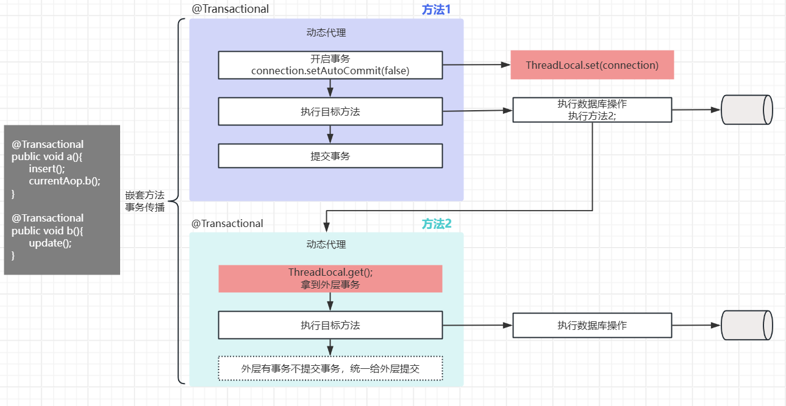

# Spring多线程事务 能否保证事务的一致性

<font style="color:rgb(55, 65, 81);background-color:rgb(247, 247, 248);">在多线程环境下，Spring事务管理默认情况下无法保证全局事务的一致性。这是因为Spring的本地事务管理是</font><font style="color:#DF2A3F;background-color:rgb(247, 247, 248);">基于线程</font><font style="color:rgb(55, 65, 81);background-color:rgb(247, 247, 248);">，</font><font style="color:#DF2A3F;background-color:rgb(247, 247, 248);">每个线程都有自己的独立事务</font><font style="color:rgb(55, 65, 81);background-color:rgb(247, 247, 248);">。</font>



<font style="color:rgb(55, 65, 81);background-color:rgb(247, 247, 248);">Spring的事务管理通常将事务信息存储在ThreadLocal中（为了实现事务传播），这意味着每个线程只能拥有一个事务。这确保了在单个线程内的数据库操作处于同一个事务中，保证了原子性。</font>

<font style="color:rgb(55, 65, 81);background-color:rgb(247, 247, 248);"></font>

## <font style="background-color:rgb(247, 247, 248);">可以通过如下方案进行解决：</font>
    - **<font style="background-color:rgb(247, 247, 248);">编程式事务：</font>**<font style="color:rgb(55, 65, 81);background-color:rgb(247, 247, 248);"> 为了在多线程环境中实现事务一致性，您可以使用编程式事务管理。这意味着您需要在代码中显式控制事务的边界和操作，确保在适当的时机提交或回滚事务。</font>
    - **<font style="background-color:rgb(247, 247, 248);">分布式事务：</font>**<font style="color:rgb(55, 65, 81);background-color:rgb(247, 247, 248);"> 如果您的应用程序需要跨多个资源（例如多个数据库）的全局事务一致性，那么您可能需要使用分布式事务管理（如2PC/3PC TCC等）来管理全局事务。这将确保所有参与的资源都处于相同的全局事务中，以保证一致性。</font>

<font style="color:rgb(55, 65, 81);background-color:rgb(247, 247, 248);">总之，在多线程环境中，Spring的本地事务管理需要额外的协调和管理才能实现事务一致性。这可以通过编程式事务、分布式事务管理器或二阶段提交等方式来实现，具体取决于您的应用程序需求和复杂性。</font>

<font style="color:rgb(55, 65, 81);background-color:rgb(247, 247, 248);"></font>

## <font style="background-color:rgb(247, 247, 248);">编程式事务示例</font>
<font style="background-color:rgb(247, 247, 248);">其核心是通过TransactionTemplate自己控制事务回滚来完成多线程事务</font>

```java

    @Autowired
    private JdbcTemplate jdbcTemplate;
    @Autowired  
    private TransactionTemplate transactionTemplate;

    private final ExecutorService executorService = Executors.newFixedThreadPool(2);

    // 主线程事务方法  
    public void mainThread() throws Exception {  
        transactionTemplate.execute(new TransactionCallback<Void>() {
            @Override  
            public Void doInTransaction(TransactionStatus status) {
                try {  
                    // 主事务的数据库操作  
                    jdbcTemplate.execute("INSERT INTO `test`.`user` (`age`, `name`, `city`) VALUES (18, 'xushu', 'BeiJin');");

                    // 启动子线程并执行子事务
                    Future<Void> future = executorService.submit(() -> {
						jdbcTemplate.execute("INSERT INTO `test`.`user` (`age`, `name`, `city`) VALUES (18, 'xushu', 'BeiJin');");
                        return null;
                    });

                    // 等待子线程完成
                    future.get();
                } catch (Exception e) {  
                    // 回滚主事务  
                    status.setRollbackOnly();  
                    throw new RuntimeException(e);  
                }  
                return null;  
            }  
        });  
    }   
```

## <font style="background-color:rgb(247, 247, 248);">分布式事务</font><font style="color:rgb(55, 65, 81);background-color:rgb(247, 247, 248);">2PC实例：</font>
分布式事务如果不懂，可以先去了解：

[分布式事务有哪些常见的实现方案](https://www.yuque.com/tulingzhouyu/db22bv/veg93i11n9qqs45e?singleDoc#)

 这里介绍2pc手动实现方式：

 

```java
public class TwoPhaseCommitService {
    @Autowired
    private final PlatformTransactionManager transactionManager;
    private final ExecutorService executor = Executors.newCachedThreadPool();
 

    public void executeMultiThreadTransaction() throws Exception {
        List<Future<Boolean>> futures = new ArrayList<>();
        List<TransactionStatus> transactionStatuses = new ArrayList<>();

        // 阶段一：提交所有子线程事务操作
        for (int i = 0; i < 5; i++) {
            Future<Boolean> future = executor.submit(() -> {
                TransactionTemplate transactionTemplate = new TransactionTemplate(transactionManager);
                TransactionStatus status = transactionManager.getTransaction(null);
                transactionStatuses.add(status);

                try {
                    // 执行业务操作（例如数据库更新）
                    transactionTemplate.execute(new TransactionCallbackWithoutResult() {
                        @Override
                        protected void doInTransactionWithoutResult(TransactionStatus status) {
                            // 数据库操作代码
                        }
                    });
                    return true; // 阶段一成功
                } catch (Exception e) {
                    transactionManager.rollback(status);
                    return false; // 阶段一失败
                }
            });
            futures.add(future);
        }

        // 检查所有子线程是否成功
        boolean allSuccess = futures.stream().allMatch(f -> {
            try {
                return f.get();
            } catch (InterruptedException | ExecutionException e) {
                return false;
            }
        });

        // 阶段二：统一提交或回滚
        if (allSuccess) {
            transactionStatuses.forEach(transactionManager::commit);
        } else {
            transactionStatuses.forEach(transactionManager::rollback);
        }
    }
}
```


> 更新: 2025-04-02 13:48:56  
> 原文: <https://www.yuque.com/tulingzhouyu/db22bv/qpaoo8nabf8490cn>