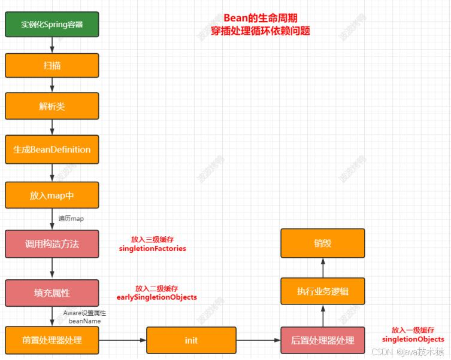
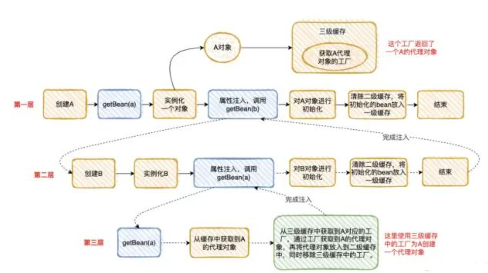

# Spring是如何解决Bean的循环依赖？

## 引入：<font style="color:rgba(0, 0, 0, 0.87);">循环依赖的场景</font>
<font style="color:rgba(0, 0, 0, 0.87);">假设有两个Bean</font><font style="color:rgba(0, 0, 0, 0.87);"> </font>**<font style="color:rgba(0, 0, 0, 0.87);">A</font>**<font style="color:rgba(0, 0, 0, 0.87);"> </font><font style="color:rgba(0, 0, 0, 0.87);">和</font><font style="color:rgba(0, 0, 0, 0.87);"> </font>**<font style="color:rgba(0, 0, 0, 0.87);">B</font>**<font style="color:rgba(0, 0, 0, 0.87);">，彼此依赖：</font>

+ **<font style="color:rgba(0, 0, 0, 0.87);">A</font>**<font style="color:rgba(0, 0, 0, 0.87);"> </font><font style="color:rgba(0, 0, 0, 0.87);">依赖</font><font style="color:rgba(0, 0, 0, 0.87);"> </font>**<font style="color:rgba(0, 0, 0, 0.87);">B</font>**<font style="color:rgba(0, 0, 0, 0.87);">（通过</font>`<font style="color:rgba(0, 0, 0, 0.87);background-color:rgb(241, 241, 241);">@Autowired</font>`<font style="color:rgba(0, 0, 0, 0.87);">注入）</font>
+ **<font style="color:rgba(0, 0, 0, 0.87);">B</font>**<font style="color:rgba(0, 0, 0, 0.87);"> 依赖 </font>**<font style="color:rgba(0, 0, 0, 0.87);">A</font>**<font style="color:rgba(0, 0, 0, 0.87);">（通过</font>`<font style="color:rgba(0, 0, 0, 0.87);background-color:rgb(241, 241, 241);">@Autowired</font>`<font style="color:rgba(0, 0, 0, 0.87);">注入）</font>

<font style="color:rgba(0, 0, 0, 0.87);">此时，Spring在创建Bean时会陷入“鸡生蛋、蛋生鸡”的问题。传统单线程构造方法无法解决此问题，但Spring通过 </font>**<font style="color:rgba(0, 0, 0, 0.87);">三级缓存</font>**<font style="color:rgba(0, 0, 0, 0.87);"> 机制打破僵局。当然处理此相互依赖你还能想到另外两种循环依赖的情况吗？（自，三）</font>

#### 简答
Spring是如何解决的循环依赖： 采用三级缓存解决的 就是三个Map ； 关键： 一定要有一个缓存保存它的早期对象作为死循环的出口

1. <font style="color:rgb(33, 37, 41);">1、一级缓存</font>**singletonObjects**<font style="color:rgb(33, 37, 41);">存</font>**<font style="color:rgb(33, 37, 41);">完整</font>**<font style="color:rgb(33, 37, 41);">单例bean。</font>  
<font style="color:rgb(33, 37, 41);">2、二级缓存</font>**earlySingletonObjects**<font style="color:rgb(33, 37, 41);">存放的是早期的bean，即</font>**<font style="color:rgb(33, 37, 41);">半成品</font>**<font style="color:rgb(33, 37, 41);">，此时还无法使用（只用于循环依赖提供的临时bean对象）。</font>  
<font style="color:rgb(33, 37, 41);">3、三级缓存</font>**singletonFactories** (循环依赖的出口，解决了循环依赖)。它存的<font style="color:rgb(33, 37, 41);">是一个</font>**<font style="color:rgb(33, 37, 41);">对象工厂</font>**<font style="color:rgb(33, 37, 41);">，用于创建对象并放入二级缓存中。同时，如果对象有Aop代理，则对象工厂返回代理对象。</font>

配合Bean生命周期图答：



## 面试官还可能问：
### <font style="color:rgb(0, 0, 0);">二级缓存能不能解决循环依赖？为何需要三级缓存？</font>
    1. <font style="color:rgb(0, 0, 0);"> 如果只是循环依赖导致的死循环的问题： 一级缓存就可以解决 ，但是无法解决在并发下获取不完整的Bean。</font>
    2. <font style="color:rgb(0, 0, 0);">二级可以完全解决简单的属性注入（如通过 setter 方法注入）循环依赖：  只是需要在实例化后就创建动态代理，</font><font style="color:rgba(0, 0, 0, 0.87);">导致逻辑复杂且性能下降，</font><font style="color:rgb(0, 0, 0);">不符合spring生命周期规范。</font>

<font style="color:rgb(0, 0, 0);"> 但是，如果 </font>`<font style="color:rgb(0, 0, 0);">A</font>`<font style="color:rgb(0, 0, 0);"> 在依赖注入后需要调用 </font>`<font style="color:rgb(0, 0, 0);">B</font>`<font style="color:rgb(0, 0, 0);"> 的某个方法，而这个方法依赖于 </font>`<font style="color:rgb(0, 0, 0);">B</font>`<font style="color:rgb(0, 0, 0);"> 的初始化操作（例如在 </font>`<font style="color:rgb(0, 0, 0);">afterPropertiesSet</font>`<font style="color:rgb(0, 0, 0);"> 方法中初始化的属性），此时使用二级缓存中的 </font>`<font style="color:rgb(0, 0, 0);">B</font>`<font style="color:rgb(0, 0, 0);"> 实例就会因为 </font>`<font style="color:rgb(0, 0, 0);">B</font>`<font style="color:rgb(0, 0, 0);"> 尚未完全初始化而导致错误。</font>

<font style="color:rgb(0, 0, 0);">故而需要三级缓存+工厂：通过</font><font style="color:rgba(0, 0, 0, 0.87);">延迟代理对象的生成，提前暴露引用只有在真正发生循环依赖时才创建代理，避免不必要的代理生成</font>

    3. <font style="color:rgba(0, 0, 0, 0.87);">当存在多个循环依赖关系交叉的情况时，二级缓存可能无法准确地提供正确的 Bean 实例。如A依赖B，B依赖C，C依赖A</font>

 示例1：需要依赖初始化后方法调用时

```java
@Component
public class ServiceA implements InitializingBean {
    private ServiceB serviceB;

    @Autowired
    public void setServiceB(ServiceB serviceB) {
        this.serviceB = serviceB;
    }

    @Override
    public void afterPropertiesSet() throws Exception {
        System.out.println("ServiceA init");
        serviceB.doSomething();
    }
}

@Component
public class ServiceB implements InitializingBean {
    private ServiceA serviceA;

    @Autowired
    public void setServiceA(ServiceA serviceA) {
        this.serviceA = serviceA;
    }

    @Override
    public void afterPropertiesSet() throws Exception {
        System.out.println("ServiceB init");
    }

    public void doSomething() {
        System.out.println("ServiceB do something");
    }
}
```

<font style="color:rgb(0, 0, 0);">在这个例子中，</font>`<font style="color:rgba(0, 0, 0, 0.9);">ServiceA</font>`<font style="color:rgb(0, 0, 0);"> 依赖于 </font>`<font style="color:rgba(0, 0, 0, 0.9);">ServiceB</font>`<font style="color:rgb(0, 0, 0);">，并通过 </font>`<font style="color:rgba(0, 0, 0, 0.9);">afterPropertiesSet</font>`<font style="color:rgb(0, 0, 0);"> 方法调用 </font>`<font style="color:rgba(0, 0, 0, 0.9);">ServiceB</font>`<font style="color:rgb(0, 0, 0);"> 的 </font>`<font style="color:rgba(0, 0, 0, 0.9);">doSomething</font>`<font style="color:rgb(0, 0, 0);"> 方法。而 </font>`<font style="color:rgba(0, 0, 0, 0.9);">ServiceB</font>`<font style="color:rgb(0, 0, 0);"> 也依赖于 </font>`<font style="color:rgba(0, 0, 0, 0.9);">ServiceA</font>`<font style="color:rgb(0, 0, 0);">。如果没有三级缓存，在创建 </font>`<font style="color:rgba(0, 0, 0, 0.9);">ServiceA</font>`<font style="color:rgb(0, 0, 0);"> 时，依赖注入的 </font>`<font style="color:rgba(0, 0, 0, 0.9);">ServiceB</font>`<font style="color:rgb(0, 0, 0);"> 可能还未完全初始化，从而导致错误。三级缓存确保了 </font>`<font style="color:rgba(0, 0, 0, 0.9);">ServiceB</font>`<font style="color:rgb(0, 0, 0);"> 在初始化完成后，</font>`<font style="color:rgba(0, 0, 0, 0.9);">ServiceA</font>`<font style="color:rgb(0, 0, 0);"> 可以获取到一个已经初始化完成的 </font>`<font style="color:rgba(0, 0, 0, 0.9);">ServiceB</font>`<font style="color:rgb(0, 0, 0);"> 实例。</font>

<font style="color:rgb(0, 0, 0);">示例2：多个循环依赖关系交叉</font>

```java
import org.springframework.beans.factory.InitializingBean;
import org.springframework.stereotype.Component;

@Component
public class ServiceA implements InitializingBean {
    private ServiceB serviceB;

    public ServiceA() {
        System.out.println("ServiceA Constructor");
    }

    @Autowired
    public void setServiceB(ServiceB serviceB) {
        this.serviceB = serviceB;
        System.out.println("ServiceA setServiceB");
    }

    @Override
    public void afterPropertiesSet() throws Exception {
        System.out.println("ServiceA init");
        serviceB.doSomething();
    }

    public void doSomething() {
        System.out.println("ServiceA doSomething");
    }
}

@Component
public class ServiceB implements InitializingBean {
    private ServiceC serviceC;

    public ServiceB() {
        System.out.println("ServiceB Constructor");
    }

    @Autowired
    public void setServiceC(ServiceC serviceC) {
        this.serviceC = serviceC;
        System.out.println("ServiceB setServiceC");
    }

    @Override
    public void afterPropertiesSet() throws Exception {
        System.out.println("ServiceB init");
        serviceC.doSomething();
    }

    public void doSomething() {
        System.out.println("ServiceB doSomething");
    }
}

@Component
public class ServiceC implements InitializingBean {
    private ServiceA serviceA;

    public ServiceC() {
        System.out.println("ServiceC Constructor");
    }

    @Autowired
    public void setServiceA(ServiceA serviceA) {
        this.serviceA = serviceA;
        System.out.println("ServiceC setServiceA");
    }

    @Override
    public void afterPropertiesSet() throws Exception {
        System.out.println("ServiceC init");
        serviceA.doSomething();
    }

    public void doSomething() {
        System.out.println("ServiceC doSomething");
    }
}
```

+ <font style="color:rgb(0, 0, 0);">依赖关系 ：在这个例子中，</font>`<font style="color:rgba(0, 0, 0, 0.9);">ServiceA</font>`<font style="color:rgb(0, 0, 0);"> 依赖于 </font>`<font style="color:rgba(0, 0, 0, 0.9);">ServiceB</font>`<font style="color:rgb(0, 0, 0);">，</font>`<font style="color:rgba(0, 0, 0, 0.9);">ServiceB</font>`<font style="color:rgb(0, 0, 0);"> 依赖于 </font>`<font style="color:rgba(0, 0, 0, 0.9);">ServiceC</font>`<font style="color:rgb(0, 0, 0);">，而 </font>`<font style="color:rgba(0, 0, 0, 0.9);">ServiceC</font>`<font style="color:rgb(0, 0, 0);"> 又依赖于 </font>`<font style="color:rgba(0, 0, 0, 0.9);">ServiceA</font>`<font style="color:rgb(0, 0, 0);">，形成一个循环依赖链。</font>
+ <font style="color:rgb(0, 0, 0);">二级缓存的局限性</font><font style="color:rgb(0, 0, 0);"> ：当创建 </font>`<font style="color:rgba(0, 0, 0, 0.9);">ServiceA</font>`<font style="color:rgb(0, 0, 0);"> 时，</font>`<font style="color:rgba(0, 0, 0, 0.9);">ServiceB</font>`<font style="color:rgb(0, 0, 0);"> 还未完全初始化完成。此时，二级缓存中存储的是 </font>`<font style="color:rgba(0, 0, 0, 0.9);">ServiceB</font>`<font style="color:rgb(0, 0, 0);"> 的 </font>`<font style="color:rgba(0, 0, 0, 0.9);">ObjectFactory</font>`<font style="color:rgb(0, 0, 0);">。当 </font>`<font style="color:rgba(0, 0, 0, 0.9);">ServiceA</font>`<font style="color:rgb(0, 0, 0);"> 的 </font>`<font style="color:rgba(0, 0, 0, 0.9);">afterPropertiesSet</font>`<font style="color:rgb(0, 0, 0);"> 方法调用 </font>`<font style="color:rgba(0, 0, 0, 0.9);">ServiceB</font>`<font style="color:rgb(0, 0, 0);"> 的 </font>`<font style="color:rgba(0, 0, 0, 0.9);">doSomething</font>`<font style="color:rgb(0, 0, 0);"> 方法时，</font>`<font style="color:rgba(0, 0, 0, 0.9);">ServiceB</font>`<font style="color:rgb(0, 0, 0);"> 的 </font>`<font style="color:rgba(0, 0, 0, 0.9);">doSomething</font>`<font style="color:rgb(0, 0, 0);"> 方法又会调用 </font>`<font style="color:rgba(0, 0, 0, 0.9);">ServiceC</font>`<font style="color:rgb(0, 0, 0);"> 的 </font>`<font style="color:rgba(0, 0, 0, 0.9);">doSomething</font>`<font style="color:rgb(0, 0, 0);"> 方法，而 </font>`<font style="color:rgba(0, 0, 0, 0.9);">ServiceC</font>`<font style="color:rgb(0, 0, 0);"> 又依赖于 </font>`<font style="color:rgba(0, 0, 0, 0.9);">ServiceA</font>`<font style="color:rgb(0, 0, 0);">。如果仅依赖二级缓存，</font>`<font style="color:rgba(0, 0, 0, 0.9);">ServiceC</font>`<font style="color:rgb(0, 0, 0);"> 在获取 </font>`<font style="color:rgba(0, 0, 0, 0.9);">ServiceA</font>`<font style="color:rgb(0, 0, 0);"> 实例时，可能会获取到一个尚未完全初始化的实例，导致错误。</font>
+ <font style="color:rgb(0, 0, 0);">三级缓存的作用 ：通过三级缓存，</font>`<font style="color:rgba(0, 0, 0, 0.9);">ServiceA</font>`<font style="color:rgb(0, 0, 0);"> 在其初始化方法执行完成之后，会被提前放入三级缓存中。当 </font>`<font style="color:rgba(0, 0, 0, 0.9);">ServiceC</font>`<font style="color:rgb(0, 0, 0);"> 需要依赖 </font>`<font style="color:rgba(0, 0, 0, 0.9);">ServiceA</font>`<font style="color:rgb(0, 0, 0);"> 时，可以获取到一个已经完成初始化的 </font>`<font style="color:rgba(0, 0, 0, 0.9);">ServiceA</font>`<font style="color:rgb(0, 0, 0);"> 实例，从而避免因为 </font>`<font style="color:rgba(0, 0, 0, 0.9);">ServiceA</font>`<font style="color:rgb(0, 0, 0);"> 未完全初始化而导致的错误。</font>

### <font style="color:rgb(0, 0, 0);">既然二级缓存解决不了的需要三级缓存，那能不能不要二级缓存呢？</font>
<font style="color:rgb(0, 0, 0);"> 假定套娃逻辑：A 需要找 B 和 C，但是 B 需要找 A，C 也需要找 A。</font>

<font style="color:rgb(0, 0, 0);">假如 A 需要进⾏ AOP，因为代理对象每次都是⽣成不同的对象，如果⼲掉第⼆级缓存，只有第⼀、三级缓存：</font>

<font style="color:rgb(0, 0, 0);">B 找到 A 时，直接通过三级缓存的⼯⼚的代理对象，⽣成对象 A1。</font>

<font style="color:rgb(0, 0, 0);">C 找到 A 时，直接通过三级缓存的⼯⼚的代理对象，⽣成对象 A2。</font>

**<font style="color:rgb(0, 0, 0);">看到问题没</font>**<font style="color:rgb(0, 0, 0);">？你通过 A 的⼯⼚的代理对象，⽣成了两个不同的对象 A1 和 A2，所以为了避免这种问题的出现，我们搞个⼆级缓存，把 A1 存下来，下次再获取时，直接从⼆级缓存获取，⽆需再⽣成新的代理对象。</font>

<font style="color:rgb(0, 0, 0);">所以“⼆级缓存”的⽬的是为了避免因为 AOP 创建多个对象，其中存储的是半成品的 AOP 的单例 bean。</font>

<font style="color:rgb(0, 0, 0);">如果没有 AOP 的话，我们其实只要 1、3 级缓存，就可以满⾜要求。</font>

 

### <font style="color:rgb(0, 0, 0);">Spring有没有解决多例Bean/</font><font style="color:rgba(0, 0, 0, 0.87);">原型Bean</font><font style="color:rgb(0, 0, 0);">的循环依赖？</font>


**<font style="color:rgba(0, 0, 0, 0.87);">（</font>**<font style="color:#000000;">@Scope(ConfigurableBeanFactory.SCOPE_PROTOTYPE)</font>**<font style="color:rgba(0, 0, 0, 0.87);">）</font>**

    4. <font style="color:rgb(0, 0, 0);">多例不会使用缓存进行存储（多例Bean每次使用都需要重新创建）</font>
    5. <font style="color:rgb(0, 0, 0);">不缓存早期对象就无法解决循环</font>
    6. <font style="color:rgb(0, 0, 0);">解决方案：避免原型bean的循环依赖，使用工厂方法延迟依赖注入或者使用@Lazy注解</font>

### <font style="color:rgb(0, 0, 0);">Spring有没有解决构造函数参数Bean的循环依赖？</font>
    7. <font style="color:rgb(0, 0, 0);">构造函数的循环依赖也是会报错（</font><font style="color:rgba(0, 0, 0, 0.87);background-color:rgb(241, 241, 241);">BeanCurrentlyInCreationException</font><font style="color:rgb(0, 0, 0);">）。原因：</font><font style="color:rgba(0, 0, 0, 0.87);">构造器注入在 </font>**<font style="color:rgba(0, 0, 0, 0.87);">实例化阶段</font>**<font style="color:rgba(0, 0, 0, 0.87);"> 就需要依赖对象，但此时Bean尚未放入三级缓存，无法提前暴露半成品对象</font>
    8. <font style="color:rgb(0, 0, 0);">可以通过人工进行解决：@Lazy </font>
        1. <font style="color:rgb(0, 0, 0);">就不会立即创建依赖的bean了</font>
        2. <font style="color:rgb(0, 0, 0);">而是等到用到才通过动态代理进行创建</font>
    9. 使用setter/Field注入代替构造器注入

### 更多细节深入：
#### **<font style="color:rgba(0, 0, 0, 0.87);">循环依赖与AOP代理的交互</font>**
**<font style="color:rgba(0, 0, 0, 0.87);">问题</font>**<font style="color:rgba(0, 0, 0, 0.87);">：当Bean被AOP代理（如</font>`<font style="color:rgba(0, 0, 0, 0.87);background-color:rgb(241, 241, 241);">@Transactional</font>`<font style="color:rgba(0, 0, 0, 0.87);">、</font>`<font style="color:rgba(0, 0, 0, 0.87);background-color:rgb(241, 241, 241);">@Async</font>`<font style="color:rgba(0, 0, 0, 0.87);">）时，Spring如何解决循环依赖？  
</font>**<font style="color:rgba(0, 0, 0, 0.87);">答案</font>**<font style="color:rgba(0, 0, 0, 0.87);">：</font>

+ **<font style="color:rgba(0, 0, 0, 0.87);">代理生成的时机</font>**<font style="color:rgba(0, 0, 0, 0.87);">：  
</font><font style="color:rgba(0, 0, 0, 0.87);">若Bean需要被代理（如通过JDK动态代理或CGLib），Spring在</font><font style="color:rgba(0, 0, 0, 0.87);"> </font>**<font style="color:rgba(0, 0, 0, 0.87);">三级缓存</font>**<font style="color:rgba(0, 0, 0, 0.87);"> </font><font style="color:rgba(0, 0, 0, 0.87);">的</font>`<font style="color:rgba(0, 0, 0, 0.87);background-color:rgb(241, 241, 241);">ObjectFactory</font>`<font style="color:rgba(0, 0, 0, 0.87);">中生成代理对象，而非原始对象。</font>

```java

// 示例：A和B均被@Transactional标记
@Service
public class A {
    @Autowired
    private B b;
}

@Service
public class B {
    @Autowired
    private A a;
}
```

    - **<font style="color:rgba(0, 0, 0, 0.87);">流程变化</font>**<font style="color:rgba(0, 0, 0, 0.87);">：当</font>`<font style="color:rgba(0, 0, 0, 0.87);background-color:rgb(241, 241, 241);">A</font>`<font style="color:rgba(0, 0, 0, 0.87);">的半成品对象被放入三级缓存后，后续获取</font>`<font style="color:rgba(0, 0, 0, 0.87);background-color:rgb(241, 241, 241);">A</font>`<font style="color:rgba(0, 0, 0, 0.87);">时，</font>`<font style="color:rgba(0, 0, 0, 0.87);background-color:rgb(241, 241, 241);">ObjectFactory</font>`<font style="color:rgba(0, 0, 0, 0.87);">会通过</font>`<font style="color:rgba(0, 0, 0, 0.87);background-color:rgb(241, 241, 241);">getEarlyBeanReference()</font>`<font style="color:rgba(0, 0, 0, 0.87);">生成代理对象，而非原始对象。</font>
    - **<font style="color:rgba(0, 0, 0, 0.87);">关键点</font>**<font style="color:rgba(0, 0, 0, 0.87);">：代理对象的依赖注入仍能正确完成，但开发者需注意</font>**<font style="color:rgba(0, 0, 0, 0.87);">代理对象的方法调用是否触发额外逻辑</font>**<font style="color:rgba(0, 0, 0, 0.87);">（如事务传播）。</font>

**<font style="color:rgba(0, 0, 0, 0.87);">陷阱</font>**<font style="color:rgba(0, 0, 0, 0.87);">：</font>

+ **<font style="color:rgba(0, 0, 0, 0.87);">自调用问题</font>**<font style="color:rgba(0, 0, 0, 0.87);">：若A的方法内部调用自己的另一个方法（未被AOP增强），由于代理对象的存在，可能无法触发预期切面（需通过</font>`<font style="color:rgba(0, 0, 0, 0.87);background-color:rgb(241, 241, 241);">AopContext.currentProxy()</font>`<font style="color:rgba(0, 0, 0, 0.87);">解决）。</font>


#### **<font style="color:rgba(0, 0, 0, 0.87);">不同作用域Bean的组合循环依赖</font>**
**<font style="color:rgba(0, 0, 0, 0.87);">场景</font>**<font style="color:rgba(0, 0, 0, 0.87);">：单例Bean依赖原型Bean，原型Bean又依赖单例Bean。  
</font>**<font style="color:rgba(0, 0, 0, 0.87);">示例</font>**<font style="color:rgba(0, 0, 0, 0.87);">：</font>

```java
@Scope(ConfigurableBeanFactory.SCOPE_PROTOTYPE)
@Component
public class PrototypeA {
    @Autowired
    private SingletonB b;  // 依赖单例Bean
}

@Component
public class SingletonB {
    @Autowired
    private PrototypeA a;  // 依赖原型Bean
}
```

**<font style="color:rgba(0, 0, 0, 0.87);">能否解决</font>**<font style="color:rgba(0, 0, 0, 0.87);">？</font>

+ **<font style="color:rgba(0, 0, 0, 0.87);">否</font>**<font style="color:rgba(0, 0, 0, 0.87);">：当</font>`<font style="color:rgba(0, 0, 0, 0.87);background-color:rgb(241, 241, 241);">SingletonB</font>`<font style="color:rgba(0, 0, 0, 0.87);">初始化时，尝试注入</font>`<font style="color:rgba(0, 0, 0, 0.87);background-color:rgb(241, 241, 241);">PrototypeA</font>`<font style="color:rgba(0, 0, 0, 0.87);">的新实例，而每个</font>`<font style="color:rgba(0, 0, 0, 0.87);background-color:rgb(241, 241, 241);">PrototypeA</font>`<font style="color:rgba(0, 0, 0, 0.87);">又需要注入</font>`<font style="color:rgba(0, 0, 0, 0.87);background-color:rgb(241, 241, 241);">SingletonB</font>`<font style="color:rgba(0, 0, 0, 0.87);">，导致无限递归。</font>
+ **<font style="color:rgba(0, 0, 0, 0.87);">根源</font>**<font style="color:rgba(0, 0, 0, 0.87);">：原型Bean无法通过缓存暴露半成品，即使依赖的单例Bean已存在，原型Bean每次仍需完整初始化。</font>

**<font style="color:rgba(0, 0, 0, 0.87);">解决方案</font>**<font style="color:rgba(0, 0, 0, 0.87);">：</font>

+ <font style="color:rgba(0, 0, 0, 0.87);">使用</font>`<font style="color:rgba(0, 0, 0, 0.87);background-color:rgb(241, 241, 241);">@Lazy</font>`<font style="color:rgba(0, 0, 0, 0.87);">延迟加载原型Bean：</font>

```java

@Component
public class SingletonB {
    @Lazy
    @Autowired
    private PrototypeA a;  // 延迟创建PrototypeA
}
```

---

#### **<font style="color:rgba(0, 0, 0, 0.87);"> Spring Boot中的自动配置与循环依赖</font>**
**<font style="color:rgba(0, 0, 0, 0.87);">问题</font>**<font style="color:rgba(0, 0, 0, 0.87);">：Spring Boot的自动配置是否更容易引入循环依赖？  
</font>**<font style="color:rgba(0, 0, 0, 0.87);">分析</font>**<font style="color:rgba(0, 0, 0, 0.87);">：</font>

+ <font style="color:rgba(0, 0, 0, 0.87);">自动配置通过</font>`<font style="color:rgba(0, 0, 0, 0.87);background-color:rgb(241, 241, 241);">@Conditional</font>`<font style="color:rgba(0, 0, 0, 0.87);">按需加载Bean，若多个自动配置类隐式依赖彼此，可能意外引入循环依赖。</font>
+ **<font style="color:rgba(0, 0, 0, 0.87);">调试方法</font>**<font style="color:rgba(0, 0, 0, 0.87);">：</font>
    - <font style="color:rgba(0, 0, 0, 0.87);">启用</font>`<font style="color:rgba(0, 0, 0, 0.87);background-color:rgb(241, 241, 241);">debug</font>`<font style="color:rgba(0, 0, 0, 0.87);">日志：</font>`<font style="color:rgba(0, 0, 0, 0.87);background-color:rgb(241, 241, 241);">spring.main.log-startup-info=true</font>`<font style="color:rgba(0, 0, 0, 0.87);">，查看Bean创建顺序。</font>
    - <font style="color:rgba(0, 0, 0, 0.87);">使用</font>`<font style="color:rgba(0, 0, 0, 0.87);background-color:rgb(241, 241, 241);">@AutoConfigureAfter</font>`<font style="color:rgba(0, 0, 0, 0.87);">或</font>`<font style="color:rgba(0, 0, 0, 0.87);background-color:rgb(241, 241, 241);">@AutoConfigureBefore</font>`<font style="color:rgba(0, 0, 0, 0.87);">显式控制自动配置类的加载顺序。</font>

**<font style="color:rgba(0, 0, 0, 0.87);">示例</font>**<font style="color:rgba(0, 0, 0, 0.87);">：</font>

```java


@Configuration
@AutoConfigureBefore(DataSourceAutoConfiguration.class)  // 强制在当前配置前加载
public class MyCustomAutoConfig {
    // 依赖其他自动配置的Bean
}
```

---

#### **<font style="color:rgba(0, 0, 0, 0.87);">循环依赖对启动性能的影响</font>**
**<font style="color:rgba(0, 0, 0, 0.87);">影响</font>**<font style="color:rgba(0, 0, 0, 0.87);">：</font>

+ **<font style="color:rgba(0, 0, 0, 0.87);">额外缓存操作</font>**<font style="color:rgba(0, 0, 0, 0.87);">：三级缓存的读写、工厂对象的生成会增加少量开销。</font>
+ **<font style="color:rgba(0, 0, 0, 0.87);">代理生成成本</font>**<font style="color:rgba(0, 0, 0, 0.87);">：若涉及AOP，循环依赖可能触发多次代理生成检查。</font>

**<font style="color:rgba(0, 0, 0, 0.87);">优化建议</font>**<font style="color:rgba(0, 0, 0, 0.87);">：</font>

+ **<font style="color:rgba(0, 0, 0, 0.87);">避免不必要的循环依赖</font>**<font style="color:rgba(0, 0, 0, 0.87);">：重构代码，使用Setter注入替代字段注入，降低耦合。</font>
+ **<font style="color:rgba(0, 0, 0, 0.87);">延迟加载</font>**<font style="color:rgba(0, 0, 0, 0.87);">：对非关键依赖使用</font>`<font style="color:rgba(0, 0, 0, 0.87);background-color:rgb(241, 241, 241);">@Lazy</font>`<font style="color:rgba(0, 0, 0, 0.87);">，减少启动时初始化的Bean数量。</font>

---

#### **<font style="color:rgba(0, 0, 0, 0.87);"> 替代设计模式避免循环依赖</font>**
**<font style="color:rgba(0, 0, 0, 0.87);">推荐实践</font>**<font style="color:rgba(0, 0, 0, 0.87);">：</font>

1. **<font style="color:rgba(0, 0, 0, 0.87);">依赖倒置（DIP）</font>**<font style="color:rgba(0, 0, 0, 0.87);">：通过接口解耦具体实现。</font>

```java


public interface ServiceA {
    void doSomething();
}

public interface ServiceB {
    void doSomething();
}

@Component
public class ServiceAImpl implements ServiceA {
    private final ServiceB serviceB;
    public ServiceAImpl(ServiceB serviceB) { this.serviceB = serviceB; }
}

@Component
public class ServiceBImpl implements ServiceB {
    private final ServiceA serviceA;
    public ServiceBImpl(ServiceA serviceA) { this.serviceA = serviceA; }
}
```

    - **<font style="color:rgba(0, 0, 0, 0.87);">仍会循环依赖</font>**<font style="color:rgba(0, 0, 0, 0.87);">：需结合事件驱动或回调机制进一步解耦。</font>
2. **<font style="color:rgba(0, 0, 0, 0.87);">事件发布-订阅模型</font>**<font style="color:rgba(0, 0, 0, 0.87);">：</font>

```java


@Component
public class ServiceA {
    @Autowired
    private ApplicationEventPublisher publisher;

    public void init() {
        publisher.publishEvent(new ServiceAReadyEvent(this));
    }
}

@Component
public class ServiceB {
    @EventListener
    public void handleServiceAReady(ServiceAReadyEvent event) {
        // 在ServiceA就绪后执行逻辑
    }
}
```

---

#### **<font style="color:rgba(0, 0, 0, 0.87);">Spring源码中的循环依赖处理（关键方法解析）</font>**
**<font style="color:rgba(0, 0, 0, 0.87);">核心类</font>**<font style="color:rgba(0, 0, 0, 0.87);">：</font>`<font style="color:rgba(0, 0, 0, 0.87);background-color:rgb(241, 241, 241);">AbstractAutowireCapableBeanFactory</font>`<font style="color:rgba(0, 0, 0, 0.87);">  
</font>**<font style="color:rgba(0, 0, 0, 0.87);">关键方法</font>**<font style="color:rgba(0, 0, 0, 0.87);">：</font>

+ `<font style="color:rgba(0, 0, 0, 0.87);background-color:rgb(241, 241, 241);">doCreateBean()</font>`<font style="color:rgba(0, 0, 0, 0.87);">：创建Bean实例，并调用</font>`<font style="color:rgba(0, 0, 0, 0.87);background-color:rgb(241, 241, 241);">addSingletonFactory()</font>`<font style="color:rgba(0, 0, 0, 0.87);">将工厂对象加入三级缓存。</font>
+ `<font style="color:rgba(0, 0, 0, 0.87);background-color:rgb(241, 241, 241);">getSingleton()</font>`<font style="color:rgba(0, 0, 0, 0.87);">：尝试从缓存获取Bean，若不存在则触发创建流程。</font>
+ `<font style="color:rgba(0, 0, 0, 0.87);background-color:rgb(241, 241, 241);">populateBean()</font>`<font style="color:rgba(0, 0, 0, 0.87);">：填充属性时检测循环依赖，递归解析依赖Bean。</font>

**<font style="color:rgba(0, 0, 0, 0.87);">源码片段</font>**<font style="color:rgba(0, 0, 0, 0.87);">：</font>

```java


// AbstractAutowireCapableBeanFactory.java
protected Object doCreateBean(..., RootBeanDefinition mbd, Object[] args) {
    // 1. 实例化Bean
    BeanWrapper instanceWrapper = createBeanInstance(beanName, mbd, args);
    Object bean = instanceWrapper.getWrappedInstance();

    // 2. 将Bean工厂加入三级缓存（解决循环依赖）
    addSingletonFactory(beanName, () -> getEarlyBeanReference(beanName, mbd, bean));

    // 3. 填充属性（可能触发依赖Bean的创建）
    populateBean(beanName, mbd, instanceWrapper);

    // 4. 初始化Bean（调用PostConstruct等）
    exposedObject = initializeBean(beanName, exposedObject, mbd);
    return exposedObject;
}
```

---

#### **<font style="color:rgba(0, 0, 0, 0.87);">Spring版本差异与循环依赖处理</font>**
**<font style="color:rgba(0, 0, 0, 0.87);">Spring 5.x的改进</font>**<font style="color:rgba(0, 0, 0, 0.87);">：</font>

+ **<font style="color:rgba(0, 0, 0, 0.87);">优化代理生成逻辑</font>**<font style="color:rgba(0, 0, 0, 0.87);">：减少不必要的代理检查，提升性能。</font>
+ **<font style="color:rgba(0, 0, 0, 0.87);">更清晰的错误提示</font>**<font style="color:rgba(0, 0, 0, 0.87);">：循环依赖链在异常信息中完整展示，便于调试。</font>
+ **<font style="color:rgba(0, 0, 0, 0.87);">构造函数注入的优化</font>**<font style="color:rgba(0, 0, 0, 0.87);">：通过</font>`<font style="color:rgba(0, 0, 0, 0.87);background-color:rgb(241, 241, 241);">Objenesis</font>`<font style="color:rgba(0, 0, 0, 0.87);">库支持部分构造器注入场景（非所有情况）。</font>

---

#### **<font style="color:rgba(0, 0, 0, 0.87);"> 单元测试中的循环依赖模拟</font>**
**<font style="color:rgba(0, 0, 0, 0.87);">测试场景</font>**<font style="color:rgba(0, 0, 0, 0.87);">：验证存在循环依赖时Spring能否正确处理。  
</font>**<font style="color:rgba(0, 0, 0, 0.87);">工具</font>**<font style="color:rgba(0, 0, 0, 0.87);">：</font>

+ `**<font style="color:rgba(0, 0, 0, 0.87);background-color:rgb(241, 241, 241);">@SpringBootTest</font>**`<font style="color:rgba(0, 0, 0, 0.87);">：启动完整上下文，触发Bean初始化。</font>
+ `**<font style="color:rgba(0, 0, 0, 0.87);background-color:rgb(241, 241, 241);">@MockBean</font>**`<font style="color:rgba(0, 0, 0, 0.87);">：模拟依赖的Bean，打破实际循环。</font>

**<font style="color:rgba(0, 0, 0, 0.87);">示例</font>**<font style="color:rgba(0, 0, 0, 0.87);">：</font>

```java


@SpringBootTest
public class CircularDependencyTest {
    @MockBean
    private ServiceB serviceB;  // 模拟ServiceB，避免真实依赖

    @Autowired
    private ServiceA serviceA;

    @Test
    public void testServiceA() {
        assertNotNull(serviceA);
    }
}
```

---

### **<font style="color:rgba(0, 0, 0, 0.87);">总结</font>**
<font style="color:rgba(0, 0, 0, 0.87);">循环依赖的深入问题涵盖代理交互、作用域组合、性能影响、设计模式替代方案及源码机制。理解这些细节有助于：</font>

1. <font style="color:rgba(0, 0, 0, 0.87);">高效排查启动错误。</font>
2. <font style="color:rgba(0, 0, 0, 0.87);">优化应用设计，降低耦合。</font>
3. <font style="color:rgba(0, 0, 0, 0.87);">在复杂场景下合理使用Spring特性。  
</font><font style="color:rgba(0, 0, 0, 0.87);">实际开发中，</font>**<font style="color:rgba(0, 0, 0, 0.87);">优先通过代码重构避免循环依赖</font>**<font style="color:rgba(0, 0, 0, 0.87);">，而非过度依赖框架机制。</font>


### <font style="color:rgba(0, 0, 0, 0.87);">tips:应部分学员要求继续加深到源码解读。</font>
<font style="color:rgba(0, 0, 0, 0.87);">不具备相关基础可忽略此部分</font>

#### **<font style="color:rgba(0, 0, 0, 0.87);">1. 核心类与关键方法</font>**
<font style="color:rgba(0, 0, 0, 0.87);">Spring 解决循环依赖的核心逻辑位于以下类中：</font>

+ `**<font style="color:rgba(0, 0, 0, 0.87);background-color:rgb(241, 241, 241);">DefaultSingletonBeanRegistry</font>**`<font style="color:rgba(0, 0, 0, 0.87);">：管理单例Bean的注册、缓存（三级缓存的核心实现）。</font>
+ `**<font style="color:rgba(0, 0, 0, 0.87);background-color:rgb(241, 241, 241);">AbstractAutowireCapableBeanFactory</font>**`<font style="color:rgba(0, 0, 0, 0.87);">：负责Bean的创建、属性填充、初始化。</font>
+ `**<font style="color:rgba(0, 0, 0, 0.87);background-color:rgb(241, 241, 241);">AbstractBeanFactory</font>**`<font style="color:rgba(0, 0, 0, 0.87);">：定义Bean的获取流程（</font>`<font style="color:rgba(0, 0, 0, 0.87);background-color:rgb(241, 241, 241);">getBean</font>`<font style="color:rgba(0, 0, 0, 0.87);"> </font><font style="color:rgba(0, 0, 0, 0.87);">方法的入口）。</font>

---

#### **<font style="color:rgba(0, 0, 0, 0.87);">2. 源码流程拆解</font>**
<font style="color:rgba(0, 0, 0, 0.87);">以下以</font><font style="color:rgba(0, 0, 0, 0.87);"> </font>**<font style="color:rgba(0, 0, 0, 0.87);">单例Bean A → 依赖 B → 单例Bean B → 依赖 A</font>**<font style="color:rgba(0, 0, 0, 0.87);"> </font><font style="color:rgba(0, 0, 0, 0.87);">的循环依赖场景为例，分析源码执行流程：</font>

---

##### **<font style="color:rgba(0, 0, 0, 0.87);">步骤1：获取Bean A（</font>**`**<font style="color:rgba(0, 0, 0, 0.87);background-color:rgb(241, 241, 241);">getBean("A")</font>**`**<font style="color:rgba(0, 0, 0, 0.87);">）</font>**
+ **<font style="color:rgba(0, 0, 0, 0.87);">入口方法</font>**<font style="color:rgba(0, 0, 0, 0.87);">：</font>`<font style="color:rgba(0, 0, 0, 0.87);background-color:rgb(241, 241, 241);">AbstractBeanFactory.getBean(String name)</font>`

```java
public Object getBean(String name) throws BeansException {
    return doGetBean(name, null, null, false);
}
```

+ **<font style="color:rgba(0, 0, 0, 0.87);">核心逻辑</font>**<font style="color:rgba(0, 0, 0, 0.87);">：调用</font><font style="color:rgba(0, 0, 0, 0.87);"> </font>`<font style="color:rgba(0, 0, 0, 0.87);background-color:rgb(241, 241, 241);">doGetBean</font>`<font style="color:rgba(0, 0, 0, 0.87);">，检查缓存中是否存在已初始化的Bean。</font>

---

##### **<font style="color:rgba(0, 0, 0, 0.87);">步骤2：检查三级缓存（</font>**`**<font style="color:rgba(0, 0, 0, 0.87);background-color:rgb(241, 241, 241);">DefaultSingletonBeanRegistry.getSingleton</font>**`**<font style="color:rgba(0, 0, 0, 0.87);">）</font>**
+ **<font style="color:rgba(0, 0, 0, 0.87);">方法</font>**<font style="color:rgba(0, 0, 0, 0.87);">：</font>`<font style="color:rgba(0, 0, 0, 0.87);background-color:rgb(241, 241, 241);">DefaultSingletonBeanRegistry.getSingleton(String beanName, boolean allowEarlyReference)</font>`

```java
protected Object getSingleton(String beanName, boolean allowEarlyReference) {
    // 1. 检查一级缓存（完全初始化的Bean）
    Object singletonObject = this.singletonObjects.get(beanName);
    if (singletonObject == null && isSingletonCurrentlyInCreation(beanName)) {
        // 2. 检查二级缓存（半成品Bean）
        singletonObject = this.earlySingletonObjects.get(beanName);
        if (singletonObject == null && allowEarlyReference) {
            synchronized (this.singletonObjects) {
                singletonObject = this.singletonObjects.get(beanName);
                if (singletonObject == null) {
                    singletonObject = this.earlySingletonObjects.get(beanName);
                    if (singletonObject == null) {
                        // 3. 检查三级缓存（Bean工厂）
                        ObjectFactory<?> singletonFactory = this.singletonFactories.get(beanName);
                        if (singletonFactory != null) {
                            // 通过工厂获取半成品Bean，并升级到二级缓存
                            singletonObject = singletonFactory.getObject();
                            this.earlySingletonObjects.put(beanName, singletonObject);
                            this.singletonFactories.remove(beanName);
                        }
                    }
                }
            }
        }
    }
    return singletonObject;
}
```

**<font style="color:rgba(0, 0, 0, 0.87);">关键点</font>**<font style="color:rgba(0, 0, 0, 0.87);">：</font>

    - <font style="color:rgba(0, 0, 0, 0.87);">一级缓存（</font>`<font style="color:rgba(0, 0, 0, 0.87);background-color:rgb(241, 241, 241);">singletonObjects</font>`<font style="color:rgba(0, 0, 0, 0.87);">）存储完全初始化的Bean。</font>
    - <font style="color:rgba(0, 0, 0, 0.87);">二级缓存（</font>`<font style="color:rgba(0, 0, 0, 0.87);background-color:rgb(241, 241, 241);">earlySingletonObjects</font>`<font style="color:rgba(0, 0, 0, 0.87);">）存储提前暴露的半成品Bean。</font>
    - <font style="color:rgba(0, 0, 0, 0.87);">三级缓存（</font>`<font style="color:rgba(0, 0, 0, 0.87);background-color:rgb(241, 241, 241);">singletonFactories</font>`<font style="color:rgba(0, 0, 0, 0.87);">）存储生成半成品Bean的工厂。</font>

---

##### **<font style="color:rgba(0, 0, 0, 0.87);">步骤3：创建Bean A（</font>**`**<font style="color:rgba(0, 0, 0, 0.87);background-color:rgb(241, 241, 241);">createBean</font>**`**<font style="color:rgba(0, 0, 0, 0.87);"> </font>****<font style="color:rgba(0, 0, 0, 0.87);">→</font>****<font style="color:rgba(0, 0, 0, 0.87);"> </font>**`**<font style="color:rgba(0, 0, 0, 0.87);background-color:rgb(241, 241, 241);">doCreateBean</font>**`**<font style="color:rgba(0, 0, 0, 0.87);">）</font>**
<font style="color:rgba(0, 0, 0, 0.87);">若缓存中无Bean A，进入创建流程：</font>

+ **<font style="color:rgba(0, 0, 0, 0.87);">方法</font>**<font style="color:rgba(0, 0, 0, 0.87);">：</font>`<font style="color:rgba(0, 0, 0, 0.87);background-color:rgb(241, 241, 241);">AbstractAutowireCapableBeanFactory.doCreateBean(String beanName, RootBeanDefinition mbd, Object[] args)</font>`

```java
protected Object doCreateBean(String beanName, RootBeanDefinition mbd, Object[] args) {
    // 1. 实例化Bean（此时对象尚未填充属性）
    BeanWrapper instanceWrapper = createBeanInstance(beanName, mbd, args);
    Object bean = instanceWrapper.getWrappedInstance();

    // 2. 将Bean的工厂对象加入三级缓存（关键步骤！）
    boolean earlySingletonExposure = (mbd.isSingleton() && 
                                      this.allowCircularReferences && 
                                      isSingletonCurrentlyInCreation(beanName));
    if (earlySingletonExposure) {
        // 添加ObjectFactory到三级缓存
        addSingletonFactory(beanName, () -> getEarlyBeanReference(beanName, mbd, bean));
    }

    // 3. 填充Bean属性（可能触发依赖Bean的创建）
    populateBean(beanName, mbd, instanceWrapper);

    // 4. 初始化Bean（执行PostConstruct、InitializingBean等）
    exposedObject = initializeBean(beanName, bean, mbd);

    return exposedObject;
}
```

**<font style="color:rgba(0, 0, 0, 0.87);">关键操作</font>**<font style="color:rgba(0, 0, 0, 0.87);">：</font>

    - `<font style="color:rgba(0, 0, 0, 0.87);background-color:rgb(241, 241, 241);">addSingletonFactory</font>`<font style="color:rgba(0, 0, 0, 0.87);"> </font><font style="color:rgba(0, 0, 0, 0.87);">将Bean A的工厂加入三级缓存。</font>
    - `<font style="color:rgba(0, 0, 0, 0.87);background-color:rgb(241, 241, 241);">getEarlyBeanReference</font>`<font style="color:rgba(0, 0, 0, 0.87);"> </font><font style="color:rgba(0, 0, 0, 0.87);">的触发时机：当发生循环依赖时，通过此工厂生成半成品Bean（可能为代理对象）。</font>

---

##### **<font style="color:rgba(0, 0, 0, 0.87);">步骤4：填充属性时触发Bean B的创建（</font>**`**<font style="color:rgba(0, 0, 0, 0.87);background-color:rgb(241, 241, 241);">populateBean</font>**`**<font style="color:rgba(0, 0, 0, 0.87);">）</font>**
+ **<font style="color:rgba(0, 0, 0, 0.87);">方法</font>**<font style="color:rgba(0, 0, 0, 0.87);">：</font>`<font style="color:rgba(0, 0, 0, 0.87);background-color:rgb(241, 241, 241);">AbstractAutowireCapableBeanFactory.populateBean</font>`

```java
protected void populateBean(String beanName, RootBeanDefinition mbd, BeanWrapper bw) {
    // 通过后置处理器进行属性注入（如@Autowired）
    for (BeanPostProcessor bp : getBeanPostProcessors()) {
        if (bp instanceof InstantiationAwareBeanPostProcessor) {
            // 触发依赖解析（可能调用getBean("B")）
            InstantiationAwareBeanPostProcessor ibp = (InstantiationAwareBeanPostProcessor) bp;
            ibp.postProcessProperties(pvs, bw.getWrappedInstance(), beanName);
        }
    }
}
```

**<font style="color:rgba(0, 0, 0, 0.87);">此时流程</font>**<font style="color:rgba(0, 0, 0, 0.87);">：</font>

    - <font style="color:rgba(0, 0, 0, 0.87);">填充Bean A的属性时发现依赖Bean B，触发</font><font style="color:rgba(0, 0, 0, 0.87);"> </font>`<font style="color:rgba(0, 0, 0, 0.87);background-color:rgb(241, 241, 241);">getBean("B")</font>`<font style="color:rgba(0, 0, 0, 0.87);">。</font>
    - <font style="color:rgba(0, 0, 0, 0.87);">Bean B的创建流程与Bean A类似，当填充B的属性时，再次触发</font><font style="color:rgba(0, 0, 0, 0.87);"> </font>`<font style="color:rgba(0, 0, 0, 0.87);background-color:rgb(241, 241, 241);">getBean("A")</font>`<font style="color:rgba(0, 0, 0, 0.87);">。</font>

---

##### **<font style="color:rgba(0, 0, 0, 0.87);">步骤5：再次获取Bean A（触发三级缓存）</font>**
<font style="color:rgba(0, 0, 0, 0.87);">当</font><font style="color:rgba(0, 0, 0, 0.87);"> </font>`<font style="color:rgba(0, 0, 0, 0.87);background-color:rgb(241, 241, 241);">getBean("A")</font>`<font style="color:rgba(0, 0, 0, 0.87);"> </font><font style="color:rgba(0, 0, 0, 0.87);">再次被调用时：</font>

1. <font style="color:rgba(0, 0, 0, 0.87);">一级缓存中无Bean A。</font>
2. <font style="color:rgba(0, 0, 0, 0.87);">检查到Bean A正在创建中（</font>`<font style="color:rgba(0, 0, 0, 0.87);background-color:rgb(241, 241, 241);">isSingletonCurrentlyInCreation("A")</font>`<font style="color:rgba(0, 0, 0, 0.87);"> </font><font style="color:rgba(0, 0, 0, 0.87);">返回</font><font style="color:rgba(0, 0, 0, 0.87);"> </font>`<font style="color:rgba(0, 0, 0, 0.87);background-color:rgb(241, 241, 241);">true</font>`<font style="color:rgba(0, 0, 0, 0.87);">）。</font>
3. <font style="color:rgba(0, 0, 0, 0.87);">从三级缓存中获取Bean A的工厂，生成半成品Bean A，并升级到二级缓存。</font>
4. <font style="color:rgba(0, 0, 0, 0.87);">将半成品Bean A注入Bean B，完成Bean B的初始化。</font>
5. <font style="color:rgba(0, 0, 0, 0.87);">Bean B实例化完成后，回到Bean A的</font><font style="color:rgba(0, 0, 0, 0.87);"> </font>`<font style="color:rgba(0, 0, 0, 0.87);background-color:rgb(241, 241, 241);">populateBean</font>`<font style="color:rgba(0, 0, 0, 0.87);"> </font><font style="color:rgba(0, 0, 0, 0.87);">流程，将Bean B注入Bean A。</font>
6. <font style="color:rgba(0, 0, 0, 0.87);">最后完成Bean A的初始化，将其放入一级缓存。</font>

---

#### **<font style="color:rgba(0, 0, 0, 0.87);">3. 源码中的关键设计</font>**
##### **<font style="color:rgba(0, 0, 0, 0.87);">设计1：三级缓存的必要性</font>**
+ **<font style="color:rgba(0, 0, 0, 0.87);">三级缓存（</font>**`**<font style="color:rgba(0, 0, 0, 0.87);background-color:rgb(241, 241, 241);">singletonFactories</font>**`**<font style="color:rgba(0, 0, 0, 0.87);">）</font>**<font style="color:rgba(0, 0, 0, 0.87);">：存储</font><font style="color:rgba(0, 0, 0, 0.87);"> </font>`<font style="color:rgba(0, 0, 0, 0.87);background-color:rgb(241, 241, 241);">ObjectFactory</font>`<font style="color:rgba(0, 0, 0, 0.87);">，允许在需要时才生成半成品Bean（处理AOP代理时尤为重要）。</font>
+ **<font style="color:rgba(0, 0, 0, 0.87);">延迟代理生成</font>**<font style="color:rgba(0, 0, 0, 0.87);">：若Bean需要AOP代理，通过</font><font style="color:rgba(0, 0, 0, 0.87);"> </font>`<font style="color:rgba(0, 0, 0, 0.87);background-color:rgb(241, 241, 241);">getEarlyBeanReference()</font>`<font style="color:rgba(0, 0, 0, 0.87);"> </font><font style="color:rgba(0, 0, 0, 0.87);">生成代理对象，避免重复生成。</font>

##### **<font style="color:rgba(0, 0, 0, 0.87);">设计2：循环依赖检测</font>**
+ **<font style="color:rgba(0, 0, 0, 0.87);">记录创建中的Bean</font>**<font style="color:rgba(0, 0, 0, 0.87);">：通过</font><font style="color:rgba(0, 0, 0, 0.87);"> </font>`<font style="color:rgba(0, 0, 0, 0.87);background-color:rgb(241, 241, 241);">singletonsCurrentlyInCreation</font>`<font style="color:rgba(0, 0, 0, 0.87);"> </font><font style="color:rgba(0, 0, 0, 0.87);">集合（</font>`<font style="color:rgba(0, 0, 0, 0.87);background-color:rgb(241, 241, 241);">Set<String></font>`<font style="color:rgba(0, 0, 0, 0.87);">）记录当前正在创建的Bean名称。</font>
+ **<font style="color:rgba(0, 0, 0, 0.87);">异常抛出</font>**<font style="color:rgba(0, 0, 0, 0.87);">：当检测到循环依赖无法解决时（如构造器注入），抛出</font><font style="color:rgba(0, 0, 0, 0.87);"> </font>`<font style="color:rgba(0, 0, 0, 0.87);background-color:rgb(241, 241, 241);">BeanCurrentlyInCreationException</font>`<font style="color:rgba(0, 0, 0, 0.87);">。</font>

---

#### **<font style="color:rgba(0, 0, 0, 0.87);">4. 构造器注入为何无法解决循环依赖？</font>**
**<font style="color:rgba(0, 0, 0, 0.87);">源码证据</font>**<font style="color:rgba(0, 0, 0, 0.87);">：</font>

+ <font style="color:rgba(0, 0, 0, 0.87);">构造器注入在实例化阶段（</font>`<font style="color:rgba(0, 0, 0, 0.87);background-color:rgb(241, 241, 241);">createBeanInstance</font>`<font style="color:rgba(0, 0, 0, 0.87);">）就需要完成依赖注入：</font>

```java
protected BeanWrapper createBeanInstance(String beanName, RootBeanDefinition mbd, Object[] args) {
    // 解析构造器参数（可能触发依赖Bean的创建）
    Constructor<?> constructorToUse = determineConstructor(beanName, mbd);
    return instantiateBean(beanName, mbd, constructorToUse, args);
}
```

**<font style="color:rgba(0, 0, 0, 0.87);">问题</font>**<font style="color:rgba(0, 0, 0, 0.87);">：此时Bean尚未放入三级缓存，导致依赖的Bean无法获取半成品对象，最终抛出异常。</font>

---

#### **<font style="color:rgba(0, 0, 0, 0.87);">5. AOP代理与循环依赖的结合</font>**
**<font style="color:rgba(0, 0, 0, 0.87);">核心方法</font>**<font style="color:rgba(0, 0, 0, 0.87);">：</font>`<font style="color:rgba(0, 0, 0, 0.87);background-color:rgb(241, 241, 241);">AbstractAutowireCapableBeanFactory.getEarlyBeanReference()</font>`

```java
protected Object getEarlyBeanReference(String beanName, RootBeanDefinition mbd, Object bean) {
    Object exposedObject = bean;
    // 通过后置处理器生成代理对象（如需要）
    for (BeanPostProcessor bp : getBeanPostProcessors()) {
        if (bp instanceof SmartInstantiationAwareBeanPostProcessor) {
            SmartInstantiationAwareBeanPostProcessor ibp = (SmartInstantiationAwareBeanPostProcessor) bp;
            exposedObject = ibp.getEarlyBeanReference(exposedObject, beanName);
        }
    }
    return exposedObject;
}
```

**<font style="color:rgba(0, 0, 0, 0.87);">流程</font>**<font style="color:rgba(0, 0, 0, 0.87);">：</font>

+ <font style="color:rgba(0, 0, 0, 0.87);">若Bean需要代理（如标记了</font><font style="color:rgba(0, 0, 0, 0.87);"> </font>`<font style="color:rgba(0, 0, 0, 0.87);background-color:rgb(241, 241, 241);">@Transactional</font>`<font style="color:rgba(0, 0, 0, 0.87);">），此处会返回代理对象。</font>
+ <font style="color:rgba(0, 0, 0, 0.87);">注入到其他Bean中的是代理对象，而非原始Bean。</font>

---

### **<font style="color:rgba(0, 0, 0, 0.87);">图解总结</font>**


### <font style="color:rgba(0, 0, 0, 0.9);">工作流程示例</font>
1. <font style="color:rgba(0, 0, 0, 0.9);">当创建一个单例 Bean A 时，Spring 首先会检查</font>`<font style="color:rgba(0, 0, 0, 0.9);">singletonObjects</font>`<font style="color:rgba(0, 0, 0, 0.9);">中是否已经有这个 Bean，如果没有，就继续创建过程。</font>
2. <font style="color:rgba(0, 0, 0, 0.9);">在创建 Bean A 的过程中，会将一个</font>`<font style="color:rgba(0, 0, 0, 0.9);">ObjectFactory</font>`<font style="color:rgba(0, 0, 0, 0.9);">对象放入</font>`<font style="color:rgba(0, 0, 0, 0.9);">singletonFactories</font>`<font style="color:rgba(0, 0, 0, 0.9);">中。</font>
3. <font style="color:rgba(0, 0, 0, 0.9);">如果在创建 Bean A 的过程中，需要注入另一个单例 Bean B，而 Bean B 又依赖于 Bean A，此时 Spring 会尝试从</font>`<font style="color:rgba(0, 0, 0, 0.9);">singletonObjects</font>`<font style="color:rgba(0, 0, 0, 0.9);">中获取 Bean A，如果获取不到，就从</font>`<font style="color:rgba(0, 0, 0, 0.9);">singletonFactories</font>`<font style="color:rgba(0, 0, 0, 0.9);">中获取对应的</font>`<font style="color:rgba(0, 0, 0, 0.9);">ObjectFactory</font>`<font style="color:rgba(0, 0, 0, 0.9);">来创建 Bean A 的实例，并将其放入</font>`<font style="color:rgba(0, 0, 0, 0.9);">earlySingletonObjects</font>`<font style="color:rgba(0, 0, 0, 0.9);">中提前暴露。</font>
4. <font style="color:rgba(0, 0, 0, 0.9);">这样，在创建 Bean B 时，就可以从</font>`<font style="color:rgba(0, 0, 0, 0.9);">earlySingletonObjects</font>`<font style="color:rgba(0, 0, 0, 0.9);">中获取到提前暴露的 Bean A 实例，完成依赖注入。</font>
5. <font style="color:rgba(0, 0, 0, 0.9);">当 Bean A 完全初始化完成后，将其从</font>`<font style="color:rgba(0, 0, 0, 0.9);">earlySingletonObjects</font>`<font style="color:rgba(0, 0, 0, 0.9);">和</font>`<font style="color:rgba(0, 0, 0, 0.9);">singletonFactories</font>`<font style="color:rgba(0, 0, 0, 0.9);">中移除，并放入</font>`<font style="color:rgba(0, 0, 0, 0.9);">singletonObjects</font>`<font style="color:rgba(0, 0, 0, 0.9);">中，供后续的获取请求使用。</font>

<font style="color:rgba(0, 0, 0, 0.87);"></font>

<font style="color:rgba(0, 0, 0, 0.87);">Spring通过三级缓存和</font>**<font style="color:rgba(0, 0, 0, 0.87);">提前暴露半成品Bean</font>**<font style="color:rgba(0, 0, 0, 0.87);">的机制解决单例Bean的循环依赖。</font>

<font style="color:rgba(0, 0, 0, 0.87);">提前暴露：还没有完全初始化完成时（即还没有将依赖的其他Bean注入进去），如果有另一个Bean依赖于它，此时就需要能够提前暴露一个正在创建中的Bean的引用，以便后续的依赖注入过程中可以获取到这个正在创建中的Bean，而不是等到它完全初始化完成后才能获取。</font>

### **<font style="color:rgba(0, 0, 0, 0.87);">关键源码节点标注</font>**
| **<font style="color:rgb(51, 51, 51);">步骤</font>** | **<font style="color:rgb(51, 51, 51);">对应源码方法/类</font>** |
| :---: | :---: |
| <font style="color:rgba(0, 0, 0, 0.87);">检查三级缓存</font> | `<font style="color:rgba(0, 0, 0, 0.87);background-color:rgb(241, 241, 241);">DefaultSingletonBeanRegistry.getSingleton()</font>` |
| <font style="color:rgba(0, 0, 0, 0.87);">创建实例</font> | `<font style="color:rgba(0, 0, 0, 0.87);background-color:rgb(241, 241, 241);">AbstractAutowireCapableBeanFactory.createBeanInstance()</font>` |
| <font style="color:rgba(0, 0, 0, 0.87);">加入三级缓存</font> | `<font style="color:rgba(0, 0, 0, 0.87);background-color:rgb(241, 241, 241);">DefaultSingletonBeanRegistry.addSingletonFactory()</font>` |
| <font style="color:rgba(0, 0, 0, 0.87);">填充属性</font> | `<font style="color:rgba(0, 0, 0, 0.87);background-color:rgb(241, 241, 241);">AbstractAutowireCapableBeanFactory.populateBean()</font>` |
| <font style="color:rgba(0, 0, 0, 0.87);">生成半成品代理</font> | `<font style="color:rgba(0, 0, 0, 0.87);background-color:rgb(241, 241, 241);">AbstractAutowireCapableBeanFactory.getEarlyBeanReference()</font>` |


**<font style="color:rgba(0, 0, 0, 0.87);">避坑指南</font>**<font style="color:rgba(0, 0, 0, 0.87);">：</font>

+ <font style="color:rgba(0, 0, 0, 0.87);">避免构造器注入的循环依赖。</font>
+ <font style="color:rgba(0, 0, 0, 0.87);">原型Bean的循环依赖无法解决，需通过设计重构或</font><font style="color:rgba(0, 0, 0, 0.87);"> </font>`<font style="color:rgba(0, 0, 0, 0.87);background-color:rgb(241, 241, 241);">@Lazy</font>`<font style="color:rgba(0, 0, 0, 0.87);"> </font><font style="color:rgba(0, 0, 0, 0.87);">注解规避。</font>
+ <font style="color:rgba(0, 0, 0, 0.87);">理解源码后，可更高效地调试循环依赖问题，优化应用设计。</font>

<font style="color:rgba(0, 0, 0, 0.87);"></font>

<font style="color:rgba(0, 0, 0, 0.87);"></font>

<font style="color:rgba(0, 0, 0, 0.87);"></font>

<font style="color:rgba(0, 0, 0, 0.87);"></font>


> 更新: 2025-04-28 14:46:36  
> 原文: <https://www.yuque.com/tulingzhouyu/db22bv/ys4ul3b33vkyl82e>