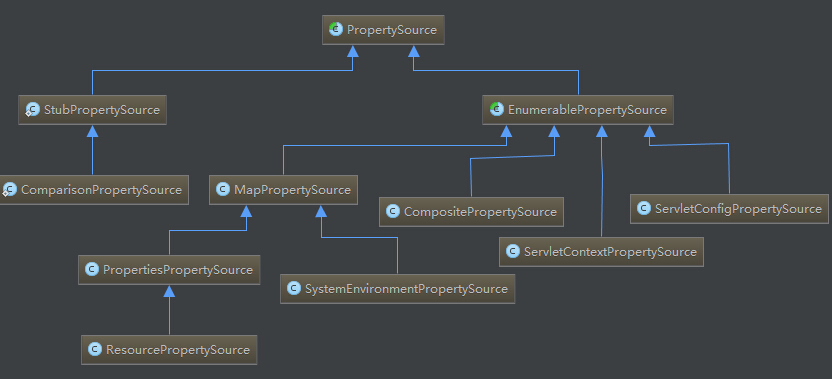
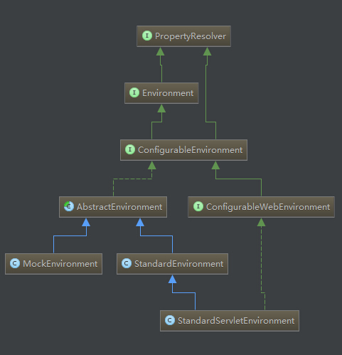
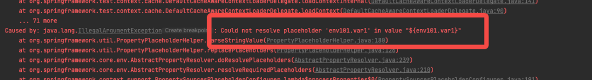
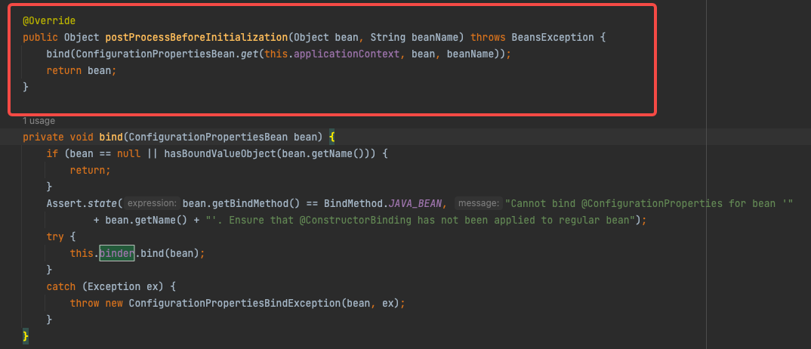
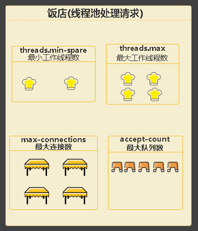
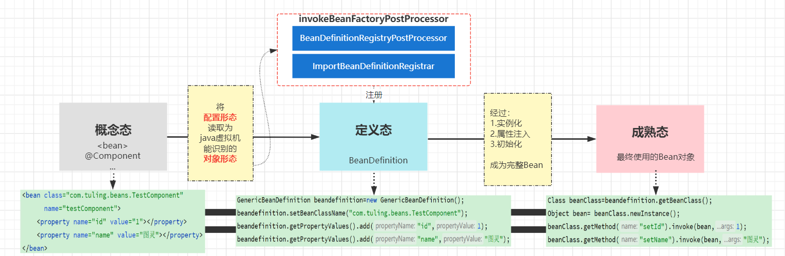
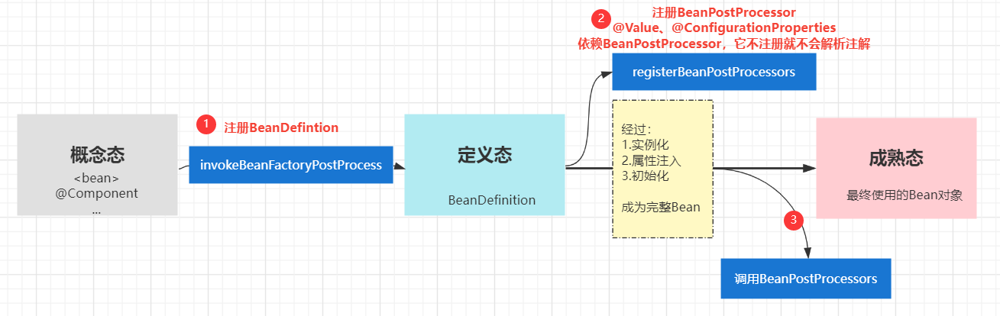
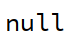

# 💎SpringBoot 面试题集合

# <font style="color:#01B2BC;">SpringBoot 使用 Validation 进行参数校验并统一返回校验异常</font>
<font style="color:#000000;">在 SpringBoot项目开发中，有一个观点是不要相信前端传入的参数，因为你不知道用户是怎么操作我们接口的，所以在后端也需要对参数进行校验，这篇文章主要讲讲我们项目中最常使用的验证方案。</font>

### <font style="color:#000000;">引入相应的依赖</font>
```xml
<dependency>
  <groupId>org.springframework.boot</groupId>
  <artifactId>spring-boot-starter-validation</artifactId>
</dependency>
```

<font style="color:#000000;">spring-boot-starter-validation</font><font style="color:#000000;">本质是使用的</font><font style="color:#000000;">Hibernate Validator</font><font style="color:#000000;">，它并没有自己的实现。</font>

### <font style="color:#000000;">Validation的基本校验注解</font>
| **<font style="color:#000000;">注解</font>** | **<font style="color:#000000;">描述</font>** |
| :--- | :--- |
| **<font style="color:#000000;">@Null</font>** | <font style="color:#000000;">验证对象是否为null</font> |
| **<font style="color:#000000;">@NotNull</font>** | <font style="color:#000000;">验证对象是否不为null，无法检查长度为0的字符串</font> |
| **<font style="color:#000000;">@NotBlank</font>** | <font style="color:#000000;">检查约束字符串是否为null，且被Trim后的长度是否大于0，只适用于字符串，会去掉前后空格</font> |
| **<font style="color:#000000;">@NotEmpty</font>** | <font style="color:#000000;">检查约束元素是否为NULL或者是EMPTY</font> |
| **<font style="color:#000000;">@AssertTrue</font>** | <font style="color:#000000;">验证Boolean对象是否为true</font> |
| **<font style="color:#000000;">@AssertFalse</font>** | <font style="color:#000000;">验证Boolean对象是否为false</font> |
| **<font style="color:#000000;">@Size(min=, max=)</font>** | <font style="color:#000000;">验证对象（Array、Collection、Map、String）长度是否在给定的范围之内</font> |
| **<font style="color:#000000;">@Length(min=, max=)</font>** | <font style="color:#000000;">验证注解的元素值长度是否在min和max区间内</font> |
| **<font style="color:#000000;">@Past</font>** | <font style="color:#000000;">验证Date和Calendar对象是否在当前时间之前</font> |
| **<font style="color:#000000;">@Future</font>** | <font style="color:#000000;">验证Date和Calendar对象是否在当前时间之后</font> |
| **<font style="color:#000000;">@Pattern</font>** | <font style="color:#000000;">验证String对象是否符合正则表达式的规则</font> |
| **<font style="color:#000000;">@Min</font>** | <font style="color:#000000;">验证Number和String对象是否大等于指定的值</font> |
| **<font style="color:#000000;">@Max</font>** | <font style="color:#000000;">验证Number和String对象是否小等于指定的值</font> |
| **<font style="color:#000000;">@DecimalMax</font>** | <font style="color:#000000;">被标注的值必须不大于约束中指定的最大值，参数为通过BigDecimal定义的最大值的字符串表示，小数存在精度</font> |
| **<font style="color:#000000;">@DecimalMin</font>** | <font style="color:#000000;">被标注的值必须不小于约束中指定的最小值，参数为通过BigDecimal定义的最小值的字符串表示，小数存在精度</font> |
| **<font style="color:#000000;">@Digits</font>** | <font style="color:#000000;">验证Number和String的构成是否合法</font> |
| **<font style="color:#000000;">@Digits(integer=,fraction=)</font>** | <font style="color:#000000;">验证字符串是否符合指定格式的数字，</font>**<font style="color:#000000;">integer</font>**<font style="color:#000000;">指定整数精度，</font>**<font style="color:#000000;">fraction</font>**<font style="color:#000000;">指定小数精度</font> |
| **<font style="color:#000000;">@Range(min=, max=)</font>** | <font style="color:#000000;">验证注解的元素值在最小值和最大值之间</font> |
| **<font style="color:#000000;">@Range(min=10000,max=50000,message="range.bean.wage")</font>** | <font style="color:#000000;">验证注解的元素值在最小值10000和最大值50000之间，自定义错误信息为"range.bean.wage"</font> |
| **<font style="color:#000000;">@Valid</font>** | <font style="color:#000000;">写在方法参数前，递归地对该对象进行校验，如果关联对象是集合或数组，则对其中的元素进行递归校验；如果是一个map，则对其中的值部分进行校验（是否进行递归验证）</font> |
| **<font style="color:#000000;">@CreditCardNumber</font>** | <font style="color:#000000;">信用卡验证</font> |
| **<font style="color:#000000;">@Email</font>** | <font style="color:#000000;">验证是否是邮件地址，如果为null，不进行验证，算通过验证</font> |
| **<font style="color:#000000;">@ScriptAssert(lang= ,script=, alias=)</font>** | <font style="color:#000000;">自定义脚本验证</font> |
| **<font style="color:#000000;">@URL(protocol=,host=, port=,regexp=, flags=)</font>** | <font style="color:#000000;">验证URL的格式是否正确，可以指定协议</font> |


### <font style="color:#000000;">添加参数校验</font>
<font style="color:#000000;">在我们对应的</font><font style="color:#000000;">DTO</font><font style="color:#000000;">上并在</font><font style="color:#000000;">controller</font><font style="color:#000000;">的上添加校验。</font>

#### <font style="color:#000000;">在</font><font style="color:#000000;">DTO</font><font style="color:#000000;">的属性上添加校验	</font>
<font style="color:#000000;">通过在参数上添加各种校验注解实现校验</font>

```java
import com.fasterxml.jackson.annotation.JsonIgnore;
import lombok.AllArgsConstructor;
import lombok.Data;
import lombok.NoArgsConstructor;
import org.hibernate.validator.constraints.Length;

import javax.validation.constraints.Email;
import javax.validation.constraints.Max;
import javax.validation.constraints.Min;
import javax.validation.constraints.NotBlank;
import java.util.UUID;

@Data
@AllArgsConstructor
@NoArgsConstructor
public class registryUserDto {
    @NotBlank(message = "用户名不能为空")
    private String username;
    @NotBlank(message = "密码不能为空")
    @Length(min = 6, max = 20, message = "密码长度在6-20之间")
    private String password;
    @Min(value = 0, message = "年龄最小为0")
    @Max(value = 200, message = "年龄最大为200")
    private Integer age;
    @NotBlank(message = "邮箱不能为空")
    @Email(message = "邮箱格式不正确")
    private String email;
    @JsonIgnore
    private String salt = UUID.randomUUID().toString().replaceAll("-", "");
    private Boolean admin;
}
```

#### <font style="color:#000000;">在</font><font style="color:#000000;">controller</font><font style="color:#000000;">对应的</font><font style="color:#000000;">DTO</font><font style="color:#000000;">添加</font><font style="color:#000000;">@Valid</font><font style="color:#000000;">或者</font><font style="color:#000000;">@Validated</font>
```java
@PostMapping("/registry")
public ResponseResult registryUser(@RequestBody @Valid registryUserDto registryUserDto) {
    return ResponseResult.okResult(registryUserDto);
}
```

<font style="color:#000000;">这样添加后就可以对其中的参数实现校验了，当校验失败时接口就会返回</font>`<font style="color:#000000;">500</font>`<font style="color:#000000;">异常和相应的异常信息。</font>

#### <font style="color:#000000;">对于复杂String校验我们可以使用正则来校验，如下所示：</font>
```java
@Pattern(regexp = "^1(3|4|5|7|8)\d{9}$",message = "手机号码格式错误")
@NotBlank(message = "手机号码不能为空")
private String phone;
```

<font style="color:#000000;">另外对于单个参数的校验，没有用</font><font style="color:#000000;">DTO对象</font><font style="color:#000000;">来接收的参数也可以校验，先在</font><font style="color:#000000;">controller</font><font style="color:#000000;">类上添加</font><font style="color:#000000;">@Validated</font><font style="color:#000000;">，再在对应的参数前加</font><font style="color:#000000;">校验注解</font><font style="color:#000000;">，如下所示：</font>

```java
@RestController
@RequestMapping("/user")
@Validated
public class UserController {
    @PostMapping("/registry")
    public ResponseResult registryUser(@NotBlank(message = "name不能为空") String name) {
        return ResponseResult.okResult(name);
    }
}
```

### <font style="color:#000000;">自定义校验注解</font>
<font style="color:#000000;">对于一些常见的或复杂的校验需要我们需要自定义校验注解，实现如下：</font>

#### <font style="color:#000000;">新建自定义注解</font>
```java
import org.beiming.validator.StatusValidator;

import javax.validation.Constraint;
import javax.validation.Payload;
import java.lang.annotation.*;

@Target({ElementType.FIELD, ElementType.PARAMETER})
@Retention(RetentionPolicy.RUNTIME)
@Documented
@Constraint(validatedBy = {StatusValidator.class})
public @interface Status {

    String[] statusType() default {};

    String message() default "状态传递有误";

    Class<?>[] groups() default {};

    Class<? extends Payload>[] payload() default {};

}

```

#### <font style="color:#000000;">实现相应的校验</font>
```java
import org.beiming.annotation.validator.Status;

import javax.validation.ConstraintValidator;
import javax.validation.ConstraintValidatorContext;
import java.util.Arrays;
import java.util.List;

public class StatusValidator implements ConstraintValidator<Status, Integer> {

    private List<String> typeStatus ;

    @Override
    public void initialize(Status constraintAnnotation) {
        typeStatus = Arrays.asList(constraintAnnotation.statusType());
        ConstraintValidator.super.initialize(constraintAnnotation);
    }

    @Override
    public boolean isValid(Integer value, ConstraintValidatorContext constraintValidatorContext) {
        if(value !=null){
            if(!typeStatus.contains(String.valueOf(value))){
                return false;
            }
        }
        return true;
    }
}
```

#### <font style="color:#000000;">自定义注解的使用</font>
```java
@Status(statusType = {"1", "2"})
private Integer status;
```

### <font style="color:#000000;">校验失败统一异常处理</font>
<font style="color:#000000;">大家可以看到我们上面校验失败的</font><font style="color:#000000;">响应msg</font><font style="color:#000000;">非常不友好，有很多前端不需要知道的消息。在统一异常处理中添加</font><font style="color:#000000;">BindException</font><font style="color:#000000;">的处理:</font>

```java
import org.beiming.enums.AppHttpCodeEnum;
import org.beiming.exception.SystemException;
import org.beiming.domain.vo.ResponseResult;
import lombok.extern.slf4j.Slf4j;
import org.springframework.validation.BindException;
import org.springframework.web.bind.annotation.ExceptionHandler;
import org.springframework.web.bind.annotation.RestControllerAdvice;

@RestControllerAdvice
@Slf4j
public class GlobalExceptionHandler {
    @ExceptionHandler(SystemException.class)
    public ResponseResult systemExceptionHandler(SystemException e) {
        log.error("出现了异常! {}", e);
        return ResponseResult.errorResult(e.getCode(), e.getMsg());
    }
    @ExceptionHandler(Exception.class)
    public ResponseResult exceptionHandler(Exception e) {
        log.error("出现了异常! {}", e);
        return ResponseResult.errorResult(AppHttpCodeEnum.SYSTEM_ERROR.getCode(), e.getMessage());
    }
    /* 添加校验参数异常处理 */
    @ExceptionHandler(BindException.class)
    public ResponseResult bindExceptionHandler(BindException e) {
        log.error("出现了异常! {}", e);
        return ResponseResult.errorResult(AppHttpCodeEnum.SYSTEM_ERROR, e.getBindingResult().getAllErrors().get(0).getDefaultMessage());
    }
}
```

<font style="color:#000000;">可以看到异常信息非常友好，也非常方便前端弹出消息框提示！这样就在SpringBoot的项目中添加了参数校验及统一异常处理，其实整体非常简单，也希望大家在项目中用起来！</font>

# <font style="color:#01B2BC;">如何理解SpringBoot的自动配置</font>
<font style="color:#000000;">Spring Boot 的自动配置（Auto-Configuration）是 Spring Boot 框架中的一个重要特性，它旨在简化 Spring 应用程序的配置过程，减少开发人员的工作量，同时提高了项目的可维护性和稳定性。理解 Spring Boot 的自动配置需要从以下几个方面来考虑：</font>

1. <font style="color:#000000;">约定大于配置（Convention over Configuration）：</font><font style="color:#000000;"> Spring Boot 使用一系列约定来推断应用程序的配置需求，从而减少了显式配置的需求。这意味着在绝大多数情况下，你无需手动指定很多配置，框架会根据你的项目结构和依赖自动完成配置。</font>
2. <font style="color:#000000;">自动扫描和类路径：</font><font style="color:#000000;"> Spring Boot 在应用程序启动时会自动扫描类路径（classpath）上的组件和配置，根据发现的组件和类来自动装配（自动配置）应用程序的各种部分，如数据源、Web 容器等。</font>
3. <font style="color:#000000;">条件化配置：</font><font style="color:#000000;"> Spring Boot 的自动配置还涉及到条件化配置，这意味着配置仅在特定条件满足时才会生效。例如，只有在类路径上存在特定的库时，与该库相关的配置才会被自动应用。</font>
4. <font style="color:#000000;">自定义配置：</font><font style="color:#000000;"> 尽管 Spring Boot 提供了许多自动配置，但你仍然可以根据需要进行自定义。你可以通过提供自己的配置来覆盖默认的自动配置，或者通过使用属性配置文件来修改自动配置的行为。</font>
5. <font style="color:#000000;">启动器（Starters）：</font><font style="color:#000000;"> Spring Boot 启动器是一种依赖关系管理的机制，它可以简化项目的依赖管理，同时自动配置了特定类型的应用程序。通过引入适当的启动器，你可以一次性地引入一组相关的依赖和自动配置，从而快速搭建特定类型的应用程序，如Web 应用、数据访问应用等。</font>
6. <font style="color:#000000;">自动配置类： Spring Boot 的自动配置是通过自动配置类实现的。这些类通常位于 org.springframework.boot.autoconfigure 包下，它们使用了注解和条件化逻辑来配置应用程序的各个组件。、Spring Boot 的 Starter 机制是一种依赖关系管理的机制，旨在简化项目的依赖管理，提供了一种轻松快速地引入所需功能的方式。它有助于将相关的依赖和配置一起打包，使得开发人员能够更加专注于业务逻辑，而不必花费过多时间处理繁琐的依赖管理和配置。</font>

# <font style="color:#01B2BC;">如何理解SpringBoot的Starter机制</font>
1. <font style="color:#000000;"> </font>**提供预配置的依赖：**<font style="color:#000000;"> Spring Boot Starters 是一组预配置的依赖项集合，用于启用特定类型的功能。例如，你可以使用 </font>`<font style="color:#000000;">spring-boot-starter-web</font>`<font style="color:#000000;"> 启用 Web 应用程序相关的功能，包括内嵌的 Web 服务器、Spring MVC、Jackson 等。这样，你只需引入这个 Starter，而无需单独处理每个依赖项的版本和配置。 </font>
2. <font style="color:#000000;"> </font>**简化依赖管理：**<font style="color:#000000;"> Spring Boot Starters 简化了项目的依赖管理。通过引入适当的 Starter，你不需要手动指定每个相关的依赖项，Spring Boot 会自动处理它们的版本兼容性和配置。这有助于避免版本冲突和配置错误。 </font>
3. <font style="color:#000000;"> </font>**自动配置：**<font style="color:#000000;"> Spring Boot Starters 还包含了与功能相关的自动配置类。这些自动配置类根据应用程序的依赖和配置，自动配置了必要的组件和设置。这使得你可以快速地启用和使用功能，而无需手动配置每个组件。 </font>
4. <font style="color:#000000;"> </font>**遵循约定：**<font style="color:#000000;"> Spring Boot Starters 遵循约定大于配置的原则，它们约定了如何将依赖和配置组合在一起，使得应用程序开发更加一致和高效。 </font>
5. <font style="color:#000000;"> </font>**自定义扩展：**<font style="color:#000000;"> 尽管 Spring Boot Starters 提供了默认的依赖和配置，你仍然可以根据需要进行自定义扩展。你可以在自己的项目中覆盖默认的配置，添加额外的依赖项，或者通过属性配置文件来修改 Starter 的行为。 </font>

<font style="color:#000000;">总之，Spring Boot Starter 机制是 Spring Boot 框架的一项重要功能，它通过提供预配置的依赖和自动配置，大大简化了项目的依赖管理和配置过程，使开发人员能够更专注于业务逻辑的实现。</font>

# <font style="color:#01B2BC;">SpringBoot启动过程有哪些步骤</font>
<font style="color:#000000;">Spring Boot 的启动过程是一个复杂的过程，涉及多个阶段和组件的协同工作。以下是 Spring Boot 应用程序的大致启动步骤：</font>

1. <font style="color:rgb(78, 84, 91);"> </font>**加载启动类：**<font style="color:rgb(78, 84, 91);"> Spring Boot 应用程序的入口是一个 Java 类，通常带有 </font>`<font style="color:rgb(78, 84, 91);">main</font>`<font style="color:rgb(78, 84, 91);"> 方法。在这个类中，你需要创建一个 Spring Boot 应用程序上下文并启动它。这个类被称为启动类，它会加载 Spring Boot 的基础设置。 </font>
2. <font style="color:rgb(78, 84, 91);"> </font>**构建应用程序上下文：**<font style="color:rgb(78, 84, 91);"> 启动类中的 </font>`<font style="color:rgb(78, 84, 91);">main</font>`<font style="color:rgb(78, 84, 91);"> 方法通常会使用 </font>`<font style="color:rgb(78, 84, 91);">SpringApplication.run()</font>`<font style="color:rgb(78, 84, 91);"> 方法来构建 Spring 应用程序上下文。这个方法会启动 Spring Boot 应用程序，加载各种配置和组件。 </font>
3. <font style="color:rgb(78, 84, 91);"> </font>**自动配置：**<font style="color:rgb(78, 84, 91);"> 在构建应用程序上下文的过程中，Spring Boot 会自动扫描类路径上的各种组件、配置文件和类，并根据条件进行自动配置。这包括自动装配、属性值填充等操作。 </font>
4. <font style="color:rgb(78, 84, 91);"> </font>**加载外部属性：**<font style="color:rgb(78, 84, 91);"> Spring Boot 会加载各种外部属性文件，包括 </font>`<font style="color:rgb(78, 84, 91);">application.properties</font>`<font style="color:rgb(78, 84, 91);"> 或 </font>`<font style="color:rgb(78, 84, 91);">application.yml</font>`<font style="color:rgb(78, 84, 91);">，这些文件中包含了应用程序的配置信息。这些属性可以在应用程序中使用，以控制不同组件的行为。 </font>
5. <font style="color:rgb(78, 84, 91);"> </font>**创建 Bean 实例：**<font style="color:rgb(78, 84, 91);"> Spring Boot 使用 Spring IoC（控制反转）容器来管理应用程序中的各种 Bean 实例。在应用程序上下文构建过程中，Spring Boot 会创建和管理这些 Bean，以供后续的组件使用。 </font>
6. <font style="color:rgb(78, 84, 91);"> </font>**启动内嵌服务器：**<font style="color:rgb(78, 84, 91);"> 如果应用程序是一个 Web 应用程序，Spring Boot 会在启动过程中自动配置和启动内嵌的 Web 服务器（如 Tomcat、Jetty 或 Undertow）。这使得应用程序可以直接通过浏览器或客户端访问。 </font>
7. <font style="color:rgb(78, 84, 91);"> </font>**执行初始化和回调：**<font style="color:rgb(78, 84, 91);"> 在应用程序上下文构建完成后，Spring Boot 会执行各种初始化和回调操作，例如调用 </font>`<font style="color:rgb(78, 84, 91);">ApplicationRunner</font>`<font style="color:rgb(78, 84, 91);"> 或 </font>`<font style="color:rgb(78, 84, 91);">CommandLineRunner</font>`<font style="color:rgb(78, 84, 91);"> 实现类的方法，以执行一些应用程序启动时的逻辑。 </font>
8. <font style="color:rgb(78, 84, 91);"> </font>**应用程序运行：**<font style="color:rgb(78, 84, 91);"> 一旦应用程序上下文构建完成，Web 服务器启动并监听请求，应用程序便开始运行，等待客户端请求的到来。 </font>

<font style="color:rgb(78, 84, 91);">需要注意的是，上述步骤是一个简化的描述，实际的启动过程可能涉及更多的细节和组件。Spring Boot 的自动化配置和约定大于配置的原则大大简化了这个过程，使得开发人员能够更轻松地创建和部署应用程序。</font>

<font style="color:rgb(78, 84, 91);"></font>

# <font style="color:#01B2BC;">如何理解SpringBoot条件注解</font>
<font style="color:rgb(78, 84, 91);">条件注解的工作原理是通过检查一组预定义的条件来判断是否满足某个条件，如果条件成立，则相应的组件或配置会被启用，否则会被忽略。这使得开发人员能够根据应用程序的环境、依赖和配置来动态地调整应用程序的行为。</font>

<font style="color:rgb(78, 84, 91);">以下是几个常见的 Spring Boot 条件注解及其用途：</font>

1. <font style="color:rgb(78, 84, 91);"> </font>**@ConditionalOnClass：**<font style="color:rgb(78, 84, 91);"> 当指定的类位于类路径上时，才会启用被注解的组件或配置。这可用于根据类的可用性来决定是否启用某个特定功能。 </font>
2. <font style="color:rgb(78, 84, 91);"> </font>**@ConditionalOnMissingClass：**<font style="color:rgb(78, 84, 91);"> 当指定的类不在类路径上时，才会启用被注解的组件或配置。这可用于在某些类不可用时应用备用实现。 </font>
3. <font style="color:rgb(78, 84, 91);"> </font>**@ConditionalOnBean：**<font style="color:rgb(78, 84, 91);"> 当指定的 Bean 在应用程序上下文中存在时，才会启用被注解的组件或配置。这可以用于基于其他 Bean 的存在与否来决定是否启用特定功能。 </font>
4. <font style="color:rgb(78, 84, 91);"> </font>**@ConditionalOnMissingBean：**<font style="color:rgb(78, 84, 91);"> 当指定的 Bean 在应用程序上下文中不存在时，才会启用被注解的组件或配置。这可用于提供默认实现或避免重复创建 Bean。 </font>
5. <font style="color:rgb(78, 84, 91);"> </font>**@ConditionalOnProperty：**<font style="color:rgb(78, 84, 91);"> 当指定的属性满足条件时，才会启用被注解的组件或配置。这可用于基于配置属性的值来决定是否启用特定功能。 </font>
6. <font style="color:rgb(78, 84, 91);"> </font>**@ConditionalOnExpression：**<font style="color:rgb(78, 84, 91);"> 当指定的 SpEL 表达式计算结果为 </font>`<font style="color:rgb(78, 84, 91);">true</font>`<font style="color:rgb(78, 84, 91);"> 时，才会启用被注解的组件或配置。这可用于更复杂的条件判断。 </font>

<font style="color:rgb(78, 84, 91);">通过使用这些条件注解，开发人员可以根据应用程序的需求和环境，动态地配置和启用不同的组件，从而实现更加灵活和可定制的应用程序。条件注解是 Spring Boot 自动化配置的核心机制之一，有助于简化应用程序的配置和管理。</font>

# <font style="color:#01B2BC;">SpringBoot的jar为什么可以直接运行</font>
<font style="color:#000000;">Spring Boot 的应用程序可以打包为可执行的 JAR 文件并直接运行，这是因为 Spring Boot 在设计上采用了一系列策略和技术，使得应用程序的依赖、配置和运行环境都被封装在了 JAR 文件中，从而实现了轻量级、自包含的可执行文件。</font>

<font style="color:rgb(78, 84, 91);">以下是一些解释为什么 Spring Boot 的 JAR 文件可以直接运行的原因：</font>

1. <font style="color:rgb(78, 84, 91);"> </font>**内嵌的 Web 服务器：**<font style="color:rgb(78, 84, 91);"> Spring Boot 支持内嵌的 Web 服务器（如 Tomcat、Jetty 或 Undertow），这意味着应用程序无需外部的 Web 服务器支持，可以直接通过运行 JAR 文件来启动 Web 应用。 </font>
2. <font style="color:rgb(78, 84, 91);"> </font>**可执行 JAR：**<font style="color:rgb(78, 84, 91);"> Spring Boot 的 JAR 文件是可执行的，其中包含了一个 </font>`<font style="color:rgb(78, 84, 91);">main</font>`<font style="color:rgb(78, 84, 91);"> 方法，这是应用程序的入口点。这使得你可以像运行普通的 Java 程序一样运行 Spring Boot 应用。 </font>
3. <font style="color:rgb(78, 84, 91);"> </font>**类路径管理：**<font style="color:rgb(78, 84, 91);"> Spring Boot 使用了特殊的类加载机制，可以从 JAR 文件中加载类和资源。这使得应用程序的类路径管理更加灵活，无需依赖外部的类路径配置。 </font>
4. <font style="color:rgb(78, 84, 91);"> </font>**自动配置和依赖管理：**<font style="color:rgb(78, 84, 91);"> Spring Boot 自动配置机制使得应用程序的依赖和配置可以被封装在 JAR 文件中，无需手动处理复杂的依赖管理和配置文件的问题。 </font>
5. <font style="color:rgb(78, 84, 91);"> </font>**Spring Boot Maven 插件：**<font style="color:rgb(78, 84, 91);"> Spring Boot 提供了 Maven 插件，可以方便地将应用程序打包为可执行的 JAR 文件。这个插件会处理一些必要的设置，使得 JAR 文件可以正确地运行。 </font>
6. <font style="color:rgb(78, 84, 91);"> </font>**运行时环境：**<font style="color:rgb(78, 84, 91);"> Spring Boot JAR 文件中嵌入了运行时环境的必要组件，如 Web 服务器和 Spring 框架等。这使得应用程序可以在自包含的环境中运行，无需额外的外部环境。 </font>

<font style="color:rgb(78, 84, 91);">综上所述，Spring Boot 的 JAR 文件之所以可以直接运行，是因为 Spring Boot 设计了一套集成的机制，将应用程序的依赖、配置和运行环境都封装在了 JAR 文件中，使得应用程序可以以自包含的方式启动和运行。这极大地简化了部署和管理的过程，使得开发人员能够更轻松地构建和运行 Spring Boot 应用。</font>

# <font style="color:#01B2BC;">SpringBoot的配置优先级是怎样的？</font>
<font style="color:#000000;">Spring Boot 的配置优先级是通过不同来源的配置属性值进行合并和覆盖来确定的。配置属性可以来自多个不同的来源，例如：</font>

1. <font style="color:rgb(78, 84, 91);"> </font>**应用默认值（Default Values）：**<font style="color:rgb(78, 84, 91);"> Spring Boot 提供了许多内置的默认属性值，用于定义框架和组件的默认行为。 </font>
2. <font style="color:rgb(78, 84, 91);"> </font>**内部配置文件（Application Properties and YAML）：**<font style="color:rgb(78, 84, 91);"> 你可以在应用程序的 </font>`<font style="color:rgb(78, 84, 91);">application.properties</font>`<font style="color:rgb(78, 84, 91);"> 或 </font>`<font style="color:rgb(78, 84, 91);">application.yml</font>`<font style="color:rgb(78, 84, 91);"> 文件中设置配置属性值。这些属性会被加载到应用程序上下文中。 </font>
3. <font style="color:rgb(78, 84, 91);"> </font>**外部属性文件（External Properties）：**<font style="color:rgb(78, 84, 91);"> 除了应用默认值和内部配置文件，你还可以使用外部的属性文件，例如通过命令行参数、环境变量或配置文件等方式传递属性值。 </font>
4. <font style="color:rgb(78, 84, 91);"> </font>**命令行参数（Command Line Arguments）：**<font style="color:rgb(78, 84, 91);"> 你可以通过命令行参数来覆盖应用程序的配置属性。例如，</font>`<font style="color:rgb(78, 84, 91);">java -jar myapp.jar --my.property=value</font>`<font style="color:rgb(78, 84, 91);"> 可以设置 </font>`<font style="color:rgb(78, 84, 91);">my.property</font>`<font style="color:rgb(78, 84, 91);"> 属性的值。 </font>
5. <font style="color:rgb(78, 84, 91);"> </font>**系统环境变量（System Environment Variables）：**<font style="color:rgb(78, 84, 91);"> 你可以使用系统环境变量来设置配置属性值，这些变量会被自动映射到应用程序上下文中的属性。 </font>
6. <font style="color:rgb(78, 84, 91);"> </font>**属性配置顺序：**<font style="color:rgb(78, 84, 91);"> 配置属性会按照上述顺序逐层覆盖和合并，具体来说，命令行参数和系统环境变量的优先级最高，会覆盖应用默认值、内部配置文件和外部属性文件中的值。 </font>

<font style="color:rgb(78, 84, 91);">总之，Spring Boot 的配置优先级是通过不同来源的配置属性值进行合并和覆盖来确定的，这使得你可以在不同环境下轻松地配置和管理应用程序的行为。</font>

# <font style="color:#01B2BC;">如何理解spring.factories文件的作用？</font>
`<font style="color:#000000;">spring.factories</font>`<font style="color:#000000;"> 文件是 Spring 框架中的一个机制，用于实现在类路径下自动发现和加载扩展点的功能。这个文件的作用类似于 Java 的服务提供者接口（Service Provider Interface，SPI）机制，它允许第三方库或模块在应用程序中注册自己的实现，从而扩展或定制 Spring 框架的行为。</font>

<font style="color:rgb(78, 84, 91);">理解 </font>`<font style="color:rgb(78, 84, 91);">spring.factories</font>`<font style="color:rgb(78, 84, 91);"> 文件的作用需要从以下几个方面来考虑：</font>

1. <font style="color:rgb(78, 84, 91);"> </font>**扩展点的自动发现：**<font style="color:rgb(78, 84, 91);"> Spring 框架内部会在类路径下搜索并加载 </font>`<font style="color:rgb(78, 84, 91);">spring.factories</font>`<font style="color:rgb(78, 84, 91);"> 文件，并根据文件中的配置来自动发现扩展点。这些扩展点可以是自定义的类、接口或配置类，用于在 Spring 应用程序中提供额外的功能、特性或行为。 </font>
2. <font style="color:rgb(78, 84, 91);"> </font>**解耦和可插拔性：**<font style="color:rgb(78, 84, 91);"> </font>`<font style="color:rgb(78, 84, 91);">spring.factories</font>`<font style="color:rgb(78, 84, 91);"> 文件的作用类似于插件机制，它允许你将自定义的实现或功能集成到 Spring 框架中，而不需要显式地修改 Spring 的源代码。这提高了代码的解耦性和可维护性，使得应用程序更具有可插拔性。 </font>
3. <font style="color:rgb(78, 84, 91);"> </font>**多模块项目的模块发现：**<font style="color:rgb(78, 84, 91);"> 如果你的项目是一个多模块项目，每个模块都可以有自己的 </font>`<font style="color:rgb(78, 84, 91);">spring.factories</font>`<font style="color:rgb(78, 84, 91);"> 文件。这样，每个模块都可以在应用程序中注册自己的扩展点，实现模块之间的松耦合和灵活性。 </font>
4. <font style="color:rgb(78, 84, 91);"> </font>**实现框架的定制和扩展：**<font style="color:rgb(78, 84, 91);"> Spring 框架本身也使用了 </font>`<font style="color:rgb(78, 84, 91);">spring.factories</font>`<font style="color:rgb(78, 84, 91);"> 文件来实现一些定制和扩展。这意味着你可以通过自定义的 </font>`<font style="color:rgb(78, 84, 91);">spring.factories</font>`<font style="color:rgb(78, 84, 91);"> 文件来覆盖或替代 Spring 框架默认的行为，以满足特定的需求。 </font>

<font style="color:rgb(78, 84, 91);">示例 </font>`<font style="color:rgb(78, 84, 91);">spring.factories</font>`<font style="color:rgb(78, 84, 91);"> 文件内容：</font>

```plain
# Sample META-INF/spring.factories file
org.springframework.context.ApplicationContextInitializer=com.example.MyInitializer
```

<font style="color:rgb(78, 84, 91);">在上述示例中，</font>`<font style="color:rgb(78, 84, 91);">spring.factories</font>`<font style="color:rgb(78, 84, 91);"> 文件声明了一个 Spring </font>`<font style="color:rgb(78, 84, 91);">ApplicationContextInitializer</font>`<font style="color:rgb(78, 84, 91);"> 扩展点的实现类 </font>`<font style="color:rgb(78, 84, 91);">com.example.MyInitializer</font>`<font style="color:rgb(78, 84, 91);">，这个实现类会在应用程序上下文初始化时被调用。</font>

<font style="color:rgb(78, 84, 91);">总之，</font>`<font style="color:rgb(78, 84, 91);">spring.factories</font>`<font style="color:rgb(78, 84, 91);"> 文件是 Spring 框架中实现扩展点自动发现和集成的机制，它可以帮助你将自定义的功能、特性或实现集成到 Spring 框架或应用程序中，提供更灵活、可插拔的扩展性。</font>

<font style="color:rgb(78, 84, 91);"></font>

# <font style="color:#01B2BC;">SpringBoot为什么默认使用Cglib动态代理</font>
<font style="color:#000000;">Spring Boot 默认使用 Cglib 动态代理是基于一些技术和设计考虑，主要包括以下几点原因：</font>

1. <font style="color:#000000;"> </font>**性能和速度：**<font style="color:#000000;"> Cglib 动态代理在性能上通常比标准的 JDK 动态代理更快。Cglib 直接通过字节码生成子类来实现代理，避免了一些反射操作，因此在方法调用等方面通常更加高效。 </font>
2. <font style="color:#000000;"> </font>**无需接口：**<font style="color:#000000;"> JDK 动态代理要求目标类必须实现一个接口，而 Cglib 动态代理不需要。这使得 Cglib 更适用于那些没有接口的类，从而扩展了动态代理的适用范围。 </font>
3. <font style="color:#000000;"> </font>**无侵入性：**<font style="color:#000000;"> Spring Boot 选择 Cglib 动态代理可以使你的类无需实现任何接口或继承特定的类，从而减少了对源代码的侵入性。这对于集成第三方库或需要代理的现有类特别有用。 </font>
4. <font style="color:#000000;"> </font>**方便集成：**<font style="color:#000000;"> Spring Boot 默认提供了 Cglib 相关的依赖，因此在应用程序中使用 Cglib 动态代理非常方便。 </font>


# <font style="color:#01B2BC;">如何理解SpringBoot的@SpringBootApplication注解？</font>
`<font style="color:#000000;">@SpringBootApplication</font>`<font style="color:#000000;"> 注解是 Spring Boot 中的一个核心注解，它用于标识一个主要的 Spring Boot 应用程序类。理解 </font>`<font style="color:#000000;">@SpringBootApplication</font>`<font style="color:#000000;"> 注解需要从以下几个方面来考虑：</font>

1. <font style="color:rgb(78, 84, 91);"> </font>**组合注解：**<font style="color:rgb(78, 84, 91);"> </font>`<font style="color:rgb(78, 84, 91);">@SpringBootApplication</font>`<font style="color:rgb(78, 84, 91);"> 实际上是一个组合注解，它包含了多个其他的注解，用于快速配置和启动一个 Spring Boot 应用程序。具体来说，它包括了以下三个注解的功能： </font>
    - `<font style="color:rgb(78, 84, 91);">@SpringBootConfiguration</font>`<font style="color:rgb(78, 84, 91);">：标识该类为 Spring Boot 配置类，类似于传统 Spring 的 </font>`<font style="color:rgb(78, 84, 91);">@Configuration</font>`<font style="color:rgb(78, 84, 91);"> 注解。</font>
    - `<font style="color:rgb(78, 84, 91);">@EnableAutoConfiguration</font>`<font style="color:rgb(78, 84, 91);">：启用自动配置，让 Spring Boot 根据类路径中的依赖来自动配置应用程序的各个组件。</font>
    - `<font style="color:rgb(78, 84, 91);">@ComponentScan</font>`<font style="color:rgb(78, 84, 91);">：扫描当前包及其子包，查找带有 Spring 相关注解（如 </font>`<font style="color:rgb(78, 84, 91);">@Component</font>`<font style="color:rgb(78, 84, 91);">、</font>`<font style="color:rgb(78, 84, 91);">@Service</font>`<font style="color:rgb(78, 84, 91);">、</font>`<font style="color:rgb(78, 84, 91);">@Controller</font>`<font style="color:rgb(78, 84, 91);"> 等）的类，将它们注册为 Spring 的 Bean。</font>
2. <font style="color:rgb(78, 84, 91);"> </font>**主程序入口：**<font style="color:rgb(78, 84, 91);"> 在一个 Spring Boot 应用程序中，</font>`<font style="color:rgb(78, 84, 91);">@SpringBootApplication</font>`<font style="color:rgb(78, 84, 91);"> 注解通常被标注在应用程序的主类上，即包含 </font>`<font style="color:rgb(78, 84, 91);">main</font>`<font style="color:rgb(78, 84, 91);"> 方法的类。它是应用程序的入口点，通过执行 </font>`<font style="color:rgb(78, 84, 91);">main</font>`<font style="color:rgb(78, 84, 91);"> 方法来启动 Spring Boot 应用。 </font>
3. <font style="color:rgb(78, 84, 91);"> </font>**约定大于配置：**<font style="color:rgb(78, 84, 91);"> </font>`<font style="color:rgb(78, 84, 91);">@SpringBootApplication</font>`<font style="color:rgb(78, 84, 91);"> 注解代表了 Spring Boot 的约定大于配置的思想。它默认会启用自动配置，扫描并注册需要的组件，从而使得应用程序的配置过程变得简单，并且能够快速搭建一个功能完备的 Spring Boot 应用。 </font>
4. <font style="color:rgb(78, 84, 91);"> </font>**配置扩展：**<font style="color:rgb(78, 84, 91);"> 尽管 </font>`<font style="color:rgb(78, 84, 91);">@SpringBootApplication</font>`<font style="color:rgb(78, 84, 91);"> 注解已经包含了许多默认的配置，你仍然可以在应用程序中添加自己的配置类、自定义 Bean 和其他相关组件，来进一步定制和扩展应用程序的行为。 </font>


<font style="color:rgb(78, 84, 91);">示例使用 </font>`<font style="color:rgb(78, 84, 91);">@SpringBootApplication</font>`<font style="color:rgb(78, 84, 91);"> 注解的主类：</font>


```java
import org.springframework.boot.SpringApplication;
import org.springframework.boot.autoconfigure.SpringBootApplication;

@SpringBootApplication
public class MySpringBootApplication {

    public static void main(String[] args) {
        SpringApplication.run(MySpringBootApplication.class, args);
    }
}
```


<font style="color:rgb(78, 84, 91);">总之，</font>`<font style="color:rgb(78, 84, 91);">@SpringBootApplication</font>`<font style="color:rgb(78, 84, 91);"> 注解是 Spring Boot 的核心注解之一，通过组合多个注解的功能，它标识了一个 Spring Boot 应用程序的主类，实现了快速配置和启动 Spring Boot 应用的功能。</font>


<font style="color:#000000;">  
  
</font>

# <font style="color:#01B2BC;">SpringBoot读配置的6种方式</font>
<font style="color:rgb(0, 0, 0);">从配置文件中获取属性应该是</font><font style="color:rgb(248, 35, 35);">SpringBoot</font><font style="color:rgb(0, 0, 0);">开发中最为常用的功能之一，但就是这么常用的功能，仍然有很多开发者在这个方面踩坑。</font>

<font style="color:rgb(0, 0, 0);">我整理了几种获取配置属性的方式，目的不仅是要让大家学会如何使用，更重要的是</font>**<font style="color:rgb(9, 142, 252);">弄清配置加载、读取的底层原理</font>**<font style="color:rgb(0, 0, 0);">，一旦出现问题可以分析出其症结所在，而不是一报错取不到属性，无头苍蝇般的重启项目，在句句</font>**<font style="color:rgb(9, 142, 252);">卧槽</font>**<font style="color:rgb(0, 0, 0);">中逐渐抓狂～</font>

<font style="color:black;">以下示例源码 Springboot 版本均为 2.7.6</font>

<font style="color:rgb(0, 0, 0);">下边我们一一过下这几种玩法和原理，看看有哪些是你没用过的！话不多说，开始搞～</font>

## Environment
<font style="color:rgb(0, 0, 0);">使用 Environment 方式来获取配置属性值非常简单，只要注入Environment类调用其方法</font><font style="color:rgb(248, 35, 35);">getProperty(属性key)</font><font style="color:rgb(0, 0, 0);">即可，但知其然知其所以然，简单了解下它的原理，因为后续的几种获取配置的方法都和它息息相关。</font>

```plain
@Slf4j
@SpringBootTest
public class EnvironmentTest {

    @Resource
    private Environment env;

    @Test
    public void var1Test() {
        String var1 = env.getProperty("env101.var1");
        log.info("Environment 配置获取 {}", var1);
    }
}
```

### <font style="color:rgb(9, 142, 252) !important;">什么是 Environment？</font>
<font style="color:rgb(0, 0, 0);">Environment 是 springboot 核心的环境配置接口，它提供了简单的方法来访问应用程序属性，包括系统属性、操作系统环境变量、命令行参数、和应用程序配置文件中定义的属性等等。</font>

## <font style="color:rgb(9, 142, 252) !important;">配置初始化</font>
<font style="color:rgb(0, 0, 0);">Springboot 程序启动加载流程里，会执行</font><font style="color:rgb(248, 35, 35);">SpringApplication.run</font><font style="color:rgb(0, 0, 0);">中的</font><font style="color:rgb(248, 35, 35);">prepareEnvironment()</font><font style="color:rgb(0, 0, 0);">方法进行配置的初始化，那初始化过程每一步都做了什么呢？</font>

```plain
private ConfigurableEnvironment prepareEnvironment(SpringApplicationRunListeners listeners,
   DefaultBootstrapContext bootstrapContext, ApplicationArguments applicationArguments) {
      /** 
      * 1、创建 ConfigurableEnvironment 对象：首先调用 getOrCreateEnvironment() 方法获取或创建
      * ConfigurableEnvironment 对象，该对象用于存储环境参数。如果已经存在 ConfigurableEnvironment 对象，则直接使用它；否则，根据用户的配置和默认配置创建一个新的。
      */
      ConfigurableEnvironment environment = getOrCreateEnvironment();
      /**
      * 2、解析并加载用户指定的配置文件，将其作为 PropertySource 添加到环境对象中。该方法默认会解析 application.properties 和 application.yml 文件，并将其添加到 ConfigurableEnvironment 对象中。
      * PropertySource 或 PropertySourcesPlaceholderConfigurer 加载应用程序的定制化配置。
      */
      configureEnvironment(environment, applicationArguments.getSourceArgs());
      // 3、加载所有的系统属性，并将它们添加到 ConfigurableEnvironment 对象中
      ConfigurationPropertySources.attach(environment);
      // 4、通知监听器环境参数已经准备就绪
      listeners.environmentPrepared(bootstrapContext, environment);
      /**
      *  5、将默认的属性源中的所有属性值移到环境对象的队列末尾，
      这样用户自定义的属性值就可以覆盖默认的属性值。这是为了避免用户无意中覆盖了 Spring Boot 所提供的默认属性。
      */
      DefaultPropertiesPropertySource.moveToEnd(environment);
      Assert.state(!environment.containsProperty("spring.main.environment-prefix"),
          "Environment prefix cannot be set via properties.");
      // 6、将 Spring Boot 应用程序的属性绑定到环境对象上，以便能够正确地读取和使用这些配置属性
      bindToSpringApplication(environment);
      // 7、如果没有自定义的环境类型，则使用 EnvironmentConverter 类型将环境对象转换为标准的环境类型，并添加到 ConfigurableEnvironment 对象中。
      if (!this.isCustomEnvironment) {
        EnvironmentConverter environmentConverter = new EnvironmentConverter(getClassLoader());
        environment = environmentConverter.convertEnvironmentIfNecessary(environment, deduceEnvironmentClass());
      }
      // 8、再次加载系统配置，以防止被其他配置覆盖
      ConfigurationPropertySources.attach(environment);
      return environment;
}
```

<font style="color:rgb(0, 0, 0);">看看它的配置加载流程步骤：</font>

+ <font style="color:rgb(1, 1, 1);">创建</font><font style="color:rgb(1, 1, 1);"> </font>**<font style="color:rgb(9, 142, 252);">环境对象</font>**<font style="color:rgb(1, 1, 1);"> </font><font style="color:rgb(248, 35, 35);">ConfigurableEnvironment</font><font style="color:rgb(1, 1, 1);"> </font><font style="color:rgb(1, 1, 1);">用于存储环境参数；</font>
+ <font style="color:rgb(248, 35, 35);">configureEnvironment</font><font style="color:rgb(1, 1, 1);"> </font><font style="color:rgb(1, 1, 1);">方法加载默认的</font><font style="color:rgb(1, 1, 1);"> </font><font style="color:rgb(248, 35, 35);">application.properties</font><font style="color:rgb(1, 1, 1);"> </font><font style="color:rgb(1, 1, 1);">和</font><font style="color:rgb(1, 1, 1);"> </font><font style="color:rgb(248, 35, 35);">application.yml</font><font style="color:rgb(1, 1, 1);"> </font><font style="color:rgb(1, 1, 1);">配置文件；以及用户指定的配置文件，将其封装为</font><font style="color:rgb(1, 1, 1);"> </font>**<font style="color:rgb(9, 142, 252);">PropertySource</font>**<font style="color:rgb(1, 1, 1);"> </font><font style="color:rgb(1, 1, 1);">添加到环境对象中；</font>
+ <font style="color:rgb(248, 35, 35);">attach()</font><font style="color:rgb(1, 1, 1);">： 加载所有的系统属性，并将它们添加到环境对象中；</font>
+ <font style="color:rgb(248, 35, 35);">listeners.environmentPrepared()</font><font style="color:rgb(1, 1, 1);">： 发送环境参数配置已经准备就绪的监听通知；</font>
+ <font style="color:rgb(248, 35, 35);">moveToEnd()</font><font style="color:rgb(1, 1, 1);">： 将</font><font style="color:rgb(1, 1, 1);"> </font>**<font style="color:rgb(9, 142, 252);">系统默认</font>**<font style="color:rgb(1, 1, 1);"> </font><font style="color:rgb(1, 1, 1);">的属性源中的所有属性值移到环境对象的队列末尾，这样用户自定义的属性值就可以覆盖默认的属性值。</font>
+ <font style="color:rgb(248, 35, 35);">bindToSpringApplication</font><font style="color:rgb(1, 1, 1);">： 应用程序的属性绑定到 Bean 对象上；</font>
+ <font style="color:rgb(248, 35, 35);">attach()</font><font style="color:rgb(1, 1, 1);">： 再次加载系统配置，以防止被其他配置覆盖；</font>

<font style="color:rgb(0, 0, 0);">上边的配置加载流程中，各种配置属性会封装成一个个抽象的数据结构</font><font style="color:rgb(0, 0, 0);"> </font><font style="color:rgb(248, 35, 35);">PropertySource</font><font style="color:rgb(0, 0, 0);">中，这个数据结构代码格式如下，key-value形式。</font>

```plain
public abstract class PropertySource<T> {
    protected final String name; // 属性源名称
    protected final T source; // 属性源值（一个泛型，比如Map，Property）
    public String getName();  // 获取属性源的名字  
    public T getSource(); // 获取属性源值  
    public boolean containsProperty(String name);  //是否包含某个属性  
    public abstract Object getProperty(String name);   //得到属性名对应的属性值   
}
```

<font style="color:rgb(248, 35, 35);">PropertySource</font><font style="color:rgb(0, 0, 0);"> </font><font style="color:rgb(0, 0, 0);">有诸多的实现类用于管理应用程序的配置属性。不同的 PropertySource 实现类可以从不同的来源获取配置属性，例如文件、环境变量、命令行参数等。其中涉及到的一些实现类有：</font>



<font style="color:rgb(136, 136, 136);">关系图</font>

+ <font style="color:rgb(248, 35, 35);">MapPropertySource</font><font style="color:rgb(1, 1, 1);">: Map 键值对的对象转换为 PropertySource 对象的适配器；</font>
+ <font style="color:rgb(248, 35, 35);">PropertiesPropertySource</font><font style="color:rgb(1, 1, 1);">: Properties 对象中的所有配置属性转换为 Spring 环境中的属性值；</font>
+ <font style="color:rgb(248, 35, 35);">ResourcePropertySource</font><font style="color:rgb(1, 1, 1);">: 从文件系统或者 classpath 中加载配置属性，封装成 PropertySource对象；</font>
+ <font style="color:rgb(248, 35, 35);">ServletConfigPropertySource</font><font style="color:rgb(1, 1, 1);">: Servlet 配置中读取配置属性，封装成 PropertySource 对象；</font>
+ <font style="color:rgb(248, 35, 35);">ServletContextPropertySource</font><font style="color:rgb(1, 1, 1);">: Servlet 上下文中读取配置属性，封装成 PropertySource 对象；</font>
+ <font style="color:rgb(248, 35, 35);">StubPropertySource</font><font style="color:rgb(1, 1, 1);">: 是个空的实现类，它的作用仅仅是给 CompositePropertySource 类作为默认的父级属性源，以避免空指针异常；</font>
+ <font style="color:rgb(248, 35, 35);">CompositePropertySource</font><font style="color:rgb(1, 1, 1);">: 是个复合型的实现类，内部维护了 PropertySource集合队列，可以将多个 PropertySource 对象合并；</font>
+ <font style="color:rgb(248, 35, 35);">SystemEnvironmentPropertySource</font><font style="color:rgb(1, 1, 1);">: 操作系统环境变量中读取配置属性，封装成 PropertySource 对象；</font>

<font style="color:rgb(0, 0, 0);">上边各类配置初始化生成的 PropertySource 对象会被维护到集合队列中。</font>

```plain
List<PropertySource<?>> sources = new ArrayList<PropertySource<?>>()
```

<font style="color:rgb(0, 0, 0);">配置初始化完毕，应用程序上下文</font><font style="color:rgb(248, 35, 35);">AbstractApplicationContext</font><font style="color:rgb(0, 0, 0);">会加载配置，这样程序在运行时就可以随时获取配置信息了。</font>

```plain
private void prepareContext(DefaultBootstrapContext bootstrapContext, ConfigurableApplicationContext context,
   ConfigurableEnvironment environment, SpringApplicationRunListeners listeners,
   ApplicationArguments applicationArguments, Banner printedBanner) {
    // 应用上下文加载环境对象
  context.setEnvironment(environment);
  postProcessApplicationContext(context);
    .........
  }
```

### <font style="color:rgb(9, 142, 252) !important;">3、读取配置</font>
<font style="color:rgb(0, 0, 0);">看明白上边配置加载的流程，其实读取配置就容易理解了，无非就是遍历队列里的</font><font style="color:rgb(248, 35, 35);">PropertySource</font><font style="color:rgb(0, 0, 0);">，拿属性名称</font><font style="color:rgb(248, 35, 35);">name</font><font style="color:rgb(0, 0, 0);">匹配对应的属性值</font><font style="color:rgb(248, 35, 35);">source</font><font style="color:rgb(0, 0, 0);">。</font>

<font style="color:rgb(248, 35, 35);">PropertyResolver</font><font style="color:rgb(0, 0, 0);">是获取配置的关键类，其内部提供了操作</font><font style="color:rgb(248, 35, 35);">PropertySource</font><font style="color:rgb(0, 0, 0);"> </font><font style="color:rgb(0, 0, 0);">队列的方法，核心方法</font><font style="color:rgb(248, 35, 35);">getProperty(key)</font><font style="color:rgb(0, 0, 0);">获取配置值，看了下这个类的依赖关系，发现</font><font style="color:rgb(0, 0, 0);"> </font><font style="color:rgb(248, 35, 35);">Environment</font><font style="color:rgb(0, 0, 0);"> </font><font style="color:rgb(0, 0, 0);">是它子类。</font>



<font style="color:rgb(0, 0, 0);">那么直接用 PropertyResolver 来获取配置属性其实也是可以的，到这我们就大致明白了 Springboot 配置的加载和读取了。</font>

```plain
@Slf4j
@SpringBootTest
public class EnvironmentTest {

    @Resource
    private PropertyResolver env;
    
    @Test
    public void var1Test() {
        String var1 = env.getProperty("env101.var1");
        log.info("Environment 配置获取 {}", var1);
    }
}
```

## <font style="color:rgb(255, 255, 255);">二、@Value 注解</font>
<font style="color:rgb(0, 0, 0);">@Value注解是</font><font style="color:rgb(248, 35, 35);">Spring</font><font style="color:rgb(0, 0, 0);">框架提供的用于注入配置属性值的注解，它可用于类的</font><font style="color:rgb(248, 35, 35);">成员变量</font><font style="color:rgb(0, 0, 0);">、</font><font style="color:rgb(248, 35, 35);">方法参数</font><font style="color:rgb(0, 0, 0);">和</font><font style="color:rgb(248, 35, 35);">构造函数</font><font style="color:rgb(0, 0, 0);">参数上，</font>**<font style="color:rgb(9, 142, 252);">这个记住很重要！</font>**

<font style="color:rgb(0, 0, 0);">在应用程序启动时，使用 @Value 注解的 Bean 会被实例化。所有使用了 @Value 注解的 Bean 会被加入到</font><font style="color:rgb(0, 0, 0);"> </font><font style="color:rgb(248, 35, 35);">PropertySourcesPlaceholderConfigurer</font><font style="color:rgb(0, 0, 0);"> </font><font style="color:rgb(0, 0, 0);">的后置处理器集合中。</font>

<font style="color:rgb(0, 0, 0);">当后置处理器开始执行时，它会读取 Bean 中所有 @Value 注解所标注的值，并通过反射将解析后的属性值赋值给标有 @Value 注解的成员变量、方法参数和构造函数参数。</font>

<font style="color:black;">需要注意，在使用 @Value 注解时需要确保注入的属性值已经加载到 Spring 容器中，否则会导致注入失败。</font>

### <font style="color:rgb(9, 142, 252) !important;">如何使用</font>
<font style="color:rgb(0, 0, 0);">在</font><font style="color:rgb(248, 35, 35);">src/main/resources</font><font style="color:rgb(0, 0, 0);">目录下的</font><font style="color:rgb(248, 35, 35);">application.yml</font><font style="color:rgb(0, 0, 0);">配置文件中添加</font><font style="color:rgb(248, 35, 35);">env101.var1</font><font style="color:rgb(0, 0, 0);">属性。</font>

```plain
env101:
  var1: var1-公众号：程序员小富
```

<font style="color:rgb(0, 0, 0);">只要在变量上加注解</font><font style="color:rgb(0, 0, 0);"> </font><font style="color:rgb(248, 35, 35);">@Value("${env101.var1}")</font><font style="color:rgb(0, 0, 0);">就可以了，@Value 注解会自动将配置文件中的</font><font style="color:rgb(248, 35, 35);">env101.var1</font><font style="color:rgb(0, 0, 0);">属性值注入到</font><font style="color:rgb(248, 35, 35);">var1</font><font style="color:rgb(0, 0, 0);">字段中，跑个单元测试看一下结果。</font>

```plain
@Slf4j
@SpringBootTest
public class EnvVariablesTest {

    @Value("${env101.var1}")
    private String var1;
    
    @Test
    public void var1Test(){
        log.info("配置文件属性: {}",var1);
    }
}
```

<font style="color:rgb(0, 0, 0);">毫无悬念，成功拿到配置数据。</font>


<font style="color:rgb(0, 0, 0);">虽然@Value注解方式使用起来很简单，如果使用不当还会遇到不少坑。</font>

### <font style="color:rgb(9, 142, 252) !important;">缺失配置</font>
<font style="color:rgb(0, 0, 0);">如果在代码中引用变量，配置文件中未进行配值，就会出现类似下图所示的错误。</font>



<font style="color:rgb(0, 0, 0);">为了避免此类错误导致服务启动异常，我们可以在引用变量的同时给它赋一个默认值，以确保即使在未正确配值的情况下，程序依然能够正常运行。</font>

```plain
@Value("${env101.var1:我是小富}")
private String var1;
```

### <font style="color:rgb(9, 142, 252) !important;">静态变量（static）赋值</font>
<font style="color:rgb(0, 0, 0);">还有一种常见的使用误区，就是将 @Value 注解加到静态变量上，这样做是无法获取属性值的。静态变量是类的属性，并不属于对象的属性，而 Spring是基于对象的属性进行依赖注入的，类在应用启动时静态变量就被初始化，此时 Bean还未被实例化，因此不可能通过 @Value 注入属性值。</font>

```plain
@Slf4j
@SpringBootTest
public class EnvVariablesTest {

    @Value("${env101.var1}")
    private static String var1;
    
    @Test
    public void var1Test(){
        log.info("配置文件属性: {}",var1);
    }
}
```

<font style="color:rgb(0, 0, 0);">即使 @Value 注解无法直接用在静态变量上，我们仍然可以通过获取已有 Bean实例化后的属性值，再将其赋值给静态变量来实现给静态变量赋值。</font>

<font style="color:rgb(0, 0, 0);">我们可以先通过 @Value 注解将属性值注入到普通 Bean中，然后在获取该 Bean对应的属性值，并将其赋值给静态变量。这样，就可以在静态变量中使用该属性值了。</font>

```plain
@Slf4j
@SpringBootTest
public class EnvVariablesTest {

    private static String var3;
    
    private static String var4;
    
    @Value("${env101.var3}")
    public void setVar3(String var3) {
        var3 = var3;
    }
    
    EnvVariablesTest(@Value("${env101.var4}") String var4){
        var4 = var4;
    }
    
    public static String getVar4() {
        return var4;
    }

    public static String getVar3() {
        return var3;
    }
}
```

### <font style="color:rgb(9, 142, 252) !important;">常量（final）赋值</font>
<font style="color:rgb(0, 0, 0);">@Value 注解加到</font><font style="color:rgb(248, 35, 35);">final</font><font style="color:rgb(0, 0, 0);">关键字上同样也无法获取属性值，因为 final 变量必须在构造方法中进行初始化，并且一旦被赋值便不能再次更改。而 @Value 注解是在 bean 实例化之后才进行属性注入的，因此无法在构造方法中初始化 final 变量。</font>

```plain
@Slf4j
@SpringBootTest
public class EnvVariables2Test {

    private final String var6;

    @Autowired
    EnvVariables2Test( @Value("${env101.var6}")  String var6) {

        this.var6 = var6;
    }

    /**
     * @value注解 final 获取
     */
    @Test
    public void var1Test() {
        log.info("final 注入: {}", var6);
    }
}
```

### <font style="color:rgb(9, 142, 252) !important;">非注册的类中使用</font>
<font style="color:rgb(0, 0, 0);">只有标注了</font><font style="color:rgb(248, 35, 35);">@Component</font><font style="color:rgb(0, 0, 0);">、</font><font style="color:rgb(248, 35, 35);">@Service</font><font style="color:rgb(0, 0, 0);">、</font><font style="color:rgb(248, 35, 35);">@Controller</font><font style="color:rgb(0, 0, 0);">、</font><font style="color:rgb(248, 35, 35);">@Repository</font><font style="color:rgb(0, 0, 0);"> </font><font style="color:rgb(0, 0, 0);">或</font><font style="color:rgb(0, 0, 0);"> </font><font style="color:rgb(248, 35, 35);">@Configuration</font><font style="color:rgb(0, 0, 0);"> </font><font style="color:rgb(0, 0, 0);">等</font>**<font style="color:rgb(9, 142, 252);">容器管理</font>**<font style="color:rgb(0, 0, 0);">注解的类，由 Spring 管理的 bean 中使用 @Value注解才会生效。而对于普通的POJO类，则无法使用 @Value注解进行属性注入。</font>

```plain
/**
 * @value注解 非注册的类中使用
 * `@Component`、`@Service`、`@Controller`、`@Repository` 或 `@Configuration` 等
 * 容器管理注解的类中使用 @Value注解才会生效
 */
@Data
@Slf4j
@Component
public class TestService {

    @Value("${env101.var7}")
    private String var7;

    public String getVar7(){
       return this.var7;
    }
}
```

### <font style="color:rgb(9, 142, 252) !important;">引用方式不对</font>
<font style="color:rgb(0, 0, 0);">如果我们想要获取 TestService 类中的某个变量的属性值，需要使用依赖注入的方式，而不能使用 new 的方式。通过依赖注入的方式创建 TestService 对象，Spring 会在创建对象时将对象所需的属性值注入到其中。</font>

```plain
/**
   * @value注解 引用方式不对
   */
  @Test
  public void var7_1Test() {

      TestService testService = new TestService();
      log.info("引用方式不对 注入: {}", testService.getVar7());
  }
```

<font style="color:black;">最后总结一下</font><font style="color:black;"> </font>**<font style="color:rgb(9, 142, 252);">@Value注解要在 Bean的生命周期内使用才能生效。</font>**

## <font style="color:rgb(255, 255, 255);">三、@ConfigurationProperties 注解</font>
<font style="color:rgb(248, 35, 35);">@ConfigurationProperties</font><font style="color:rgb(0, 0, 0);">注解是 SpringBoot 提供的一种更加便捷来处理配置文件中的属性值的方式，可以通过自动绑定和类型转换等机制，将指定前缀的属性集合自动绑定到一个Bean对象上。</font>

### <font style="color:rgb(9, 142, 252) !important;">加载原理</font>
<font style="color:rgb(0, 0, 0);">在 Springboot 启动流程加载配置的</font><font style="color:rgb(0, 0, 0);"> </font><font style="color:rgb(248, 35, 35);">prepareEnvironment()</font><font style="color:rgb(0, 0, 0);"> </font><font style="color:rgb(0, 0, 0);">方法中，有一个重要的步骤方法</font><font style="color:rgb(0, 0, 0);"> </font><font style="color:rgb(248, 35, 35);">bindToSpringApplication(environment)</font><font style="color:rgb(0, 0, 0);">，它的作用是将配置文件中的属性值绑定到被</font><font style="color:rgb(0, 0, 0);"> </font><font style="color:rgb(248, 35, 35);">@ConfigurationProperties</font><font style="color:rgb(0, 0, 0);"> </font><font style="color:rgb(0, 0, 0);">注解标记的 Bean对象中。但此时这些对象还没有被 Spring 容器管理，因此无法完成属性的自动注入。</font>

<font style="color:rgb(0, 0, 0);">那么这些Bean对象又是什么时候被注册到 Spring 容器中的呢？</font>

<font style="color:rgb(0, 0, 0);">这就涉及到了</font><font style="color:rgb(0, 0, 0);"> </font><font style="color:rgb(248, 35, 35);">ConfigurationPropertiesBindingPostProcessor</font><font style="color:rgb(0, 0, 0);"> </font><font style="color:rgb(0, 0, 0);">类，它是 Bean后置处理器，负责扫描容器中所有被 @ConfigurationProperties 注解所标记的 Bean对象。如果找到了，则会使用 Binder 组件将外部属性的值绑定到它们身上，从而实现自动注入。</font>



+ <font style="color:rgb(248, 35, 35);">bindToSpringApplication</font><font style="color:rgb(1, 1, 1);"> </font><font style="color:rgb(1, 1, 1);">主要是将属性值绑定到 Bean 对象中；</font>
+ <font style="color:rgb(248, 35, 35);">ConfigurationPropertiesBindingPostProcessor</font><font style="color:rgb(1, 1, 1);"> </font><font style="color:rgb(1, 1, 1);">负责在 Spring 容器启动时将被注解标记的 Bean 对象注册到容器中，并完成后续的属性注入操作；</font>

### <font style="color:rgb(9, 142, 252) !important;">如何使用</font>
<font style="color:rgb(0, 0, 0);">演示使用 @ConfigurationProperties 注解，在 application.yml 配置文件中添加配置项：</font>

```plain
env101:
  var1: var1-公众号：程序员小富
  var2: var2-公众号：程序员小富
```

<font style="color:rgb(0, 0, 0);">创建一个 MyConf 类用于承载所有前缀为</font><font style="color:rgb(248, 35, 35);">env101</font><font style="color:rgb(0, 0, 0);">的配置属性。</font>

```plain
@Data
@Configuration
@ConfigurationProperties(prefix = "env101")
public class MyConf {

    private String var1;
    
    private String var2;
}
```

<font style="color:rgb(0, 0, 0);">在需要使用</font><font style="color:rgb(248, 35, 35);">var1</font><font style="color:rgb(0, 0, 0);">、</font><font style="color:rgb(248, 35, 35);">var2</font><font style="color:rgb(0, 0, 0);">属性值的地方，将 MyConf 对象注入到依赖对象中即可。</font>

```plain
@Slf4j
@SpringBootTest
public class ConfTest {

    @Resource
    private MyConf myConf;

    @Test
    public void myConfTest() {
        log.info("@ConfigurationProperties注解 配置获取 {}", JSON.toJSONString(myConf));
    }
}
```

## <font style="color:rgb(255, 255, 255);">四、@PropertySources 注解</font>
<font style="color:rgb(0, 0, 0);">除了系统默认的</font><font style="color:rgb(0, 0, 0);"> </font><font style="color:rgb(248, 35, 35);">application.yml</font><font style="color:rgb(0, 0, 0);"> </font><font style="color:rgb(0, 0, 0);">或者</font><font style="color:rgb(0, 0, 0);"> </font><font style="color:rgb(248, 35, 35);">application.properties</font><font style="color:rgb(0, 0, 0);"> </font><font style="color:rgb(0, 0, 0);">文件外，我们还可能需要使用自定义的配置文件来实现更加灵活和个性化的配置。与默认的配置文件不同的是，自定义的配置文件无法被应用自动加载，需要我们手动指定加载。</font>

<font style="color:rgb(248, 35, 35);">@PropertySources</font><font style="color:rgb(0, 0, 0);"> 注解的实现原理相对简单，应用程序启动时扫描所有被该注解标注的类，获取到注解中指定自定义配置文件的路径，将指定路径下的配置文件内容加载到 Environment 中，这样可以通过 </font><font style="color:rgb(248, 35, 35);">@Value</font><font style="color:rgb(0, 0, 0);"> 注解或 </font><font style="color:rgb(248, 35, 35);">Environment.getProperty()</font><font style="color:rgb(0, 0, 0);"> 方法来获取其中定义的属性值了。</font>

### <font style="color:rgb(9, 142, 252) !important;">如何使用</font>
<font style="color:rgb(0, 0, 0);">在 src/main/resources/ 目录下创建自定义配置文件</font><font style="color:rgb(0, 0, 0);"> </font><font style="color:rgb(248, 35, 35);">xiaofu.properties</font><font style="color:rgb(0, 0, 0);">，增加两个属性。</font>

```plain
env101.var9=var9-程序员小富
env101.var10=var10-程序员小富
```

<font style="color:rgb(0, 0, 0);">在需要使用自定义配置文件的类上添加</font><font style="color:rgb(0, 0, 0);"> </font><font style="color:rgb(248, 35, 35);">@PropertySources</font><font style="color:rgb(0, 0, 0);"> </font><font style="color:rgb(0, 0, 0);">注解，注解 value属性中指定自定义配置文件的路径，可以指定多个路径，用逗号隔开。</font>

```plain
@Data
@Configuration
@PropertySources({
        @PropertySource(value = "classpath:xiaofu.properties",encoding = "utf-8"),
        @PropertySource(value = "classpath:xiaofu.properties",encoding = "utf-8")
})
public class PropertySourcesConf {

    @Value("${env101.var10}")
    private String var10;

    @Value("${env101.var9}")
    private String var9;
}
```

<font style="color:rgb(0, 0, 0);">成功获取配置了</font>

<font style="color:rgb(0, 0, 0);">但是当我试图加载</font><font style="color:rgb(248, 35, 35);">.yaml</font><font style="color:rgb(0, 0, 0);">文件时，启动项目居然报错了，经过一番摸索我发现，@PropertySources 注解只内置了</font><font style="color:rgb(248, 35, 35);">PropertySourceFactory</font><font style="color:rgb(0, 0, 0);">适配器。也就是说它只能加载</font><font style="color:rgb(248, 35, 35);">.properties</font><font style="color:rgb(0, 0, 0);">文件。</font>

<font style="color:rgb(0, 0, 0);">那如果我想要加载一个</font><font style="color:rgb(248, 35, 35);">.yaml</font><font style="color:rgb(0, 0, 0);">类型文件，则需要自行实现yaml的适配器</font><font style="color:rgb(0, 0, 0);"> </font><font style="color:rgb(248, 35, 35);">YamlPropertySourceFactory</font><font style="color:rgb(0, 0, 0);">。</font>

```plain
public class YamlPropertySourceFactory implements PropertySourceFactory {

    @Override
    public PropertySource<?> createPropertySource(String name, EncodedResource encodedResource) throws IOException {
        YamlPropertiesFactoryBean factory = new YamlPropertiesFactoryBean();
        factory.setResources(encodedResource.getResource());

        Properties properties = factory.getObject();

        return new PropertiesPropertySource(encodedResource.getResource().getFilename(), properties);
    }
}
```

<font style="color:rgb(0, 0, 0);">而在加载配置时要显示的指定使用</font><font style="color:rgb(0, 0, 0);"> </font><font style="color:rgb(248, 35, 35);">YamlPropertySourceFactory</font><font style="color:rgb(0, 0, 0);">适配器，这样就完成了@PropertySource注解加载 yaml 文件。</font>

```plain
@Data
@Configuration
@PropertySources({
        @PropertySource(value = "classpath:xiaofu.yaml", encoding = "utf-8", factory = YamlPropertySourceFactory.class)
})
public class PropertySourcesConf2 {

    @Value("${env101.var10}")
    private String var10;

    @Value("${env101.var9}")
    private String var9;
}
```

## <font style="color:rgb(255, 255, 255);">五、YamlPropertiesFactoryBean 加载 YAML 文件</font>
<font style="color:rgb(0, 0, 0);">我们可以使用</font><font style="color:rgb(0, 0, 0);"> </font><font style="color:rgb(248, 35, 35);">YamlPropertiesFactoryBean</font><font style="color:rgb(0, 0, 0);"> </font><font style="color:rgb(0, 0, 0);">类将 YAML 配置文件中的属性值注入到 Bean 中。</font>

```plain
@Configuration
public class MyYamlConfig {

    @Bean
    public static PropertySourcesPlaceholderConfigurer yamlConfigurer() {
        PropertySourcesPlaceholderConfigurer configurer = new PropertySourcesPlaceholderConfigurer();
        YamlPropertiesFactoryBean yaml = new YamlPropertiesFactoryBean();
        yaml.setResources(new ClassPathResource("xiaofu.yml"));
        configurer.setProperties(Objects.requireNonNull(yaml.getObject()));
        return configurer;
    }
}
```

<font style="color:rgb(0, 0, 0);">可以通过</font><font style="color:rgb(0, 0, 0);"> </font><font style="color:rgb(248, 35, 35);">@Value</font><font style="color:rgb(0, 0, 0);"> </font><font style="color:rgb(0, 0, 0);">注解或</font><font style="color:rgb(0, 0, 0);"> </font><font style="color:rgb(248, 35, 35);">Environment.getProperty()</font><font style="color:rgb(0, 0, 0);"> </font><font style="color:rgb(0, 0, 0);">方法来获取其中定义的属性值。</font>

```plain
@Slf4j
@SpringBootTest
public class YamlTest {

    @Value("${env101.var11}")
    private String var11;

    @Test
    public void  myYamlTest() {
        log.info("Yaml 配置获取 {}", var11);
    }
}
```

## <font style="color:rgb(255, 255, 255);">六、JAVA原生读取</font>
<font style="color:rgb(0, 0, 0);">如果上边的几种读取配置的方式你都不喜欢，就想自己写个更流批的轮子，那也很好办。我们直接注入</font><font style="color:rgb(248, 35, 35);">PropertySources</font><font style="color:rgb(0, 0, 0);">获取所有属性的配置队列，你是想用注解实现还是其他什么方式，就可以为所欲为了。</font>

```plain
@Slf4j
@SpringBootTest
public class CustomTest {

    @Test
    public void customTest() {
        Properties props = new Properties();
        try {
            InputStreamReader inputStreamReader = new InputStreamReader(
                    this.getClass().getClassLoader().getResourceAsStream("xushu.properties"),
                    StandardCharsets.UTF_8);
            props.load(inputStreamReader);
        } catch (IOException e1) {
            System.out.println(e1);
        }
        System.out.println("Properties Name：" + props.getProperty("zhouyu.name"));
    }
}
```

## <font style="color:rgb(255, 255, 255);">总结</font>
<font style="color:rgb(0, 0, 0);">我们可以通过</font><font style="color:rgb(0, 0, 0);"> </font><font style="color:rgb(248, 35, 35);">@Value</font><font style="color:rgb(0, 0, 0);"> </font><font style="color:rgb(0, 0, 0);">注解、</font><font style="color:rgb(248, 35, 35);">Environment</font><font style="color:rgb(0, 0, 0);"> </font><font style="color:rgb(0, 0, 0);">类、</font><font style="color:rgb(248, 35, 35);">@ConfigurationProperties</font><font style="color:rgb(0, 0, 0);"> </font><font style="color:rgb(0, 0, 0);">注解、</font><font style="color:rgb(248, 35, 35);">@PropertySource</font><font style="color:rgb(0, 0, 0);"> </font><font style="color:rgb(0, 0, 0);">注解等方式来获取配置信息。</font>

<font style="color:rgb(0, 0, 0);">其中，@Value 注解适用于单个值的注入，而其他几种方式适用于批量配置的注入。不同的方式在效率、灵活性、易用性等方面存在差异，在选择配置获取方式时，还需要考虑个人编程习惯和业务需求。</font>

<font style="color:rgb(0, 0, 0);">如果重视代码的可读性和可维护性，则可以选择使用 </font><font style="color:rgb(248, 35, 35);">@ConfigurationProperties</font><font style="color:rgb(0, 0, 0);"> 注解；如果更注重运行效率，则可以选择使用 </font><font style="color:rgb(248, 35, 35);">Environment</font><font style="color:rgb(0, 0, 0);"> 类。总之，不同的场景需要选择不同的方式，以达到最优的效果。</font>

# <font style="color:#01B2BC;">SpringBoot可以同时处理多少请求？</font>
## 
## 前言
---


:::info
<font style="color:rgb(38, 38, 38);">我们都知道，SpringBoot默认的内嵌容器是Tomcat，也就是我们的程序实际上是运行在Tomcat里的。所以与其说SpringBoot可以处理多少请求，到不如说Tomcat可以处理多少请求。  
</font><font style="color:rgb(38, 38, 38);">关于Tomcat的默认配置，都在</font>`<font style="color:rgb(38, 38, 38);">spring-configuration-metadata.json</font>`<font style="color:rgb(38, 38, 38);">文件中，对应的配置类则是</font>`<font style="color:rgb(38, 38, 38);">org.springframework.boot.autoconfigure.web.ServerProperties</font>`<font style="color:rgb(38, 38, 38);">。</font>

:::

<font style="color:rgb(38, 38, 38);"></font>

---

## 线程池4大参数
可以关注下线程池的常用4大参数：

```json

{
  "name": "server.tomcat.threads.min-spare",
  "type": "java.lang.Integer",
  "description": "Minimum amount of worker threads.",
  "sourceType": "org.springframework.boot.autoconfigure.web.ServerProperties$Tomcat$Threads",
  "defaultValue": 10
},

{
  "name": "server.tomcat.max-threads",
  "type": "java.lang.Integer",
  "sourceType": "org.springframework.boot.autoconfigure.web.ServerProperties$Tomcat",
  "deprecated": true,
  "deprecation": {
    "replacement": "server.tomcat.threads.max"
  }
},
{
  "name": "server.tomcat.max-connections",
  "type": "java.lang.Integer",
  "description": "Maximum number of connections that the server accepts and processes at any given time. Once the limit has been reached, the operating system may still accept connections based on the \"acceptCount\" property.",
  "sourceType": "org.springframework.boot.autoconfigure.web.ServerProperties$Tomcat",
  "defaultValue": 8192
},

{
  "name": "server.tomcat.accept-count",
  "type": "java.lang.Integer",
  "description": "Maximum queue length for incoming connection requests when all possible request processing threads are in use.",
  "sourceType": "org.springframework.boot.autoconfigure.web.ServerProperties$Tomcat",
  "defaultValue": 100
},
```

 

+ **server.tomcat.threads.min-spare**：最少的工作线程数，默认大小是10。 
    - 对于绝大部分场景，将它设置的和最大线程数相等就可以了。
    - 将最小线程数设置的小于最大线程数的初衷是为了节省资源，因为每多创建一个线程都会耗费一定量的资源，尤其是线程栈所需要的资源。但是在一个系统中，针对硬件资源以及任务特点选定了最大线程数之后，就表示这个系统总是会利用这些线程的，那么还不如在一开始就让线程池把需要的线程准备好。然而，把最小线程数设置的小于最大线程数所带来的影响也是非常小的，一般都不会察觉到有什么不同。 

在批处理程序中，最小线程数是否等于最大线程数并不重要。因为最后线程总是需要被创建出来的，所以程序的运行时间应该几乎相同。对于服务器程序而言，影响也不大，但是一般而言，线程池中的线程在“热身”阶段就应该被创建出来，所以这也是为什么建议将最小线程数设置的等于最大线程数的原因。 

在一些场景中，也需要要设置一个不同的最小线程数。比如当一个系统最大需要同时处理2000个任务，而平均任务数量只是20个情况下，就需要将最小线程数设置成20，而不是等于其最大线程数2000。此时如果还是将最小线程数设置的等于最大线程数的话，那么闲置线程(Idle Thread)占用的资源就比较可观了，尤其是当使用了ThreadLocal类型的变量时。

 

+ **server.tomcat.threads.max**：最多的工作线程数，默认大小是200。 
    - 每一次HTTP请求到达Web服务，tomcat都会创建一个线程来处理该请求，那么最大线程数决定了Web服务容器可以同时处理多少个请求。maxThreads默认200，肯定建议增加。但是，增加线程是有成本的，更多的线程，不仅仅会带来更多的线程上下文切换成本，而且意味着带来更多的内存消耗。JVM中默认情况下在创建新线程时会分配大小为1M的线程栈，所以，更多的线程异味着需要更多的内存。线程数的经验值为：1核2g内存为200，线程数经验值200；4核8g内存，线程数经验值800。


+ **server.tomcat.max-connections**：最大连接数，默认大小是8192。 
+ 官方文档的说明为：

> 这个参数是指在同一时间，tomcat能够接受的最大连接数。对于Java的阻塞式BIO，默认值是maxthreads的值；如果在BIO模式使用定制的Executor执行器，默认值将是执行器中maxthreads的值。对于Java 新的NIO模式，maxConnections 默认值是10000。  
对于windows上APR/native IO模式，maxConnections默认值为8192，这是出于性能原因，如果配置的值不是1024的倍数，maxConnections 的实际值将减少到1024的最大倍数。
>
> <font style="color:rgb(241, 242, 244);background-color:rgb(40, 46, 52);">举个例子，如果你把 maxConnections 设置为 5000，Tomcat 在运行时会自动将其调整为 4096，因为它是 1024 的最大倍数（4 x 1024 = 4096）。可以这样理解：在 APR/native IO 模式下，Tomcat 为了保证性能，强制要求 maxConnections 的值必须是 1024 的倍数，如果你设置了非 1024 的倍数的值，Tomcat 会自动调整 maxConnections 的值为 1024 的最大倍数。</font>  
如果设置为-1，则禁用maxconnections功能，表示不限制tomcat容器的连接数。  
maxConnections和accept-count的关系为：当连接数达到最大值maxConnections后，系统会继续接收连接，但不会超过acceptCount的值。
>

 

+ **server.tomcat.accept-count**：等待队列的长度，默认大小是100。

官方文档的说明为：

> 当所有的请求处理线程都在使用时，所能接收的连接请求的队列的最大长度。当队列已满时，任何的连接请求都将被拒绝。accept-count的默认值为100。  
详细的来说：当调用HTTP请求数达到tomcat的最大线程数时，还有新的HTTP请求到来，这时tomcat会将该请求放在等待队列中，这个acceptCount就是指能够接受的最大等待数，默认100。如果等待队列也被放满了，这个时候再来新的请求就会被tomcat拒绝（connection refused）。
>

 

<font style="color:rgb(37, 41, 51);"></font>

<font style="color:rgb(37, 41, 51);"></font>

##  
###  图解


min-spare、maxConnections、maxThreads、acceptCount关系之间，具体的关系如何呢？ 有不少的同学对于这个问题是云里雾里的，并且多次进行求助。这里用一个形象的比喻，通俗易懂的解释一下tomcat的最大线程数（maxThreads）、最大等待数（acceptCount）和最大连接数（maxConnections）三者之间的关系。

我们可以把tomcat比做一个火锅店，流程是取号、入座、叫服务员，可以做一下三个形象的类比：  
**（1）acceptCount 最大等待数**  
可以类比为火锅店的排号处能够容纳排号的最大数量；排号的数量不是无限制的，火锅店的排号到了一定数据量之后，服务往往会说：已经客满。  
**（2）maxConnections 最大连接数**  
可以类比为火锅店的大堂的餐桌数量，也就是可以就餐的桌数。如果所有的桌子都已经坐满，则表示餐厅已满，已经达到了服务的数量上线，不能再有顾客进入餐厅了。  
**（3）maxThreads：最大线程数**  
可以类比为厨师的个数。每一个厨师，在同一时刻，只能给一张餐桌炒菜，就像极了JVM中的一条线程。

#### 整个就餐的流程，大致如下：
（1）取号：如果maxConnections连接数没有满，就不需要取号，因为还有空余的餐桌，直接被大堂服务员领上餐桌，点菜就餐即可。如果 maxConnections 连接数满了，但是取号人数没有达到 acceptCount，则取号成功。如果取号人数已达到acceptCount，则拿号失败，会得到Tomcat的Connection refused connect 的回复信息。  
（2）上桌：如果有餐桌空出来了，表示maxConnections连接数没有满，排队的人，可以进入大堂上桌就餐。  
（3）就餐：就餐需要厨师炒菜。厨师的数量，比顾客的数量，肯定会少一些。一个厨师一定需要给多张餐桌炒菜，如果就餐的人越多，厨师也会忙不过来。这时候就可以增加厨师，一增加到上限maxThreads的值，如果还是不够，只能是拖慢每一张餐桌的上菜速度，这种情况，就是大家常见的“上一道菜吃光了，下一道菜还没有上”尴尬场景。

###  
 


## 代码示例
<font style="color:rgb(37, 41, 51);">在application.yml里配置一下这几个参数，因为默认的数量太大，不好测试，所以配小一点：</font>

```yaml
server:
  tomcat:
    threads:
      # 最少线程数
      min-spare: 10
      # 最多线程数
      max: 30
    # 最大连接数
    max-connections: 30
    # 最大等待数
    accept-count: 10
```

<font style="color:rgb(37, 41, 51);">再来写一个简单的接口：</font>

```yaml
 @GetMapping("/test")
     public String test(HttpServletRequest request) throws Exception {
          log.info("线程:{}", Thread.currentThread().getName());
          Thread.sleep(2000);
          return "success";
 }
```


## 怎么配置，才能使得自己的服务效率更高呢？
**首先，这和tomcat的使用的IO模式有关**

关于Java IO模式、以及IO处理的线程模型等基础的通信框架的知识，是Java程序员的重要、必备的内功，具体 这里不做过多的赘述。

# <font style="color:#01B2BC;">SpringBoot根据配置文件动态创建Bean</font>
如果现在需要实现一个这样的需求：

> 根据配置信息动态控制是否创建任意Bean
>

定义配置：  
`application.yml：`       实现业务需求：根据enbaled控制下面bean-class是否创建

```yaml
com:
  tuling:
    bean:
      enbaled: true  #业务需求：根据enbaled控制下面bean-class是否创建
      bean-class: com.tuling.beans.TestComponent
      properties:
        id: 1
        name: xushu
```

可以把这个需求拆成**获取配置信息**    和    **动态创建Bean **来一一分析，最后组合即可

## 获取配置信息的几种方式：
### `@Value`
通过`@Value`单个获取;一个个设置，太麻烦

```java
@Value("${com.tuling.bean.bean-class}")
private Class<?> beanClass;

// Todo... 一个个获取
```

### `@ConfigurationProperties`
通过`@ConfigurationProperties(prefix = "com.tuling")`可以批量获取，比较方便

```java
@ConfigurationProperties("com.tuling.bean")
@Component   // 如果是自动配置类  请通过@EnableConfigurationProperties启用
@Data
public class BeanProperties {
    private Boolean enbaled;
    private Class<?> beanClass;
    private Map<String,Object> properties;

}
```

### `EnvironmentAware`
Spring提供很多XXXAware接口、其中EnvironmentAware接口就可以通过其提供的Environment动态获取。

+ **第一步**：实现`EnvironmentAware`接口

```java
@Component
public class TestEnvironmentAware implements EnvironmentAware {
    @Override
    public void setEnvironment(Environment environment) {
        // Todo 绑定配置信息...
    }
}
```

+ **第二步**：获取/绑定配置，提供两种方式： 
    1. **获取方式一**：单个获取

```java
public void setEnvironment(Environment environment) {
         environment.getProperty("com.tuling.bean.bean-class");
         // ToDo： 一个个获取更多配置信息..
}
```

    2. **获取方式二**：通过Binder绑定到properties对象

```java
@Override
public void setEnvironment(Environment environment) { 
    BindResult<BeanProperties> bindResult = Binder.get(environment).bind("com.tuling.bean", BeanProperties.class);
    BeanProperties beanProperties= bindResult.get(); 
}
```

## 动态创建Bean的几种方式：
注意！我们需要的是动态！**动态！！**是在运行过程中经过逻辑代码创建Bean,   不是通过配置、 @Component这种配置方式这种方式不能自由控制业务逻辑。

想要动态创建Bean先了解Bean创建的大概过程：  
  
如果想动态注册Bean,可以通过先动态注册BeanDefintion即可，Spring提供了动态注册BeanDefinition的接口：

### ImportBeanDefinitionRegistrar
**第一步**：创建实现`ImportBeanDefinitionRegistrar`接口的类， 演示了一个DeanDefintion的注册

```java
public class MyImportBeanDefinitionRegistrar implements ImportBeanDefinitionRegistrar {
    @Override
    public void registerBeanDefinitions(AnnotationMetadata importingClassMetadata, BeanDefinitionRegistry registry, BeanNameGenerator importBeanNameGenerator) {
        GenericBeanDefinition beandefinition=new GenericBeanDefinition();
        beandefinition.setBeanClassName("com.tuling.beans.TestComponent");
        beandefinition.getPropertyValues().add("id",1);
        beandefinition.getPropertyValues().add("name","图灵");

        registry.registerBeanDefinition("testComponent",beandefinition);
    }
}
```

**第二步**：结合@Import让它生效

```java
@Import(MyImportBeanDefinitionRegistrar.class)
```

### BeanDefinitionRegistryPostProcessor
创建实现`BeanDefinitionRegistryPostProcessor`接口的类， 演示一个DeanDefintion的注册

```java
public class MyBeanDefinitionRegistryPostProcessor implements BeanDefinitionRegistryPostProcessor {
    @Override
    public void postProcessBeanDefinitionRegistry(BeanDefinitionRegistry registry) throws BeansException {
        GenericBeanDefinition beandefinition=new GenericBeanDefinition();
        beandefinition.setBeanClassName("com.tuling.beans.TestComponent");
        beandefinition.getPropertyValues().add("id",1);
        beandefinition.getPropertyValues().add("name","图灵");

        registry.registerBeanDefinition("testComponent",beandefinition);

    }
}
```

### 通过BeanFactoryPostProcessor
BeanFactoryPostProcessor也可以，但是没有BeanDefinitionRegistryPostProcessor这么明确的责任是用来注册的，及其他方式就不演示了。

## 根据配置信息动态创建Bean：
OK. 现在读取信息会了， 动态创建Bean也会了， 结合即可：  
怎么结合 ? 想想  
可以通过这两种方式：  
1.EnvironmentAware（获取配置）+ImportBeanDefinitionRegistrar（创建Bean）  
2.EnvironmentAware（获取配置）+BeanDefinitionRegistryPostProcessor（创建Bean）  
通过[@Value ](/Value ) 和@ConfigurationProperties  **注解方式获取配置为什么不可以**？**Why?~**  
因为顺序原因！这里就要清楚：  
[@Value ](/Value ) 和@ConfigurationProperties注解依赖 **BeanPostProcessor**解析，要调用BeanPostProcessor就**要先注册**，而BeanPostProcessor的注册是在BeanDefinition的注册之后的。  
所以在注册BeanDefinition时是获取不到注解绑定的配置信息的：  



### 实现
**EnvironmentAware（获取配置）+BeanDefinitionRegistryPostProcessor（创建Bean）**

```java
@Component
public class MyBeanDefinitionRegistryPostProcessor implements
        BeanDefinitionRegistryPostProcessor,
        EnvironmentAware {

    BeanProperties beanProperties;

     // 根据配置信息进行逻辑控制 动态注册BeanDefintion从而创建Bean
    @Override
    public void postProcessBeanDefinitionRegistry(BeanDefinitionRegistry registry) throws BeansException {
        GenericBeanDefinition beandefinition=new GenericBeanDefinition();
        beandefinition.setBeanClass(beanProperties.getBeanClass()); 
        Map<String, Object> properties = beanProperties.getProperties();
        for (String propertyName : properties.keySet()) {

            beandefinition.getPropertyValues().add(propertyName,properties.get(propertyName));
            beandefinition.getPropertyValues().add(propertyName,properties.get(propertyName));

        }
        registry.registerBeanDefinition(beandefinition.getBeanClass().getName(),beandefinition);

    }

    // 绑定配置信息
    @Override
    public void setEnvironment(Environment environment) {
        BindResult<BeanProperties> bindResult = Binder.get(environment).bind("com.tuling.bean", BeanProperties.class);
        beanProperties= bindResult.get();
    }


    @Override
    public void postProcessBeanFactory(ConfigurableListableBeanFactory beanFactory) throws BeansException {

    }

}
```

### 测试
```java
@Bean
    public CommandLineRunner runner(
            @Autowired(required = false)
            TestComponent testComponent){
        return new CommandLineRunner() {
            @Override
            public void run(String... args) throws Exception {
                System.out.println(testComponent);
            }
        };
    }
```


+  当com.tuling.bean.enbaled为true 
    - 输出
+  当com.tuling.bean.enbaled为false 
    - 输出

通过这种方式就可以实现根据配置信息自由启用、禁用某些业务的实现 。 当然我这里只是抛砖引玉，实际开发中可以非常灵活， 我可以通过配置创建多个bean、通过更复杂的业务逻辑进行控制等等......  学会的同学给个赞吧。


> 更新: 2024-06-21 20:40:38  
> 原文: <https://www.yuque.com/tulingzhouyu/db22bv/hywzs139hpdk0k3v>