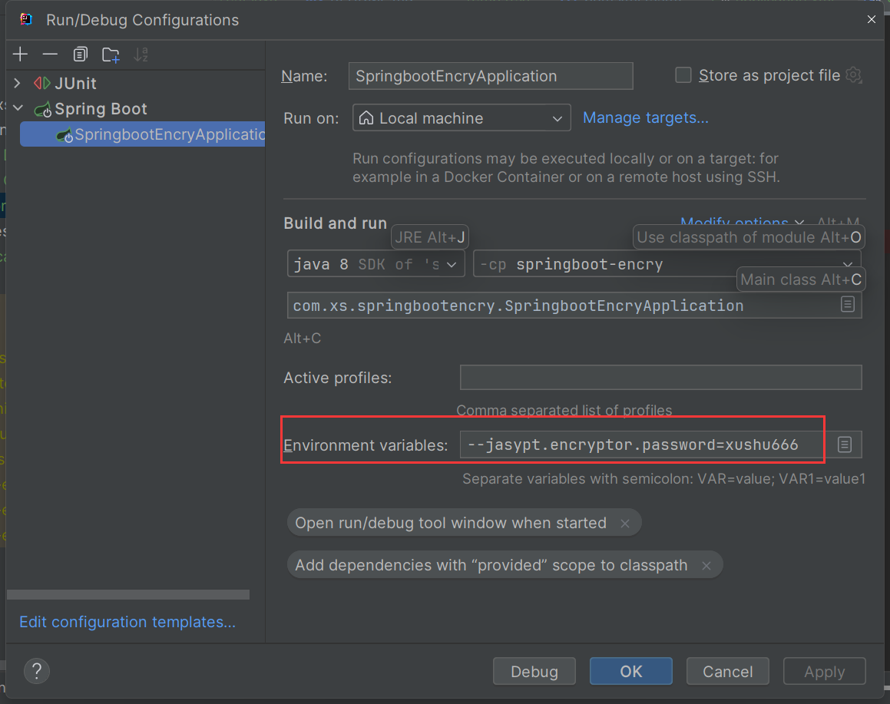

# 如何对SpringBoot配置文件和代码加密

## 如何对SpringBoot的配置文件进行加密？
在某些情况下，我们为了不暴露数据库账号密码等敏感信息，我们需要对配置文件中的敏感信息进行加密处理。

```yaml
# 数据源
spring:
  datasource:
    username: root
    password: 123456
    url: jdbc:p6spy:mysql://localhost:3306/springboot_mybatis?characterEncoding=utf8&useSSL=false&serverTimezone=UTC&
    driver-class-name: com.mysql.cj.jdbc.Driver


```


采用jasypt进行加密:  官网 [https://github.com/ulisesbocchio/jasypt-spring-boot](https://github.com/ulisesbocchio/jasypt-spring-boot)

一、配置方式

### 依赖引入
首先引入jasypt依赖

```xml
<!--配置密码加密-->
<dependency>
  <groupId>com.github.ulisesbocchio</groupId>
  <artifactId>jasypt-spring-boot-starter</artifactId>
  <version>3.0.3</version>
</dependency>

<!--jasypt 密文生成插件-->
<plugin>
  <groupId>com.github.ulisesbocchio</groupId>
  <artifactId>jasypt-maven-plugin</artifactId>
  <version>3.0.5</version>
</plugin> 
```


### 通过命令生成密文：
依次生成数据库用户名、密码、url

```xml
mvn jasypt:encrypt-value -Djasypt.encryptor.password="xushu666" -Djasypt.plugin.value="123456" 
```


加密后：

```yaml
# 数据源
spring:
  datasource:
    username: ENC(yLMoH1EzdXgPCO42AbAeeatL2YNcfRpJ57GrWnT2CxJ/RnsyxmBK9TLOsOL/HceC)
    password: ENC(a2LlxUkUa0pFS59UqMrzlL/Yq+guIZw5hhL+bwtNplyGf5yIKuwz118Q+gK04dQU)
    url: ENC(vdlMzpRnsFrJH9le+nhJGMMz0VSaDJpRbEMPecqIGZFtYBaSYhudIEDWOooBhbvIeMshRXsXFQDgpF6B5wgGXTCWVxIGuhKD75g6VcS+S0FrciNQaKMQp9nk0yvQRV9ZwTZNrD9txsV/QvyjpPLk4k3e6wP/m2VztteJgUfMzVaIri75BQQLQOZFdEg+tKUr)
    driver-class-name: com.mysql.cj.jdbc.Driver


```


### 运行程序解密：



### 部署jar包解密：
```powershell
java -jar springboot-encry-xs-1.0.0.jar --jasypt.encryptor.password=xushu666
```


## 如何防止SpringBoot的jar反编译？


### <font style="color:#000000;">场景</font>
<font style="color:rgb(34, 34, 34);">最近项目要求部署到其他公司的服务器上，但是又不想将源码泄露出去。要求对正式环境的启动包进行安全性处理，防止客户直接通过反编译工具将代码反编译出来。</font>

### 方案
**<font style="color:rgb(34, 34, 34);background-color:rgb(241, 247, 253);">第一种方案使用代码混淆</font>**

<font style="color:rgb(34, 34, 34);">采用</font>`<font style="color:rgb(51, 51, 51);background-color:rgb(235, 245, 253);">proguard-maven-plugin</font>`<font style="color:rgb(34, 34, 34);">插件</font>

<font style="color:rgb(34, 34, 34);">在单模块中此方案还算简单，但是现在项目一般都是多模块，一个模块依赖多个公共模块。那么使用此方案就比较麻烦，配置复杂，文档难懂，各模块之间的调用在是否混淆时极其容易出错。</font>

**<font style="color:rgb(34, 34, 34);background-color:rgb(241, 247, 253);">第二种方案使用代码加密</font>**

<font style="color:rgb(34, 34, 34);">采用</font>`<font style="color:rgb(51, 51, 51);background-color:rgb(235, 245, 253);">classfinal-maven-plugin</font>`<font style="color:rgb(34, 34, 34);">插件</font>

<font style="color:rgb(34, 34, 34);">此方案比对上面的方案来说，就简单了许多。直接配置一个插件就可以实现源码的安全性保护。并且可以对yml、properties配置文件以及lib目录下的maven依赖进行加密处理。若想指定机器启动，支持绑定机器，项目加密后只能在特定机器运行。</font>

[<font style="color:#117CEE;">ClassFinal项目源码地址</font>](https://gitee.com/roseboy/classfinal)

### 项目操作
只需要在启动类的pom.xml文件中加如下插件即可，需要注意的是，改插件时要放到spring-boot-maven-plugin插件后面，否则不起作用。

```xml
<build>
    <plugins>
        <plugin>
            <groupId>org.springframework.boot</groupId>
            <artifactId>spring-boot-maven-plugin</artifactId>
        </plugin>
        <plugin>
            <!--
                1. 加密后,方法体被清空,保留方法参数、注解等信息.主要兼容swagger文档注解扫描
                2. 方法体被清空后,反编译只能看到方法名和注解,看不到方法体的具体内容
                3. 加密后的项目需要设置javaagent来启动,启动过程中解密class,完全内存解密,不留下任何解密后的文件
                4. 启动加密后的jar,生成xxx-encrypted.jar,这个就是加密后的jar文件,加密后不可直接执行
                5. 无密码启动方式,java -javaagent:xxx-encrypted.jar -jar xxx-encrypted.jar
                6. 有密码启动方式,java -javaagent:xxx-encrypted.jar='-pwd= 密码' -jar xxx-encrypted.jar
            -->
            <groupId>net.roseboy</groupId>
            <artifactId>classfinal-maven-plugin</artifactId>
            <version>1.2.1</version>
            <configuration>
                <password>#</password><!-- #表示启动时不需要密码,事实上对于代码混淆来说,这个密码没什么用,它只是一个启动密码 -->
                <excludes>org.spring</excludes>
                <packages>${groupId}</packages><!-- 加密的包名,多个包用逗号分开 -->
                <cfgfiles>application.yml,application-dev.yml</cfgfiles><!-- 加密的配置文件,多个包用逗号分开 -->
                <libjars>hutool-all.jar</libjars> <!-- jar包lib下面要加密的jar依赖文件,多个包用逗号分开 -->
                <code>xxxx</code> <!-- 指定机器启动,机器码 -->
            </configuration>
            <executions>
                <execution>
                    <phase>package</phase>
                    <goals>
                        <goal>classFinal</goal>
                    </goals>
                </execution>
            </executions>
        </plugin>
    </plugins>
 
</build>
```

### 启动方式
<font style="color:rgb(34, 34, 34);">无密码启动</font>

```powershell
java -javaagent:xxx-encrypted.jar -jar xxx-encrypted.jar
```


<font style="color:rgb(34, 34, 34);">有密码启动</font>

```powershell
java -javaagent:xxx-encrypted.jar='-pwd=密码'-jar xxx-encrypted.jar
```

  
 


> 更新: 2024-09-26 16:41:48  
> 原文: <https://www.yuque.com/tulingzhouyu/db22bv/wyvnprq4ddp5575i>