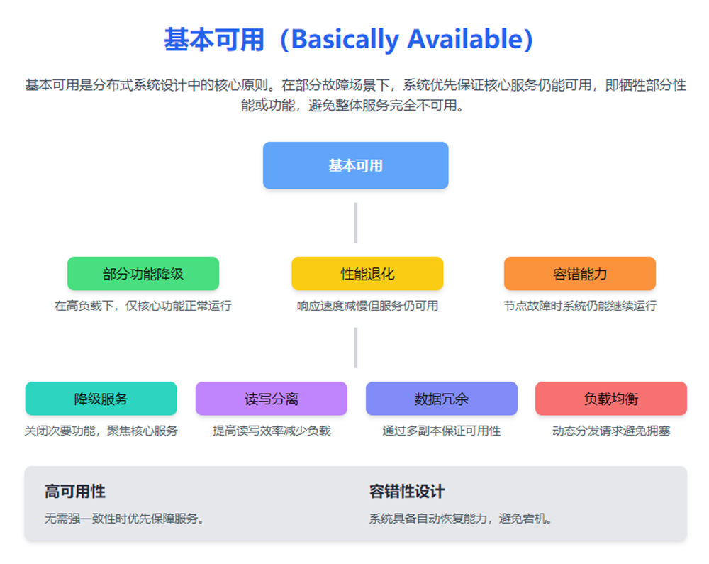
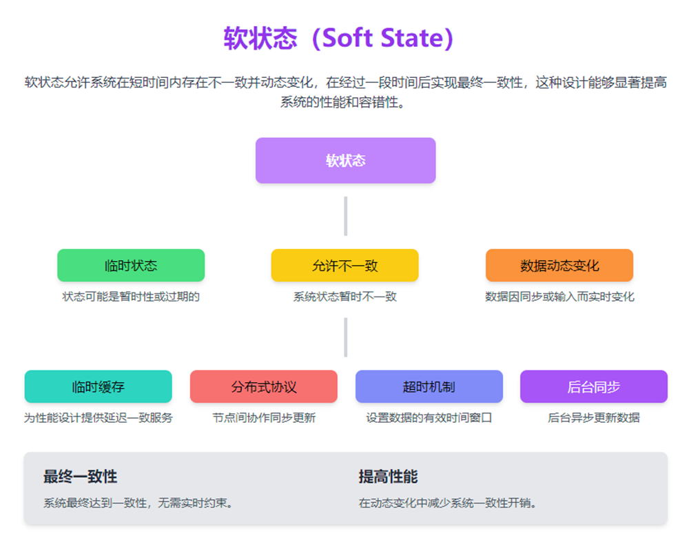
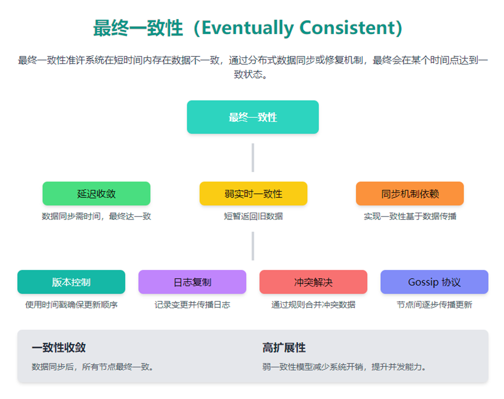

# Base理论

BASE（Basically Available、Soft state、Eventual consistency）是基于CAP理论逐步演化而来的，核心思想是即便不能达到强一致性（Strong consistency），也可以根据应用特点采用适当的方式来达到最终一致性（Eventual consistency）的效果。

### **Basically Available（基本可用）：分析及概念**
---

#### **1. 什么是**** **`**Basically Available**`**（基本可用）？**
"基本可用"（Basically Available）是 BASE 理论中关于分布式系统可用性的关键特点，指系统在部分出现故障或资源受限的情况下，仍然能够通过降级提供服务，而不是完全宕机。

这是对 **ACID 模型（强一致性）** 中严格可用性的妥协，目的是在性能、可用性和一致性之间找到更好的平衡。例如，通过牺牲部分性能、功能或一致性，优先保证核心业务的正常运行。

---

#### **2. 基本可用的核心特性**
1. **部分功能降级：**
    - 在高负载或部分节点失败的情况下，系统可能关闭次要功能，保障主要功能的正常运行。例如：关闭用户评论、推荐算法等非核心功能，确保支付流程可用。
2. **性能退化：**
    - 系统在负载过大时可能会牺牲响应速度，优先保证在线服务的可用性（例如请求延迟增加，但不宕机）。
3. **容错能力：**
    - 系统通过冗余和分布式架构提升容错性，即便部分组件出问题，整体服务仍能继续运行。

---

#### **3. 基本可用的实现方式**
1. **降级服务（Graceful Degradation）：**
    - 在资源紧张时优先保障核心功能，并动态关闭非核心功能。
2. **读写分离：**
    - 优化读操作性能，通过缓存或异步写操作降低负载。
3. **数据冗余：**
    - 使用多节点数据复制保证数据可访问性，即使个别节点失效也不会影响整体服务。
4. **负载均衡：**
    - 自动分流请求至健康的节点，避免资源耗尽导致服务不可用。

---

#### **4. 应用场景**
+ **电商网站：** 在大促销期间，部分算法或次要功能（如推荐或优惠券）被暂时关闭，保证用户能够完成下单和支付流程。
+ **分布式系统：** 通过多机房部署，当某个机房宕机时，其他机房接管流量，确保服务可用。
+ **CDN 服务：** 用户请求的非核心静态文件（如图片）可能存在延迟或缓存过期更新的情况，但页面主内容仍然正常加载。

### **Soft State（软状态）：分析及概念**
#### **1. 什么是 Soft State（软状态）？**
“软状态”是分布式系统中 BASE 理论的一个重要核心点，指系统允许在短时间内存在一致性的松散状态，即允许系统在写操作或更新后，数据不会立即同步到所有节点，而是通过一段延迟过程最终达到一致性状态。与 ACID 理论中严格一致性（Strong Consistency）不同，软状态强调延迟一致并适应动态性环境。

---

#### **2. Soft State 的核心特性**
1. **状态的临时性：**
    - 系统在运行过程中，某些数据状态可能为暂时的、不稳定的。
    - 例如缓存中的数据在某一时刻可能与主数据库不一致，但短时间后会自动进行更新。
2. **允许数据不一致：**
    - 系统不同节点间的状态可以暂时不一致。
    - 不同节点上的数据依赖同步协议在后台异步执行。
3. **动态变化：**
    - 数据可能由于外部输入、定时任务或同步协议而动态更新。
    - 数据的软状态能够降低系统的一致性压力。
4. **最终一致性：**
    - 软状态支持“最终一致性原则”，即经过一段时间后，整个系统最终达到一致状态，而不需要强制性实时同步。

---

#### **3. Soft State 的实现方式**
1. **临时缓存 (Temporary Cache)**：用于确保数据请求提高性能，允许缓存中数据短时间内过期或不一致。
2. **分布式协作协议**：
    - 系统内部使用如 Gossip 协议，节点间交换更新信息，逐步传播状态。
3. **超时机制 (Timeout Mechanisms)**：设置数据的有效期或一致性检查时限。
4. **后台数据同步 (Background Sync)**：通过异步方式完成节点间的数据修复与更新工作。

---

#### **4. 应用场景**
+ **电商系统**：购物车显示的某些信息（例如：价格或库存）可能会延迟更新，但不会影响最终下单。
+ **分布式缓存**：Redis 或 Memcached 中的数据可能是一个阶段性软状态。
+ **社交媒体系统**：例如用户评论、点赞数等可能短时间不同步，但最终数据保持一致。

### **Eventually Consistent（最终一致性）：分析及概念**
---

#### **1. 什么是最终一致性（Eventually Consistent）？**
最终一致性是分布式系统 BASE 理论中最重要的概念之一，指系统中的所有节点数据，在无更多更新的情况下，通过一定时间后，最终将达到一致状态。这允许系统暂时存在数据不一致，随着同步或修复机制的完成，各节点将逐渐达到一致。

最终一致性通常应用在放弃强一致性保证的分布式系统中，适合高并发和高可用场景，通过牺牲实时一致性换取更高的性能和可扩展性。

---

#### **2. 最终一致性的核心特性**
1. **延迟收敛：**
    - 数据同步和修复处理可能需要一定的时间，但只要没有新的数据更改，系统最终会达到一致状态（即全局一致性）。
2. **弱实时一致性：**
    - 数据更新后，读操作可能一段时间内返回旧数据，但会随着时间的推移返回最新数据。
3. **依赖同步机制：**
    - 系统之间通过异步消息传递、增量数据更新或日志回放等机制，实现数据传播和同步。

---

#### **3. 最终一致性的实现方式**
1. **版本控制 (Version Control)**：
    - 使用数据的版本号或时间戳，标记最新更新，确保多节点之间更新顺序一致。
2. **日志复制 (Log Replication)**：
    - 节点间通过日志机制传播数据变更，确保所有节点最终拥有相同的日志。
3. **冲突检测与解决 (Conflict Resolution)**：
    - 在多节点写入冲突的情况下，通过算法（如最后写入优先、数据合并等）解决冲突并统一数据。
4. **Gossip 协议**：
    - 节点使用类似“谣言传播”的方式互相同步状态，逐渐到达一致。

---

#### **4. 应用场景**
+ **电商库存系统**：
    - 下单后短暂显示旧的库存数据，通过后台修复最终实现数据同步。
+ **社交平台消息系统**：
    - 短时间内同一条消息可能在不同客户端显示状态不一致（如已读/未读），最终同步至一致状态。
+ **分布式数据库（如 DynamoDB、Cassandra）**：
    - 写优先设计，允许短暂的不一致性，最终确保分布式节点的完整同步。

> 更新: 2024-12-11 21:14:02  
> 原文: <https://www.yuque.com/tulingzhouyu/db22bv/vgzeyhvtsbc1u6ex>