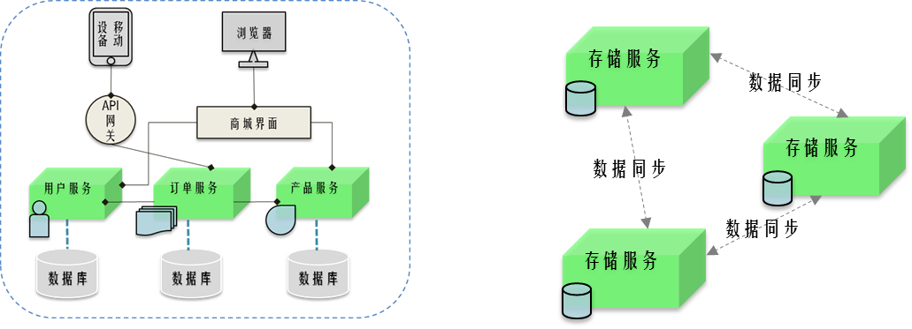
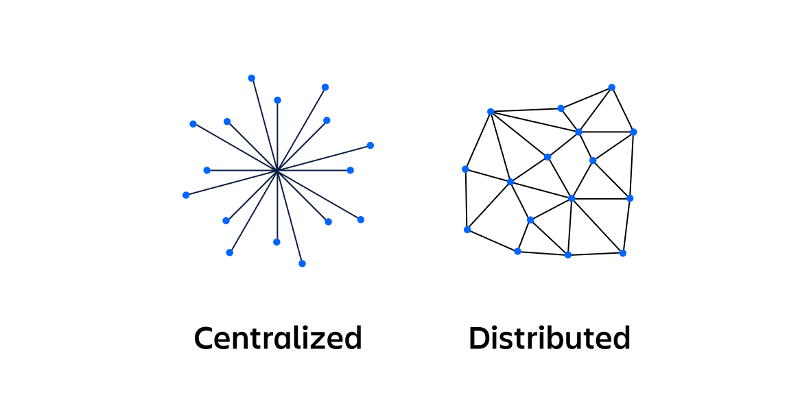

# 什么是分布式系统

薪资：6k-12k

岗位：初级开发工程师

一个系统   _**各组件**_分别部署在不同服务器。_**彼此通过网络通信和协调的系统。**_

_** **_

+ 可以指**多个不同组件**分布在网络上互相协作，比如说电商网站
+ 也可以**一个组件的多个副本**组成集群，互相协作如同一个组件，比如数据存储服务中为了数据不丢失而采取的多个服务备份冗余，当数据修改时也需要通信来复制数据

_**分布式最早出现的目地首先是解决单点问题，避免单点故障，然后解决了性能问题。**_

  

---

> 更新: 2023-10-15 16:49:21  
> 原文: <https://www.yuque.com/tulingzhouyu/db22bv/hesqtinz9cmqe0en>