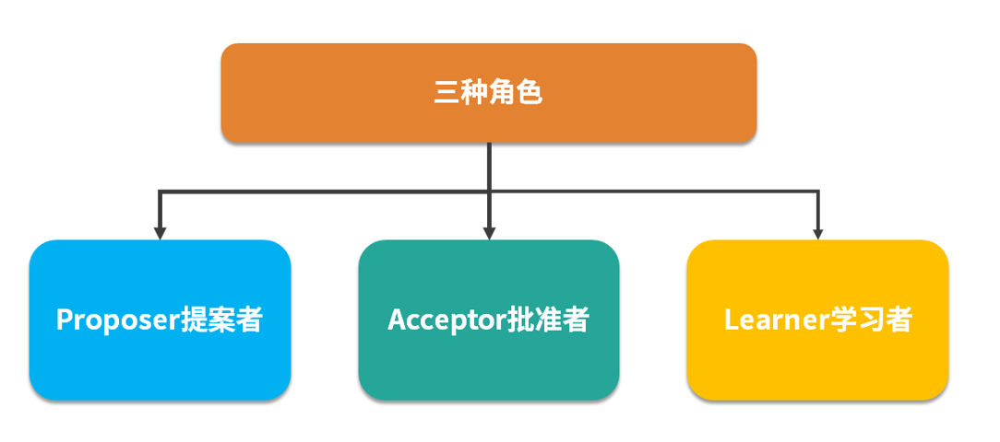

# 说下paxos算法

Paxos 有点类似前面说的 2PC，3PC，但比这两种算法更加完善。在很多多大厂都得到了工程实践，比如阿里的 OceanBase 的 **分布式数据库**， Google 的 chubby **分布式锁** 。

### **Paxos算法是什么？**
Paxos 算法是 **基于消息传递** 且具有 **高效容错特性** 的一致性算法，目前公认的解决 **分布式一致性问题** 最有效的算法之一。

### **Paxos算法的工作流程？**
#### 角色
在Paxos中有这么几个角色：

1. **Proposer（提议者）**** ****: 提议者提出提案，用于投票表决。**
2. **Accecptor（接受者）**** ****: 对提案进行投票，并接受达成共识的提案。**
3. **Learner（学习者）**** ****: 被告知投票的结果，接受达成共识的提案。**

在实际中，一个节点可以同时充当不同角色。

Paxos的三种角色

提议者提出提案，提案=编号+value，可以表示为[M,V]，每个提案都有唯一编号，而且编号的大小是趋势递增的。

#### 算法流程
Paxos算法包含两个阶段，第一阶段**Prepare(准备)**、第二阶段**Accept(接受)**。

Paxos算法流程

##### Prepare(准备)阶段
1. **提议者提议一个新的提案 P[Mn,?]，然后向接受者的某个超过半数的子集成员发送编号为Mn的准备请求**
2. **如果一个接受者收到一个编号为Mn的准备请求，并且编号Mn大于它已经响应的所有准备请求的编号，那么它就会将它已经批准过的最大编号的提案作为响应反馈给提议者，同时该接受者会承诺不会再批准任何编号小于Mn的提案。**

总结一下，接受者在收到提案后，会给与提议者**两个承诺**与**一个应答**：

+ **两个承诺：**
    - **承诺不会再接受提案号小于或等于 Mn 的 Prepare 请求**
    - **承诺不会再接受提案号小于Mn 的 Accept 请求**
+ **一个应答：**
    - **不违背以前作出的承诺的前提下，回复已经通过的提案中提案号最大的那个提案所设定的值和提案号Mmax，如果这个值从来没有被任何提案设定过，则返回空值。如果不满足已经做出的承诺，即收到的提案号并不是决策节点收到过的最大的，那允许直接对此 Prepare 请求不予理会。**

##### Accept(接受)阶段
1. **如果提议者收到来自半数以上的接受者对于它发出的编号为Mn的准备请求的响应，那么它就会发送一个针对[Mn,Vn]的接受请求给接受者，注意Vn的值就是收到的响应中编号最大的提案的值，如果响应中不包含任何提案，那么它可以随意选定一个值。**
2. **如果接受者收到这个针对[Mn,Vn]提案的接受请求，只要该接受者尚未对编号大于Mn的准备请求做出响应，它就可以通过这个提案。**

当提议者收到了多数接受者的接受应答后，协商结束，共识决议形成，将形成的决议发送给所有学习节点进行学习。

所以Paxos算法的整体详细流程如下：

Paxos详细流程

算法的流程模拟，可以查看参考[13]。

### **Paxos算法有什么缺点吗？怎么优化？**
前面描述的可以称之为Basic Paxos 算法，在单提议者的前提下是没有问题的，但是假如有多个提议者互不相让，那么就可能导致整个提议的过程进入了死循环。

Lamport 提出了 Multi Paxos 的算法思想。

Multi Paxos算法思想，简单说就是在多个提议者的情况下，选出一个Leader（领导者），由领导者作为唯一的提议者，这样就可以解决提议者冲突的问题。

> 更新: 2023-10-06 14:35:10  
> 原文: <https://www.yuque.com/tulingzhouyu/db22bv/sh5gb8mbgvo6alip>