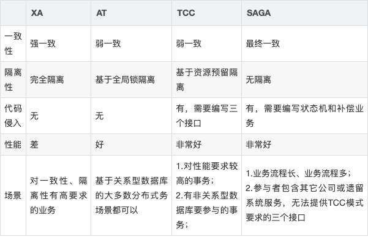

# 说下你对Seata的理解

:::tips
<font style="background-color:#FBDE28;">工资：12-25K</font>

<font style="background-color:#C1E77E;">岗位：中高级开发工程师</font>

:::

<font style="background-color:#C1E77E;"></font>

<font style="color:rgb(51, 51, 51);">Seata是一款开源的分布式事务解决方案，致力于提供高性能和简单易用的分布式事务服务。Seata将为用户提供了AT、TCC、SAGA和XA事务模式，为用户打造一站式的分布式解决方案。</font>

## 
## 1.1 Seata的三大角色
<font style="color:rgb(36, 41, 46);">在 Seata 的架构中，一共有三个角色：</font>

**<font style="color:rgb(36, 41, 46);">TC (Transaction Coordinator) - 事务协调者</font>**

<font style="color:rgb(36, 41, 46);">维护全局和分支事务的状态，驱动全局事务提交或回滚。</font>

**<font style="color:rgb(36, 41, 46);">TM (Transaction Manager) - 事务管理器</font>**

<font style="color:rgb(36, 41, 46);">定义全局事务的范围：开始全局事务、提交或回滚全局事务。</font>

**<font style="color:rgb(36, 41, 46);">RM (Resource Manager) - 资源管理器</font>**

<font style="color:rgb(36, 41, 46);">管理分支事务处理的资源，与TC交谈以注册分支事务和报告分支事务的状态，并驱动分支事务提交或回滚。</font>

<font style="color:rgb(223, 64, 42);">其中，TC 为单独部署的 Server 服务端，TM 和 RM 为嵌入到应用中的 Client 客户端。</font>

## <font style="color:rgb(0, 0, 0);">XA模型</font>
### <font style="color:rgb(0, 0, 0);">  
</font><font style="color:rgb(0, 0, 0);">1.2.Seata的XA模型</font>
<font style="color:rgb(0, 0, 0);">Seata对原始的XA模式做了简单的封装和改造，以适应自己的事务模型，基本架构如图：</font>


  


**<font style="color:rgb(0, 0, 0);">RM一阶段的工作：</font>**

<font style="color:rgb(0, 0, 0);">① 注册分支事务到TC</font>

<font style="color:rgb(0, 0, 0);">② 执行分支业务sql但不提交</font>

<font style="color:rgb(0, 0, 0);">③ 报告执行状态到TC</font>

**<font style="color:rgb(0, 0, 0);">TC二阶段的工作：</font>**

+ <font style="color:rgb(0, 0, 0);">TC检测各分支事务执行状态</font><font style="color:rgb(0, 0, 0);">a.如果都成功，通知所有RM提交事务</font><font style="color:rgb(0, 0, 0);">b.如果有失败，通知所有RM回滚事务</font>

**<font style="color:rgb(0, 0, 0);">RM二阶段的工作：</font>**

+ <font style="color:rgb(0, 0, 0);">接收TC指令，提交或回滚事务</font>

  


### <font style="color:rgb(0, 0, 0);">1.3.优缺点</font>
<font style="color:rgb(0, 0, 0);">XA模式的优点是什么？</font>

+ <font style="color:rgb(0, 0, 0);">事务的强一致性，满足ACID原则。</font>
+ <font style="color:rgb(0, 0, 0);">常用数据库都支持，实现简单，并且没有代码侵入</font>

<font style="color:rgb(0, 0, 0);">XA模式的缺点是什么？</font>

+ <font style="color:rgb(0, 0, 0);">因为一阶段需要锁定数据库资源，等待二阶段结束才释放，性能较差</font>
+ <font style="color:rgb(0, 0, 0);">依赖 关系型数据库 实现事务</font>

  


## <font style="color:rgb(0, 0, 0);">2.AT模式</font>
<font style="color:rgb(0, 0, 0);">AT模式同样是分阶段提交的事务模型，不过缺弥补了XA模型中资源锁定周期过长的缺陷。</font>

### <font style="color:rgb(0, 0, 0);">2.1.Seata的AT模型</font>
<font style="color:rgb(0, 0, 0);">基本流程图：  
</font>

  


<font style="color:rgb(0, 0, 0);">阶段一RM的工作：</font>

+ <font style="color:rgb(0, 0, 0);">注册分支事务</font>
+ <font style="color:rgb(0, 0, 0);">记录undo-log（数据快照）</font>
+ <font style="color:rgb(0, 0, 0);">执行业务sql并提交</font>
+ <font style="color:rgb(0, 0, 0);">报告事务状态</font>

<font style="color:rgb(0, 0, 0);">阶段二提交时RM的工作：</font>

+ <font style="color:rgb(0, 0, 0);">删除undo-log即可</font>

<font style="color:rgb(0, 0, 0);">阶段二回滚时RM的工作：</font>

+ <font style="color:rgb(0, 0, 0);">根据undo-log恢复数据到更新前</font>

  


### <font style="color:rgb(0, 0, 0);">2.2.流程梳理</font>
<font style="color:rgb(0, 0, 0);">我们用一个真实的业务来梳理下AT模式的原理。</font>

<font style="color:rgb(0, 0, 0);">比如，现在又一个数据库表，记录用户余额：</font>

| **<font style="color:rgb(0, 0, 0);">id</font>** | **<font style="color:rgb(0, 0, 0);">money</font>** |
| :--- | :--- |
| <font style="color:rgb(0, 0, 0);">1</font> | <font style="color:rgb(0, 0, 0);">100</font> |


<font style="color:rgb(0, 0, 0);">其中一个分支业务要执行的SQL为：</font>

```sql
update tb_account set money = money - 10 where id = 1
```

  


<font style="color:rgb(0, 0, 0);">AT模式下，当前分支事务</font>**<font style="color:rgb(0, 0, 0);">执行流程</font>**<font style="color:rgb(0, 0, 0);">如下：</font>

**<font style="color:rgb(0, 0, 0);">一阶段：</font>**

<font style="color:rgb(0, 0, 0);">1）TM发起并注册全局事务到TC</font>

<font style="color:rgb(0, 0, 0);">2）TM调用分支事务</font>

<font style="color:rgb(0, 0, 0);">3）分支事务准备执行业务SQL</font>

<font style="color:rgb(0, 0, 0);">4）RM拦截业务SQL，根据where条件查询原始数据，形成快照。</font>

```json
{
    "id": 1, "money": 100
}
```

<font style="color:rgb(0, 0, 0);">5）RM执行业务SQL，提交本地事务，释放数据库锁。此时</font><font style="color:rgb(0, 0, 0);"> </font><font style="color:rgb(232, 62, 140);background-color:rgb(246, 246, 246);">money = 90</font>

<font style="color:rgb(0, 0, 0);">6）RM报告本地事务状态给TC</font>

  


**<font style="color:rgb(0, 0, 0);">二阶段：</font>**

<font style="color:rgb(0, 0, 0);">1）TM通知TC事务结束</font>

<font style="color:rgb(0, 0, 0);">2）TC检查分支事务状态</font>

<font style="color:rgb(0, 0, 0);">a）如果都成功，则立即删除快照</font>

<font style="color:rgb(0, 0, 0);">b）如果有分支事务失败，需要回滚。读取快照数据（</font><font style="color:rgb(232, 62, 140);background-color:rgb(246, 246, 246);">{"id": 1, "money": 100}</font><font style="color:rgb(0, 0, 0);">），将快照恢复到数据库。此时数据库再次恢复为100</font>

  


### <font style="color:rgb(0, 0, 0);">2.3.脏写问题</font>
<font style="color:rgb(0, 0, 0);">在多线程并发访问AT模式的分布式事务时，有可能出现脏写问题，如图：</font>


<font style="color:rgb(0, 0, 0);">解决思路就是引入了全局锁的概念。在释放DB锁之前，先拿到全局锁。避免同一时刻有另外一个事务来操作当前数据。</font>


  
<font style="color:rgb(0, 0, 0);">- > 但是也可能在一个极端的情况下造成脏读,比如一个非Seata管理的全局事务，在事务1提交事务释放DB锁之后获取了DB锁，从而造成脏写问题。 > 这时事务1会根据快照数据发现异常，发出警告，进行人工介入。</font>  


### <font style="color:rgb(0, 0, 0);">2.4.优缺点</font>
<font style="color:rgb(0, 0, 0);">AT模式的优点：</font>

+ <font style="color:rgb(0, 0, 0);">一阶段完成直接提交事务，释放数据库资源，性能比较好</font>
+ <font style="color:rgb(0, 0, 0);">利用全局锁实现读写隔离</font>
+ <font style="color:rgb(0, 0, 0);">没有代码侵入，框架自动完成回滚和提交</font>

<font style="color:rgb(0, 0, 0);">AT模式的缺点：</font>

+ <font style="color:rgb(0, 0, 0);">两阶段之间属于软状态，属于最终一致</font>
+ <font style="color:rgb(0, 0, 0);">框架的快照功能会影响性能，但比XA模式要好很多</font>

  


## <font style="color:rgb(0, 0, 0);">3.AT与XA的区别</font>
<font style="color:rgb(0, 0, 0);">简述AT模式与XA模式最大的区别是什么？</font>

+ <font style="color:rgb(0, 0, 0);">XA模式一阶段不提交事务，锁定资源；AT模式一阶段直接提交，不锁定资源。</font>
+ <font style="color:rgb(0, 0, 0);">XA模式依赖数据库机制实现回滚；AT模式利用数据快照实现数据回滚。</font>
+ <font style="color:rgb(0, 0, 0);">XA模式强一致；AT模式最终一致</font>


> 更新: 2023-10-16 15:59:36  
> 原文: <https://www.yuque.com/tulingzhouyu/db22bv/qkonkyxh8cti4k7k>