# 👍一次搞定MySQL分库分表

## [天明](https://www.yuque.com/tianming-aroh0/sagnbd/nfkf7dvzxgp26nw4)寄语<font style="color:rgb(0, 0, 0);">：</font>
**应学员要求更新分库分表部分相关问题。注意在MySQL基础之上再看此篇。**

## <font style="color:rgb(62, 71, 83);">什么是分库分表？</font>
<font style="color:rgb(62, 71, 83);">对于阅读本文的读者来说，分库分表概念应该并不会陌生，其拆开来讲是分库和分表两个手段：</font>

+ <font style="color:rgb(62, 71, 83);">分表：将一个表中的数据按照某种规则分拆到多张表中，</font>**<font style="color:rgb(62, 71, 83);">降低锁粒度以及索引树</font>**<font style="color:rgb(62, 71, 83);">，提升数据查询效率。</font>

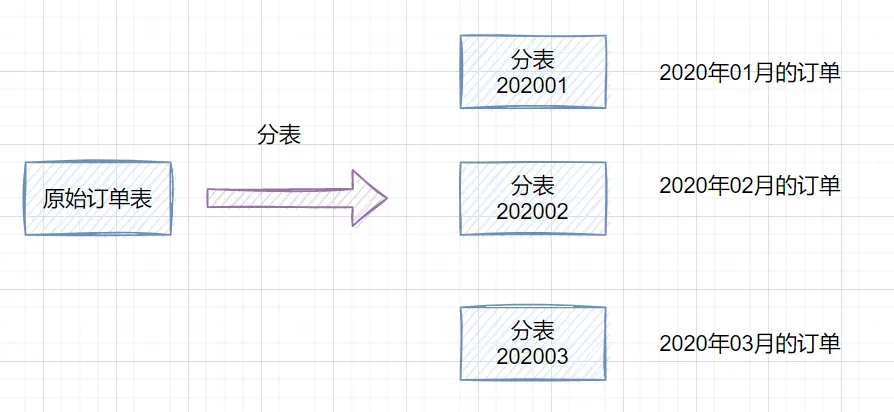

+ <font style="color:rgb(62, 71, 83);">分库：将一个数据库中的数据按照某种规则分拆到多个数据库中，以</font>**<font style="color:rgb(62, 71, 83);">缓解单服务器的压力</font>**<font style="color:rgb(62, 71, 83);">（CPU、内存、磁盘、IO）。</font>

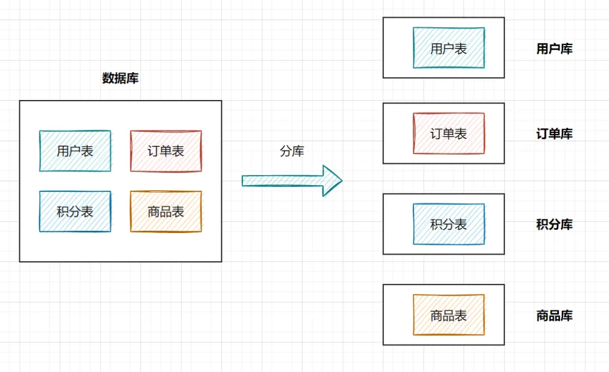

<font style="color:black;">分库分表手段，其在解决如 IO 瓶颈、读写性能、物理存储瓶颈、内存瓶颈、单机故障影响面等问题的同时也带来如事务性、主键冲突、跨库 join、跨库聚合查询等问题。anyway，在综合业务场景考虑，正如缓存的使用一样，本着非必须勿使用原则。如数据库确实成为性能瓶颈时，在设计分库分表方案时也应充分考虑方案的扩展性，或者考虑采用成熟热门的分布式数据库解决方案，如 TiDB。</font>

<font style="color:rgb(62, 71, 83);">目标：</font>

+ <font style="color:rgb(62, 71, 83);">什么是分库分表以及为什么分库分表</font>
+ <font style="color:rgb(62, 71, 83);">如何分库分表</font>
+ <font style="color:rgb(62, 71, 83);">分库分表常见几种方式以及优缺点</font>
+ <font style="color:rgb(62, 71, 83);">如何选择分库分表的方式</font>

## <font style="color:rgb(62, 71, 83);">数据库常见优化方案</font>
<font style="color:rgb(62, 71, 83);">对于后端程序员来说，绕不开数据库的使用与方案选型，那么随着业务规模的逐渐扩大，其对于存储的使用上也需要随之进行升级和优化。</font>

<font style="color:rgb(62, 71, 83);">随着规模的扩大，数据库面临如下问题：</font>

+ <font style="color:rgb(62, 71, 83);">读压力：并发 QPS、索引不合理、SQL 语句不合理、锁粒度</font>
+ <font style="color:rgb(62, 71, 83);">写压力：并发 QPS、事务、锁粒度</font>
+ <font style="color:rgb(62, 71, 83);">物理性能：磁盘瓶颈、CPU 瓶颈、内存瓶颈、IO 瓶颈</font>
+ <font style="color:rgb(62, 71, 83);">其他：宕机、网络异常</font>

<font style="color:rgb(62, 71, 83);">面对上述问题，常见的优化手段有：</font>

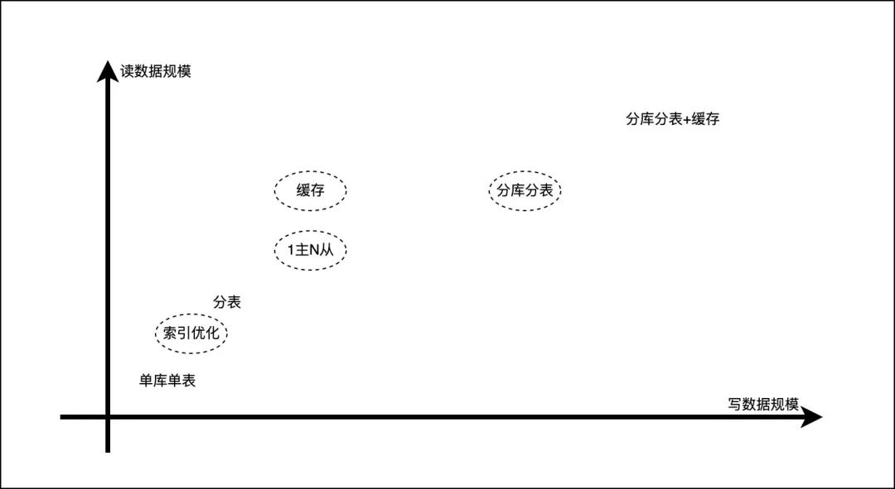

<font style="color:rgb(62, 71, 83);">索引优化、主从同步、缓存、分库分表每个技术手段都可以作为一个专题进行讲解，本文主要介绍分库分表的技术方案实现。</font>


## <font style="color:rgb(62, 71, 83);">为什么分库分表？</font>
<font style="color:rgb(0, 0, 0);">如果业务量剧增，数据库可能会出现性能瓶颈，这时候就需要考虑拆分数据库。从这几方面来看：</font>

+ **<font style="color:rgb(62, 71, 83);">磁盘存储</font>**

<font style="color:rgb(0, 0, 0);">业务量剧增，MySQL单机磁盘容量会撑爆，拆成多个数据库，磁盘使用率大大降低。</font>

+ **<font style="color:rgb(62, 71, 83);">并发连接支撑</font>**

<font style="color:rgb(0, 0, 0);">数据库连接是有限的。在高并发的场景下，大量请求访问数据库，MySQL单机是扛不住的！当前非常火的</font>**<font style="color:rgb(0, 0, 0);">微服务架构</font>**<font style="color:rgb(0, 0, 0);">出现，就是为了应对高并发。它把</font>**<font style="color:rgb(0, 0, 0);">订单、用户、商品</font>**<font style="color:rgb(0, 0, 0);">等不同模块，拆分成多个应用，并且把单个数据库也拆分成多个不同功能模块的数据库（</font>**<font style="color:rgb(0, 0, 0);">订单库、用户库、商品库</font>**<font style="color:rgb(0, 0, 0);">），以分担读写压力。</font>

+ **<font style="color:rgb(62, 71, 83);">性能角度：CPU、内存、磁盘、IO 瓶颈</font>**
    - <font style="color:rgb(62, 71, 83);">随着业务体量扩大，数据规模达到百万行，数据库索引树庞大，查询性能出现瓶颈。</font>
    - <font style="color:rgb(62, 71, 83);">用户并发流量规模扩大，由于单库(单服务器)物理性能限制也无法承载大流量。</font>
+ **<font style="color:rgb(62, 71, 83);">可用性角度：单机故障率影响面</font>**
    - <font style="color:rgb(62, 71, 83);">如果是单库，数据库宕机会导致 100%服务不可用，N 库则可以将影响面降低 N 倍。</font>

## <font style="color:rgb(62, 71, 83);">分库分表带来的问题？</font>
+ **<font style="color:rgb(62, 71, 83);">事务性问题</font>**
    - <font style="color:rgb(62, 71, 83);">方案一：在进行分库分表方案设计过程中，从业务角度出发，尽可能保证一个事务所操作的表分布在一个库中，从而实现数据库层面的事务保证。</font>
    - <font style="color:rgb(62, 71, 83);">方案二：方式一无法实现的情况下，业务层引入分布式事务组件保证事务性，如事务性消息、TCC、Seata 等分布式事务方式实现数据最终一致性。</font>
    - <font style="color:rgb(62, 71, 83);">分库</font>**<font style="color:rgb(62, 71, 83);">可能</font>**<font style="color:rgb(62, 71, 83);">导致执行一次事务所需的数据分布在不同服务器上，数据库层面无法实现事务性操作，需要更上层业务引入分布式事务操作，难免会给业务带来一定复杂性，那么要想解决事务性问题一般有两种手段：</font>
+ **<font style="color:rgb(62, 71, 83);">主键(自增 ID)唯一性问题</font>**
    - <font style="color:rgb(62, 71, 83);">在数据库表设计时，经常会使用自增 ID 作为数据主键，这就导致后续在迁库迁表、或者分库分表操作时，会因为主键的变化或者主键不唯一产生冲突，要解决主键不唯一问题，有如下方案：</font>
    - <font style="color:rgb(62, 71, 83);">方案一：自增 ID 做主键时，设置自增步长，采用等差数列递增，避免各个库表的主键冲突。但是这个方案仍然无法解决迁库迁表、以及分库分表扩容导致主键 ID 变化问题</font>
    - <font style="color:rgb(62, 71, 83);">方案二：主键采用全局统一 ID 生成机制：如 UUID、雪花算法、数据库号段等方式。</font>
+ **<font style="color:rgb(62, 71, 83);">跨库多表 join 问题</font>**
    - <font style="color:rgb(62, 71, 83);">首先来自大厂 DBA 的建议是，线上服务尽可能不要有表的 join 操作，join 操作往往会给后续的分库分表操作带来各种问题，可能导致数据的死锁。可以采用多次查询业务层进行数据组装(需要考虑业务上多次查询的事务性的容忍度)</font>
+ **<font style="color:rgb(62, 71, 83);">跨库聚合查询问题</font>**

<font style="color:rgb(62, 71, 83);">分库分表会导致常规聚合查询操作，如 group by，order by 等变的异常复杂。需要复杂的业务代码才能实现上述业务逻辑，其常见操作方式有：</font>

<font style="color:rgb(62, 71, 83);">§ 方案一：赛道赛马机制，每次从 N 个库表中查询出 TOP N 数据，然后在业务层代码中进行聚合合并操作。</font>

```sql
§  假设： 以2库1表为例，每次分页查询N条数据。
§
§  第一次查询：
§  ① 每个表中分别查询出N条数据：
§  SELECT * FROM db1_table1 where $col > 0 order by $col   LIMITT  0,N
§  SELECT * FROM db2_table1 where $col > 0 order by $col   LIMITT  0,N
§  ② 业务层代码对上述两者做归并排序，假设最终取db1数据K1条，取db2数据K2条，则K1+K2 = N
§  此时的DB1 可以计算出OffSet为K1 ，DB2计算出Offset为K2
§  将获取的N条数据以及相应的Offset  K1/K2返回给 端上。
§
§  第二次查询：
§  ① 端上将上一次查询对应的数据库的Offset  K1/K2 传到后端
§  ② 后端根据Offset构造查询语句查询分别查询出N条语句
§  SELECT * FROM db1_table1 where $col > 0 order by $col   LIMITT  $K1,N
§  SELECT * FROM db2_table1 where $col > 0 order by $col   LIMITT  $K2,N
§  ③ 再次使用归并排序，获取TOP N数据，将获取的N条数据以及相应的Offset  K1/K2返回给 端上。
§
§  第三次查询:
依次类推.......
```

<font style="color:rgb(62, 71, 83);">§ 方案二：可以将经常使用到 groupby,orderby 字段存储到一个单一库表(可以是 REDIS、ES、MYSQL)中，业务代码中先到单一表中根据查询条件查询出相应数据，然后根据查询到的主键 ID，到分库分表中查询详情进行返回。2 次查询操作难点会带来接口耗时的增加，以及极端情况下的数据不一致问题。</font>

## <font style="color:rgb(62, 71, 83);">什么是好的分库分表方案？</font>
+ **<font style="color:rgb(62, 71, 83);">满足业务场景需要</font>**<font style="color:rgb(62, 71, 83);">：根据业务场景的不同选择不同分库分表方案：比如按照时间划分、按照用户 ID 划分、按照业务能力划分等</font>
+ **<font style="color:rgb(62, 71, 83);">方案可持续性</font>**<font style="color:rgb(62, 71, 83);">：</font>
    - <font style="color:rgb(62, 71, 83);">何为可持续性？其实就是：业务数据量级和流量量级未来进一步达到新的量级的时候，分库分表方案可以持续灵活扩容处理。</font>
+ **<font style="color:rgb(62, 71, 83);">最小化数据迁移</font>**<font style="color:rgb(62, 71, 83);">：扩容时一般涉及到历史数据迁移，其扩容后需要迁移的数据量越小其可持续性越强，理想的迁移前后的状态是（同库同表>同表不同库>同库不同表>不同库不同表）</font>
+ **<font style="color:rgb(62, 71, 83);">数据偏斜</font>**<font style="color:rgb(62, 71, 83);">：数据在库表中分配的均衡性，尽可能保证数据流量在各个库表中保持等量分配，避免热点数据对于单库造成压力。</font>
    - <font style="color:rgb(62, 71, 83);">最大数据偏斜率：（数据量最大样本 - 数据量最小样本）/ 数据量最小样本。一般来说，如果最大数据偏斜率在 5%以内是可以接受的。</font>

## 数据分片
<font style="color:rgb(0, 0, 0);">通常在提到分库分表的时候，大多是以水平切分模式（水平分库、分表）为基础来说的，数据分片它将原本一张数据量较大的表 </font><font style="color:rgb(248, 35, 35);">t_order</font><font style="color:rgb(0, 0, 0);"> 拆分生成数个</font>**<font style="color:rgb(9, 142, 252);">表结构完全一致</font>**<font style="color:rgb(0, 0, 0);">的小数据量表（拆分表） </font><font style="color:rgb(248, 35, 35);">t_order_0</font><font style="color:rgb(0, 0, 0);">、</font><font style="color:rgb(248, 35, 35);">t_order_1</font><font style="color:rgb(0, 0, 0);">、···、</font><font style="color:rgb(248, 35, 35);">t_order_n</font><font style="color:rgb(0, 0, 0);">，每张表只存储原大表中的一部分数据。</font>

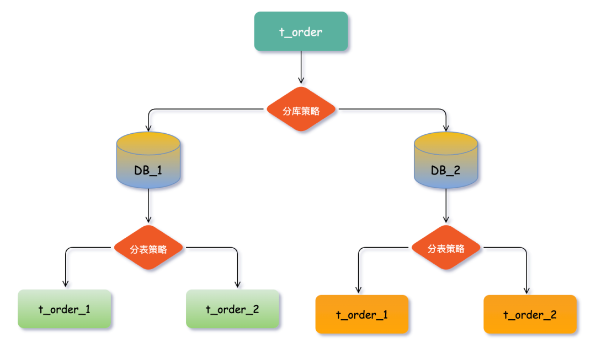

## 数据节点
<font style="color:rgb(0, 0, 0);">数据节点是数据分片中一个不可再分的最小单元（表），它由数据源名称和数据表组成，例如上图中</font><font style="color:rgb(0, 0, 0);"> </font><font style="color:rgb(248, 35, 35);">DB_1.t_order_1</font><font style="color:rgb(0, 0, 0);">、</font><font style="color:rgb(248, 35, 35);">DB_2.t_order_2</font><font style="color:rgb(0, 0, 0);"> </font><font style="color:rgb(0, 0, 0);">就表示一个数据节点。</font>


## 逻辑表
<font style="color:rgb(0, 0, 0);">逻辑表是指具有相同结构的水平拆分表的逻辑名称。</font>

<font style="color:rgb(0, 0, 0);">比如将订单表</font><font style="color:rgb(248, 35, 35);">t_order</font><font style="color:rgb(0, 0, 0);"> 分表拆分成 </font><font style="color:rgb(248, 35, 35);">t_order_0</font><font style="color:rgb(0, 0, 0);"> ··· </font><font style="color:rgb(248, 35, 35);">t_order_9</font><font style="color:rgb(0, 0, 0);">等10张表，这时的数据库中已经不存在 </font><font style="color:rgb(248, 35, 35);">t_order</font><font style="color:rgb(0, 0, 0);">这张表，取而代之的是若干的</font><font style="color:rgb(248, 35, 35);">t_order_n</font><font style="color:rgb(0, 0, 0);">表。</font>

<font style="color:rgb(0, 0, 0);">分库分表通常对业务代码都是无侵入式的，开发者只专注于业务逻辑SQL编码，在代码中</font><font style="color:rgb(248, 35, 35);">SQL</font><font style="color:rgb(0, 0, 0);">依然按 </font><font style="color:rgb(248, 35, 35);">t_order</font><font style="color:rgb(0, 0, 0);">来写，而在执行逻辑SQL前将其解析成对应的数据库真实执行的SQL。此时 t_order 就是这些拆分表的</font><font style="color:rgb(248, 35, 35);">逻辑表</font><font style="color:rgb(0, 0, 0);">。</font>

<font style="color:rgb(0, 0, 0);">业务逻辑SQL</font>

```sql
select * from t_order where order_no='A11111'
```

<font style="color:rgb(0, 0, 0);">真实执行SQL</font>

```sql
select * from DB_1.t_order_n where order_no='A11111'
```

## 真实表
<font style="color:rgb(0, 0, 0);">真实表就是在数据库中真实存在的物理表</font><font style="color:rgb(248, 35, 35);">DB_1.t_order_n</font><font style="color:rgb(0, 0, 0);">。</font>


## 广播表
<font style="color:rgb(0, 0, 0);">广播表是一类特殊的表，其表结构和数据在所有分片数据源中均完全一致。与拆分表相比，广播表的数据量较小、更新频率较低，通常用于字典表或配置表等场景。由于其在所有节点上都有副本，因此可以大大降低</font><font style="color:rgb(248, 35, 35);">JOIN</font><font style="color:rgb(0, 0, 0);">关联查询的网络开销，提高查询效率。</font>

<font style="color:rgb(0, 0, 0);">需要注意的是，对于广播表的修改操作需要保证同步性，以确保所有节点上的数据保持一致。</font>

**<font style="color:rgb(9, 142, 252);">广播表的特点</font>**<font style="color:rgb(0, 0, 0);">：</font>

+ <font style="color:black;">在所有分片数据源中，广播表的数据完全一致。因此，对广播表的操作（如插入、更新和删除）会实时在每个分片数据源中执行一遍，以保证数据的一致性。</font>
+ <font style="color:black;">对于广播表的查询操作，仅需要在任意一个分片数据源中执行一次即可。</font>
+ <font style="color:black;">与任何其他表进行JOIN操作都是可行的，因为由于广播表的数据在所有节点上均一致，所以可以访问到任何一个节点上的相同数据。</font>

<font style="color:black;background-color:rgb(255, 249, 249);">什么样的表可以作为广播表呢？</font>

<font style="color:rgb(0, 0, 0);">订单管理系统中，往往需要查询统计某个城市地区的订单数据，这就会涉及到省份地区表</font><font style="color:rgb(248, 35, 35);">t_city</font><font style="color:rgb(0, 0, 0);">与订单流水表</font><font style="color:rgb(248, 35, 35);">DB_n</font><font style="color:rgb(0, 0, 0);">.</font><font style="color:rgb(248, 35, 35);">t_order_n</font><font style="color:rgb(0, 0, 0);">进行JOIN查询，因此可以考虑将省份地区表设计为</font><font style="color:rgb(248, 35, 35);">广播表</font><font style="color:rgb(0, 0, 0);">，核心理念就是</font>**<font style="color:rgb(9, 142, 252);">避免跨库JOIN操作</font>**<font style="color:rgb(0, 0, 0);">。</font>

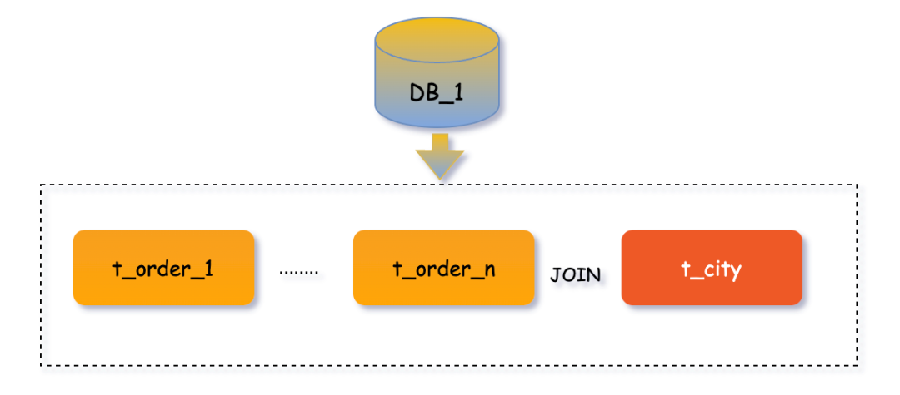

**<font style="color:rgb(9, 142, 252);background-color:rgb(255, 249, 249);">注意</font>**<font style="color:black;background-color:rgb(255, 249, 249);">：上边提到广播表在数据插入、更新与删除会实时在每个分片数据源均执行，也就是说如果有1000个分片数据源，那么修改一次广播表就要执行1000次SQL，所以尽量不在并发环境下和业务高峰时进行，以免影响系统的性能。</font>

## 单表
<font style="color:rgb(0, 0, 0);">单表指所有的分片数据源中仅唯一存在的表（没有分片的表），适用于数据量不大且无需分片的表。</font>

<font style="color:rgb(0, 0, 0);">如果一张表的数据量预估在千万级别，且没有与其他拆分表进行关联查询的需求，建议将其设置为单表类型，存储在默认分片数据源中。</font>

## 分片键
<font style="color:rgb(0, 0, 0);">分片键决定了数据落地的位置，也就是数据将会被分配到哪个数据节点上存储。因此，分片键的选择非常重要。</font>

<font style="color:rgb(0, 0, 0);">比如将 </font><font style="color:rgb(248, 35, 35);">t_order</font><font style="color:rgb(0, 0, 0);"> 表进行分片后，当插入一条订单数据执行SQL时，需要通过解析SQL语句中指定的分片键来计算数据应该落在哪个分片中。以表中</font><font style="color:rgb(248, 35, 35);">order_no</font><font style="color:rgb(0, 0, 0);">字段为例，可以通过对其取模运算（比如 </font><font style="color:rgb(248, 35, 35);">order_no % 2</font><font style="color:rgb(0, 0, 0);">）来得到分片编号，然后根据分片编号分配数据到对应的数据库实例（比如 </font><font style="color:rgb(248, 35, 35);">DB_1</font><font style="color:rgb(0, 0, 0);"> 和 </font><font style="color:rgb(248, 35, 35);">DB_2</font><font style="color:rgb(0, 0, 0);">）。拆分表也是同理计算。</font>

<font style="color:rgb(0, 0, 0);">在这个过程中，</font><font style="color:rgb(248, 35, 35);">order_no</font><font style="color:rgb(0, 0, 0);"> </font><font style="color:rgb(0, 0, 0);">就是</font><font style="color:rgb(0, 0, 0);"> </font><font style="color:rgb(248, 35, 35);">t_order</font><font style="color:rgb(0, 0, 0);"> </font><font style="color:rgb(0, 0, 0);">表的分片键。也就是说，每一条订单数据的</font><font style="color:rgb(0, 0, 0);"> </font><font style="color:rgb(248, 35, 35);">order_no</font><font style="color:rgb(0, 0, 0);"> </font><font style="color:rgb(0, 0, 0);">值决定了它应该存放的数据库实例和表。选择一个适合作为分片键的字段可以更好地利用水平分片带来的性能提升。</font>

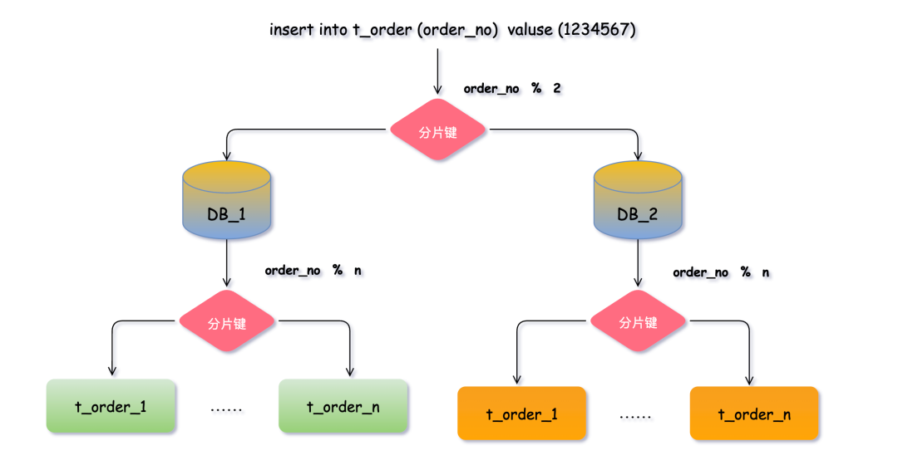

<font style="color:rgb(0, 0, 0);">这样同一个订单的相关数据就会落在同一个数据库、表中，查询订单时同理计算，就可直接定位数据位置，大幅提升数据检索的性能，避免了全库表扫描。</font>

<font style="color:rgb(0, 0, 0);">不仅如此</font><font style="color:rgb(0, 0, 0);"> </font><font style="color:rgb(248, 35, 35);">ShardingSphere</font><font style="color:rgb(0, 0, 0);"> </font><font style="color:rgb(0, 0, 0);">还支持根据多个字段作为分片健进行分片，这个在后续对应章节中会详细讲。</font>

## 分片策略
<font style="color:rgb(0, 0, 0);">分片策略来指定使用哪种分片算法、选择哪个字段作为分片键以及如何将数据分配到不同的节点上。</font>

<font style="color:rgb(0, 0, 0);">分片策略是由</font><font style="color:rgb(248, 35, 35);">分片算法</font><font style="color:rgb(0, 0, 0);">和</font><font style="color:rgb(248, 35, 35);">分片健</font><font style="color:rgb(0, 0, 0);">组合而成，分片策略中可以使用多种分片算法和对多个分片键进行运算。</font>

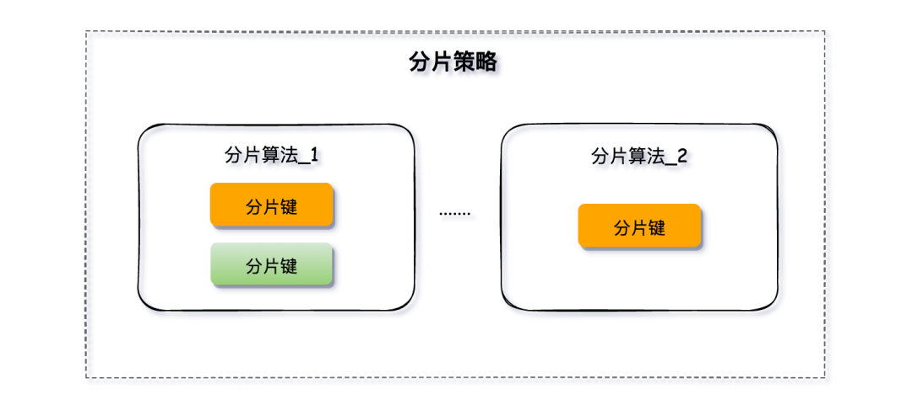

<font style="color:black;background-color:rgb(255, 249, 249);">分库、分表的分片策略配置是相对独立的，可以各自使用不同的策略与算法，每种策略中可以是多个分片算法的组合，每个分片算法可以对多个分片健做逻辑判断。</font>

## 分片算法
<font style="color:rgb(0, 0, 0);">分片算法则是用于对分片键进行运算，将数据划分到具体的数据节点中。</font>

<font style="color:rgb(0, 0, 0);">常用的分片算法有很多：</font>

+ **<font style="color:rgb(9, 142, 252);">哈希分片</font>**<font style="color:rgb(1, 1, 1);">：根据分片键的哈希值来决定数据应该落到哪个节点上。例如，根据用户 ID 进行哈希分片，将属于同一个用户的数据分配到同一个节点上，便于后续的查询操作。</font>
+ **<font style="color:rgb(9, 142, 252);">范围分片</font>**<font style="color:rgb(1, 1, 1);">：分片键值按区间范围分配到不同的节点上。例如，根据订单创建时间或者地理位置来进行分片。</font>
+ **<font style="color:rgb(9, 142, 252);">取模分片</font>**<font style="color:rgb(1, 1, 1);">：将分片键值对分片数取模，将结果作为数据应该分配到的节点编号。例如， order_no % 2 将订单数据分到两个节点之一。</font>
+ <font style="color:rgb(1, 1, 1);">.....</font>

<font style="color:rgb(0, 0, 0);">实际业务开发中分片的逻辑要复杂的多，不同的算法适用于不同的场景和需求，需要根据实际情况进行选择和调整。</font>

## 绑定表
<font style="color:rgb(0, 0, 0);">绑定表是那些具有相同分片规则的一组分片表，由于分片规则一致所产生的的数据落地位置相同，在</font><font style="color:rgb(248, 35, 35);">JOIN</font><font style="color:rgb(0, 0, 0);">联合查询时能有效</font>**<font style="color:rgb(9, 142, 252);">避免跨库</font>**<font style="color:rgb(0, 0, 0);">操作。</font>

<font style="color:rgb(0, 0, 0);">比如：</font><font style="color:rgb(248, 35, 35);">t_order</font><font style="color:rgb(0, 0, 0);"> </font><font style="color:rgb(0, 0, 0);">订单表和</font><font style="color:rgb(0, 0, 0);"> </font><font style="color:rgb(248, 35, 35);">t_order_item</font><font style="color:rgb(0, 0, 0);"> </font><font style="color:rgb(0, 0, 0);">订单项目表，都以</font><font style="color:rgb(0, 0, 0);"> </font><font style="color:rgb(248, 35, 35);">order_no</font><font style="color:rgb(0, 0, 0);"> </font><font style="color:rgb(0, 0, 0);">字段作为分片键，并且使用</font><font style="color:rgb(0, 0, 0);"> </font><font style="color:rgb(248, 35, 35);">order_no</font><font style="color:rgb(0, 0, 0);"> </font><font style="color:rgb(0, 0, 0);">进行关联，因此两张表互为绑定表关系。</font>

<font style="color:black;background-color:rgb(255, 249, 249);">使用绑定表进行多表关联查询时，必须使用分片键进行关联，否则会出现笛卡尔积关联或跨库关联，从而影响查询效率。</font>

<font style="color:rgb(0, 0, 0);">当使用</font><font style="color:rgb(0, 0, 0);"> </font><font style="color:rgb(248, 35, 35);">t_order</font><font style="color:rgb(0, 0, 0);"> </font><font style="color:rgb(0, 0, 0);">和</font><font style="color:rgb(0, 0, 0);"> </font><font style="color:rgb(248, 35, 35);">t_order_item</font><font style="color:rgb(0, 0, 0);"> </font><font style="color:rgb(0, 0, 0);">表进行多表联合查询，执行如下联合查询的逻辑SQL。</font>

```sql
SELECT * FROM t_order o JOIN t_order_item i ON o.order_no=i.order_no
```

<font style="color:rgb(0, 0, 0);">如果不配置绑定表关系，两个表的数据位置不确定就会全库表查询，出现笛卡尔积关联查询，将产生如下四条</font><font style="color:rgb(248, 35, 35);">SQL</font><font style="color:rgb(0, 0, 0);">。</font>

```sql
SELECT * FROM t_order_0 o JOIN t_order_item_0 i ON o.order_no=i.order_no 
SELECT * FROM t_order_0 o JOIN t_order_item_1 i ON o.order_no=i.order_no 
SELECT * FROM t_order_1 o JOIN t_order_item_0 i ON o.order_no=i.order_no 
SELECT * FROM t_order_1 o JOIN t_order_item_1 i ON o.order_no=i.order_no
```

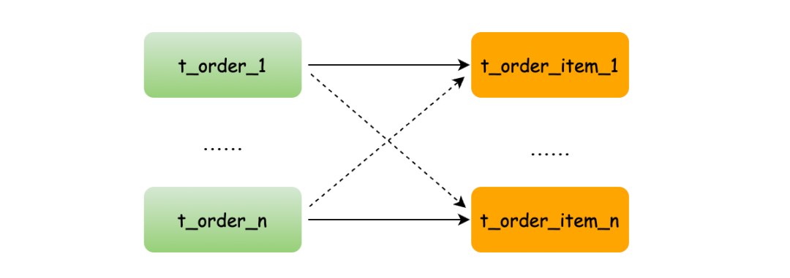

<font style="color:rgb(0, 0, 0);">而配置绑定表关系后再进行关联查询时，分片规则一致产生的数据就会落到同一个库表中，那么只需在当前库中</font><font style="color:rgb(0, 0, 0);"> </font><font style="color:rgb(248, 35, 35);">t_order_n</font><font style="color:rgb(0, 0, 0);"> </font><font style="color:rgb(0, 0, 0);">和</font><font style="color:rgb(0, 0, 0);"> </font><font style="color:rgb(248, 35, 35);">t_order_item_n</font><font style="color:rgb(0, 0, 0);"> </font><font style="color:rgb(0, 0, 0);">表关联即可。</font>

```sql
SELECT * FROM t_order_0 o JOIN t_order_item_0 i ON o.order_id=i.order_id 
SELECT * FROM t_order_1 o JOIN t_order_item_1 i ON o.order_id=i.order_id
```

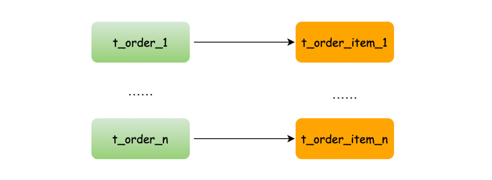

**<font style="color:rgb(9, 142, 252);background-color:rgb(255, 249, 249);">注意</font>**<font style="color:black;background-color:rgb(255, 249, 249);">：在关联查询时</font><font style="color:black;background-color:rgb(255, 249, 249);"> </font><font style="color:rgb(248, 35, 35);background-color:rgb(255, 249, 249);">t_order</font><font style="color:black;background-color:rgb(255, 249, 249);"> </font><font style="color:black;background-color:rgb(255, 249, 249);">它作为整个联合查询的主表。所有相关的路由计算都只使用主表的策略，</font><font style="color:rgb(248, 35, 35);background-color:rgb(255, 249, 249);">t_order_item</font><font style="color:black;background-color:rgb(255, 249, 249);"> </font><font style="color:black;background-color:rgb(255, 249, 249);">表的分片相关的计算也会使用</font><font style="color:black;background-color:rgb(255, 249, 249);"> </font><font style="color:rgb(248, 35, 35);background-color:rgb(255, 249, 249);">t_order</font><font style="color:black;background-color:rgb(255, 249, 249);"> </font><font style="color:black;background-color:rgb(255, 249, 249);">的条件，所以要保证绑定表之间的分片键要完全相同。</font>

## SQL 解析
<font style="color:rgb(0, 0, 0);">分库分表后在应用层面执行一条 SQL 语句时，通常需要经过以下六个步骤：</font><font style="color:rgb(248, 35, 35);">SQL 解析</font><font style="color:rgb(0, 0, 0);"> </font><font style="color:rgb(0, 0, 0);">-></font><font style="color:rgb(0, 0, 0);"> </font><font style="color:rgb(248, 35, 35);">执⾏器优化</font><font style="color:rgb(0, 0, 0);"> </font><font style="color:rgb(0, 0, 0);">-></font><font style="color:rgb(0, 0, 0);"> </font><font style="color:rgb(248, 35, 35);">SQL 路由</font><font style="color:rgb(0, 0, 0);"> </font><font style="color:rgb(0, 0, 0);">-></font><font style="color:rgb(0, 0, 0);"> </font><font style="color:rgb(248, 35, 35);">SQL 改写</font><font style="color:rgb(0, 0, 0);"> </font><font style="color:rgb(0, 0, 0);">-></font><font style="color:rgb(0, 0, 0);"> </font><font style="color:rgb(248, 35, 35);">SQL 执⾏</font><font style="color:rgb(0, 0, 0);"> </font><font style="color:rgb(0, 0, 0);">-></font><font style="color:rgb(0, 0, 0);"> </font><font style="color:rgb(248, 35, 35);">结果归并</font><font style="color:rgb(0, 0, 0);"> </font><font style="color:rgb(0, 0, 0);">。</font>

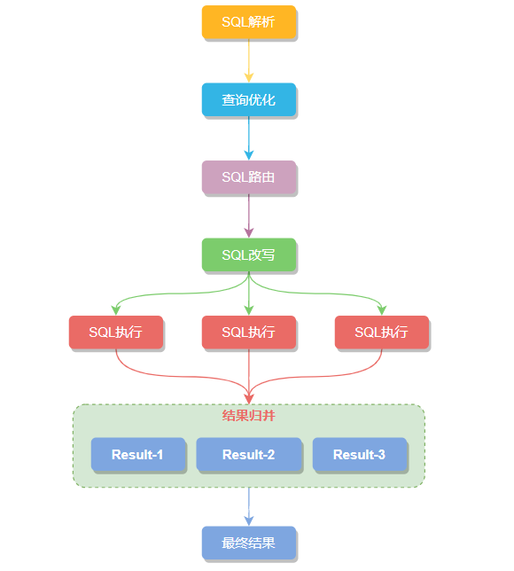

<font style="color:rgb(0, 0, 0);">SQL解析过程分为</font><font style="color:rgb(248, 35, 35);">词法解析</font><font style="color:rgb(0, 0, 0);">和</font><font style="color:rgb(248, 35, 35);">语法解析</font><font style="color:rgb(0, 0, 0);">两步，比如下边查询用户订单的SQL，先用词法解析将这条SQL拆解成不可再分的原子单元。在根据不同数据库方言所提供的字典，将这些单元归类为关键字，表达式，变量或者操作符等类型。</font>

```sql
SELECT order_no FROM t_order where  order_status > 0  and user_id = 10086
```

<font style="color:rgb(0, 0, 0);">接着语法解析会将拆分后的SQL关键字转换为抽象语法树，通过对抽象语法树遍历，提炼出分片所需的上下文，上下文包含查询字段信息（</font><font style="color:rgb(248, 35, 35);">Field</font><font style="color:rgb(0, 0, 0);">）、表信息（</font><font style="color:rgb(248, 35, 35);">Table</font><font style="color:rgb(0, 0, 0);">）、查询条件（</font><font style="color:rgb(248, 35, 35);">Condition</font><font style="color:rgb(0, 0, 0);">）、排序信息（</font><font style="color:rgb(248, 35, 35);">Order By</font><font style="color:rgb(0, 0, 0);">）、分组信息（</font><font style="color:rgb(248, 35, 35);">Group By</font><font style="color:rgb(0, 0, 0);">）以及分页信息（</font><font style="color:rgb(248, 35, 35);">Limit</font><font style="color:rgb(0, 0, 0);">）等，并标记出 SQL中有可能需要改写的位置。</font>

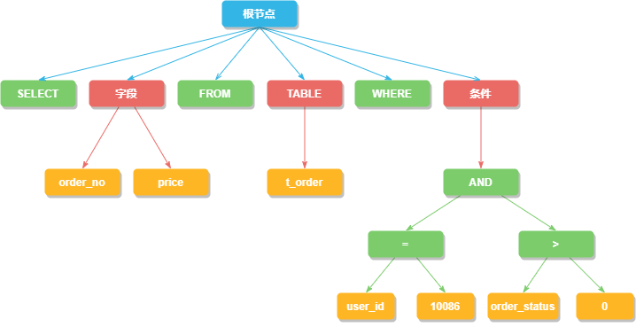

## 执行器优化
<font style="color:rgb(0, 0, 0);">执行器优化是根据SQL查询特点和执行统计信息，选择最优的查询计划并执行，比如</font><font style="color:rgb(248, 35, 35);">user_id</font><font style="color:rgb(0, 0, 0);">字段有索引，那么会调整两个查询条件的位置，主要是提高SQL的执行效率。</font>

```sql
SELECT order_no FROM t_order where user_id = 10086 and order_status > 0
```

## SQL 路由
<font style="color:rgb(0, 0, 0);">通过上边的SQL解析得到了分片上下文数据，在匹配用户配置的分片策略和算法，就可以运算生成路由路径，将 SQL 语句路由到相应的数据节点上。</font>

<font style="color:rgb(0, 0, 0);">简单点理解就是拿到分片策略中配置的分片键等信息，在从SQL解析结果中找到对应分片键字段的值，计算出 SQL该在哪个库的哪个表中执行，SQL路由又根据有无分片健分为</font><font style="color:rgb(0, 0, 0);"> </font><font style="color:rgb(248, 35, 35);">分片路由</font><font style="color:rgb(0, 0, 0);"> </font><font style="color:rgb(0, 0, 0);">和</font><font style="color:rgb(0, 0, 0);"> </font><font style="color:rgb(248, 35, 35);">广播路由</font><font style="color:rgb(0, 0, 0);">。</font>

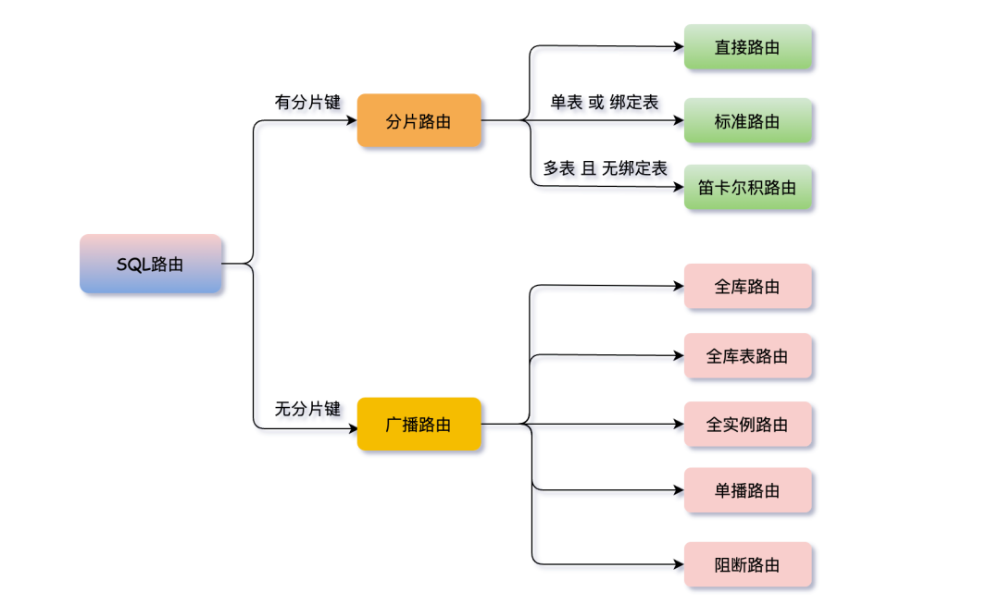

<font style="color:black;background-color:rgb(255, 249, 249);">有分片键的路由叫分片路由，细分为直接路由、标准路由和笛卡尔积路由这3种类型。</font>

### <font style="color:rgb(9, 142, 252) !important;">标准路由</font>
<font style="color:rgb(0, 0, 0);">标准路由是最推荐也是最为常用的分片方式，它的适用范围是不包含关联查询或仅包含绑定表之间关联查询的SQL。</font>

<font style="color:rgb(0, 0, 0);">当 SQL分片健的运算符为 </font><font style="color:rgb(248, 35, 35);">=</font><font style="color:rgb(0, 0, 0);"> 时，路由结果将落入单库（表），当分片运算符是</font><font style="color:rgb(248, 35, 35);"> BETWEEN</font><font style="color:rgb(0, 0, 0);"> 或</font><font style="color:rgb(248, 35, 35);"> IN</font><font style="color:rgb(0, 0, 0);"> 等范围时，路由结果则不⼀定落⼊唯⼀的库（表），因此⼀条逻辑SQL最终可能被拆分为多条用于执行的真实SQL。</font>

```sql
SELECT * FROM t_order  where t_order_id in (1,2)
```

<font style="color:rgb(0, 0, 0);">SQL路由处理后</font>

```sql
SELECT * FROM t_order_0  where t_order_id in (1,2)
SELECT * FROM t_order_1  where t_order_id in (1,2)
```

### <font style="color:rgb(9, 142, 252) !important;">直接路由</font>
<font style="color:rgb(0, 0, 0);">直接路由是直接将SQL路由到指定⾄库、表的一种分⽚方式，而且直接路由可以⽤于分⽚键不在SQL中的场景，还可以执行包括子查询、自定义函数等复杂情况的任意SQL。</font>

### <font style="color:rgb(9, 142, 252) !important;">笛卡尔积路由</font>
<font style="color:rgb(0, 0, 0);">笛卡尔路由是由非绑定表之间的关联查询产生的，比如订单表</font><font style="color:rgb(248, 35, 35);">t_order</font><font style="color:rgb(0, 0, 0);"> 分片键是</font><font style="color:rgb(248, 35, 35);">t_order_id </font><font style="color:rgb(0, 0, 0);">和用户表</font><font style="color:rgb(248, 35, 35);">t_user</font><font style="color:rgb(0, 0, 0);">分片键是</font><font style="color:rgb(248, 35, 35);">t_order_id </font><font style="color:rgb(0, 0, 0);">，两个表的分片键不同，要做联表查询，会执行笛卡尔积路由，查询性能较低尽量避免走此路由模式。</font>

```sql
SELECT * FROM t_order_0 t LEFT JOIN t_user_0 u ON u.user_id = t.user_id WHERE t.user_id = 1
SELECT * FROM t_order_0 t LEFT JOIN t_user_1 u ON u.user_id = t.user_id WHERE t.user_id = 1
SELECT * FROM t_order_1 t LEFT JOIN t_user_0 u ON u.user_id = t.user_id WHERE t.user_id = 1
SELECT * FROM t_order_1 t LEFT JOIN t_user_1 u ON u.user_id = t.user_id WHERE t.user_id = 1
```

<font style="color:black;background-color:rgb(255, 249, 249);">无分片键的路由又叫做广播路由，可以划分为全库表路由、全库路由、 全实例路由、单播路由和阻断路由这 5种类型。</font>

### <font style="color:rgb(9, 142, 252) !important;">全库表路由</font>
<font style="color:rgb(0, 0, 0);">全库表路由针对的是数据库 </font><font style="color:rgb(248, 35, 35);">DQL </font><font style="color:rgb(0, 0, 0);">和 </font><font style="color:rgb(248, 35, 35);">DML</font><font style="color:rgb(0, 0, 0);">，以及 </font><font style="color:rgb(248, 35, 35);">DDL</font><font style="color:rgb(0, 0, 0);">等操作，当执行一条逻辑表 </font><font style="color:rgb(248, 35, 35);">t_order</font><font style="color:rgb(0, 0, 0);"> SQL时，在所有分片库中对应的真实表 </font><font style="color:rgb(248, 35, 35);">t_order_0</font><font style="color:rgb(0, 0, 0);"> ···  </font><font style="color:rgb(248, 35, 35);">t_order_n</font><font style="color:rgb(0, 0, 0);"> 内逐一执行。</font>

### <font style="color:rgb(9, 142, 252) !important;">全库路由</font>
<font style="color:rgb(0, 0, 0);">全库路由主要是对数据库层面的操作，比如数据库</font><font style="color:rgb(0, 0, 0);"> </font><font style="color:rgb(248, 35, 35);">SET</font><font style="color:rgb(0, 0, 0);"> </font><font style="color:rgb(0, 0, 0);">类型的数据库管理命令，以及 TCL 这样的事务控制语句。</font>

<font style="color:rgb(0, 0, 0);">对逻辑库设置 </font>`<font style="color:rgb(248, 35, 35);">autocommit</font>`<font style="color:rgb(0, 0, 0);"> 属性后，所有对应的真实库中都执行该命令。</font>

```sql
SET autocommit=0;
```

### <font style="color:rgb(9, 142, 252) !important;">全实例路由</font>
<font style="color:rgb(0, 0, 0);">全实例路由是针对数据库实例的 DCL 操作（设置或更改数据库用户或角色权限），比如：创建一个用户 order ，这个命令将在所有的真实库实例中执行，以此确保 order 用户可以正常访问每一个数据库实例。</font>

```sql
CREATE USER order@127.0.0.1 identified BY 'Fcant';
```

### <font style="color:rgb(9, 142, 252) !important;">单播路由</font>
<font style="color:rgb(0, 0, 0);">单播路由用来获取某一真实表信息，比如获得表的描述信息：</font>

```sql
DESCRIBE t_order;
```

<font style="color:rgb(248, 35, 35);">t_order</font><font style="color:rgb(0, 0, 0);"> 的真实表是 </font><font style="color:rgb(248, 35, 35);">t_order_0</font><font style="color:rgb(0, 0, 0);"> ···· </font><font style="color:rgb(248, 35, 35);">t_order_n</font><font style="color:rgb(0, 0, 0);">，他们的描述结构相完全同，只需在任意的真实表执行一次就可以。</font>

### <font style="color:rgb(9, 142, 252) !important;">阻断路由</font>
<font style="color:rgb(0, 0, 0);">用来屏蔽SQL对数据库的操作，例如：</font>

```sql
USE order_db;
```

<font style="color:rgb(0, 0, 0);">这个命令不会在真实数据库中执行，因为 </font><font style="color:rgb(248, 35, 35);">ShardingSphere</font><font style="color:rgb(0, 0, 0);"> 采⽤的是逻辑 Schema（数据库的组织和结构） 方式，所以无需将切换数据库的命令发送至真实数据库中。</font>

<font style="color:rgb(0, 0, 0);"></font>

### <font style="color:#000000;">一、数据库瓶颈</font>
<font style="color:#000000;">不管是 IO 瓶颈，还是 CPU 瓶颈，最终都会导致数据库的活跃连接数增加，进而逼近甚至达到数据库可承载活跃连接数的阈值。在业务 Service 来看就是，可用数据库连接少甚至无连接可用。接下来就可以想象了吧（并发量、吞吐量、崩溃）。</font>

#### <font style="color:#000000;">1、IO 瓶颈</font>
<font style="color:#000000;">第一种：磁盘读 IO 瓶颈，热点数据太多，数据库缓存放不下，每次查询时会产生大量的 IO，降低查询速度 -> 分库和垂直分表。</font>

<font style="color:#000000;">第二种：网络 IO 瓶颈，请求的数据太多，网络带宽不够 -> 分库。</font>

#### <font style="color:#000000;">2、CPU 瓶颈</font>
<font style="color:#000000;">第一种：SQL 问题，如 SQL 中包含 join，group by，order by，非索引字段条件查询等，增加 CPU 运算的操作 -> SQL 优化，建立合适的索引，在业务 Service 层进行业务计算。</font>

<font style="color:#000000;">第二种：单表数据量太大，查询时扫描的行太多，SQL 效率低，增加 CPU 运算的操作 -> 水平分表。</font>

### <font style="color:#000000;">二、分库分表</font>
#### <font style="color:#000000;">1、水平分库</font>
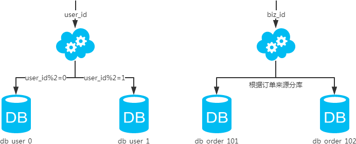

##### <font style="color:#000000;">概念：</font>
<font style="color:#000000;">以字段为依据，按照一定策略（hash、range 等），将一个库中的数据拆分到多个库中。</font>

##### <font style="color:#000000;">结果：</font>
+ <font style="color:#000000;">每个库的结构都一样；</font>
+ <font style="color:#000000;">每个库的数据都不一样，没有交集；</font>
+ <font style="color:#000000;">所有库的并集是全量数据；</font>

##### <font style="color:#000000;">场景：</font>
<font style="color:#000000;">系统绝对并发量上来了，分表难以根本上解决问题，并且还没有明显的业务归属来垂直分库。</font>

##### <font style="color:#000000;">分析：</font>
<font style="color:#000000;">库多了，io 和 cpu 的压力自然可以成倍缓解。 </font>

#### <font style="color:#000000;">2、水平分表</font>


##### <font style="color:#000000;">概念：</font>
<font style="color:#000000;">以字段为依据，按照一定策略（hash、range 等），将一个表中的数据拆分到多个表中。</font>

##### <font style="color:#000000;">结果：</font>
+ <font style="color:#000000;">每个表的结构都一样；</font>
+ <font style="color:#000000;">每个表的数据都不一样，没有交集；</font>
+ <font style="color:#000000;">所有表的并集是全量数据；</font>

##### <font style="color:#000000;">场景：</font>
<font style="color:#000000;">系统绝对并发量并没有上来，只是单表的数据量太多，影响了 SQL 效率，加重了 CPU 负担，以至于成为瓶颈。</font>

##### <font style="color:#000000;">分析：</font>
<font style="color:#000000;">表的数据量少了，单次 SQL 执行效率高，自然减轻了 CPU 的负担。</font>

#### <font style="color:#000000;">3、垂直分库</font>


##### <font style="color:#000000;">概念：</font>
<font style="color:#000000;">以表为依据，按照业务归属不同，将不同的表拆分到不同的库中。</font>

##### <font style="color:#000000;">结果：</font>
+ <font style="color:#000000;">每个库的结构都不一样；</font>
+ <font style="color:#000000;">每个库的数据也不一样，没有交集；</font>
+ <font style="color:#000000;">所有库的并集是全量数据；</font>

##### <font style="color:#000000;">场景：</font>
<font style="color:#000000;">系统绝对并发量上来了，并且可以抽象出单独的业务模块。</font>

##### <font style="color:#000000;">分析：</font>
<font style="color:#000000;">到这一步，基本上就可以服务化了。例如，随着业务的发展一些公用的配置表、字典表等越来越多，这时可以将这些表拆到单独的库中，甚至可以服务化。再有，随着业务的发展孵化出了一套业务模式，这时可以将相关的表拆到单独的库中，甚至可以服务化。</font>

#### <font style="color:#000000;">4、垂直分表</font>
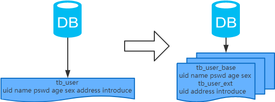

##### <font style="color:#000000;">概念：</font>
<font style="color:#000000;">以字段为依据，按照字段的活跃性，将表中字段拆到不同的表（主表和扩展表）中。</font>

##### <font style="color:#000000;">结果：</font>
+ <font style="color:#000000;">每个表的结构都不一样；</font>
+ <font style="color:#000000;">每个表的数据也不一样，一般来说，每个表的字段至少有一列交集，一般是主键，用于关联数据；</font>
+ <font style="color:#000000;">所有表的并集是全量数据；</font>

##### <font style="color:#000000;">场景：</font>
<font style="color:#000000;">系统绝对并发量并没有上来，表的记录并不多，但是字段多，并且热点数据和非热点数据在一起，单行数据所需的存储空间较大。以至于数据库缓存的数据行减少，查询时会去读磁盘数据产生大量的随机读 IO，产生 IO 瓶颈。</font>

##### <font style="color:#000000;">分析：</font>
<font style="color:#000000;">可以用列表页和详情页来帮助理解。垂直分表的拆分原则是将热点数据（可能会冗余经常一起查询的数据）放在一起作为主表，非热点数据放在一起作为扩展表。这样更多的热点数据就能被缓存下来，进而减少了随机读 IO。拆了之后，要想获得全部数据就需要关联两个表来取数据。</font>

<font style="color:#000000;">但记住，千万别用 join，因为 join 不仅会增加 CPU 负担并且会讲两个表耦合在一起（必须在一个数据库实例上）。关联数据，应该在业务 Service 层做文章，分别获取主表和扩展表数据然后用关联字段关联得到全部数据。</font>

### <font style="color:#000000;">三、分库分表工具</font>
+ **Sharding-jdbc** 这种 client 层方案的优点在于不用部署，运维成本低，不需要代理层的二次转发请求，性能很高，但是各个系统都需要耦合 Sharding-jdbc 的依赖，升级比较麻烦
+ **Mycat **这种 proxy 层方案的缺点在于需要部署，自己运维一套中间件，运维成本高，但是好处在于对于各个项目是透明的，如果遇到升级之类的都是自己中间件那里搞就行了

### <font style="color:#000000;">四、分库分表步骤</font>
<font style="color:#000000;">根据容量（当前容量和增长量）评估分库或分表个数 -> 选 key（均匀）-> 分表规则（hash 或 range 等）-> 执行（一般双写）-> 扩容问题（尽量减少数据的移动）。</font>

<font style="color:#000000;"></font>

假设系统目前有1亿用户：场景 10万写并发，100万读并发，60亿数据量设计时考虑极限情况，32库*32表~64个表，一共1000 ~ 2000张表

+ 支持3万的写并发，配合MQ实现每秒10万的写入速度
+ 读写分离6万读并发，配合分布式缓存每秒100读并发
+ 2000张表每张300万，可以最多写入60亿的数据
+ 32张用户表，支撑亿级用户，后续最多也就扩容一次


**动态扩容的步骤**

1. 推荐是 32 库 * 32 表，对于上述量级的公司来说，可能几年都够了。
2. 配置路由的规则，uid % 32 = 库，uid / 32 % 32 = 表
3. 扩容的时候，申请增加更多的数据库服务器，呈倍数扩容
4. 由 DBA 负责将原先数据库服务器的库，迁移到新的数据库服务器上去
5. 修改一下配置，重新发布系统，上线，原先的路由规则变都不用变
6. 直接可以基于 n 倍的数据库服务器的资源，继续进行线上系统的提供服务。

<font style="color:#000000;"></font>

### <font style="color:#000000;">五、分库分表问题</font>
<font style="color:#000000;">1、非 partition key 的查询问题（水平分库分表，拆分策略为常用的 hash 法）</font>

#### <font style="color:#000000;">单key业务</font>
##### <font style="color:#000000;">索引表法、缓存映射法</font>


##### <font style="color:#000000;">基因法</font>
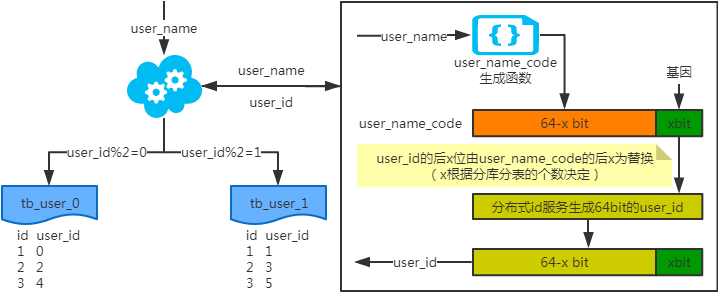

<font style="color:#000000;">注：</font>

<font style="color:#000000;">通过对user_name执行一个随机函数，得到一个68bit的code，然后取最后4个bit作为基因，比如4bit基因是1010</font>

<font style="color:#000000;">写入时，基因法生成 user_id，如图。关于 xbit 基因，例如要分16张表，2的4次方等于16，故 x 取4，即 4bit 基因，这个基因可以是0到15之间的任意值，根据 user_id 查询时可直接取模路由到对应的分库或分表，比如：user_id=777，777的二进制表示为：0011 0000 1001，然后拼接4bit基因1010，1010转换为10进制为10，之后10%16，落在表10</font>

<font style="color:#000000;">根据 user_name 查询时，先通过 user_name_code 生成函数生成 user_name_code 再对其取模路由到对应的分库或分表。id 生成常用 snowflake 算法。</font>


#### <font style="color:#000000;">多key业务</font>
##### <font style="color:#000000;">索引表法、缓存映射法</font>
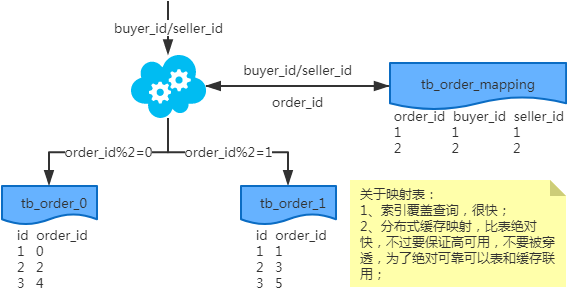

**<font style="color:#000000;">冗余法</font>**


+ <font style="color:#000000;">异步双写：包含线上异步(ESB)和线下异步(Log)</font>
+ <font style="color:#000000;">按照 order_id 或 buyer_id 查询时路由到 db_o_buyer 库中，按照 seller_id 查询时路由到 db_o_seller 库中</font>


### <font style="color:#000000;">六、分库分表总结</font>
+ <font style="color:#000000;">分库分表，首先得知道瓶颈在哪里，然后才能合理地拆分（分库还是分表？水平还是垂直？分几个？）。且不可为了分库分表而拆分。</font>
+ <font style="color:#000000;">选 key 很重要，既要考虑到拆分均匀，也要考虑到非 partition key 的查询。</font>
+ <font style="color:#000000;">只要能满足需求，拆分规则越简单越好。</font>

<font style="color:#000000;"></font>


> 更新: 2025-06-18 16:39:06  
> 原文: <https://www.yuque.com/tulingzhouyu/db22bv/dlta7pxy0o81zta9>