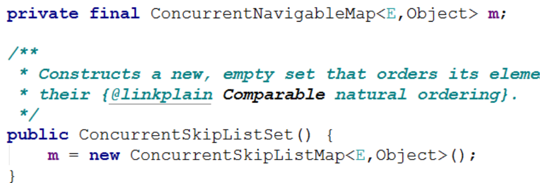
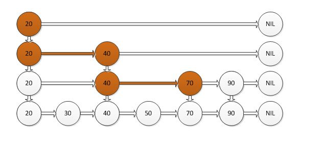

# ConcurrentSkipList系列原理

ConcurrentSkipList是有序的容器

是TreeMap 和TreeSet的并发集合替代品.

 

ConcurrentSkipListMap  有序Map

ConcurrentSkipListSet   有序Set

 

TreeMap和TreeSet使用红黑树按照key的顺序（自然顺序、自定义顺序）来使得键值对有序存储_，_但是只能在单线程下安全使用；多线程下想要使键值对按照key的顺序来存储，则需要使用ConcurrentSkipListMap和ConcurrentSkipListSet，分别用以代替TreeMap和TreeSet，存入的数据按key排序。在实现上，ConcurrentSkipListSet 本质上就是ConcurrentSkipListMap。

 

## （一）了解什么是SkipList？
### 1．二分查找和AVL树查找
二分查找要求元素可以随机访问，所以决定了需要把元素存储在连续内存。这样查找确实很快，但是插入和删除元素的时候，为了保证元素的有序性，就需要大量的移动元素了。

如果需要的是一个能够进行二分查找，又能快速添加和删除元素的数据结构，首先就是二叉查找树，二叉查找树在最坏情况下可能变成一个链表。

于是，就出现了平衡二叉树，根据平衡算法的不同有AVL树，B-Tree，B+Tree，红黑树等，但是AVL树实现起来比较复杂，平衡操作较难理解，这时候就可以用SkipList跳跃表结构。

 

### 2．什么是跳表
 

传统意义的单链表是一个线性结构，向有序的链表中插入一个节点需要O(n)的时间，查找操作需要O(n)的时间。

 

 

如果我们使用上图所示的跳跃表，就可以减少查找所需时间为O(n/2)，因为我们可以先通过每个节点的最上面的指针先进行查找，这样子就能跳过一半的节点。

 

查找过程:

比如我们想查找50，首先和20比较，大于20之后，在和40进行比较，然后在和70进行比较，发现70大于50，说明查找的点在40和50之间，从这个过程中，我们可以看出，查找的时候跳过了30。

 

设计思想:

跳跃表其实也是一种通过“空间来换取时间”的一个算法，令链表的每个结点不仅记录next结点位置，还可以按照level层级分别记录后继第level个结点。此法使用的就是“先大步查找确定范围，再逐渐缩小迫近”的思想进行的查找。跳跃表在算法效率上很接近红黑树。

 

概率数据结构

 

跳跃表又被称为概率，或者说是随机化的数据结构，目前开源软件 Redis 和 lucence都有用到它。

新插入的元素的时候,这个元素到底应不应该成节点呢,就是随机,如果随机到了就成为节点了,如果不是就算了.

 

 

都是线程安全的Map实现，ConcurrentHashMap的性能和存储空间要优于ConcurrentSkipListMap，但是ConcurrentSkipListMap有一个功能： 它会按照键的顺序进行排序。

 

 

## （二）ConcurrentSkipListMap
 

使用场景

 

ConcurrentSkipListMap使用跳表结构来保存链表的顺序，解决了在有序链表中快速查找的问题，所以ConcurrentSkipListMap适合在需要链表的高效更新效率(删除/插入)以及还要保证一定的随机访问效率(查找/更新)的场景下使用。

 

 

参考:

[https://www.cnblogs.com/skywang12345/p/3498556.html](https://www.cnblogs.com/skywang12345/p/3498556.html)

[https://blog.csdn.net/sunxianghuang/article/details/52221913](https://blog.csdn.net/sunxianghuang/article/details/52221913)

 

### 1．API
|   // 构造一个新的空映射，该映射按照键的自然顺序进行排序。 ConcurrentSkipListMap() // 构造一个新的空映射，该映射按照指定的比较器进行排序。 ConcurrentSkipListMap(Comparator<? super K> comparator) // 构造一个新映射，该映射所包含的映射关系与给定映射包含的映射关系相同，并按照键的自然顺序进行排序。 ConcurrentSkipListMap(Map<? extends K,? extends V> m) // 构造一个新映射，该映射所包含的映射关系与指定的有序映射包含的映射关系相同，使用的顺序也相同。 ConcurrentSkipListMap(SortedMap<K,? extends V> m)   // 返回与大于等于给定键的最小键关联的键-值映射关系；如果不存在这样的条目，则返回 null。 Map.Entry<K,V> ceilingEntry(K key) // 返回大于等于给定键的最小键；如果不存在这样的键，则返回 null。 K ceilingKey(K key) // 从此映射中移除所有映射关系。 void clear() // 返回此 ConcurrentSkipListMap 实例的浅表副本。 ConcurrentSkipListMap<K,V> clone() // 返回对此映射中的键进行排序的比较器；如果此映射使用键的自然顺序，则返回 null。 Comparator<? super K> comparator() // 如果此映射包含指定键的映射关系，则返回 true。 boolean containsKey(Object key) // 如果此映射为指定值映射一个或多个键，则返回 true。 boolean containsValue(Object value) // 返回此映射中所包含键的逆序 NavigableSet 视图。 NavigableSet<K> descendingKeySet() // 返回此映射中所包含映射关系的逆序视图。 ConcurrentNavigableMap<K,V> descendingMap() // 返回此映射中所包含的映射关系的 Set 视图。 Set<Map.Entry<K,V>> entrySet() // 比较指定对象与此映射的相等性。 boolean equals(Object o) // 返回与此映射中的最小键关联的键-值映射关系；如果该映射为空，则返回 null。 Map.Entry<K,V> firstEntry() // 返回此映射中当前第一个（最低）键。 K firstKey() // 返回与小于等于给定键的最大键关联的键-值映射关系；如果不存在这样的键，则返回 null。 Map.Entry<K,V> floorEntry(K key) // 返回小于等于给定键的最大键；如果不存在这样的键，则返回 null。 K floorKey(K key) // 返回指定键所映射到的值；如果此映射不包含该键的映射关系，则返回 null。 V get(Object key) // 返回此映射的部分视图，其键值严格小于 toKey。 ConcurrentNavigableMap<K,V> headMap(K toKey) // 返回此映射的部分视图，其键小于（或等于，如果 inclusive 为 true）toKey。 ConcurrentNavigableMap<K,V> headMap(K toKey, boolean inclusive) // 返回与严格大于给定键的最小键关联的键-值映射关系；如果不存在这样的键，则返回 null。 Map.Entry<K,V> higherEntry(K key) // 返回严格大于给定键的最小键；如果不存在这样的键，则返回 null。 K higherKey(K key) // 如果此映射未包含键-值映射关系，则返回 true。 boolean isEmpty() // 返回此映射中所包含键的 NavigableSet 视图。 NavigableSet<K> keySet() // 返回与此映射中的最大键关联的键-值映射关系；如果该映射为空，则返回 null。 Map.Entry<K,V> lastEntry() // 返回映射中当前最后一个（最高）键。 K lastKey() // 返回与严格小于给定键的最大键关联的键-值映射关系；如果不存在这样的键，则返回 null。 Map.Entry<K,V> lowerEntry(K key) // 返回严格小于给定键的最大键；如果不存在这样的键，则返回 null。 K lowerKey(K key) // 返回此映射中所包含键的 NavigableSet 视图。 NavigableSet<K> navigableKeySet() // 移除并返回与此映射中的最小键关联的键-值映射关系；如果该映射为空，则返回 null。 Map.Entry<K,V> pollFirstEntry() // 移除并返回与此映射中的最大键关联的键-值映射关系；如果该映射为空，则返回 null。 Map.Entry<K,V> pollLastEntry() // 将指定值与此映射中的指定键关联。 V put(K key, V value) // 如果指定键已经不再与某个值相关联，则将它与给定值关联。 V putIfAbsent(K key, V value) // 从此映射中移除指定键的映射关系（如果存在）。 V remove(Object key) // 只有目前将键的条目映射到给定值时，才移除该键的条目。 boolean remove(Object key, Object value) // 只有目前将键的条目映射到某一值时，才替换该键的条目。 V replace(K key, V value) // 只有目前将键的条目映射到给定值时，才替换该键的条目。 boolean replace(K key, V oldValue, V newValue) // 返回此映射中的键-值映射关系数。 int size() // 返回此映射的部分视图，其键的范围从 fromKey 到 toKey。 ConcurrentNavigableMap<K,V> subMap(K fromKey, boolean fromInclusive, K toKey, boolean toInclusive) // 返回此映射的部分视图，其键值的范围从 fromKey（包括）到 toKey（不包括）。 ConcurrentNavigableMap<K,V> subMap(K fromKey, K toKey) // 返回此映射的部分视图，其键大于等于 fromKey。 ConcurrentNavigableMap<K,V> tailMap(K fromKey) // 返回此映射的部分视图，其键大于（或等于，如果 inclusive 为 true）fromKey。 ConcurrentNavigableMap<K,V> tailMap(K fromKey, boolean inclusive) // 返回此映射中所包含值的 Collection 视图。 Collection<V> values() |
| --- |

 

 

## （三）ConcurrentSkipListSet
 

就是线程安全的有序的集合

 

更多源码解析可参考:

[https://www.cnblogs.com/skywang12345/p/3498634.html](https://www.cnblogs.com/skywang12345/p/3498634.html)

> 更新: 2025-01-24 14:59:46  
> 原文: <https://www.yuque.com/tulingzhouyu/db22bv/ln9qeqinrwe13ugn>