# 💎 Java并发面试题合集

# <font style="color:#01B2BC;">判断线程池任务执行完成的方式</font>
Thread线程是否执行完成，我们可以调用join方法然后等待线程执行完成；那在使用线程池的时候，我们如何知道线程已经执行完成了？本文就带给大家**<font style="color:#ED740C;">五种</font>**判断的方式：

+ <font style="color:#DF2A3F;">isTerminated()</font> 方<font style="color:#DF2A3F;"></font>式，在执行 shutdown() ，关闭线程池后，判断是否所有任务已经完成。
+ ThreadPoolExecutor 的 <font style="color:#DF2A3F;">getCompletedTaskCount()</font> 方法，判断完成任务数和全部任务数是否相等。
+ <font style="color:#DF2A3F;">CountDownLatch计数器</font>，使用闭锁计数来判断是否全部完成。
+ 手动维护一个<font style="color:#DF2A3F;">公共计数</font> ，原理和闭锁类似，就是更加灵活。
+ 使用<font style="color:#DF2A3F;">submit</font>向线程池<font style="color:#DF2A3F;">提交</font>任务，<font style="color:#DF2A3F;">Future判断</font>任务执行状态。

## 方法一：<font style="color:#A58F04;">isTerminated() </font>
### 测试代码
```powershell
package pool;

import java.util.concurrent.LinkedBlockingQueue;
import java.util.concurrent.ThreadPoolExecutor;
import java.util.concurrent.TimeUnit;

/**
 * @author 百里
 */
public class BaiLiIsShutdownThreadPoolDemo {
    /**
     * 创建一个最大线程数15的线程池
     */
    public static ThreadPoolExecutor pool = new ThreadPoolExecutor(
            10,
            15,
            0L,
            TimeUnit.MILLISECONDS,
            new ArrayBlockingQueue<>(10));
    /**
     * 线程执行方法，随机等待0到10秒
     */
    private static void sleepMethod(int index){
        try {
            long sleepTime = new Double(Math.random() * 10000).longValue();
            Thread.sleep(sleepTime);
            System.out.println("当前线程执行结束: " + index);
        } catch (InterruptedException e) {
            e.printStackTrace();
        }
    }

    /**
     * 方法一：isTerminated
     * @param args
     * @throws InterruptedException
     */
    public static void main(String[] args) throws InterruptedException {
        for (int i = 0; i < 10; i++) {
            int index = i;
            pool.execute(() -> sleepMethod(index));
        }
        pool.shutdown();
        while (!pool.isTerminated()){
            Thread.sleep(1000);
            System.out.println("还没停止。。。");
        }
        System.out.println("全部执行完毕");
    }
}
```

上述代码处理逻辑在主线程中进行循环判断，全部任务是否已经完成。

这里有两个主要方法：

+ <font style="color:#DF2A3F;">shutdown() </font>：对线程池进行有序关闭。调用该方法后，线程池将不再接受新的任务，但会继续执行已提交的任务。如果线程池已经处于关闭状态，则对该方法的调用没有额外的作用。
+ <font style="color:#DF2A3F;">isTerminated() </font>：判断线程池中的所有任务是否在关闭后完成。只有在调用了shutdown()或shutdownNow()方法后，所有任务执行完毕，才会返回true。需要注意的是，在调用shutdown()之前调用isTerminated()方法始终返回false。

### <font style="color:rgb(37, 41, 51);">优缺点分析</font>
优点 ：操作简单。  
缺点 ：需要关闭线程池。并且日常使用是将线程池注入到Spring容器，然后各个组件中统一用同一个线程池，不能直接关闭线程池。

## 方法二：<font style="color:#A58F04;">getCompletedTaskCount()</font>
### 测试代码
```powershell
package pool;

import java.util.concurrent.*;
import java.util.concurrent.locks.Lock;
import java.util.concurrent.locks.ReentrantLock;

/**
 * @author 百里
 */
public class BaiLiIsShutdownThreadPoolDemo {
    /**
     * 创建一个最大线程数15的线程池
     */
    public static ThreadPoolExecutor pool = new ThreadPoolExecutor(
            10,
            15,
            0L,
            TimeUnit.MILLISECONDS,
            new ArrayBlockingQueue<>(10));
    /**
     * 线程执行方法，随机等待0到10秒
     */
    private static void sleepMethod(int index){
        try {
            long sleepTime = new Double(Math.random() * 10000).longValue();
            Thread.sleep(sleepTime);
            System.out.println("当前线程执行结束: " + index);
        } catch (InterruptedException e) {
            e.printStackTrace();
        }
    }

    /**
     * 方法二：getCompletedTaskCount
     * @param args
     * @throws InterruptedException
     */
    public static void main(String[] args) throws InterruptedException {
        for (int i = 0; i < 10; i++) {
            int index = i;
            pool.execute(() -> sleepMethod(index));
        }
        //当线程池完成的线程数等于线程池中的总线程数
        while (!(pool.getTaskCount() == pool.getCompletedTaskCount())) {
            System.out.println("任务总数:" + pool.getTaskCount() + "； 已经完成任务数:" + pool.getCompletedTaskCount());
            Thread.sleep(1000);
            System.out.println("还没停止。。。");
        }
        System.out.println("全部执行完毕");
    }
}

```

  
上述代码处理逻辑还是一样在主线程循环判断，主要就两个方法：

+ <font style="color:#DF2A3F;">getTaskCount() </font>：返回计划执行的任务总数。由于任务和线程的状态可能在计算过程中动态变化，返回的值只是一个近似值。这个方法返回的是线程池提交的任务总数，包括已经完成和正在执行中的任务。
+ <font style="color:#DF2A3F;">getCompletedTaskCount() </font>：返回已经完成执行的任务的大致总数。由于任务和线程的状态可能在计算过程中动态改变，返回的值只是一个近似值，并且在连续的调用中不会减少。这个方法返回的是已经完成执行的任务数量，不包括正在执行中的任务。

### <font style="color:rgb(37, 41, 51);">优缺点分析</font>
+ 优点 ：不必关闭线程池，避免了创建和销毁带来的损耗。
+ 缺点 ：使用这种判断存在很大的限制条件；必须确定在循环判断过程中没有新的任务产生。

## 方法三：<font style="color:#A58F04;">CountDownLatch</font>
### 测试代码
```powershell
package pool;

import java.util.concurrent.*;
import java.util.concurrent.locks.Lock;
import java.util.concurrent.locks.ReentrantLock;

/**
 * @author 百里
 */
public class BaiLiIsShutdownThreadPoolDemo {
    /**
     * 创建一个最大线程数15的线程池
     */
    public static ThreadPoolExecutor pool = new ThreadPoolExecutor(
            10,
            15,
            0L,
            TimeUnit.MILLISECONDS,
            new ArrayBlockingQueue<>(10));
    /**
     * 线程执行方法，随机等待0到10秒
     */
    private static void sleepMethod(int index){
        try {
            long sleepTime = new Double(Math.random() * 10000).longValue();
            Thread.sleep(sleepTime);
            System.out.println("当前线程执行结束: " + index);
        } catch (InterruptedException e) {
            e.printStackTrace();
        }
    }

    /**
     * 方法三：CountDownLatch
     * @throws Exception
     */
    public static void main(String[] args) throws Exception {
        //计数器，判断线程是否执行结束
        CountDownLatch taskLatch = new CountDownLatch(10);
        for (int i = 0; i < 10; i++) {
            int index = i;
            pool.execute(() -> {
                sleepMethod(index);
                taskLatch.countDown();
                System.out.println("当前计数器数量：" + taskLatch.getCount());
            });
        }
        //当前线程阻塞，等待计数器置为0
        taskLatch.await();
        System.out.println("全部执行完毕");
    }
}

```

### <font style="color:rgb(37, 41, 51);">优缺点分析</font>
优点 ：代码优雅，不需要对线程池进行操作。  
缺点 ：需要提前知道线程数量；性能较差；还需要在线程代码块内加上异常判断，否则在 countDown之前发生异常而没有处理，就会导致主线程永远阻塞在 await。

## 方法四：<font style="color:#A58F04;">公共计数</font>
### 测试代码
```powershell
package pool;

import java.util.concurrent.*;
import java.util.concurrent.locks.Lock;
import java.util.concurrent.locks.ReentrantLock;

/**
 * @author 百里
 */
public class BaiLiIsShutdownThreadPoolDemo {
    /**
     * 创建一个最大线程数15的线程池
     */
    public static ThreadPoolExecutor pool = new ThreadPoolExecutor(
            10,
            15,
            0L,
            TimeUnit.MILLISECONDS,
            new ArrayBlockingQueue<>(10));
    /**
     * 线程执行方法，随机等待0到10秒
     */
    private static void sleepMethod(int index){
        try {
            long sleepTime = new Double(Math.random() * 10000).longValue();
            Thread.sleep(sleepTime);
            System.out.println("当前线程执行结束: " + index);
        } catch (InterruptedException e) {
            e.printStackTrace();
        }
    }

    private static int taskNum = 0; //计数器

    /**
     * 方法四：公共计数
     * @throws Exception
     */
    public static void main(String[] args) throws Exception {
        Lock lock = new ReentrantLock();
        for (int i = 0; i < 10; i++) {
            int index = i;
            pool.execute(() -> {
                sleepMethod(index);
                lock.lock();
                taskNum++;
                lock.unlock();
            });
        }
        while(taskNum < 10) {
            Thread.sleep(1000);
            System.out.println("还没停止。。。当前完成任务数:" + taskNum);
        }
        System.out.println("全部执行完毕");
    }
}
```

这种实现其实就是通过加锁计数，然后循环判断。

### 优缺点分析
+ 优点 ：手动维护方式更加灵活，对于一些特殊场景可以手动处理。
+ 缺点 ：和CountDownLatch相比，一样需要知道线程数目，但是代码实现比较麻烦。

## 方法五：<font style="color:#A58F04;">Future</font>
### 测试代码
```powershell
package pool;

import java.util.concurrent.*;
import java.util.concurrent.locks.Lock;
import java.util.concurrent.locks.ReentrantLock;

/**
 * @author 百里
 */
public class BaiLiIsShutdownThreadPoolDemo {
    /**
     * 创建一个最大线程数15的线程池
     */
    public static ThreadPoolExecutor pool = new ThreadPoolExecutor(
            10,
            15,
            0L,
            TimeUnit.MILLISECONDS,
            new ArrayBlockingQueue<>(10));
    /**
     * 线程执行方法，随机等待0到10秒
     */
    private static void sleepMethod(int index){
        try {
            long sleepTime = new Double(Math.random() * 10000).longValue();
            Thread.sleep(sleepTime);
            System.out.println("当前线程执行结束: " + index);
        } catch (InterruptedException e) {
            e.printStackTrace();
        }
    }

    /**
     * 方法五：Future
     * @throws Exception
     */
    public static void main(String[] args) throws Exception {
        Future future = pool.submit(() -> sleepMethod(1));
        while (!future.isDone()){
            Thread.sleep(1000);
            System.out.println("还没停止。。。");
        }
        System.out.println("全部执行完毕");
    }
}

```

### 优缺点分析
优点：使用简单，不需要关闭线程池。

缺点：每个提交给线程池的任务都会关联一个Future对象，这可能会引入额外的内存开销。如果需要处理大量的任务，可能会占用较多的内存。

## <font style="color:#A58F04;">测试代码汇总</font>
```powershell
package pool;

import java.util.concurrent.*;
import java.util.concurrent.locks.Lock;
import java.util.concurrent.locks.ReentrantLock;

/**
 * 五种判断线程池任务执行完成的方式
 * @author 百里
 */
public class BaiLiIsShutdownThreadPoolDemo {
    /**
     * 创建一个最大线程数15的线程池
     */
    public static ThreadPoolExecutor pool = new ThreadPoolExecutor(
            10,
            15,
            0L,
            TimeUnit.MILLISECONDS,
            new ArrayBlockingQueue<>(10));
    /**
     * 线程执行方法，随机等待0到10秒
     */
    private static void sleepMethod(int index){
        try {
            long sleepTime = new Double(Math.random() * 10000).longValue();
            Thread.sleep(sleepTime);
            System.out.println("当前线程执行结束: " + index);
        } catch (InterruptedException e) {
            e.printStackTrace();
        }
    }

    /**
     * 方法一：isTerminated
     * @param args
     * @throws InterruptedException
     */
    public static void isTerminatedTest(String[] args) throws InterruptedException {
        for (int i = 0; i < 10; i++) {
            int index = i;
            pool.execute(() -> sleepMethod(index));
        }
        pool.shutdown();
        while (!pool.isTerminated()){
            Thread.sleep(1000);
            System.out.println("还没停止。。。");
        }
        System.out.println("全部执行完毕");
    }


    /**
     * 方法二：getCompletedTaskCount
     * @param args
     * @throws InterruptedException
     */
    public static void completedTaskCountTest(String[] args) throws InterruptedException {
        for (int i = 0; i < 10; i++) {
            int index = i;
            pool.execute(() -> sleepMethod(index));
        }
        //当线程池完成的线程数等于线程池中的总线程数
        while (!(pool.getTaskCount() == pool.getCompletedTaskCount())) {
            System.out.println("任务总数:" + pool.getTaskCount() + "； 已经完成任务数:" + pool.getCompletedTaskCount());
            Thread.sleep(1000);
            System.out.println("还没停止。。。");
        }
        System.out.println("全部执行完毕");
    }

    /**
     * 方法三：CountDownLatch
     * @throws Exception
     */
    public static void countDownLatchTest(String[] args) throws Exception {
        //计数器，判断线程是否执行结束
        CountDownLatch taskLatch = new CountDownLatch(10);
        for (int i = 0; i < 10; i++) {
            int index = i;
            pool.execute(() -> {
                sleepMethod(index);
                taskLatch.countDown();
                System.out.println("当前计数器数量：" + taskLatch.getCount());
            });
        }
        //当前线程阻塞，等待计数器置为0
        taskLatch.await();
        System.out.println("全部执行完毕");
    }

    private static int taskNum = 0;

    /**
     * 方法四：公共计数
     * @throws Exception
     */
    public static void countTest(String[] args) throws Exception {
        Lock lock = new ReentrantLock();
        for (int i = 0; i < 10; i++) {
            int index = i;
            pool.execute(() -> {
                sleepMethod(index);
                lock.lock();
                taskNum++;
                lock.unlock();
            });
        }
        while(taskNum < 10) {
            Thread.sleep(1000);
            System.out.println("还没停止。。。当前完成任务数:" + taskNum);
        }
        System.out.println("全部执行完毕");
    }

    /**
     * 方法五：Future
     * @throws Exception
     */
    public static void futureTest(String[] args) throws Exception {
        Future future = pool.submit(() -> sleepMethod(1));
        while (!future.isDone()){
            Thread.sleep(1000);
            System.out.println("还没停止。。。");
        }
        System.out.println("全部执行完毕");
    }
}
```

# <font style="color:#01B2BC;">如何理解阻塞、非阻塞与同步、异步的区别？</font>
## <font style="color:rgb(25, 27, 31);">同步与异步</font>
<font style="color:rgb(25, 27, 31);">同步与异步关注的是</font>**<font style="color:rgb(25, 27, 31);">消息通信机制</font>**<font style="color:rgb(25, 27, 31);">。</font>

+ **<font style="color:rgb(25, 27, 31);">所谓同步</font>**<font style="color:rgb(25, 27, 31);">，就是在发出一个</font>**<font style="color:rgb(25, 27, 31);">调用</font>**<font style="color:rgb(25, 27, 31);">时，在没有得到结果之前，该调用就不返回。但是一旦调用返回，就得到返回值了。换句话说，就是由调用者主动等待这个调用的结果。</font>
+ <font style="color:rgb(25, 27, 31);">而</font>**<font style="color:rgb(25, 27, 31);">异步</font>**<font style="color:rgb(25, 27, 31);">则是相反，调用在发出之后，这个调用就直接返回了，所以就没有返回结果。换句话说，当一个异步过程调用发出后，调用者不会立刻得到结果。而是在调用发出之后，被调用者通过</font>**<font style="color:rgb(25, 27, 31);">“状态”</font>**<font style="color:rgb(25, 27, 31);">、</font>**<font style="color:rgb(25, 27, 31);">“通知”</font>**<font style="color:rgb(25, 27, 31);">、</font>**<font style="color:rgb(25, 27, 31);">“回调”</font>**<font style="color:rgb(25, 27, 31);">三种途径通知调用者。</font>

<font style="color:rgb(25, 27, 31);">可以使用哪一种途径依赖于被调用者的实现，除非被调用者提供多种选择，否则不受调用者控制。</font>

+ <font style="color:rgb(25, 27, 31);">如果被调用者用状态来通知，那么调用者就需要每隔一定时间检查一次，效率就很低。</font>
+ <font style="color:rgb(25, 27, 31);">如果使用通知和回调的方式，效率则很高。因为被调用者几乎不需要做额外的操作。</font>

**<font style="color:rgb(25, 27, 31);">举个例子：</font>**

<font style="color:rgb(25, 27, 31);">你打电话问书店老板有没有《高效演讲》这本书。</font>

<font style="color:rgb(25, 27, 31);">如果是</font>**<font style="color:rgb(25, 27, 31);">同步通信机制</font>**<font style="color:rgb(25, 27, 31);">，书店老板会说，你稍等，”我查一下"，然后开始查啊查，等查好了（可能是5秒，也可能是一天）告诉你结果（返回结果）。</font>

<font style="color:rgb(25, 27, 31);">而</font>**<font style="color:rgb(25, 27, 31);">异步通信机制</font>**<font style="color:rgb(25, 27, 31);">，书店老板直接告诉你我查一下啊，查好了打电话给你，然后直接挂电话了（不返回结果）。然后查好了，他会主动打电话给你。在这里老板通过“回电”这种方式来回调。</font>

## <font style="color:rgb(25, 27, 31);">阻塞与非阻塞</font>
<font style="color:rgb(25, 27, 31);">阻塞和非阻塞关注的是</font>**<font style="color:rgb(25, 27, 31);">程序在等待调用结果</font>**<font style="color:rgb(25, 27, 31);">（消息，返回值）时的状态。</font>

+ **<font style="color:rgb(25, 27, 31);">阻塞</font>**<font style="color:rgb(25, 27, 31);">调用是指调用结果返回之前，当前线程会被挂起。调用线程只有在得到结果之后才会返回。</font>
+ **<font style="color:rgb(25, 27, 31);">非阻塞</font>**<font style="color:rgb(25, 27, 31);">调用指在不能立刻得到结果之前，该调用不会阻塞当前线程。</font>

<font style="color:rgb(25, 27, 31);">接着上面的例子：</font>

<font style="color:rgb(25, 27, 31);">打电话问书店老板有没有《高效演讲》这本书，</font>

+ <font style="color:rgb(25, 27, 31);">如果是阻塞式调用，你会一直把自己“挂起”，直到得到这本书有没有的结果。</font>
+ <font style="color:rgb(25, 27, 31);">如果是非阻塞式调用，你不管老板有没有告诉你，你自己先一边去玩了（先去干点别的，不用傻等）， 当然你也要偶尔过几分钟检查一下老板有没有返回结果。</font>

## <font style="color:rgb(25, 27, 31);">故事描述</font>
<font style="color:rgb(25, 27, 31);">百里爱喝茶。</font>

<font style="color:rgb(25, 27, 31);">出场人物：百里，水壶两把（普通水壶，简称水壶；会响的水壶，简称响水壶）。</font>

1. <font style="color:rgb(25, 27, 31);">百里把水壶放到火上，立等水开，什么都不做，（同步阻塞）百里觉得自己有点傻。</font>
2. <font style="color:rgb(25, 27, 31);">百里把水壶放到火上，去客厅看电视，时不时去厨房看看水开没有。（同步非阻塞）。</font>
3. <font style="color:rgb(25, 27, 31);">百里还是觉得自己有点傻，于是变高端了，买了把会响笛的那种水壶。水开之后，能大声发出嘀~~~~的噪音。</font>
4. <font style="color:rgb(55, 58, 64);">百里烧水，但站在水壶前啥也不干（线程阻塞），等水壶响了（异步回调）取水。</font><font style="color:rgb(25, 27, 31);">（异步阻塞）。</font>
5. <font style="color:rgb(25, 27, 31);">百里觉得这样傻等意义不大，百里把响水壶放到火上，去客厅看电视，水壶响之前不再去看它了，响了再去拿壶。（异步非阻塞）。</font>
+ **<font style="color:rgb(25, 27, 31);">同步异步，只是对于水壶而言</font>**<font style="color:rgb(25, 27, 31);">。</font>
    - <font style="color:rgb(25, 27, 31);">普通水壶，同步。</font>
    - <font style="color:rgb(25, 27, 31);">响水壶，异步。</font>

<font style="color:rgb(25, 27, 31);">虽然都能干活，但响水壶可以在自己完工之后，提示百里水开了。这是普通水壶所不能及的。同步只能让调用者去轮询自己（情况2中），造成百里效率的低下。</font>

+ **<font style="color:rgb(25, 27, 31);">阻塞非阻塞，仅仅对于百里而言。</font>**
    - <font style="color:rgb(25, 27, 31);">立等的百里，阻塞。</font>
    - <font style="color:rgb(25, 27, 31);">看电视的百里，非阻塞。</font>

<font style="color:rgb(25, 27, 31);">情况1和情况3中百里就是阻塞的，媳妇喊他都不知道。虽然3中响水壶是异步的，可对于立等的百里没有太大的意义。所以一般异步是配合非阻塞使用的，这样才能发挥异步的效用。</font>

## <font style="color:rgb(25, 27, 31);">回调函数</font>
<font style="color:rgb(25, 27, 31);">前面提到，回调是异步调用的一种实现方式。那么什么是回调函数呢？</font>

+ **<font style="color:rgb(25, 27, 31);">概念</font>**

<font style="color:rgb(25, 27, 31);">回调函数就是一个通过</font><font style="color:rgb(25, 27, 31);">函数指针</font><font style="color:rgb(25, 27, 31);">调用的函数。如果你把函数的</font>[<font style="color:rgb(25, 27, 31);">指针</font>](http://baike.baidu.com/view/159417.htm)<font style="color:rgb(25, 27, 31);">（地址）作为</font>[<font style="color:rgb(25, 27, 31);">参数传递</font>](http://baike.baidu.com/view/2691131.htm)<font style="color:rgb(25, 27, 31);">给另一个函数，当这个指针被用来调用其所指向的函数时，我们就说这是回调函数。</font>

<font style="color:rgb(25, 27, 31);">回调函数不是由该函数的实现方直接调用，而是在特定的事件或条件发生时由另外的一方调用的，用于对该事件或条件进行响应。</font>

+ **<font style="color:rgb(25, 27, 31);">举个例子</font>**

<font style="color:rgb(25, 27, 31);">概念不是太好理解，我们举个例子。</font>

<font style="color:rgb(25, 27, 31);">沿用上面买书的例子，你的电话号码就叫</font>**<font style="color:rgb(25, 27, 31);">回调函数</font>**<font style="color:rgb(25, 27, 31);">，你把电话留给书店老板就叫</font>**<font style="color:rgb(25, 27, 31);">登记回调函数</font>**<font style="color:rgb(25, 27, 31);">，书店老板查好了叫做触发了回调关联的事件，老板给你打电话叫做</font>**<font style="color:rgb(25, 27, 31);">调用回调函数。</font>**<font style="color:rgb(25, 27, 31);">你接电话叫做响应回调事件。</font>

# <font style="color:#01B2BC;">SpringBoot + 虚拟线程，性能炸裂！</font>
<font style="color:rgb(43, 43, 43);">虚拟线程是Java19开始增加的一个特性，和Golang的携程类似， </font>

<font style="color:rgb(64, 184, 250);"> </font>说白了<font style="color:rgb(43, 43, 43);">就是JVM提供一层线程的接口抽象，通过普通的操作系统线程可以调度成千上万个虚拟线程。</font>

<font style="color:rgb(43, 43, 43);">虚拟线程比普通线程的消耗要小得多得多，在内存足够的情况下，我们甚至可以创建上百万的虚拟线程，这在之前基本(Java19以前)是不可能的。</font>

<font style="color:rgb(43, 43, 43);">要在SpringBoot中使用虚拟线程很简单，只需要为@Async的线程池配置为虚拟线程池就可以</font>

```java

@Bean
public AsyncTaskExecutor applicationTaskExecutor() {
    return new TaskExecutorAdapter(Executors.newVirtualThreadPerTaskExecutor());
} 

```


<font style="color:rgb(43, 43, 43);">然后我做个了测试：写一个异步service，里面睡眠50ms，模拟MySQL或Redis等IO操作：</font>

```java
@Service
public class AsyncService {

    /**
     * @param countDownLatch 用于测试
     */
    @Async
    public void doSomething(CountDownLatch countDownLatch) throws InterruptedException {
        Thread.sleep(50);
        countDownLatch.countDown();
    }
}
```

<font style="color:rgb(43, 43, 43);"> 循环调用这个方法10万次，计算所有方法执行完成的消耗的时间：</font>

<font style="color:rgb(43, 43, 43);">最后测试类，很简单，就是循环调用这个方法10万次，计算所有方法执行完成的消耗的时间：</font>

<font style="color:rgb(43, 43, 43);"></font>

```java
@Test
public void testAsync() throws InterruptedException {
long start = System.currentTimeMillis();
int n = 100000;
CountDownLatch countDownLatch = new CountDownLatch(n);
for (int i = 0; i < n; i++) {
    asyncService.doSomething(countDownLatch);
}
countDownLatch.await();
long end = System.currentTimeMillis();
System.out.println("耗时：" + (end - start) + "ms");
}
```


<font style="color:rgb(43, 43, 43);">普通线程耗时：678秒左右，超过10分钟了</font>

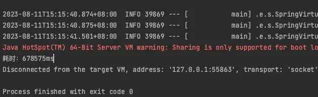

<font style="color:rgb(43, 43, 43);">虚拟线程耗时 你知道花了多久  ？  就3.9秒!!</font>

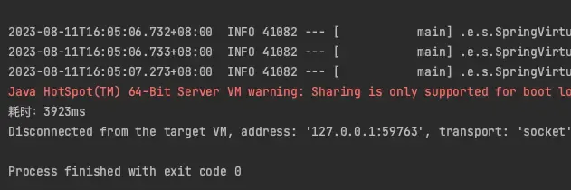

<font style="color:rgb(43, 43, 43);">接近200倍的性能差距啊！！</font>

<font style="color:rgb(43, 43, 43);">所以虚拟线程在性能方面有明显的优势，但是要注意的是，我测试都是让等待了50ms，这是模拟什么场景？</font>

<font style="color:rgb(43, 43, 43);">没错，就是是IO密集型场景，即线程大部分时间是在等待IO，这样虚拟线程才可以发挥出它的优势，如果是CPU密集型场景，那么可能效果并不大。不过我们目前大部分的应用都是IO密集型应用较多，比如典型的WEB应用，大量的时间在等待网络IO（DB、缓存、HTTP等等），使用虚拟线程的效果还是非常明显的。</font>


# <font style="color:#01B2BC;">JAVA 中有几种方法可以创建线程</font>
<font style="color:rgb(55, 65, 81);">在Java中，有多种方法可以创建一个线程，以下是常用的几种方式：</font>

1. **继承Thread类：**<font style="color:rgb(55, 65, 81);"> 创建一个继承自Thread类的子类，然后重写子类的</font>**run**<font style="color:rgb(55, 65, 81);">方法，将线程的任务逻辑放在</font>**run**<font style="color:rgb(55, 65, 81);">方法中。然后通过创建子类的对象并调用</font>**start**<font style="color:rgb(55, 65, 81);">方法来启动线程。示例代码如下：</font>

```plain
javaCopy code
class MyThread extends Thread {
    public void run() {
        // 线程任务逻辑
    }
}

// 创建并启动线程
MyThread myThread = new MyThread();
myThread.start();
```

2. **实现Runnable接口：**<font style="color:rgb(55, 65, 81);"> 创建一个类实现</font>**Runnable**<font style="color:rgb(55, 65, 81);">接口，并重写</font>**run**<font style="color:rgb(55, 65, 81);">方法，然后通过将实现了</font>**Runnable**<font style="color:rgb(55, 65, 81);">接口的对象传递给</font>**Thread**<font style="color:rgb(55, 65, 81);">类的构造函数来创建线程对象。示例代码如下：</font>

```plain
javaCopy code
class MyRunnable implements Runnable {
    public void run() {
        // 线程任务逻辑
    }
}

// 创建并启动线程
Thread thread = new Thread(new MyRunnable());
thread.start();
```

3. **使用匿名内部类：**<font style="color:rgb(55, 65, 81);"> 可以使用匿名内部类来创建线程对象，这种方式通常用于简单的线程任务。示例代码如下：</font>

```plain
javaCopy code
Thread thread = new Thread(new Runnable() {
    public void run() {
        // 线程任务逻辑
    }
});
thread.start();
```

4. **使用Lambda表达式：**<font style="color:rgb(55, 65, 81);"> 在Java 8及以后的版本中，可以使用Lambda表达式来创建线程对象，更加简洁。示例代码如下：</font>

```plain
javaCopy code
Thread thread = new Thread(() -> {
    // 线程任务逻辑
});
thread.start();
```

5. **使用线程池（Executor框架）：**<font style="color:rgb(55, 65, 81);"> 可以使用</font>**Executor**<font style="color:rgb(55, 65, 81);">框架中的线程池来管理和执行线程。通过</font>**ExecutorService**<font style="color:rgb(55, 65, 81);">接口的实现类，例如</font>**ThreadPoolExecutor**<font style="color:rgb(55, 65, 81);">，可以提交任务并由线程池管理线程的生命周期。</font>

```plain
javaCopy code
ExecutorService executorService = Executors.newFixedThreadPool(5);
executorService.submit(() -> {
    // 线程任务逻辑
});
```

<font style="color:rgb(55, 65, 81);">这些方法都可以用来创建和启动线程，选择哪种方式取决于具体的需求和编程风格。通常情况下，推荐使用实现</font>**Runnable**<font style="color:rgb(55, 65, 81);">接口或使用Lambda表达式的方式来创建线程，因为它们更加灵活，可以避免Java单继承的限制，并且符合面向对象的设计原则。</font>

# <font style="color:#01B2BC;">如何停止一个正在运行的线程</font>
<font style="color:rgb(55, 65, 81);">要停止一个正在运行的线程，通常有几种方法，但需要根据具体情况选择适当的方式，因为线程的停止涉及到线程安全和资源释放等问题。以下是一些常用的停止线程的方法：</font>

1. **使用标志位：**<font style="color:rgb(55, 65, 81);"> 在线程的执行体中使用一个标志位，当该标志位为true时，线程会自行退出执行。这是一种比较安全和可控的方式。例如：</font>

```java
public class MyThread extends Thread {
    private volatile boolean stopRequested = false;

    public void run() {
        while (!stopRequested) {
            // 执行线程任务
        }
    }

    public void stopThread() {
        stopRequested = true;
    }
}
```

<font style="color:rgb(55, 65, 81);">在上面的示例中，</font>**stopThread**<font style="color:rgb(55, 65, 81);">方法用于设置</font>**stopRequested**<font style="color:rgb(55, 65, 81);">标志位，从而停止线程的执行。</font>

2. **使用****interrupt****方法：**<font style="color:rgb(55, 65, 81);"> 使用线程的</font>**interrupt**<font style="color:rgb(55, 65, 81);">方法可以中断线程的执行。在线程的执行体中，可以使用</font>**Thread.currentThread().isInterrupted()**<font style="color:rgb(55, 65, 81);">检查线程是否被中断，然后做出相应的处理。例如：</font>

```java
public class MyThread extends Thread {
    public void run() {
        while (!Thread.currentThread().isInterrupted()) {
            // 执行线程任务
        }
    }
}

// 停止线程的方法
myThread.interrupt();
```

<font style="color:rgb(55, 65, 81);">在这种方法中，线程需要主动检查是否被中断，并根据需要停止执行。</font>

3. **使用****Thread.stop****方法（不推荐使用）：****Thread.stop**<font style="color:rgb(55, 65, 81);">方法可以强制停止一个线程，但不建议使用它，因为它可能导致线程的状态不一致和资源泄漏等问题，容易引发不可预测的错误。</font>
4. **使用****ExecutorService****：**<font style="color:rgb(55, 65, 81);"> 如果线程是通过</font>**ExecutorService**<font style="color:rgb(55, 65, 81);">创建的，可以使用</font>**shutdown**<font style="color:rgb(55, 65, 81);">或</font>**shutdownNow**<font style="color:rgb(55, 65, 81);">方法来停止线程池中的线程。</font>
5. **使用****Future****：**<font style="color:rgb(55, 65, 81);"> 如果线程是通过</font>**Future**<font style="color:rgb(55, 65, 81);">对象启动的，可以使用</font>**cancel**<font style="color:rgb(55, 65, 81);">方法来取消线程的执行。</font>

<font style="color:rgb(55, 65, 81);">总的来说，为了安全地停止线程，建议使用标志位或</font>**interrupt**<font style="color:rgb(55, 65, 81);">方法，并在线程的执行体中检查相应的标志或中断状态。避免使用</font>**Thread.stop**<font style="color:rgb(55, 65, 81);">方法，以及要谨慎处理线程的资源释放问题。</font>

# <font style="color:#01B2BC;">有三个线程T1,T2,T3,如何保证顺序执行</font>
确保三个线程 T1、T2、T3 按照指定顺序执行有多种方式。以下是其中一些常见的方式：

+ **使用 join() 方法**： 可以在每个线程内部使用 join() 方法来等待前一个线程执行完成。具体操作是在线程 T2 的 run() 方法中调用 T1.join()，在线程 T3 的 run() 方法中调用 T2.join()。这样可以确保 T1 在 T2 之前执行，T2 在 T3 之前执行。

```java

Thread T1 = new Thread(() -> {
    // 线程 T1 的任务
});

Thread T2 = new Thread(() -> {
    try {
        T1.join(); // 等待 T1 执行完成
    } catch (InterruptedException e) {
        e.printStackTrace();
    }
    // 线程 T2 的任务
});

Thread T3 = new Thread(() -> {
    try {
        T2.join(); // 等待 T2 执行完成
    } catch (InterruptedException e) {
        e.printStackTrace();
    }
    // 线程 T3 的任务
});

T1.start();
T2.start();
T3.start();
```

+ **使用 CountDownLatch**： 可以使用 CountDownLatch 来控制线程的执行顺序。创建一个 CountDownLatch 对象，设置初始计数为 2，分别在 T1 和 T2 的线程内等待计数器减少到 0，然后释放 T3 线程。

```java
CountDownLatch latch1 = new CountDownLatch(1);
CountDownLatch latch2 = new CountDownLatch(1);

Thread t1 = new Thread(() -> {
    System.out.println("T1 running.");
    latch1.countDown(); // T1 执行完后释放 latch1
});

Thread t2 = new Thread(() -> {
    try {
        latch1.await(); // 等待 latch1 的释放
      	System.out.println("T2 running.");
        latch2.countDown(); // T2 执行完后释放 latch2
    } catch (InterruptedException e) {
        e.printStackTrace();
    }
});

Thread t3 = new Thread(() -> {
    try {
        latch2.await(); // 等待 latch2 的释放
      	System.out.println("T3 running.");
    } catch (InterruptedException e) {
        e.printStackTrace();
    }
});

t1.start();
t2.start();
t3.start();
```

+ **使用 LockSupport**：<font style="color:rgb(55, 65, 81);"> 可以使用LockSupport的park和unpark来控制线程的执行顺序。</font>

```java
public class Test {
    private static Thread t1;
    private static Thread t2;
    private static Thread t3;
    public static void main(String[] args) {

        t1 = new Thread(() -> {
            System.out.println("T1 is running.");
            LockSupport.unpark(t2); // 唤醒线程T2
        });

        t2 = new Thread(() -> {
            LockSupport.park(); // 阻塞线程T2
            System.out.println("T2 is running.");
            LockSupport.unpark(t3); // 唤醒线程T3
        });

        t3 = new Thread(() -> {
            LockSupport.park(); // 阻塞线程T3
            System.out.println("T3 is running.");
        });


        t1.start();
        t2.start();
        t3.start();
    }
}
```

这些方法都可以用来确保线程按照指定顺序执行。选择其中一种方式取决于你的具体需求和场景。

# <font style="color:#01B2BC;">ThreadLocaL如何防止内存泄漏</font>
<font style="color:rgb(55, 65, 81);">ThreadLocal 变量的内存泄漏问题主要是由于 ThreadLocalMap 中的 Entry 没有被及时清理导致的。ThreadLocalMap 是 ThreadLocal 的底层数据结构，它用于存储每个线程独立的变量副本。</font>

<font style="color:rgb(55, 65, 81);">要防止 ThreadLocal 内存泄漏，可以考虑以下方法：</font>

## <font style="color:rgb(55, 65, 81);">使用完 ThreadLocal 后及时调用 </font>remove() <font style="color:rgb(55, 65, 81);">方法</font>
1. <font style="color:rgb(55, 65, 81);">在不再需要使用 ThreadLocal 存储的数据时，手动调用 </font>ThreadLocal.remove() <font style="color:rgb(55, 65, 81);">方法将该数据从当前线程的 ThreadLocalMap 中清除。这样可以确保 ThreadLocalMap 不会持有对对象的引用，从而帮助垃圾回收器正常回收不再需要的对象。</font>

```plain
javaCopy code
ThreadLocal<Object> threadLocal = new ThreadLocal<>();
// 存储数据
threadLocal.set(someData);
// 使用完毕后清除
threadLocal.remove();
```

## <font style="color:rgb(55, 65, 81);">使用 try-with-resources 或 try-finally 块</font>
2. <font style="color:rgb(55, 65, 81);">如果你的 ThreadLocal 变量在需要清理的资源管理上下文中使用，可以使用 try-with-resources（自动清理）或 try-finally（手动清理）块来确保及时清理。</font>

```plain
javaCopy code
try (ThreadLocalResource resource = new ThreadLocalResource()) {
    // 使用 ThreadLocalResource
}
// 或者使用 try-finally
ThreadLocalResource resource = new ThreadLocalResource();
try {
    // 使用 ThreadLocalResource
} finally {
    resource.close(); // 在 close 方法中清理 ThreadLocal 变量
}
```

## <font style="color:rgb(55, 65, 81);">使用 InheritableThreadLocal</font>
3. <font style="color:rgb(55, 65, 81);">如果需要在子线程中访问父线程的 ThreadLocal 变量，并且确保在子线程中正确清理，可以考虑使用 InheritableThreadLocal。这个类允许子线程继承父线程的 ThreadLocal 变量，并在子线程完成后自动清理。</font>

```plain
javaCopy code
ThreadLocal<String> threadLocal = new InheritableThreadLocal<>();
threadLocal.set("Hello, Parent Thread");
Runnable childTask = () -> {
    String value = threadLocal.get(); // 子线程可以访问父线程的 ThreadLocal 变量
    // ...
};
Thread childThread = new Thread(childTask);
childThread.start();
```

<font style="color:rgb(55, 65, 81);">通过采取这些预防措施，可以有效避免 ThreadLocal 变量的内存泄漏问题，确保不再需要的对象能够被及时回收。</font>

# <font style="color:#01B2BC;">CompletableFuture解析</font>
```java
public class CompletableFuture<T> implements Future<T>, CompletionStage<T> {
	// ...
}
```

CompletableFuture实现了Future和CompletionStage接口，所以CompletableFuture首先是一个Future，除开拥有Future的功能外，还拥有CompletionStage接口所提供的功能，而CompletionStage表示异步执行整个过程中的某个步骤，表示我们可以利用CompletableFuture来对异步执行的多个任务进行编排（这是Future所不支持的）。

## 创建CompletableFuture
### supplyAsync
```java
public static <U> CompletableFuture<U> supplyAsync(Supplier<U> supplier) {
    return asyncSupplyStage(asyncPool, supplier);
}
```

```java
@FunctionalInterface
public interface Supplier<T> {
    T get();
}
```

### runAsync
```java
public static CompletableFuture<Void> runAsync(Runnable runnable) {
	return asyncRunStage(asyncPool, runnable);
}
```

```java
@FunctionalInterface
public interface Runnable {
    public abstract void run();
}
```

这两个区别本质上就是Supplier和Runnable的区别：

1. Supplier：有返回值
2. Runnable：没有返回值

从而：

1. supplyAsync()创建的CompletableFuture支持获取异步执行结果
2. runAsync()创建的CompletableFuture不支持获取异步执行结果

## 编排
### A然后B
```java
package com.zhouyu;

import java.util.concurrent.*;
import java.util.function.Function;
import java.util.function.Supplier;

public class Main {

    public static void main(String[] args) throws ExecutionException, InterruptedException {

        ExecutorService executorService = Executors.newFixedThreadPool(10);

        Supplier<String> taskA = () -> {
            System.out.println("1:" + Thread.currentThread().getName());
            return "Hello";
        };

        Function<String, String> taskB = s -> {
            System.out.println("2:" + Thread.currentThread().getName());
            return s + " World";
        };


        CompletableFuture.supplyAsync(taskA, executorService)
                .thenApply(taskB);

    }

    private static void sleep(int i) {
        try {
            TimeUnit.SECONDS.sleep(i);
        } catch (InterruptedException e) {
            e.printStackTrace();
        }
    }
}

```

以上代码就是在定义A任务执行完成后才执行B任务，A任务会交给指定的线程池执行，B任务到底会让哪个线程执行得看情况，如果A任务还没执行完，那么B任务也会由线程池中的线程来执行，main线程执行后续代码，如果A任务已经执行完了，那么B任务则会由main线程直接执行。

# <font style="color:#01B2BC;">线程池中提交一个任务的流程是怎样的？</font>
😍 薪资范围：10k-20k

😏 对应岗位：初中级开发工程师

🤠 面试频率：❤️❤️❤️❤️❤️

👤 讲解作者：大都督周瑜


**💨****文字版**：


1. 在使用execute()方法提交一个Runnable对象时
2. 会先判断当前线程池中的线程数是否小于corePoolSize
3. 如果小于，则创建新线程并执行Runnable
4. 如果大于等于，则尝试将Runnable加入到workQueue中
5. 如果workQueue没满，则将Runnable正常入队，等待执行
6. 如果workQueue满了，则会入队失败，那么会尝试继续增加线程
7. 如果当前线程池中的线程数是否小于maximumPoolSize
8. 如果小于，则创建新线程并执行任务
9. 如果大于等于，则执行拒绝策略，拒绝此Runnable


💨**流程图版**：


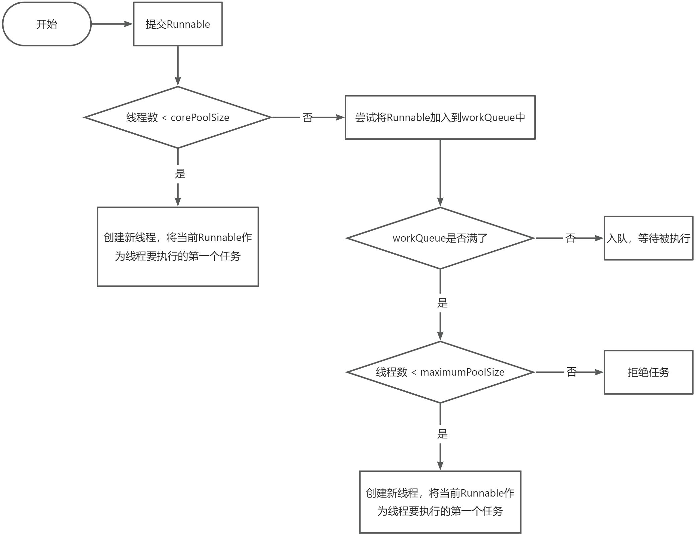


💨**注意点**：


注意1：提交一个Runnable时，不管当前线程池中的线程是否空闲，只要数量小于核心线程数就会创建新线程。

注意2：ThreadPoolExecutor相当于是非公平的，比如队列满了之后提交的Runnable可能会比正在排队的Runnable先执行。

**<font style="color:#DF2A3F;"></font>**

---

# <font style="color:#01B2BC;">线程池有几种状态？分别是如何变化的？</font>
😍 薪资范围：10k-20k

😏 对应岗位：初中级开发工程师

🤠 面试频率：❤️❤️❤️❤️❤️

👤 讲解作者：大都督周瑜


**线程池有五种状态，分别为：**

****

| RUNNING | **会**接收新任务并且**会**处理队列中的任务 |
| --- | --- |
| SHUTDOWN | **不会**接收新任务并且**会**处理队列中的任务，任务处理完后会中断所有线程 |
| STOP | **不会**接收新任务并且**不会**处理队列中的任务，并且会直接中断所有线程 |
| TIDYING | 所有线程都停止了之后，线程池的状态就会转为TIDYING，一旦达到此状态，就会调用线程池的terminated() |
| TERMINATED | **terminated()执行完**之后就会转变为TERMINATED |


**这五种状态并不能任意转换，只会有以下几种转换情况：**

****

| **<font style="color:#1DC0C9;">转变前</font>** | **<font style="color:#1DC0C9;">转变后</font>** | **<font style="color:#1DC0C9;">转变条件</font>** |
| --- | --- | --- |
| RUNNING | SHUTDOWN | 手动调用shutdown()触发，或者线程池对象GC时会调用finalize()从而调用shutdown() |
| RUNNING | STOP | 手动调用shutdownNow()触发 |
| SHUTDOWN | STOP | 手动先调用shutdown()紧着调用shutdownNow()触发 |
| SHUTDOWN | TIDYING | 线程池所有线程都停止后自动触发 |
| STOP | TIDYING | 线程池所有线程都停止后自动触发 |
| TIDYING | TERMINATED | 线程池自动调用terminated()后触发 |


---

# <font style="color:#01B2BC;">如何优雅的停止一个线程？</font>
😍 薪资范围：15k-25k

😏 对应岗位：中高级开发工程师

🤠 面试频率：❤️❤️❤️❤️

👤 讲解作者：大都督周瑜


Thread类中有两个方法：

+ start()：开启一个线程
+ stop()：停止一个线程 


但是stop()方法是不建议使用，并且是有可能在未来版本中删除掉的：

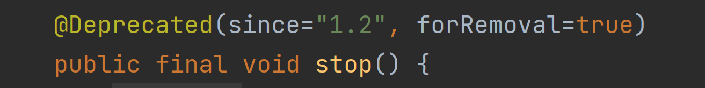


因为stop()方法太粗暴了，一旦调用了stop()，就会**直接停掉线程**，这样就可能造成严重的问题，比如任务执行到哪一步了？该释放的锁释放了没有？都存在疑问。


> 这里强调一点，stop()会释放线程占用的synchronized锁，而不会自动释放ReentrantLock锁
>


我们建议通过中断来停止线程:

```java
/**
 * 作者：周瑜大都督
 */
public class ThreadTest {

    public static void main(String[] args) throws InterruptedException {

        Thread thread = new Thread(() -> {

            for (int i = 0; i < 1000000; i++) {
                if (Thread.currentThread().isInterrupted() && i > 500000) {
                    break;
                }

                System.out.println(i);

            }

        });
        thread.start();

        Thread.sleep(1000);

        thread.interrupt();

    }


}
```

以上代码，我们可以控制：变量i只有在大于500000时才会停止，不然就算中断了也不会停止。


另外，线程池中也是通过interrupt()来停止线程的，比如shutdownNow()方法中会调用：

```java
void interruptIfStarted() {
    Thread t;
    if (getState() >= 0 && (t = thread) != null && !t.isInterrupted()) {
        try {
            t.interrupt();
        } catch (SecurityException ignore) {
        }
    }
}
```


---

# <font style="color:#01B2BC;">Tomcat是如何自定义线程池的？</font>


😍 薪资范围：20k-30k

😏 对应岗位：高级开发工程师

🤠 面试频率：❤️❤️❤️❤️

👤 讲解作者：大都督周瑜


Tomcat中自己定义了一个**org.apache.tomcat.util.threads.ThreadPoolExecutor**，类名也叫ThreadPoolExecutor，但是包名是Tomcat自己的。


Tomcat会创建这个线程池：

```java
public void createExecutor() {
    // ...
    TaskQueue taskqueue = new TaskQueue();
    TaskThreadFactory tf = new TaskThreadFactory(getName() + "-exec-", daemon, getThreadPriority());
    executor = new ThreadPoolExecutor(getMinSpareThreads(), getMaxThreads(), 60, TimeUnit.SECONDS,taskqueue, tf);
    taskqueue.setParent( (ThreadPoolExecutor) executor);
}
```


注入传入的队列为TaskQueue，它的入队逻辑为：

```java
public boolean offer(Runnable o) {
    //we can't do any checks
    if (parent==null) {
    	return super.offer(o);
	}

	//we are maxed out on threads, simply queue the object
	//线程数等于最大线程数时可以入队
	if (parent.getPoolSize() == parent.getMaximumPoolSize()) {
    	return super.offer(o);
	}

	//we have idle threads, just add it to the queue
    //在执行的任务数小于线程数，表示有空闲线程，此时也可以入队
	if (parent.getSubmittedCount()<=(parent.getPoolSize())) {
    	return super.offer(o);
	}

	//if we have less threads than maximum force creation of a new thread
	//线程数小于最大线程数不能入队
	if (parent.getPoolSize()<parent.getMaximumPoolSize()) {
    	return false;
	}

	//if we reached here, we need to add it to the queue
	return super.offer(o);
}
```


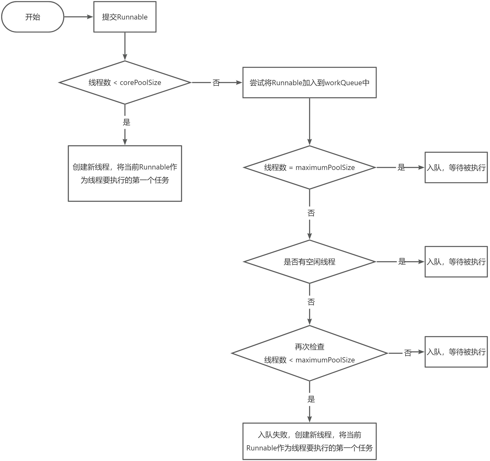


额外补充：Tomcat中的线程池走构造时就会启动所有的核心线程。


Tomcat中的线程池的思想是：优先启动线程，线程达到上限了才将任务入队。

---

# <font style="color:#01B2BC;">线程池的核心线程数、最大线程数该如何设置？</font>


😍 薪资范围：20k-30k

😏 对应岗位：高级开发工程师

🤠 面试频率：❤️❤️❤️❤️❤️❤️❤️❤️❤️

👤 讲解作者：大都督周瑜


我们都知道，线程池中有两个非常重要的参数：

1. corePoolSize：核心线程数，表示线程池中的常驻线程的个数
2. maximumPoolSize：最大线程数，表示线程池中能开辟的最大线程个数


那这两个参数该如何设置呢？


我们对线程池负责执行的任务分为三种情况：

1. CPU密集型任务，比如找出1-1000000中的素数
2. IO密集型任务，比如文件IO、网络IO
3. 混合型任务


CPU密集型任务的特点时，线程在执行任务时会一直利用CPU，所以对于这种情况，就尽可能避免发生线程上下文切换。


比如，现在我的电脑只有一个CPU，如果有两个线程在同时执行找素数的任务，那么这个CPU就需要额外的进行线程上下文切换，从而达到线程并行的效果，此时执行这两个任务的总时间为：


> 任务执行时间*2+线程上下文切换的时间
>


而如果只有一个线程，这个线程来执行两个任务，那么时间为：


> 任务执行时间*2
>


所以对于CPU密集型任务，线程数最好就等于CPU核心数，可以通过以下API拿到你电脑的核心数：

```java
Runtime.getRuntime().availableProcessors()
```


只不过，为了应对线程执行过程发生缺页中断或其他异常导致线程阻塞的请求，我们可以额外在多设置一个线程，这样当某个线程暂时不需要CPU时，可以有替补线程来继续利用CPU。


所以，对于CPU密集型任务，我们可以设置线程数为：**<font style="color:#DF2A3F;">CPU核心数+1</font>**

**<font style="color:#DF2A3F;"></font>**

我们在来看IO型任务，线程在执行IO型任务时，可能大部分时间都阻塞在IO上，假如现在有10个CPU，如果我们只设置了10个线程来执行IO型任务，那么很有可能这10个线程都阻塞在了IO上，这样这10个CPU就都没活干了，所以，对于IO型任务，我们通常会设置线程数为：**<font style="color:#DF2A3F;">2*CPU核心数</font>**

**<font style="color:#DF2A3F;"></font>**

不过，就算是设置为了**2*CPU核心数**，也不一定是最佳的，比如，有10个CPU，线程数为20，那么也有可能这20个线程同时阻塞在了IO上，所以可以再增加线程，从而去压榨CPU的利用率。


**通常，如果IO型任务执行的时间越长，那么同时阻塞在IO上的线程就可能越多，我们就可以设置更多的线程，但是，线程肯定不是越多越好**，我们可以通过以下这个公式来进行计算：  


> 线程数 = CPU核心数   *（ 1 + 线程等待时间 / 线程运行总时间 ）
>


+ 线程等待时间：指的就是线程没有使用CPU的时间，比如阻塞在了IO
+ 线程运行总时间：指的是线程执行完某个任务的总时间


我们可以利用jvisualvm抽样来估计这两个时间：

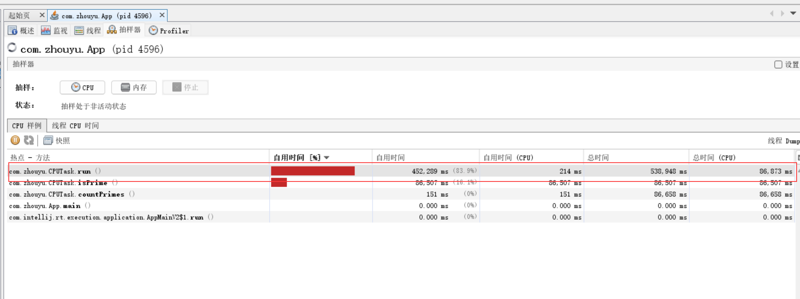


图中表示，在刚刚这次抽样过程中，run()总共的执行时间为538948ms，利用了CPU的时间为86873ms，所以没有利用CPU的时间为538948ms-86873ms。


所以我们可以计算出：

线程等待时间 = 538948ms-86873ms

线程运行总时间 = 538948ms


所以：线程数 = 8   *（ 1 + （538948ms-86873ms） / 538948ms ）= 14.xxx


所以根据公式算出来的线程为14、15个线程左右。


按上述公式，如果我们执行的任务IO密集型任务，那么：线程等待时间 = 线程运行总时间，所以：

线程数 = CPU核心数   *（ 1 + 线程等待时间 / 线程运行总时间 ）

           = CPU核心数   *（ 1 + 1 ）

    = CPU核心数   *  2


以上只是理论，实际工作中情况会更复杂，比如一个应用中，可能有多个线程池，除开线程池中的线程可能还有很多其他线程，或者除开这个应用还是一些其他应用也在运行，所以实际工作中如果要确定线程数，最好是压测。


比如我写了一个：

```java
@RestController
public class ZhouyuController {

    @GetMapping("/test")
    public String test() throws InterruptedException {
        Thread.sleep(1000);
        return "zhouyu";
    }

}
```


这个接口会执行1s，我现在利用apipost来压：

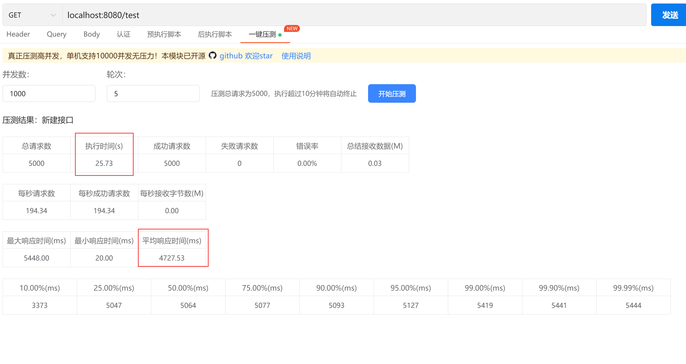


这是在Tomcat默认最大200个线程的请求下的压测结果。


当我们把线程数调整为500：

```java
server.tomcat.threads.max=500
```


发现执行效率提高了一倍，假如再增加线程数到1000：


性能就降低了。


总结，我们再工作中，对于：

1. CPU密集型任务：CPU核心数+1，这样既能充分利用CPU，也不至于有太多的上下文切换成本
2. IO型任务：建议压测，或者先用公式计算出一个理论值（理论值通常都比较小）
3. 对于核心业务（访问频率高），可以把核心线程数设置为我们压测出来的结果，最大线程数可以等于核心线程数，或者大一点点，比如我们压测时可能会发现500个线程最佳，但是600个线程时也还行，此时600就可以为最大线程数
4. 对于非核心业务（访问频率不高），核心线程数可以比较小，避免操作系统去维护不必要的线程，最大线程数可以设置为我们计算或压测出来的结果。


# <font style="color:#01B2BC;">如何理解Java并发中的可见性？</font>
😍 薪资范围：10k-20k

😏 对应岗位：中高级开发工程师

🤠 面试频率：❤️❤️❤️❤️❤️

👤 讲解作者：大都督周瑜


Java并发可见性指的是多线程并发访问共享变量时，对变量的更改能够被其他线程及时感知，即在一个线程修改变量后，其他线程能够立即看到这个变量的修改结果。


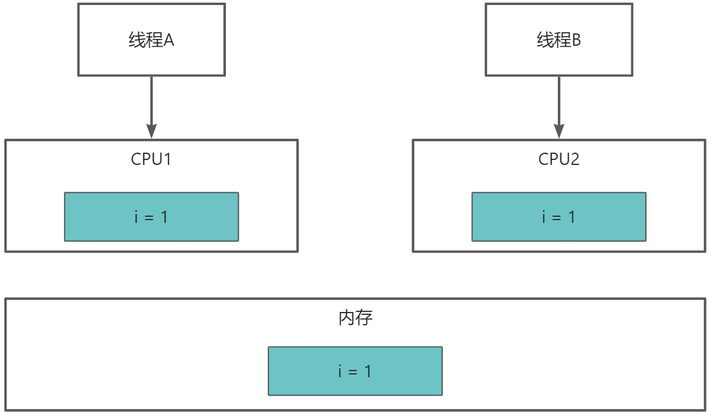


当线程A读取变量i的值时，会从内存中读取数据，并缓存一份在CPU1内部的高速缓存中，然后线程1修改i，改为i=2，但是还没有回写到内存，此时线程B也来读取i，那么也会从内存读取，读到的i仍然为1，此时就出现了可见性问题。


在Java中，可以volatile关键字来保证变量的可见性，对于加了volatile的变量，线程在读取该变量时会直接从内存中读取，再修改该变量时会同时修改CPU高速缓存和内存中的值。

# <font style="color:#01B2BC;">如何理解Java并发中的原子性？</font>
😍 薪资范围：10k-20k

😏 对应岗位：中高级开发工程师

🤠 面试频率：❤️❤️❤️❤️❤️

👤 讲解作者：大都督周瑜


Java并发原子性指的是在多线程并发的情况下，一段代码或操作要么完全执行成功，要么完全不执行，不出现执行一半被其他线程打断或干扰的情况。换句话说，就是对同一个变量的多个操作能够像原子操作一样，保证多线程环境下的数据一致性，避免出现数据竞争和脏数据等问题。


由于CPU、内存、IO（磁盘、网络）之间的性能差距，为了能充分利用CPU，当线程执行IO操作时，线程会让出CPU，使得CPU去执行其他线程的指令，并且本身来说，为了达到线程并发执行的效果，CPU也会按固定时间片来切换执行不同线程。


当我们执行i++这行代码时，底层其实对应的是三条指令：

1. 从内存中读取i的值
2. 对i+1
3. 写回i的值到CPU高速缓存


但是有可能执行线程A执行了第1条指令后，就发生了线程切换，线程A相当于暂停执行，此时如果有另外一个线程B也在执行i++，并且把3条执行都执行完了，那么线程B得到的结果是i=2，然后线程A又切换回来继续执行，最终导致线程A得到的i也为2，正常来说i应该等于3的，这就是原子性问题。


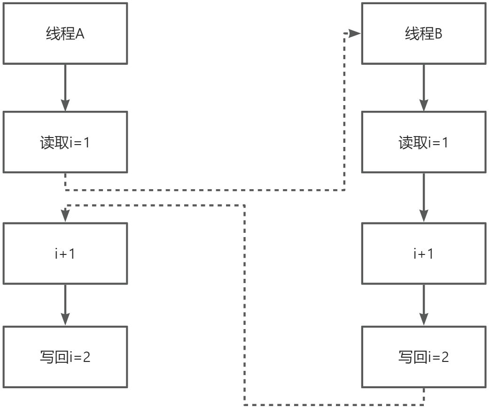


Java中我们需要通过各种锁机制来保证原子性。


# <font style="color:#01B2BC;">如何理解Java并发中的有序性？</font>
😍 薪资范围：10k-20k

😏 对应岗位：中高级开发工程师

🤠 面试频率：❤️❤️❤️❤️❤️

👤 讲解作者：大都督周瑜


Java并发有序性指的是多个线程执行的指令和操作，按照开发者编写程序的顺序或者预定的顺序进行执行。多线程并发执行时，可能会发生指令的重排，导致程序的执行顺序与预期不一致，从而出现数据竞争和线程安全问题。


编译器有时为了进行编译优化，会进行指令重排序，比如：

```java
new Person();
```


这行代码会分为三步：

1. 申请内存空间
2. 在内存空间初始化Person对象相关的内容
3. 返回内存空间地址


但是编译有可能会优化为：

1. 申请内存空间
2. 返回内存空间地址
3. 在内存空间初始化Person对象相关的内容


所以对于我们的单例模式实现：

```java

public class Person {
  static Person instance;
    
  static Person getInstance(){
    if (instance == null) {
      synchronized(Person.class) {
        if (instance == null)
          instance = new Person();
        }
    }
    return instance;
  }
}
```


就算了用DCL可能也会有问题，比如线程A拿到锁后，在new Person()时，第二步就返回了内存地址并赋值给了instance变量，此时线程B来执行getInstance()，直接就判断出了instance不为空，但是instance对于的对象其实是还没有初始化的，里面的成员变量可能为null。


我们可以通过锁机制或者volatile来保证有序性。


# <font style="color:#01B2BC;">如何理解Java并发中的条件等待队列？</font>
当一个线程加到锁之后，可能并不能立马执行业务逻辑，得在满足某个条件后才能执行，比如对于阻塞队列而言，当我们要条件元素时，会先加锁，加到锁之后，会判断队列是否满了，如果队列满了则需要阻塞当前线程并等待队列有空位，这样当前线程会进入条件等待队列，同时有可能其他线程也会进入此条件等待队列，而一旦队列有元素出队了，那么会可以唤醒条件等待队列中的某一个线程了，使得该线程去执行它的入队操作。


所以条件等待队列就是针对某一条件，如果线程在没有满足此条件下需要阻塞就可以加入到该条件等待队列进行等待。


# <font style="color:#01B2BC;">如何理解守护线程以及它的作用？</font>


线程分为用户线程和守护线程，用户线程就是普通线程，守护线程就是JVM的后台线程，比如垃圾回收线程就是一个守护线程，守护线程会在其他普通线程都停止运行之后自动关闭。我们可以通过设置thread.setDaemon(true)来把一个线程设置为守护线程。


# <font style="color:#01B2BC;">如何理解ThreadLocal以及它的底层执行原理</font>
1. ThreadLocal是Java中所提供的线程本地存储机制，可以利用该机制将数据<font style="color:#F5222D;">缓存在某个线程内部</font>，该线程可以在任意时刻、任意方法中获取缓存的数据
2. ThreadLocal底层是通过<font style="color:#2C3E50;">ThreadLocalMap来实现的，每个Thread对象（注意不是ThreadLocal对象）中都存在一个</font><font style="color:#2C3E50;">ThreadLocalMap，</font><font style="color:#2C3E50;">Map的key为ThreadLocal对象，Map的value为需要缓存的值</font>
3. <font style="color:#2C3E50;">如果在线程池中使用ThreadLocal会造成内存泄漏，因为当ThreadLocal对象使用完之后，应该要把设置的key，value，也就是Entry对象进行回收，但线程池中的线程不会回收，而线程对象是通过强引用指向</font><font style="color:#2C3E50;">ThreadLocalMap，ThreadLocalMap也是通过强引用指向Entry对象，线程不被回收，Entry对象也就不会被回收，从而出现内存泄漏，解决办法是，在使用了ThreadLocal对象之后，手动调用ThreadLocal的remove方法，手动清楚Entry对象</font>
4. ThreadLocal经典的应用场景就是连接管理（一个线程持有一个连接，该连接对象可以在不同的方法之间进行传递，线程之间不共享同一个连接）

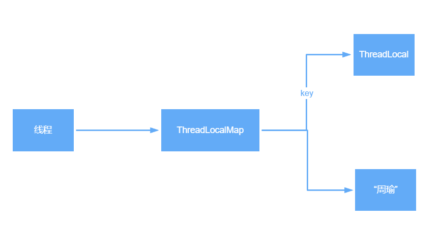


# <font style="color:#01B2BC;">Java中如何避免死锁?</font>
造成死锁的几个原因：

1. 一个资源每次只能被一个线程使用
2. 一个线程在阻塞等待某个资源时，不释放已占有资源
3. 一个线程已经获得的资源，在未使用完之前，不能被强行剥夺
4. 若干线程形成头尾相接的循环等待资源关系


这是造成死锁必须要达到的4个条件，如果要避免死锁，只需要不满足其中某一个条件即可。而其中前3个条件是作为锁要符合的条件，所以要避免死锁就需要打破第4个条件，不出现循环等待锁的关系。


在开发过程中：

1. 要注意加锁顺序，保证每个线程按同样的顺序进行加锁
2. 要注意加锁时限，可以针对所设置一个超时时间
3. 要注意死锁检查，这是一种预防机制，确保在第一时间发现死锁并进行解决


# <font style="color:#01B2BC;">ReentrantLock中的公平锁和非公平锁的底层实现</font>
首先不管是公平锁和非公平锁，它们的底层实现都会使用AQS来进行排队，它们的区别在于：线程在使用lock()方法加锁时，如果是公平锁，会先检查AQS队列中是否存在线程在排队，如果有线程在排队，则当前线程也进行排队，如果是非公平锁，则不会去检查是否有线程在排队，而是直接竞争锁。


不管是公平锁还是非公平锁，一旦没竞争到锁，都会进行排队，当锁释放时，都是唤醒排在最前面的线程，所以非公平锁只是体现在了线程加锁阶段，而没有体现在线程被唤醒阶段。


另外，ReentrantLock是可重入锁，不管是公平锁还是非公平锁都是可重入的。

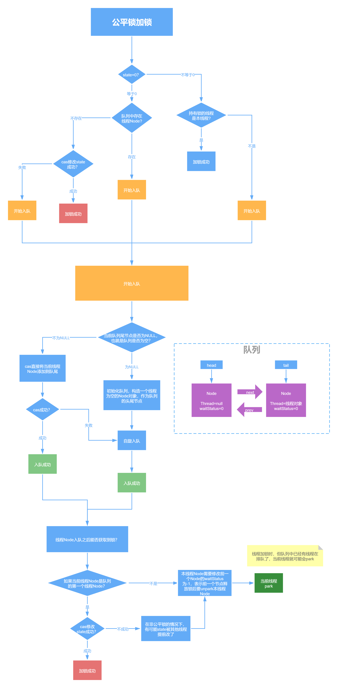                                                   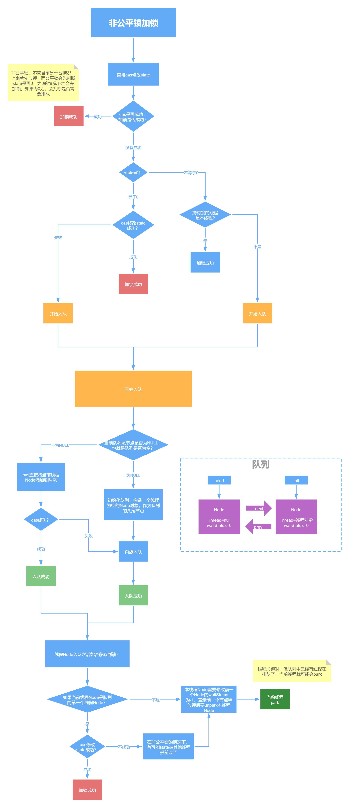

**<font style="color:#F5222D;"></font>**

# <font style="color:#01B2BC;">ReentrantLock中tryLock()和lock()方法的区别</font>
1. tryLock()表示尝试加锁，可能加到，也可能加不到，该方法不会阻塞线程，如果加到锁则返回true，没有加到则返回false
2. lock()表示阻塞加锁，线程会阻塞直到加到锁，方法也没有返回值

**<font style="color:#F5222D;"></font>**

<font style="color:#F5222D;"></font>

# <font style="color:#01B2BC;">CountDownLatch和Semaphore的区别和底层原理</font>
CountDownLatch表示计数器，可以给CountDownLatch设置一个数字，一个线程调用CountDownLatch的<font style="color:#4D4D4D;">await()将会阻塞，其他线程可以调用</font>CountDownLatch的countDown()方法来对CountDownLatch中的数字减一，当数字被减成0后，所有await的线程都将被唤醒。

对应的底层原理就是，调用<font style="color:#4D4D4D;">await()方法的线程会利用AQS排队，一旦数字被减为0，则会将AQS中排队的线程依次唤醒。</font>


<font style="color:#4D4D4D;">Semaphore表示信号量，可以设置许可的个数，表示同时允许最多多少个线程使用该信号量，通过</font><font style="color:#4D4D4D;">acquire()来获取许可，如果没有许可可用则线程阻塞，并通过AQS来排队，可以通过</font><font style="color:#4D4D4D;">release()方法来释放许可，当某个线程释放了某个许可后，会从AQS中正在排队的第一个线程开始依次唤醒，直到没有空闲许可。</font>

<font style="color:#F5222D;"></font>

# <font style="color:#01B2BC;">Sychronized的偏向锁、轻量级锁、重量级锁</font>
1. 偏向锁：在锁对象的对象头中记录一下当前获取到该锁的线程ID，该线程下次如果又来获取该锁就可以直接获取到了
2. 轻量级锁：由偏向锁升级而来，当一个线程获取到锁后，此时这把锁是偏向锁，此时如果有第二个线程来竞争锁，偏向锁就会升级为轻量级锁，之所以叫轻量级锁，是为了和重量级锁区分开来，轻量级锁底层是通过自旋来实现的，并不会阻塞线程
3. 如果自旋次数过多仍然没有获取到锁，则会升级为重量级锁，重量级锁会导致线程阻塞
4. 自旋锁：自旋锁就是线程在获取锁的过程中，不会去阻塞线程，也就无所谓唤醒线程，阻塞和唤醒这两个步骤都是需要操作系统去进行的，比较消耗时间，自旋锁是线程通过CAS获取预期的一个标记，如果没有获取到，则继续循环获取，如果获取到了则表示获取到了锁，这个过程线程一直在运行中，相对而言没有使用太多的操作系统资源，比较轻量。


# <font style="color:#01B2BC;">Sychronized和ReentrantLock的区别</font>
1. sychronized是一个关键字，ReentrantLock是一个类
2. sychronized会自动的加锁与释放锁，ReentrantLock需要程序员手动加锁与释放锁
3. sychronized的底层是JVM层面的锁，ReentrantLock是API层面的锁
4. sychronized是非公平锁，ReentrantLock可以选择公平锁或非公平锁
5. sychronized锁的是对象，锁信息保存在对象头中，ReentrantLock通过代码中int类型的state标识来标识锁的状态
6. sychronized底层有一个锁升级的过程


# 


> 更新: 2025-06-16 19:20:47  
> 原文: <https://www.yuque.com/tulingzhouyu/db22bv/xawecw91rvkqgiil>