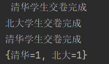

# synchronized可以锁字符串吗

<font style="color:rgb(51, 51, 51);">在日常项目开发中为了解决用户数据并发操作的问题，需要对代码块进行加锁保护。</font>

<font style="color:rgb(51, 51, 51);">例如：一个教务系统， 提供不同学校使用， 有一个考试场景， 需要记录不同学校的考试次数， 这里想尽可能把锁的对象放小，因此通常都是锁用户而不是锁整个类或者代码块；然而在用</font>`<font style="color:rgb(51, 51, 51);background-color:rgb(243, 244, 244);">synchronized(school)</font>`<font style="color:rgb(51, 51, 51);">  
</font><font style="color:rgb(51, 51, 51);">的时候可能会存在一些问题。</font>

## <font style="color:rgb(51, 51, 51);">synchronized 锁字符串的问题</font>
### <font style="color:rgb(51, 51, 51);">使用synchronized锁一个字符串</font><font style="color:rgb(51, 51, 51);">👇</font>
```java
@RequestMapping("/saving")
public String saving(String school) {
// 常量池  全局
synchronized (school) {
    System.out.println(school + "学生交卷");
    save(school);
    System.out.println(school + "学生交卷完成");
    return "ok";
}
}
```

### <font style="color:rgb(51, 51, 51);">测试：</font>
模拟http接口请求， Spring底层会通过new String()方式传入字符串参数， 而不是传入“”常量值

```java

static Map<String, Integer> values=new ConcurrentHashMap<>();
private  void extracted() throws InterruptedException {

Thread thread = new Thread(() -> saving(new String("北大")));
Thread thread1 = new Thread(() -> saving(new String("清华")));
Thread thread2 = new Thread(() -> saving(new String("清华")));
thread.start();
thread1.start();;
thread2.start();;
thread.join();
thread1.join();
thread2.join();
System.out.println(values);
}
```

<font style="color:rgb(51, 51, 51);"></font>

### <font style="color:rgb(51, 51, 51);">运行结果如下：</font>
<font style="color:rgb(51, 51, 51);">3个同时并行：</font>


发生线程安全问题：




<font style="color:rgb(51, 51, 51);">可以发现还是并发执行了，因为</font>`<font style="color:rgb(51, 51, 51);background-color:rgb(243, 244, 244);">synchronized (new String("字符串常量"))</font>`<font style="color:rgb(51, 51, 51);">  
</font>**<font style="color:rgb(51, 51, 51);">锁的对象不是同一个，仅仅是值相等</font>**<font style="color:rgb(51, 51, 51);">，此时的字符串是在堆栈中。将代码修改为如下</font>

<font style="color:rgb(51, 51, 51);"></font>

```java
 @RequestMapping("/saving")
    public String saving(String school) { 
        // 常量池  全局
        synchronized (school.intern()) {
            System.out.println(school + "学生交卷");
            save(school);
            System.out.println(school + "学生交卷完成");
            return "ok";
        }
    }
```

<font style="color:rgb(51, 51, 51);">得到运行结果为：</font>

<font style="color:rgb(51, 51, 51);">不同学校并行:</font>


同一个学校串行：


<font style="color:rgb(51, 51, 51);">通过上面结果可以看出此时通过</font>**<font style="color:rgb(51, 51, 51);">school.intern()把字符串对象放入常量池中，则"清华”地址是同一个</font>**<font style="color:rgb(51, 51, 51);">。</font>

<font style="color:rgb(51, 51, 51);"></font>

## <font style="color:rgb(51, 51, 51);">synchronized 锁字符串用String的intern()存在的问题</font>
<font style="color:rgb(51, 51, 51);">通过上面的demo可以得出，使用synchronized 锁字符串，需要将字符串添加到字符串常量池中。日常使用中通过通过new对象的方式创建对象，再取对象的字段，因此需要使用intern把字符串放入常量池中，但是</font>**<font style="color:rgb(51, 51, 51);">直接使用String的intern全部把字符串放入常量池会存在一些问题</font>**<font style="color:rgb(51, 51, 51);">。显然在数据量很大的情况下，将所有字符串都放入常量池是不合理的，常量池大小依赖服务器内存，且只有等待fullGC，极端情况下会导致</font>**<font style="color:rgb(51, 51, 51);">频繁fullGC</font>**<font style="color:rgb(51, 51, 51);">。并且在数据量很大的情况下，将字符串放入常量会</font>**<font style="color:rgb(51, 51, 51);">存在性能问题</font>**<font style="color:rgb(51, 51, 51);">。</font>

<font style="color:rgb(51, 51, 51);">可以用google的guava包的interner类：</font>

```java
public class test{
    private static Interner<String> lock = Interners.newWeakInterner();
    public void test() {
        synchronized (lock.intern(id.toString())){
            //do...
        }
    }
}
```

<font style="color:rgb(51, 51, 51);">Interner是通过MapMaker构造ConcurrentMap来实现弱引用，ConcurrentMap用分段的方式保证安全。这里个人觉得比常量池的</font>**<font style="color:rgb(51, 51, 51);">优点</font>**<font style="color:rgb(51, 51, 51);">就在于这里是</font>**<font style="color:rgb(51, 51, 51);">弱引用的方式，便于map的回收，常量池只能依赖于fullGC，这里的回收在不使用或内存不够用条件下即可被回收</font>**<font style="color:rgb(51, 51, 51);">（Minor GC阶段）。</font>

## <font style="color:rgb(51, 51, 51);">总结</font>
+ <font style="color:rgb(51, 51, 51);">synchronized可以锁存活于字符串常量池中的值，不能锁存活于堆栈中的字符串（字符串地址要相同）</font>
+ <font style="color:rgb(51, 51, 51);">可以使用</font>`<font style="color:rgb(51, 51, 51);background-color:rgb(243, 244, 244);">String对象.intern()</font>`<font style="color:rgb(51, 51, 51);">  
</font><font style="color:rgb(51, 51, 51);">将该字符串放入字符串常量池中，但是常量池的回收只能依赖于fullGC，故不推荐使用</font>
+ <font style="color:rgb(51, 51, 51);">推荐使用guava包下的interner类，使用弱引用的方式，在内存不足的时候自动进行垃圾回收</font>


> 更新: 2024-09-15 17:23:56  
> 原文: <https://www.yuque.com/tulingzhouyu/db22bv/qx9qao0sah6mveha>