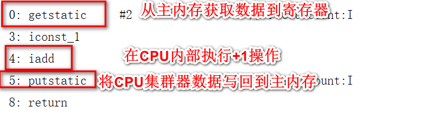
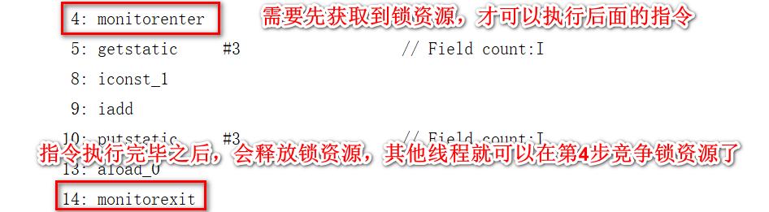
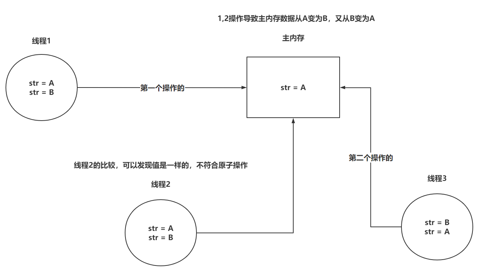
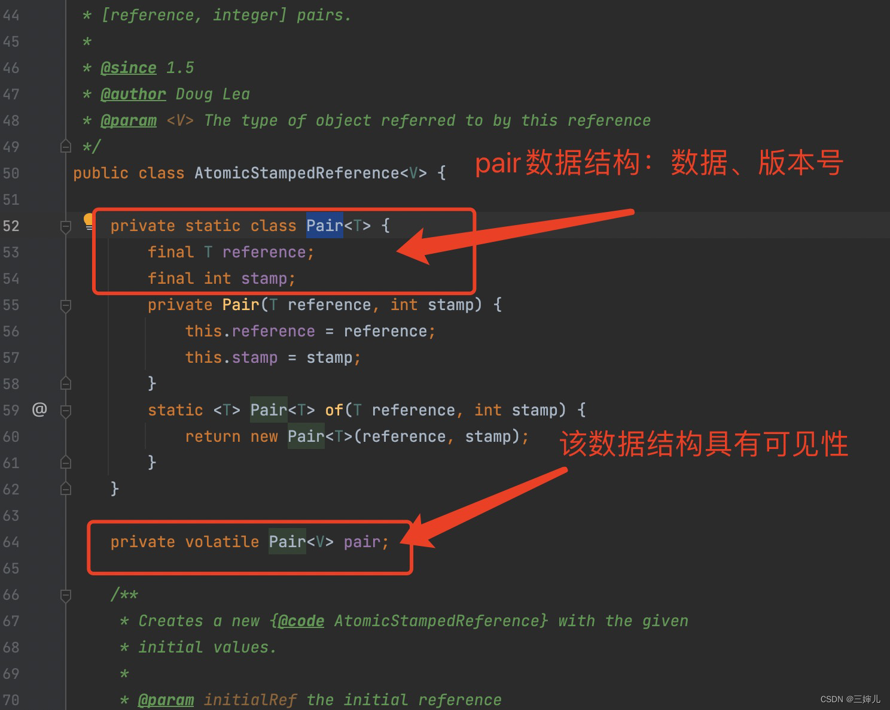
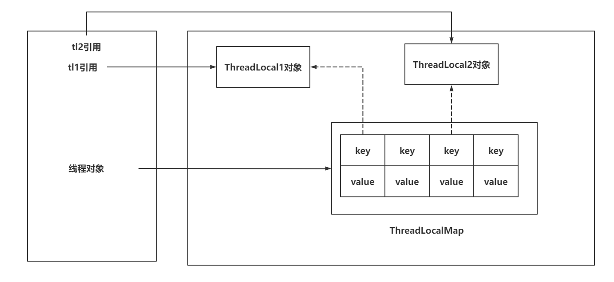
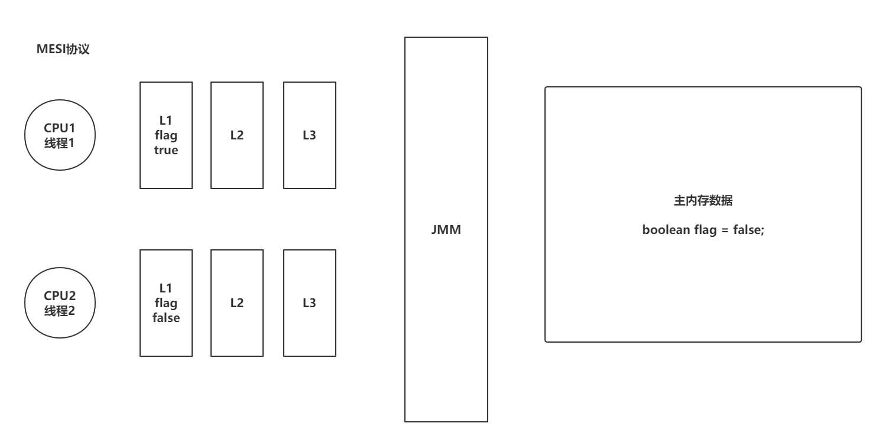
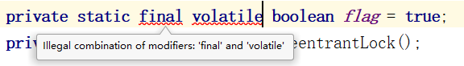

# 并发编程的三大特性及底层追问

## **<font style="color:rgb(51, 51, 51);">一、原子性</font>**
#### <font style="color:rgb(51, 51, 51);">1.1 什么是并发编程的原子性</font>
**<font style="color:rgb(51, 51, 51);">原子性的定义：原子性指一个操作是不可分割的，不可中断的，一个线程在执行时，另一个线程不会影响到他。</font>**

##### <font style="color:rgb(51, 51, 51);">Java的并发编程如何做到跨平台的？</font>
<font style="color:rgb(51, 51, 51);">JMM（Java Memory Model）。不同的硬件和不同的操作系统在内存上的操作有一定差异的。Java为了解决相同代码在不同操作系统上出现的各种问题，用JMM屏蔽掉各种硬件和操作系统带来的差异。</font>

<font style="color:rgb(51, 51, 51);">让Java的并发编程可以做到跨平台。</font>

<font style="color:rgb(51, 51, 51);">JMM规定所有变量都会存储在主内存中，在操作的时候，需要从主内存中复制一份到线程内存（CPU内存），在线程内部做计算。</font>**<font style="color:rgb(51, 51, 51);">然后再写回主内存中（不一定！）。</font>**

<font style="color:rgb(51, 51, 51);">并发编程的原子性用代码阐述：</font>

```java
private static int count;
/**
* @author TianMing
**/
public static void increment(){
    try {
        Thread.sleep(10);
    } catch (InterruptedException e) {
        e.printStackTrace();
    }
    count++;
}

public static void main(String[] args) throws InterruptedException {
    Thread t1 = new Thread(() -> {
        for (int i = 0; i < 100; i++) {
            increment();
        }
    });
    Thread t2 = new Thread(() -> {
        for (int i = 0; i < 100; i++) {
            increment();
        }
    });
    t1.start();
    t2.start();
    t1.join();
    t2.join();
    System.out.println(count);
}
```

<font style="color:rgb(51, 51, 51);">当前程序：多线程操作共享数据时，预期的结果，与最终的结果不符。</font>

**<font style="color:rgb(51, 51, 51);">原子性：多线程操作临界资源，预期的结果与最终结果一致。</font>**<font style="color:rgb(51, 51, 51);">（源于主存跟工作内存中不同）</font>

##### <font style="color:rgb(51, 51, 51);">Java对变量的存储和操作的详细过程？</font>
<font style="color:rgb(51, 51, 51);">通过对这个程序的分析，可以查看出，++的操作，一共分为了三部</font>

<font style="color:rgb(51, 51, 51);">首先是线程从主内存拿到数据保存到CPU的寄存器（线程的工作内存）中，</font>

<font style="color:rgb(51, 51, 51);">然后在CPU寄存器（高速缓存）中进行+1操作，</font>

<font style="color:rgb(51, 51, 51);">最终将结果写回到主内存（线程频繁读写变量时，会等满了或者一定时间再写回内存）当中。</font>

### <font style="color:rgb(51, 51, 51);">1.2 保证并发编程的原子性</font>
#### <font style="color:rgb(51, 51, 51);">1.2.1 synchronized</font>
<font style="color:rgb(51, 51, 51);">因为++操作可以从指令中查看到</font>



<font style="color:rgb(51, 51, 51);">既然有多个指令期间就可能被插一脚，可以在方法上追加</font>**<font style="color:rgb(51, 51, 51);">synchronized</font>**<font style="color:rgb(51, 51, 51);">关键字或者采用</font>**<font style="color:rgb(51, 51, 51);">同步代码块</font>**<font style="color:rgb(51, 51, 51);">的形式来保证原子性</font>

<font style="color:rgb(51, 51, 51);">synchronized可以让避免多线程同时操作临街资源，同一时间点，只会有一个线程正在操作临界资源</font>



##### <font style="color:rgb(51, 51, 51);">同步代码块和synchronized有什么区别？</font>
<font style="color:rgb(51, 51, 51);">1，范围：sync修饰方法时会锁定整个方法;synchronized(object){count++}同步代码块只锁定代码块</font>

<font style="color:rgb(51, 51, 51);">2，锁的对象：sync对于实例方法，锁的是当前实例对象。即每个对象都有一个与之关联的锁，当一个线程进入实例的 </font>`<font style="color:rgb(51, 51, 51);background-color:rgb(243, 244, 244);">synchronized</font>`<font style="color:rgb(51, 51, 51);"> 方法时，它就获得了这个对象的锁；同步代码块可以指定任意的对象作为锁。这使得开发者可以根据实际需求选择锁的粒度。</font>

<font style="color:rgb(51, 51, 51);">3，性能：sync会导致不必要开销；同步代码块能够减少锁的粒度</font>

<font style="color:rgb(51, 51, 51);">4，操作性：sync简洁方便；同步代码块灵活复杂</font>

#### <font style="color:rgb(51, 51, 51);">1.2.2 CAS</font>
##### <font style="color:rgb(51, 51, 51);">到底什么是CAS？</font>
<font style="color:rgb(51, 51, 51);">CAS：Compare and Swap。从字面意义上来说，就是先进行比较，然后替换</font>

<font style="color:rgb(51, 51, 51);">他在替换内存的某个位置的值时，首先查看内存中的值与预期值是否一致，如果一致，执行替换操作。这个操作是一个原子性操作。</font>

<font style="color:rgb(51, 51, 51);">它是</font>[<font style="color:rgb(65, 131, 196);">乐观锁</font>](https://so.csdn.net/so/search?q=%E4%B9%90%E8%A7%82%E9%94%81&spm=1001.2101.3001.7020)<font style="color:rgb(51, 51, 51);">思想的一种实现，尤其是在并发量大的业务场景下保证单个实例的原子性，使用较为频繁。java类库中java.util.concurrent.atomic包下一些方法，也均使用CAS处理</font>

<font style="color:rgb(51, 51, 51);">Java中基于Unsafe的类提供了对CAS的操作的方法，JVM会帮助我们将方法实现CAS汇编指令。</font>

<font style="color:rgb(51, 51, 51);">但是要清楚CAS只是比较和交换，在获取原值的这个操作上，需要你自己实现。</font>

```java
private static AtomicInteger count = new AtomicInteger(0);
/**
* @author TianMing
**/
public static void main(String[] args) throws InterruptedException {
    Thread t1 = new Thread(() -> {
        for (int i = 0; i < 100; i++) {
            count.incrementAndGet();
        }
    });
    Thread t2 = new Thread(() -> {
        for (int i = 0; i < 100; i++) {
            count.incrementAndGet();
        }
    });
    t1.start();
    t2.start();
    t1.join();
    t2.join();
    System.out.println(count);
}
```

<font style="color:rgb(51, 51, 51);">Doug Lea在CAS的基础上帮助我们实现了一些原子类，其中就包括现在看到的AtomicInteger，还有其他很多原子类……</font>

##### **<font style="color:rgb(51, 51, 51);">CAS的缺点</font>**<font style="color:rgb(51, 51, 51);">：</font>
<font style="color:rgb(51, 51, 51);">	</font><font style="color:rgb(51, 51, 51);">CAS只能保证对一个变量的操作是原子性的，无法实现对多行代码实现原子性。</font>

##### **<font style="color:rgb(51, 51, 51);">CAS的问题</font>**<font style="color:rgb(51, 51, 51);">：</font>
<font style="color:rgb(51, 51, 51);">1：</font>**<font style="color:rgb(51, 51, 51);">ABA问题</font>**<font style="color:rgb(51, 51, 51);">：问题如下：</font>

<font style="color:rgb(51, 51, 51);">线程1让A>B , 线程2也是A>B ; </font>

<font style="color:rgb(51, 51, 51);">线程3在线程2判断是否A之前将B>A；</font>

<font style="color:rgb(51, 51, 51);">当线程2通过CAS判断是否被修改过时，会误以为没有发生过修改，但实际已经被多次修改</font>



**<font style="color:rgb(51, 51, 51);">解决方案</font>**<font style="color:rgb(51, 51, 51);">：可以引入版本号的方式，来解决ABA的问题。Java中提供了一个类在CAS时，针对各个版本追加版本号的操作。 AtomicStampeReference</font>

<font style="color:rgb(51, 51, 51);">AtomicStampedReference在CAS时，不但会判断原值，还会比较版本信息。</font>

```java
public static void main(String[] args) {
    AtomicStampedReference<String> reference = new AtomicStampedReference<>("AAA",1);

    String oldValue = reference.getReference();
    int oldVersion = reference.getStamp();

    boolean b = reference.compareAndSet(oldValue, "B", oldVersion, oldVersion + 1);
    System.out.println("修改1版本的：" + b);

    boolean c = reference.compareAndSet("B", "C", 1, 1 + 1);
    System.out.println("修改2版本的：" + c);
}
```

<font style="color:rgb(51, 51, 51);">思考：这ABA看似没是啥影响，有回到最初该干啥继续干不就行了？什么情况不允许！</font>

<font style="color:rgb(51, 51, 51);">		</font><font style="color:rgb(51, 51, 51);"> 如：缓存系统中数据新旧判断；任务调度系统状态的就绪，执行，完成切换；</font>

<font style="color:rgb(51, 51, 51);">				</font><font style="color:rgb(51, 51, 51);">银行风险评估；证券交易策略；女友帽子颜色判断</font>

<font style="color:rgb(51, 51, 51);">2：</font>**<font style="color:rgb(51, 51, 51);">自旋时间过长问题</font>**<font style="color:rgb(51, 51, 51);">：多个线程同时尝试更新同一个变量</font>

    - <font style="color:rgb(51, 51, 51);">可以指定CAS一共循环多少次，如果超过这个次数，直接失败/或者挂起线程。（自旋锁、自适应自旋锁）</font>
    - <font style="color:rgb(51, 51, 51);">可以在CAS一次失败后，将这个操作暂存起来，后面需要获取结果时，将暂存的操作全部执行，再返回最后的结果。</font>

<font style="color:rgb(51, 51, 51);">AtomicStampedReference 内部维护了一个 Pair的数据结构：reference(数据体)、stamp(版本)两个部分。该数据结构用volatile修饰，保证了线程可见性。</font>



<font style="color:rgb(51, 51, 51);">核心方法为：compareAndSet方法。</font>

<font style="color:rgb(51, 51, 51);">该方法中参数：expectedReference：表示预期值，newReference：表示新的值，expectedStamp：表示预期版本号，newStamp表示新的版本号。</font>

从数据和版本号两个方面来判断传入的参数是否符合 Pair 的预期，有一个不符合就返回false。

```plain
可以看到，这里底层也是使用了c

而casPair实质上调用的是UNSAFE.compareAndSwapObject（） 

由此可见，AtomicStampedReference是通过加版本号来解决ABA问题的。对于加版本号，compareAndSwapObject只能对比交互一个对象，所以将数据和版本号放到一个对象里就可以解决问题了
```

#### <font style="color:rgb(51, 51, 51);">1.2.3 Lock锁</font>
<font style="color:rgb(51, 51, 51);">Lock锁是在JDK1.5由Doug Lea研发的，他的性能相比synchronized在JDK1.5的时期，性能好了很多多，</font>

<font style="color:rgb(51, 51, 51);">但是在JDK1.6对synchronized优化之后，性能相差不大，但是如果涉及并发比较多时，推荐ReentrantLock锁，性能会更好。</font>

<font style="color:rgb(51, 51, 51);">实现方式：</font>

```java
private static int count;

private static ReentrantLock lock = new ReentrantLock();
/**
* @author TianMing
**/
public static void increment()  {
    lock.lock();
    try {
        count++;
        try {
            Thread.sleep(10);
        } catch (InterruptedException e) {
            e.printStackTrace();
        }
    } finally {
        lock.unlock();
    }


}

public static void main(String[] args) throws InterruptedException {
    Thread t1 = new Thread(() -> {
        for (int i = 0; i < 100; i++) {
            increment();
        }
    });
    Thread t2 = new Thread(() -> {
        for (int i = 0; i < 100; i++) {
            increment();
        }
    });
    t1.start();
    t2.start();
    t1.join();
    t2.join();
    System.out.println(count);
}
```

<font style="color:rgb(51, 51, 51);">ReentrantLock可以直接对比synchronized，在功能上来说，都是锁。</font>

<font style="color:rgb(51, 51, 51);">但是ReentrantLock的功能性相比synchronized更丰富。</font>

**<font style="color:rgb(51, 51, 51);">ReentrantLock底层是基于AQS（后面详解）实现的，有一个基于CAS维护的state变量来实现锁的操作。</font>**

#### <font style="color:rgb(51, 51, 51);">1.2.4 ThreadLocal</font>
#### **<font style="color:rgb(51, 51, 51);">Java中的四种引用类型</font>**
<font style="color:rgb(51, 51, 51);">Java中的使用引用类型分别是</font>**<font style="color:rgb(51, 51, 51);">强，软，弱，虚</font>**<font style="color:rgb(51, 51, 51);">。</font>

<font style="color:rgb(51, 51, 51);">User user = new User（）；</font>

<font style="color:rgb(51, 51, 51);">在 Java 中最常见的就是</font>**<font style="color:rgb(51, 51, 51);">强引用</font>**<font style="color:rgb(51, 51, 51);">，把一个对象赋给一个引用变量，这个引用变量就是一个强引用。当一个对象被强引用变量引用时，它始终处于可达状态，它是不可能被垃圾回收机制回收的，即使该对象以后永远都不会被用到 JVM 也不会回收。因此强引用是造成 Java 内存泄漏的主要原因之一。</font>

SoftReference

<font style="color:rgb(51, 51, 51);">其次是</font>**<font style="color:rgb(51, 51, 51);">软引用</font>**<font style="color:rgb(51, 51, 51);">，对于只有软引用的对象来说，当系统内存足够时它不会被回收，当系统内存空间不足时它会被回收。软引用通常用在对内存敏感的程序中，作为缓存使用。</font>

<font style="color:rgb(51, 51, 51);">然后是</font>**<font style="color:rgb(51, 51, 51);">弱引用</font>**<font style="color:rgb(51, 51, 51);">，它比软引用的生存期更短，对于只有弱引用的对象来说，只要垃圾回收机制一运行，不管 JVM 的内存空间是否足够，总会回收该对象占用的内存。可以解决内存泄漏问题，ThreadLocal就是基于弱引用解决内存泄漏的问题。</font>

<font style="color:rgb(51, 51, 51);">最后是</font>**<font style="color:rgb(51, 51, 51);">虚引用</font>**<font style="color:rgb(51, 51, 51);">，它不能单独使用，必须和引用队列联合使用。虚引用的主要作用是跟踪对象被垃圾回收的状态。不过在开发中，我们用的更多的还是强引用。</font>

<font style="color:rgb(51, 51, 51);">Java 引用是 Java 虚拟机为了实现更加灵活的对象生命周期管理而设计的对象包装类，一共有四种引用类型，分别是强引用、软引用、弱引用和虚引用。我将它们的</font>

##### <font style="color:rgb(51, 51, 51);">区别概括为 3 个维度：</font>
+ **<font style="color:rgb(51, 51, 51);">维度 1 - 对象可达性状态的区别：</font>**<font style="color:rgb(51, 51, 51);"> 强引用指向的对象是强可达的，而其他引用指向的对象都是弱可达的。当一个对象存在到 GC Root 的引用链时，该对象被认为是强可达的。只有强可达的对象才会认为是存活的对象，才能保证在垃圾收集的过程中不会被回收；</font>
+ **<font style="color:rgb(51, 51, 51);">维度 2 - 垃圾回收策略的区别：</font>**<font style="color:rgb(51, 51, 51);"> 除了影响对象的可达性状态，不同的引用类型还会影响垃圾收集器回收对象的激进程度：</font>
    - **<font style="color:rgb(51, 51, 51);">强引用：</font>**<font style="color:rgb(51, 51, 51);"> 强引用指向的对象不会被垃圾收集器回收；</font>
    - **<font style="color:rgb(51, 51, 51);">软引用：</font>**<font style="color:rgb(51, 51, 51);"> 软引用是相对于强引用更激进的策略，软引用指向的对象在内存充足时会从垃圾收集器中豁免，起到类似强引用的效果，但在内存不足时还是会被垃圾收集器回收。那么软引用通常是用于实现内存敏感的缓存，当有足够空闲内存时保留内存，当空闲内存不足时清理缓存，避免缓存耗尽内存；</font>
    - **<font style="color:rgb(51, 51, 51);">弱引用和虚引用：</font>**<font style="color:rgb(51, 51, 51);"> 弱引用和虚引用是相对于软引用更激进的策略，弱引用指向的对象无论在内存是否充足的时候，都会被垃圾收集器回收；</font>
+ **<font style="color:rgb(51, 51, 51);">维度 3 - 感知垃圾回收时机：</font>**<font style="color:rgb(51, 51, 51);"> 虚引用主要的作用是提供了一个感知对象被垃圾回收的机制。在虚拟机即将回收对象之前，如果发现对象还存在虚引用，则会在回收对象后会将引用加入到关联的引用队列中。程序可以通过观察引用队列的方式，来感知到对象即将被垃圾回收的时机，再采取必要的措施。例如 Java Cleaner 工具类，就是基于虚引用实现的回收工具类。需要特别说明的是，并不是只有虚引用才能与引用队列关联，软引用和弱引用都可以与引用队列关联，只是说虚引用唯一的作用就是感知对象垃圾回收时机。</font>

<font style="color:rgb(51, 51, 51);">除了我们熟悉的四大引用，虚拟机内部还设计了一个 </font>`<font style="color:rgb(51, 51, 51);background-color:rgb(243, 244, 244);">@hide</font>`<font style="color:rgb(51, 51, 51);"> 的</font>`<font style="color:rgb(51, 51, 51);background-color:rgb(243, 244, 244);">FinalizerReference</font>`<font style="color:rgb(51, 51, 51);"> 引用，用于支持 Java Finalizer 机制，更多内容见 Finalizer 机制。</font>

#### **<font style="color:rgb(51, 51, 51);">1.2 指针、引用和句柄有什么区别？</font>**
<font style="color:rgb(51, 51, 51);">引用、指针和句柄都具有指向对象地址的含义，可以将它们都简单地理解为一个内存地址。只有在具体的问题中，才需要区分它们的含义：</font>

+ **<font style="color:rgb(51, 51, 51);">1、引用（Reference）：</font>**<font style="color:rgb(51, 51, 51);"> 引用是 Java 虚拟机为了实现灵活的对象生命周期管理而实现的对象包装类，引用本身并不持有对象数据，而是通过直接指针或句柄 2 种方式来访问真正的对象数据；</font>
+ **<font style="color:rgb(51, 51, 51);">2、指针（Point）：</font>**<font style="color:rgb(51, 51, 51);"> 指针也叫直接指针，它表示对象数据在内存中的地址，通过指针就可以直接访问对象数据；</font>
+ **<font style="color:rgb(51, 51, 51);">3、句柄（Handler）：</font>**<font style="color:rgb(51, 51, 51);"> 句柄是一种特殊的指针，句柄持有指向对象实例数据和类型数据的指针。使用句柄的优点是让对象在垃圾收集的过程中移动存储区域的话，虚拟机只需要改变句柄中的指针，而引用持有的句柄是稳定的。缺点是需要两次指针访问才能访问到对象数据。</font>

##### **<font style="color:rgb(51, 51, 51);">引用相关的问题</font>**<font style="color:rgb(51, 51, 51);">：</font>
<font style="color:rgb(51, 51, 51);">ThreadLocal是一个用来解决线程安全性的一个工具，它相当于让每个线程都开辟一块内存空间用来存储共享变量的副本。</font>

<font style="color:rgb(51, 51, 51);">然后每个线程只需要去访问和操作自己的共享变量的一个副本就可以了。从而去避免多线程竞争同一个共享资源。</font>

<font style="color:rgb(51, 51, 51);">每一个线程都一个成员变量，叫ThreadLocalMap。当线程访问ThreadLocal修饰的共享变量的时候，这个线程就会在自己的成员变量ThreadLocalMap里面去保存一份数据副本。</font>

<font style="color:rgb(51, 51, 51);">key指向的是ThreadLocal这样一个引用。并且是一个</font>**<font style="color:rgb(51, 51, 51);">弱引用关系</font>**<font style="color:rgb(51, 51, 51);">。而value保存是共享数据的一个副本。因为每个线程都持有一份数据副本，所以线程之间就不存在对于共享数据的一个并发操作。所以就解决了线程安全性的问题。</font>

<font style="color:rgb(51, 51, 51);">ThreadLocal保证原子性的方式，是不让多线程去操作</font>**<font style="color:rgb(51, 51, 51);">临界资源</font>**<font style="color:rgb(51, 51, 51);">，让每个线程去操作属于自己的数据.一定程度也能保证线程安全</font>

<font style="color:rgb(51, 51, 51);">代码实现</font>

```java
static ThreadLocal tl1 = new ThreadLocal();
static ThreadLocal tl2 = new ThreadLocal();

public static void main(String[] args) {
    tl1.set("123");
    tl2.set("456");
    Thread t1 = new Thread(() -> {
        System.out.println("t1:" + tl1.get());
        System.out.println("t1:" + tl2.get());
    });
    t1.start();

    System.out.println("main:" + tl1.get());
    System.out.println("main:" + tl2.get());
}
```

##### **<font style="color:rgb(51, 51, 51);">ThreadLocal实现原理</font>**<font style="color:rgb(51, 51, 51);">：</font>
+ <font style="color:rgb(51, 51, 51);">每个Thread中都存储着一个成员变量，ThreadLocalMap</font>
+ <font style="color:rgb(51, 51, 51);">ThreadLocal本身不存储数据，像是一个工具类，基于ThreadLocal去操作ThreadLocalMap</font>
+ <font style="color:rgb(51, 51, 51);">ThreadLocalMap本身就是基于Entry[]实现的，因为一个线程可以绑定多个ThreadLocal，这样一来，可能需要存储多个数据，所以采用Entry[]的形式实现。</font>
+ <font style="color:rgb(51, 51, 51);">每一个现有都自己独立的ThreadLocalMap，再基于ThreadLocal对象本身作为key，对value进行存取</font>
+ <font style="color:rgb(51, 51, 51);">ThreadLocalMap的key是一个弱引用，弱引用的特点是，即便有弱引用，在GC时，也必须被回收。这里是为了在ThreadLocal对象失去引用后，如果key的引用是强引用，会导致ThreadLocal对象无法被回收</font>

##### <font style="color:rgb(51, 51, 51);">ThreadLocal内存泄漏问题：</font>
**<font style="color:rgb(51, 51, 51);">内存泄漏是指：程序已经不再使用某字段、某对象。但是却无法回收掉它占用的内存。</font>**

<font style="color:rgb(51, 51, 51);">两个关键点：不再使用 并且 无法回收</font>

<font style="color:rgb(51, 51, 51);">代码示范：</font>

<font style="color:rgb(51, 51, 51);">可以发现问题，ThreadLocal已经被清理掉了，代表现在已经没有方式去访问当前ThreadLocal存到Map里的value数据了</font>

<font style="color:rgb(51, 51, 51);">但是当前线程由于还在执行、没有关闭，所以内部的value还一直存在！</font>

<font style="color:rgb(51, 51, 51);">此时 造成内存泄漏</font>

+ <font style="color:rgb(51, 51, 51);">如果ThreadLocal引用丢失，key因为弱引用会被GC回收掉，如果同时线程还没有被回收，就会导致内存泄漏，内存中的value无法被回收，同时也无法被获取到。</font>

**<font style="color:rgb(51, 51, 51);">解决方案：</font>**

<font style="color:rgb(51, 51, 51);">官方也认识到了这个问题，所以Map的key设置为了弱引用</font>

<font style="color:rgb(51, 51, 51);">所以现在会变成这个样子，当ThreadLocal被清理掉了。Key无人引用后，就会被gc清理掉，因为他是弱引用，key变为null了，代表此时value需要被清理了。这个时候调用set、get、remove方法时都会触发清理机制（监测key==null就清理value）</font>

<font style="color:rgb(51, 51, 51);">而如果key是强引用，就不知道是不是没人引用这个值了，就不知道要不要清理。</font>

<font style="color:rgb(51, 51, 51);">只需要在使用完毕ThreadLocal对象之后，及时的</font>**<font style="color:rgb(51, 51, 51);">调用remove方法</font>**<font style="color:rgb(51, 51, 51);">，移除Entry即可</font>



## **<font style="color:rgb(51, 51, 51);">二、可见性</font>**
### <font style="color:rgb(51, 51, 51);">2.1 什么是可见性</font>
**<font style="color:rgb(51, 51, 51);">可见性：一个线程对共享变量值的修改，能够及时地被其他线程看到。</font>**

<font style="color:rgb(51, 51, 51);">可见性问题是基于CPU位置出现的，CPU处理速度非常快，相对CPU来说，去主内存获取数据这个事情太慢了，CPU就提供了L1，L2，L3的三级缓存，每次去主内存拿完数据后，就会存储到CPU的三级缓存，每次去三级缓存拿数据，效率肯定会提升。</font>

<font style="color:rgb(51, 51, 51);">这就带来了问题，现在CPU都是多核，每个线程的工作内存（CPU三级缓存）都是独立的，会告知每个线程中做修改时，只改自己的工作内存，没有及时的同步到主内存，导致数据不一致问题。</font>



<font style="color:rgb(51, 51, 51);">可见性问题的代码逻辑</font>

```plain
private static boolean flag = true;

public static void main(String[] args) throws InterruptedException {
    Thread t1 = new Thread(() -> {
        while (flag) {
            // ....
        }
        System.out.println("t1线程结束");
    });

    t1.start();
    Thread.sleep(10);
    flag = false;
    System.out.println("主线程将flag改为false");
}
```

### <font style="color:rgb(51, 51, 51);">2.2 解决可见性的方式</font>
#### <font style="color:rgb(51, 51, 51);">2.2.1 volatile</font>
<font style="color:rgb(51, 51, 51);">volatile是一个关键字，用来修饰成员变量。</font>

<font style="color:rgb(51, 51, 51);">如果属性被volatile修饰，相当于会告诉CPU，对当前属性的操作，不允许使用CPU的缓存，必须去和主内存操作</font>

<font style="color:rgb(51, 51, 51);">volatile的内存语义：</font>

+ <font style="color:rgb(51, 51, 51);">volatile属性被</font>**<font style="color:rgb(51, 51, 51);">写</font>**<font style="color:rgb(51, 51, 51);">：当写一个volatile变量，JMM会将当前线程对应的CPU缓存及时的刷新到主内存中</font>
+ <font style="color:rgb(51, 51, 51);">volatile属性被</font>**<font style="color:rgb(51, 51, 51);">读</font>**<font style="color:rgb(51, 51, 51);">：当读一个volatile变量，JMM会将对应的CPU缓存中的内存设置为无效，必须去主内存中重新读取共享变量</font>

**<font style="color:rgb(51, 51, 51);">实现原理：</font>**

<font style="color:rgb(51, 51, 51);">其实加了volatile就是告知CPU，对当前属性的读写操作，不允许使用CPU缓存，加了volatile修饰的属性，会在转为汇编之后后，追加一个lock的前缀，CPU执行这个指令时，如果带有lock前缀会做两个事情：</font>

+ <font style="color:rgb(51, 51, 51);">将当前处理器缓存行的数据写回到主内存</font>
+ <font style="color:rgb(51, 51, 51);">这个写回的数据，在其他的CPU内核的缓存中，直接无效。</font>

**<font style="color:rgb(51, 51, 51);">总结：volatile就是让CPU每次操作这个数据时，必须立即同步到主内存，以及从主内存读取数据。</font>**

```java
//volatile修饰，确保了线程 t1 对 flag 的读取操作是从主内存中读取的
private volatile static boolean flag = true;
public static void main(String[] args) throws InterruptedException {
    Thread t1 = new Thread(() -> {
        while (flag) {
            // ....
        }
        System.out.println("t1线程结束");
    });

    t1.start();
    Thread.sleep(10);
    flag = false;
    System.out.println("主线程将flag改为false");
}
```

#### <font style="color:rgb(51, 51, 51);">2.2.2 synchronized</font>
<font style="color:rgb(51, 51, 51);">synchronized也是可以解决可见性问题的，synchronized的内存语义。</font>

<font style="color:rgb(51, 51, 51);">如果涉及到了synchronized的同步代码块或者是同步方法</font>

**<font style="color:rgb(51, 51, 51);">获取锁</font>**<font style="color:rgb(51, 51, 51);">资源之后，将内部涉及到的变量从CPU缓存中移除，必须去主内存中重新拿数据，</font>

**<font style="color:rgb(51, 51, 51);">释放锁</font>**<font style="color:rgb(51, 51, 51);">之后，会立即将CPU缓存中的数据同步到主内存。</font>

```java
private static boolean flag = true;

public static void main(String[] args) throws InterruptedException {
    Thread t1 = new Thread(() -> {
        while (flag) {
            synchronized (TiMiTest.class){
                //...
            }
            System.out.println(111);
        }
        System.out.println("t1线程结束");

    });

    t1.start();
    Thread.sleep(10);
    flag = false;
    System.out.println("主线程将flag改为false");
}
```

#### <font style="color:rgb(51, 51, 51);">2.2.3 Lock</font>
<font style="color:rgb(51, 51, 51);">Lock锁保证可见性的方式和synchronized完全不同，synchronized基于他的内存语义，在获取锁和释放锁时，对CPU缓存做一个同步到主内存的操作。</font>

**<font style="color:rgb(51, 51, 51);">加锁和释放锁</font>**<font style="color:rgb(51, 51, 51);">时，会对一个由volatile修饰的state属性进行加减操作。</font>

**<font style="color:rgb(51, 51, 51);">实现原理：  </font>**

<font style="color:rgb(51, 51, 51);">Lock锁是基于volatile实现的。如果对volatile修饰的属性进行写操作，CPU会执行带有lock前缀的指令，CPU会将修改的数据，从CPU缓存立即同步到主内存，同时也会将其他的属性也立即同步到主内存中。还会将其他CPU缓存行中的这个数据设置为无效，必须重新从主内存中拉取。</font>

```java
private static boolean flag = true;
private static Lock lock = new ReentrantLock();

public static void main(String[] args) throws InterruptedException {
    Thread t1 = new Thread(() -> {
        while (flag) {
            lock.lock();
            try{
                //...
            }finally {
                lock.unlock();
            }
        }
        System.out.println("t1线程结束");

    });

    t1.start();
    Thread.sleep(10);
    flag = false;
    System.out.println("主线程将flag改为false");
}
```

#### <font style="color:rgb(51, 51, 51);">2.2.4 final</font>
<font style="color:rgb(51, 51, 51);">final修饰的属性，在运行期间是不允许修改的，这样一来，就间接的保证了可见性，所有多线程读取final属性，值肯定是一样。</font>

<font style="color:rgb(51, 51, 51);">final并不是说每次取数据从主内存读取，他没有这个必要，而且</font>**<font style="color:rgb(51, 51, 51);">final和volatile是不允许同时</font>**<font style="color:rgb(51, 51, 51);">修饰一个属性的。</font>**<font style="color:rgb(51, 51, 51);">原因</font>**<font style="color:rgb(51, 51, 51);">在于：final修饰的内容已经不允许再次被写了，而volatile是保证每次读写数据去主内存读取，并且volatile会影响一定的性能，就不需要同时修饰。</font>



##### **<font style="color:rgb(51, 51, 51);">问</font>**<font style="color:rgb(51, 51, 51);">：</font>`<font style="color:rgb(51, 51, 51);background-color:rgb(243, 244, 244);">volatile</font>`<font style="color:rgb(51, 51, 51);"> 变量的读写操作是否具有原子性？</font>
**<font style="color:rgb(51, 51, 51);">答</font>**<font style="color:rgb(51, 51, 51);">：</font>`<font style="color:rgb(51, 51, 51);background-color:rgb(243, 244, 244);">volatile</font>`<font style="color:rgb(51, 51, 51);"> 变量的读写操作本身是原子性的，但对于需要多个操作完成的复合操作（如 </font>`<font style="color:rgb(51, 51, 51);background-color:rgb(243, 244, 244);">i++</font>`<font style="color:rgb(51, 51, 51);">），</font>`<font style="color:rgb(51, 51, 51);background-color:rgb(243, 244, 244);">volatile</font>`<font style="color:rgb(51, 51, 51);"> 并不能保证其原子性。因为这些复合操作会涉及读取、修改和写回三个步骤，中间可能会被其他线程打断</font>

##### **<font style="color:rgb(51, 51, 51);">问</font>**<font style="color:rgb(51, 51, 51);">：</font>`<font style="color:rgb(51, 51, 51);background-color:rgb(243, 244, 244);">synchronized</font>`<font style="color:rgb(51, 51, 51);"> 和 </font>`<font style="color:rgb(51, 51, 51);background-color:rgb(243, 244, 244);">volatile</font>`<font style="color:rgb(51, 51, 51);"> 在保证可见性方面的区别是什么？</font>
**<font style="color:rgb(51, 51, 51);">答</font>**<font style="color:rgb(51, 51, 51);">：</font>`<font style="color:rgb(51, 51, 51);background-color:rgb(243, 244, 244);">synchronized</font>`<font style="color:rgb(51, 51, 51);"> 保证了锁范围内的变量在每次进入和退出锁时都会进行主内存的读写操作，而 </font>`<font style="color:rgb(51, 51, 51);background-color:rgb(243, 244, 244);">volatile</font>`<font style="color:rgb(51, 51, 51);"> 只是对单个变量的读写操作进行控制。</font>`<font style="color:rgb(51, 51, 51);background-color:rgb(243, 244, 244);">synchronized</font>`<font style="color:rgb(51, 51, 51);"> 可以保证更广泛的变量可见性，但 </font>`<font style="color:rgb(51, 51, 51);background-color:rgb(243, 244, 244);">volatile</font>`<font style="color:rgb(51, 51, 51);"> 的性能开销相对较小。</font>

##### **<font style="color:rgb(51, 51, 51);">问</font>**<font style="color:rgb(51, 51, 51);">：</font>`<font style="color:rgb(51, 51, 51);background-color:rgb(243, 244, 244);">Lock</font>`<font style="color:rgb(51, 51, 51);"> 和 </font>`<font style="color:rgb(51, 51, 51);background-color:rgb(243, 244, 244);">synchronized</font>`<font style="color:rgb(51, 51, 51);"> 在可见性上有什么不同？</font>
**<font style="color:rgb(51, 51, 51);">答</font>**<font style="color:rgb(51, 51, 51);">：两者都能保证可见性，但 </font>`<font style="color:rgb(51, 51, 51);background-color:rgb(243, 244, 244);">Lock</font>`<font style="color:rgb(51, 51, 51);"> 提供了更灵活的锁操作，比如尝试获取锁、可中断获取锁等。而 </font>`<font style="color:rgb(51, 51, 51);background-color:rgb(243, 244, 244);">synchronized</font>`<font style="color:rgb(51, 51, 51);"> 是一种更简单的锁机制，自动释放锁等操作由JVM处理。</font>`<font style="color:rgb(51, 51, 51);background-color:rgb(243, 244, 244);">Lock</font>`<font style="color:rgb(51, 51, 51);"> 的性能通常优于 </font>`<font style="color:rgb(51, 51, 51);background-color:rgb(243, 244, 244);">synchronized</font>`<font style="color:rgb(51, 51, 51);">，但在某些简单场景下，</font>`<font style="color:rgb(51, 51, 51);background-color:rgb(243, 244, 244);">synchronized</font>`<font style="color:rgb(51, 51, 51);"> 的性能可能更好。</font>

## <font style="color:rgb(51, 51, 51);">三、有序性</font>
### <font style="color:rgb(51, 51, 51);">3.1 什么是有序性</font>
<font style="color:rgb(51, 51, 51);">有序性是指由于</font>**<font style="color:rgb(51, 51, 51);">JIT动态编译器、操作系统为了给提高程序的执行效率，可能会对按顺序书写好的指令进行重排</font>**<font style="color:rgb(51, 51, 51);">，</font>**<font style="color:rgb(51, 51, 51);">线程或者CPU执行的时候不一定按照程序书写的顺序来执行</font>**

<font style="color:rgb(51, 51, 51);">在Java中，.java文件中的内容会被编译，在执行前需要再次转为CPU可以识别的指令，CPU在执行这些指令时，为了提升执行效率，在不影响最终结果的前提下（满足一些要求），会对指令进行重排。</font>

<font style="color:rgb(51, 51, 51);">指令乱序执行的原因，是为了尽可能的发挥CPU的性能。</font>

**<font style="color:rgb(51, 51, 51);">指令重排序</font>**<font style="color:rgb(51, 51, 51);">：CPU为了提高运行效率，可能会对编译后的代码指令进行优化，即：代码书写顺序与实际执行的顺序不同，但执行结果一定与按照编写顺序执行的结果一致（符合指令间的依赖关系）。 – 有些代码翻译成机器指令后，进行重排序 ，重排序后的指令更加符合CPU执行特点，这样就可以最大限度的发挥CPU性能 ——as-if-serial语义:无论如何重排序，程序执行的结果应该与代码顺序执行的结果一致（Java编译器、运行时和处理器都会保证Java在单线程下遵循as-if-serial语义） </font>

<font style="color:rgb(51, 51, 51);">Java中的程序是乱序执行的。</font>

<font style="color:rgb(51, 51, 51);">Java程序验证乱序执行效果：</font>

```java
static int a,b,x,y;

public static void main(String[] args) throws InterruptedException {
    for (int i = 0; i < Integer.MAX_VALUE; i++) {
        a = 0;
        b = 0;
        x = 0;
        y = 0;

        Thread t1 = new Thread(() -> {
            a = 1;
            x = b;
        });
        Thread t2 = new Thread(() -> {
            b = 1;
            y = a;
        });

        t1.start();
        t2.start();
        t1.join();
        t2.join();

        if(x == 0 && y == 0){
            System.out.println("第" + i + "次，x = "+ x + ",y = " + y);
        }
    }
}
```

<font style="color:rgb(51, 51, 51);">单例模式由于指令重排序可能会出现问题：</font>

<font style="color:rgb(51, 51, 51);">线程可能会拿到没有初始化的对象，导致在使用时，可能由于内部属性为默认值，导致出现一些不必要的问题</font>

```java
//volatile 修饰 ，确保对象的初始化完成之前，其他线程不会看到未初始化的实例。
private static volatile TiMiTest test;
private TiMiTest(){}
public static TiMiTest getInstance(){
    // B
    if(test  == null){
        synchronized (TiMiTest.class){

            if(test == null){
                // A   ,  开辟空间，test指向地址，初始化
                //即使test == null的判断通过了，test对象可能仍然未完全初始化。
                test = new TiMiTest();
            }
        }
    }
    return test;
}
```

### <font style="color:rgb(51, 51, 51);">3.2 as-if-serial语义</font>
<font style="color:rgb(51, 51, 51);">as-if-serial语义：</font>

<font style="color:rgb(51, 51, 51);">不论指定如何重排序，需要保证单线程的程序执行结果是不变的。</font>

<font style="color:rgb(51, 51, 51);">而且如果存在依赖的关系，那么也不可以做指令重排。</font>

<font style="color:rgb(51, 51, 51);">但是多线程环境下，指令重排序可能导致不可预测的行为。</font>

```plain
// 这种情况肯定不能做指令重排序
int i = 0;
i++;

// 这种情况肯定不能做指令重排序
int j = 200;
j * 100;
j + 100;
// 这里即便出现了指令重排，也不可以影响最终的结果，20100
```

### <font style="color:rgb(51, 51, 51);">3.3 happens-before原则</font>
**<font style="color:rgb(51, 51, 51);">具体规则：</font>**

```plain
1. 单线程happen-before原则：在同一个线程中，书写在前面的操作happen-before后面的操作。
2. 锁的happen-before原则：同一个锁的unlock操作happen-before此锁的lock操作。
3. volatile的happen-before原则： 对一个volatile变量的写操作happen-before对此变量的任意操作。
4. happen-before的传递性原则： 如果A操作 happen-before B操作，B操作happen-before C操作，那么A操作happen-before C操作。
3. 线程启动的happen-before原则：同一个线程的start方法happen-before此线程的其它方法。
6. 线程中断的happen-before原则：对线程interrupt方法的调用happen-before被中断线程的检测到中断发送的代码。
7. 线程终结的happen-before原则：线程中的所有操作都happen-before线程的终止检测。
8. 对象创建的happen-before原则：一个对象的初始化完成先于他的finalize方法调用。
     JMM只有在不出现上述8中情况时，才不会触发指令重排效果。
```

<font style="color:rgb(51, 51, 51);">不需要过分的关注happens-before原则，只需要可以写出线程安全的代码就可以了。</font>

### <font style="color:rgb(51, 51, 51);">3.4 volatile</font>
<font style="color:rgb(51, 51, 51);">如果需要让程序对某一个属性的操作不出现指令重排，除了满足happens-before原则之外，还可以基于volatile修饰属性，JVM编译时会插入</font>**<font style="color:rgb(51, 51, 51);">内存屏障</font>**<font style="color:rgb(51, 51, 51);">（Memory Barrier）指令防止指令重排，就不会出现指令重排的问题了。</font>

<font style="color:rgb(51, 51, 51);">volatile如何实现的禁止指令重排？</font>

<font style="color:rgb(51, 51, 51);">在编译时，插入内存屏障，防止编译器对指令进行重排序。可将内存屏障看成一条指令。会在两个操作之间，添加上一道指令，这个指令就可以避免上下执行的其他指令进行重排序。</font>

##### <font style="color:rgb(51, 51, 51);">问题思考：(答案上翻)</font>
<font style="color:rgb(51, 51, 51);">什么是指令重排序？它对Java程序有什么影响？</font>

<font style="color:rgb(51, 51, 51);">什么是as-if-serial语义？它在Java中有什么作用？</font>

`<font style="color:rgb(51, 51, 51);background-color:rgb(243, 244, 244);">volatile</font>`<font style="color:rgb(51, 51, 51);">如何禁止指令重排序？</font>

<font style="color:rgb(51, 51, 51);">happens-before原则有哪些具体规则？</font>

<font style="color:rgb(51, 51, 51);">为什么单例模式中可能会出现指令重排序的问题？如何解决？</font>


> 更新: 2025-05-12 21:17:37  
> 原文: <https://www.yuque.com/tulingzhouyu/db22bv/droiapp7ghmm8c0v>