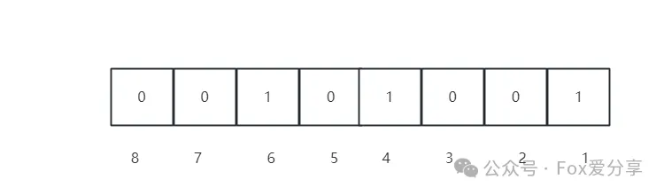
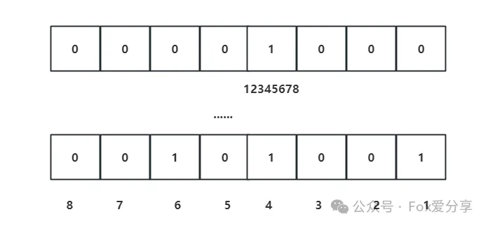

# 腾讯面试：40亿QQ号，给你1G内存，怎么去重？

<font style="color:rgb(0, 0, 0);">前段时间，</font><font style="color:rgb(36, 41, 46);">有个小伙伴给我分享了他去腾讯面试的经历。他说被</font><font style="color:rgba(0, 0, 0, 0.9);">问到了一道去重的面试题：</font>

**<font style="color:rgba(0, 0, 0, 0.9);">给你40亿个QQ号，要求</font>****<font style="color:rgb(1, 1, 1);">相同的QQ号码仅保留一个</font>****<font style="color:rgba(0, 0, 0, 0.9);">，内存限制为1个G，你会怎么实现？</font>**

<font style="color:rgba(0, 0, 0, 0.9);">小伙伴由于没有回答好，导致面试挂了。</font>

<font style="color:rgba(0, 0, 0, 0.9);">这其实就是个经典的</font>**<font style="color:rgba(0, 0, 0, 0.9);">海量数据去重问题</font>**<font style="color:rgba(0, 0, 0, 0.9);">，而且还附带一个让人头疼的条件：</font>**<font style="color:rgba(0, 0, 0, 0.9);">内存限制只有1G！</font>**

<font style="color:rgba(0, 0, 0, 0.9);"></font>

### **<font style="color:rgba(0, 0, 0, 0.9);">1.理解题目：从QQ号和内存限制说起</font>**
<font style="color:rgba(0, 0, 0, 0.9);">我们先来分析一下问题本身。</font>

<font style="color:rgba(0, 0, 0, 0.9);">QQ号其实是一串数字，范围是4字节的无符号正整数，也就是32位，理论上最大值接近43亿。所以，如果单纯存储这40亿个QQ号，需要耗费多少内存呢？</font>

<font style="color:rgba(0, 0, 0, 0.9);">简单计算一下：</font>

```plain
4000000000*4 /1024/1024/1024 ≈ 15GB
```

<font style="color:rgba(0, 0, 0, 0.9);">总共需要15GB的内存，显然远远超过了题目给的1GB限制。这就需要我们换个思路，不能“硬塞”，要想办法巧妙地存储和处理这些QQ号。</font>

<font style="color:rgb(6, 8, 31);">所以问题的本质就是“</font>**<font style="color:rgb(6, 8, 31);">在内存非常有限的情况下，高效实现重复数据的去重</font>**<font style="color:rgb(6, 8, 31);">”。</font>

<font style="color:rgb(0, 0, 0);">解决方案有很多，但是主流的方案有两种：</font>

+ <font style="color:rgb(0, 0, 0);">方案1：使用BitMap</font>
+ <font style="color:rgb(0, 0, 0);">方案2：使用布隆过滤器</font>

<font style="color:rgba(0, 0, 0, 0.9);">两者各有千秋，但在本题中，我们使用BitMap更加合适。</font>

### **<font style="color:rgba(0, 0, 0, 0.9);">2.解决方案：用BitMap的精妙之处化繁为简</font>**
#### **<font style="color:rgba(0, 0, 0, 0.9);">2.1 什么是BitMap？</font>**
<font style="color:rgb(0, 0, 0);">所谓位图（BitMap）其实就是一个bit数组，即每一个位置都是一个bit，其中的取值可以是0或者1。</font>

<font style="color:rgba(0, 0, 0, 0.9);">通俗点说，BitMap就像一个超级节省空间的“登记簿”。</font>

+ <font style="color:rgba(0, 0, 0, 0.9);">如果某个QQ号存在，就在对应的“格子”上标记为1；</font>
+ <font style="color:rgba(0, 0, 0, 0.9);">如果不存在，则是0。</font>

<font style="color:rgba(0, 0, 0, 0.9);">比如，我们需要记录QQ号：1、4、6。传统方法可能需要用3个整型变量，每个4字节，总共12字节。但是BitMap只需要用一个字节（8位），直接把第1、4、6位分别置为1即可，是不是更高效？</font><font style="color:rgb(0, 0, 0);">这里节省了 12倍空间。</font>



<font style="color:rgba(0, 0, 0, 0.9);">BitMap最大的优势在于能够用</font>**<font style="color:rgba(0, 0, 0, 0.9);">极小的存储空间</font>**<font style="color:rgba(0, 0, 0, 0.9);">去表示</font>**<font style="color:rgba(0, 0, 0, 0.9);">巨大的数值范围</font>**<font style="color:rgba(0, 0, 0, 0.9);">，并且支持快速查询、去重等操作。它特别适合这种“有或没有”的问题，不需要存储原始数据。</font>

<font style="color:rgba(0, 0, 0, 0.9);">  
</font>

#### **<font style="color:rgba(0, 0, 0, 0.9);">2.2 </font>****<font style="color:rgba(0, 0, 0, 0.9);">如何使用BitMap进行40亿个QQ号去重？</font>**
<font style="color:rgba(0, 0, 0, 0.9);">回到我们的问题：40亿个QQ号，</font><font style="color:rgb(0, 0, 0);">限制1G内存，</font><font style="color:rgba(0, 0, 0, 0.9);">如何用BitMap去重？</font>

**<font style="color:rgba(0, 0, 0, 0.9);">步骤如下：</font>**

**<font style="color:rgba(0, 0, 0, 0.9);">1）申请一个足够大的BitMap，大小为40亿个bit，也就是：</font>**

```plain
4000000000 * 1 /8/1024/1024 = 476M
```

<font style="color:rgba(0, 0, 0, 0.9);">只需要不到500MB的空间就可以搞定！</font>

<font style="color:rgba(0, 0, 0, 0.9);">  
</font>

<font style="color:rgba(0, 0, 0, 0.9);">2）遍历这40亿QQ号，把每个号码映射到BitMap中，把对应位置的bit设置为1。</font>

<font style="color:rgba(0, 0, 0, 0.9);">比如，QQ号“12345678”会直接映射到BitMap的第“12345678”个位置，然后置为1，表示它已经出现过。</font>



<font style="color:rgba(0, 0, 0, 0.9);">  
</font>

<font style="color:rgba(0, 0, 0, 0.9);">3）通过遍历BitMap，找出所有bit值为1的位置，这些就是所有的去重后的QQ号。</font>

<font style="color:rgba(0, 0, 0, 0.9);">  
</font>

<font style="color:rgba(0, 0, 0, 0.9);">通过这样的方式，我们用BitMap成功实现了40亿QQ号去重，最大内存消耗也不到500MB，</font><font style="color:rgb(6, 8, 31);">不会有内存不足的问题。</font>

#### **<font style="color:rgba(0, 0, 0, 0.9);">2.3 BitMap的优缺点</font>**
**<font style="color:rgba(0, 0, 0, 0.9);">优点：</font>**

+ **<font style="color:rgba(0, 0, 0, 0.9);">超极节省内存</font>**

<font style="color:rgba(0, 0, 0, 0.9);">相比直接存储数据，BitMap的内存消耗大约只有八分之一甚至更少，非常高效。</font>

+ <font style="color:rgba(0, 0, 0, 0.9);">操作快</font>

<font style="color:rgba(0, 0, 0, 0.9);">插入、查询、去重的时间复杂度都是O(1)，十分适合处理海量数据。</font>

+ <font style="color:rgba(0, 0, 0, 0.9);">易于实现</font>

<font style="color:rgba(0, 0, 0, 0.9);">算法简单，只需要依赖一个数组，理解成本低。</font>

**<font style="color:rgba(0, 0, 0, 0.9);">  
</font>**

**<font style="color:rgba(0, 0, 0, 0.9);">缺点：</font>**

+ <font style="color:rgba(0, 0, 0, 0.9);">只能表示“有或没有”</font>

<font style="color:rgba(0, 0, 0, 0.9);">BitMap只能用0和1表示是否存在，无法存储更复杂的数据（如具体值或出现次数）。</font>

+ <font style="color:rgba(0, 0, 0, 0.9);">需要确定值域范围</font>

<font style="color:rgba(0, 0, 0, 0.9);">BitMap只能操作固定范围的数据，超出范围将导致无法标记。</font>

**<font style="color:rgba(0, 0, 0, 0.9);">  
</font>**

### **<font style="color:rgba(0, 0, 0, 0.9);">3.总结</font>**
<font style="color:rgba(0, 0, 0, 0.9);">通过这道题我们看到了BitMap的优雅之处，它让我们用不到500MB的内存，成功完成了40亿QQ号的去重操作。更重要的是，这种思路在很多场景中都有广泛应用，比如：</font>

+ <font style="color:rgba(0, 0, 0, 0.9);">大规模数据去重</font>
+ <font style="color:rgba(0, 0, 0, 0.9);">数据快速排序</font>
+ <font style="color:rgba(0, 0, 0, 0.9);">集合运算（交集、并集、差集）</font>
+ <font style="color:rgba(0, 0, 0, 0.9);">布隆过滤器的底层实现</font>

<font style="color:rgba(0, 0, 0, 0.9);">所以，掌握BitMap不仅能帮你顺利通过面试，在实际的大数据场景中也非常实用！</font>

<font style="color:rgba(0, 0, 0, 0.9);">你还有其他更好的思路吗？欢迎留言讨论~</font>

<font style="color:rgba(0, 0, 0, 0.9);"></font>

<font style="color:rgba(6, 8, 31, 0.88);">如果觉得这篇文章对你有所帮助，欢迎点个 </font>**“在看”**<font style="color:rgba(6, 8, 31, 0.88);"> 或分享给更多的小伙伴！更多技术干货，欢迎关注微信公众号【Fox爱分享】，解锁更多精彩内容！</font>


> 更新: 2025-02-23 20:48:03  
> 原文: <https://www.yuque.com/tulingzhouyu/db22bv/scx7x9yu5q1gkruu>