# 💧Java并发专题面试常见问题整理

# 1.并行与并发有什么区别？
并行和并发都是指多个任务同时执行的概念，但是它们之间有着明显的区别。

+ **并行：**多个任务在同一时刻同时运行，通常需要使用多个处理器或者多核处理器来实现。例如，一个计算机同时执行多个程序、多个线程或者多个进程时，就是采用并行的方式来处理任务，这样能够提高计算机的处理效率。
+ **并发：**多个任务同时进行，但是这些任务的执行是交替进行的，即一个任务执行一段时间后，再执行另外一个任务。它是通过操作系统的协作调度来实现各个任务的切换，达到看上去同时进行的效果。例如，一个多线程程序中的多个线程就是同时运行的，但是因为 CPU 只能处理一个线程，所以在任意时刻只有一个线程在执行，线程之间会通过竞争的方式来获取 CPU 的时间片。

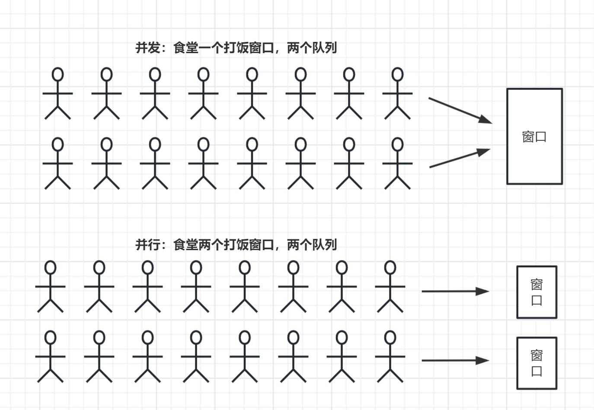

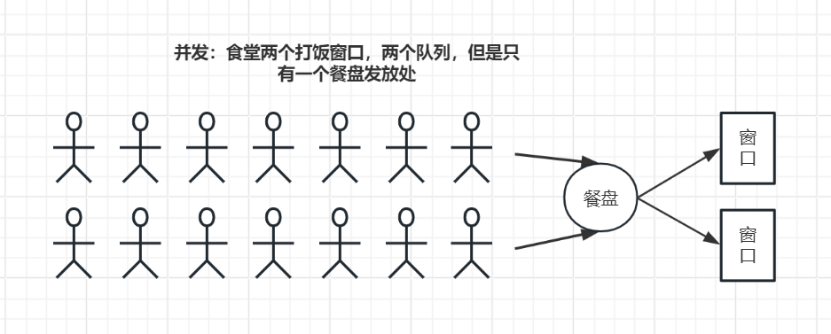

总的来说，虽然并行和并发都是多任务处理的方式，但是并行是采用多核处理器等硬件实现任务同步执行，而并发则是通过操作系统的调度算法来合理地分配系统资源，使得多个任务看上去同时执行。

# 2.说说什么是进程和线程?
进程和线程是操作系统中的概念，用于描述程序运行时的执行实体。

**进程：**一个程序在执行过程中的一个实例，每个进程都有自己独立的地址空间，也就是说它们不能直接共享内存。进程的特点包括：

+ 需要占用独立的内存空间；
+ 可以并发地执行多个任务；
+ 进程之间需要通过进程间通信（IPC）来交换数据；

**线程：**进程中的一个执行单元，一个进程中可以包含多个线程，这些线程共享进程的内存空间。线程的特点包括：

+ 线程共享进程内存空间，可以方便、高效地访问变量；
+ 同一个进程中的多个线程可以并发地执行多个任务；
+ 线程之间切换开销小，可以实现更细粒度的控制，例如 UI 线程控制界面刷新，工作线程进行耗时的计算等。

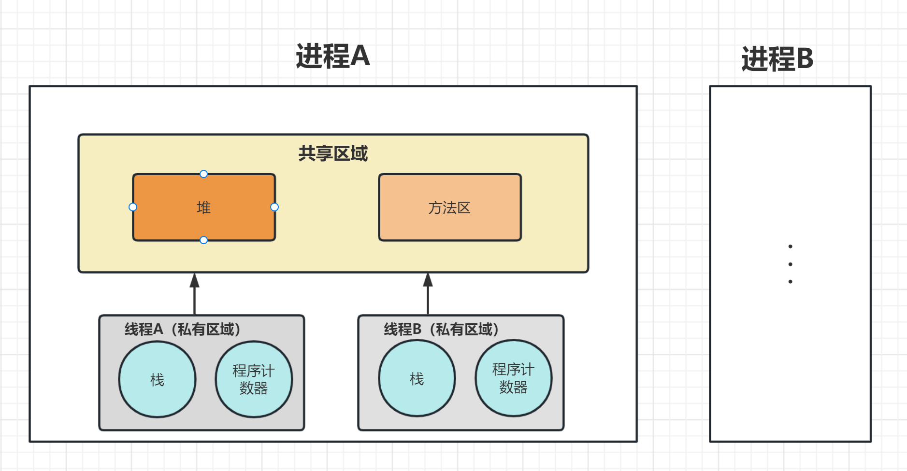

线程相比于进程，线程的创建和销毁开销较小，上下文切换开销也较小，因此线程是实现多任务并发的一种更加轻量级的方式。

# <font style="color:rgb(74, 74, 74);">3.</font>说说线程有几种创建方式？
Java中创建线程主要有三种方式：

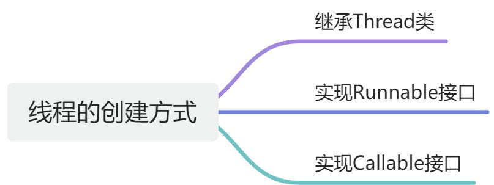

+ <font style="color:rgb(66, 66, 66);background-color:rgb(250, 250, 250);">定义Thread类的子类，并重写该类的run方法</font>

```java
/**
 * 继承Thread-重写run方法
 * Created by BaiLi
 */
public class BaiLiThread {
    public static void main(String[] args) {
        MyThread myThread = new MyThread();
        myThread.run();
    }
}
class MyThread extends Thread {
    @Override
    public void run() {
        System.out.println("一键三连");
    }
}
```

+ <font style="color:rgb(66, 66, 66);background-color:rgb(250, 250, 250);">定义Runnable接口的实现类，并重写该接口的run()方法</font>

```java
/**
 * 实现Runnable-重写run()方法
 * Created by BaiLi
 */
public class BaiLiRunnable {
    public static void main(String[] args) {
        MyRunnable myRunnable = new MyRunnable();
        new Thread(myRunnable).start();
    }
}
class MyRunnable implements Runnable {

    @Override
    public void run() {
        System.out.println("一键三连");
    }
}
```

+ <font style="color:rgb(66, 66, 66);background-color:rgb(250, 250, 250);">定义Callable接口的实现类，并重写该接口的call()方法，一般配合FutureTask使用</font>

```java
/**
 * 实现Callable-重写call()方法
 * Created by BaiLi
 */
public class BaiLiCallable {
    public static void main(String[] args) throws ExecutionException, InterruptedException {
        FutureTask<String> ft = new FutureTask<String>(new MyCallable());
        Thread thread = new Thread(ft);
        thread.start();
        System.out.println(ft.get());
    }
}
class MyCallable implements Callable<String> {

    @Override
    public String call() throws Exception {
        return "一键三连";
    }
}
```

# 4.为什么调用start()方法时会执行run()方法，那怎么不直接调用run()方法？
<font style="color:rgb(74, 74, 74);">JVM执行start方法，会先创建一个线程，由创建出来的新线程去执行thread的run方法，这才起到多线程的效果。</font>

<font style="color:rgb(66, 66, 66);background-color:rgb(250, 250, 250);">start()和run()的主要区别如下：</font>

+ <font style="color:rgb(66, 66, 66);background-color:rgb(250, 250, 250);">start方法可以启动一个新线程，run方法只是类的一个普通方法而已，如果直接调用run方法，程序中依然只有主线程这一个线程。</font>
+ <font style="color:rgb(66, 66, 66);background-color:rgb(250, 250, 250);">start方法实现了多线程，而run方法没有实现多线程。</font>
+ <font style="color:rgb(66, 66, 66);background-color:rgb(250, 250, 250);">start不能被重复调用，而run方法可以。</font>
+ <font style="color:rgb(66, 66, 66);background-color:rgb(250, 250, 250);">start方法中的run代码可以不执行完，就继续执行下面的代码，也就是说进行了</font>**<font style="color:rgb(66, 66, 66);background-color:rgb(250, 250, 250);">线程切换</font>**<font style="color:rgb(66, 66, 66);background-color:rgb(250, 250, 250);">。然而，如果直接调用run方法，就必须等待其代码全部执行完才能继续执行下面的代码。</font>
+ 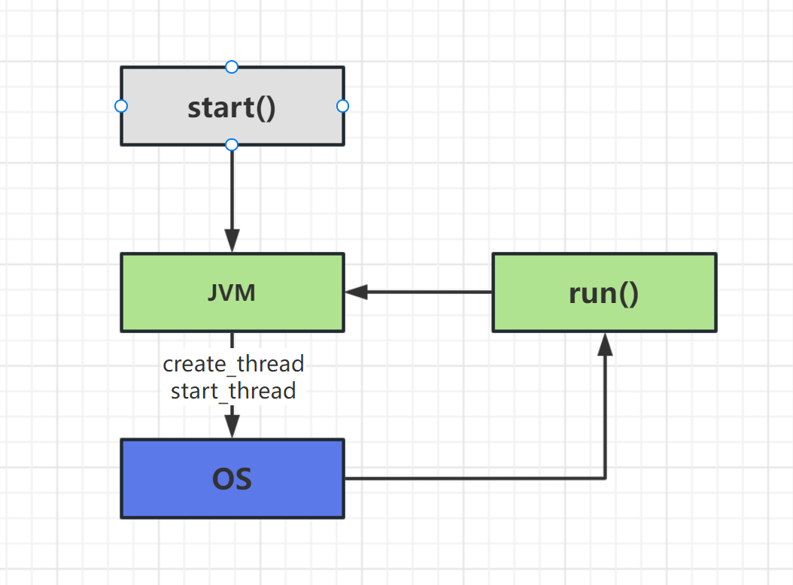

```java
/**
 * Created by BaiLi
 */
public class BaiLiDemo {
    public static void main(String[] args) {
        Thread thread = new Thread(() -> System.out.println(Thread.currentThread().getName()+":一键三连"));
        thread.start();
        thread.run();
        thread.run();
        System.out.println(Thread.currentThread().getName()+":一键三连 + 分享");
    }
}
```

# 5.线程有哪些常用的调度方法
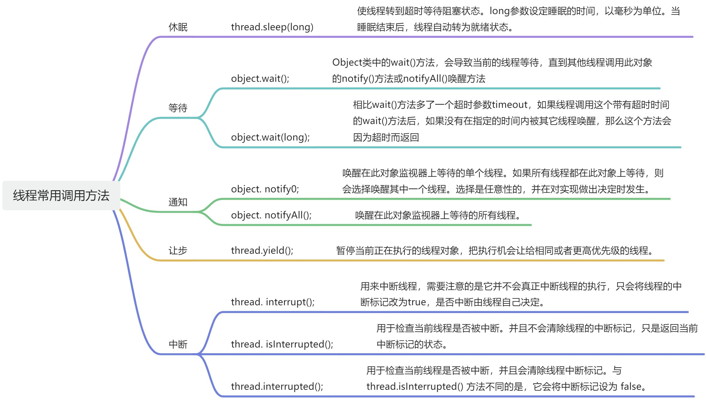

```java
import java.time.LocalTime;

/**
 * Created by BaiLi
 */
public class WaitDemo {
    public static void main(String[] args) throws InterruptedException {
        Object lock = new Object();
        Thread thread1 = new Thread(() -> {
            try {
                synchronized (lock) {
                    System.out.println("线程进入永久等待"+ LocalTime.now());
                    lock.wait();
                    System.out.println("线程永久等待唤醒"+ LocalTime.now());
                }
            } catch (InterruptedException e) {
                e.printStackTrace();
            }
        }, "Thread-1");

        Thread thread2 = new Thread(() -> {
            try {
                synchronized (lock) {
                    System.out.println("线程进入超时等待"+ LocalTime.now());
                    lock.wait(5000);
                    System.out.println("线程超时等待唤醒"+ LocalTime.now());
                }
            } catch (InterruptedException e) {
                e.printStackTrace();
            }
        }, "Thread-2");

        thread1.start();
        thread2.start();
        Thread.sleep(1000);
        synchronized (lock) {
            lock.notifyAll();
        }
        thread1.join();
        thread2.join();
    }
}
```

```java
public class YieldDemo extends Thread {
    public void run() {
        for (int i = 0; i < 5; i++) {
            System.out.println(Thread.currentThread().getName() + " is running");
            Thread.yield(); // 调用 yield 方法，让出 CPU 执行时间
        }
    }

    public static void main(String[] args) {
        YieldDemo demo = new YieldDemo();

        Thread t1 = new Thread(demo);
        Thread t2 = new Thread(demo);

        t1.start();
        t2.start();
    }
}
```

```java
/**
 * Created by BaiLi
 */
public class InterruptedDemo extends Thread {
    @Override
    public void run() {
        System.out.println(Thread.currentThread().getName()+":当前线程中断状态_"+isInterrupted());
        if(isInterrupted()){
            if(!interrupted()){
                System.out.println(Thread.currentThread().getName()+":当前线程中断状态_"+isInterrupted());
            }
        }
    }

    public static void main(String[] args) {
        InterruptedDemo interruptedDemo = new InterruptedDemo();
        interruptedDemo.start();

        interruptedDemo.interrupt();
        System.out.println(Thread.currentThread().getName()+":当前线程中断状态_"+Thread.interrupted());
    }
}

```

# 6.线程有几种状态？
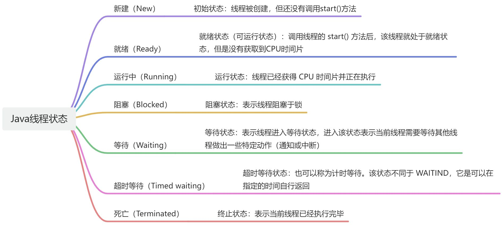

<font style="color:rgb(74, 74, 74);">线程在自身的生命周期中， 并不是固定地处于某个状态，而是随着代码的执行在不同的状态之间进行切换，如下图：</font>


# 7.什么是线程上下文切换？
线程上下文切换指的是在多线程运行时，操作系统从当前正在执行的线程中保存其上下文（包括当前线程的寄存器、程序指针、栈指针等状态信息），并将这些信息恢复到另一个等待执行的线程中，从而实现线程之间的切换。

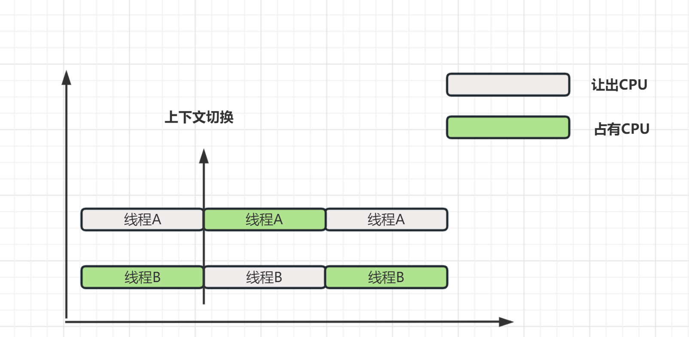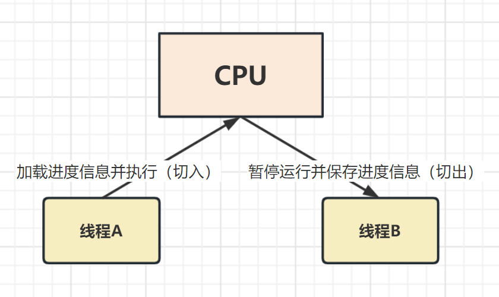

# 8.线程间有哪些通信方式？
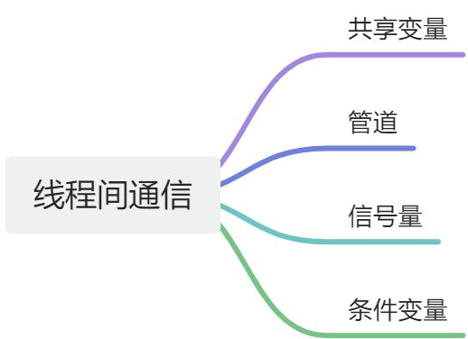

线程间通信是指在多线程编程中，各个线程之间共享信息或者协同完成某一任务的过程。常用的线程间通信方式有以下几种：

+ **共享变量：**共享变量是指多个线程都可以访问和修改的变量，它们通常是在主线程中创建的。多个线程对同一个共享变量进行读写操作时，可能会出现竞态条件导致数据错误或程序异常。因此需要使用同步机制比如synchronized、Lock等来保证线程安全
+ **管道通信：**管道是一种基于文件描述符的通信机制，形成一个单向通信的数据流管道。它通常用于只有两个进程或线程之间的通信。其中一个进程将数据写入到管道（管道的输出端口），而另一个进程从管道的输入端口读取数据
+ **信号量：**信号量是一种计数器，用于控制多个线程对资源的访问。当一个线程需要访问资源时，它需要申请获取信号量，如果信号量的计数器值大于 0，则可以访问资源，否则该线程就会等待。当线程结束访问资源后，需要释放信号量，并将计数器加1
+ **条件变量：**条件变量是一种通知机制，用于在多个线程之间传递状态信息和控制信息。当某个线程需要等待某个条件变量发生改变时，它可以调用 wait() 方法挂起，并且释放所占用的锁。当某个线程满足条件后，可以调用 notify() 或者 signal() 方法来通知等待该条件变量的线程继续执行

```java
/**
 * 共享变量
 * 创建人：百里
 */
public class BaiLiSharedMemoryDemo {
    public static void main(String[] args) {
        ArrayList<Integer> integers = new ArrayList<>();
        Thread producerThread = new Thread(() -> {
            for (int i = 0; i < 5; i++) {
                synchronized (integers) {
                    integers.add(i);
                    System.out.println(Thread.currentThread().getName() + "_Producer:" + i);
                }
                try {
                    Thread.sleep(2000);
                } catch (InterruptedException e) {
                    e.printStackTrace();
                }
            }
        }, "ProducerThread");

        Thread consumeThread = new Thread(() -> {
            while (true) {
                synchronized (integers) {
                    if (!integers.isEmpty()) {
                        Integer integer = integers.remove(0);
                        System.out.println(Thread.currentThread().getName() + "_Consume:" + integer);
                    }
                }
                try {
                    Thread.sleep(1000);
                } catch (InterruptedException e) {
                    e.printStackTrace();
                }
            }
        }, "ConsumeThread");
        producerThread.start();
        consumeThread.start();
    }
}
```

```java
/**
 * 管道通信模式
 * 创建人：百里
 */
public class BaiLiPipedStreamDemo {
    public static void main(String[] args) throws IOException {
        //输出管道
        PipedOutputStream pipedOutputStream = new PipedOutputStream();
        //输入管道
        PipedInputStream pipedInputStream = new PipedInputStream();

        pipedInputStream.connect(pipedOutputStream);

        Thread producerThread = new Thread(() -> {
            try {
                for (int i = 0; i < 5; i++) {
                    pipedOutputStream.write(i);
                    System.out.println(Thread.currentThread().getName() + "_Produce: " + i);
                    Thread.sleep(2000);
                }
                pipedOutputStream.close();
            } catch (IOException | InterruptedException e) {
                e.printStackTrace();
            }
        }, "ProducerThread");

        Thread consumeThread = new Thread(() -> {
            try {
                for (int i = 0; i < 5; i++) {
                    while (true) {
                        int read = pipedInputStream.read();
                        if (read != -1) {
                            System.out.println(Thread.currentThread().getName() + "_Consume: " + read);
                        } else {
                            break;
                        }
                        Thread.sleep(1000);
                    }
                }
                pipedInputStream.close();
            } catch (IOException | InterruptedException e) {
                e.printStackTrace();
            }
        }, "ConsumeThread");

        producerThread.start();
        consumeThread.start();
    }
}

```

```java
/**
 * 信号量
 * 创建人：百里
 */
public class BaiLiSemaphoreDemo {
    public static void main(String[] args) {
        // 实例化一个信号量对象，初始值为 0
        Semaphore semaphore = new Semaphore(0);

        // 创建生产者线程
        Thread producerThread = new Thread(() -> {
            try {
                for (int i = 0; i < 5; i++) {
                    System.out.println(Thread.currentThread().getName() + "_Producer:" + i);
                    semaphore.release(); // 把信号量的计数器加 1
                    Thread.sleep(1000); //模拟停顿
                }
            } catch (InterruptedException e) {
                e.printStackTrace();
            }
        }, "ProducerThread");

        // 创建消费者线程
        Thread consumeThread = new Thread(() -> {
            try {
                for (int i = 0; i < 5; i++) {
                    semaphore.acquire(); // 请求占有信号量，如果计数器不为 0，计数器减 1，否则线程阻塞等待
                    System.out.println(Thread.currentThread().getName() + "_Consume:" + i);
                    Thread.sleep(1000); //模拟停顿
                }
            } catch (InterruptedException e) {
                e.printStackTrace();
            }
        }, "ConsumeThread");

        producerThread.start();
        consumeThread.start();
    }
}
```

```java
/**
 * 条件变量|可重入锁
 * 创建人：百里
 */
public class BaiLIConditionDemo {
    public static void main(String[] args) {
        // 实例化一个可重入锁对象
        ReentrantLock lock = new ReentrantLock();
        // 获取该锁对象的条件变量
        Condition condition = lock.newCondition();

        // 创建生产者线程
        Thread producerThread = new Thread(() -> {
            try {
                lock.lock(); // 获取锁对象
                for (int i = 1; i <= 5; i++) {
                    System.out.println(Thread.currentThread().getName() + " produce: " + i);
                    condition.signal(); // 唤醒处于等待状态下的消费者线程
                    condition.await(); // 使当前线程处于等待状态，并释放锁对象
                    Thread.sleep(1000);
                }
                condition.signal(); // 避免消费者线程一直等待
            } catch (InterruptedException e) {
                e.printStackTrace();
            } finally {
                lock.unlock(); // 释放锁对象
            }
        }, "producer");

        // 创建消费者线程
        Thread consumerThread = new Thread(() -> {
            try {
                lock.lock(); // 获取锁对象
                for (int i = 1; i <= 5; i++) {
                    System.out.println(Thread.currentThread().getName() + " consume: " + i);
                    condition.signal(); // 唤醒处于等待状态下的生产者线程
                    condition.await(); // 使当前线程处于等待状态，并释放锁对象
                    Thread.sleep(1000);
                }
            } catch (InterruptedException e) {
                e.printStackTrace();
            } finally {
                lock.unlock(); // 释放锁对象
            }
        }, "consumer");

        // 启动生产者和消费者线程
        producerThread.start();
        consumerThread.start();
    }
}
```

# 9.ThreadLocal是什么？
ThreadLocal也就是线程本地变量。如果你创建了一个ThreadLocal变量，那么访问这个变量的每个线程都会有这个变量的一个本地拷贝，多个线程操作这个变量的时候，实际是操作自己本地内存里面的变量，从而起到线程隔离的作用，避免了线程安全问题。

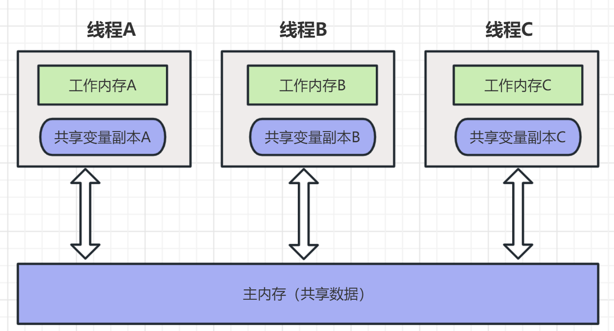

ThreadLocal是整个线程的全局变量，不是整个程序的全局变量。

```java
/**
 * ThreadLocal
 * 创建人：百里
 */
public class BaiLiThreadLocalDemo {
    //创建一个静态的threadLocal变量，被所有线程共享
    static ThreadLocal<Integer> threadLocal = new ThreadLocal<>();

    public static void main(String[] args) throws InterruptedException {
        Thread thread1 = new Thread(() -> {
            System.out.println(threadLocal.get());
            threadLocal.set(0);
            System.out.println(threadLocal.get());
        },"Thread-1");

        Thread thread2 = new Thread(() -> {
            System.out.println(threadLocal.get());
            threadLocal.set(1);
            System.out.println(threadLocal.get());
        },"Thread-2");

        thread1.start();
        thread1.join();
        thread2.start();
        thread2.join();
    }
}
```

# 10.ThreadLocal怎么实现？
+ ThreadLocal是Java中所提供的线程本地存储机制，可以利用该机制将数据<font style="color:#000000;">缓存在某个线程内部</font>，该线程可以在任意时刻、任意方法中获取缓存的数据
+ ThreadLocal底层是通过ThreadLocalMap来实现的，每个Thread对象（注意不是ThreadLocal对象）中都存在一个ThreadLocalMap，Map的key为ThreadLocal对象，Map的value为需要缓存的值


实现方式观察ThreadLocal的set方法：

```java
public void set(T value) {
    Thread t = Thread.currentThread();
    ThreadLocalMap map = getMap(t);
    if (map != null)
        map.set(this, value);
    else
        createMap(t, value);
}

ThreadLocalMap getMap(Thread t) {
    return t.threadLocals;
}

ThreadLocal.ThreadLocalMap threadLocals = null;

static class Entry extends WeakReference<ThreadLocal<?>> {
    Object value;

    Entry(ThreadLocal<?> k, Object v) {
        super(k);
        value = v;
    }
}
```

# 11.ThreadLocal内存泄露是怎么回事?
如果在线程池中使用ThreadLocal会造成内存泄漏，因为当ThreadLocal对象使用完之后，应该要把设置的key，value，也就是Entry对象进行回收，但线程池中的线程不会回收，而线程对象是通过强引用指向ThreadLocalMap，ThreadLocalMap也是通过强引用指向Entry对象，线程不被回收，Entry对象也就不会被回收，从而出现内存泄漏。

解决办法是在使用了ThreadLocal对象之后，手动调用ThreadLocal的remove方法，手动清除Entry对象。

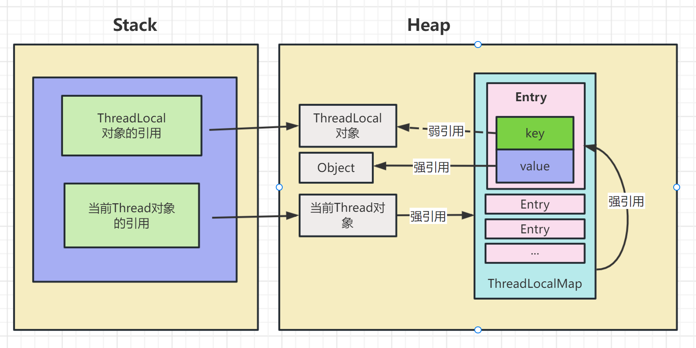

```java
package communication;

import java.util.concurrent.ExecutorService;
import java.util.concurrent.Executors;
import java.util.concurrent.TimeUnit;

/**
 * 创建人：百里
 */
public class BaiLiThreadLocalMemoryLeakDemo {
    private static final ThreadLocal<byte[]> threadLocal = new ThreadLocal<byte[]>();

    public static void main(String[] args) throws Exception {
        ExecutorService executorService = Executors.newFixedThreadPool(5);
        for (int i = 0; i < 100; i++) {
            executorService.execute(() -> {
                byte[] data = new byte[50240 * 10240];
                threadLocal.set(data);
                // 不调用 remove 方法，会导致内存泄漏
                //threadLocal.remove();
            });
        }
        executorService.shutdown();
        executorService.awaitTermination(1, TimeUnit.MINUTES);
    }
}
```

# 12.ThreadLocalMap的结构
<font style="color:rgb(74, 74, 74);">ThreadLocalMap虽然被称为Map，但是其实它是没有实现Map接口的，不过结构还是和HashMap比较类似的，</font>主要关注的是两个要素<font style="color:rgb(74, 74, 74);">：</font>**元素数组和散列方法**<font style="color:rgb(74, 74, 74);">。</font>

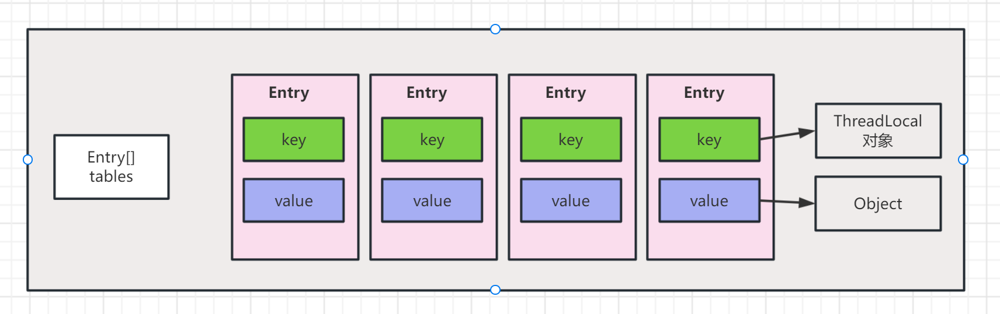

+ **<font style="color:rgb(74, 74, 74);">元素数组</font>**一个table数组，存储Entry类型的元素，Entry是ThreadLocal弱引用作为key，Object作为value的结构。

```java
private Entry[] table;
```

+ **散列方法**就是怎么把对应的key映射到table数组的相应下标，ThreadLocalMap用的是哈希取余法，取出key的threadLocalHashCode，然后和table数组长度减一&运算（相当于取余）

```java
int i = key.threadLocalHashCode & (table.length - 1);
```

补充一点每创建一个ThreadLocal对象，它就会新增0x61c88647，这个值很特殊，它是斐波那契数也叫黄金分割数。这样带来的好处就是**hash****<font style="color:rgb(74, 74, 74);">分布非常均匀</font>**<font style="color:rgb(74, 74, 74);">。</font>

```java
private static final int HASH_INCREMENT = 0x61c88647;

private static int nextHashCode() {
    return nextHashCode.getAndAdd(HASH_INCREMENT);
}
```

# 13.ThreadLocalMap怎么解决Hash冲突的？
我们可能都知道HashMap使用了链表来解决冲突，也就是所谓的链地址法。

ThreadLocalMap内部使用的是开放地址法来解决 Hash冲突的问题。具体来说，当发生Hash冲突时，ThreadLocalMap会将**当前插入的元素从冲突位置开始依次往后遍历，直到找到一个空闲的位置，然后把该元素放在这个空闲位置**。这样即使出现了Hash冲突，不会影响到已经插入的元素，而只是会影响到新的插入操作。


查找的时候，先根据ThreadLocal对象的hash值找到对应的位置，然后比较该槽位Entry对象中的key是否和get的key一致，如果不一致就依次往后查找。

# 14.ThreadLocalMap扩容机制
<font style="color:rgb(36, 41, 47);background-color:rgb(244, 246, 248);">T</font>hreadLocalMap 的扩容机制和 HashMap 类似，也是在元素数量达到阈值（默认为数组长度的 2/3）时进行扩容。具体来说，在 set() 方法中，如果当前元素数量已经达到了阈值，就会调用 rehash() 方法，rehash()会先去清理过期的Entry，然后还要根据条件判断size >= threshold - threshold / 4 也就是size >= threshold * 3/4来决定是否需要扩容：

```java
private void rehash() {
    //清理过期Entry
    expungeStaleEntries();

    //扩容
    if (size >= threshold - threshold / 4)
        resize();
}

//清理过期Entry
private void expungeStaleEntries() {
    Entry[] tab = table;
    int len = tab.length;
    for (int j = 0; j < len; j++) {
        Entry e = tab[j];
        if (e != null && e.get() == null)
            expungeStaleEntry(j);
    }
}
```

发现需要扩容时调用resize()方法，resize()方法首先将数组长度翻倍，然后创建一个新的数组newTab。接着遍历旧数组oldTab中的所有元素，散列方法重新计算位置，开放地址解决冲突，然后放到新的newTab，遍历完成之后，oldTab中所有的entry数据都已经放入到newTab中了，然后table引用指向newTab.

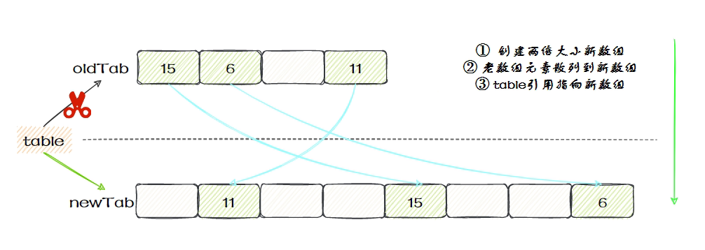

需要注意的是，新数组的长度始终是2的整数次幂，并且扩容后新数组的长度始终大于旧数组的长度。这是为了保证哈希函数计算出的位置在新数组中仍然有效。

```java
private void resize() {
    Entry[] oldTab = table;
    int oldLen = oldTab.length;
    int newLen = oldLen * 2;
    Entry[] newTab = new Entry[newLen];
    int count = 0;
    for (int j = 0; j < oldLen; ++j) {
        Entry e = oldTab[j];
        if (e != null) {
            ThreadLocal<?> k = e.get();
            if (k == null) {
                e.value = null; // Help the GC
            } else {
                int h = k.threadLocalHashCode & (newLen - 1);
                while (newTab[h] != null)
                    h = nextIndex(h, newLen);
                newTab[h] = e;
                count++;
            }
        }
    }

    setThreshold(newLen);
    size = count;
    table = newTab;
}
```

# 15.ThreadLocal怎么进行父子线程通信
在Java多线程编程中，父子线程之间的数据传递和共享问题一直是一个非常重要的议题。如果不处理好数据的传递和共享，会导致多线程程序的性能下降或者出现线程安全问题。ThreadLocal是Java提供的一种解决方案，可以非常好地解决父子线程数据共享和传递的问题。

那么它是如何实现通信的了？在Thread类中存在InheritableThreadLocal变量，简单的说就是使用InheritableThreadLocal来进行传递，当父线程的InheritableThreadLocal不为空时，就会将这个值传到当前子线程的InheritableThreadLocal。

```java
/**
 * ThreadLocal父子线程通信
 * 创建人：百里
 */
public class BaiLiInheritableThreadLocalDemo {
    public static void main(String[] args) throws Exception {
        ThreadLocal threadLocal = new ThreadLocal<>();
        threadLocal.set("threadLocal");

        ThreadLocal inheritableThreadLocal = new InheritableThreadLocal();
        inheritableThreadLocal.set("分享 + inheritableThreadLocal");

        Thread t = new Thread(() -> {
            System.out.println("一键三连 + " + threadLocal.get());
            System.out.println("一键三连 + " + inheritableThreadLocal.get());
        });
        t.start();
    }
}
```

# 16.说一下你对Java内存模型（JMM）的理解？
Java 内存模型（Java Memory Model）是一种规范，用于描述 Java 虚拟机（JVM）中多线程情况下，线程之间如何协同工作，如何共享数据，并保证多线程的操作在各个线程之间的可见性、有序性和原子性。

具体定义如下：

+ 所有的变量都存储在主内存（Main Memory）中。
+ 每个线程都有一个私有的本地内存（Local Memory），本地内存中存储了该线程以读/写共享变量的拷贝副本。
+ 线程对变量的所有操作都必须在本地内存中进行，而不能直接读写主内存。
+ 不同的线程之间无法直接访问对方本地内存中的变量；线程间共享变量时，通过主内存来实现通信、协作和传递信息。

Java内存模型的抽象图：

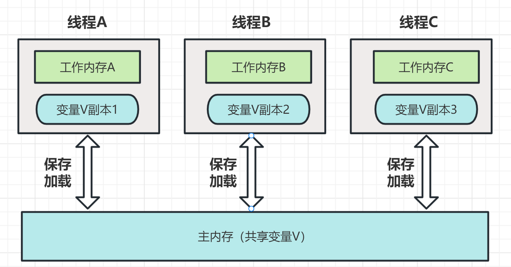

在这个抽象的内存模型中，在两个线程之间的通信（共享变量状态变更）时，会进行如下两个步骤：

+ 线程A把在本地内存更新后的共享变量副本的值，刷新到主内存中。
+ 线程B在使用到该共享变量时，到主内存中去读取线程A更新后的共享变量的值，并更新线程B本地内存的值。

# 17.说说你对原子性、可见性、有序性的理解？
原子性、有序性、可见性是并发编程中非常重要的基础概念，JMM的很多技术都是围绕着这三大特性展开。

+ **原子性**：指一个操作是不可分割、不可中断的，在执行过程中不会受到其他线程的干扰，要么全部执行，要么就全不执行。即使是在多线程的环境下，一个操作也是原子性的执行完成。

线程切换会带来原子性问题，示例：

```java
int count = 0; //1
count++;       //2
int a = count; //3
```

上面展示语句中，除了语句1是原子操作，其它两个语句都不是原子性操作，下面我们来分析一下语句2

其实语句2在执行的时候，包含三个指令操作

+ 指令 1：首先，把变量 count 从内存加载到 CPU 的寄存器
+ 指令 2：然后，在寄存器中执行 +1 操作
+ 指令 3：最终，将结果写入内存

对于上面的三条指令来说，如果线程 A 在指令 1 执行完后做线程切换，线程 A 和线程 B 按照下图的序列执行，那么我们会发现两个线程都执行了 count+=1 的操作，但是得到的结果不是我们期望的 2，而是 1。

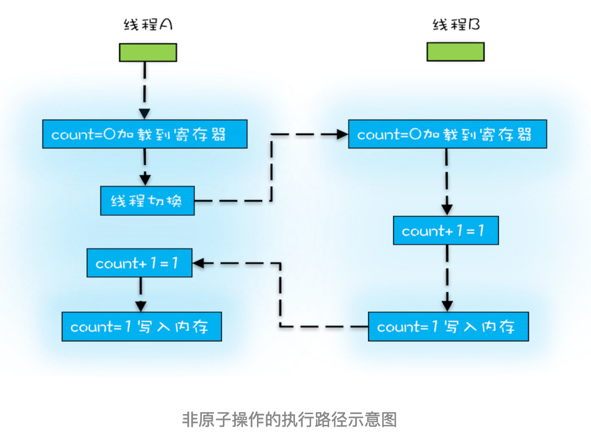

+ **可见性**：指一个线程对共享变量的修改，对于其他线程应该是立即可见的，确保了各个线程之间对内存状态的正确观察。
+ **有序性**：指程序执行的顺序按照代码的顺序执行。在单线程的情况下，代码执行顺序与编写的顺序一致。但在多线程环境中，由于时间片轮换，不同的线程可能会交替执行不同的代码。

原子性、可见性、有序性都应该怎么保证呢？

+ 原子性：JMM只能保证基本的原子性，如果要保证一个代码块的原子性，需要使用synchronized。
+ 可见性：Java是利用volatile关键字来保证可见性的，除此之外，final和synchronized也能保证可见性。
+ 有序性：synchronized或者volatile都可以保证多线程之间操作的有序性。

# 18.说说什么是指令重排？
在不影响**单线程**程序执行结果的前提下，计算机为了最大限度的发挥机器性能，对机器指令进行重排序优化。

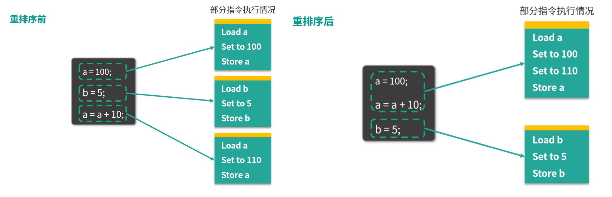

从Java源代码到最终实际执行的指令序列，会分别经历下面3种重排序：

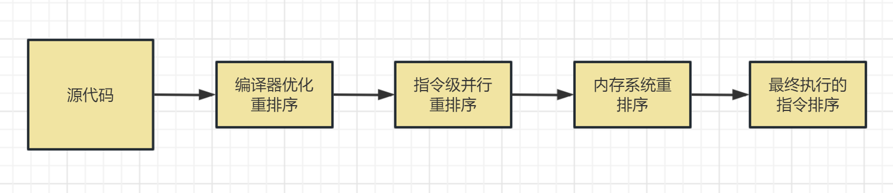

+ 编译器重排序：编译器在不改变单线程程序语义的前提下重新安排语句的执行顺序。例如把变量缓存到寄存器中、提取公共子表达式等。
+ 指令级重排序：如果不存在数据依赖性，处理器可以改变语句对应机器指令的执行顺序。例如乱序执行的 Load 和 Store 指令、分支预测以及指令突发等。
+ 内存系统重排序：由于数据读写过程中涉及到多个缓冲区，这使得加载和存储的操作看上去可能是乱序执行，于是需要内存系统的重排序。例如写入缓存中的操作顺序，对于其他CPU的 Cache 来说是不可见的。

以双重校验锁单例模式为例子，Singleton instance=new Singleton()；对应的JVM指令分为三步：分配内存空间-->初始化对象--->对象指向分配的内存空间，但是经过了编译器的指令重排序，第二步和第三步就可能会重排序。  
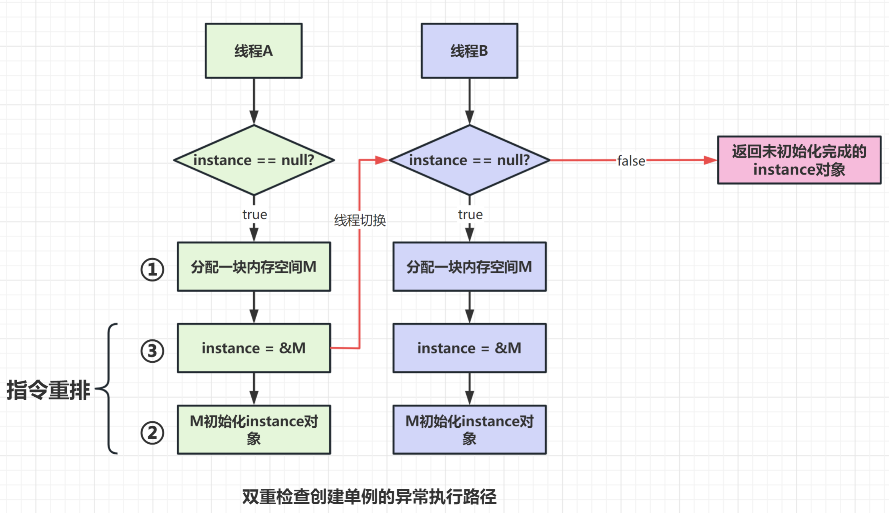

JMM属于语言级的内存模型，它确保在不同的编译器和不同的处理器平台之上，通过禁止特定类型的编译器重排序和指令级重排序，为程序员提供一致的内存可见性保证。

# 19.指令重排有限制吗？happens-before了解吗？
指令重排也是有一些限制的，有两个规则happens-before和as-if-serial来约束。

**<font style="color:#DF2A3F;">happens-before的定义</font>**：

+ 如果一个操作happens-before另一个操作，那么**第一个操作的执行结果将对第二个操作可见**，而且第一个操作的执行顺序排在第二个操作之前。
+ 两个操作之间存在happens-before关系，并不意味着Java平台的具体实现必须要按照 happens-before关系指定的顺序来执行。**只要没有改变程序的执行结果，编译器和处理器怎么优化都可以**。

**<font style="color:#DF2A3F;">happens-before的六大规则</font>**：

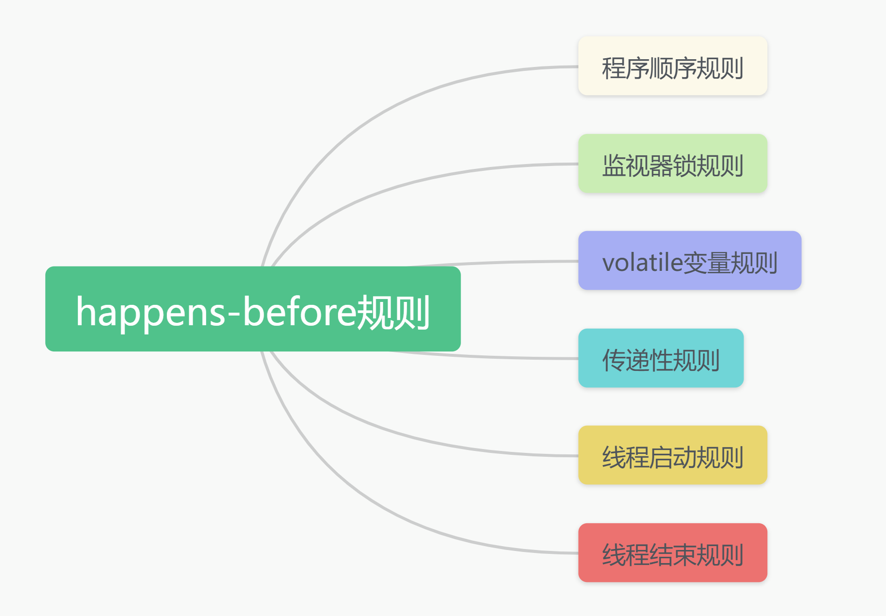

+ **程序顺序规则**：一个线程中的每个操作，happens-before于该线程中的任意后续操作。

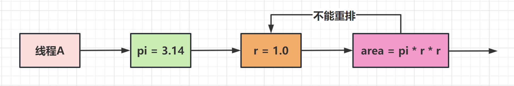

```java
/**
 * 顺序性规则
 * 顺序执行是针对代码逻辑而言的，在实际执行的时候发生指令重排序但是并没有改变源代码的逻辑。
 * @author 百里
 */
public class BaiLiHappenBeforeDemo {
    public static void main(String[] args) {
        double pi = 3.14; // A
        double r = 1.0; // B
        double area = pi * r * r; // C
        System.out.println(area);
    }
}
```

+ **监视器锁规则**：一个unlock操作之前对某个锁的lock操作必须发生在该unlock操作之前

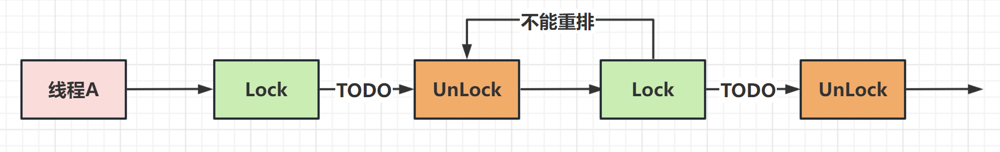

```java
import java.util.concurrent.locks.ReentrantLock;

/**
 * 重排锁的话，会导致逻辑改变。
 * @author 百里
 */
public class BaiLiHappenBeforeLockDemo {
    public static void main(String[] args) {
        ReentrantLock reentrantLock = new ReentrantLock();
        reentrantLock.lock();
        // TODO 
        reentrantLock.unlock();
        
        reentrantLock.lock();
        // TODO
        reentrantLock.unlock();
    }
}
```

+ **volatile变量规则**：对一个volatile变量的写操作必须发生在该变量的读操作之前。
+ **传递性规则**：如果A happens-before B，且B happens-before C，那么A happens-before C。

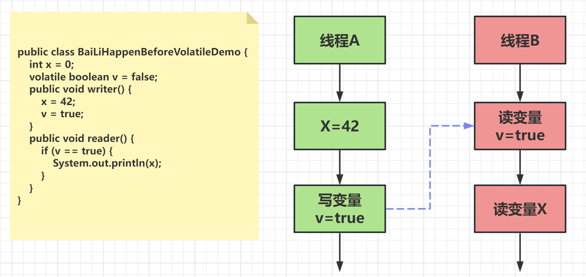

从图中，我们可以看到：

+ “x=42”Happens-Before 写变量“v=true”，这是规则1的内容；
+ 写变量“v=true”Happens-Before 读变量“v=true”，这是规则3的内容；
+ 再根据这个传递性规则，我们得到结果：“x=42”Happens-Before 读变量“v=true”；

这意味着什么呢？如果线程 B 读到了“v=true”，那么线程A设置的“x=42”对线程B是可见的。也就是说，线程B能看到“x == 42“。

```java
/**
 * 传递性规则
 * @author 百里
 */
public class BaiLiHappenBeforeVolatileDemo {
    int x = 0;
    volatile boolean v = false;
    public void writer() {
        x = 42;
        v = true;
    }
    public void reader() {
        if (v == true) {
            System.out.println(x);
        }
    }
}
```

+ **线程启动规则**：如果线程A执行操作ThreadB.start()（启动线程B），那么A线程的ThreadB.start()操作happens-before于线程B中的任意操作。


我们可以理解为：线程A启动线程B之后，线程B能够看到线程A在启动线程B之前的操作。

+ **线程结束规则**：如果线程A执行操作ThreadB.join()并成功返回，那么线程B中的任意操作 happens-before于 ThreadB.join()操作成功返回后的线程A操作。

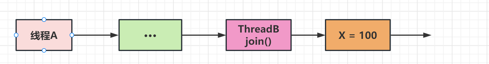

**在Java语言里面，Happens-Before的语义本质上是一种可见性，A Happens-Before B 意味着A事件对B事件来说是可见的，并且无论A事件和B事件是否发生在同一个线程里。**

# 20.as-if-serial又是什么？单线程的程序一定是顺序的吗？
as-if-serial是指无论如何重排序都不会影响单线程程序的执行结果。这个原则的核心思想是编译器和处理器等各个层面的优化，不能改变程序执行的意义。

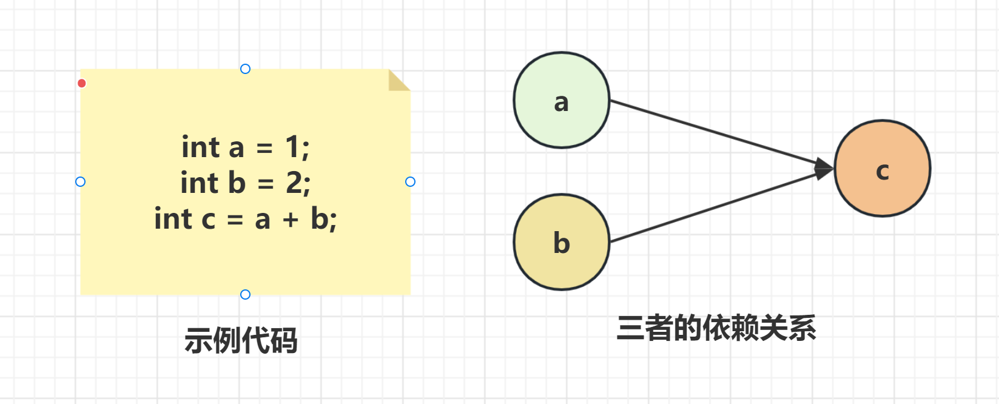

A和C之间存在数据依赖关系，同时B和C之间也存在数据依赖关系。因此在最终执行的指令序列中，C不能被重排序到A和B的前面（C排到A和B的前面，程序的结果将会被改变）。但A和B之间没有数据依赖关系，编译器和处理器可以重排序A和B之间的执行顺序。

所以最终，程序可能会有两种执行顺序：


# 21.volatile实现原理了解吗？
volatile有两个作用，保证可见性和有序性。

可见性：当一个变量被声明为 volatile 时，它会告诉编译器和CPU将该变量存储在主内存中，而不是线程的本地内存中。即每个线程读取的都是主内存中最新的值，避免了多线程并发下的数据不一致问题。

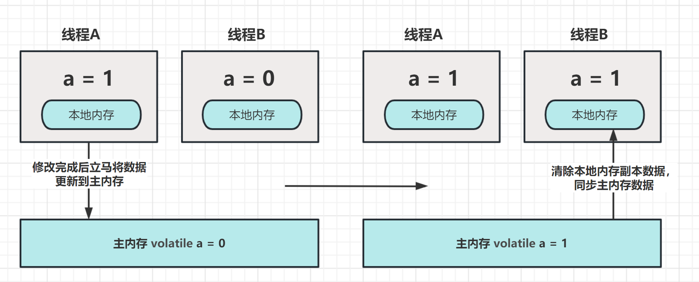

有序性：重排序可以分为编译器重排序和处理器重排序，valatile保证有序性，就是通过分别限制这两种类型的重排序。


为了实现volatile的内存语义，编译器在生成字节码时，会在指令序列中插入内存屏障来禁止特定类型的处理器重排序。

1. 在每个volatile写操作的前面插入一个StoreStore屏障
2. 在每个volatile写操作的后面插入一个StoreLoad屏障
3. 在每个volatile读操作的后面插入一个LoadLoad屏障
4. 在每个volatile读操作的后面插入一个LoadStore屏障

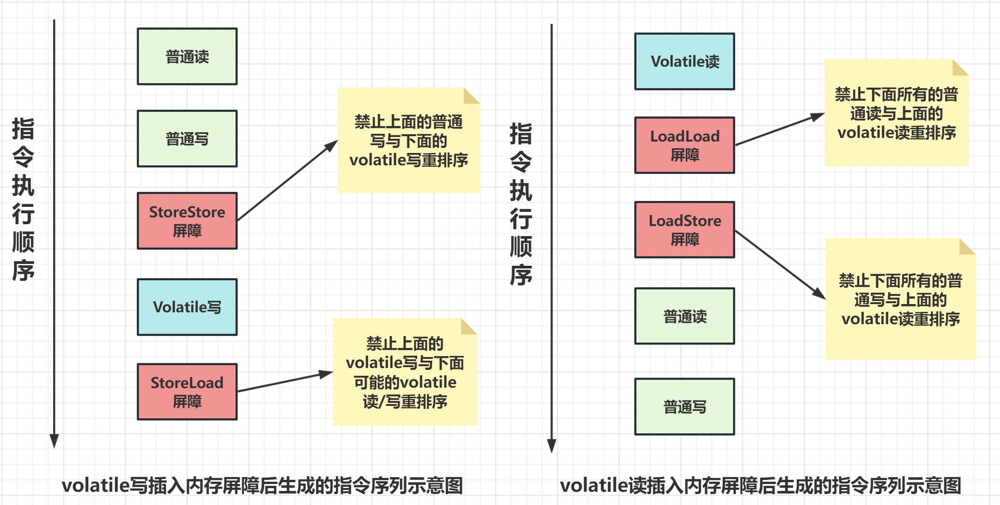

# 22.synchronized用过吗？怎么使用？
synchronized经常用的，用来保证代码的原子性。

synchronized主要有三种用法：

+ **修饰实例方法**: 作用于当前对象实例加锁，进入同步代码前要获得当前对象实例的锁。

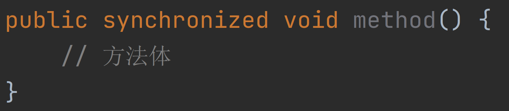

+ **修饰静态方法**：给当前类加锁，在同一时间内，只能有一个线程持有该类对应的 Class 对象的锁，其他线程需要等待锁的释放才能继续执行该静态方法。


+ **修饰代码块** ：指定一个同步锁对象，这个对象可以是具体的Object或者是类.class。在同一时间内，只能有一个线程持有该同步锁对象的锁，其他线程需要等待锁的释放才能继续执行该代码块。


**注意事项：**

+ **修饰实例方法**：不同的对象实例之间并不会互相影响，它们的锁是相互独立的。因此，如果不同的线程在不同的对象实例上执行同一个同步方法，它们之间并不会因为共享变量而产生互斥的效果。
+ **修饰静态方法**：应该尽量避免持有锁的时间过长，否则可能会导致其他线程长时间等待，从而影响系统性能。同时，也要注意避免死锁的情况。
+ **修饰代码块**：同步锁并不是对整个代码块进行加锁，而是对同步锁对象进行加锁。因此，如果在不同的代码块中使用了相同的同步锁对象，它们之间也会产生互斥的效果。而如果使用不同的同步锁对象，则它们之间并不会产生互斥的效果。

# 23.synchronized的实现原理？
我们使用synchronized的时候，发现不用自己去lock和unlock，是因为JVM帮我们把这个事情做了。

1. **synchronized修饰代码块时**，JVM采用monitorenter、monitorexit两个指令来实现同步，monitorenter 指令指向同步代码块的开始位置， monitorexit 指令则指向同步代码块的结束位置。

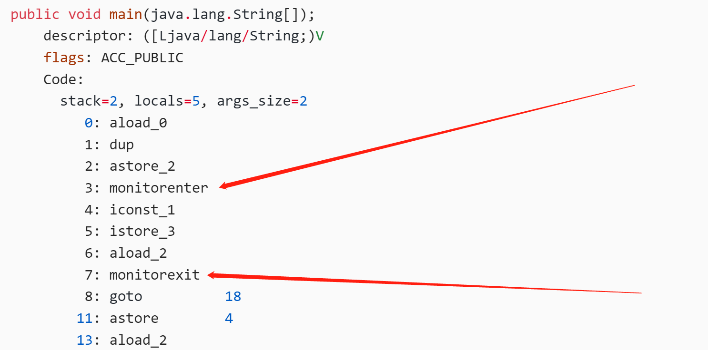

```java
/**
 * @author 百里
 */
public class BaiLiSyncDemo {
    public void main(String[] args) {
        synchronized (this) {
            int a = 1;
        }
    }
}
```

```java
public void main(java.lang.String[]);
    descriptor: ([Ljava/lang/String;)V
    flags: ACC_PUBLIC
    Code:
      stack=2, locals=5, args_size=2
         0: aload_0
         1: dup
         2: astore_2
         3: monitorenter
         4: iconst_1
         5: istore_3
         6: aload_2
         7: monitorexit
         8: goto          18
        11: astore        4
        13: aload_2
        14: monitorexit
        15: aload         4
        17: athrow
        18: return
```

2. **synchronized修饰同步方法时**，JVM采用ACC_SYNCHRONIZED标记符来实现同步，这个标识指明了该方法是一个同步方法。同样可以写段代码反编译看一下。

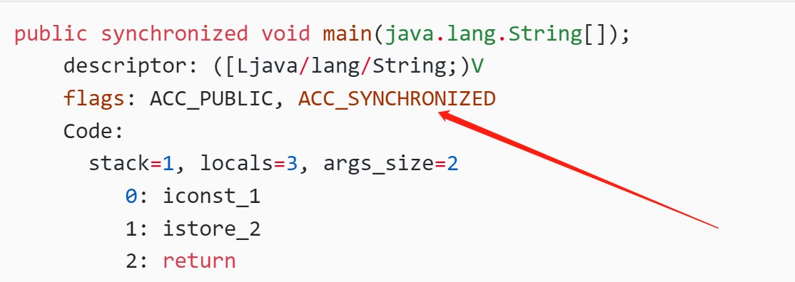

```java
/**
 * @author 百里
 */
public class BaiLiSyncDemo {
    public synchronized void main(String[] args) {
        int a = 1;
    }
}
```

**synchronized锁住的是什么呢？**

实例对象结构里有对象头，对象头里面有一块结构叫Mark Word，Mark Word指针指向了monitor。

所谓的Monitor其实是一种同步机制，我们可以称为内部锁或者Monitor锁。

monitorenter、monitorexit或者ACC_SYNCHRONIZED都是基于Monitor实现的。

**反编译class文件方法：**

反编译一段synchronized修饰代码块代码，javap -c -s -v -l ***.class，可以看到相应的字节码指令。

# 24.synchronized的可见性，有序性，可重入性是怎么实现的？
**synchronized怎么保证可见性？**

+ 线程加锁前，将清空工作内存中共享变量的值，从而使用共享变量时需要从主内存中重新读取最新的值。
+ 线程加锁后，其它线程无法获取主内存中的共享变量。
+ 线程解锁前，必须把共享变量的最新值刷新到主内存中。

**synchronized怎么保证有序性？**

synchronized同步的代码块，具有排他性，一次只能被一个线程拥有，所以synchronized保证同一时刻，代码是单线程执行的。

因为as-if-serial语义的存在，单线程的程序能保证最终结果是有序的，但是不保证不会指令重排。

所以synchronized保证的有序是执行结果的有序性，而不是防止指令重排的有序性。

**synchronized怎么实现可重入的？**

synchronized 是可重入锁，也就是说，允许一个线程二次请求自己持有对象锁的临界资源，这种情况称为可重入锁。

之所以是可重入的。是因为 synchronized 锁对象有个计数器，当一个线程请求成功后，JVM会记下持有锁的线程，并将计数器计为1。此时其他线程请求该锁，则必须等待。而该持有锁的线程如果再次请求这个锁，就可以再次拿到这个锁，同时计数器会递增。

当线程执行完毕后，计数器会递减，直到计数器为0才释放该锁。

# 25.说说synchronized和ReentrantLock的区别
可以从**锁的实现**、**性能**、**功能特点**等几个维度去回答这个问题：

+ **锁的实现**： synchronized是Java语言的关键字，基于JVM实现。而ReentrantLock是基于JDK的API层面实现的（一般是lock()和unlock()方法配合try/finally语句块来完成。）
+ **性能**： 在JDK1.6锁优化以前，synchronized的性能比ReenTrantLock差很多。但是JDK6开始，增加了适应性自旋、锁消除等，两者性能就差不多了。
+ **功能特点**： ReentrantLock 比 synchronized 多了一些高级功能，如等待可中断、可实现公平锁、可实现选择性通知。
        * ReentrantLock提供了一种能够中断等待锁的线程的机制，通过lock.lockInterruptibly()来实现这个机制
        * ReentrantLock可以指定是公平锁还是非公平锁。而synchronized只能是非公平锁。所谓的公平锁就是先等待的线程先获得锁。
        * synchronized与wait()和notify()/notifyAll()方法结合实现等待/通知机制；ReentrantLock类借助Condition接口与newCondition()方法实现。
        * ReentrantLock需要手工声明来加锁和释放锁，一般跟finally配合释放锁。而synchronized不用手动释放锁。

下面的表格列出了两种锁之间的区别：

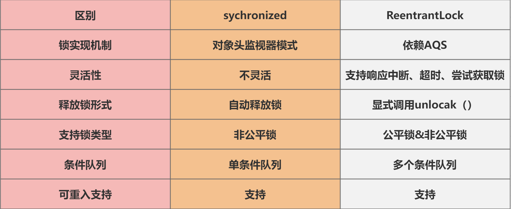

# 26.ReentrantLock实现原理？
ReentrantLock是一种可重入的排它锁，主要用来解决多线程对共享资源竞争的问题；它提供了比synchronized关键字更加灵活的锁机制。其实现原理主要涉及以下三个方面：

+ **基本结构**

ReentrantLock内部维护了一个Sync对象（AbstractQueuedSynchronizer类的子类），Sync持有锁、等待队列等状态信息，实际上 ReentrantLock的大部分功能都是由Sync来实现的。

+ **加锁过程**

当一个线程调用ReentrantLock的lock()方法时，会先尝试CAS操作获取锁，如果成功则返回；否则，线程会被放入等待队列中，等待唤醒重新尝试获取锁。

如果一个线程已经持有了锁，那么它可以重入这个锁，即继续获取该锁而不会被阻塞。ReentrantLock通过维护一个计数器来实现重入锁功能，每次重入计数器加1，每次释放锁计数器减1，当计数器为0时，锁被释放。

+ **解锁过程**

当一个线程调用ReentrantLock的unlock()方法时，会将计数器减1，如果计数器变为了0，则锁被完全释放。如果计数器还大于0，则表示有其他线程正在等待该锁，此时会唤醒等待队列中的一个线程来获取锁。

**总结**：

ReentrantLock的实现原理主要是基于CAS操作和等待队列来实现。它通过Sync对象来维护锁的状态，支持重入锁和公平锁等特性，提供了比synchronized更加灵活的锁机制，是Java并发编程中常用的同步工具之一。

# 27.ReentrantLock怎么实现公平锁的？
ReentrantLock可以通过构造函数的参数来控制锁的公平性，如果传入 true，就表示该锁是公平的；如果传入 false，就表示该锁是不公平的。

new ReentrantLock()构造函数默认创建的是非公平锁 NonfairSync


同时也可以在创建锁构造函数中传入具体参数创建公平锁 FairSync

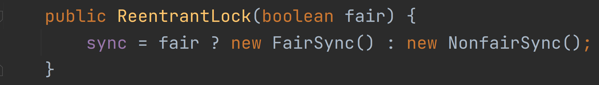

FairSync、NonfairSync 代表公平锁和非公平锁，两者都是 ReentrantLock 静态内部类，只不过实现不同锁语义。

非公平锁和公平锁的区别：

+ 非公平锁在调用 lock 后，首先就会调用 CAS 进行一次抢锁，如果这个时候恰巧锁没有被占用，那么直接就获取到锁返回了。
+ 非公平锁在 CAS 失败后，和公平锁一样都会进入到 tryAcquire 方法，在 tryAcquire 方法中，如果发现锁这个时候被释放了（state == 0），非公平锁会直接 CAS 抢锁，但是公平锁会判断等待队列是否有线程处于等待状态，如果有则不去抢锁，乖乖排到后面。

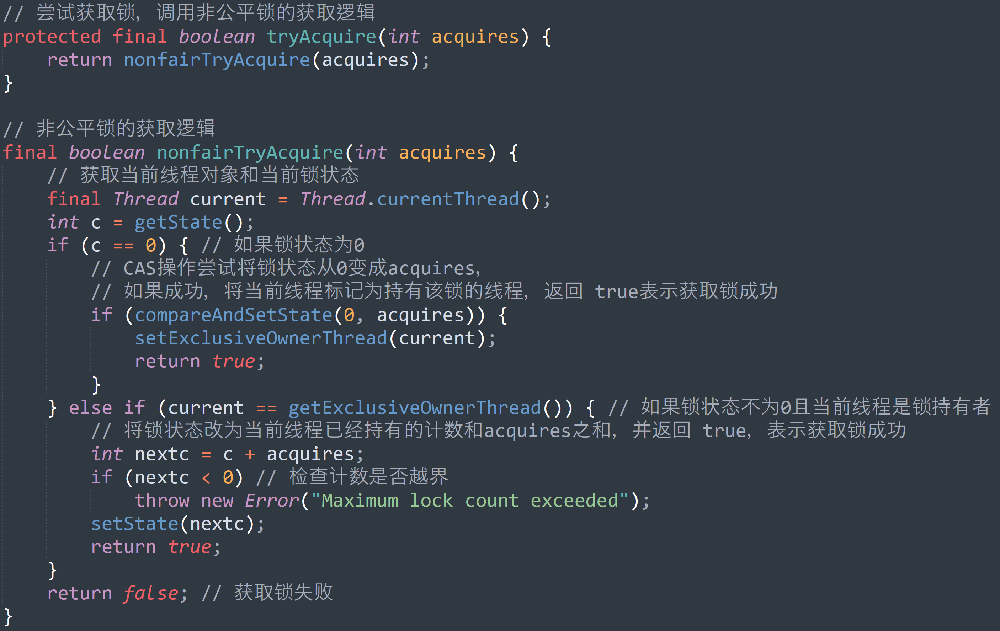

# 28.什么是CAS? 
CAS叫做CompareAndSwap，比较并交换，主要是通过处理器的指令来保证操作的原子性的。

CAS 操作包含三个参数：共享变量的内存地址（V）、预期原值（A）和新值（B），当且仅当内存地址 V 的值等于 A 时，才将 V 的值修改为 B；否则，不会执行任何操作。

在多线程场景下，使用 CAS 操作可以确保多个线程同时修改某个变量时，只有一个线程能够成功修改。其他线程需要重试或者等待。这样就避免了传统锁机制中的锁竞争和死锁等问题，提高了系统的并发性能。

# 29.CAS存在什么问题？如何解决？
CAS的经典三大问题：


**ABA问题**

ABA 问题是指一个变量从A变成B，再从B变成A，这样的操作序列可能会被CAS操作误判为未被其他线程修改过。例如线程A读取了某个变量的值为 A，然后被挂起，线程B修改了这个变量的值为B，然后又修改回了A，此时线程A恢复执行，进行CAS操作，此时仍然可以成功，因为此时变量的值还是A。

怎么解决ABA问题？

+ 加版本号

每次修改变量，都在这个变量的版本号上加1，这样，刚刚A->B->A，虽然A的值没变，但是它的版本号已经变了，再判断版本号就会发现此时的A已经被改过了。

比如使用JDK5中的**AtomicStampedReference类**或JDK8中的**LongAdder类**。这些原子类型不仅包含数据本身，还包含一个版本号，每次进行操作时都会更新版本号，只有当版本号和期望值都相等时才能执行更新，这样可以避免 ABA 问题的影响。

**循环性能开销**

自旋CAS，如果一直循环执行，一直不成功，会给CPU带来非常大的执行开销。

怎么解决循环性能开销问题？

可以使用自适应自旋锁，即在多次操作失败后逐渐加长自旋时间或者放弃自旋锁转为阻塞锁；

**只能保证一个变量的原子操作**

CAS 保证的是对一个变量执行操作的原子性，如果需要对多个变量进行复合操作，CAS 操作就无法保证整个操作的原子性。

怎么解决只能保证一个变量的原子操作问题？

+ **可以使用锁机制来保证整个复合操作的原子性**。例如，使用 **synchronized 关键字**或 **ReentrantLock 类**来保证多个变量的复合操作的原子性。在锁的作用下，只有一个线程可以执行复合操作，其他线程需要等待该线程释放锁后才能继续执行。这样就可以保证整个操作的原子性了。
+ **可以使用类似于事务的方式来保证多个变量的复合操作的原子性**。例如，使用**AtomicReference 类**，可以将多个变量封装到一个对象中，通过 CAS 操作更新整个对象，从而保证多个变量的复合操作的原子性。只有当整个对象的值和期望值都相等时才会执行更新操作。

# 30.Java多线程中如何保证i++的结果正确


+ 使用 Atomic变量，Java 并发包内提供了一些原子类型，如AtomicInteger、AtomicLong等，这些类提供了一些原子操作方法，可以保证相应的操作的原子性。

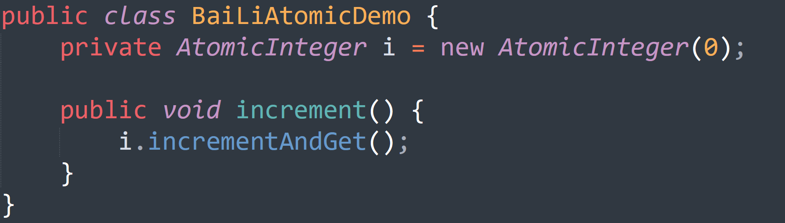

这里使用 AtomicInteger 类来保证 i++ 操作的原子性。

+ 使用synchronized，对i++操作加锁。

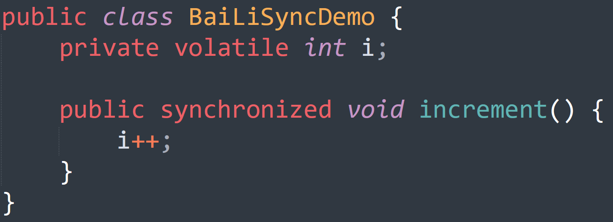

这里使用 synchronized 方法来保证 increment() 方法的原子性，从而保证 i++ 操作的结果正确。

+ 使用锁机制，除了使用 synchronized 关键字外，还可以使用 ReentrantLock 类来保护临界区域。

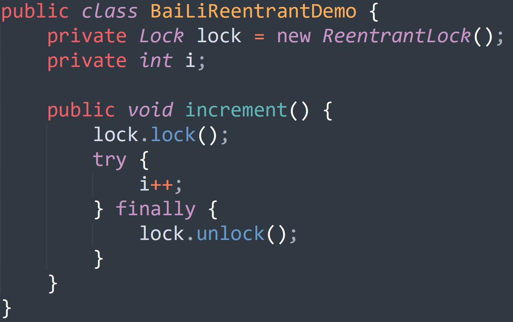

这里使用 ReentrantLock 类的 lock() 和 unlock() 方法来保护 i++操作的原子性。

# 31.AtomicInteger的原理是什么？
一句话概括：使用CAS实现。

在AtomicInteger中，CAS操作的流程如下：

1. 调用 incrementAndGet()方法，该方法会通过调用unsafe.getAndAddInt()方法，获取当前 AtomicInteger对象的值val
2. 将 val + 1 得到新的值 next

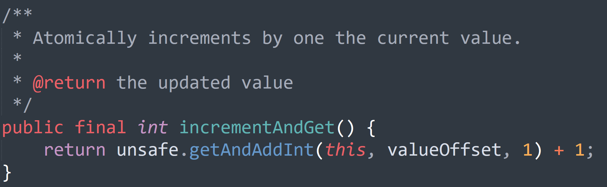

3. 使用 unsafe.compareAndSwapInt() 方法进行 CAS 操作，将对象中当前值与预期值（步骤1中获取的val）进行比较，如果相等，则将 next赋值给val；否则返回 false
4. 如果CAS操作返回false，说明有其他线程已经修改了AtomicInteger对象的值，需要重新执行步骤 1

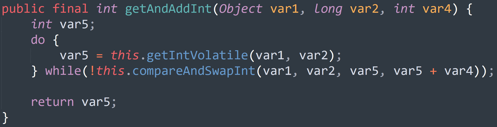

**总结：**

在 CAS 操作中，由于只有一个线程可以成功修改共享变量的值，因此可以保证操作的原子性，即多线程同时修改AtomicInteger变量时也不会出现竞态条件。这样就可以在多线程环境下安全地对AtomicInteger进行整型变量操作。其它的原子操作类基本都是大同小异。

# 32.什么是线程死锁？我们该如何避免线程死锁？
死锁是指两个或两个以上的线程在执行过程中，因争夺资源而造成的互相等待的现象，在无外力作用的情况下，这些线程会一直相互等待而无法继续运行下去。

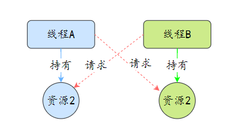

那么为什么会产生死锁呢？死锁的产生必须具备以下四个条件：


+ 互斥条件：指线程在占用某个资源时，会把该资源标记为已占用，并且锁住该资源，以保证**同一时间内只有一个线程可以访问该资源**。其他需要访问该资源的线程就只能等待该线程释放该资源，在资源被释放之后才能进行访问。
+ 请求并持有条件：指一个线程己经持有了至少一个资源，但又提出了新的资源请求，而新资源己被其它线程占有，所以当前线程会被阻塞，但**阻塞的同时并不释放自己已经获取的资源**。
+ 不可剥夺条件：指线程获取到的资源在自己**使用完之前不能被其它线程抢占**，只有在自己使用完毕后才由自己释放该资源。
+ 环路等待条件：指在发生死锁时，**若干线程形成头尾相接的循环等待资源关系。**

该如何避免死锁呢？答案是至少破坏死锁发生的一个条件。

+ 互斥：我们没有办法破坏，因为用锁为的就是互斥。不过其他三个条件都是有办法打破的，到底如何做呢？
+ 请求并持有：可以一次性请求所有的资源。
+ 不可剥夺：设置超时时间。已经占用资源的线程进一步申请其他资源时，如果长时间申请不到，超时释放已经持有的资源。
+ 环路等待：注意加锁顺序，保证每个线程按同样的顺序进行加锁。

# 33.如何排查死锁问题
可以使用jdk自带的命令行工具排查：

1. 使用jps查找运行的Java进程：jps -l
2. 使用jstack查看线程堆栈信息：jstack -l  进程id

基本就可以看到死锁的信息。

还可以利用图形化工具，比如JConsole（JConsole工具在JDK的bin目录中）。出现线程死锁以后，点击JConsole线程面板的检测到死锁按钮，将会看到线程的死锁信息。

演示样例如下：

```java
package lock;

/**
 * @author 百里
 */
public class BaiLiDeadLock {

    private static Object lock1 = new Object();
    private static Object lock2 = new Object();

    public static void main(String[] args) {
        Thread thread1 = new Thread(() -> {
            synchronized (lock1) {
                System.out.println("Thread-1获取了锁1");
                try {
                    Thread.sleep(1000);
                } catch (InterruptedException e) {
                    e.printStackTrace();
                }
                synchronized (lock2) {
                    System.out.println("Thread-1尝试获取锁2");
                }
            }
        });

        Thread thread2 = new Thread(() -> {
            synchronized (lock2) {
                System.out.println("Thread-2获取了锁2");
                try {
                    Thread.sleep(1000);
                } catch (InterruptedException e) {
                    e.printStackTrace();
                }
                synchronized (lock1) {
                    System.out.println("Thread-2尝试获取锁1");
                }
            }
        });
        thread1.start();
        thread2.start();
        try {
            thread1.join();
            thread2.join();
        } catch (InterruptedException e) {
            e.printStackTrace();
        }
    }
}
```

1.新建连接，找到相应的线程，点击连接

2.选择线程标签，点击检测死锁。查看死锁线程信息

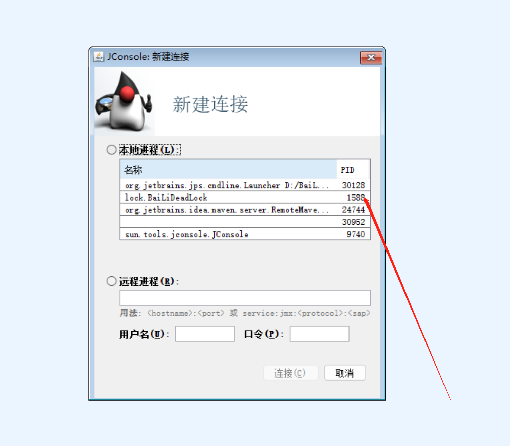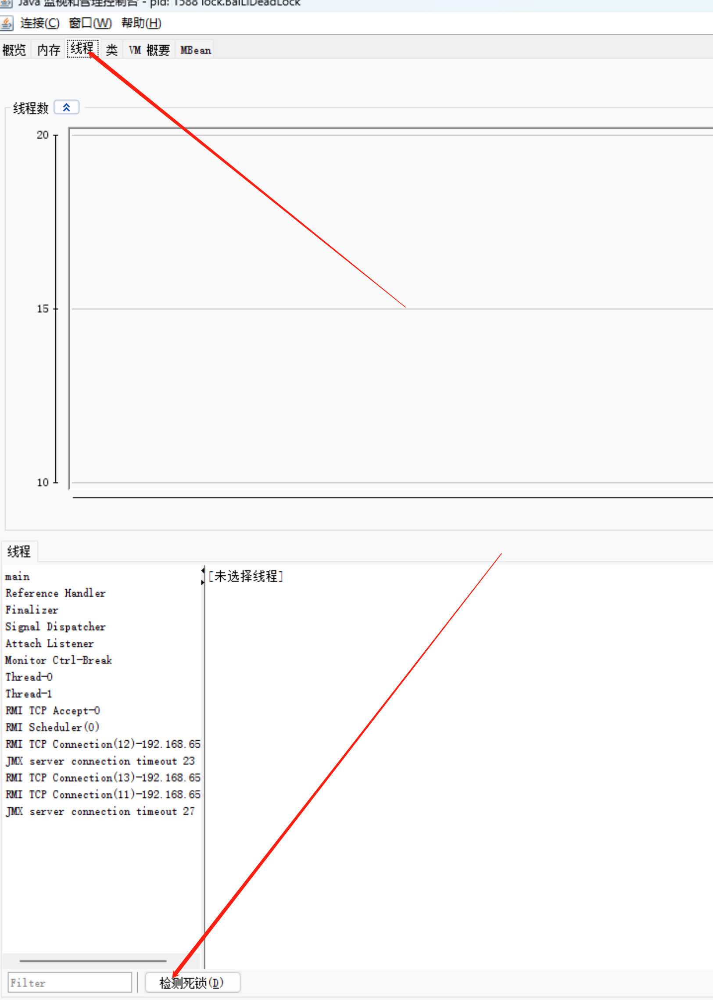

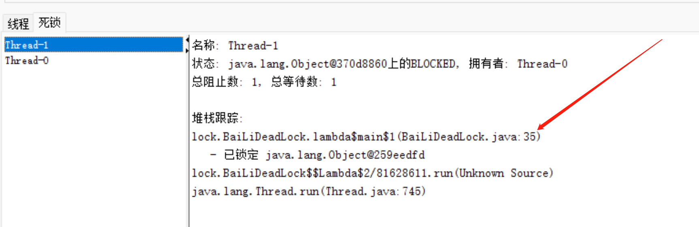

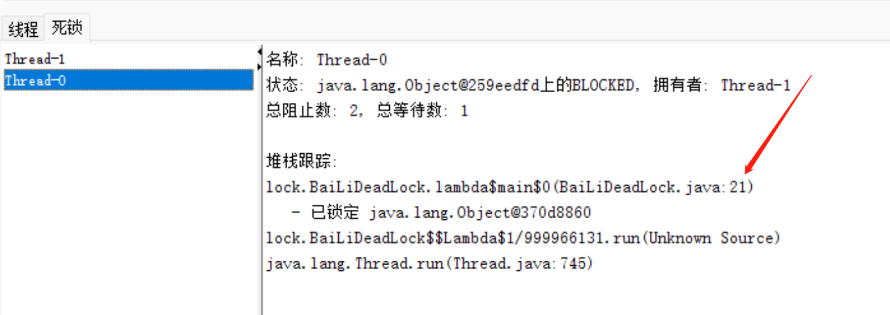


# 34.什么是线程池？
线程池是一种用于管理和复用线程的机制，它提供了一种执行大量异步任务的方式，并且可以在多个任务之间合理地分配和管理系统资源。

线程池的主要优点包括：

+ 改善了资源利用率，降低了线程创建和销毁的开销。
+ 提高了系统响应速度，因为线程池已经预先创建好了一些线程，可以更加快速地分配资源以响应用户请求。
+ 提高了代码可读性和可维护性，因为线程池将线程管理和任务执行进行了分离，可以更加方便地对其进行调整和优化。
+ 可以设置线程数目上限，避免了缺乏控制的线程创建造成的系统无法承受的负载压力。

# 35.简单说一下线程池的工作流程
用一个通俗的比喻：

有一个银行营业厅，总共有六个窗口，现在有三个窗口坐着三个营业员小姐姐在营业。小天去办业务，可能会遇到什么情况呢？

1. 小天发现有空闲的窗口，直接去找小姐姐办理业务。

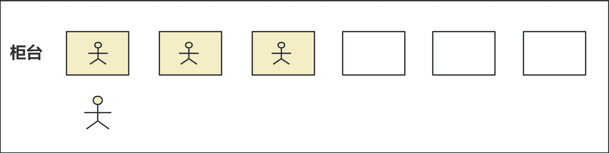

2. 小天发现没有空闲的窗口，就在排队区排队等。

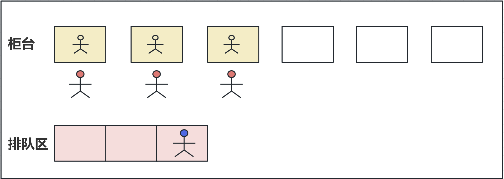

3. 小天发现没有空闲的窗口，等待区也满了，经理一看，就让休息的营业员小姐姐赶紧回来上班，等待区号靠前的赶紧去新窗口办，小天去排队区排队。小姐姐比较辛苦，假如一段时间发现他们可以不用接着营业，经理就让她们接着休息。

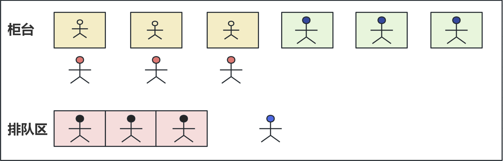

4. 小天一看，六个窗口都满了，等待区也没位置了。小天就开始投诉急了，要闹，经理赶紧出来了，经理该怎么办呢？

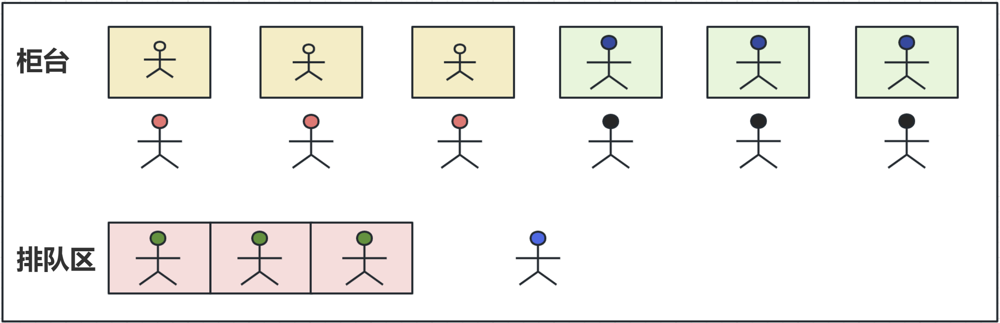

1. 我们营业厅系统已经瘫痪
2. 谁叫你来办的你找谁去
3. 看你比较急，去队里加个塞
4. 今天没办法，不行你看改一天

**上面的这个流程几乎就跟JDK线程池的大致流程类似。**

1. 营业中的 3个窗口对应核心线程池数：corePoolSize
2. 总的营业窗口数6对应：maximumPoolSize
3. 打开的临时窗口在多少时间内无人办理则关闭对应：unit
4. 排队区就是等待队列：workQueue
5. 无法办理的时候银行给出的解决方法对应：RejectedExecutionHandler
6. threadFactory 该参数在JDK中是线程工厂，用来创建线程对象，一般不会动。

所以我们线程池的工作流程也比较好理解了：

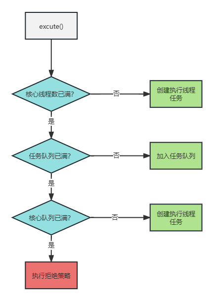

1. 线程池刚创建时，里面没有一个线程。任务队列是作为参数传进来的。不过，就算队列里面有任务，线程池也不会马上执行它们。
2. 当调用 execute() 方法添加一个任务时，线程池会做如下判断：
+ 如果正在运行的线程数量小于 corePoolSize，那么马上创建线程运行这个任务；
+ 如果正在运行的线程数量大于或等于 corePoolSize，那么将这个任务放入队列；
+ 如果这时候队列满了，而且正在运行的线程数量小于 maximumPoolSize，那么还是要创建非核心线程立刻运行这个任务；
+ 如果队列满了，而且正在运行的线程数量大于或等于 maximumPoolSize，那么线程池会根据拒绝策略来对应处理。
3. 当一个线程完成任务时，它会从队列中取下一个任务来执行。
4. 当一个线程无事可做，超过一定的时间（keepAliveTime）时，线程池会判断，如果当前运行的线程数大于 corePoolSize，那么这个线程就被停掉。所以线程池的所有任务完成后，它最终会收缩到 corePoolSize 的大小。

# 36.线程池主要参数有哪些？
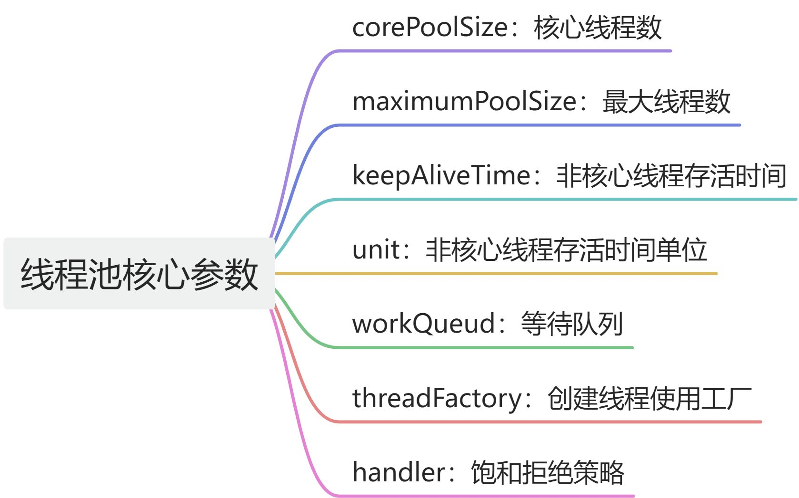

```java
package pool;

import java.util.concurrent.ArrayBlockingQueue;
import java.util.concurrent.Executors;
import java.util.concurrent.ThreadPoolExecutor;
import java.util.concurrent.TimeUnit;

/**
 * @author 百里
 */
public class BaiLiThreadPoolDemo {
    public static void main(String[] args) {
        //基于Executor框架实现线程池
        ThreadPoolExecutor threadPoolExecutor = new ThreadPoolExecutor(
                5,  //corePoolSize
                12,  //maximumPoolSize
                5,  //keepAliveTime
                TimeUnit.SECONDS,   //unit
                new ArrayBlockingQueue<>(5),  //workQueue
                Executors.defaultThreadFactory(),  //threadFactory
                new ThreadPoolExecutor.DiscardPolicy()  //handler
        );
        threadPoolExecutor.execute(() -> {
            System.out.println(
                    Thread.currentThread().getName() + "：点赞评论加分享"
            );
        });
    }
}
```

线程池有七大参数，我们重点关注**corePoolSize、maximumPoolSize、workQueue、handler** 可以帮助我们更好地理解和优化线程池的性能

1. **corePoolSize**

此值是用来初始化线程池中核心线程数，当线程池中线程数< corePoolSize时，系统默认是添加一个任务才创建一个线程池。当线程数 = corePoolSize时，新任务会追加到workQueue中。

2. **maximumPoolSize**

maximumPoolSize表示允许的最大线程数 = (非核心线程数+核心线程数)，当BlockingQueue也满了，但线程池中总线程数 < maximumPoolSize时候就会再次创建新的线程。

3. **keepAliveTime**

非核心线程 =(maximumPoolSize - corePoolSize ) ,非核心线程闲置下来不干活最多存活时间。

4. **unit**

线程池中非核心线程保持存活的时间的单位

+ TimeUnit.DAYS;天
+ TimeUnit.HOURS;小时
+ TimeUnit.MINUTES;分钟
+ TimeUnit.SECONDS;秒
+ TimeUnit.MILLISECONDS;  毫秒
+ TimeUnit.MICROSECONDS;  微秒
+ TimeUnit.NANOSECONDS;  纳秒
5. **workQueue**

线程池等待队列，维护着等待执行的Runnable对象。当运行当线程数= corePoolSize时，新的任务会被添加到workQueue中，如果workQueue也满了则尝试用非核心线程执行任务，等待队列应该尽量用有界的。

6. **threadFactory**

创建一个新线程时使用的工厂，可以用来设定线程名、是否为daemon线程等等。

7. **handler**

corePoolSize、workQueue、maximumPoolSize都不可用的时候执行的饱和策略。

# 37.线程池的拒绝策略有哪些？
在线程池中，当提交的任务数量超过了线程池的最大容量，线程池就需要使用拒绝策略来处理无法处理的新任务。Java 中提供了 4 种默认的拒绝策略:

+ AbortPolicy（默认策略）：直接抛出 runtime 异常，阻止系统正常运行。
+ CallerRunsPolicy：由提交该任务的线程来执行这个任务。
+ DiscardPolicy：直接丢弃任务，不给予任何处理。
+ DiscardOldestPolicy：丢弃队列中最老的一个请求，尝试再次提交当前任务。

除了这些默认的策略之外，我们也可以自定义自己的拒绝策略，实现RejectedExecutionHandler接口即可。

```java
public class CustomRejectedExecutionHandler implements RejectedExecutionHandler {
    @Override
    public void rejectedExecution(Runnable r, ThreadPoolExecutor executor) {
        // 自定义的拒绝策略处理逻辑
    }
}
```

# 38.线程池有哪几种工作队列


+ **有界队列**（ArrayBlockingQueue）：是一个用数组实现的有界阻塞队列，按FIFO排序。
+ **无界队列**（LinkedBlockingQueue）：是基于链表结构的阻塞队列，按FIFO排序，容量可以选择进行设置，不设置的话，将是一个无边界的阻塞队列，因此在任务数量很大且任务执行时间较长时，无界队列可以保证任务不会被丢弃，但同时也会导致线程池中线程数量不断增加，可能会造成内存溢出等问题。
+ **延迟队列**（DelayQueue）：是一个任务定时周期的延迟执行的队列。根据指定的执行时间从小到大排序，否则根据插入到队列的先后排序。
+ **优先级队列**（PriorityBlockingQueue）：是具有优先级的无界阻塞队列。与无界队列类似，优先级队列可以保证所有任务都会被执行，但不同的是优先级队列可以对任务进行管理和排序，确保高优先级的任务优先执行。
+ **同步队列**（SynchronousQueue）：是一个不存储元素的阻塞队列，每个插入操作必须等到另一个线程调用移除操作，否则插入操作一直处于阻塞状态，吞吐量通常要高于无界队列。

# 39.线程池提交execute和submit有什么区别？
在Java中，线程池中一般有两种方法来提交任务：execute() 和 submit()

1. execute() 用于提交不需要返回值的任务

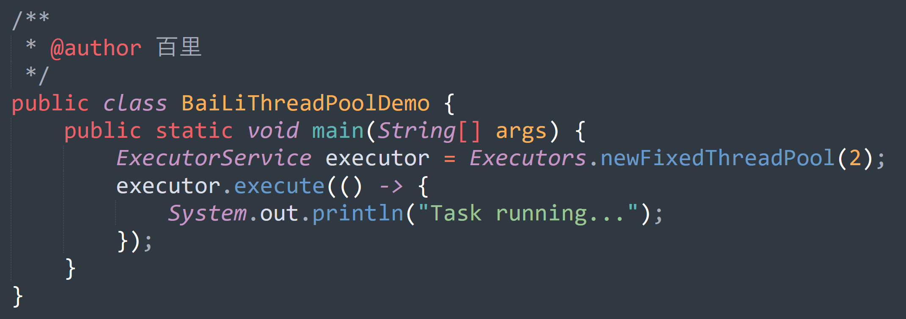

2. submit() 用于提交需要返回值的任务。线程池会返回一个future类型的对象，通过这个 future对象可以判断任务是否执行成功，并且可以通过future的get()方法来获取返回值


# 40.怎么关闭线程池？
可以通过调用线程池的shutdown或shutdownNow方法来关闭线程池。它们的原理是遍历线程池中的工作线程，然后逐个调用线程的interrupt方法来中断线程，所以无法响应中断的任务可能永远无法终止。

**shutdown：**将线程池状态置为shutdown,并不会立即停止：

1. 停止接收外部submit的任务
2. 内部正在跑的任务和队列里等待的任务，会执行完
3. 等到第二步完成后，才真正停止

**shutdownNow：**将线程池状态置为stop。一般会立即停止，事实上不一定：

1. 和shutdown()一样，先停止接收外部提交的任务
2. 忽略队列里等待的任务
3. 尝试将正在跑的任务interrupt中断
4. 返回未执行的任务列表

**shutdown 和shutdownnow区别如下**：

+ **shutdownNow**：能立即停止线程池，正在跑的和正在等待的任务都停下了。这样做立即生效，但是风险也比较大。
+ **shutdown**：只是关闭了提交通道，用submit()是无效的；而内部的任务该怎么跑还是怎么跑，跑完再彻底停止线程池。

```java
import java.util.concurrent.ExecutorService;
import java.util.concurrent.Executors;

/**
 * @author 百里
 */
public class BaiLiShutdownDemo {
    public static void main(String[] args) {
        // 创建一个线程池，包含两个线程
        ExecutorService executor = Executors.newFixedThreadPool(2);

        // 提交任务到线程池
        executor.submit(() -> {
            try {
                Thread.sleep(30000);
            } catch (InterruptedException e) {
                Thread.currentThread().interrupt();
            }
            System.out.println("Task 1 finished");
        });

        executor.submit(() -> {
            try {
                Thread.sleep(2000);
            } catch (InterruptedException e) {
                Thread.currentThread().interrupt();
            }
            System.out.println("Task 2 finished");
        });

        // 关闭线程池
        executor.shutdown();

        while (!executor.isTerminated()) {
            System.out.println("Waiting for all tasks to finish...");
            try {
                // 每500毫秒检查一次
                Thread.sleep(500);
            } catch (InterruptedException e) {
                Thread.currentThread().interrupt();
            }
        }

        System.out.println("All tasks finished");
    }
}
```

```java
import java.util.List;
import java.util.concurrent.ExecutorService;
import java.util.concurrent.Executors;
import java.util.concurrent.TimeUnit;

/**
 * @author 百里
 */
public class BaiLiShutdownNowDemo {
    public static void main(String[] args) {
        // 创建一个线程池，包含两个线程
        ExecutorService executor = Executors.newFixedThreadPool(2);

        // 提交任务到线程池
        executor.submit(() -> {
            while (!Thread.interrupted()) {
                System.out.println("Task 1 running...");
            }
            System.out.println("Task 1 interrupted");
        });

        executor.submit(() -> {
            while (!Thread.interrupted()) {
                System.out.println("Task 2 running...");
            }
            System.out.println("Task 2 interrupted");
        });

        // 关闭线程池
        List<Runnable> unfinishedTasks = null;
        executor.shutdownNow();

        try {
            // 等待直到所有任务完成或超时60秒
            if (!executor.awaitTermination(60, TimeUnit.SECONDS)) {
                // 如果等待超时，则记录未完成的任务列表
                unfinishedTasks = executor.shutdownNow();
                System.out.println("Some tasks were not finished");
            }
        } catch (InterruptedException e) {
            // 如果等待过程中发生异常，则记录未完成的任务列表
            unfinishedTasks = executor.shutdownNow();
            Thread.currentThread().interrupt();
        }

        if (unfinishedTasks != null && !unfinishedTasks.isEmpty()) {
            System.out.println("Unfinished tasks: " + unfinishedTasks);
        } else {
            System.out.println("All tasks finished");
        }
    }
}
```

# 41.有哪几种常见的线程池
在Java中，常见的线程池类型主要有四种，都是通过工具类Excutors创建出来的。


+ **newFixedThreadPool  (固定数目线程)**：该线程池具有固定的线程数，当提交的任务超过线程池大小时，会将任务放入队列等待执行
+ **newCachedThreadPool (可缓存线程)**：该线程池的线程数不定，当线程池中有空闲线程时，会直接使用空闲线程，否则会创建新的线程执行任务。适用于执行大量短生命周期的异步任务。
+ **newSingleThreadExecutor (单线程)**：该线程池只有一个线程，在该线程执行任务的过程中，其他任务都会在队列中等待执行。
+ **newScheduledThreadPool (定时及周期执行)**：该线程池可以执行定时任务和周期性任务，也可以提交普通的异步任务。

需要注意阿里巴巴《Java开发手册》里禁止使用这种方式来创建线程池。

# 42.说一说newSingleThreadExecutor工作原理
线程池特点：

+ 核心线程数为1
+ 最大线程数也为1
+ 阻塞队列是无界队列LinkedBlockingQueue，可能会导致OOM
+ keepAliveTime为0

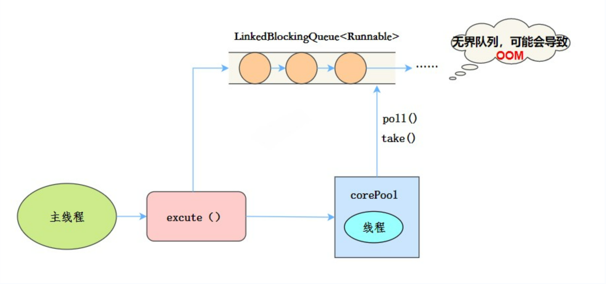

工作流程：

+ 提交任务
+ 线程池是否有一个线程正在运行，如果没有，新建线程执行任务
+ 如果有并且非空闲状态，将任务加到阻塞队列
+ 当前的唯一线程，从队列取任务，执行完一个，再继续取，一个线程执行任务。

使用场景：

适用于串行执行任务的场景，一个任务一个任务地执行。

# 43.说一说newFixedThreadPool工作原理
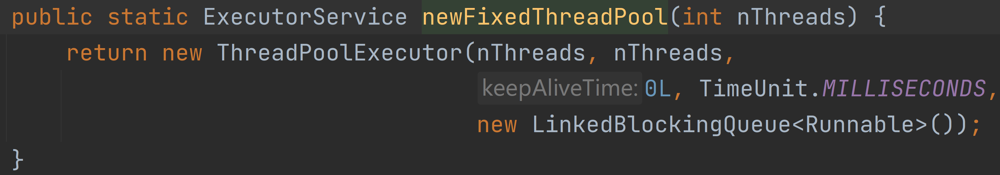线程池特点：

+ 核心线程数和最大线程数大小一样
+ 没有所谓的非空闲时间，即keepAliveTime为0
+ 阻塞队列为无界队列LinkedBlockingQueue，可能会导致OOM

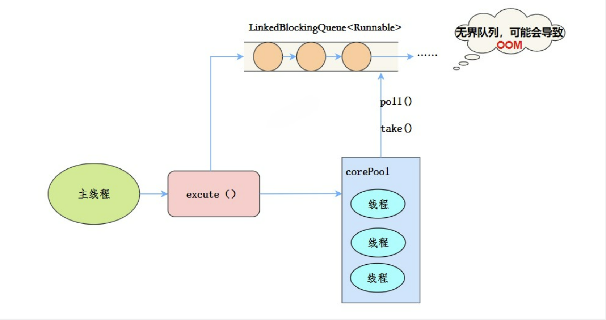

工作流程：

+ 提交任务
+ 如果线程数少于核心线程，创建核心线程执行任务
+ 如果线程数等于核心线程，把任务添加到LinkedBlockingQueue阻塞队列
+ 如果线程执行完任务，去阻塞队列取任务，继续执行。

使用场景：

FixedThreadPool 适用于处理CPU密集型的任务，确保CPU在长期被工作线程使用的情况下，尽可能的少的分配线程，即适用执行长期的任务。

# 44.说一说newCachedThreadPool工作原理
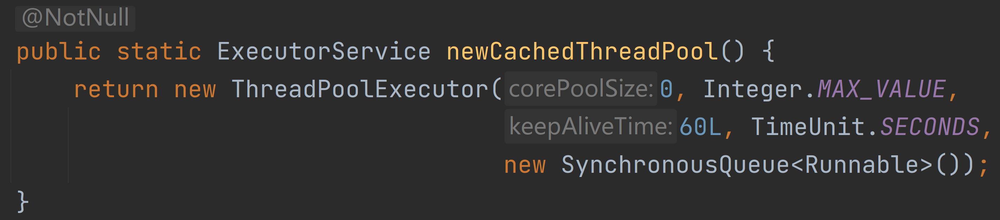

线程池特点：

+ 核心线程数为0
+ 最大线程数为Integer.MAX_VALUE，即无限大，可能会因为无限创建线程，导致OOM
+ 阻塞队列是SynchronousQueue
+ 非核心线程空闲存活时间为60秒

当提交任务的速度大于处理任务的速度时，每次提交一个任务，就必然会创建一个线程。极端情况下会创建过多的线程，耗尽 CPU 和内存资源。由于空闲 60 秒的线程会被终止，长时间保持空闲的 CachedThreadPool 不会占用任何资源。

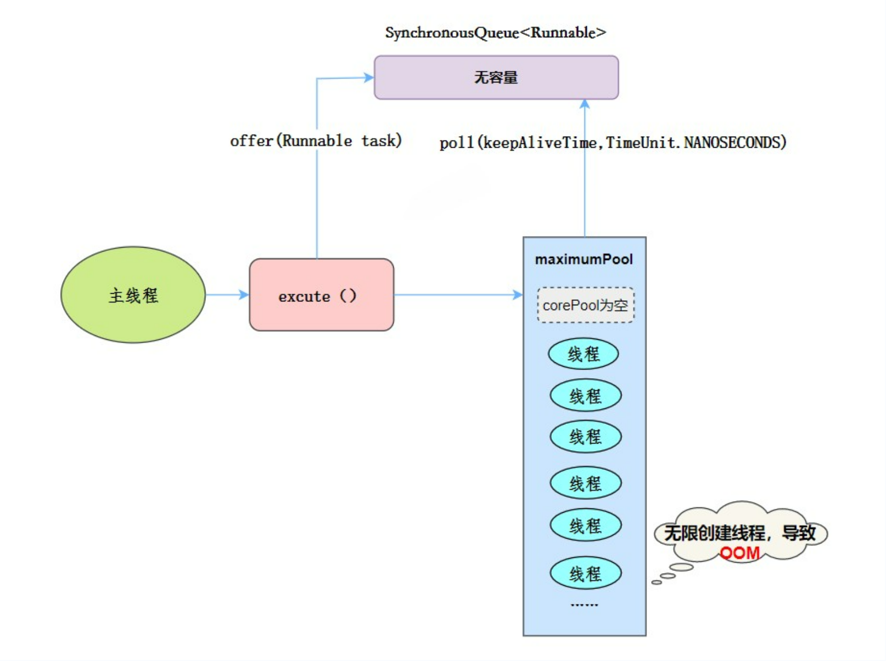

工作流程：

+ 提交任务
+ 因为没有核心线程，所以任务直接加到SynchronousQueue队列。
+ 判断是否有空闲线程，如果有，就去取出任务执行。
+ 如果没有空闲线程，就新建一个线程执行。
+ 执行完任务的线程，还可以存活60秒，如果在这期间，接到任务，可以继续活下去；否则，被销毁。

使用场景：

用于并发执行大量短期的小任务。

# 45.说一说**newScheduledThreadPool**工作原理
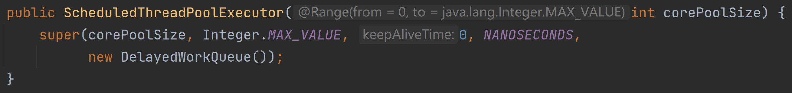

线程池特点：

+ 最大线程数为Integer.MAX_VALUE，也有OOM的风险
+ 阻塞队列是DelayedWorkQueue
+ keepAliveTime为0
+ scheduleAtFixedRate() ：按某种速率周期执行
+ scheduleWithFixedDelay()：在某个延迟后执行

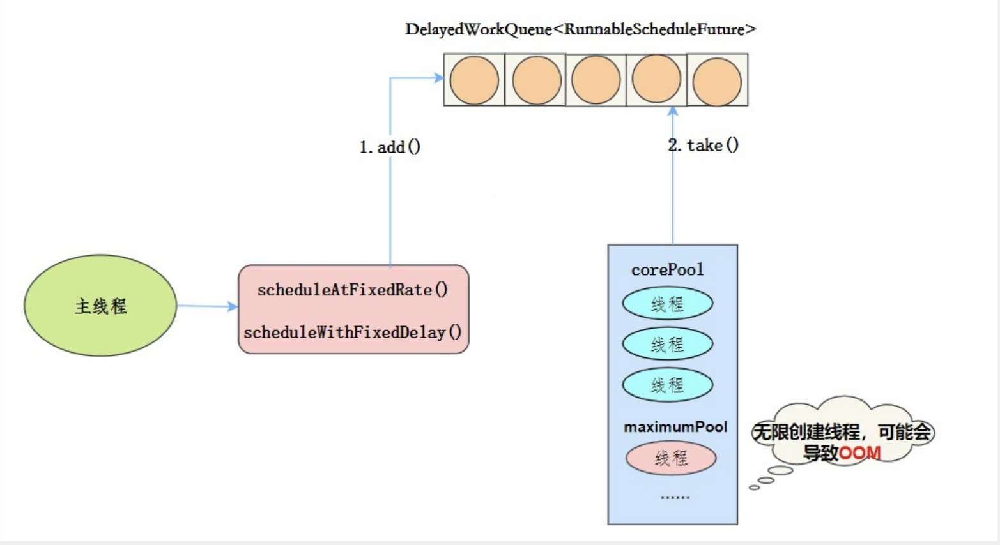

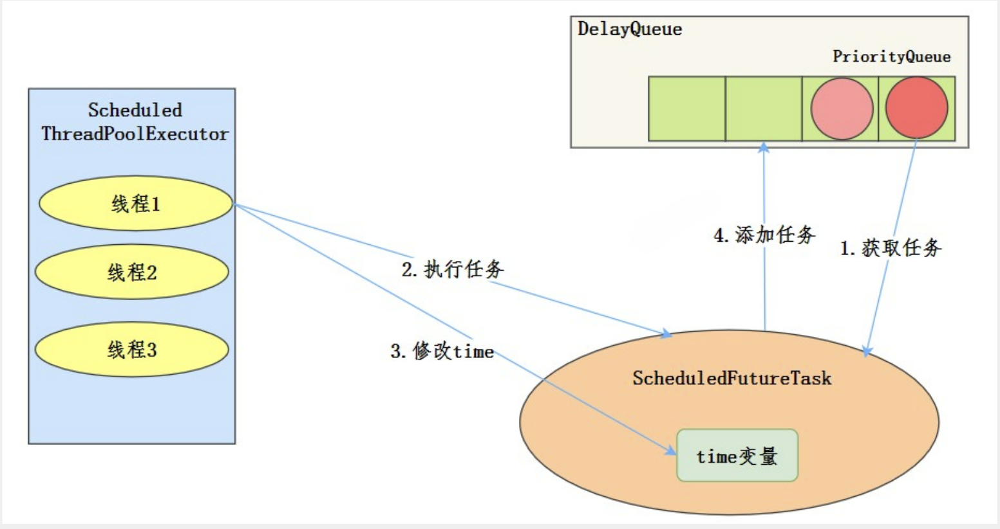

工作流程：

+ 线程从DelayQueue中获取已到期的ScheduledFutureTask（DelayQueue.take()）。到期任务是指ScheduledFutureTask的time大于等于当前时间。
+ 线程执行这个ScheduledFutureTask。
+ 线程修改ScheduledFutureTask的time变量为下次将要被执行的时间。
+ 线程把这个修改time之后的ScheduledFutureTask放回DelayQueue中（DelayQueue.add()）。

使用场景：

周期性执行任务的场景，需要限制线程数量的场景。

```java
import java.util.concurrent.*;

/**
 * @author 百里
 */
public class BaiLiScheduledThreadPoolDemo {
    public static void main(String[] args) throws Exception {
        // 创建一个可以执行定时任务的线程池
        ScheduledExecutorService executorService = Executors.newScheduledThreadPool(1);

        // 调度一个定时任务，每隔 2 秒钟输出一次当前时间
        ScheduledFuture<?> scheduledFuture = executorService.scheduleAtFixedRate(() -> {
            System.out.println("Current time: " + System.currentTimeMillis());
        }, 0, 2, TimeUnit.SECONDS);

        // 主线程休眠 10 秒钟后取消任务
        Thread.sleep(10000);
        scheduledFuture.cancel(true);

        // 关闭线程池
        executorService.shutdown();
    }
}
```

```java
import java.util.concurrent.*;

/**
 * @author 百里
 */
public class BaiLiScheduleWithFixedDelayDemo {
    public static void main(String[] args) throws Exception {
        // 创建一个可以执行定时任务的线程池
        ScheduledExecutorService executorService = Executors.newScheduledThreadPool(1);

        // 调度一个周期性任务，每次任务执行完毕后等待 2 秒钟再执行下一个任务
        executorService.scheduleWithFixedDelay(() -> {
            System.out.println("Current time: " + System.currentTimeMillis());
        }, 0, 2, TimeUnit.SECONDS);

        // 主线程休眠 10 秒钟后关闭线程池
        Thread.sleep(10000);
        executorService.shutdown();
    }
}
```

# 46.线程池异常怎么处理知道吗？
在使用线程池处理任务的时候，任务代码可能抛出RuntimeException，抛出异常后，线程池可能捕获它，也可能创建一个新的线程来代替异常的线程，我们可能无法感知任务出现了异常，因此我们需要考虑线程池异常情况。

常见的异常处理方式：

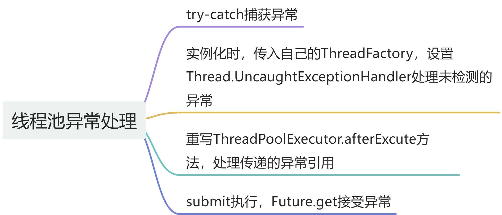

1.try-catch捕获异常

```java
import java.util.concurrent.ExecutorService;
import java.util.concurrent.Executors;

/**
 * @author 百里
 */
public class BaiLiHandlerException implements Runnable {

    @Override
    public void run() {
        try {
            // 任务代码
            int a = 10 / 0;
        } catch (Exception e) {
            System.err.println("任务执行异常：" + e.getMessage());
        }
    }

    public static void main(String[] args) {
        ExecutorService executor = Executors.newFixedThreadPool(10);
        BaiLiHandlerException task = new BaiLiHandlerException();
        executor.execute(task);
    }
}
```

2.使用Thread.UncaughtExceptionHandler处理异常

```java
import com.google.common.util.concurrent.ThreadFactoryBuilder;

import java.util.concurrent.*;

/**
 * @author 百里
 */
public class BaiLiHandlerException implements Runnable {


    @Override
    public void run() {
        // 任务代码
        int a = 10 / 0;
    }

    public static class MyUncaughtExceptionHandler implements Thread.UncaughtExceptionHandler {
        @Override
        public void uncaughtException(Thread t, Throwable e) {
            System.err.println("任务执行异常：" + e.getMessage());
        }
    }

    public static void main(String[] args) {
        BaiLiHandlerException task = new BaiLiHandlerException();
        Thread thread = new Thread(task);
        thread.setUncaughtExceptionHandler(new MyUncaughtExceptionHandler());
        thread.start();
    }
}
```

3.重写ThreadPoolExecutor.afterExcute处理异常

```java
package exception;

import com.google.common.util.concurrent.ThreadFactoryBuilder;

import java.util.concurrent.*;

/**
 * @author 百里
 */
public class BaiLiHandlerException implements Runnable {


    @Override
    public void run() {
        // 任务代码
        int a = 10 / 0;
    }

    public static class MyThreadPoolExecutor extends ThreadPoolExecutor {
        public MyThreadPoolExecutor(int corePoolSize, int maximumPoolSize, long keepAliveTime, TimeUnit unit,
                                    BlockingQueue<Runnable> workQueue, ThreadFactory threadFactory) {
            super(corePoolSize, maximumPoolSize, keepAliveTime, unit, workQueue, threadFactory);
        }

        @Override
        protected void afterExecute(Runnable r, Throwable t) {
            super.afterExecute(r, t);
            if (t != null) {
                System.err.println("任务执行异常：" + t.getMessage());
            }
        }
    }

    public static void main(String[] args) {
        MyThreadPoolExecutor executor = new MyThreadPoolExecutor(1, 1, 0, TimeUnit.MILLISECONDS,
                new LinkedBlockingQueue<>(), new ThreadFactoryBuilder().setNameFormat("MyThread-%d").build());
        BaiLiHandlerException task = new BaiLiHandlerException();
        executor.execute(task);

    }
}
```

4.使用future.get处理异常

```java
import com.google.common.util.concurrent.ThreadFactoryBuilder;

import java.util.concurrent.*;

/**
 * @author 百里
 */
public class BaiLiHandlerException {
    public static void main(String[] args) {
        ExecutorService executor = Executors.newSingleThreadExecutor();
        Future<String> future = executor.submit(() -> {
            throw new RuntimeException("任务执行失败");
        });
        try {
            String result = future.get();
            System.out.println(result);
        } catch (ExecutionException e) {
            Throwable ex = e.getCause();
            System.out.println("捕获到异常: " + ex.getMessage());
        } catch (InterruptedException e) {
            Thread.currentThread().interrupt();
            executor.shutdownNow();
            System.out.println("线程被中断，已执行相应处理");
        }
        executor.shutdown();
    }
}
```

# 47.能说一下线程池有几种状态吗？
线程池有这几个状态：RUNNING，SHUTDOWN，STOP，TIDYING，TERMINATED

```java
 //线程池状态
private static final int RUNNING    = -1 << COUNT_BITS;
private static final int SHUTDOWN   =  0 << COUNT_BITS;
private static final int STOP       =  1 << COUNT_BITS;
private static final int TIDYING    =  2 << COUNT_BITS;
private static final int TERMINATED =  3 << COUNT_BITS;
```

线程池各个状态切换图：

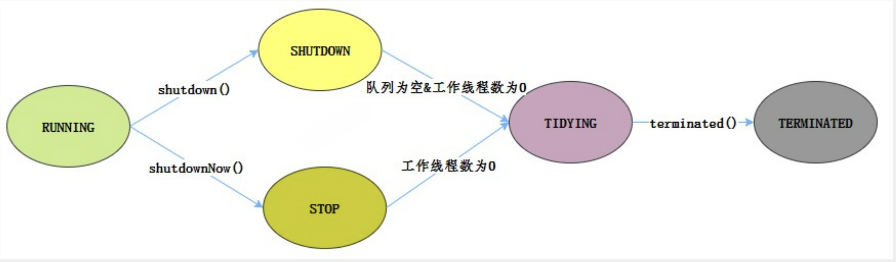

RUNNING

+ 该状态的线程池会接收新任务，并处理阻塞队列中的任务;
+ 调用线程池的shutdown()方法，可以切换到SHUTDOWN状态;
+ 调用线程池的shutdownNow()方法，可以切换到STOP状态;

SHUTDOWN

+ 该状态的线程池不会接收新任务，但会处理阻塞队列中的任务；
+ 队列为空，并且线程池中执行的任务也为空,进入TIDYING状态;

STOP

+ 该状态的线程不会接收新任务，也不会处理阻塞队列中的任务，而且会中断正在运行的任务；
+ 线程池中执行的任务为空,进入TIDYING状态;

TIDYING

+ 该状态表明所有的任务已经运行终止，记录的任务数量为0。
+ terminated()执行完毕，进入TERMINATED状态

TERMINATED

+ 该状态表示线程池彻底终止

# 48.单机线程池执行断电了应该怎么处理？
单机线程池是一种常见的多线程编程方式，它可以用于异步执行任务，提高应用程序的性能和并发能力。在单机线程池中，所有任务都由同一个线程处理，因此如果该线程在执行任务时突然断电，则会出现以下问题：

+ 任务不完整
+ 数据丢失
+ 系统资源泄漏

如果单机线程池在执行任务时突然遇到断电等异常情况，应该尽快采取以下措施：

+ 恢复中断的任务：当系统重新启动后，需要检查之前被中断的任务，并将其重新提交到单机线程池中进行处理，以确保所有任务都能够被正确执行。
+ 数据备份及恢复：对于需要处理的数据，应该事先进行备份，以避免数据丢失或损坏。在系统重启后，需要将备份数据恢复到系统中，以确保数据的完整性和正确性。
+ 系统资源清理：在单机线程池执行过程中，可能会产生未释放的系统资源，如文件句柄、锁等。在系统重启后，需要清理这些未释放的系统资源，以避免资源泄漏和系统运行不稳定。

# 49.NIO的原理，包括哪几个组件？
NIO（Java Non-blocking I/O）是一种 I/O 技术，其核心原理是基于事件驱动的方式进行操作。

**NIO 的工作原理**：基于缓冲区、通道和选择器的组合，通过高效地利用系统资源，以支持高并发和高吞吐量的数据处理。相比传统的 I/O 编程方式，Java NIO 提供了更为灵活和高效的编程方式。

NIO三大核心组件： Channel（通道）、Buffer（缓冲区）、Selector（选择器）。

Selector、Channel 和 Buffer 的关系图如下：

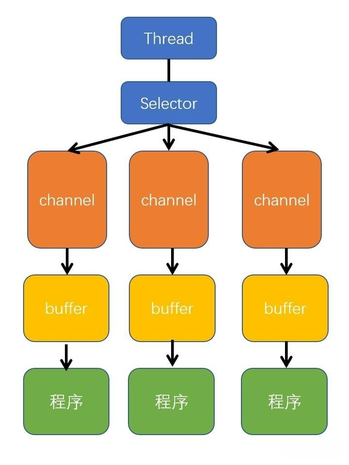

1. Channel（通道）：类似于传统 I/O 中的 Stream，是用于实际数据传输的组件。在 NIO 中，有多种类型的 Channel 可以使用，例如 FileChannel、SocketChannel、DatagramChannel 等，可用于文件操作、网络传输等不同场景。
2. Buffer（缓冲区）：用于存储数据的容器，可以理解为暂存需要传输的数据的地方。在 NIO 中，存在多种类型的缓冲区，如 ByteBuffer、CharBuffer、IntBuffer等。
3. Selector（选择器）：用于注册 Channel 并监听其 I/O 事件。当 Channel 准备好读或写数据时，会得到通知。Selector 可以高效地轮询多个 Channel，并且避免了使用多线程或多进程对多个 Channel 进行轮询的情况，从而减少了系统资源开销。

**通俗理解NIO原理**：

NIO 是可以做到用一个线程来处理多个操作的。假设有 10000 个请求过来，根据实际情况，可以分配 50 或者 100 个线程来处理。不像之前的阻塞 IO 那样，非得分配 10000 个。

# 50.什么是零拷贝？
零拷贝（Zero-Copy）是一种 `I/O` 操作优化技术，可以快速高效地将数据从文件系统移动到网络接口，而不需要将其从内核空间复制到用户空间。

**传统I/O操作过程：**

传统 I/O 的工作方式是，数据读取和写入是从用户空间到内核空间来回复制，而内核空间的数据是通过操作系统层面的 I/O 接口从磁盘读取或写入。代码通常如下，一般会需要两个系统调用：

```java
read(file, tmp_buf, len);
write(socket, tmp_buf, len);
```

代码很简单，虽然就两行代码，但是这里面发生了不少的事情：

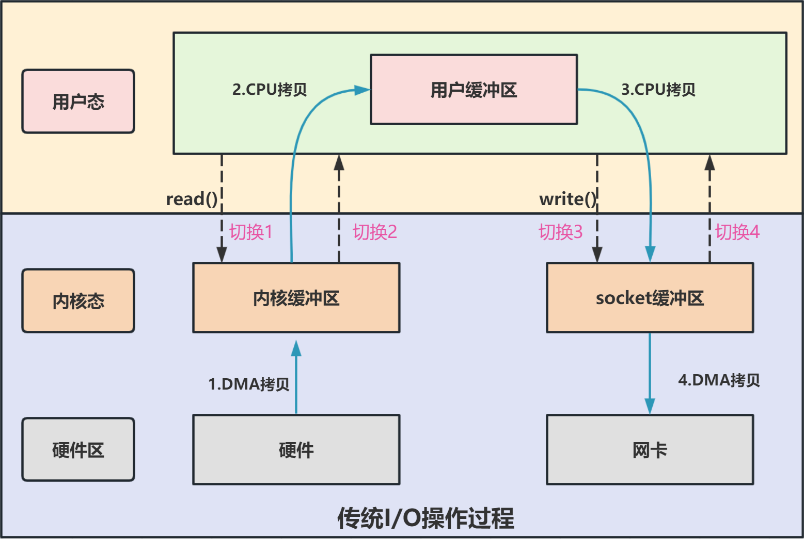

+ <font style="color:rgb(18, 18, 18);">用户应用进程调用read函数，向操作系统发起IO调用，</font>**<font style="color:rgb(18, 18, 18);">上下文从用户态转为内核态（切换1）</font>**
+ <font style="color:rgb(18, 18, 18);">DMA控制器把数据从磁盘中，读取到内核缓冲区。</font>
+ <font style="color:rgb(18, 18, 18);">CPU把内核缓冲区数据，拷贝到用户应用缓冲区，</font>**<font style="color:rgb(18, 18, 18);">上下文从内核态转为用户态（切换2）</font>**<font style="color:rgb(18, 18, 18);">，read函数返回</font>
+ <font style="color:rgb(18, 18, 18);">用户应用进程通过write函数，发起IO调用，</font>**<font style="color:rgb(18, 18, 18);">上下文从用户态转为内核态（切换3）</font>**
+ <font style="color:rgb(18, 18, 18);">CPU将应用缓冲区中的数据，拷贝到socket缓冲区</font>
+ <font style="color:rgb(18, 18, 18);">DMA控制器把数据从socket缓冲区，拷贝到网卡设备，</font>**<font style="color:rgb(18, 18, 18);">上下文从内核态切换回用户态（切换4）</font>**<font style="color:rgb(18, 18, 18);">，write函数返回</font>

<font style="color:rgb(18, 18, 18);">从流程图可以看出，传统IO的读写流程，包括了4次上下文切换（4次用户态和内核态的切换），4次数据拷贝（</font>**<font style="color:rgb(18, 18, 18);">两次CPU拷贝以及两次的DMA拷贝</font>**<font style="color:rgb(18, 18, 18);">)</font>

这种简单又传统的文件传输方式，存在冗余的上文切换和数据拷贝，在高并发系统里是非常糟糕的，多了很多不必要的开销，会严重影响系统性能。

所以，**要想提高文件传输的性能，就需要减少「用户态与内核态的上下文切换」和「内存拷贝」的次数**。

零拷贝主要是用来解决操作系统在处理 I/O 操作时，频繁复制数据的问题。关于零拷贝主要技术有MMap+Write、SendFile等几种方式。

**Mmap+Wirte实现零拷贝**：

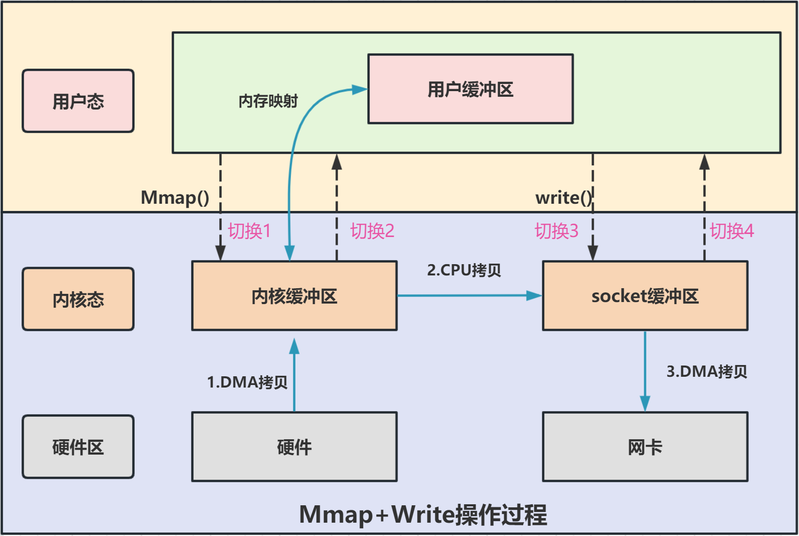

+ <font style="color:rgb(18, 18, 18);">用户进程通过</font>mmap方法<font style="color:rgb(18, 18, 18);">向操作系统内核发起IO调用，</font>**<font style="color:rgb(18, 18, 18);">上下文从用户态切换为内核态</font>**<font style="color:rgb(18, 18, 18);">。</font>
+ <font style="color:rgb(18, 18, 18);">CPU利用DMA控制器，把数据从硬盘中拷贝到内核缓冲区。</font>
+ **<font style="color:rgb(18, 18, 18);">上下文从内核态切换回用户态</font>**<font style="color:rgb(18, 18, 18);">，mmap方法返回。</font>
+ <font style="color:rgb(18, 18, 18);">用户进程通过</font><font style="color:rgb(18, 18, 18);background-color:rgb(246, 246, 246);">write</font><font style="color:rgb(18, 18, 18);">方法向操作系统内核发起IO调用，</font>**<font style="color:rgb(18, 18, 18);">上下文从用户态切换为内核态</font>**<font style="color:rgb(18, 18, 18);">。</font>
+ <font style="color:rgb(18, 18, 18);">CPU将内核缓冲区的数据拷贝到的socket缓冲区。</font>
+ <font style="color:rgb(18, 18, 18);">CPU利用DMA控制器，把数据从socket缓冲区拷贝到网卡，</font>**<font style="color:rgb(18, 18, 18);">上下文从内核态切换回用户态</font>**<font style="color:rgb(18, 18, 18);">，write调用返回。</font>

<font style="color:rgb(18, 18, 18);">可以发现，</font>mmap+write<font style="color:rgb(18, 18, 18);">实现的零拷贝，I/O发生了</font>**<font style="color:rgb(18, 18, 18);">4</font>**<font style="color:rgb(18, 18, 18);">次用户空间与内核空间的上下文切换，以及3次数据拷贝。其中3次数据拷贝中，包括了</font>**<font style="color:rgb(18, 18, 18);">2次DMA拷贝和1次CPU拷贝</font>**<font style="color:rgb(18, 18, 18);">。</font>

**<font style="color:rgb(18, 18, 18);">SendFile实现零拷贝</font>**<font style="color:rgb(18, 18, 18);">：</font>

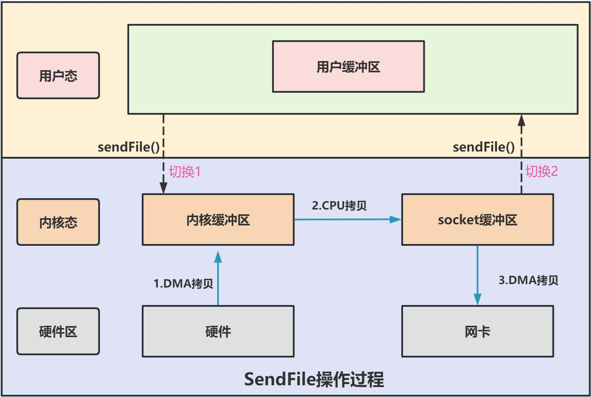

1. <font style="color:rgb(18, 18, 18);">用户进程发起sendfile系统调用，</font>**<font style="color:rgb(18, 18, 18);">上下文（切换1）从用户态转向内核态</font>**
2. <font style="color:rgb(18, 18, 18);">DMA控制器，把数据从硬盘中拷贝到内核缓冲区。</font>
3. <font style="color:rgb(18, 18, 18);">CPU将读缓冲区中数据拷贝到socket缓冲区</font>
4. <font style="color:rgb(18, 18, 18);">DMA控制器，异步把数据从socket缓冲区拷贝到网卡，</font>
5. **<font style="color:rgb(18, 18, 18);">上下文（切换2）从内核态切换回用户态</font>**<font style="color:rgb(18, 18, 18);">，sendfile调用返回。</font>

<font style="color:rgb(18, 18, 18);">可以发现，</font>sendfile<font style="color:rgb(18, 18, 18);">实现的零拷贝，I/O发生了</font>**<font style="color:rgb(18, 18, 18);">2</font>**<font style="color:rgb(18, 18, 18);">次用户空间与内核空间的上下文切换，以及3次数据拷贝。其中3次数据拷贝中，包括了</font>**<font style="color:rgb(18, 18, 18);">2次DMA拷贝和1次CPU拷贝</font>**<font style="color:rgb(18, 18, 18);">。</font>

  


> 更新: 2025-09-03 19:25:07  
> 原文: <https://www.yuque.com/tulingzhouyu/db22bv/tupelds42978mtt8>