# 👍 一小时快速入门MySQL+傻瓜式安装教程

## 1.课程介绍
2024 年给大家带来一个快速入门 MySQL 的超详细教程，帮助还没有使用过 MySQL 的小伙伴快速掌握 MySQL 的安装与入门使用，接下来就开始 MySQL 的扫盲行动吧。

## 2.MySQL简介
MySQL是一个开源的关系型数据库管理系统，广泛应用于Web应用程序的数据存储和管理。它支持多用户并发访问，具有高性能、稳定可靠、易于使用和管理等特点。

MySQL官网提供了详细的文档、下载、社区支持等资源，官网地址为[https://www.mysql.com/。在官网上，你可以找到各种版本的MySQL，包括社区版、企业版等，以及适用于不同操作系统的安装包。](https://www.mysql.com/%E3%80%82%E5%9C%A8%E5%AE%98%E7%BD%91%E4%B8%8A%EF%BC%8C%E4%BD%A0%E5%8F%AF%E4%BB%A5%E6%89%BE%E5%88%B0%E5%90%84%E7%A7%8D%E7%89%88%E6%9C%AC%E7%9A%84MySQL%EF%BC%8C%E5%8C%85%E6%8B%AC%E7%A4%BE%E5%8C%BA%E7%89%88%E3%80%81%E4%BC%81%E4%B8%9A%E7%89%88%E7%AD%89%EF%BC%8C%E4%BB%A5%E5%8F%8A%E9%80%82%E7%94%A8%E4%BA%8E%E4%B8%8D%E5%90%8C%E6%93%8D%E4%BD%9C%E7%B3%BB%E7%BB%9F%E7%9A%84%E5%AE%89%E8%A3%85%E5%8C%85%E3%80%82)

安装MySQL的方式多样化，可以根据需求选择合适的方式进行安装。一种常见的方式是通过Linux的工具包管理器进行安装，比如使用apt-get、yum等。另外，你也可以使用Docker容器来快速部署MySQL，这种方式方便灵活，能够在不同的环境中快速部署MySQL服务。在本教程中，将会详细介绍 Linux 安装、Windows 安装两种常见的安装方式。

## 3.Windows安装
### 3.1 软件下载
打开 MySQL 官网，选择 DownLoads，在点击下方 Community DownLoads，然后依次按照图示进行操作下载，如下：

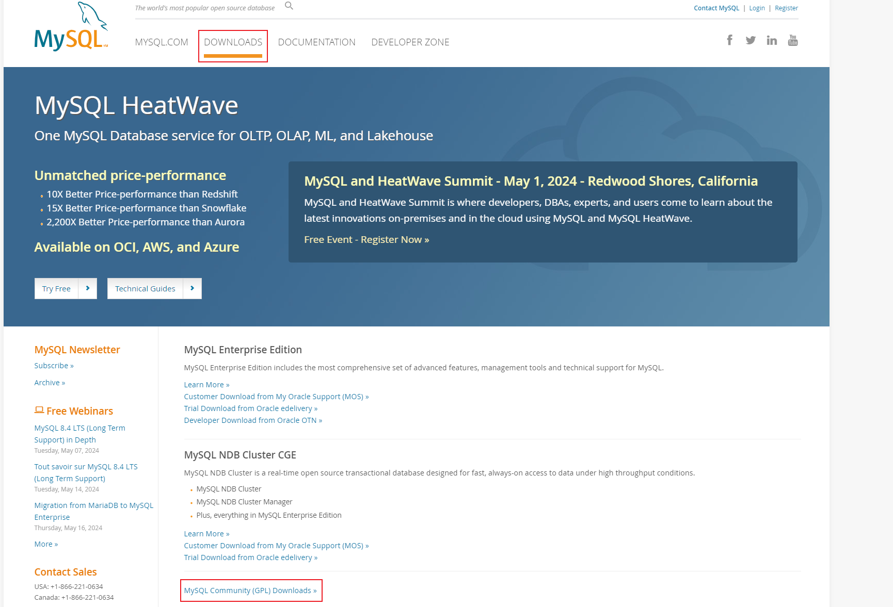


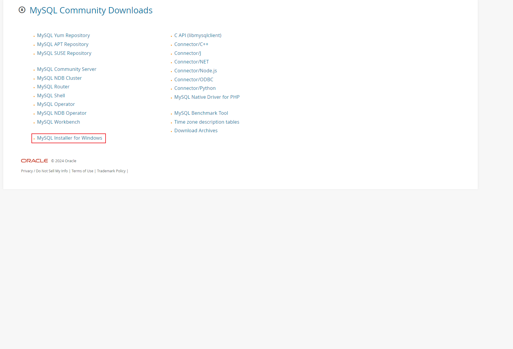

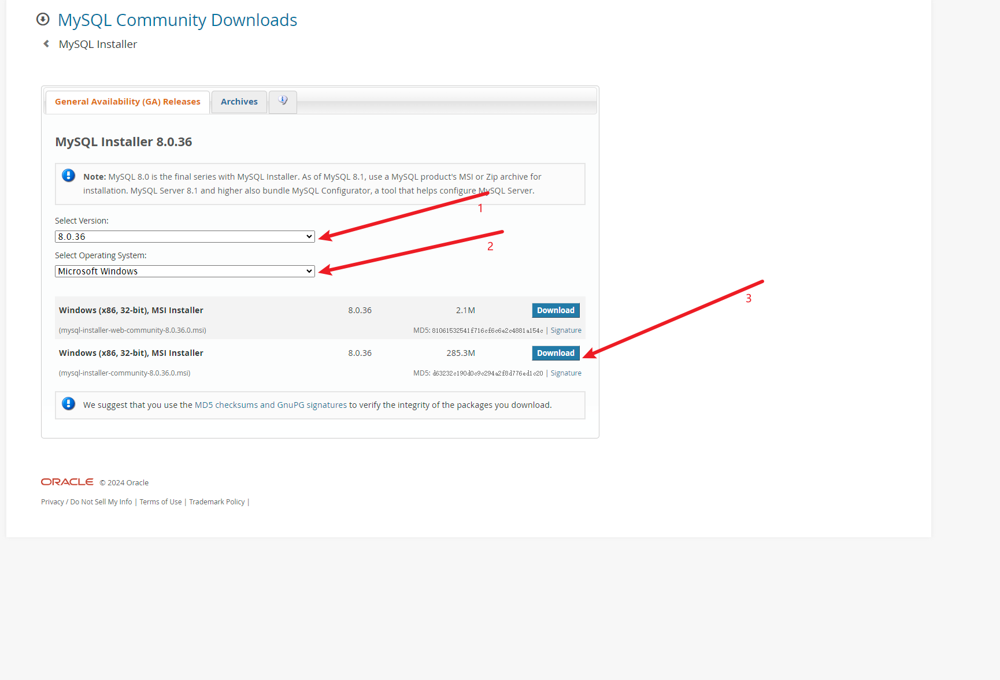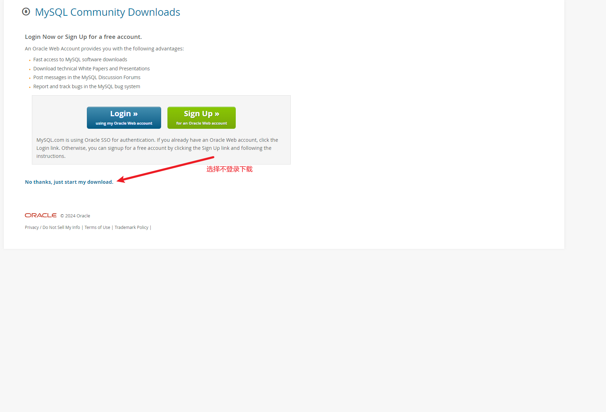

### 3.2 安装
Windows 的安装有图形化界面，非常的方便快捷，直接运行下载好的 msi 文件，大多数都是下一步，极少步骤需要处理，需要单独处理的步骤提到了前面，大家稍微记一下就行，其他无脑下一步。需要注意如下图示： **完整的过程图再文末。**

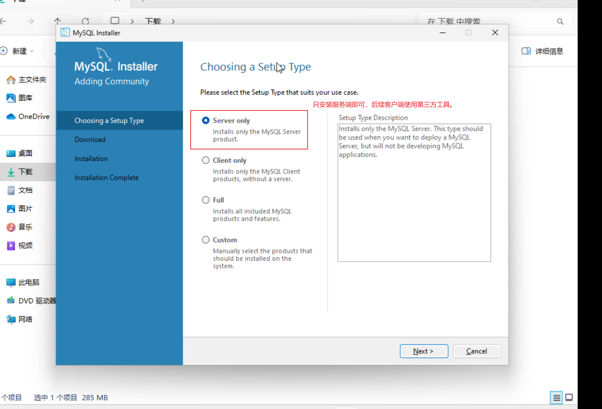

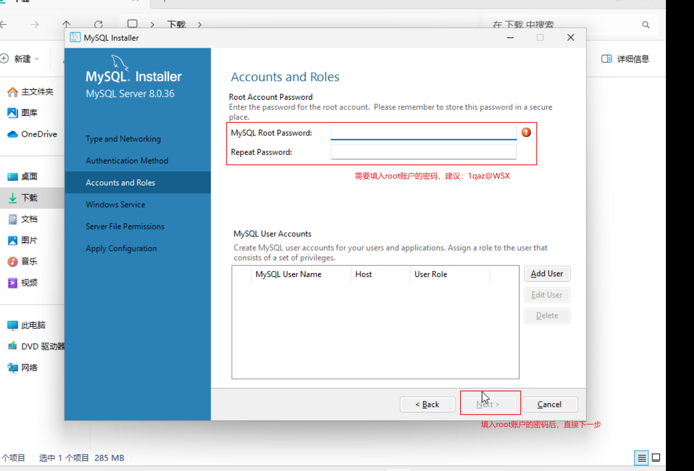

### 3.3 测试是否安装成功
相信安装过程没什么问题，操作完成后，使用 cmd 进行简单测试。

#### 3.3.1 win + R 输入 cmd 或者 win 搜索 cmd 打开命令窗口登录 MySQL。
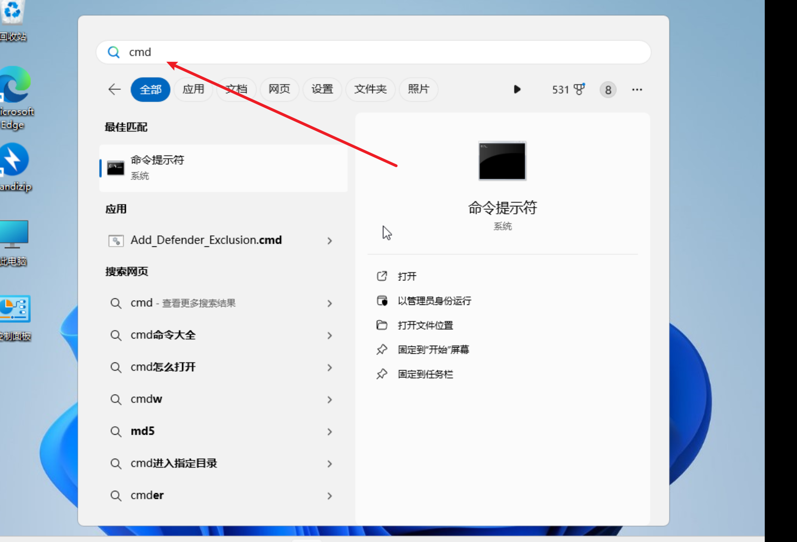

输入登录 MySQL 命令：**mysql -u root -p** ,如果出现以下报错，则需要配置下 MySQL 环境变量。

```plsql
mysql -u root -p
```

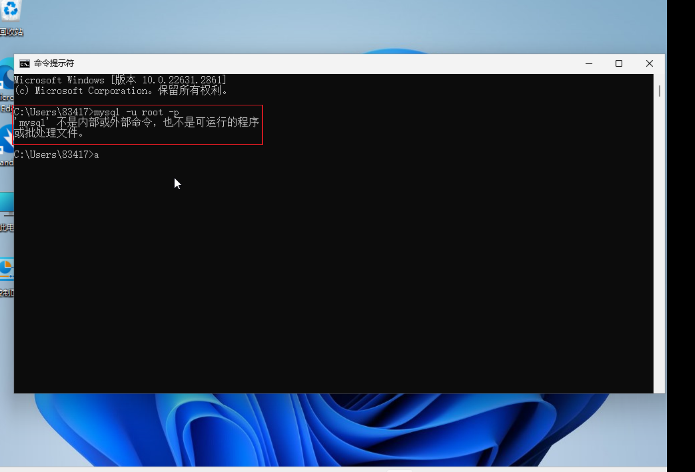

### 3.3.2 配置 MySQL 环境变量
#### 3.3.2.1 进入 MySQL 安装目录，打开 bin 目录，复制 bin 所在目录链接
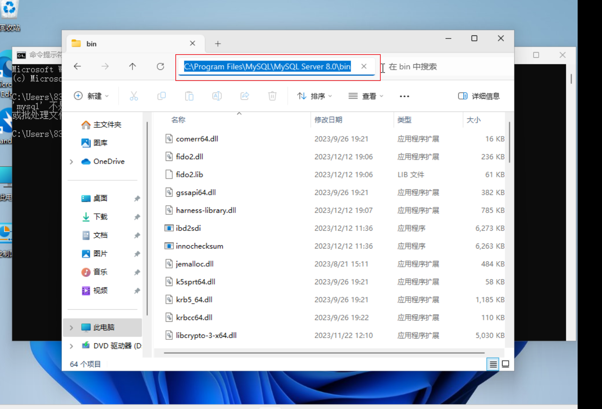

#### 3.3.2.2 打开我的电脑属性 --> 高级系统设置 --> 环境变量 ······ 按图示操作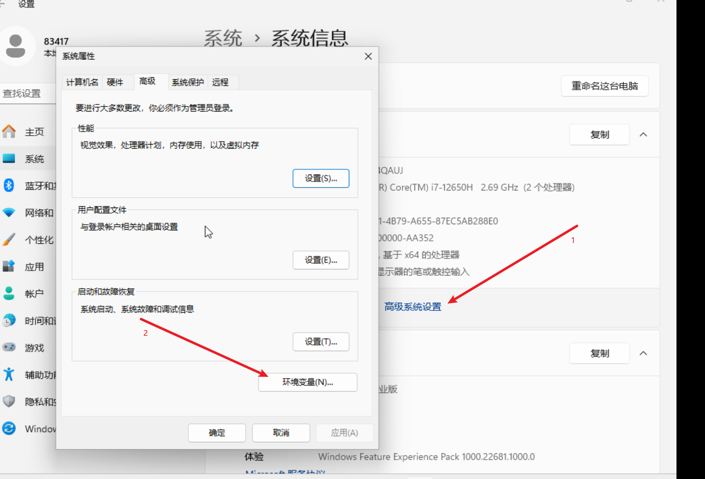
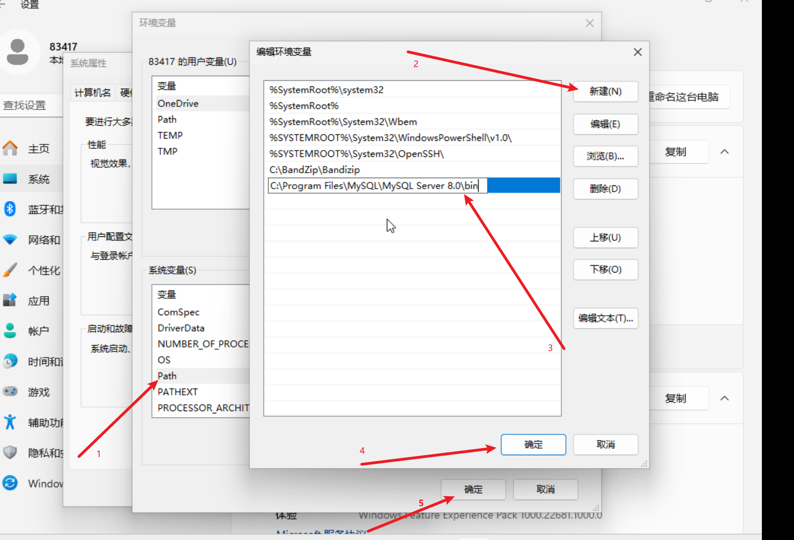

#### 3.3.2.3 需要注意，配置环境变量后，需要重新打开一个 cmd 窗口才能生效。效果如下，输入安装时的 root 密码后，出下 MySQL 提示，则代表安装成功，可以简单测试下：
```plsql
mysql -u root -p
show databases;
show tables;
quit;
```

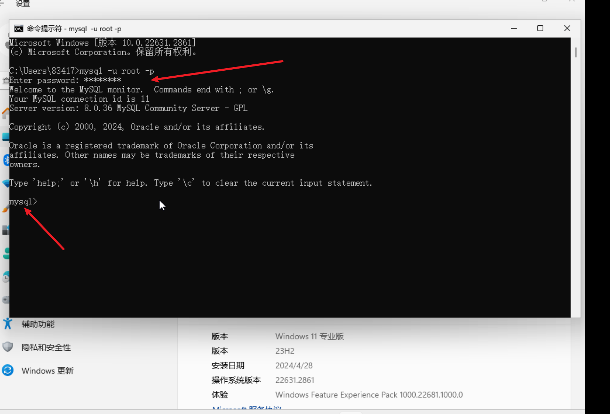

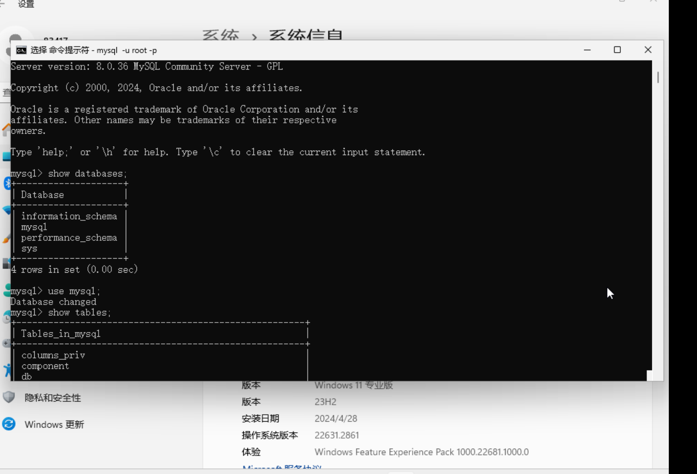

## 4.Linux安装
**使用 Centos7 安装 MySQL8.0**

### 4.1 检查系统是否已经安装数据库
```shell
[root@localhost ~]# rpm -qa | grep mysql
[root@localhost ~]# rpm -qa | grep mariabd
```

### 4.2 如果存在卸载相应数据库
```shell
[root@localhost ~]# rpm -e --nodeps mysql/mariabd（已经安装程序名称）
```

### 4.3 <font style="color:rgb(79, 79, 79);">安装下载工具wget</font>
#### <font style="color:rgb(77, 77, 77);">4.3.1 查看安装情况</font>
```shell
[root@localhost ~]# wget -V
GNU Wget 1.14 在 linux-gnu 上编译。
······
[root@localhost ~]# rpm -qa wget
wget-1.14-18.el7_6.1.x86_64
```

#### 4.3.2 如果没有安装
```shell
[root@localhost ~]# yum install -y wget
```

### 4.4 <font style="color:rgb(79, 79, 79);">下载阿里云 yum 源文件</font>
```shell
[root@localhost ~]# wget -O /etc/yum.repos.d/CentOS-Base.repo http://mirrors.aliyun.com/repo/Centos-7.repo
```

### 4.5 <font style="color:rgb(79, 79, 79);">清理yum缓存</font>
```shell
[root@localhost ~]# yum clean all
[root@localhost ~]# yum makecache
```

### 4.6 <font style="color:rgb(79, 79, 79);">下载 mysql 源安装包</font>
```shell
[root@localhost ~]# wget http://dev.mysql.com/get/mysql80-community-release-el7-8.noarch.rpm
```

### 4.7 安装 MySQL 源
```shell
[root@localhost ~]# yum localinstall -y mysql80-community-release-el7-8.noarch.rpm
```

### 4.8 安装 MySQL
```shell
[root@localhost ~]# yum -y install mysql-community-server --nogpgcheck
```

### 4.9 检查是否安装成功
```shell
[root@localhost ~]# rpm -qa |grep mysql
mysql-community-common-8.0.37-1.el7.x86_64
mysql-community-server-8.0.37-1.el7.x86_64
mysql-community-libs-8.0.37-1.el7.x86_64
mysql-community-libs-compat-8.0.37-1.el7.x86_64
mysql80-community-release-el7-8.noarch
mysql-community-client-8.0.37-1.el7.x86_64
mysql-community-icu-data-files-8.0.37-1.el7.x86_64
mysql-community-client-plugins-8.0.37-1.el7.x86_64
```

### 4.10 启动 MySQL & 设置开机自启 & 重新加载配置文件
```shell
[root@localhost ~]# systemctl start mysqld
[root@localhost ~]# systemctl enable mysqld
[root@localhost ~]# systemctl daemon-reload
```

### 4.11 卸载防火墙
```shell
[root@localhost ~]# yum remove firewalld
```

### 4.12 <font style="color:rgb(79, 79, 79);">查看mysql密码</font>
```shell
[root@localhost ~]# cat /var/log/mysqld.log | grep password
2024-04-30T13:41:28.767968Z 6 [Note] [MY-010454] [Server] A temporary password is generated for root@localhost: Nle-H4q:-%zp
```

其中"**Nle-H4q:-%zp**"为 root 初始密码，复制准备登录。

### 4.13 登录 MySQL
```shell
[root@localhost ~]# mysql -u root -p
Enter password: 
```

### 4.14 修改 root 密码
```shell
mysql> ALTER USER 'root'@'localhost' IDENTIFIED WITH mysql_native_password BY '1qaz@WSX';
mysql> quit;
[root@localhost ~]# mysql -u root -p
Enter password: 
```

修改后退出重新登录

### 4.15 修改 root 账户登录设置
```shell
mysql> use mysql;
mysql> update user set host='%' where user='root';
mysql> flush privileges;
```

### 4.16 完结撒花
至此 MySQL8.0 的安装完成，远程登录也搞定（就是步骤 4.15）。

需要注意通过这种方式安装的 MySQL，并没有加载 my.cnf 这个配置文件，修改方式点击这个[链接](https://www.yuque.com/tulingzhouyu/db22bv/ugdfg4q0ccqo0r28?singleDoc# 《👍 一小时快速入门数据同步神器-Canal》 密码：ilps)，参考第四章节

## 5.HeidiSQL
MySQL 服务已经安装完成，由于命令方式输入比较复杂，所以我们还需要一款图形化软件来进行操作 MySQL，推荐大家使用 HeidiSQL，完全免费。下载地址：[https://www.heidisql.com/download.php](https://www.heidisql.com/download.php)

### 5.1 选择 64 就可以了
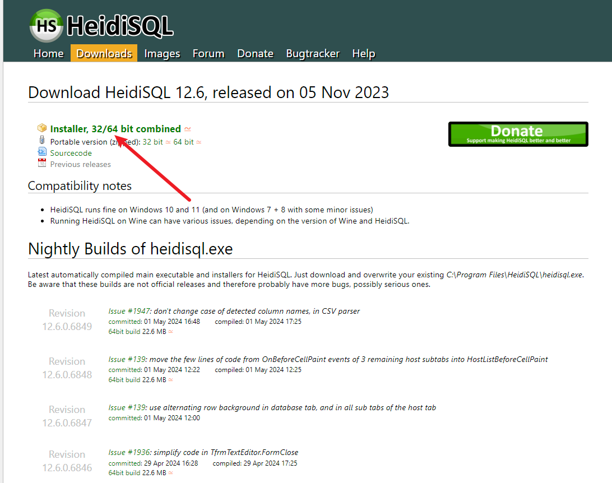

### 5.2 然后就正常下一步，安装完成后打开软件。连接数据库，如下是连接了本机、虚机 windows、虚机 Linux 三个机器的 MySQL 服务，确认好 ip 地址，填入账号密码即可。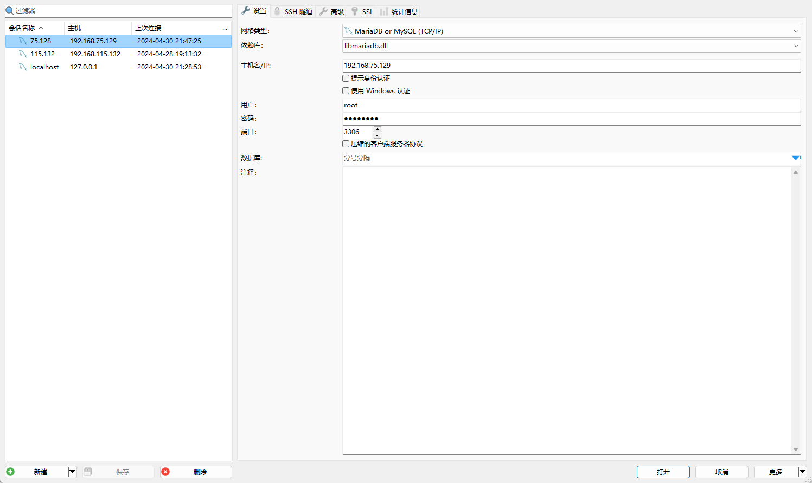
### 5.3 连接 Linux 机器 MySQL
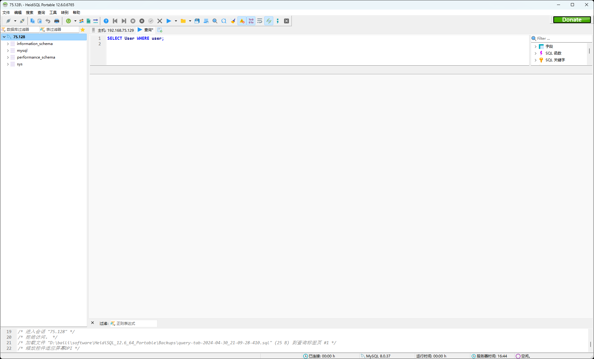

### 5.4 至此图形化客户端处理完成
## 6.创建数据库
### 6.1 使用命令方式创建
如果是使用命令方式创建表，首先我们可以通过:

```shell
show database;
```

查看现有已经存在的库。

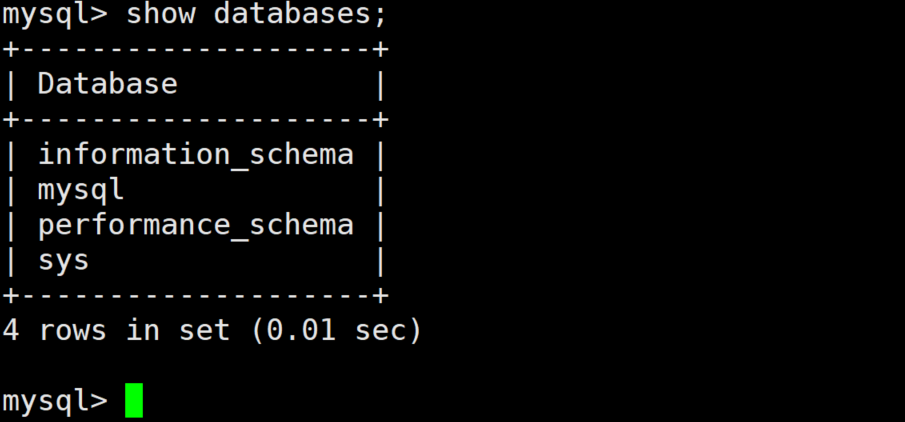

**创建表使用命令**

```shell
create database test;
```

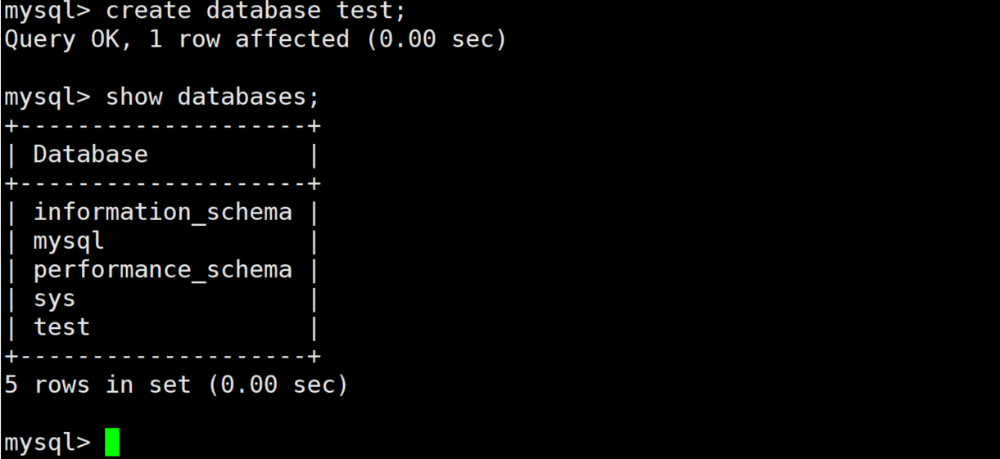

**删除数据库使用**

```shell
drop database test;
```

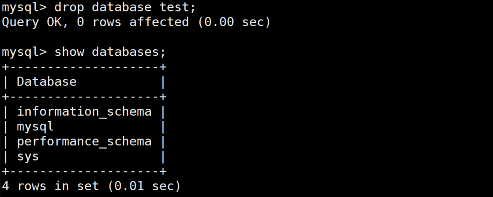

### 6.2 使用 HeidiSQL 创建
**选中连接的数据库，然后右键-->创建新的-->数据库**

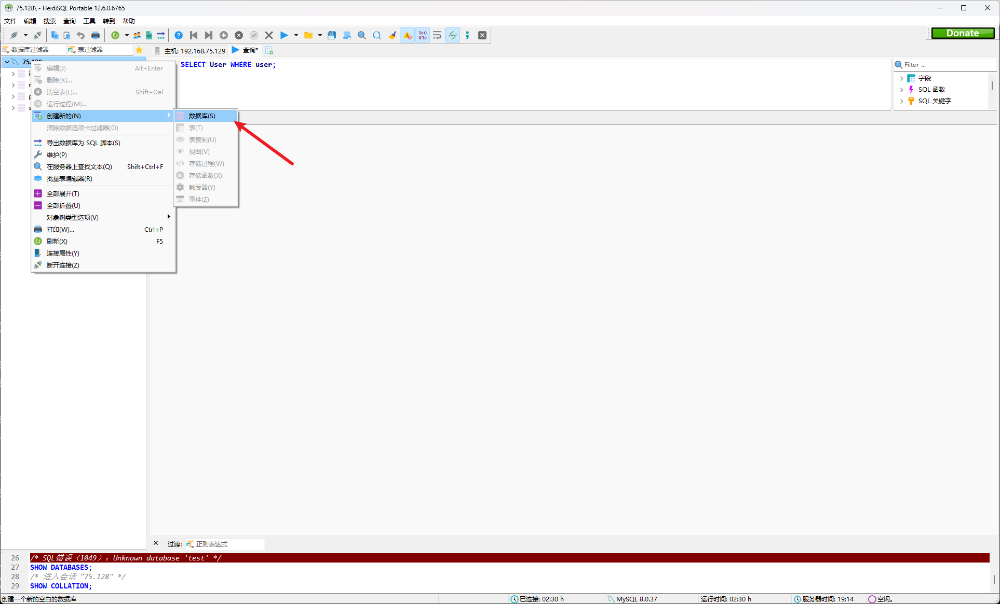

填入数据库名称，这样就创建完成了

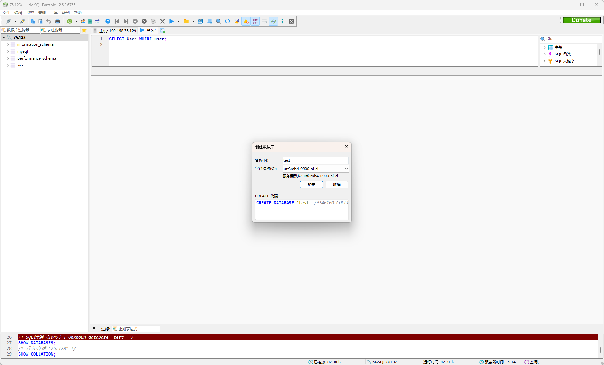

**删除数据库，很简单，直接选中数据库右键删除即可**

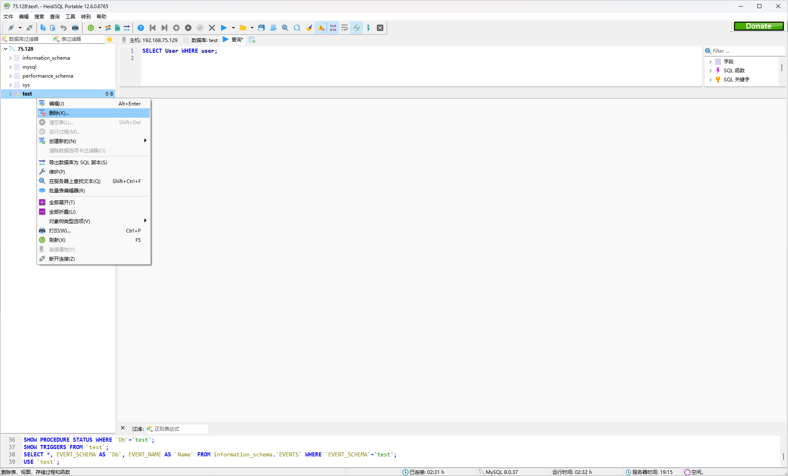

**细心的小伙伴应该已经发现了，我们在图形化操作时，HeidiSQL 都生成了对应的命令，因此我们接下来都在 HeidiSQL 中完成处理。**

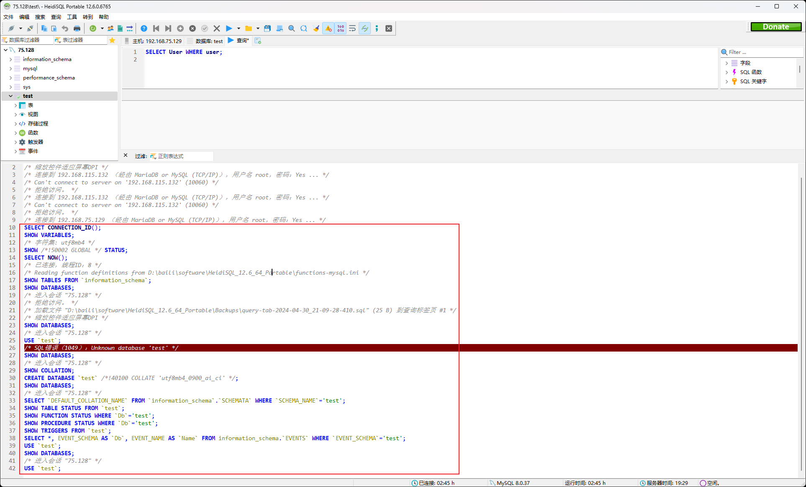

## 7.创建表
### 7.1 <font style="color:rgb(36, 41, 47);">创建测试表</font>
```plsql
-- 创建一个名为 "test" 的简单表，其中包含三个字段
CREATE TABLE test (
  id INT AUTO_INCREMENT PRIMARY KEY, -- 主键
  name VARCHAR(50),  -- 字符串字段
  age INT            -- 整数字段
);
```

### 7.2 <font style="color:rgb(36, 41, 47);">添加新的字段</font>
```plsql
-- 添加一个新的 "email" 字段
ALTER TABLE test
ADD email VARCHAR(100); -- 添加一个新的VARCHAR字段
```

### <font style="color:rgb(36, 41, 47);">7.3 修改字段名称</font>
```plsql
-- 将 "name" 字段重命名为 "full_name"
ALTER TABLE test
RENAME COLUMN name TO full_name;
```

### <font style="color:rgb(36, 41, 47);">7.4 修改字段类型</font>
```plsql
-- 将 "age" 字段从 INT 修改为 SMALLINT 使用 MODIFY
ALTER TABLE test
MODIFY COLUMN age SMALLINT;
```

### <font style="color:rgb(36, 41, 47);">7.5 为字段设置默认值</font>
```plsql
-- 为 "age" 字段设置默认值 18
ALTER TABLE test
ALTER COLUMN age SET DEFAULT 18;
```

### <font style="color:rgb(36, 41, 47);">7.6 删除字段</font>
```plsql
-- 删除 "email" 字段
ALTER TABLE test
DROP COLUMN email;
```

### <font style="color:rgb(36, 41, 47);">7.7 删除表</font>
```plsql
-- 删除整个表
DROP TABLE test;
```

### 7.8 数据库常见数据类型汇总
**数字类型**

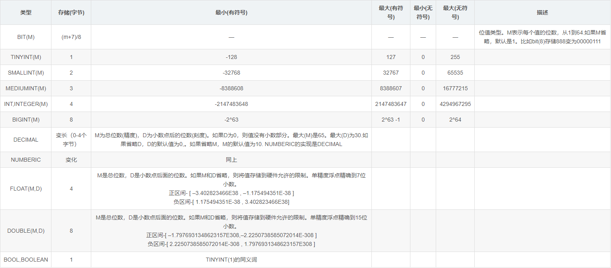

**日期类型**

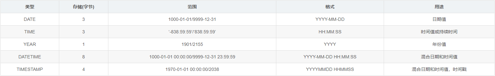

**字符类型**

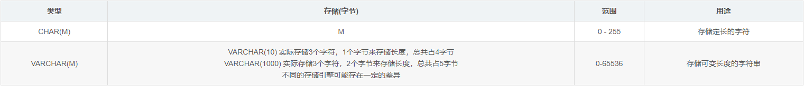

## 8.数据的增删改查
```plsql
-- 插入一行新数据：
INSERT INTO test (full_name, age) VALUES ('Alice Johnson', 40);

-- 查询所有数据：
SELECT * FROM test;

-- 插入测试数据到 "test" 表中
INSERT INTO test (full_name, age) VALUES
('John Doe', 30),
('Jane Smith', 25),
('Michael Johnson', 35);

-- 根据条件查询数据：
SELECT * FROM test WHERE age > 30;

-- 使用聚合函数查询数据统计：
SELECT COUNT(*) AS total_rows FROM test;

-- 更新数据：
UPDATE test SET age = 45 WHERE full_name = 'Michael Johnson';

-- 删除数据：
DELETE FROM test WHERE full_name = 'Alice Johnson';
```

## 9.数据的导入与导出
使用 HeidiSQL 导出非常的简单，选中表右键，然后选中需要导出的数据与保存目录就可以了

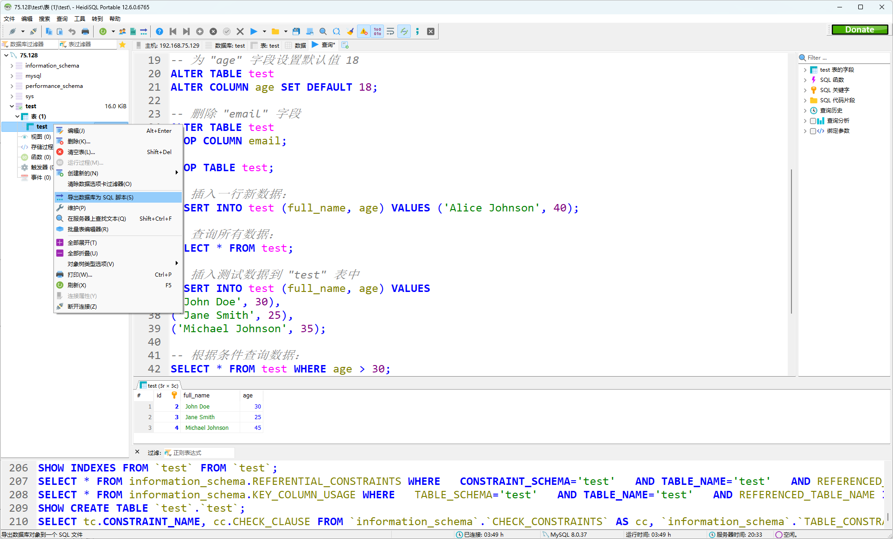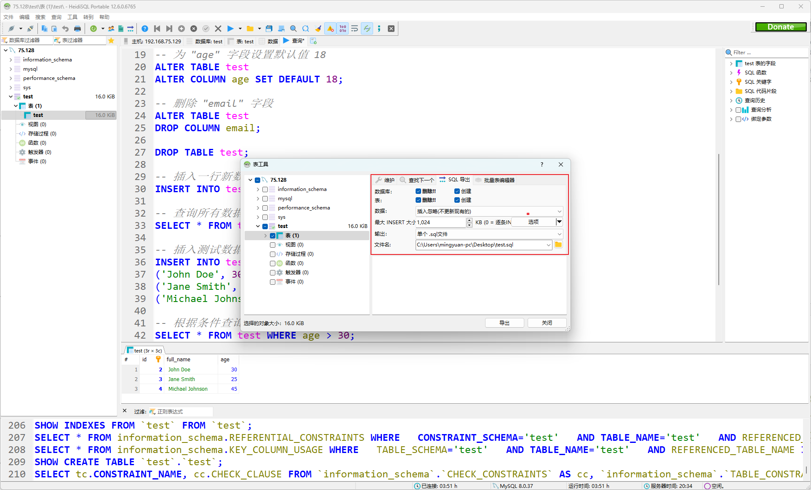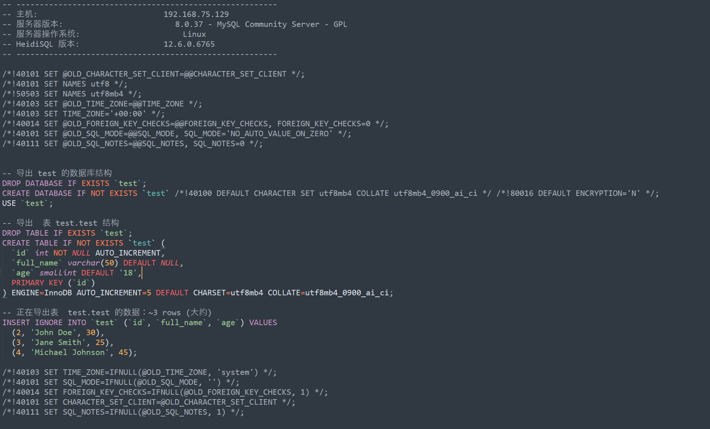

## 10.常用语句
```plsql
-- 补充测试数据
INSERT IGNORE INTO `test` (`full_name`, `age`) VALUES
    ('Emily Johnson', 28),
    ('David Lee', 35),
    ('Sophia Brown', 32),
    ('William Taylor', 35),
    ('Sophia Brown', 32),
    ('Sophia Brown', 32),
    ('Sophia Brown', 32),
    ('Sophia Brown', 32),
    ('William Taylor', 40),
    ('Olivia Wilson', 27),
    ('Michael Johnson', 32),
    ('Sophia Garcia', 25),
    ('Ethan Martinez', 38),
    ('Olivia Wilson', 27);

-- 查询年龄大于 30 岁的用户信息：
SELECT *
FROM test
WHERE age > 30;

-- 查询姓名为 'Jane Smith' 或 'Sophia Brown' 的用户信息：
SELECT *
FROM test
WHERE full_name IN ('Jane Smith', 'Sophia Brown');

-- 查询年龄在 25 到 35 岁之间的用户信息：
SELECT *
FROM test
WHERE age BETWEEN 25 AND 35;

-- 查询姓名以 'J' 开头的用户信息：
SELECT *
FROM test
WHERE full_name LIKE 'J%';

-- 查询年龄不等于 25 岁的用户信息：
SELECT *
FROM test
WHERE age != 25;

-- 聚合函数 COUNT：计算行数或非空值的数量。
SELECT COUNT(*) AS total_rows
FROM test;

-- DISTINCT：用于返回唯一不同的值。
SELECT DISTINCT age
FROM test;

-- LIMIT：用于限制返回的行数。
SELECT *
FROM test
LIMIT 5;

-- SUBSTR：用于提取字符串的子串
SELECT SUBSTR(full_name, 1, 5) AS short_name
FROM test;

-- 排序：按年龄升序排序，如果年龄相同，则按姓名排序。
SELECT *
FROM test
ORDER BY age ASC, full_name ASC;

-- 分组：按年龄分组，并统计每个年龄组中的用户数量。
SELECT age, COUNT(*) as count
FROM test
GROUP BY age;

-- 对年龄进行分组，并筛选出年龄大于等于 30 岁的组
SELECT age, COUNT(*) AS count
FROM test
GROUP BY age
HAVING age >= 30;

-- 正则匹配
-- 匹配姓名中包含 "Doe" 的用户信息：
SELECT *
FROM test
WHERE full_name REGEXP 'Doe';

-- 匹配年龄是两位数且第二位是 5 的用户信息：
SELECT *
FROM test
WHERE age REGEXP '^[0-9]5$';

-- 匹配全名以 "J" 开头并以 "n" 结尾的用户信息：
SELECT *
FROM test
WHERE full_name REGEXP '^J.*h$';

-- 匹配姓名中包含字母 "a" 或 "A" 的用户信息：
SELECT *
FROM test
WHERE full_name REGEXP '[aA]';

-- 匹配姓名中包含两个连续元音的用户信息：
SELECT *
FROM test
WHERE full_name REGEXP '[aeiou]{2}';
```

## 11.子查询
<font style="color:rgb(36, 41, 47);">子查询是一种在一个 SQL 语句中嵌入另一个查询的方式。子查询可以用于从表中选择数据，然后在外层查询中使用这些数据进行进一步操作。下面是几个常见的子查询示例，涵盖不同的场景。</font>

```plsql
-- 子查询与 WHERE 子句：查找年龄大于表中平均年龄的所有用户。  用在where子句中
SELECT full_name, age
FROM test
WHERE age > (SELECT AVG(age) FROM test);

-- 子查询与 IN 子句：查找年龄为 32 的所有用户。   用在查询结果集中
SELECT full_name, SELECT AVG(age) FROM test
FROM test
WHERE age IN (SELECT DISTINCT age FROM test WHERE age = 32);

-- 子查询与 EXISTS 子句：查找是否存在特定年龄的用户，并返回该用户的姓名。
SELECT full_name, age
FROM test
WHERE EXISTS (SELECT 1 FROM test WHERE age = 38);

-- 用在创建表
CREATE TABLE test1 SELECT * FROM test WHERE age > (SELECT AVG(age) FROM test);  

-- 用在插入数据
INSERT INTO test1 SELECT *FROM test WHERE age <= (SELECT AVG(age) FROM test);

-- 子查询与 JOIN： 使用子查询从其他表中提取数据并加入到主查询。
-- 假设有另一个表 `user_details` 包含用户的详细信息
CREATE TABLE IF NOT EXISTS user_details (
    full_name VARCHAR(50),
    address VARCHAR(100)
);

INSERT IGNORE INTO user_details (`full_name`, `address`) VALUES
    ('Emily Johnson', '123 Elm St'),
    ('David Lee', '456 Oak St'),
    ('Sophia Brown', '789 Pine St');

-- 使用子查询进行联接  用在联表中
SELECT t.full_name, t.age, ud.address
FROM test AS t
JOIN (SELECT full_name, address FROM user_details) AS ud
ON t.full_name = ud.full_name;

```

## 12.表关联
```plsql
-- 内连接 (INNER JOIN)：内连接返回两个表中匹配行的交集。
SELECT t.full_name, t.age, ud.address
FROM test AS t
INNER JOIN user_details AS ud ON t.full_name = ud.full_name;

-- 左连接 (LEFT JOIN)：左连接返回左表中的所有行，以及右表中匹配的行（如果有的话）。
SELECT t.full_name, t.age, ud.address
FROM test AS t
LEFT JOIN user_details AS ud ON t.full_name = ud.full_name;

-- 右连接 (RIGHT JOIN)：右连接返回右表中的所有行，以及左表中匹配的行（如果有的话）。
SELECT t.full_name, t.age, ud.address
FROM test AS t
RIGHT JOIN user_details AS ud ON t.full_name = ud.full_name;

-- 笛卡尔积查询： MySQL 将返回 test 中的每一行与 user_details 中的每一行的组合
SELECT * FROM test AS t, user_details AS ud;
```

## 13.索引
```plsql
-- 创建单列索引：
-- 创建单列索引在 full_name 列上
CREATE INDEX idx_full_name ON test (full_name);

-- 创建单列索引在 age 列上
CREATE INDEX idx_age ON test (age);

-- 创建多列索引：
-- 创建多列索引在 full_name 和 age 列上
CREATE INDEX idx_full_name_age ON test (full_name, age);

-- 测试SQL 建立索引前后，分析执行
SELECT * FROM test WHERE full_name = 'David Lee';

SELECT * FROM test WHERE full_name = 'David Lee' AND age = 35;

-- 删除 full_name 列上的索引
DROP INDEX idx_full_name ON test;

-- 删除 age 列上的索引
DROP INDEX idx_age ON test;

-- 删除 full_name 和 age 列上的多列索引
DROP INDEX idx_full_name_age ON test;
```

## 常见 MySQL 命令合集
```plsql
连接到 MySQL 服务器：
mysql -u 用户名 -p

创建数据库：
CREATE DATABASE 数据库名;

删除数据库：
DROP DATABASE 数据库名;

使用数据库：
USE 数据库名;

显示数据库列表：
SHOW DATABASES;

显示表列表：
SHOW TABLES;

创建表：
CREATE TABLE 表名 (
  列名1 数据类型1,
  列名2 数据类型2,
  ...
);

删除表：
DROP TABLE 表名;

插入数据：
INSERT INTO 表名 (列1, 列2, 列3, ...) VALUES (值1, 值2, 值3, ...);
查询数据：
SELECT 列1, 列2, ... FROM 表名 WHERE 条件;

更新数据：
UPDATE 表名 SET 列1 = 值1, 列2 = 值2 WHERE 条件;

删除数据：
DELETE FROM 表名 WHERE 条件;
```

## Windows 安装 msi 文件完整图示：


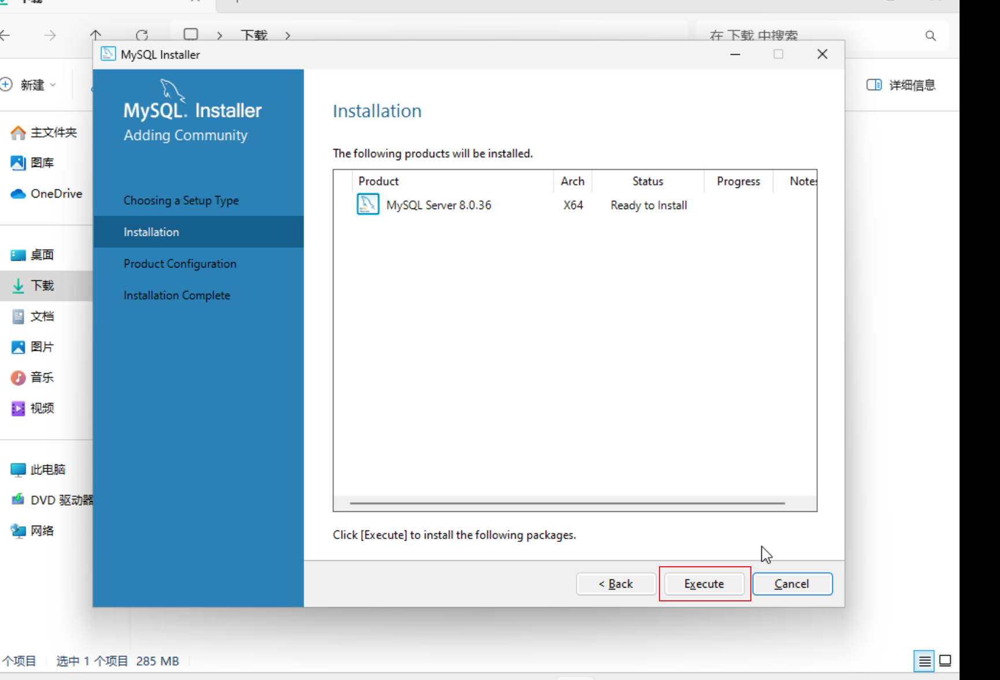

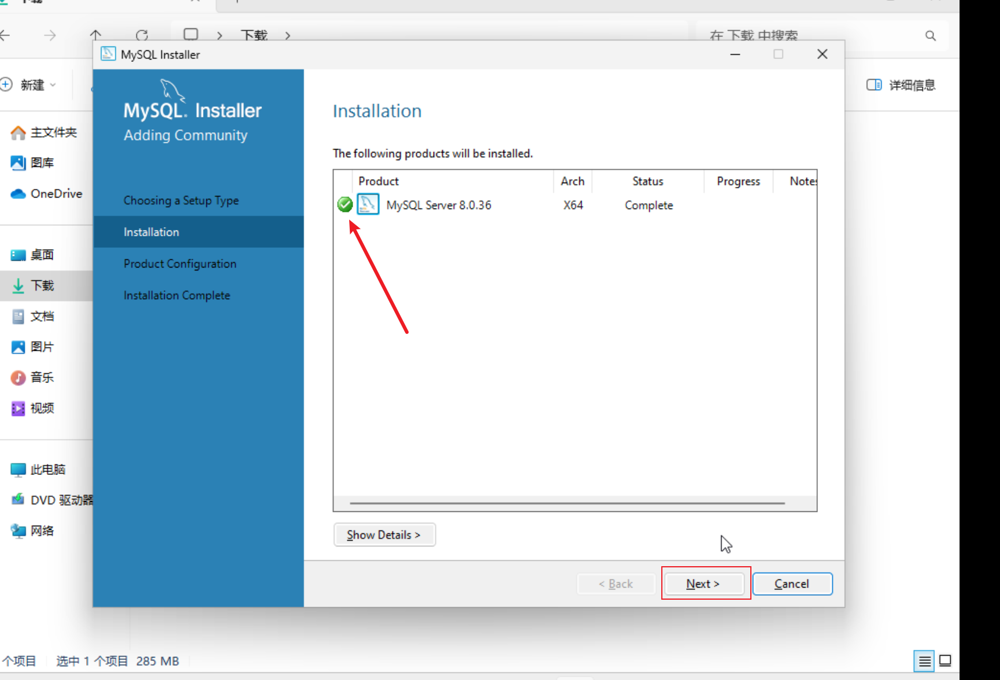

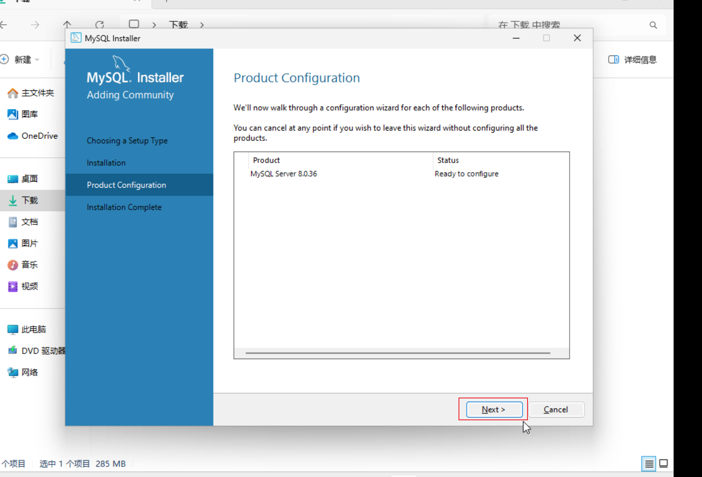

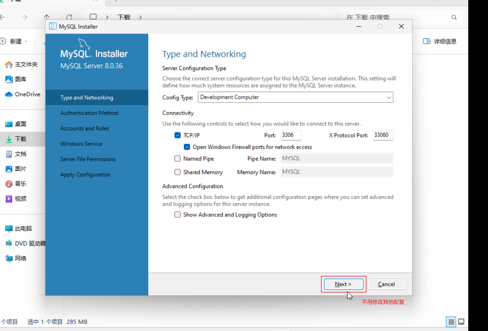

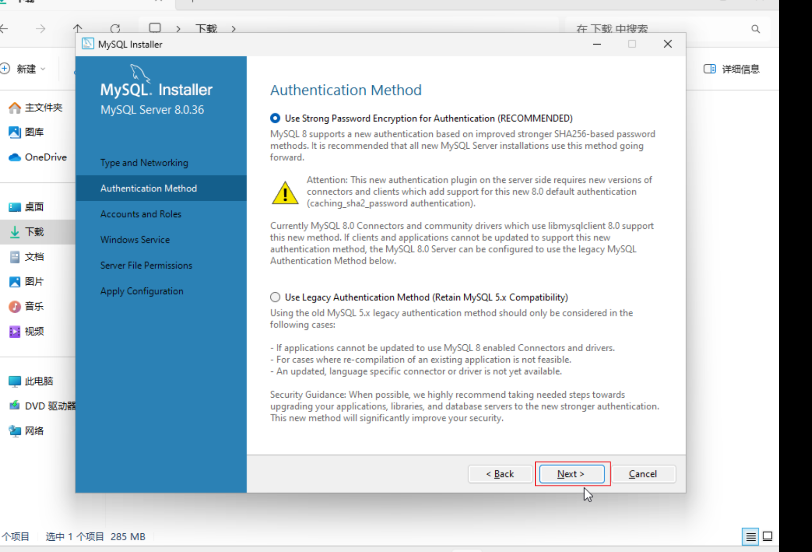


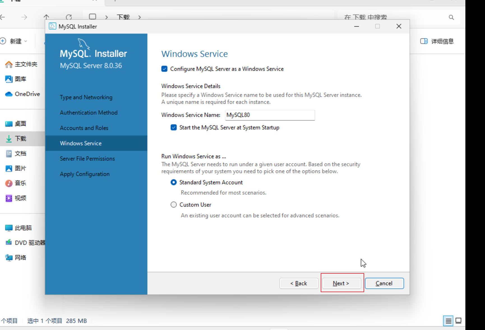

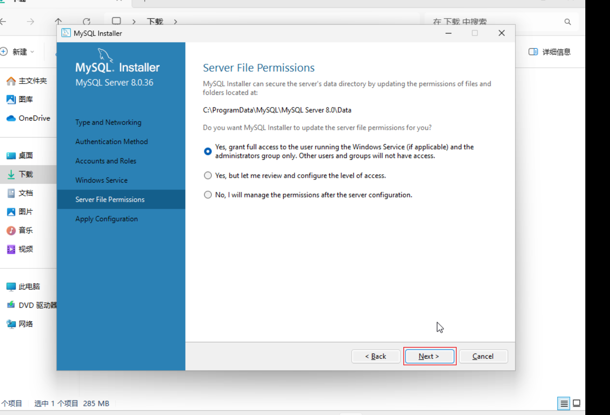

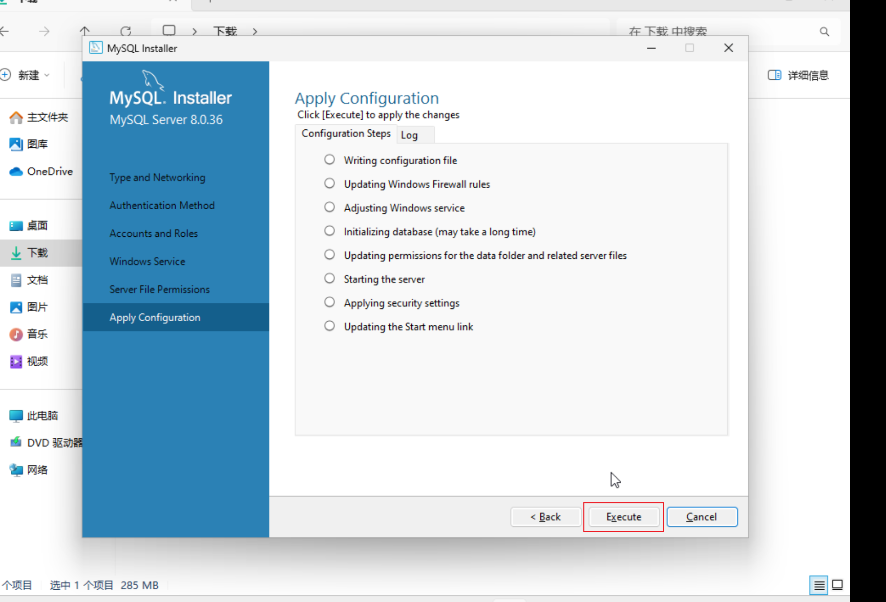

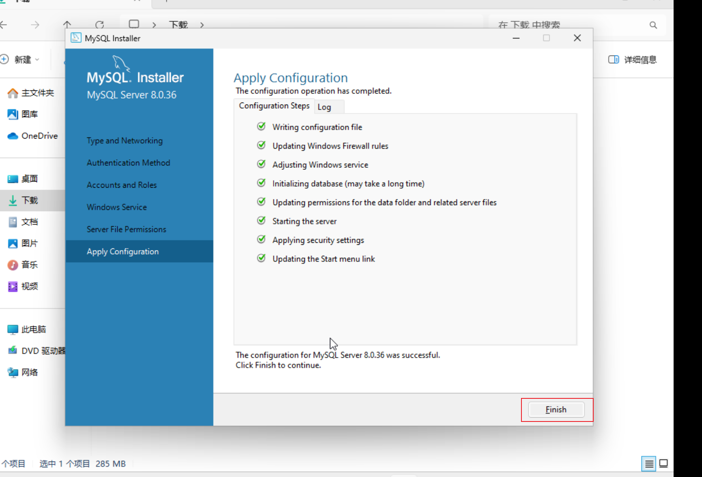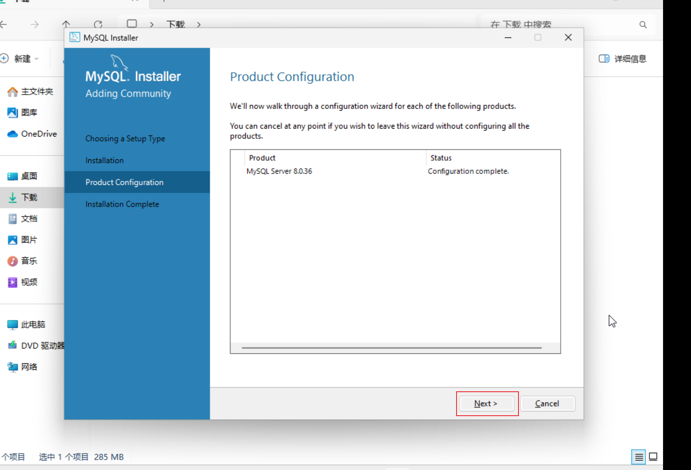

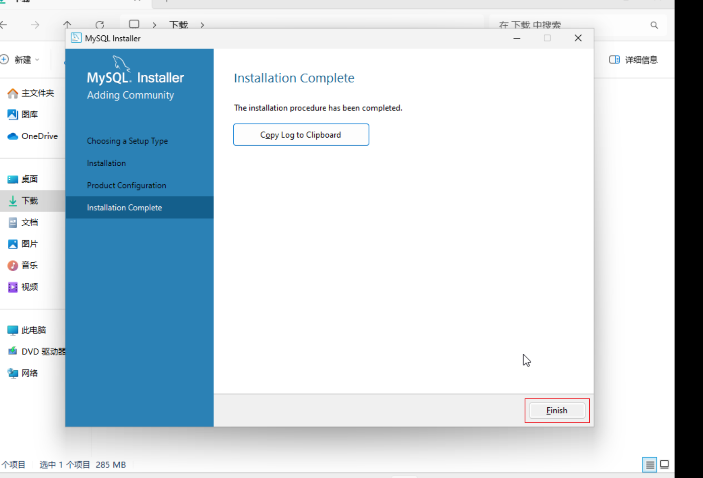


> 更新: 2024-08-15 21:40:22  
> 原文: <https://www.yuque.com/tulingzhouyu/db22bv/bkgyx9eokguvv3tm>