# 👠一å°æ—¶å¿«é€Ÿå…¥é—¨æ•°æ®åŒæ­¥ç¥å™¨-Canal

# <font style="color:rgb(0, 0, 0);">å‰è¨€</font>
<font style="color:rgb(36, 41, 46);">之å‰åœ¨è®²è§£ Redisã€MySQL åŒå†™ä¸€è‡´æ€§é—®é¢˜çš„时候，æ到我们å¯ä»¥é‡‡ç”¨ canal 组件，æ¥</font><font style="color:rgb(38, 38, 38);">å®ç°æ•°æ®ä¸€è‡´æ€§ï¼Œé‚£æœ¬æ–‡å°±å¸¦å¤§å®¶å¿«é€Ÿä¸Šæ‰‹ canal 组件的使用。</font>

<font style="color:rgb(38, 38, 38);">本文主è¦æ˜¯ä»äº”个维度带大家快速上手 canal 组件。</font>

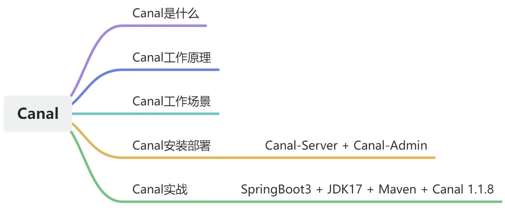

# <font style="color:rgb(0, 0, 0);">一ã€Canal是什么</font>
基å‹ç½‘地å€ï¼š[https://github.com/alibaba/canal](https://github.com/alibaba/canal)

<font style="color:rgb(36, 41, 46);">官网的介ç»</font>

:::tips
Canal，译æ„为水é“/管é“/沟渠，主è¦ç”¨é€”æ˜¯åŸºäº MySQL æ•°æ®åº“å¢é‡æ—¥å¿—解æ，æä¾›å¢é‡æ•°æ®è®¢é˜…和消费。

:::

<font style="color:rgb(36, 41, 46);">è¿™å¥ä»‹ç»æœ‰å‡ ä¸ªå…³é”®å­—：</font>**<font style="color:rgb(36, 41, 46);">å¢é‡æ—¥å¿—，å¢é‡æ•°æ®è®¢é˜…和消费</font>**<font style="color:rgb(36, 41, 46);">。</font>

<font style="color:rgb(36, 41, 46);">这里我们å¯ä»¥ç®€å•åœ°æŠŠcanalç†è§£ä¸ºä¸€ä¸ªç”¨æ¥</font>**<font style="color:rgb(36, 41, 46);">åŒæ­¥å¢é‡æ•°æ®çš„一个工具</font>**<font style="color:rgb(36, 41, 46);">。</font>

<font style="color:rgb(36, 41, 46);">æ¥ä¸‹æ¥æˆ‘们看一张官网æ供的示æ„图：</font>


# <font style="color:rgb(36, 41, 46);">二ã€Canal 工作åŸç†</font>
在了解 Canal 工作åŸç†ä¹‹å‰ï¼Œå¤§å®¶éœ€è¦å…ˆå¯¹ MySQL 的主ä»å¤åˆ¶åŸç†æœ‰æ‰€äº†è§£ï¼Œå› ä¸º Canal 就是借助 MySQL 的主ä»æœºåˆ¶æ¥å·¥ä½œæ»´ã€‚

## <font style="color:rgb(36, 41, 46);">MySQL主ä»å¤åˆ¶åŸç†</font>


+ <font style="color:rgb(36, 41, 46);">MySQL master 将数æ®å˜æ›´å†™å…¥äºŒè¿›åˆ¶æ—¥å¿—binary log，简称Binlog。</font>
+ <font style="color:rgb(36, 41, 46);">MySQL slave å°† master çš„ binary log æ‹·è´åˆ°å®ƒçš„中继日志(relay log)</font>
+ <font style="color:rgb(36, 41, 46);">MySQL slave é‡æ”¾ relay log æ“作，将å˜æ›´æ•°æ®åŒæ­¥åˆ°æœ€æ–°ã€‚</font>

## Canal 工作åŸç†
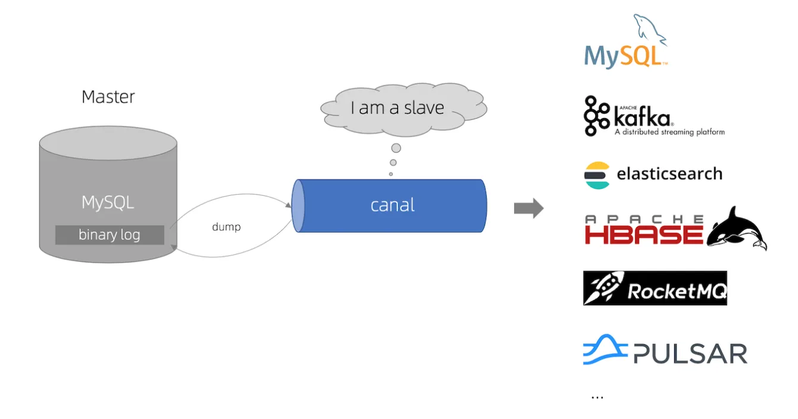

+ Canal 将自己伪装为 MySQL slave(ä»åº“) ï¼Œå‘ MySQL master (主库) å‘é€dump åè®®
+ MySQL master (主库) 收到 dump 请求，开始æ¨é€ binary log ç»™ canal
+ Canal æ¥æ”¶å¹¶è§£æ Binlog 日志，得到å˜æ›´æ•°æ®ï¼Œ**<font style="color:rgb(36, 41, 46);">å†å‘é€åˆ°å­˜å‚¨ç›®çš„地</font>**<font style="color:rgb(36, 41, 46);">，比如MySQL，Kafka，Elastic Search等等</font>

## <font style="color:rgb(36, 41, 46);">MySQL Binlog日志</font>
<font style="color:rgb(36, 41, 46);">MySQL çš„Binlogå¯ä»¥è¯´ MySQL 最é‡è¦çš„日志，它记录了所有的 DDL å’Œ DML语å¥ï¼Œä»¥äº‹ä»¶å½¢å¼è®°å½•ã€‚</font>

<font style="color:rgb(36, 41, 46);">MySQL默认情况下是ä¸å¼€å¯Binlog，因为记录Binlog日志需è¦æ¶ˆè€—时间，官方给出的数æ®æ˜¯æœ‰1%的性能æŸè€—。</font>

<font style="color:rgb(36, 41, 46);">具体开ä¸å¼€å¯ï¼Œå¼€å‘中需è¦æ ¹æ®å®é™…情况åšå–èˆã€‚</font>

<font style="color:rgb(36, 41, 46);">一般æ¥è¯´ï¼Œåœ¨ä¸‹é¢ä¸¤åœºæ™¯ä¸‹ä¼šå¼€å¯Binlog日志: </font>

+ <font style="color:rgb(36, 41, 46);">MySQL 主ä»é›†ç¾¤éƒ¨ç½²æ—¶ï¼Œéœ€è¦å°†åœ¨ Master ç«¯å¼€å¯ Binlog，方便将数æ®åŒæ­¥åˆ°Slaves中。</font>
+ <font style="color:rgb(36, 41, 46);">æ•°æ®æ¢å¤äº†ï¼Œé€šè¿‡ä½¿ç”¨ MySQL Binlog 工具æ¥ä½¿æ¢å¤æ•°æ®ã€‚</font>

### <font style="color:rgb(36, 41, 46);">Binlog的分类</font>
<font style="color:rgb(36, 41, 46);">MySQL Binlog çš„æ ¼å¼æœ‰ä¸‰ç§ï¼Œåˆ†åˆ«æ˜¯ STATEMENT,MIXED,ROW。在é…置文件中å¯ä»¥é€‰æ‹©é…</font>

<font style="color:rgb(36, 41, 46);">置 binlog_format= </font>**statement**<font style="color:rgb(36, 41, 46);">|</font>**mixed**<font style="color:rgb(36, 41, 46);">|</font>**row**<font style="color:rgb(36, 41, 46);">。</font>

| <font style="color:rgb(36, 41, 46);">分类</font> | <font style="color:rgb(36, 41, 46);">介ç»</font> | <font style="color:rgb(36, 41, 46);">优点</font> | <font style="color:rgb(36, 41, 46);">缺点</font> |
| :---: | :--- | :---: | :---: |
| <font style="color:rgb(36, 41, 46);">STATEMENT</font> | <font style="color:rgb(36, 41, 46);">语å¥çº§åˆ«ï¼Œè®°å½•æ¯ä¸€æ¬¡æ‰§è¡Œå†™æ“作的语å¥ï¼Œç›¸å¯¹äºROW模å¼èŠ‚çœäº†ç©ºé—´ï¼Œä½†æ˜¯å¯èƒ½äº§ç”Ÿæ•°æ®ä¸ä¸€è‡´å¦‚update tt set create_date=now()，由äºæ‰§è¡Œæ—¶é—´ä¸åŒäº§ç”Ÿé¥¿å¾—æ•°æ®å°±ä¸åŒ</font> | <font style="color:rgb(36, 41, 46);">节çœç©ºé—´</font> | <font style="color:rgb(36, 41, 46);">å¯èƒ½é€ æˆæ•°æ®ä¸ä¸€è‡´</font> |
| <font style="color:rgb(36, 41, 46);">ROW</font> | <font style="color:rgb(36, 41, 46);">行级，记录æ¯æ¬¡æ“作åæ¯è¡Œè®°å½•çš„å˜åŒ–。å‡å¦‚一个updateçš„sql执行结æœæ˜¯1万行statementåªå­˜ä¸€æ¡ï¼Œå¦‚æœæ˜¯rowçš„è¯ä¼šæŠŠè¿™ä¸ª1万行的结æœå­˜ç€ã€‚</font> | <font style="color:rgb(36, 41, 46);">ä¿æŒæ•°æ®çš„ç»å¯¹ä¸€è‡´æ€§ã€‚因为ä¸ç®¡sql是什么，引用了什么函数，他åªè®°å½•æ‰§è¡Œå的效æœ</font> | <font style="color:rgb(36, 41, 46);">å ç”¨è¾ƒå¤§ç©ºé—´</font> |
| <font style="color:rgb(36, 41, 46);">MIXED</font> | <font style="color:rgb(36, 41, 46);">是对statementçš„å‡çº§ï¼Œå¦‚å½“å‡½æ•°ä¸­åŒ…å« UUID() æ—¶ï¼ŒåŒ…å« AUTO_INCREMENT 字段的表被更新时，执行 INSERT DELAYED 语å¥æ—¶ï¼Œç”¨ UDF 时，会按照 ROWçš„æ–¹å¼è¿›è¡Œå¤„ç†</font> | <font style="color:rgb(36, 41, 46);">节çœç©ºé—´ï¼ŒåŒæ—¶å…¼é¡¾äº†ä¸€å®šçš„一致性</font> | <font style="color:rgb(36, 41, 46);">还有些æ个别情况ä¾æ—§ä¼šé€ æˆä¸ä¸€è‡´ï¼Œå¦å¤–statementå’Œmixed对äºéœ€è¦å¯¹binlog的监æ§çš„情况都ä¸æ–¹ä¾¿</font> |


**综åˆä¸Šé¢å¯¹æ¯”，Canal 想åšç›‘æ§åˆ†æ，选择 row æ ¼å¼æ¯”较åˆé€‚。**

# <font style="color:rgb(0, 0, 0);">三ã€Canal è¿ç”¨åœºæ™¯</font>
## æ•°æ®åŒæ­¥
<font style="color:rgb(51, 51, 51);">Canal å¯ä»¥å¸®åŠ©ç”¨æˆ·è¿›è¡Œå¤šç§æ•°æ®åŒæ­¥æ“作，如å®æ—¶åŒæ­¥ MySQL æ•°æ®åˆ° Elasticsearchã€Redis 等数æ®å­˜å‚¨ä»‹è´¨ä¸­ã€‚</font>

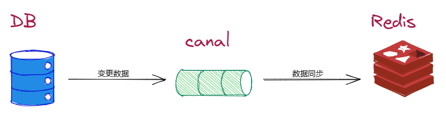

## <font style="color:rgb(51, 51, 51);">æ•°æ®åº“å®æ—¶ç›‘æ§</font>
<font style="color:rgb(51, 51, 51);">Canal å¯ä»¥å®æ—¶ç›‘æ§ MySQL çš„æ›´æ–°æ“作，对äºæ•æ„Ÿæ•°æ®çš„修改å¯ä»¥åŠæ—¶é€šçŸ¥ç›¸å…³äººå‘˜ã€‚</font>

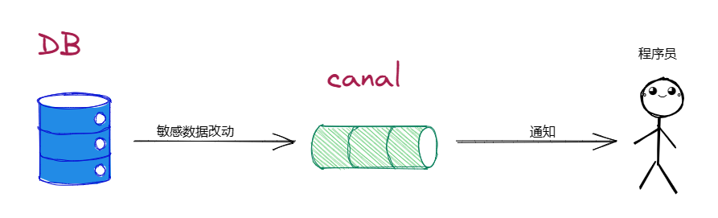

## <font style="color:rgb(51, 51, 51);">æ•°æ®åˆ†æ和挖æ˜</font>
<font style="color:rgb(51, 51, 51);">Canal å¯ä»¥å°† MySQL å¢é‡æ•°æ®æŠ•é€’到 Kafka 等消æ¯é˜Ÿåˆ—中，为数æ®åˆ†æ和挖æ˜æ供数æ®æ¥æºã€‚</font>

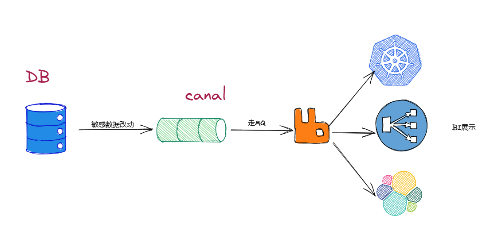<font style="color:rgb(51, 51, 51);"></font>

## <font style="color:rgb(51, 51, 51);">æ•°æ®åº“备份</font>
<font style="color:rgb(51, 51, 51);">Canal å¯ä»¥å°† MySQL 主库上的数æ®å¢é‡æ—¥å¿—å¤åˆ¶åˆ°å¤‡åº“上，å®ç°æ•°æ®åº“备份。</font>

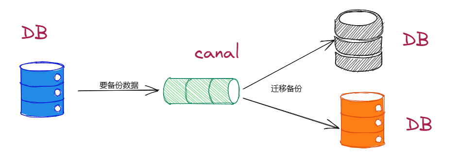

## <font style="color:rgb(51, 51, 51);">æ•°æ®é›†æˆ</font>
<font style="color:rgb(51, 51, 51);">Canal å¯ä»¥å°†å¤šä¸ª MySQL æ•°æ®åº“中的数æ®è¿›è¡Œé›†æˆï¼Œä¸ºæ•°æ®å¤„ç†æ供更加高效å¯é çš„解决方案。</font>

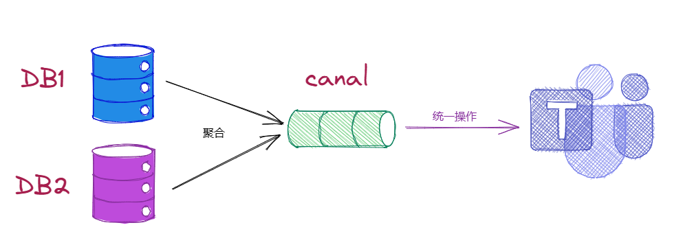

## <font style="color:rgb(51, 51, 51);">æ•°æ®åº“è¿ç§»</font>
<font style="color:rgb(51, 51, 51);">Canal å¯ä»¥ååŠ©å®Œæˆ MySQL æ•°æ®åº“的版本å‡çº§åŠæ•°æ®è¿ç§»ä»»åŠ¡ã€‚</font>

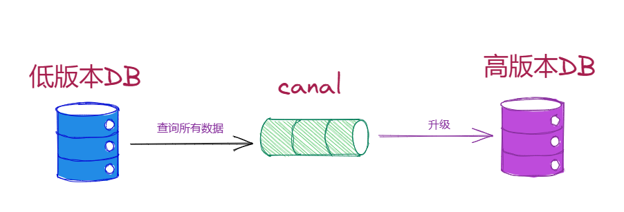

# <font style="color:rgb(0, 0, 0);">å››ã€Canal安装部署</font>
## <font style="color:rgb(24, 24, 24) !important;">MySQL é…ç½®</font>
首先我们需è¦ä¸€ä¸ª MySQL çš„æœåŠ¡ï¼Œå¦‚æœæ²¡æœ‰ MySQL æœåŠ¡ï¼Œå¯ä»¥çœ‹ä¸‹è¿™ä¸ªæ•™ç¨‹[入门+安装+é¢è¯•é¢˜](https://www.yuque.com/tulingzhouyu/db22bv/bkgyx9eokguvv3tm?singleDoc# 《一å°æ—¶å¿«é€Ÿå…¥é—¨MySQL》 密ç ï¼šyk3o)

<font style="color:rgb(36, 41, 46);">当å‰çš„ canal æ”¯æŒ MySQL 版本包括 5.1.x , 5.5.x , 5.6.x , 5.7.x , 8.0.x</font>

<font style="color:rgb(36, 41, 46);">æˆ‘å½“å‰ LinuxæœåŠ¡å™¨å®‰è£…çš„MySQLæœåŠ¡å™¨æ˜¯ 8.x 版本。</font>

### <font style="color:rgb(36, 41, 46);">MySQL æœåŠ¡å™¨é…置文件处ç†</font>
#### 检查é…置是å¦æ­£å¸¸
有了 MySQL æœåŠ¡ä¹‹å，大家å¯ä»¥æ‰§è¡Œä¸‹é¢çš„ SQL 查看 MySQL çš„é…置是å¦æ­£å¸¸ã€‚

```plsql
-- 查看是å¦å¼€å¯bin_log = ON
SHOW VARIABLES LIKE 'log_bin';
-- 查看bin_log日志文件
SHOW BINARY LOGS;
-- 查看bin_log写入状æ€
SHOW MASTER STATUS;
-- 查看bin_logå­˜å‚¨æ ¼å¼ = row
SHOW VARIABLES LIKE 'binlog_format';
-- 查看数æ®åº“æœåŠ¡id = 1
SHOW VARIABLES LIKE 'server_id';
```

#### é…ç½®ä¸æ­£å¸¸
##### 修改å¯åŠ¨é…置加载项
如æœè¯´æ²¡æœ‰ä¸Šé¢çš„é…置，ä¸é¢„期ä¸ç¬¦ï¼Œå¤§å®¶éœ€è¦ä¿®æ”¹é…置文件 my.cnf（Linux）或者 my.ini（windows）

åŒæ—¶éœ€è¦æ³¨æ„，Linux ç¯å¢ƒä¸‹ï¼Œéœ€è¦æ£€æŸ¥æœåŠ¡æ˜¯å¦åŠ è½½äº† my.cnf，如æœæ²¡æœ‰éœ€è¦ä¿®æ”¹å¯åŠ¨åŠ è½½é…置文件。

<font style="color:rgb(36, 41, 46);">我们å¯ä»¥é€šè¿‡æŸ¥çœ‹ MySQL 的状æ€è·å–到é…置文件</font>

```powershell
systemctl status mysqld.service
```

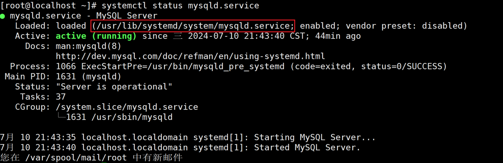

找到之å我们看下当å‰å¯åŠ¨æ—¶åŠ è½½é‚£ä¸ªé…置文件

```powershell
cat /usr/lib/systemd/system/mysqld.service
```

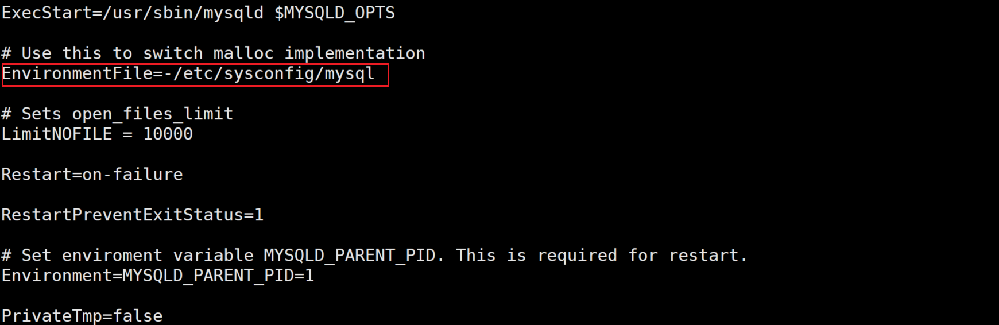

修改é…置文件为 my.cnf，一般æ¥è¯´ my.cnf 会自动生æˆï¼Œæˆ‘们å¯ä»¥ç›´æ¥æ ¹ç›®å½•æœç´¢ï¼Œæˆ–者自己创建一个

```powershell
find -type f -name 'my.cnf'
```


找到之åå°† /etc/my.cnf 路径é…置到 environmentFile å±æ€§ä¸Š

```powershell
vim /usr/lib/systemd/system/mysqld.service
```

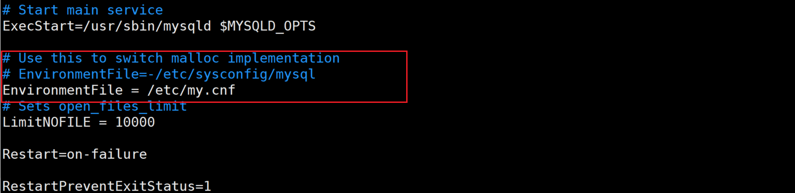

##### 修改 my.cnf é…置文件
```powershell
vim /etc/my.cnf
```

```powershell
log-bin=mysql-bin # å¼€å¯ binlog
binlog-format=ROW # 选择 ROW 模å¼
server_id=1 # é…ç½® MySQL replaction 需è¦å®šä¹‰ï¼Œä¸è¦å’Œ canal çš„ slaveId é‡å¤
```

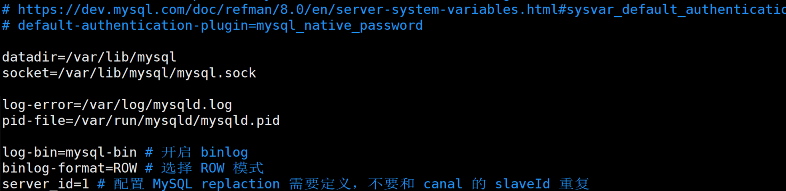

é…置完æˆä¹‹å，é‡å¯ MySQL æœåŠ¡

```powershell
systemctl restart mysqld.service
```

<font style="color:rgb(36, 41, 46);">使用命令查看是å¦æ‰“å¼€binlog模å¼ï¼š</font>

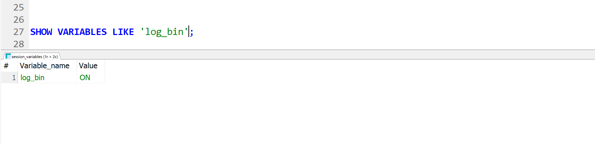

<font style="color:rgb(36, 41, 46);">查看binlog日志文件列表：</font>

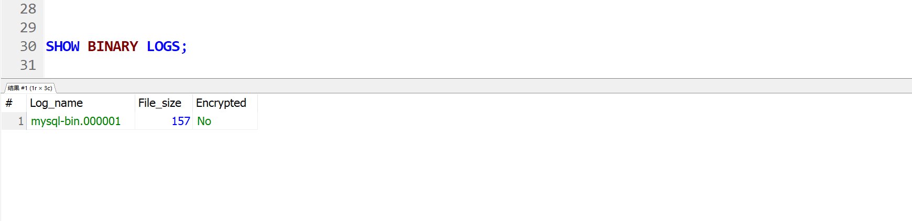

<font style="color:rgb(36, 41, 46);">查看当å‰æ­£åœ¨å†™å…¥çš„binlog文件：</font>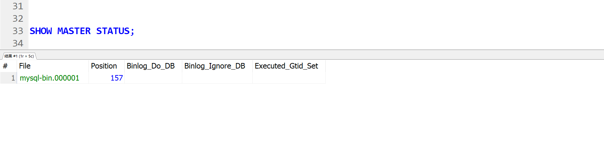

<font style="color:rgb(36, 41, 46);">MySQLæœåŠ¡å™¨è¿™è¾¹åŸºæœ¬ä¸Šå°±æ定了，很简å•ã€‚</font>

<font style="color:rgb(36, 41, 46);">如æœè¯´å¤§å®¶æƒ³ç”¨å•ç‹¬çš„è´¦å·ç»™ Canal，å•ç‹¬åˆ›å»ºä¸€ä¸ªç”¨æˆ·å¹¶æˆæƒå°±å¯ä»¥äº†ï¼š</font>

```plsql
-- 使用命令登录：mysql -u root -p
-- 创建用户 用户å：canal 密ç ï¼šCanal@123456
create user 'canal'@'%' identified by 'Canal@123456';
-- æˆæƒ *.*表示所有库
grant SELECT, REPLICATION SLAVE, REPLICATION CLIENT on *.* to 'canal'@'%' identified by 'Canal@123456';
```

### MySQL æ•°æ®é…ç½®
创建测试库ã€è¡¨

```plsql
CREATE DATABASE test;

DROP TABLE test;

CREATE TABLE `test` (
  `id` INT(10) NOT NULL AUTO_INCREMENT,
  `full_name` VARCHAR(50) NULL DEFAULT NULL COLLATE 'utf8mb4_0900_ai_ci',
  `age` SMALLINT(5) NULL DEFAULT '18',
  PRIMARY KEY (`id`) USING BTREE
) COLLATE='utf8mb4_0900_ai_ci' ENGINE=InnoDB AUTO_INCREMENT=1;
```

准备好相应的测试数æ®

```plsql
INSERT IGNORE INTO `test` (`id`, `full_name`, `age`) VALUES (1, 'Alice Johnson', 40);
INSERT IGNORE INTO `test` (`id`, `full_name`, `age`) VALUES (2, 'John Doe', 30);
INSERT IGNORE INTO `test` (`id`, `full_name`, `age`) VALUES (3, 'Jane Smith', 25);
INSERT IGNORE INTO `test` (`id`, `full_name`, `age`) VALUES (4, 'Michael Johnson', 35);
INSERT IGNORE INTO `test` (`id`, `full_name`, `age`) VALUES (5, 'Emily Johnson', 28);
INSERT IGNORE INTO `test` (`id`, `full_name`, `age`) VALUES (6, 'David Lee', 35);
INSERT IGNORE INTO `test` (`id`, `full_name`, `age`) VALUES (7, 'Sophia Brown', 32);
INSERT IGNORE INTO `test` (`id`, `full_name`, `age`) VALUES (8, 'William Taylor', 35);
INSERT IGNORE INTO `test` (`id`, `full_name`, `age`) VALUES (9, 'Sophia Brown', 32);
INSERT IGNORE INTO `test` (`id`, `full_name`, `age`) VALUES (10, 'Sophia Brown', 32);
INSERT IGNORE INTO `test` (`id`, `full_name`, `age`) VALUES (11, 'Sophia Brown', 32);
INSERT IGNORE INTO `test` (`id`, `full_name`, `age`) VALUES (12, 'Sophia Brown', 32);
INSERT IGNORE INTO `test` (`id`, `full_name`, `age`) VALUES (13, 'William Taylor', 40);
INSERT IGNORE INTO `test` (`id`, `full_name`, `age`) VALUES (14, 'Olivia Wilson', 27);
INSERT IGNORE INTO `test` (`id`, `full_name`, `age`) VALUES (15, 'Michael Johnson', 32);
INSERT IGNORE INTO `test` (`id`, `full_name`, `age`) VALUES (16, 'Sophia Garcia', 25);
INSERT IGNORE INTO `test` (`id`, `full_name`, `age`) VALUES (17, 'Ethan Martinez', 38);
INSERT IGNORE INTO `test` (`id`, `full_name`, `age`) VALUES (18, 'Olivia Wilson', 27);

DELETE FROM test WHERE id = 1;
```

## <font style="color:rgb(24, 24, 24) !important;">安装 Canal</font>
<font style="color:rgb(36, 41, 46);">å»å®˜ç½‘下载页é¢è¿›è¡Œä¸‹è½½ï¼š</font>[https://github.com/alibaba/canal/releases](https://github.com/alibaba/canal/releases)

<font style="color:rgb(36, 41, 46);">我这里下载的是1.1.8-alpha 版本（测试 1.1.8-alpha-2 有点问题）：</font>

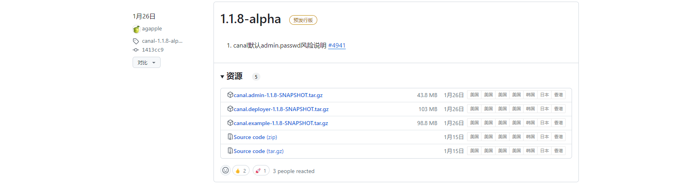

上传文件到æœåŠ¡å™¨ï¼Œç„¶å解å‹ï¼Œå…ˆå¤„ç† deployer 包，**注æ„文件目录**

```plsql
# 创建应用目录
mkdir -p /opt/software/canal/canal-dev
mkdir -p /opt/software/canal/canal-admin
# 上传
rz  
# 解å‹
tar -zxvf canal.deployer-1.1.8-SNAPSHOT.tar.gz
# 删除无用的包
rm -rf canal.deployer-1.1.8-SNAPSHOT.tar.gz
```

<font style="color:rgb(36, 41, 46);">解å‹</font>**<font style="color:rgb(36, 41, 46);">canal.deployer-1.1.8.tar.gz</font>**<font style="color:rgb(36, 41, 46);">，我们å¯ä»¥çœ‹åˆ°é‡Œé¢æœ‰å››ä¸ªæ–‡ä»¶å¤¹ï¼š</font>

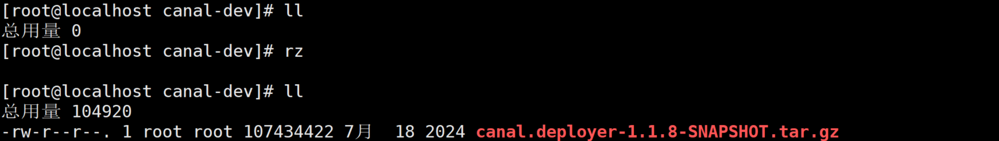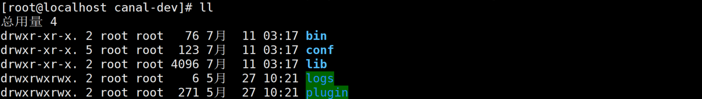

<font style="color:rgb(36, 41, 46);">å°† admin 包åšåŒæ ·çš„处ç†</font>

```plsql
# 上传
rz  
# 解å‹
tar -zxvf canal.deployer-1.1.8-SNAPSHOT.tar.gz
# 删除无用的包
rm -rf canal.admin-1.1.8-SNAPSHOT.tar.gz 
```

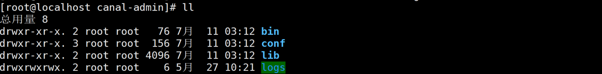

ç”±äºæˆ‘们采用的 admin æ¥ç®¡ç† Canal，因此我们åªéœ€è¦å°† Canal æœåŠ¡æ³¨å†Œåˆ° admin，然å通过 admin æ¥åˆ›å»º instance åŒæ­¥ MySQL çš„å˜æ›´ã€‚

### Canal-admin æœåŠ¡
```plsql
# 切æ¢åˆ°admin目录
cd /opt/software/canal/canal-admin

# 修改 application é…置文件
ll conf/
vim conf/application.yml
```

```yaml
server:
  port: 8089
spring:
  jackson:
    date-format: yyyy-MM-dd HH:mm:ss
    time-zone: GMT+8

spring.datasource:
  # mysql相关é…ç½®
  address: 192.168.75.129:3306
  database: canal_manager
  username: root
  password: 1qaz@WSX
  driver-class-name: com.mysql.jdbc.Driver
  url: jdbc:mysql://${spring.datasource.address}/${spring.datasource.database}?useUnicode=true&characterEncoding=UTF-8&useSSL=false
  hikari:
    maximum-pool-size: 30
    minimum-idle: 1

canal:
  adminUser: admin
  adminPasswd: admin

```

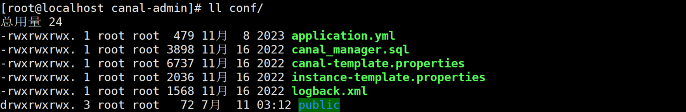

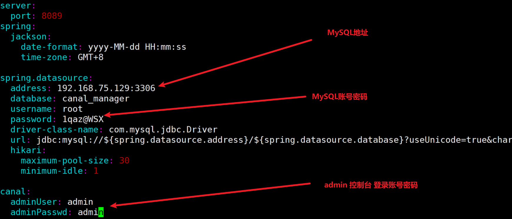

在å¯åŠ¨ admin æœåŠ¡ä¹‹å‰ï¼Œæˆ‘们需è¦å°† conf 目录下 SQL 文件，在数æ®åº“执行，因为 admin ç®¡ç† Canal 是将é…置数æ®å­˜åˆ°äº†æ•°æ®åº“中，所以需è¦ç›¸åº”的库ä¸è¡¨ï¼ŒCanal å·²ç»å‡†å¤‡å¥½äº†

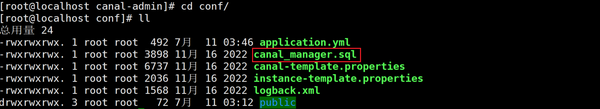


万事俱备，ç°åœ¨å¯åŠ¨ admin æœåŠ¡ï¼Œä½¿ç”¨ bin 目录下 startup.sh

```plsql
./startup.sh
```

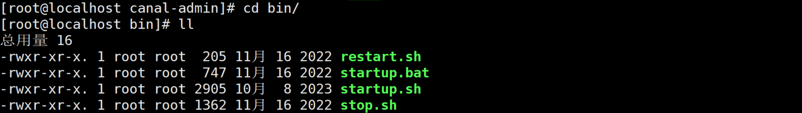

访问æœåŠ¡åœ°å€+ç«¯å£ 8089，账å·å¯†ç  admin/123456，（数æ®åº“中 canal_user 表é…置了相关的账å·ä¿¡æ¯ï¼‰

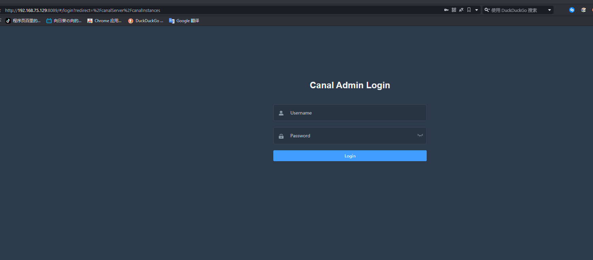

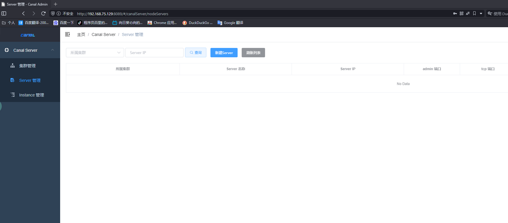

### Canal-deployer æœåŠ¡
æ¥ä¸‹æ¥å®Œæˆ deployer çš„é…置，然å注册到 admin

```plsql
# 切æ¢ç›®å½•
cd /opt/software/canal/canal-dev
# 查看confé…ç½®
ll conf
# 修改é…置，需è¦æ³¨æ„，canal.propertiesé…置很多，有些我们åˆæœŸä½¿ç”¨ä¸åˆ°ï¼Œè¿™é‡Œå°±é‡‡ç”¨localé…ç½®
vim conf/canal_local.properties
```

```properties
# register ip 本机地å€
canal.register.ip = 192.168.75.129

# canal admin config è¿è¡Œcanal-admin地å€
canal.admin.manager = 192.168.75.129:8089
canal.admin.port = 11110
canal.admin.user = admin
canal.admin.passwd = 4ACFE3202A5FF5CF467898FC58AAB1D615029441
# admin auto register å¼€å¯è‡ªåŠ¨æ³¨å†Œåˆ°canal-admin
canal.admin.register.auto = true
# 注册集群å称，如æœä¸å¡«å†™åˆ™ä¸ºå•æœºèŠ‚点
canal.admin.register.cluster =
# 节点å称
canal.admin.register.name = 999
```

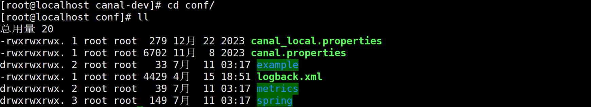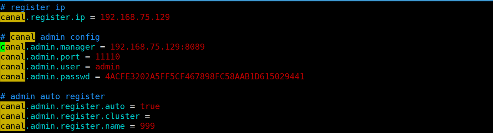

å¯åŠ¨ canal-deployer æœåŠ¡ï¼Œå†æ¥æŸ¥çœ‹ admin 页é¢ï¼Œå‡ºç° deployer æœåŠ¡ï¼Œå¯åŠ¨æ­£å¸¸

```plsql
# å¯åŠ¨ deployeræœåŠ¡ï¼Œæ³¨æ„目录。
./bin/startup.sh local
```

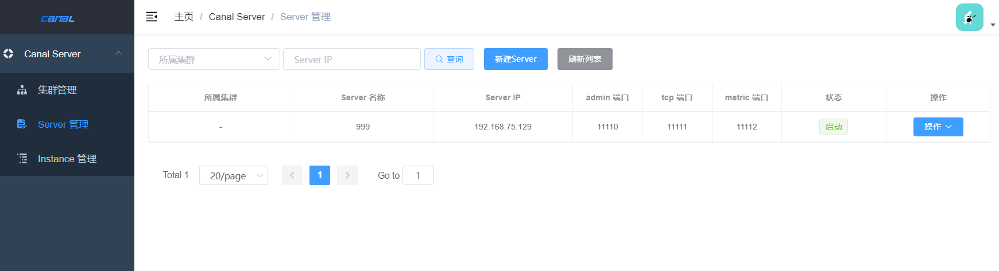

### Canal-Instance æœåŠ¡
**<font style="color:#DF2A3F;">如æœåˆ›å»º Instance åå¯åŠ¨å¤±è´¥ï¼Œéœ€è¦æ‰‹åŠ¨å¯¼å…¥ druid Jar 包</font>**

ç›´æ¥åœ¨ admin 页é¢åˆ›å»º Instance æœåŠ¡ã€‚

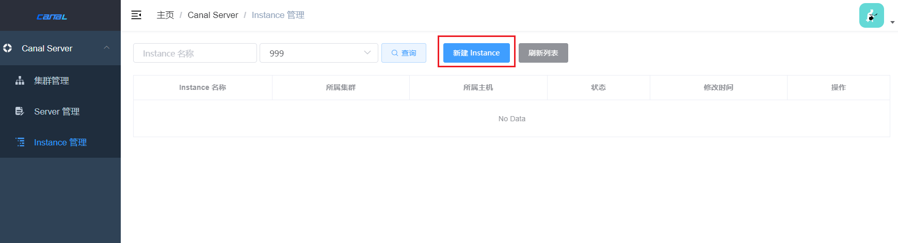

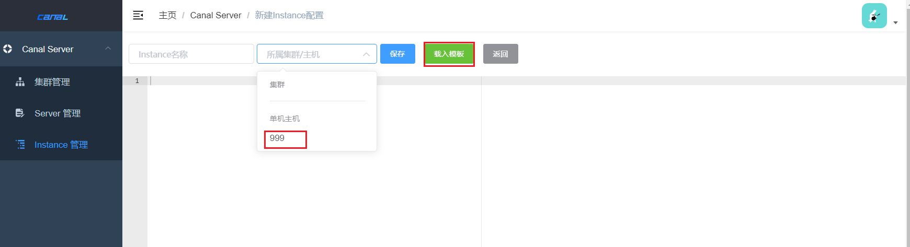

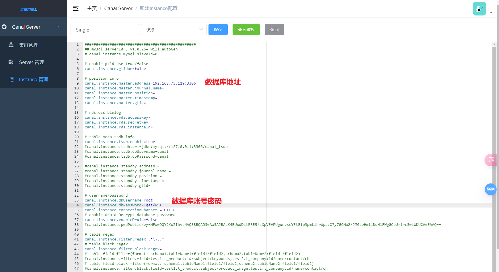

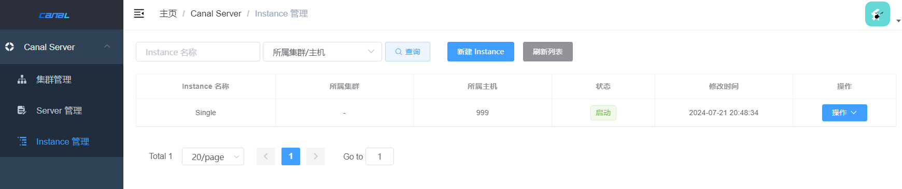

到这里 Canal æœåŠ¡ç«¯çš„所有é…置修改完æˆï¼Œæ¥ä¸‹æ¥æˆ‘们将 java 客户端æ­èµ·æ¥ï¼Œå°±å¯ä»¥è·å–到 MySQL çš„å˜æ›´æ•°æ®äº†ã€‚

```properties
## mysql serverId , v1.0.26+ will autoGen
## v1.0.26版本å会自动生æˆslaveId，所以å¯ä»¥ä¸ç”¨é…ç½®
# canal.instance.mysql.slaveId=0

# æ•°æ®åº“地å€
canal.instance.master.address=192.168.75.129:3306
# binlog日志å称
canal.instance.master.journal.name=
# mysql主库链æ¥æ—¶èµ·å§‹çš„binlogå移é‡
canal.instance.master.position=
# mysql主库链æ¥æ—¶èµ·å§‹çš„binlog的时间戳
canal.instance.master.timestamp=
canal.instance.master.gtid=

# username/password
# 在MySQLæœåŠ¡å™¨æˆæƒçš„è´¦å·å¯†ç 
canal.instance.dbUsername=root
canal.instance.dbPassword=1qaz@WSX
# 字符集
canal.instance.connectionCharset = UTF-8
# enable druid Decrypt database password
canal.instance.enableDruid=false

# table regex .*\\..*表示监å¬æ‰€æœ‰è¡¨ 也å¯ä»¥å†™å…·ä½“的表å，用，隔开
canal.instance.filter.regex=.*\\..*
# mysql æ•°æ®è§£æ表的黑åå•ï¼Œå¤šä¸ªè¡¨ç”¨ï¼Œéš”å¼€
canal.instance.filter.black.regex=
```

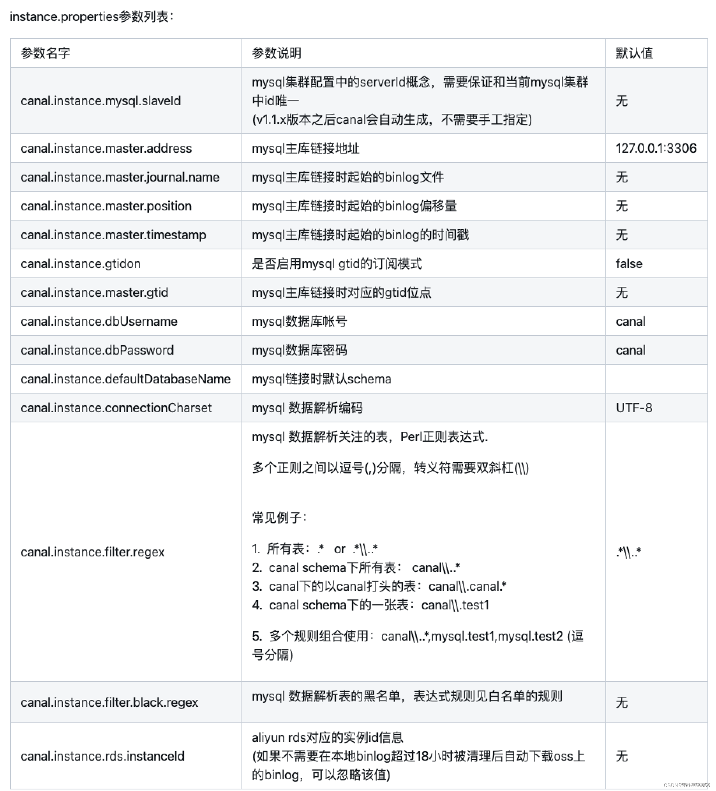

# <font style="color:rgb(0, 0, 0);">五ã€Canal å®æˆ˜</font>
ç¯å¢ƒï¼šSpringBoot3 + JDK17 + Maven + Canal 1.1.8

快速创建一个 SpringBoot 项目

## 导入ä¾èµ–
```xml
<dependency>
  <groupId>com.alibaba.otter</groupId>
  <artifactId>canal.client</artifactId>
  <version>1.1.7</version>
</dependency>

<dependency>
    <groupId>com.alibaba.otter</groupId>
    <artifactId>canal.protocol</artifactId>
    <version>1.1.7</version>
</dependency>

<dependency>
    <groupId>com.alibaba</groupId>
    <artifactId>fastjson</artifactId>
    <version>2.0.0</version>
</dependency>
```

## 修改 application é…ç½®
```yaml
spring:
  application:
    name: springboot3.0
  datasource:
    driver-class-name: com.mysql.cj.jdbc.Driver
    url: jdbc:mysql://192.168.75.129:3306/test?useUnicode=true&characterEncoding=utf-8&serverTimezone=UTC&useSSL=false
    username: root    # æ•°æ®åº“è´¦å·
    password: 1qaz@WSX   # æ•°æ®åº“密ç 
canal:
  server:
    host: 192.168.75.129   # CanalæœåŠ¡IP
    port: 11111       # CanalæœåŠ¡ç«¯å£
  instance:
    destination: Single    # Canal instanceå称，多个Instance用 逗å·éš”å¼€
    username:         # å¯é€‰
    password:         # å¯é€‰
```

## Protocal 对象数æ®æ ¼å¼
```plsql
Entry  
    Header  
        logfileName [binlog文件å]  
        logfileOffset [binlog position]  
        executeTime [binlog里记录å˜æ›´å‘生的时间戳,精确到秒]  
        schemaName   
        tableName  
        eventType [insert/update/deleteç±»å‹]  
    entryType   [事务头BEGIN/事务尾END/æ•°æ®ROWDATA]  
    storeValue  [byteæ•°æ®,å¯å±•å¼€ï¼Œå¯¹åº”çš„ç±»å‹ä¸ºRowChange]  
RowChange

isDdl       [是å¦æ˜¯ddlå˜æ›´æ“作，比如create table/drop table]

sql         [具体的ddl sql]

rowDatas    [具体insert/update/deleteçš„å˜æ›´æ•°æ®ï¼Œå¯ä¸ºå¤šæ¡ï¼Œ1个binlog event事件å¯å¯¹åº”多æ¡å˜æ›´ï¼Œæ¯”如批处ç†]

beforeColumns [Columnç±»å‹çš„数组，å˜æ›´å‰çš„æ•°æ®å­—段]

afterColumns [Columnç±»å‹çš„数组，å˜æ›´åçš„æ•°æ®å­—段]


Column

index

sqlType     [jdbc type]

name        [column name]

isKey       [是å¦ä¸ºä¸»é”®]

updated     [是å¦å‘生过å˜æ›´]

isNull      [值是å¦ä¸ºnull]

value       [具体的内容，注æ„为string文本]  
```

## 创建监å¬å™¨
```java
package com.baili.springboot3.listener;

import com.alibaba.fastjson2.JSONObject;
import com.alibaba.otter.canal.client.CanalConnector;
import com.alibaba.otter.canal.client.CanalConnectors;
import com.alibaba.otter.canal.protocol.CanalEntry;
import com.alibaba.otter.canal.protocol.Message;
import com.google.protobuf.ByteString;
import com.google.protobuf.InvalidProtocolBufferException;
import jakarta.annotation.PostConstruct;
import org.springframework.beans.factory.annotation.Value;
import org.springframework.stereotype.Component;

import java.net.InetSocketAddress;
import java.util.List;

@Component
public class CanalListener {

    @Value("${canal.server.host}")
    private String canalHost;

    @Value("${canal.server.port}")
    private int canalPort;

    @Value("${canal.instance.destination}")
    private String destination;

    @Value("${canal.instance.username}")
    private String username;

    @Value("${canal.instance.password}")
    private String password;

    @PostConstruct
    public void init() {
        InetSocketAddress address = new InetSocketAddress(canalHost, canalPort);
        CanalConnector connector = CanalConnectors.newSingleConnector(
            address,
            destination,
            username,
            password
        );

        new Thread(() -> {
            connector.connect();
            connector.subscribe(".*\\..*"); // 订阅所有数æ®åº“和表的å˜æ›´
            try {
                while (true) {
                    Message message = connector.getWithoutAck(100); // è·å–指定数é‡çš„æ•°æ®å˜æ›´äº‹ä»¶
                    long batchId = message.getId();
                    if (batchId != -1 && message.getEntries().size() > 0) {
                        // 处ç†æ•°æ®å˜æ›´äº‹ä»¶ï¼Œè¿™é‡Œå¯ä»¥æ ¹æ®å®é™…需求进行处ç†
                        System.out.println(message);
                        this.processEntries(message.getEntries());
                    }
                    connector.ack(batchId); // æ交确认
                }
            } catch (InvalidProtocolBufferException e) {
                throw new RuntimeException(e);
            } finally {
                connector.disconnect();
            }
        }).start();
    }

    /**
     * 处ç†Canal Entryæ¡ç›®åˆ—表。
     *
     * @param entries Canal Entryæ¡ç›®åˆ—表。
     */
    public void processEntries(List<CanalEntry.Entry> entries) throws InvalidProtocolBufferException {
        for (CanalEntry.Entry entry : entries) {
            // 1. è·å–表å
            String tableName = entry.getHeader().getTableName();

            // 2. è·å–ç±»å‹
            CanalEntry.EntryType entryType = entry.getEntryType();

            // 3. è·å–åºåˆ—化åçš„æ•°æ®
            ByteString storeValue = entry.getStoreValue();

            // 4. 判断当å‰entryTypeç±»å‹æ˜¯å¦ä¸ºROWDATA
            if (CanalEntry.EntryType.ROWDATA.equals(entryType)) {
                // 5. ååºåˆ—化数æ®
                CanalEntry.RowChange rowChange = CanalEntry.RowChange.parseFrom(storeValue);

                // 6. è·å–当å‰äº‹ä»¶çš„æ“作类å‹
                CanalEntry.EventType eventType = rowChange.getEventType();

                // 7. è·å–æ•°æ®é›†
                List<CanalEntry.RowData> rowDataList = rowChange.getRowDatasList();

                // 8. éå†rowDataList，并打å°æ•°æ®é›†
                for (CanalEntry.RowData rowData : rowDataList) {
                    JSONObject beforeData = new JSONObject();
                    List<CanalEntry.Column> beforeColumnsList = rowData.getBeforeColumnsList();
                    for (CanalEntry.Column column : beforeColumnsList) {
                        beforeData.put(column.getName(), column.getValue());
                    }

                    JSONObject afterData = new JSONObject();
                    List<CanalEntry.Column> afterColumnsList = rowData.getAfterColumnsList();
                    for (CanalEntry.Column column : afterColumnsList) {
                        afterData.put(column.getName(), column.getValue());
                    }

                    // æ•°æ®æ‰“å°
                    System.out.println("Table:" + tableName +
                            ",EventType:" + eventType +
                            ",Before:" + beforeData +
                            ",After:" + afterData);
                }
            } else {
                System.out.println("当å‰æ“作类å‹ä¸ºï¼š" + entryType);
            }
        }
    }
}
```

## 测试
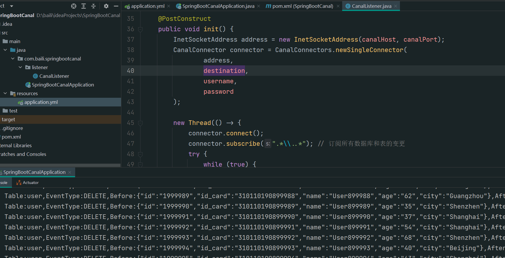


<font style="color:rgb(64, 64, 64);"></font>


> æ›´æ–°: 2025-04-13 22:17:07  
> åŸæ–‡: <https://www.yuque.com/tulingzhouyu/db22bv/ugdfg4q0ccqo0r28>