# 🚛 轻量高效的Excel处理工具-EEC

**<font style="color:#01B2BC;">让JAVA操作excel更简单</font>**

## <font style="color:rgb(31, 35, 40);">介绍</font>
<font style="color:rgb(31, 35, 40);">EEC的设计初衷是为了解决Apache POI高内存且API臃肿的诟病，</font>EEC的底层并不依赖POI包，所有的底层代码均自己实现，<font style="color:rgb(31, 35, 40);">使用EEC基本可以做到一行代码完成Excel文件的读和写操作极易上手。</font>

<font style="color:rgb(31, 35, 40);">EEC的最大特点是</font>**<font style="color:rgb(31, 35, 40);">“轻量”</font>**<font style="color:rgb(31, 35, 40);">和</font>**<font style="color:rgb(31, 35, 40);">“高效</font>**<font style="color:rgb(31, 35, 40);">”，轻量体现在包体小、接入代码量少以及运行时消耗资源少三个方面，高效指运行效率高</font>

+ <font style="color:rgb(31, 35, 40);">包体小：EEC和必要依赖包共约900K</font>
+ <font style="color:rgb(31, 35, 40);">接入代码量少：无论读写均可以一行代码实现</font>
+ <font style="color:rgb(31, 35, 40);">消耗资源少：单线程设计，极限运行内存小于10M</font>

<font style="color:rgb(31, 35, 40);">核心原理：</font>

+ <font style="color:rgb(31, 35, 40);">导出大数据时使用分片处理</font>
+ <font style="color:rgb(31, 35, 40);">单元格样式仅使用一个int值来保存，极大缩小内存使用</font>
+ <font style="color:rgb(31, 35, 40);">使用迭代模式读取行内容，不会将整个文件读入到内存</font>

<font style="color:rgb(31, 35, 40);">下面是迭代模式读取文件的示意图</font>

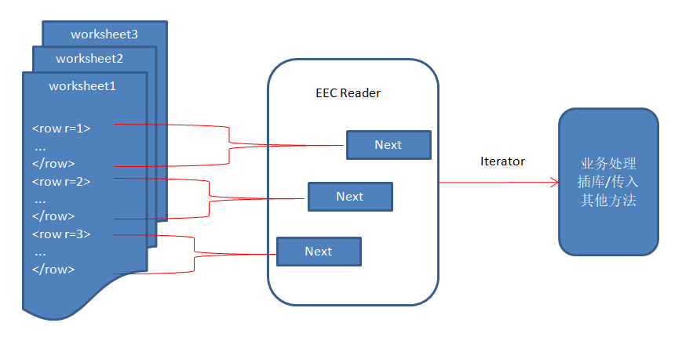

<font style="color:rgb(31, 35, 40);">采用“pull”方式的好处是当用户需要某行数据时才去解析它们来实现延迟读取。</font>

<font style="color:rgb(31, 35, 40);">-------------------------------------------------------------------------------------------------------------------------</font>

<font style="color:rgb(31, 35, 40);">EEC极大的简化了java处理excel文件的复杂性，无论是读还是写都可以使用一行代码完成，你可以非常快速的从POI或easyexcel切换到EEC，接下来将介绍如何快速集成EEC。</font>

<font style="color:rgb(31, 35, 40);">eec支持xlsx格式读和写，eec-e3-support支持xls格式读，请按需引用。</font>_<font style="color:rgb(31, 35, 40);">另外eec-e3-support无法单独引用，它依赖于eec</font>_

+ <font style="color:rgb(31, 35, 40);">如果你使用maven或gradle等管理工具，你可以在</font>**<font style="color:rgb(31, 35, 40);"> </font>**[**<u><font style="color:rgb(31, 35, 40);">Search Maven</font></u>**](https://search.maven.org/search?q=org.ttzero)<font style="color:rgb(31, 35, 40);"> 搜索关键词</font>`<font style="color:rgb(31, 35, 40);">org.ttzero</font>`<font style="color:rgb(31, 35, 40);">或者</font>`<font style="color:rgb(31, 35, 40);">eec</font>`<font style="color:rgb(31, 35, 40);">来查找所有版本的eec和eec-e3-support，建议使用最新版本。</font>
+ <font style="color:rgb(31, 35, 40);">如果你没有使用管理工具，那么你可以</font><font style="color:rgb(31, 35, 40);"> </font>[<font style="color:rgb(31, 35, 40);">点击此处</font>](https://github.com/wangguanquan/eec/releases)<font style="color:rgb(31, 35, 40);"> </font><font style="color:rgb(31, 35, 40);">下载jar包，然后添加到classpath来使用。</font>

<font style="color:rgb(31, 35, 40);">eec与eec-e3-support版本兼容性对照参考 </font>[**<u><font style="color:rgb(31, 35, 40);">这里</font></u>**](https://github.com/wangguanquan/eec/wiki/EEC%E4%B8%8EE3-support%E5%85%BC%E5%AE%B9%E6%80%A7%E5%AF%B9%E7%85%A7%E8%A1%A8)

## <font style="color:rgb(31, 35, 40);">快速开始</font>
创建一个 SpringBoot3 项目，**本文环境**：IDEA2023.1+JDK17+SpringBoot3.4.0+Maven

### 导入依赖
```java
<!-- 注意两个依赖的版本对照关系 -->
<!-- https://mvnrepository.com/artifact/org.ttzero/eec -->
<!-- xlsx格式读和写 -->
<dependency>
    <groupId>org.ttzero</groupId>
    <artifactId>eec</artifactId>
    <version>0.5.20</version>
</dependency>

<!-- https://mvnrepository.com/artifact/org.ttzero/eec-e3-support -->
<!-- xls格式读和写 -->
<dependency>
    <groupId>org.ttzero</groupId>
    <artifactId>eec-e3-support</artifactId>
    <version>0.5.19</version>
</dependency>
```

### hello World
```java
/**
 * 写文件
 * 一行代码实现excel文件的写入
 * 在D:\baili\test\excel文件夹下生成一个名为<新建文件.xlsx>的excel文件
 * 其中添加了一个空的Sheet页（EmptySheet）
 * @throws IOException
 */
@Test
void excelRead01() throws IOException {
    String path = "D:\\baili\\test\\excel";
    new Workbook().addSheet(new EmptySheet()).writeTo(Paths.get(path));
}

/**
 * 读文件
 * 一行代码实现excel文件的读取
 * 读取D:\baili\test\excel\新建文件.xlsx文件
 */
@Test
void excelWrite01() {
    String path = "D:\\baili\\test\\excel\\";
    String fileName = "新建文件.xlsx";
    try (ExcelReader reader = ExcelReader.read(Paths.get(path.concat(fileName)))) {
        reader.sheets().flatMap(org.ttzero.excel.reader.Sheet::rows).forEach(System.out::println);
    } catch (IOException e) {
        e.printStackTrace();
    }
}
```

## <font style="color:rgb(31, 35, 40);">导出Excel</font>
<font style="color:rgb(31, 35, 40);">EEC目前支持</font>`<font style="color:rgb(31, 35, 40);">SimpleSheet</font>`<font style="color:rgb(31, 35, 40);">，</font><font style="color:rgb(31, 35, 40);"> </font>`<font style="color:rgb(31, 35, 40);">ListSheet</font>`<font style="color:rgb(31, 35, 40);">，</font>`<font style="color:rgb(31, 35, 40);">ListMapSheet</font>`<font style="color:rgb(31, 35, 40);">，</font>`<font style="color:rgb(31, 35, 40);">TemplateSheet</font>`<font style="color:rgb(31, 35, 40);">，</font>`<font style="color:rgb(31, 35, 40);">StatementSheet</font>`<font style="color:rgb(31, 35, 40);">，</font>`<font style="color:rgb(31, 35, 40);">ResultSetSheet</font>`<font style="color:rgb(31, 35, 40);">，</font>`<font style="color:rgb(31, 35, 40);">CSVSheet</font>`<font style="color:rgb(31, 35, 40);">和</font>`<font style="color:rgb(31, 35, 40);">EmptySheet</font>`<font style="color:rgb(31, 35, 40);">几种内置的Worksheet，如果不能满足需求你也可以继承已有的Worksheet来扩展，最常见的就是对于大数据量写入时的分片处理，这个在后面会讲到，目前还是从最简单的ListSheet出发。</font>

### <font style="color:rgb(31, 35, 40);">将数据导出到excel</font>
<font style="color:rgb(31, 35, 40);">数据导出应该是开发过程中比较常见的功能，可就是这种简单功能如果使用Apache POI来开发可不是一件轻松的活，幸好EEC已经为我们做了大量的封装，使我们可以做到开箱即用，下面代码展示如何开发简单的对象数组导出功能</font>

```java
/**
 * 导出学生信息
 */
public void exportStudent(List<Student> students) throws IOException {
    new Workbook("二年级学生表") // 新增一个Workbook并指定名称，也就是Excel文件名
    .addSheet(new ListSheet<>(students)) // 添加一个Sheet页，并指定导出数据
    .writeTo(Paths.get("F:/excel")); // 指定导出位置
}
```

<font style="color:rgb(31, 35, 40);">以上</font>`<font style="color:rgb(31, 35, 40);">writeTo</font>`<font style="color:rgb(31, 35, 40);">方法指定一个输出位置，不需要指定具体文件名称，名称在实例化Workbook时指定，如果未指定则默认使用“新建文件”做为文件名，如果指定到具体文件而不是文件夹则替换原有文件，没有权限则会抛异常。另外</font>`<font style="color:rgb(31, 35, 40);">writeTo</font>`<font style="color:rgb(31, 35, 40);">是</font>**<font style="color:rgb(31, 35, 40);">终止符</font>**<font style="color:rgb(31, 35, 40);">，调用该方法将触发写操作，在其后设置的所有属性将不生效。</font>

<font style="color:rgb(31, 35, 40);">如果是做web开发则可以将writeTo直接输出到Response的Outputstream中，如下代码</font>

```java
/**
 * 直接将excel输出到流
 */
@GetMapping("/download")
public void download(HttpServletResponse response) throws IOException {
    String fileName = java.net.URLEncoder.encode("新建文件.xlsx", "UTF-8");
    response.setHeader(HttpHeaders.CONTENT_DISPOSITION, "attachment; filename=\"" + fileName + "\"; filename*=utf-8''" + fileName);
    // 查询数据
    List<Student> students = studentService.list();

    new Workbook().addSheet(new ListSheet<>(students)).writeTo(response.getOutputStream()); // <- 直接写到Response流
}
```

### <font style="color:rgb(31, 35, 40);">添加多个Worksheet</font>
<font style="color:rgb(31, 35, 40);">EEC是通过</font>`<font style="color:rgb(31, 35, 40);">Workbook#addSheet</font>`<font style="color:rgb(31, 35, 40);">方法添加Worksheet，添加的时候你可以指定Sheet的名称，如果不指定则默认使用</font>`<font style="color:rgb(31, 35, 40);">Sheet {N}</font>`<font style="color:rgb(31, 35, 40);">命名。对于导出多个Sheet页只需要多调用几次addSheet方法即可，非常方便。 另外，添加顺序决定导出时各Sheet顺序，如果想调整此顺序可以调用</font>`<font style="color:rgb(31, 35, 40);">Workbook#insertSheet</font>`<font style="color:rgb(31, 35, 40);">方法插入到指定下标（从0开始），与普通的Array操作一样。</font>

<font style="color:rgb(31, 35, 40);">下面代码演示生成多个Worksheet</font>

```java
new Workbook("multi-sheets")
.addSheet(new ListSheet<>("帐单表").setData(checksTestData()))
.addSheet(new ListSheet<>("客户表").setData(customersTestData()))
.addSheet(new ListSheet<>("用户客户关系表").setData(c2CSTestData()))
.writeTo(Paths.get("F:/excel"));
```

<font style="color:rgb(31, 35, 40);">导出文件如下：</font>


### <font style="color:rgb(31, 35, 40);">隐藏Sheet</font>
<font style="color:rgb(31, 35, 40);">出于某些安全考虑需要隐藏某个或多个Sheet页该如何处理呢？答案是只需要在对应的Sheet上调用</font>`<font style="color:rgb(31, 35, 40);">#hidden()</font>`<font style="color:rgb(31, 35, 40);">方法。调用该方法后数据依然会正常写出，只是该页被隐藏。</font>

<font style="color:rgb(31, 35, 40);">下面代码演示隐藏某个Worksheet</font>

```java
new Workbook("multiSheet")
.addSheet(new ListSheet<>("帐单表").setData(checksTestData()))
.addSheet(new ListSheet<>("客户表").setData(customersTestData()).hidden()) // <- 隐藏该Sheet
.addSheet(new ListSheet<>("用户客户关系表").setData(c2CSTestData()))
.writeTo(Paths.get("F:/excel"));
```

<font style="color:rgb(31, 35, 40);">导出文件如下，点击右键选择“取消隐藏”就可以还原了。</font>

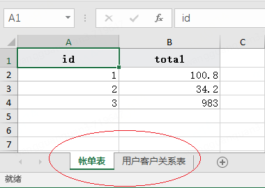

### <font style="color:rgb(31, 35, 40);">强制导出ForceExport</font>
_<font style="color:rgb(31, 35, 40);">为了数据安全</font>_<font style="color:rgb(31, 35, 40);">EEC默认只会导出标记有</font>`<font style="color:rgb(31, 35, 40);">@ExcelColumn</font>`<font style="color:rgb(31, 35, 40);">的属性，但某些情况不方便在实体中加入注解此时就可以调用</font>`<font style="color:rgb(31, 35, 40);">forceExport</font>`<font style="color:rgb(31, 35, 40);">方法全字段导出（标记了</font>`<font style="color:rgb(31, 35, 40);">@IgnroeExport</font>`<font style="color:rgb(31, 35, 40);">注解除外）。</font>

<font style="color:rgb(31, 35, 40);">Force Export会将实体中所有字段导出，这是非常危险的做法</font>**<font style="color:rgb(31, 35, 40);">不建议使用</font>**<font style="color:rgb(31, 35, 40);">。如果其它开发者新增了一些属性且未意识到forceExport则会出现数据泄漏风险，</font>**<font style="color:rgb(31, 35, 40);">为防止数据泄露推荐手动指定Column，这样的话即使对象被添加了敏感字段也不会被自动导出，降低不可预期风险发生。</font>**

<font style="color:rgb(31, 35, 40);">示例代码如下</font>

```java
// 手动指定Column
new Workbook().addSheet(new ListSheet<>(
    new Column("学号", "id") // "学号"为别名即Excel呈现的表头,"id"为Student实体中的字段
    , new Column("姓名", "name")
    , new Column("成绩", "score")
).setData(Student.randomTestData()))
.writeTo(Paths.get("F:/excel"));
```

### <font style="color:rgb(31, 35, 40);">关于自动分页</font>
<font style="color:rgb(31, 35, 40);">单个worksheet页有行数上限，xls上限为65,536，xlsx上限为1,048,576，如果数据超过该如何处理呢，需要手动进行截取么，还是抛异常？</font>

<font style="color:rgb(31, 35, 40);">EEC是为大数据量而生，所以自然考虑到了这种情况，当数据量超过单sheet上限时会自动进行分页处理，无须用户额外处理，而大多数同类工具均是直接抛异常。</font>

<font style="color:rgb(31, 35, 40);">自动分页部分代码解析</font>

```java
/**
 * Split worksheet data
 */
@Override
protected void paging() {
    // dataSize()是当前一组数据块的大小，limit是获取单个worksheet的行上限
    int len = dataSize(), limit = getRowLimit();
    // paging
    if (len + rows > limit) {
        // Reset current index
        end = limit - rows + start; // end是标记dataSize的最后位置，因为已经超限了所以当前页只会取未超限的数据
        shouldClose = false;
        eof = true;
        size = limit;

        int n = id;
        for (int i = end; i < len; ) {
            @SuppressWarnings("unchecked")
            ListSheet<T> copy = getClass().cast(clone()); // 复制一个新的worksheet
            copy.start = i;
            copy.end = (i = Math.min(i + limit, len));
            copy.size = copy.end - copy.start;
            copy.eof = copy.size == limit;
            workbook.insertSheet(n++, copy); // 插入到当前worksheet后面
        }
        // Close on the last copy worksheet
        workbook.getSheetAt(n - 1).shouldClose = true; // 如果是最后一个分页则关闭
    } else {
        end = len;
        size += len;
    }
}
```

<font style="color:rgb(31, 35, 40);">大数据量导出请参考</font><font style="color:rgb(31, 35, 40);"> </font>[<font style="color:rgb(31, 35, 40);">大数据量导出</font>](https://github.com/wangguanquan/eec/wiki/3-%E5%A4%A7%E6%95%B0%E6%8D%AE%E9%87%8F%E5%AF%BC%E5%87%BA)

### <font style="color:rgb(31, 35, 40);">多行表头</font>
<font style="color:rgb(31, 35, 40);">多行表头请参考</font><font style="color:rgb(31, 35, 40);"> </font>[<font style="color:rgb(31, 35, 40);">如何设置多行表头</font>](https://github.com/wangguanquan/eec/wiki/%E5%A6%82%E4%BD%95%E8%AE%BE%E7%BD%AE%E5%A4%9A%E8%A1%8C%E8%A1%A8%E5%A4%B4)

### <font style="color:rgb(31, 35, 40);">忽略表头</font>
<font style="color:rgb(31, 35, 40);">EEC提供</font>`<font style="color:rgb(31, 35, 40);">Sheet#ignoreHeader</font>`<font style="color:rgb(31, 35, 40);">方法来忽略表头输出，当然你在表头上设置的任何信息依然有效，只在输出的时候跳过表头，</font>**<font style="color:rgb(31, 35, 40);">注意这里是忽略表头不是隐藏</font>**

```java
new Workbook("Ignore header")
.addSheet(new ListSheet<>(randomTestData()).ignoreHeader()) // <- 使用#ignoreHeader忽略表头输出
.writeTo(Paths.get("F:/excel"));
```

### <font style="color:rgb(31, 35, 40);">简单数据类型导出</font>
<font style="color:rgb(31, 35, 40);">有时候仅仅想导出最简单的数据类型，比如Integer,String，如果定义实体就显得过度设计，此时可以像下面示例一样导入简单类型</font>

```java
List<Integer> list = Arrays.asList(1, 2, 3, 4, 5, 6, 7, 8, 9, 0);
new Workbook("Integer array")
.addSheet(new SimpleSheet<>(list))
.writeTo(Paths.get("F:/excel"));
```

### <font style="color:rgb(31, 35, 40);">未知的数据类型</font>
<font style="color:rgb(31, 35, 40);">EEC内置处理如下类型，并按照文本居左，数字居右，日期/bool/char居中输出</font>

| <font style="color:rgb(31, 35, 40);">String</font> | <font style="color:rgb(31, 35, 40);">CharSequence</font> | <font style="color:rgb(31, 35, 40);">int</font> | <font style="color:rgb(31, 35, 40);">Integer</font> | <font style="color:rgb(31, 35, 40);">short</font> | <font style="color:rgb(31, 35, 40);">Short</font> |
| --- | --- | --- | --- | --- | --- |
| <font style="color:rgb(31, 35, 40);">byte</font> | <font style="color:rgb(31, 35, 40);">Byte</font> | <font style="color:rgb(31, 35, 40);">long</font> | <font style="color:rgb(31, 35, 40);">Long</font> | <font style="color:rgb(31, 35, 40);">float</font> | <font style="color:rgb(31, 35, 40);">Float</font> |
| <font style="color:rgb(31, 35, 40);">double</font> | <font style="color:rgb(31, 35, 40);">Double</font> | <font style="color:rgb(31, 35, 40);">BigDecimal</font> | <font style="color:rgb(31, 35, 40);">boolean</font> | <font style="color:rgb(31, 35, 40);">Boolean</font> | <font style="color:rgb(31, 35, 40);">char</font> |
| <font style="color:rgb(31, 35, 40);">Character</font> | <font style="color:rgb(31, 35, 40);">java.util.Date</font> | <font style="color:rgb(31, 35, 40);">java.sql.Date</font> | <font style="color:rgb(31, 35, 40);">java.sql.Timestamp</font> | <font style="color:rgb(31, 35, 40);">java.sql.Time</font> | <font style="color:rgb(31, 35, 40);">java.time.LocalDate</font> |
| <font style="color:rgb(31, 35, 40);">java.time.LocalDateTime</font> | <font style="color:rgb(31, 35, 40);">java.time.LocalTime</font> | | | | |


<font style="color:rgb(31, 35, 40);">其余类型均默认调用</font>`<font style="color:rgb(31, 35, 40);">toString</font>`<font style="color:rgb(31, 35, 40);">方法输入，如果需要特殊处理则可以使用自定义</font>`<font style="color:rgb(31, 35, 40);">ICellValueAndStyle</font>`<font style="color:rgb(31, 35, 40);">类并覆写</font>`<font style="color:rgb(31, 35, 40);">unknownType</font>`<font style="color:rgb(31, 35, 40);">方法，示例如下</font>

```java
public class MyXMLCellValueAndStyle extends XMLCellValueAndStyle {

    @Override
    public void unknownType(Row row, Cell cell, Object e, Column hc, Class<?> clazz) {
        // 如果认别到自定义枚举则输出枚举desc字段
        if (clazz == PlatformEnum.class) {
            cell.setSv(((PlatformEnum) e).getDesc());
        }
            // 其它情况默认处理
        else {
            super.unknownType(row, cell, e, hc, clazz);
        }
    }
}

// 添加Worksheet时指定自定认MyXMLCellValueAndStyle即可
new Workbook()
.addSheet(new ListSheet<>(data).setCellValueAndStyle(new MyXMLCellValueAndStyle()))
.writeTo(Paths.get("F:/excel"));
```

<font style="color:rgb(31, 35, 40);">以上代码展示了自定义枚举类型的特殊处理，对于没有权限修改(如对象放在公共的jar包中或者多个团队共同使用不能修改)的情况下自定义</font>`<font style="color:rgb(31, 35, 40);">ICellValueAndStyle</font>`<font style="color:rgb(31, 35, 40);">就显得特别重要了，当然如果有权限的话你也可以直接在PlatformEnum枚举内添加toString并返回desc属性，但并不建议此类做法</font>

_<font style="color:rgb(31, 35, 40);">unknownType的优先级最低</font>_<font style="color:rgb(31, 35, 40);">，所以无法在</font>`<font style="color:rgb(31, 35, 40);">unknownType</font>`<font style="color:rgb(31, 35, 40);">方法中处理String等内置类型，如果需要则可以覆写</font>`<font style="color:rgb(31, 35, 40);">reset</font>`<font style="color:rgb(31, 35, 40);">方法，像下面示例一样</font>

```java
public class MyXMLCellValueAndStyle extends XMLCellValueAndStyle {
    @Override
    public void reset(Row row, Cell cell, Object e, Column hc) {
        // 调用预处理方法
        preCellValue(row, cell, e, hc, hc.getClazz(), hc.processor != null);
        if (hc.processor == null) {
            cell.xf = getStyleIndex(row, hc, e);
        }
    }

    void preCellValue(Row row, Cell cell, Object e, Column hc, Class<?> clazz, boolean hasProcessor) {
        // TODO 前置处理内置类型
        if (isString(clazz)) {
            cell.setSv("##" + e + "##");
            return;
        }
        // 其它类型走原方法
        setCellValue(row, cell, e, hc, clazz, hasProcessor);
    }
}
```

### <font style="color:rgb(31, 35, 40);">导出图片</font>
<font style="color:rgb(31, 35, 40);">默认情况下EEC总是以"值"的形式导出，即使是</font>`<font style="color:rgb(31, 35, 40);">byte[]</font>`<font style="color:rgb(31, 35, 40);">也将进行toString后导出，所以EEC是安全的。</font>

<font style="color:rgb(31, 35, 40);">从v0.5.10开始支持导出图片，EEC使用以下双检查以保证安全，避免可执行文件、木马病毒写入Excel</font>

1. <font style="color:rgb(31, 35, 40);">检查列是否以</font>`<font style="color:rgb(31, 35, 40);">Media</font>`<font style="color:rgb(31, 35, 40);">格式导出，用户必须显示的调用</font>`<font style="color:rgb(31, 35, 40);">writeAsMedia</font>`<font style="color:rgb(31, 35, 40);">方法指定</font>
2. <font style="color:rgb(31, 35, 40);">检查FILE SIGNATURES是否为白名单中的图片格式，只有识别到白名单的Signatures才会写出到excel</font>

<font style="color:rgb(31, 35, 40);">这里的file signatures检查并非简单的扩展名匹配，而是尝试解析文件头的少量字节进行signatures匹配，更安全的除了文件头还需要匹配文件尾，但图片一般都几百Kb甚至几Mb为了性能EEC牺牲了绝对的安全</font>

<font style="color:rgb(31, 35, 40);">默认FILE SIGNATURES白名单格式如下</font>

| <font style="color:rgb(31, 35, 40);">扩展名</font> | <font style="color:rgb(31, 35, 40);">Content-type</font> |
| --- | --- |
| <font style="color:rgb(31, 35, 40);">.png</font> | <font style="color:rgb(31, 35, 40);">image/png</font> |
| <font style="color:rgb(31, 35, 40);">.jpg</font> | <font style="color:rgb(31, 35, 40);">image/jpg</font> |
| <font style="color:rgb(31, 35, 40);">.gif</font> | <font style="color:rgb(31, 35, 40);">image/gif</font> |
| <font style="color:rgb(31, 35, 40);">.tiff</font> | <font style="color:rgb(31, 35, 40);">image/tiff</font> |
| <font style="color:rgb(31, 35, 40);">.bmp</font> | <font style="color:rgb(31, 35, 40);">image/bmp</font> |
| <font style="color:rgb(31, 35, 40);">.ico</font> | <font style="color:rgb(31, 35, 40);">image/x-ico</font> |
| <font style="color:rgb(31, 35, 40);">.emf</font> | <font style="color:rgb(31, 35, 40);">image/x-emf</font> |
| <font style="color:rgb(31, 35, 40);">.wmf</font> | <font style="color:rgb(31, 35, 40);">image/x-wmf</font> |
| <font style="color:rgb(31, 35, 40);">.webp</font> | <font style="color:rgb(31, 35, 40);">image/webp</font> |


<font style="color:rgb(31, 35, 40);">EEC支持</font>`<font style="color:rgb(31, 35, 40);">Path</font>`<font style="color:rgb(31, 35, 40);">，</font><font style="color:rgb(31, 35, 40);"> </font>`<font style="color:rgb(31, 35, 40);">File</font>`<font style="color:rgb(31, 35, 40);">，</font><font style="color:rgb(31, 35, 40);"> </font>`<font style="color:rgb(31, 35, 40);">URL</font>`<font style="color:rgb(31, 35, 40);">，</font><font style="color:rgb(31, 35, 40);"> </font>`<font style="color:rgb(31, 35, 40);">byte[]</font>`<font style="color:rgb(31, 35, 40);">，</font><font style="color:rgb(31, 35, 40);"> </font>`<font style="color:rgb(31, 35, 40);">ByteBuffer</font>`<font style="color:rgb(31, 35, 40);">，</font><font style="color:rgb(31, 35, 40);"> </font>`<font style="color:rgb(31, 35, 40);">InputStream</font>`<font style="color:rgb(31, 35, 40);">，</font><font style="color:rgb(31, 35, 40);"> </font>`<font style="color:rgb(31, 35, 40);">base64 image string</font>`<font style="color:rgb(31, 35, 40);">7种类型的Media，你可以使用</font>`<font style="color:rgb(31, 35, 40);">Column#writeAsMedia()</font>`<font style="color:rgb(31, 35, 40);">或者</font>`<font style="color:rgb(31, 35, 40);">@MediaColumn</font>`<font style="color:rgb(31, 35, 40);">注解来指定当前列类型为</font>`<font style="color:rgb(31, 35, 40);">Media</font>`<font style="color:rgb(31, 35, 40);">，此注解还附加了一个属性</font>`<font style="color:rgb(31, 35, 40);">presetEffect</font>`<font style="color:rgb(31, 35, 40);">用于预设图片样式</font>

<font style="color:rgb(31, 35, 40);">简单示例代码如下</font>

```java
public static class Pic {
    @ExcelColumn("地址")
    private String addr;
    @MediaColumn // 指定以Media形式导出
    private String url;
}

new Workbook()
.addSheet(new ListSheet<>(randomTestData()).setRowHeight(100))
.writeTo(Paths.get("F:/excel"));
```


<font style="color:rgb(31, 35, 40);">EEC支持Excel内置的28种预设图片样式，内置样式使用</font>`<font style="color:rgb(31, 35, 40);">PresetPictureEffect</font>`<font style="color:rgb(31, 35, 40);">枚举类型获取，枚举的顺序与Excel中的顺序完全一致，预设样式如下：</font>


<font style="color:rgb(31, 35, 40);">使用</font>`<font style="color:rgb(31, 35, 40);">presetEffect</font>`<font style="color:rgb(31, 35, 40);">指定预设样式</font>

```java
public static class Pic {
    @ExcelColumn("地址")
    private String addr;
    @MediaColumn(presetEffect = PresetPictureEffect.Rotated_White) // 指定以Media形式导出并添加图片效果
    private String url;
}
```


<font style="color:rgb(31, 35, 40);">以上是为整列设置样同的图片样式，我们也可以自定义</font>`<font style="color:rgb(31, 35, 40);">XMLWorksheetWriter</font>`<font style="color:rgb(31, 35, 40);">为每列设置不同样式</font>

```java
new Workbook()
.addSheet(new ListSheet<>(randomTestData())
          .setRowHeight(217.5).autoSize().setSheetWriter(new XMLWorksheetWriter() {
              @Override
              protected Picture createPicture(int column, int row) {
                  Picture picture = super.createPicture(column, row);
                  // 某些效果会加边框、倒影或者旋转所以这里增加padding的大小以显示完整的效果
                  picture.padding = 15 << 24 | 15 << 16 | 35 << 8 | 15;
                  PresetPictureEffect[] effects = PresetPictureEffect.values();
                  // 添加效果
                  picture.effect = effects[row - 2].getEffect();
                  return picture;
              }
          })).writeTo(Paths.get("F:/excel"));
```

<font style="color:rgb(31, 35, 40);">如下图展示 A列是枚举值，B列是对应的效果</font>

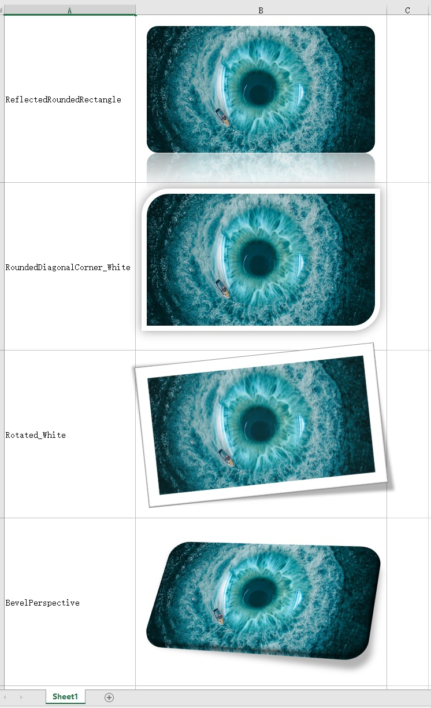

<font style="color:rgb(31, 35, 40);">PresetPictureEffect枚举中英文对照表</font>

| <font style="color:rgb(31, 35, 40);">中文</font> | <font style="color:rgb(31, 35, 40);">枚举值</font> |
| --- | --- |
| <font style="color:rgb(31, 35, 40);">无</font> | <font style="color:rgb(31, 35, 40);">None</font> |
| <font style="color:rgb(31, 35, 40);">简单框架，白色</font> | <font style="color:rgb(31, 35, 40);">SimpleFrame_White</font> |
| <font style="color:rgb(31, 35, 40);">棱台亚光，白色</font> | <font style="color:rgb(31, 35, 40);">BeveledMatte</font> |
| <font style="color:rgb(31, 35, 40);">金属框架</font> | <font style="color:rgb(31, 35, 40);">MetalFrame</font> |
| <font style="color:rgb(31, 35, 40);">矩形投影</font> | <font style="color:rgb(31, 35, 40);">DropShadowRectangle</font> |
| <font style="color:rgb(31, 35, 40);">映像圆角矩形</font> | <font style="color:rgb(31, 35, 40);">ReflectedRoundedRectangle</font> |
| <font style="color:rgb(31, 35, 40);">柔化边缘矩形</font> | <font style="color:rgb(31, 35, 40);">SoftEdgeRectangle</font> |
| <font style="color:rgb(31, 35, 40);">双框架，黑色</font> | <font style="color:rgb(31, 35, 40);">DoubleFrame</font> |
| <font style="color:rgb(31, 35, 40);">厚重亚光，黑色</font> | <font style="color:rgb(31, 35, 40);">ThickMatte</font> |
| <font style="color:rgb(31, 35, 40);">简单框架，黑色</font> | <font style="color:rgb(31, 35, 40);">SimpleFrame_Black</font> |
| <font style="color:rgb(31, 35, 40);">棱台形椭圆，黑色</font> | <font style="color:rgb(31, 35, 40);">BeveledOval</font> |
| <font style="color:rgb(31, 35, 40);">复杂框架，黑色</font> | <font style="color:rgb(31, 35, 40);">CompoundFrame</font> |
| <font style="color:rgb(31, 35, 40);">中等复杂框架，黑色</font> | <font style="color:rgb(31, 35, 40);">ModerateFrame</font> |
| <font style="color:rgb(31, 35, 40);">居中矩形阴影</font> | <font style="color:rgb(31, 35, 40);">CenterShadowRectangle</font> |
| <font style="color:rgb(31, 35, 40);">圆形对角，白色</font> | <font style="color:rgb(31, 35, 40);">RoundedDiagonalCorner</font> |
| <font style="color:rgb(31, 35, 40);">剪去对角，白色</font> | <font style="color:rgb(31, 35, 40);">SnipDiagonalCorner</font> |
| <font style="color:rgb(31, 35, 40);">中等复杂框架，白色</font> | <font style="color:rgb(31, 35, 40);">ModerateFrame</font> |
| <font style="color:rgb(31, 35, 40);">旋转，白色</font> | <font style="color:rgb(31, 35, 40);">Rotated</font> |
| <font style="color:rgb(31, 35, 40);">透视阴影，白色</font> | <font style="color:rgb(31, 35, 40);">PerspectiveShadow</font> |
| <font style="color:rgb(31, 35, 40);">松散透视，白色</font> | <font style="color:rgb(31, 35, 40);">RelaxedPerspective</font> |
| <font style="color:rgb(31, 35, 40);">柔化边缘椭圆</font> | <font style="color:rgb(31, 35, 40);">SoftEdgeOval</font> |
| <font style="color:rgb(31, 35, 40);">棱台矩形</font> | <font style="color:rgb(31, 35, 40);">BevelRectangle</font> |
| <font style="color:rgb(31, 35, 40);">棱台透视</font> | <font style="color:rgb(31, 35, 40);">BevelPerspective</font> |
| <font style="color:rgb(31, 35, 40);">映像右透视</font> | <font style="color:rgb(31, 35, 40);">ReflectedPerpsectiveRight</font> |
| <font style="color:rgb(31, 35, 40);">棱台左透视，白色</font> | <font style="color:rgb(31, 35, 40);">BevelPerspectiveLeft</font> |
| <font style="color:rgb(31, 35, 40);">映像棱台，黑色</font> | <font style="color:rgb(31, 35, 40);">ReflectedBevel</font> |
| <font style="color:rgb(31, 35, 40);">映像棱台，白色</font> | <font style="color:rgb(31, 35, 40);">ReflectedBevel_White</font> |
| <font style="color:rgb(31, 35, 40);">金属圆角矩形</font> | <font style="color:rgb(31, 35, 40);">MetalRoundedRectangle</font> |
| <font style="color:rgb(31, 35, 40);">金属椭圆</font> | <font style="color:rgb(31, 35, 40);">MetalOval</font> |


**<font style="color:rgb(31, 35, 40);">注意：自适应列宽对</font>**`**<font style="color:rgb(31, 35, 40);">Media</font>**`**<font style="color:rgb(31, 35, 40);">列无效，它总是以固定宽度显示</font>**

#### <font style="color:rgb(31, 35, 40);">关于图片下载</font>
<font style="color:rgb(31, 35, 40);">虽然EEC支持远程图片下载但能力较弱，内置下载工具仅使用</font>`<font style="color:rgb(31, 35, 40);">java.net.HttpURLConnection</font>`<font style="color:rgb(31, 35, 40);">类，它不会使用连接池也没有支持ftp以及身份鉴权， 所以在集成的过程中如果有图片下载的话最好使用已有下载器，然后使用InputStream,byte[]或者ByteBuffer传入EEC，这样的话你可能需要修改实体对代码有一定的破坏性，当然你也可以自定义XMLWorksheetWriter 将下载器集成进EEC，这样就不需要修改已有Java对象了。</font>

<font style="color:rgb(31, 35, 40);">下面展示一段使用OkHttp做为下载器替换</font>`<font style="color:rgb(31, 35, 40);">java.net.HttpURLConnection</font>`<font style="color:rgb(31, 35, 40);">的示例，你可以使用已有任何工具替换</font>

```java
new Workbook().addSheet(new ListSheet<>(getRemoteUrls())
            .setColumns(new Column().setWidth(20).writeAsMedia()).setRowHeight(100)
            .setSheetWriter(new XMLWorksheetWriter() {
                @Override public void downloadRemoteResource(Picture picture, String uri) throws IOException {
                    // http or https
                    if (uri.startsWith("http")) {
                        try (Response response = OkHttpClientUtil.client().newCall(new Request.Builder().url(uri).get().build()).execute()) {
                            ResponseBody body;
                            if (response.isSuccessful() && (body = response.body()) != null) {
                                downloadCompleted(picture, body.bytes());
                            }
                        } catch (IOException ex) {
                            downloadCompleted(picture, null);
                        }
                    }
                        // ftp or ftps
                    else if (uri.startsWith("ftp")) {
                        // TODO download from ftp server
                    }
                }
            })).writeTo(Paths.get("F:/excel"));
```

<font style="color:rgb(31, 35, 40);">通过downloadCompleted方法告诉EEC图片数据已准备好，此方法会进行文件签名检查通过后才会将图片数据写到excel中去，在捕获异常代码块中传入null告诉EEC下载失败。</font>

<font style="color:rgb(31, 35, 40);">上面代码可以看到只需要在完成下载后调用downloadCompleted方法通知EEC，那是否可以替换为异步下载呢？答案是"YES"。以上代码只需要将</font>`<font style="color:rgb(31, 35, 40);">#execute()</font>`<font style="color:rgb(31, 35, 40);">改为</font>`<font style="color:rgb(31, 35, 40);">#enqueue(new Callback() {}</font>`<font style="color:rgb(31, 35, 40);">并在onResponse和onFailure方法中调用downloadCompleted即可实现异步下载。</font>

**<font style="color:rgb(31, 35, 40);">注意：目前来说异步下载并未通过充分测试和优化，至少v0.5.10版本不要在生产环境使用</font>**

## <font style="color:rgb(31, 35, 40);">读取 Excel</font>
### <font style="color:rgb(31, 35, 40);">像TXT文件一样读Excel</font>
<font style="color:rgb(31, 35, 40);">使用EEC读取Excel和读取文本文件一样简单，其设计思路和</font>`<font style="color:rgb(31, 35, 40);">Files.lines(Path)</font>`<font style="color:rgb(31, 35, 40);">一样，EEC使用</font>`<font style="color:rgb(31, 35, 40);">ExcelReader#read</font>`<font style="color:rgb(31, 35, 40);">静态方法读文件，其内部采用流式操作，当使用某一行数据时才会真正读入内存，所以即使是GB级别的Excel文件也只占用少量内存。</font>

<font style="color:rgb(31, 35, 40);">我们可以写一段简单示例来比较读TXT文件和Excel的区别</font>

```java
// 读取TXT文件
@Test 
public void testReadText() {
    try (Stream<String> line = Files.lines(Paths.get("F:/excel/1.txt"))) {
        // 按行读取并打印
        line.forEach(System.out::println);
    } catch (IOException ex) {
        ex.printStackTrace();
    }
}
// 读取Excel
@Test 
public void testReadExcel() {
    try (ExcelReader reader = ExcelReader.read(Paths.get("F:/excel/1.xlsx"))) {
        // 按行读取第1个Sheet并打印
        reader.sheet(0).rows().forEach(System.out::println);
    } catch (IOException ex) {
        ex.printStackTrace();
    }
}
```

<font style="color:rgb(31, 35, 40);">可以看到，两段代码几乎一致，并且功能也一样，都是按行读取数据并输出。</font>

<font style="color:rgb(31, 35, 40);">大多数场景都需要将行数据转为对象然后进行其它逻辑，典型的处理流程可能如下图</font>

```plain
+------+     +--------+       +--------+      +---------+
| 读取  | ->  | 过滤器1 |  ->   | 过滤器2 |  ->  | 逻辑处理 |
+------+     +--------+       +--------+      +---------+
```

<font style="color:rgb(31, 35, 40);">像这种场景使用EEC将非常贴合，因为ExcelReader提供了标准的Stream流，第一层是</font>`<font style="color:rgb(31, 35, 40);">Stream<Sheet></font>`<font style="color:rgb(31, 35, 40);">，第二层是</font>`<font style="color:rgb(31, 35, 40);">Stream<Row></font>`<font style="color:rgb(31, 35, 40);">，流处理的最大特点就是将大任务拆分成几个小任务。</font>

<font style="color:rgb(31, 35, 40);">我们假定一个场景，实现一个提供文件上传功能，该功能允许用户上传商品数据，程序读取文件后进行内容检查（我可不希望上传一些违规的内容污染服务器），最后将检查通过的商品通过商品中台进行商品上架。</font>

<font style="color:rgb(31, 35, 40);">这样的经典场景可以使用如下代码实现</font>

```java
// 假定已将文件写到某台服务器或OSS服务器
try (ExcelReader reader = ExcelReader.read(Paths.get("F:/excel/goods.xlsx"))) {
    reader.sheet(0).dataRows()
    // 将行数据转为Goods对象
    .map(row -> row.too(Goods.class))

    // 本地的一些检查，检查一些必填项
    .filter(this::validateGoods)

    // 合规检查，检查文本或者图片是否违规
    .filter(g -> redLineDetectService.checkText(g.getGoodsName()) && redLineDetectService.checkImage(g.getImage()))

    // 调用商品中台上架
    .forEach(goodsService::publish);
} catch (IOException ex) {
    ex.printStackTrace();
}
```

<font style="color:rgb(31, 35, 40);">上面示例展示了一个完整的从读取到过滤到逻辑处理场景，其中的</font>`<font style="color:rgb(31, 35, 40);">sheet(0)</font>`<font style="color:rgb(31, 35, 40);">表示读取第一个Sheet页，</font>`<font style="color:rgb(31, 35, 40);">dataRows()</font>`<font style="color:rgb(31, 35, 40);">会读取第一个非空行做为表头解析。</font>

### <font style="color:rgb(31, 35, 40);">批量处理行逻辑</font>
<font style="color:rgb(31, 35, 40);">上面的场景示例展现了简明的流处理，但one-by-one上架可能会拖慢系统速度，此时就有批量处理场景，但是标准的流仅提供单行数据，应该如何改进呢？</font>

<font style="color:rgb(31, 35, 40);">呃。。。与其说是改进不如说是退化，</font>`<font style="color:rgb(31, 35, 40);">Sheet</font>`<font style="color:rgb(31, 35, 40);">接口提供iterator和dataIterator两种迭代器，可以使用迭代器收集数据，代码如下：</font>

```java
try (ExcelReader reader = ExcelReader.read(Paths.get("F:/excel/goods.xlsx"))) {
    List<Goods> batch = new ArrayList<>(100);
    for (Iterator<Row> ite = reader.sheet(0).dataIterator(); ite.hasNext(); ) {
        // 行数据转对象
        batch.add(ite.next().to(Goods.class));
        // 满100条批量上架
        if (batch.size() >= 100) {
            goodsService.batchPublish(batch);
            batch.clear();
        }
    }
    // 上架剩余商品
    if (!batch.isEmpty()) {
        goodsService.batchPublish(batch);
    }
} catch (IOException ex) {
    ex.printStackTrace();
}
```

<font style="color:rgb(31, 35, 40);">你无需担心OOM，因为Iterator依然是按需加载数据，内存消耗与Stream相当。</font>

### <font style="color:rgb(31, 35, 40);">获取文件包含多少行</font>
<font style="color:rgb(31, 35, 40);">EEC并不提供获取总行数的方法（有一个被标记为过时的</font>`<font style="color:rgb(31, 35, 40);">Sheet#getSize</font>`<font style="color:rgb(31, 35, 40);">方法目前仍然可以使用），推荐使用</font>`<font style="color:rgb(31, 35, 40);">Sheet#getDimension</font>`<font style="color:rgb(31, 35, 40);">方法替换，该方法会返回一个</font>`<font style="color:rgb(31, 35, 40);">Dimension</font>`<font style="color:rgb(31, 35, 40);">对象包含</font>`<font style="color:rgb(31, 35, 40);">firstRow</font>`<font style="color:rgb(31, 35, 40);"> </font>`<font style="color:rgb(31, 35, 40);">lastRow</font>`<font style="color:rgb(31, 35, 40);"> </font>`<font style="color:rgb(31, 35, 40);">firstColumn</font>`<font style="color:rgb(31, 35, 40);"> </font>`<font style="color:rgb(31, 35, 40);">lastColumn</font>`<font style="color:rgb(31, 35, 40);">4个属性，细心的你一定发现了这4个属性将定位整个文档的有效范围。 取有效数据行数可以通过计算</font>`<font style="color:rgb(31, 35, 40);">dimension.lastRow - dimension.firstRow + 1</font>`<font style="color:rgb(31, 35, 40);">得到。</font>

<font style="color:rgb(31, 35, 40);">对于标准的Office Open XML来说该范围值被写到了各worksheet的头部，大致像这样</font>`<font style="color:rgb(31, 35, 40);"><dimension ref="A1:F10"/></font>`<font style="color:rgb(31, 35, 40);">，所以标准的Excel可以快速获得。 但是并非所有工具都采用Office标准，比如POI导出的文件就不会写此属性，读取这类文件EEC做如下处理：将指针指向文件末尾，然后读取最后一个单元格的范围，将此范围做为有效数据范围，这有可能导致列范围不准确的问题。</font>

<font style="color:rgb(31, 35, 40);">总的来说获取文件范围的时间复杂度趋近于O(1)，需要注意的是</font>**<font style="color:rgb(31, 35, 40);">此属性并非可信任</font>**<font style="color:rgb(31, 35, 40);">的，最好不要在代码中使用此值做强检验</font>

<font style="color:rgb(31, 35, 40);">v0.5.11开始并不会解压原始文件，所以无法用上面的方法将指针移到文件末尾以快速获取最后一个单元格范围，调用</font>`<font style="color:rgb(31, 35, 40);">Sheet#getDimension</font>`<font style="color:rgb(31, 35, 40);">方法将从头开始匹配单元格范围所以此方法将消耗更多的时间</font>

### <font style="color:rgb(31, 35, 40);">反复读取</font>
<font style="color:rgb(31, 35, 40);">Sheet提供</font>`<font style="color:rgb(31, 35, 40);">reset</font>`<font style="color:rgb(31, 35, 40);">方法，该方法会重置位置到文件头，从而起到反复读取效果，该方法并不会二次解压文件也不会清除SharedString和文件范围等基础信息，所以理论上会比第一次快。看上去像是一个很2的功能，但是某些情况依然有用，比如大文件需要检查某个列是否出现重复值，检查完后再逻辑处理， 因为文件太大我们无法将数据一次读到内存再检查重复和逻辑处理，此时我们就可以使用reset做两次读文件操作</font>

```java
try (ExcelReader reader = ExcelReader.read(Paths.get("F:/excel/large-goods.xlsx"))) {
    Sheet sheet = reader.sheet(0);
    Dimension dimension = sheet.getDimension();
    // 这里没有+1，因为表头占一行
    int maxRow = dimension.lastRow - dimension.firstRow;
    long count = sheet.dataRows().map(row -> row.getString("商品编码")).distinct().count(); // <- 使用distinct去除重复商品编码
    // 如果去重后的结果小于原始结果说明有重复
    if (count < maxRow) {
        throw new IllegalArgumentException("包含重复商品编码");
    }

    // 重置
    sheet.reset();

    // 和上面的例子一样处理逻辑即可
    sheet.dataRows().map(row -> row.to(Goods.class)).forEach(goodsService::publish);
} catch (IOException ex) {
    ex.printStackTrace();
}
```

### <font style="color:rgb(31, 35, 40);">指定表头位置</font>
<font style="color:rgb(31, 35, 40);">从v0.5.6开始EEC支持指定表头你可以通过</font>`<font style="color:rgb(31, 35, 40);">Sheet#header(fromRowNum, toRowNum)</font>`<font style="color:rgb(31, 35, 40);">来指定表头的位置，如上面实例中第7行为表头，则可以使用</font>

```java
List<Goods> list = reader.sheet(0).reset()
.header(7) // 指定第7行为表头
.rows().map(row -> row.to(Goods.class)).collect(Collectors.toList());
```

### <font style="color:rgb(31, 35, 40);">JDBC式读取</font>
<font style="color:rgb(31, 35, 40);">除了上面使用</font>`<font style="color:rgb(31, 35, 40);">row#to</font>`<font style="color:rgb(31, 35, 40);">或者</font>`<font style="color:rgb(31, 35, 40);">rot#too</font>`<font style="color:rgb(31, 35, 40);">方式将行数据直接转对象外，我们还可以使用类似于JDBC方式更原始的获取单元格的值，这种更底层的方式在复杂环境中尤为有效，比如多行表头或者非表格读取</font>

```java
List<O> list = reader.sheet(0).rows().map(row -> {
    // ... 其它解析
    O o = new O();
    o.total = row.getInt(0);       // 获取总计
    o.formula = row.getFormula(0); // 获取计算总计的公式
    return o;
}).collect(Collectors.toList());
```

### <font style="color:rgb(31, 35, 40);">行转Map</font>
<font style="color:rgb(31, 35, 40);">v0.5.6 Row提供toMap方法将行数据转为字典类型，为保证列顺序实际返回类型为LinkedHashMap，如果使用</font>`<font style="color:rgb(31, 35, 40);">Sheet#dataRows</font>`<font style="color:rgb(31, 35, 40);">或</font>`<font style="color:rgb(31, 35, 40);">Sheet#header</font>`<font style="color:rgb(31, 35, 40);">指定表头则字典的Key为表头文本，Value为表头对应的列值， 如果未指定表头那将以列索引做为Key，与导出指定的colIndex一样索引从0开始。对于多行表头字典Key将以</font>`<font style="color:rgb(31, 35, 40);">行1:行2:行n</font>`<font style="color:rgb(31, 35, 40);">的格式进行拼接，横向合并的单元格将自动将值复制到每一列，而纵向合并的单元格则不会复制</font>

<font style="color:rgb(31, 35, 40);">关于单元格类型的特殊说明：行数据转对象时会根据对象定义进行一次类型转换，将单元格的值转为对象定义中的类型，但是转为字典时却不会有这一步 逻辑，类型是根据excel中的值进行粗粒度转换，例如数字类型如果带有日期格式化则会返回一个Timestamp类型， 所以最终的数据类型可能与预期有所不同</font>

<font style="color:rgb(31, 35, 40);">有如下Excel文件</font>

<font style="color:rgb(31, 35, 40);"> </font>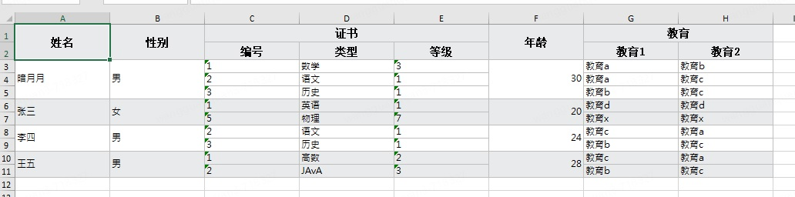

<font style="color:rgb(31, 35, 40);">使用toMap方法示例</font>

<font style="color:rgb(31, 35, 40);">不指定表头行将列索引将做为Key</font>

```java
reader.sheet(0).asMergeSheet()
.rows().map(org.ttzero.excel.reader.Row::toMap).forEach(System.out::println);

// 控制台输出
{0=姓名, 1=性别, 2=证书, 3=证书, 4=证书, 5=年龄, 6=教育, 7=教育}
{0=姓名, 1=性别, 2=编号, 3=类型, 4=等级, 5=年龄, 6=教育1, 7=教育2}
{0=暗月月, 1=男, 2=1, 3=数学, 4=3, 5=30, 6=教育a, 7=教育b}
{0=暗月月, 1=男, 2=2, 3=语文, 4=1, 5=30, 6=教育a, 7=教育c}
{0=暗月月, 1=男, 2=3, 3=历史, 4=1, 5=30, 6=教育b, 7=教育c}
{0=张三, 1=女, 2=1, 3=英语, 4=1, 5=20, 6=教育d, 7=教育d}
{0=张三, 1=女, 2=5, 3=物理, 4=7, 5=20, 6=教育x, 7=教育x}
{0=李四, 1=男, 2=2, 3=语文, 4=1, 5=24, 6=教育c, 7=教育a}
{0=李四, 1=男, 2=3, 3=历史, 4=1, 5=24, 6=教育b, 7=教育c}
{0=王五, 1=男, 2=1, 3=高数, 4=2, 5=28, 6=教育c, 7=教育a}
{0=王五, 1=男, 2=2, 3=JAvA, 4=3, 5=28, 6=教育b, 7=教育c}
```

<font style="color:rgb(31, 35, 40);">指表头时以表头行做为Key</font>

```java
reader.sheet(0).header(1, 2).rows().map(org.ttzero.excel.reader.Row::toMap).forEach(System.out::println);

// 控制台输出
注意此处 ↓ 拼接"证书:类型"做为表头
{姓名=暗月月, 性别=男, 证书:编号=1, 证书:类型=数学, 证书:等级=3, 年龄=30, 教育:教育1=教育a, 教育:教育2=教育b}
{姓名=, 性别=, 证书:编号=2, 证书:类型=语文, 证书:等级=1, 年龄=, 教育:教育1=教育a, 教育:教育2=教育c} // <- 注意此行
{姓名=, 性别=, 证书:编号=3, 证书:类型=历史, 证书:等级=1, 年龄=, 教育:教育1=教育b, 教育:教育2=教育c} // <- 注意此行
{姓名=张三, 性别=女, 证书:编号=1, 证书:类型=英语, 证书:等级=1, 年龄=20, 教育:教育1=教育d, 教育:教育2=教育d}
{姓名=, 性别=, 证书:编号=5, 证书:类型=物理, 证书:等级=7, 年龄=, 教育:教育1=教育x, 教育:教育2=教育x}
{姓名=李四, 性别=男, 证书:编号=2, 证书:类型=语文, 证书:等级=1, 年龄=24, 教育:教育1=教育c, 教育:教育2=教育a}
{姓名=, 性别=, 证书:编号=3, 证书:类型=历史, 证书:等级=1, 年龄=, 教育:教育1=教育b, 教育:教育2=教育c}
{姓名=王五, 性别=男, 证书:编号=1, 证书:类型=高数, 证书:等级=2, 年龄=28, 教育:教育1=教育c, 教育:教育2=教育a}
{姓名=, 性别=, 证书:编号=2, 证书:类型=JAvA, 证书:等级=3, 年龄=, 教育:教育1=教育b, 教育:教育2=教育c}
```

<font style="color:rgb(31, 35, 40);">上面的输出可以看到除表头外所有合并的单元格只有第1个单元格有值其它单元格均为NULL，若要使合并单元格的其它合并项也有值可以将Sheet转为MergedSheet即可。</font>

```java
reader.sheet(0).asMergeSheet() // <- 转为MergedSheet
.header(1, 2).rows().map(org.ttzero.excel.reader.Row::toMap).forEach(System.out::println);

// 控制台输出
{姓名=暗月月, 性别=男, 证书:编号=1, 证书:类型=数学, 证书:等级=3, 年龄=30, 教育:教育1=教育a, 教育:教育2=教育b}
{姓名=暗月月, 性别=男, 证书:编号=2, 证书:类型=语文, 证书:等级=1, 年龄=30, 教育:教育1=教育a, 教育:教育2=教育c} // <- 注意此行
{姓名=暗月月, 性别=男, 证书:编号=3, 证书:类型=历史, 证书:等级=1, 年龄=30, 教育:教育1=教育b, 教育:教育2=教育c} // <- 注意此行
{姓名=张三, 性别=女, 证书:编号=1, 证书:类型=英语, 证书:等级=1, 年龄=20, 教育:教育1=教育d, 教育:教育2=教育d}
{姓名=张三, 性别=女, 证书:编号=5, 证书:类型=物理, 证书:等级=7, 年龄=20, 教育:教育1=教育x, 教育:教育2=教育x}
{姓名=李四, 性别=男, 证书:编号=2, 证书:类型=语文, 证书:等级=1, 年龄=24, 教育:教育1=教育c, 教育:教育2=教育a}
{姓名=李四, 性别=男, 证书:编号=3, 证书:类型=历史, 证书:等级=1, 年龄=24, 教育:教育1=教育b, 教育:教育2=教育c}
{姓名=王五, 性别=男, 证书:编号=1, 证书:类型=高数, 证书:等级=2, 年龄=28, 教育:教育1=教育c, 教育:教育2=教育a}
{姓名=王五, 性别=男, 证书:编号=2, 证书:类型=JAvA, 证书:等级=3, 年龄=28, 教育:教育1=教育b, 教育:教育2=教育c}
```

### <font style="color:rgb(31, 35, 40);">isEmpty与isBlank的区别</font>
<font style="color:rgb(31, 35, 40);">v0.5.6提供了新的空单元格判断方法</font>`<font style="color:rgb(31, 35, 40);">Row#isBlank</font>`<font style="color:rgb(31, 35, 40);">，该方法与原有的</font>`<font style="color:rgb(31, 35, 40);">Row#isEmpty</font>`<font style="color:rgb(31, 35, 40);">的区别在于</font>`<font style="color:rgb(31, 35, 40);">isEmpty</font>`<font style="color:rgb(31, 35, 40);">的判断逻辑是只要包含值和样式（格式化/边框/填充/字体/对齐等）的任何一样都会判定为</font>`<font style="color:rgb(31, 35, 40);">否</font>`<font style="color:rgb(31, 35, 40);">，而</font>`<font style="color:rgb(31, 35, 40);">isBlank</font>`<font style="color:rgb(31, 35, 40);">仅判断单元格的值、值、值，只要单元格无值则判定为</font>`<font style="color:rgb(31, 35, 40);">是</font>`

<font style="color:rgb(31, 35, 40);">效果如下图所示</font>

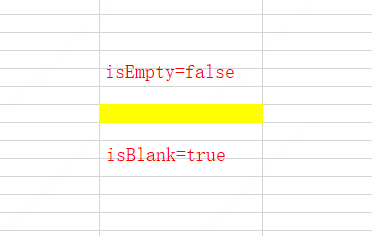

### <font style="color:rgb(31, 35, 40);">读取行号</font>
<font style="color:rgb(31, 35, 40);">你可以使用</font>`<font style="color:rgb(31, 35, 40);">Row#getRowNum</font>`<font style="color:rgb(31, 35, 40);">方法或者使用</font>`<font style="color:rgb(31, 35, 40);">@RowNum</font>`<font style="color:rgb(31, 35, 40);">注解来获取原始文件行号，与你打开Excel所见一样此行号从1开始</font>

### <font style="color:rgb(31, 35, 40);">额外属性</font>
<font style="color:rgb(31, 35, 40);">v0.5.11支持指定额外属性以丰富Row转对象时的列匹配，目前支持的属性有</font>`<font style="color:rgb(31, 35, 40);">Force Import</font>`<font style="color:rgb(31, 35, 40);">(无ExcelColumn注解强制匹配),</font><font style="color:rgb(31, 35, 40);"> </font>`<font style="color:rgb(31, 35, 40);">Ignore Case </font>`<font style="color:rgb(31, 35, 40);">(忽略大小写)和</font>`<font style="color:rgb(31, 35, 40);">Camel Case</font>`<font style="color:rgb(31, 35, 40);">(下划线转驼峰)三种属性，</font>_<font style="color:rgb(31, 35, 40);">属性间可以自由组合</font>_

```java
reader.sheet(0)
.forceImport()             // <- 没有ExcelColumn注解的列使用field name匹配
.headerColumnIgnoreCase()  // <- 忽略大小写匹配
.headerColumnToCamelCase() // <- 下划线转驼峰匹配
.dataRows().map(row -> row.to(U.class))
.collect(Collectors.toList());
```

### <font style="color:rgb(31, 35, 40);">xlsx和xls格式</font>
<font style="color:rgb(31, 35, 40);">大家应该对POI读取xls和xlsx两种格式需要两套API并不陌生吧，POI处理xls消耗内存极大，往往读几MB的文件就需要上百MB内存。 EEC统一了两种格式的API，换句话说你不需要关心该文件是xls还是xlsx，读取时EEC根据文件头来判断格式，然后选择使用何种方式解析文件。EEC读取xls消耗极小的内存，极限测试约</font>**<font style="color:rgb(31, 35, 40);">1G</font>**<font style="color:rgb(31, 35, 40);">的100万行xls文件，使用Easyexcel需要约</font>**<font style="color:rgb(31, 35, 40);">5G</font>**<font style="color:rgb(31, 35, 40);">内存，而EEC仅需要</font>**<font style="color:rgb(31, 35, 40);">7MB</font>**<font style="color:rgb(31, 35, 40);">内存。</font>

<font style="color:rgb(31, 35, 40);">我分别对EEC和Easyexcel进行了极限内存测试，也就是跑完测试不抛异常时的最小内存，结果如下。</font>

| <font style="color:rgb(31, 35, 40);">描述</font> | <font style="color:rgb(31, 35, 40);">1w/6.9M</font> | <font style="color:rgb(31, 35, 40);">5w/35M</font> | <font style="color:rgb(31, 35, 40);">10w/71M</font> | <font style="color:rgb(31, 35, 40);">50w/487M</font> | <font style="color:rgb(31, 35, 40);">100w/978M</font> |
| --- | --- | --- | --- | --- | --- |
| <font style="color:rgb(31, 35, 40);">EEC</font> | <font style="color:rgb(31, 35, 40);">3M</font> | <font style="color:rgb(31, 35, 40);">3M</font> | <font style="color:rgb(31, 35, 40);">3M</font> | <font style="color:rgb(31, 35, 40);">5M</font> | <font style="color:rgb(31, 35, 40);">7M</font> |
| <font style="color:rgb(31, 35, 40);">POI</font> | <font style="color:rgb(31, 35, 40);">50M</font> | <font style="color:rgb(31, 35, 40);">220M</font> | <font style="color:rgb(31, 35, 40);">440M</font> | <font style="color:rgb(31, 35, 40);">2400M</font> | <font style="color:rgb(31, 35, 40);">5000M</font> |


<font style="color:rgb(31, 35, 40);">从上图可以看出随着文件逐渐增大POI所需内存也逐渐增大，读取文件所需的内存甚至远远超过文件本身的大小，而EEC读文件所需内存一直比较平稳且远低于POI，基本可以在10MB下完成大文件读取。</font>

## <font style="color:rgb(31, 35, 40);">大数据量导出</font>
<font style="color:rgb(31, 35, 40);">前面已经展示了简单的导出示例，例子中大部分都传入一个数组，但是我们知道对于十万级、百万级的数量，不可能一次拉取到内存，此时</font>**<font style="color:rgb(31, 35, 40);">分片</font>**<font style="color:rgb(31, 35, 40);">功能就突现价值了。</font>

### <font style="color:rgb(31, 35, 40);">自动分片</font>
<font style="color:rgb(31, 35, 40);">ListSheet和ListMapSheet默认支持分片，我们只需要覆写</font>`<font style="color:rgb(31, 35, 40);">protected List<T> more()</font>`<font style="color:rgb(31, 35, 40);">方法即可。</font>

<font style="color:rgb(31, 35, 40);">下面代码将展示如何分页拉取学生数据，每次拉取1024条数据，这样内存中最多也就1024条数据，边写边拉取数据，直到返回空数组或者null。</font>

```java
new Workbook().addSheet(new ListSheet<Student>() {
    private int pageNo = 0, limit = 1024;
    @Override
    protected List<Student> more() {
        return service.getPageData(++pageNo, limit);
    }
}).writeTo(Paths.get("F:/excel"));
```

<font style="color:rgb(31, 35, 40);">得益于EEC的Worksheet默认分页，我们无需更多的处理，上面代码即可支持百万级、千万级数据导出</font>

<font style="color:rgb(31, 35, 40);">如下代码测试200w随机数字导出的示例</font>

```java
// 导出200w数据
final int loop = 2000;
new Workbook("200w").addSheet(new ListSheet<E>() {
    int n = 0; // 页码
    @Override
    public List<E> more() {
        return n++ < loop ? data() : null;
    }
}).writeTo(Paths.get("F:/excel"));

// 生成测试数据
public List<E> data() {
    List<E> list = new ArrayList<>(1000);
    for (int i = 0; i < 1000; i++) {
        E e = new E();
        list.add(e);
        e.nv = random.nextInt();
        e.str = getRandomString();
    }
    return list;
}

// 测试对象
public static class E {
    @ExcelColumn
    private int nv;
    @ExcelColumn
    private String str;
}
```

<font style="color:rgb(31, 35, 40);">打开文件效果如下:</font>

<font style="color:rgb(31, 35, 40);">第一页共写入1048576行，这也是xlsx格式单页最大行数</font>


<font style="color:rgb(31, 35, 40);">写满第一页后自动新增一个worksheet并写入剩余数据951426，共计200w+2（2个表头）</font>


### <font style="color:rgb(31, 35, 40);">使用data-supplier拉取数据</font>
<font style="color:rgb(31, 35, 40);">v0.5.14版本新增data-supplier减化了分片开发难度，它被定义为</font>`<font style="color:rgb(31, 35, 40);">BiFunction<Integer, T, List<T>></font>`<font style="color:rgb(31, 35, 40);">其中第一个入参</font>`<font style="color:rgb(31, 35, 40);">Integer</font>`<font style="color:rgb(31, 35, 40);">表示已拉取数据的记录数， 第二个入参</font>`<font style="color:rgb(31, 35, 40);">T</font>`<font style="color:rgb(31, 35, 40);">表示上一批数据中最后一个对象，业务端可以通过这两个参数来计算下一批数据应该从哪个节点开始拉取， 通常你可以使用第一个参数除以每批拉取的数据大小来确定当前页码，如果数据已排序则可以使用T对象的排序字段来计算下一批数据的游标从而跳过</font><font style="color:rgb(31, 35, 40);"> </font>`<font style="color:rgb(31, 35, 40);">limit ... offset ...</font>`<font style="color:rgb(31, 35, 40);">分页查询从页极大提升取数性能。</font>

```java
new Workbook()
.addSheet(new ListSheet<E>().setData((i, lastOne) -> i < 2_000_000 ? E.data() : null))
.writeTo(Paths.get("F:/excel/200w.xlsx"));
```

### <font style="color:rgb(31, 35, 40);">增加进度兼听</font>
<font style="color:rgb(31, 35, 40);">大数据量导出时往往耗时较长，表现出来就是程序卡在那里一动不动，为了防止这种假死现象我们可以在导出时增加一个进度兼听代码段，它位于</font>`<font style="color:rgb(31, 35, 40);">Workbook#onProgress</font>`<font style="color:rgb(31, 35, 40);">方法，它有两个入参 第一个是</font>`<font style="color:rgb(31, 35, 40);">sheet</font>`<font style="color:rgb(31, 35, 40);">表示当前正在导入哪个工作表，第二个是</font>`<font style="color:rgb(31, 35, 40);">rows</font>`<font style="color:rgb(31, 35, 40);">表示已写入的行数，</font>`<font style="color:rgb(31, 35, 40);">onProgress</font>`<font style="color:rgb(31, 35, 40);">方法每1000行被执行一次</font>

```java
new Workbook()
// 添加进度兼听代码，外部可观察写入数据量，可做导出进度也简单写日志
.onProgress((sheet, rows) -> System.out.println(sheet.getName() + " 已写入: " + rows))
.addSheet(new ListSheet<E>().setData((i, lastOne) -> i < 2_000_000 ? E.data() : null))
.writeTo(Paths.get("F:/excel/200w.xlsx"));
```

<font style="color:rgb(31, 35, 40);">对于导出时长评估的补充说明：xlsx格式本质为zip格式，所以导出可分为两阶段，第一阶段为写数据阶段，第二阶段为压缩阶段。</font>

+ <font style="color:rgb(31, 35, 40);">第一阶段可以根据总数据量和每1000条数据的耗时计算出该阶段的总耗时（每批动态计算来矫正偏差）</font>
+ <font style="color:rgb(31, 35, 40);">第二阶段就比较难动态计算了，一般做法是提前拿文件做基准zip压缩测试，根据每mb的基准时间来计算，好在做完基准测试后可直接根据文件大小就能计算出压缩时长，可以粗估为第一阶段时间同等时间</font>

### <font style="color:rgb(31, 35, 40);">读取分片数据</font>
<font style="color:rgb(31, 35, 40);">对于自动分片的数据，我们不需要一个sheet一个sheet读取，而是直接使用Stream的</font>`<font style="color:rgb(31, 35, 40);">flatMap</font>`<font style="color:rgb(31, 35, 40);">功能将worksheet降维处理，如下代码统计200w数据中数字大于1w的个数</font>

```java
try (ExcelReader reader = ExcelReader.read(Paths.get("F:/excel/200w.xlsx"))) {
    long count = reader.sheets()
    .flatMap(Sheet::dataRows) // 使用flatMap降维
    .map(row -> row.getInt(0)).filter(i -> i > 10000) // 取第1列数据并过滤大于10000的值
    .count();
    System.out.println("共计" + count + "个数大于1w");
}
```

<font style="color:rgb(31, 35, 40);">贴出DEBUG日志</font>

```java
- load xl\worksheets\sheet1.xml
- Dimension-Range: A1:B1048576
- end of file.
- load xl\worksheets\sheet2.xml
- Dimension-Range: A1:B951426
- end of file.
共计999601个数大于1w
```

<font style="color:rgb(31, 35, 40);">通过DEBUG日志可以看到使用flatMap解析完sheet1后接着解析sheet2，得出结果999601，与excel筛选出的结果一致</font>


## <font style="color:rgb(31, 35, 40);">模板导出</font>
<font style="color:rgb(31, 35, 40);">从v0.5.14开始EEC新增模板工作表TemplateSheet，它支持指定一个已有的Excel文件作为模板导出，TemplateSheet将复制模板工作表的样式并替换占位符， 同时TemplateSheet也可以和其它Worksheet混用，这意味着可以添加多个模板工作表和普通工作表。 创建模板工作表需要指定模板文件，它可以是本地文件也可是输入流InputStream，支持的类型包含xls 和xlsx两种格式，除模板文件外还需要指定工作表， 未指定工作表时默认以第一个工作表做为模板。</font>

### <font style="color:rgb(31, 35, 40);">绑定值</font>
<font style="color:rgb(31, 35, 40);">TemplateSheet工作表导出时不受ExcelColumn注解限制，导出的数据范围由模板内占位符决定，默认占位符由一对关闭的大括号</font>`<font style="color:rgb(31, 35, 40);">${key}</font>`<font style="color:rgb(31, 35, 40);">组成， 虽然占位符与EL表达式写法相同但模板占位符并不具备EL的能力，所以无法使用</font>`<font style="color:rgb(31, 35, 40);">${1 + 2}</font>`<font style="color:rgb(31, 35, 40);">或</font>`<font style="color:rgb(31, 35, 40);">${System.getProperty("user.name")}</font>`<font style="color:rgb(31, 35, 40);">这类语句来做运算， 模板占位符</font>_<font style="color:rgb(31, 35, 40);">仅做替换不做运算</font>_<font style="color:rgb(31, 35, 40);">所以不需要担心安全漏洞问题。</font>

`<font style="color:rgb(31, 35, 40);">setData(java.lang.Object)</font>`<font style="color:rgb(31, 35, 40);">方法为占位符绑定值，支持对象、Map、Array和List，数据量较大时可绑定一个数据生产者data-supplier来分片拉取数据， 它被定义为</font>`<font style="color:rgb(31, 35, 40);">BiFunction<Integer, T, List<T>></font>`<font style="color:rgb(31, 35, 40);">，其中第一个入参</font>`<font style="color:rgb(31, 35, 40);">Integer</font>`<font style="color:rgb(31, 35, 40);">表示已拉取数据的记录数（并非已写入数据）， 第二个入参</font>`<font style="color:rgb(31, 35, 40);">T</font>`<font style="color:rgb(31, 35, 40);">表示上一批数据中最后一个对象，业务端可以通过这两个参数来计算下一批数据应该从哪个节点开始拉取， 通常你可以使用第一个参数除以每批拉取的数据大小来确定当前页码，如果数据已排序则可以使用T对象的排序字段来计算下一批数据的游标以跳过</font><font style="color:rgb(31, 35, 40);"> </font>`<font style="color:rgb(31, 35, 40);">limit ... offset ... </font>`<font style="color:rgb(31, 35, 40);">分页查询从而大大提升取数性能。</font>

```java
new Workbook("模板测试")
// 模板工作表
.addSheet(new TemplateSheet(Paths.get("F:/excel/template.xlsx"))
          // 绑定用户列表
          .setData(userList)
          // 设置一个数据生产者 data-supplier分片查询数据
          .setData((i, lastOne) -> queryUser(i > 0 ? ((User)lastOne).getId() : 0))
          // 普通对象数组工作表
          .addSheet(new ListSheet<>().setData(list)))
.writeTo(Paths.get("F:/excel"));
```

### <font style="color:rgb(31, 35, 40);">命名空间</font>
<font style="color:rgb(31, 35, 40);">每个占位符都有一个命名空间，格式为</font>`<font style="color:rgb(31, 35, 40);">${namespace.key}</font>`<font style="color:rgb(31, 35, 40);">它用于区分不同的数据域，例如汇总数据和列表数据或多个列表数据， 当前只支持一级命名空间如果对象套对象则需要在外部拆分并以不同的命名空间设值</font>

<font style="color:rgb(31, 35, 40);">有如下模板，它有3个命名空间，分别为”默认“，”list“和”summary“</font>

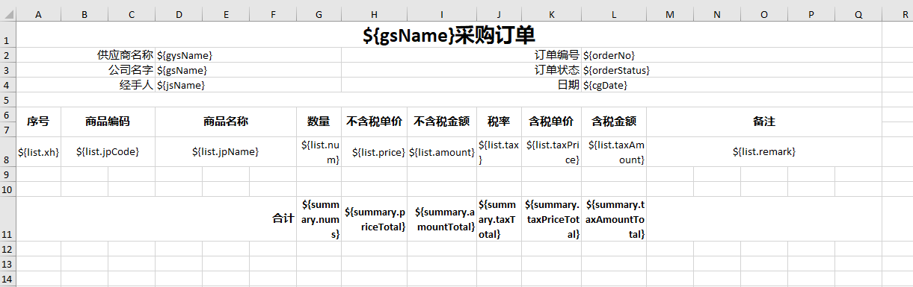

<font style="color:rgb(31, 35, 40);">测试代码</font>

```java
// 准备测试数据 >>>
Map<String, Object> main = new HashMap<>();
main.put("gysName", " 供应商A");
main.put("gsName", "ABC公司");
main.put("jsName", "亚瑟");
main.put("cgDate", new Date());
main.put("orderNo", "0001");
main.put("orderStatus", "OK");

List<Map<String, Object>> list = new ArrayList<>();
Map<String, Object> row1 = new HashMap<>();
row1.put("xh", 1);
row1.put("jpCode", "45A3495C72");
row1.put("jpName", "name1");
row1.put("num", 10);
row1.put("price", 10);
row1.put("amount", 100);
row1.put("tax", 0.6);
row1.put("taxPrice", 11.6);
row1.put("taxAmount", 116);
row1.put("remark", "备注1");
list.add(row1);
Map<String, Object> row2 = new HashMap<>();
row2.put("xh", 2);
row2.put("jpCode", "F2454E321436");
row2.put("jpName", "name2");
row2.put("num", 20);
row2.put("price", 20);
row2.put("amount", 200);
row2.put("tax", 0.6);
row2.put("taxPrice", 21.2);
row2.put("taxAmount", 212);
row2.put("remark", "备注2");
list.add(row2);

Map<String, Object> summary = new HashMap<>();
summary.put("nums", 30);
summary.put("priceTotal", 30);
summary.put("amountTotal", 300);
summary.put("taxTotal", 0.6);
summary.put("taxPriceTotal", 32.8);
summary.put("taxAmountTotal", 328);
// <<< 测试数据准备结束

new Workbook()
.addSheet(new TemplateSheet(testResourceRoot().resolve("template2.xlsx"))
          .setData(main)  <- 绑定命名空间null
          .setData("list", list) <- 绑定命名空间list
          .setData("summary", summary) <- 绑定命名空间summary
         ).writeTo(Paths.get("F:/excel/命名空间测试.xlsx"));
```

<font style="color:rgb(31, 35, 40);">效果如下：</font>


### <font style="color:rgb(31, 35, 40);">数据格式化</font>
<font style="color:rgb(31, 35, 40);">只需要在模板文件中设置好格式化即可，单元格设置的任意格式化都将被复制，如上示例中价格单元格包含格式化</font>`<font style="color:rgb(31, 35, 40);">¥0.00_)</font>`<font style="color:rgb(31, 35, 40);">，模板文件看不出效果但结果文件可以看到效果（结果为数字所以有格式化效果）</font>

### <font style="color:rgb(31, 35, 40);">内置函数</font>
<font style="color:rgb(31, 35, 40);">占位符中包含三个内置函数它们分别为</font>`<font style="color:rgb(31, 35, 40);">[@link:]</font>`<font style="color:rgb(31, 35, 40);">、</font>`<font style="color:rgb(31, 35, 40);">[@list:]</font>`<font style="color:rgb(31, 35, 40);">和</font>`<font style="color:rgb(31, 35, 40);">[@media:]</font>`<font style="color:rgb(31, 35, 40);">，分别用于设置单元格的值为超链接、序列和图片， 其中序列的值可以从源工作表中获取也可以使用</font>`<font style="color:rgb(31, 35, 40);">setData</font>`<font style="color:rgb(31, 35, 40);">方法来设置，</font>_<font style="color:rgb(31, 35, 40);">内置函数必须独占一个单元格且仅识别固定的三个内置函数， 任意其它命令将被识别为普通命令空间</font>_

<font style="color:rgb(31, 35, 40);">占位符整体样式：</font>`<font style="color:rgb(31, 35, 40);">[@内置函数:][命名空间][.]<占位符></font>`

<font style="color:rgb(31, 35, 40);">有如下模板</font>


```java
// 准备测试数据 >>>
List<Map<String, Object>> list = new ArrayList<>();
Map<String, Object> row1 = new HashMap<>();
row1.put("name", "张三");
row1.put("age", 6);
row1.put("sex", "男");
row1.put("pic", "https://m.360buyimg.com/babel/jfs/t20260628/103372/21/40858/120636/649d00b3Fea336b50/1e97a70d3a3fe1c6.jpg");
row1.put("jumpUrl", "https://www.tulingxueyuan.cn");
list.add(row1);

Map<String, Object> row2 = new HashMap<>();
row2.put("name", "李四");
row2.put("age", 8);
row2.put("sex", "女");
row2.put("pic", "https://gw.alicdn.com/bao/uploaded/i3/1081542738/O1CN01ZBcPlR1W63BQXG5yO_!!0-item_pic.jpg_300x300q90.jpg");
row2.put("jumpUrl", "https://www.tulingxueyuan.cn/zjtl/");
list.add(row2);
// <<< 测试数据准备结束

new Workbook()
// 模板工作表
.addSheet(new TemplateSheet(Paths.get("F:/excel/template.xlsx"))
          // 替换模板中占位符
          .setData(list)
          // 替换模板中"@list:sex"值为性别序列
          .setData("@list:sex", Arrays.asList("未知", "男", "女")))
.writeTo(Paths.get("F:/excel/内置函数测试.xlsx"));
```

<font style="color:rgb(31, 35, 40);">效果如下：</font>


<font style="color:rgb(31, 35, 40);">性别列为"序列"，头像列为"图片"，简历原件为"超链接"</font>

### <font style="color:rgb(31, 35, 40);">多种混合工作表</font>
<font style="color:rgb(31, 35, 40);">在EEC中Worksheet及其子类均被视为数据源，这些数据源均可以混合使用，输出协议由WorksheetWriter决定，目前仅支持xlsx和csv格式，所以即使模板为xls格式输出也将是xlsx格式</font>

```java
new Workbook()
.addSheet(new TemplateSheet(Paths.get("F:/excel/1.xlsx"))) // <- xlsx模板工作表
.addSheet(new TemplateSheet(Paths.get("F:/excel/2.xls"))) // <- xls模板工作表
.addSheet(new ListSheet<>(randomTestData())) // <- 普通工作表
.writeTo(Paths.get("F:/excel/混合模板.xlsx"));
```

### <font style="color:rgb(31, 35, 40);">兼容性</font>
<font style="color:rgb(31, 35, 40);">为了解决切换到EEC后导致现有模板失效从而大面积修改模板的问题，EEC提供了</font>`<font style="color:rgb(31, 35, 40);">setPrefix</font>`<font style="color:rgb(31, 35, 40);">和</font>`<font style="color:rgb(31, 35, 40);">setSuffix</font>`<font style="color:rgb(31, 35, 40);">两个方法来修改占位符前缀和后缀，如现有模板占位符为</font>`<font style="color:rgb(31, 35, 40);">{key}</font>`<font style="color:rgb(31, 35, 40);"> </font><font style="color:rgb(31, 35, 40);">则可以使用</font>`<font style="color:rgb(31, 35, 40);">setPrefix("{")</font>`<font style="color:rgb(31, 35, 40);">来重置前缀，这样你不需要修改现有模板来完成适配。</font>

```java
new Workbook()
// 模板工作表
.addSheet(new TemplateSheet(Paths.get("F:/excel/template.xlsx"))
          .setPrefix("{") // <- 重置前缀为"{"
          .setData(list))
.writeTo(Paths.get("F:/excel/内置函数测试.xlsx"));
```

### <font style="color:rgb(31, 35, 40);">特殊说明</font>
<font style="color:rgb(31, 35, 40);">TemplateSheet工作表使用ExcelReader读取源文件，并复制样式等信息到新的工作表，它并不是直接在原工作表中追加数据，所以会丢失一些信息（只能读取当前ExcelReader所支持的内容）。</font>

<font style="color:rgb(31, 35, 40);">除此之外v0.5.14版本还有一些功能限制，具体表现如下</font>

+ <font style="color:rgb(31, 35, 40);">不支持多Table，如果Table列与其余固定文本一起时固定文本也将被复制</font>
+ <font style="color:rgb(31, 35, 40);">替换占位符时不解析现有对象中的ExcelColumn注解，所以在实体里设置的注解属性完全无效</font>
+ <font style="color:rgb(31, 35, 40);">模板为xls时颜色会出现偏差，我尝试用POI读取颜色时也出现同样问题</font>
+ <font style="color:rgb(31, 35, 40);">暂时不支持自动分页，模板有更复杂的内容，无法处理分页后哪些部分需要复制到新的工作表，所以暂时不支持分页</font>
+ <font style="color:rgb(31, 35, 40);">模板中包含双色填充时导出结果只会保留color1的颜色</font>
+ <font style="color:rgb(31, 35, 40);">由于eec读取xls图片有BUG，所以模板文件中有图片时可能导致导出异常</font>

## <font style="color:rgb(31, 35, 40);">动态设置样式</font>
<font style="color:rgb(31, 35, 40);">所谓动态就是根据单元格或行数据不同为每个单元格或者每一行设置不同样式，这个功能可以极大丰富文件的可读性和多样性，算是EEC的个性化功能吧。</font>

### <font style="color:rgb(31, 35, 40);">使用StyleDesign注解</font>
<font style="color:rgb(31, 35, 40);">Java Bean可以使用</font>`<font style="color:rgb(31, 35, 40);">@StyleDesign</font>`<font style="color:rgb(31, 35, 40);">注解动态编辑样式（包含字体，填充，边框，格式等），StyleDesign作用于</font>`<font style="color:rgb(31, 35, 40);">Type</font>`<font style="color:rgb(31, 35, 40);">，</font>`<font style="color:rgb(31, 35, 40);">Field</font>`<font style="color:rgb(31, 35, 40);">和</font>`<font style="color:rgb(31, 35, 40);">Method</font>`<font style="color:rgb(31, 35, 40);">，前者影响整行样式，后两种影响单个Cell</font>

#### <font style="color:rgb(31, 35, 40);">作用于Type</font>
<font style="color:rgb(31, 35, 40);">StyleDesign指定的类需要实现</font>`<font style="color:rgb(31, 35, 40);">StyleProcessor<T></font>`<font style="color:rgb(31, 35, 40);">接口，该接口方法有3个参数，第一个为Java Bean，第2个是现有样式，第3个是Styles实例，</font>

```java
@StyleDesign(using = StudentScoreStyle.class)
public static class DesignStudent {
    @ExcelColumn
    private String name;
    @ExcelColumn
    private int score;
}

public static class StudentScoreStyle implements StyleProcessor<DesignStudent> {
    @Override
    public int build(DesignStudent o, int style, Styles st) {
        // 低于60分时背景色标黄
        if (o.getScore() < 60) {
            style = st.modifyFill(style, new Fill(PatternType.solid, Color.orange));
        } else if (o.getScore() > 95) {
            // 粗体+下划线（这里使用clone可以保留原字体和大小）
            Font newFont = st.getFont(style).clone().underline().bold();
            style = st.modifyFont(style, newFont);
        }
        return style;
    }
}
```

<font style="color:rgb(31, 35, 40);">效果如下：95分以上的行字体被加粗并加下划线，低于60分的整行背景色标黄</font>


#### <font style="color:rgb(31, 35, 40);">作用于Field和Method</font>
<font style="color:rgb(31, 35, 40);">StyleDesign使用于Field和Method用法与Type完全一样，只是传入的第1个参数变成单元格的值</font>

```java
public static class DesignStudent {
    @StyleDesign(using = NameMatch.class)
    @ExcelColumn
    private String name;
    private int score;

    @StyleDesign(using = ScoreStyle.class)
    @ExcelColumn
    public int getScore() {
        return score;
    }
}

private static final Set<String> VIP_SET = new HashSet<>(Arrays.asList("a", "b", "x"));

public static class NameMatch implements StyleProcessor<String> {
    @Override
    public int build(String name, int style, Styles sst) {
        if (VIP_SET.contains(name)) {
            Font font = sst.getFont(style).clone();
            style = sst.modifyFont(style, font.bold());
        }
        return style;
    }
}

public static class ScoreStyle implements StyleProcessor<Integer> {
    @Override
    public int build(Integer score, int style, Styles st) {
        if (score < 60) {
            style = st.modifyFill(style, new Fill(PatternType.solid, Color.orange));
        }
        return style;
    }
}
```


### <font style="color:rgb(31, 35, 40);">使用StyleProcessor</font>
<font style="color:rgb(31, 35, 40);">对于ListMapSheet,ResultSetSheet或StatementSheet这三种无法使用注解的Worksheet，EEC提供了</font>`<font style="color:rgb(31, 35, 40);">setStyleProcessor</font>`<font style="color:rgb(31, 35, 40);">方法，与StyleDesign一样，可以应用于整行或者单个单元格</font>

#### <font style="color:rgb(31, 35, 40);">作用于Worksheet</font>
```java
new Workbook()
.addSheet(new ListSheet<>(list
                          , new Column("姓名", "name")
                          , new Column("数学成绩", "score")
                          , new Column("备注", "toString")
                         ).setStyleProcessor((o,s,st) -> o.getScore() < 60 ? st.modifyFill(s, new Fill(PatternType.solid, Color.orange)) : s))
.writeTo(Paths.get("F:/excel"));
```

<font style="color:rgb(31, 35, 40);">低于60分整个单元格标黄</font>

<font style="color:rgb(31, 35, 40);"> </font>

#### <font style="color:rgb(31, 35, 40);">作用于Column</font>
```java
new Workbook()
.addSheet(new ListSheet<>(list
                          , new Column("姓名", "name").setStyleProcessor((n, s, sst) -> Styles.modifyHorizontal(s, Horizontals.CENTER))
                          , new Column("数学成绩", "score").setWidth(12D)
                          , new Column("备注", "toString").setWidth(25.32D).setWrapText(true)
                         )).writeTo(Paths.get("F:/excel"));
```

<font style="color:rgb(31, 35, 40);">上面的代码使用是将“姓名”列设置为居中</font>


<font style="color:rgb(31, 35, 40);">动态样式处理就展示这么多，对于样式处理有一定的学习成本，EEC处理样式一定有这两步，第一步是清除当前样式，第二步是添加新的样式。样式之间使用</font>`<font style="color:rgb(31, 35, 40);">|</font>`<font style="color:rgb(31, 35, 40);">运算符连接，也可以使用</font>`<font style="color:rgb(31, 35, 40);">Styles.modifyXX</font>`<font style="color:rgb(31, 35, 40);">不简化</font>

## <font style="color:rgb(31, 35, 40);">静态设置样式</font>
<font style="color:rgb(31, 35, 40);">Excel样式包含格式化NumFmt、字体Font、填充Fill、边框Border、 垂直对齐Verticals和水平对齐Horizontals以及自动折行组成， EEC简化了样式设计，单元格样式由一个int值保存，它可以极大减少内存开销和提升查找速度，但短板是可用的样式减少，当前最多只能包含</font>**<font style="color:rgb(31, 35, 40);">256个格式化，64个字体、64个填充和64个边框</font>**<font style="color:rgb(31, 35, 40);">， 对于日常的导出需求应该是够用的但复杂场景就需要考虑将int扩大到long。</font>

<font style="color:rgb(31, 35, 40);">相对于动态样式而言，设置静态样式是一次性的在初始化的时候计算所以并不会影响导出速度，默认的样式大多数情况下并不能满足每个人的审美， 好在EEC有多种方式修改默认的表头或者数据行的样式。</font>

### <font style="color:rgb(31, 35, 40);">修改表头样式</font>
<font style="color:rgb(31, 35, 40);">Worksheet暴露了几个修改表头样式的方法</font>`<font style="color:rgb(31, 35, 40);">setHeadStyle</font>`<font style="color:rgb(31, 35, 40);">或</font>`<font style="color:rgb(31, 35, 40);">setHeadStyleIndex</font>`<font style="color:rgb(31, 35, 40);">可以通过这些方法设置表头样式，每个Worksheet都可以设置不同的表头。</font>

<font style="color:rgb(31, 35, 40);">修改样式前必须先实例化Workbook然后才能修改样式。下面的示例展示如何修改表头字体、背景和边框</font>

```java
ListSheet<Item> sheet = new ListSheet<>(Item.randomTestData());

// 必须先执行这一步，将Worksheet添加到Workbook
Workbook workbook = new Workbook("Custom header style").addSheet(sheet);

// 然后才能修改样式
sheet.setHeadStyle(new Font("微软雅黑", 18, Font.Style.BOLD, Color.black)
                   , new Fill(PatternType.gray0625, Color.lightGray)
                   , new Border(BorderStyle.DOUBLE, Color.red));

workbook.writeTo(Paths.get("F:/excel"));
```

<font style="color:rgb(31, 35, 40);">效果如下：</font>

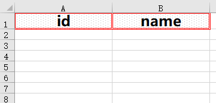

<font style="color:rgb(31, 35, 40);">其中BorderStyle效果如下：</font>

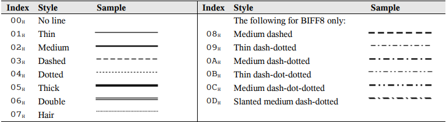

<font style="color:rgb(31, 35, 40);">PatternType效果如下：</font>


### <font style="color:rgb(31, 35, 40);">修改部分表头样式</font>
<font style="color:rgb(31, 35, 40);">如果仅需要修改表头的部分样式时则可以先获取原有样式然后再修改部分属性即可。 下面的示例展示修改部分表头的部分属性，比如修改字体、修改填充色等</font>

```java
ListSheet<Item> sheet = new ListSheet<>(Collections.singletonList(new Item()));
Workbook workbook = new Workbook().addSheet(sheet);

Styles styles = workbook.getStyles();
int style = sheet.defaultHeadStyle();
// 仅修改字体颜色
Font font = styles.getFont(style).clone() // 先获取原有样式并复制（不然会影响原样式）
.setColor(new Color(191, 191, 191)); // 设置新的样式
int newStyle = styles.modifyFont(style, font); // 将新字体添加进样式表
// 修改填充色
int borderStyle = styles.modifyFill(style, new Fill(PatternType.solid, new Color(247, 150, 70)));

sheet.setColumns(new Column[] {
    new Column("商品名称", "productName").setWidth(20.0D).setWrapText(true)
    , new Column("商品编码", "goodsNo").setHeaderStyle(borderStyle)
    , new Column("规格型号", "model")
    , new Column("品牌", "brandNameCn").setWidth(12.63D)
    , new Column("单位", "measure").setWidth(9.63D)
    , new Column("在库库存(勿改)", "quantity").setWidth(16.25D).setNumFmt("###0").setHeaderStyle(newStyle)
    , new Column("盘点库存", "editQuantity").setWidth(12.63D).setHeaderStyle(borderStyle)
});
```

<font style="color:rgb(31, 35, 40);">效果如下：</font>


<font style="color:rgb(31, 35, 40);">可以看到"在库库存"列观感上就给用户不能修改的视觉，这样可以避免用户将库存填写在此列，而应该填写在”盘点库存“列，并且将两列必填项的背景改为橙色可以着重显示。</font>

### <font style="color:rgb(31, 35, 40);">清除表头样式</font>
<font style="color:rgb(31, 35, 40);">清除表头样式就比较简单了，可以直接给StyleIndex赋值为0即可。</font>

```java
ListSheet<Item> sheet = new ListSheet<>(Item.randomTestData());
Workbook workbook = new Workbook("Custom header style").addSheet(sheet);

// Style Index设置为【0】
sheet.setHeadStyleIndex(0);
workbook.writeTo(Paths.get("F:/excel"));
```

<font style="color:rgb(31, 35, 40);">效果如下：</font>

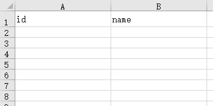

### <font style="color:rgb(31, 35, 40);">修改Body样式</font>
<font style="color:rgb(31, 35, 40);">与表头类似Column也提供了类似的方法，用户可以通过</font>`<font style="color:rgb(31, 35, 40);">setCellStyle</font>`<font style="color:rgb(31, 35, 40);">方法修改样式，这里就不赘述了，也支持动态修改样式，请参照</font>[<font style="color:rgb(31, 35, 40);">动态设置样式</font>](https://github.com/wangguanquan/eec/wiki/%E5%8A%A8%E6%80%81%E8%AE%BE%E7%BD%AE%E6%A0%B7%E5%BC%8F)

**<font style="color:rgb(31, 35, 40);">v0.5.12</font>**<font style="color:rgb(31, 35, 40);">提供所有样式修改，你可以在创建Column时调用</font>`<font style="color:rgb(31, 35, 40);">setFont</font>`<font style="color:rgb(31, 35, 40);">，</font>`<font style="color:rgb(31, 35, 40);">setBorder</font>`<font style="color:rgb(31, 35, 40);">，</font>`<font style="color:rgb(31, 35, 40);">setNumFmt</font>`<font style="color:rgb(31, 35, 40);">，</font>`<font style="color:rgb(31, 35, 40);">setFill</font>`<font style="color:rgb(31, 35, 40);">，</font>`<font style="color:rgb(31, 35, 40);">setHorizontal</font>`<font style="color:rgb(31, 35, 40);">和</font>`<font style="color:rgb(31, 35, 40);">setVertical</font>`<font style="color:rgb(31, 35, 40);">等方法直接设置初始样式</font>

```java
new Workbook()
.setAutoSize(true) // <- 自适应列宽
.addSheet(new ListSheet<>(randomTestData()
                          , new Column("编码", "code").setFont(new Font("Trebuchet MS", 20))
                          , new Column("姓名", "name").setFont(new Font("Trebuchet MS", 20)).setHorizontal(Horizontals.CENTER) // <-- 设置水平居中
                          , new Column("日期", "date").setFont(new Font("华文行楷", 11)).setNumFmt("yyyy-mm-dd hh:mm:ss")
                          , new Column("数字", "num").setFont(new Font("Bauhaus 93", 14)).setNumFmt("#,##0_);[Red]-#,##0_);0_)") // <- 指定字体和格式化
                         )).writeTo(Paths.get("F:/excel"));
```

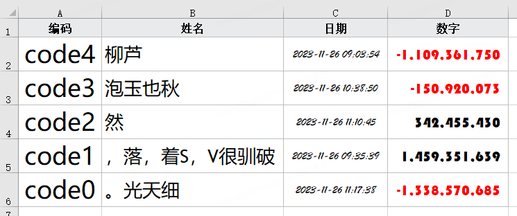

## <font style="color:rgb(31, 35, 40);">指定导出时的列顺序和位置</font>
<font style="color:rgb(31, 35, 40);">默认情况ListSheet根据对象的Field自然顺序导出，ListMapSheet是无序的，ResultSetSheet和StatementSheet的顺序当然就是Query字段的顺序，除了默认顺序还可以指定Column来调整顺序。</font>

<font style="color:rgb(31, 35, 40);"> v0.4.13版本开始，ExcelColumn注解中增加了</font>`<font style="color:rgb(31, 35, 40);">colIndex</font>`<font style="color:rgb(31, 35, 40);">属性以及Column增加</font>`<font style="color:rgb(31, 35, 40);">#setColIndex</font>`<font style="color:rgb(31, 35, 40);">方法。此属性定义为</font>`<font style="color:rgb(31, 35, 40);">int</font>`<font style="color:rgb(31, 35, 40);">类型，用于指定</font>_<font style="color:rgb(31, 35, 40);">从‘0’开始</font>_<font style="color:rgb(31, 35, 40);">的列位置，</font>**<font style="color:rgb(31, 35, 40);">从‘0’开始</font>**<font style="color:rgb(31, 35, 40);">、</font>**<font style="color:rgb(31, 35, 40);">从‘0’开始</font>**<font style="color:rgb(31, 35, 40);"> 重要的事情说三遍。 </font>

<font style="color:rgb(31, 35, 40);">此值的最大值与excel版本有关，excel97-2003限制为</font>`<font style="color:rgb(31, 35, 40);">256</font>`<font style="color:rgb(31, 35, 40);">，xlsx版本限制为</font>`<font style="color:rgb(31, 35, 40);">16_384</font>`<font style="color:rgb(31, 35, 40);">，因为colIndex是从0开始，所以要在此限制上减1，分别为</font>`<font style="color:rgb(31, 35, 40);">254</font>`<font style="color:rgb(31, 35, 40);">和</font>`<font style="color:rgb(31, 35, 40);">16_383</font>`<font style="color:rgb(31, 35, 40);">， 超过此限制会抛出 </font>[<font style="color:rgb(31, 35, 40);">TooManyColumnsException</font>](https://github.com/wangguanquan/eec/blob/master/src/main/java/org/ttzero/excel/entity/TooManyColumnsException.java)<font style="color:rgb(31, 35, 40);"> 异常。</font>

_<font style="color:rgb(31, 35, 40);">此位置是绝对位置，如果有相同的列下标，这些列下标会依次往后排列</font>_

<font style="color:rgb(31, 35, 40);">下面列一些实际例子:</font>

### <font style="color:rgb(31, 35, 40);">自然顺序</font>
<font style="color:rgb(31, 35, 40);">我们先定义一个基础的类如下：</font>

```java
public class OrderEntry {
    @ExcelColumn(colIndex = 0)
    private String s;
    @ExcelColumn( colIndex = 1)
    private Date date;
    @ExcelColumn(colIndex = 2)
    private Double d;
    @ExcelColumn(colIndex = 3)
    private String s2 = "a";
    @ExcelColumn(colIndex = 4)
    private String s3 = "b";
    @ExcelColumn(colIndex = 5)
    private String s4 = "c";

    // 这里是 GET SET 方法...
}
```

<font style="color:rgb(31, 35, 40);">这是一个自然顺序的类，如你想象导出结果如下：</font>


### <font style="color:rgb(31, 35, 40);">相同列下标</font>
<font style="color:rgb(31, 35, 40);">如果出现相同列下标会如何处理，是抛异常还是别的？</font>

<font style="color:rgb(31, 35, 40);">我们定义一个类继承OrderEntry，将原来第2和第3列都设置为5，如下：</font>

```java
public class SameOrderEntry extends OrderEntry {
    @Override
    @ExcelColumn(colIndex = 5)
    public Double getD() {
        return super.getD();
    }

    @Override
    @ExcelColumn(colIndex = 5)
    public String getS2() {
        return super.getS2();
    }
}
```

<font style="color:rgb(31, 35, 40);">这样列下标为5的一共有3个，分别是</font>`<font style="color:rgb(31, 35, 40);">Double d</font>`<font style="color:rgb(31, 35, 40);">、</font>`<font style="color:rgb(31, 35, 40);">String s2</font>`<font style="color:rgb(31, 35, 40);">和</font>`<font style="color:rgb(31, 35, 40);">String s4</font>`<font style="color:rgb(31, 35, 40);">，现在的顺序是[0, 1, 4, 5, 5, 5]，EEC导出会是怎样呢？</font>


<font style="color:rgb(31, 35, 40);">C、D两列空出来了，正好对应上面跳过的2,3。那3个5如何处理呢？它会按照属性定义的顺序，正好就是[d, s2, s4]</font>

### <font style="color:rgb(31, 35, 40);">极限下标</font>
<font style="color:rgb(31, 35, 40);">我们设置一些较大的下标测试一下，设置一个xlsx可接受的最大下标16_383，定义如下：</font>

```java
public class LargeOrderEntry extends OrderEntry {
    @Override
    @ExcelColumn(colIndex = 16_383)
    public Date getDate() {
        return super.getDate();
    }

    @Override
    @ExcelColumn(colIndex = 189)
    public String getS2() {
        return super.getS2();
    }
}
```

<font style="color:rgb(31, 35, 40);">效果如下，列太大所以只接了两个较大的列进行拼接</font>


### <font style="color:rgb(31, 35, 40);">指定开始行</font>
<font style="color:rgb(31, 35, 40);">默认的EEC从第1行开始写，从v0.5.8版本开始你可以通过</font>`<font style="color:rgb(31, 35, 40);">Sheet#setStartRowIndex</font>`<font style="color:rgb(31, 35, 40);">来指定第一行的位置，行下标的范围为</font>`<font style="color:rgb(31, 35, 40);">1~${limit}</font>`<font style="color:rgb(31, 35, 40);">，这里limit与文件格式相关，xlsx格式默认最大下标</font>`<font style="color:rgb(31, 35, 40);">1_048_576</font>`<font style="color:rgb(31, 35, 40);">，xls最大下标</font>`<font style="color:rgb(31, 35, 40);">65_536</font>`

`<font style="color:rgb(31, 35, 40);">startRowIndex</font>`<font style="color:rgb(31, 35, 40);">和</font>`<font style="color:rgb(31, 35, 40);">colIndex</font>`<font style="color:rgb(31, 35, 40);">两个属性可以搭配使用，下面代码展示从第7行第4列开始写表格</font>

```java
List<RepeatableEntry> list = RepeatableEntry.randomTestData();
int startRowIndex = 7; // 指定起始行
new Workbook()
.setAutoSize(true)
.addSheet(new ListSheet<>(list).setStartRowIndex(startRowIndex))
.writeTo(Paths.get("F:/excel/Repeat Columns From 7.xlsx"));

// 读取时指定起始行
try (ExcelReader reader = ExcelReader.read(Paths.get("F:/excel/Repeat Columns From 7.xlsx"))) {
    List<RepeatableEntry> readList = reader.sheet(0).header(startRowIndex).bind(RepeatableEntry.class).rows()
    .map(row -> (RepeatableEntry) row.get()).collect(Collectors.toList());
}
```

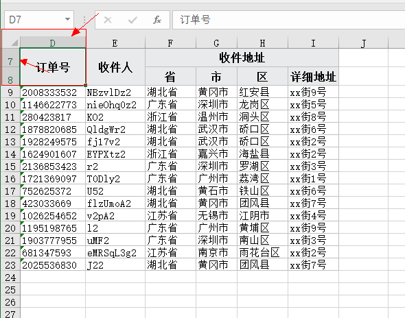

<font style="color:rgb(31, 35, 40);">默认情况下无论行和列的开始下标是多少，打开文件时表格都会停留在左上角，如果不希望滚动到左上角则需要在调用</font>`<font style="color:rgb(31, 35, 40);">setStartRowIndex</font>`<font style="color:rgb(31, 35, 40);">时指定参数</font>`<font style="color:rgb(31, 35, 40);">scrollToVisibleArea</font>`<font style="color:rgb(31, 35, 40);">为false，此时打开文件时活动光标在</font>`<font style="color:rgb(31, 35, 40);">A1</font>`<font style="color:rgb(31, 35, 40);">单元格， 因为光标停留在</font>`<font style="color:rgb(31, 35, 40);">A1</font>`<font style="color:rgb(31, 35, 40);">所以打开文件可能无法在屏幕中看到数据，需要手动滚动到数据行，容易产生没有数据的误会，请谨慎使用。</font>

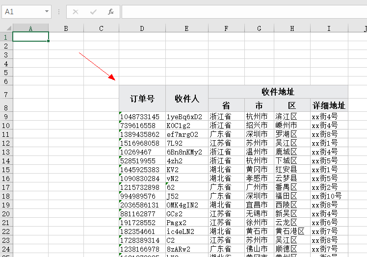

## <font style="color:rgb(31, 35, 40);">合并单元格</font>
<font style="color:rgb(31, 35, 40);">EEC通过扩展参数</font>`<font style="color:rgb(31, 35, 40);">merge_cells</font>`<font style="color:rgb(31, 35, 40);">来添加合并单元格，合并是作用于一个区域，所以使用</font>`<font style="color:rgb(31, 35, 40);">Dimension</font>`<font style="color:rgb(31, 35, 40);">来保存一个合并的起始和结束行列信息，你可以合并任意多个单元格，其中只有一个限制，那就是合并后的单元格</font>**<font style="color:rgb(31, 35, 40);">可以相邻但不能重叠</font>**

### <font style="color:rgb(31, 35, 40);">写入</font>
<font style="color:rgb(31, 35, 40);">示例：</font>

```java
List<Dimension> mergeCells = Arrays.asList(Dimension.of("A1:A10"), Dimension.of("B2:E5"));
new Workbook()
.addSheet(new EmptySheet().putExtProp(Const.ExtendPropertyKey.MERGE_CELLS, mergeCells))
.writeTo(Paths.get("F:/excel"));
```

<font style="color:rgb(31, 35, 40);">效果如下：</font>


<font style="color:rgb(31, 35, 40);">如果单元格有重叠程序不会报错，但打开文件时会弹出警告，如果点击“是”将会尝试修复，一般情况下会删除产生重叠的合并</font>

<font style="color:rgb(31, 35, 40);">例如我们将上面的第二个合并中</font>`<font style="color:rgb(31, 35, 40);">B2:E5</font>`<font style="color:rgb(31, 35, 40);">改为</font>`<font style="color:rgb(31, 35, 40);">A2:E5</font>`<font style="color:rgb(31, 35, 40);">将在A2单元格重叠，打开文件如下图</font>

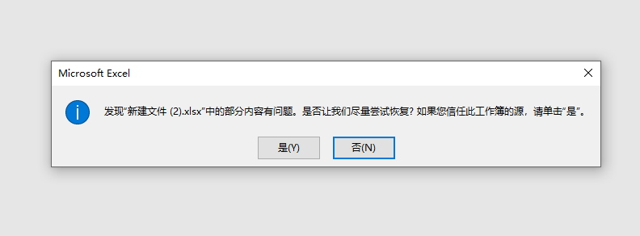

<font style="color:rgb(31, 35, 40);">点击“是”后可以看到仅保留了第一个合并，而将造成重叠的第二个合并删除了</font>

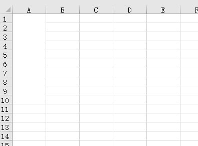

<font style="color:rgb(31, 35, 40);">你不能寄希望在自动修复上，那样将产生不可预期的效果，EEC也不会进行相关检查，所以最好事先预检，好在此预检并不复杂。</font>

### <font style="color:rgb(31, 35, 40);">读取</font>
<font style="color:rgb(31, 35, 40);">我们知道合并后的值只保存在左上的第一个单元格中其它单元格均为null，EEC提供了</font>`<font style="color:rgb(31, 35, 40);">copy-on-merged</font>`<font style="color:rgb(31, 35, 40);">方法，该方法会将第一个单元格的值复制到其它单元格中使得合并范围内的所有单元格读取的内容完全一样。</font>

<font style="color:rgb(31, 35, 40);">假如有如下合并单元格</font>

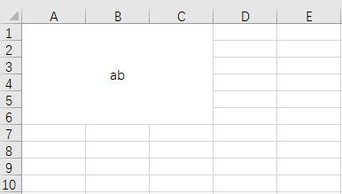

<font style="color:rgb(31, 35, 40);">使用</font>`<font style="color:rgb(31, 35, 40);">reader.sheet(0).rows().forEach(System.out::println)</font>`<font style="color:rgb(31, 35, 40);">普通读取结果如下，除了第一个单元格有值外其余单元格均为null，业务代码需要特殊处理才行否则将丢失数据。</font>

```java
 ab |  | 
    |  | 
    |  | 
    |  | 
    |  | 
    |  |
```

#### <font style="color:rgb(31, 35, 40);">使用copy-on-merge</font>
<font style="color:rgb(31, 35, 40);">org.ttzero.reader.Sheet可以使用</font>`<font style="color:rgb(31, 35, 40);">asSheet</font>`<font style="color:rgb(31, 35, 40);">，</font>`<font style="color:rgb(31, 35, 40);">asMergeSheet</font>`<font style="color:rgb(31, 35, 40);">，</font>`<font style="color:rgb(31, 35, 40);">asCalcSheet</font>`<font style="color:rgb(31, 35, 40);">和</font>`<font style="color:rgb(31, 35, 40);">asFullSheet</font>`<font style="color:rgb(31, 35, 40);">相互转换，转换后Worksheet就有了不同的功能，考虑到普通的Sheet读取速度最快所以请根据需求选择。</font>

```java
try (ExcelReader reader = ExcelReader.read(Paths.get("F:/excel/abc.xlsx"))) {
    // 使用asMergeSheet转换为MergeSheet
    MergeSheet sheet = reader.sheet(0).asMergeSheet();
    // 合并单元格信息
    Grid mergeGrid = sheet.getMergeGrid();
    // 使用test来判断某个单元格是否为合并单元格
    assert mergeGrid.test(3, 1);

    // 获取所有合并单元格的位置
    List<Dimension> mergeCells = sheet.getMergeCells();

    // 打印
    sheet.rows().forEach(System.out::println);
}
```

<font style="color:rgb(31, 35, 40);">得到Grid后可以通过test方法来测试单元格是否为合并单元格，另一个重要的方式中size，该方法返回合并单元格个数。</font>

<font style="color:rgb(31, 35, 40);">使用</font>`<font style="color:rgb(31, 35, 40);">copy-on-merged</font>`<font style="color:rgb(31, 35, 40);">后将得到如下效果</font>

```java
ab | ab | ab
ab | ab | ab
ab | ab | ab
ab | ab | ab
ab | ab | ab
ab | ab | ab
```

<font style="color:rgb(31, 35, 40);">这样我们不需要额外处理null</font>

## <font style="color:rgb(31, 35, 40);">设置多行表头</font>
EEC从v0.5.3开始支持多表头导出，同样的可以使用注解或者手动指定两种方式，最多支持10层。

### 使用注解
Java Bean可以使用多个`ExcelColumn`来实现，多个ExcelColumn的顺序与导出的最终表头完全一致，具体示例如下:

```java
@ExcelColumn("订单号")
private String orderNo;

@ExcelColumn("收件人")
private String recipient;

@ExcelColumn("收件地址")
@ExcelColumn("省")
private String province;

@ExcelColumn("收件地址")
@ExcelColumn("市")
private String city;

@ExcelColumn("收件地址")
@ExcelColumn("区")
private String area;

@ExcelColumn("收件地址")
@ExcelColumn("详细地址")
private String detail;
```

定义如上Java实体，在‘省’，‘市’，‘区’，和‘详细地址‘4个属性上面加了一个共同的父表头‘收件地址’，效果如下


更为复杂的示例

```java
@ExcelColumn("TOP")
@ExcelColumn
@ExcelColumn
@ExcelColumn("订单号")
private String orderNo;

@ExcelColumn("TOP")
@ExcelColumn
@ExcelColumn
@ExcelColumn("收件人")
private String recipient;

@ExcelColumn("TOP")
@ExcelColumn
@ExcelColumn("收件地址")
@ExcelColumn("省")
private String province;

@ExcelColumn("TOP")
@ExcelColumn
@ExcelColumn("收件地址")
@ExcelColumn("市")
private String city;

@ExcelColumn("TOP")
@ExcelColumn
@ExcelColumn("收件地址")
@ExcelColumn("区")
private String area;

@ExcelColumn("TOP")
@ExcelColumn
@ExcelColumn("收件地址")
@ExcelColumn("详细地址")
private String detail;
```

我们在头顶再加一个共同的表头‘TOP’，展示效果如下


### 手动添加
Column增加`addSubColumn`方法用于添加子表头，顺序与注解相似，第一个在最上面最后一个需要指定字段名。这种方式多用于ListMapSheet和ResultSetSheet

```java
new Workbook().addSheet(new ListSheet<>(data
                                        , new Column("姓名", "name")
                                        , new Column("性别", "sex")
                                        , new Column("证书").addSubColumn(new Column("编号", "no"))
                                        , new Column("证书").addSubColumn(new Column("类型", "type"))
                                        , new Column("证书").addSubColumn(new Column("等级", "level"))
                                        , new Column("年龄", "age")
                                        , new Column("教育").addSubColumn(new Column("教育1", "jy1"))
                                        , new Column("教育").addSubColumn(new Column("教育2", "jy2"))))
.writeTo(Paths.get("F:/excel"));
```


### 读取带多行表头的文件
v0.5.6开始EEC支持指定表头位置，你可以通过`Sheet#header(fromRowNum, toRowNum)`来指定表头，`header`方法支持`fromRowNum`和`toRowNum`两个参数，为了更加直观这两个参数均从1开始，和打开excel所看到的一样，同时from和to两端都是包含的，对于多行表头来说header将以`A1:A2:A3`这种格式进行纵向拼接

我们拿上面【手动添加】的文件为例子来展示如何使用header来支持多表头，我们只需要设置header(1, 2)指定两行表头即可`reader.sheet(0).header(1, 2).dataRows().map(Row::toMap).forEach(System.out::println)`，通过这个命令可输入如下结果

```java
{姓名=暗月月, 性别=男, 证书:编号=1, 证书:类型=数学, 证书:等级=3, 年龄=30, 教育:教育1=教育a, 教育:教育2=教育b}
{姓名=暗月月, 性别=男, 证书:编号=2, 证书:类型=语文, 证书:等级=1, 年龄=30, 教育:教育1=教育a, 教育:教育2=教育c}
{姓名=暗月月, 性别=男, 证书:编号=3, 证书:类型=历史, 证书:等级=1, 年龄=30, 教育:教育1=教育b, 教育:教育2=教育c}
{姓名=张三, 性别=女, 证书:编号=1, 证书:类型=英语, 证书:等级=1, 年龄=20, 教育:教育1=教育d, 教育:教育2=教育d}
{姓名=张三, 性别=女, 证书:编号=5, 证书:类型=物理, 证书:等级=7, 年龄=20, 教育:教育1=教育x, 教育:教育2=教育x}
{姓名=李四, 性别=男, 证书:编号=2, 证书:类型=语文, 证书:等级=1, 年龄=24, 教育:教育1=教育c, 教育:教育2=教育a}
{姓名=李四, 性别=男, 证书:编号=3, 证书:类型=历史, 证书:等级=1, 年龄=24, 教育:教育1=教育b, 教育:教育2=教育c}
{姓名=王五, 性别=男, 证书:编号=1, 证书:类型=高数, 证书:等级=2, 年龄=28, 教育:教育1=教育c, 教育:教育2=教育a}
{姓名=王五, 性别=男, 证书:编号=2, 证书:类型=JAvA, 证书:等级=3, 年龄=28, 教育:教育1=教育b, 教育:教育2=教育c}
```

我们可以看到中间合并的表头表现为`证书:编号, 证书:类型, 证书:等级`，如果Java bean使用EEC注解的话也可以直接转对象`reader.sheet(0).header(1, 2).dataRows().map(row -> row.to(Order.class)).forEach(Print::println)`和单行表头完全一样

### 自定义表头
v0.5.6同样也支持自定义表头，如果自动解析表头有问题则可以设置自定义表头

```java
// 创建自定义表头
org.ttzero.excel.reader.Row headerRow2 = new org.ttzero.excel.reader.Row() {};
Cell[] cells2 = new Cell[8];
cells2[0] = new Cell((short) 1).setSv("姓名");
cells2[1] = new Cell((short) 2).setSv("性别");
cells2[2] = new Cell((short) 3).setSv("证书:编号");
cells2[3] = new Cell((short) 4).setSv("证书:类型");
cells2[4] = new Cell((short) 5).setSv("证书:等级");
cells2[5] = new Cell((short) 6).setSv("年龄");
cells2[6] = new Cell((short) 7).setSv("教育:教育1");
cells2[7] = new Cell((short) 8).setSv("教育:教育2");
headerRow2.setCells(cells2);
// 使用自定义表头
reader.sheet(0).reset().header(2).bind(Object.class, new HeaderRow().with(2, headerRow2))
.rows().map(Row::toMap).forEach(System.out::println);
```

## <font style="color:rgb(31, 35, 40);">关于自适应列宽</font>
<font style="color:rgb(31, 35, 40);">v0.5.3版本大幅优化了自适应列宽计算方式，使得在</font>**<font style="color:rgb(31, 35, 40);">默认字体</font>**<font style="color:rgb(31, 35, 40);">下列宽更加精准，相对于POI的自适应结果EEC对中文处理更精准，EEC设置自适应列宽只需要调用</font>`<font style="color:rgb(31, 35, 40);">setAutoSize</font>`<font style="color:rgb(31, 35, 40);">即可。</font>

**<font style="color:rgb(31, 35, 40);">v0.5.12</font>**<font style="color:rgb(31, 35, 40);">版本进一步优化字体宽度计算逻辑，除了支持“宋体11号”字体外现在支持绝大部分字体和字号，同时还优化了自动折行时计算逻辑，升级后将分组计算每段文本宽度取最大值， 而不是当做一个长字符串处理</font>

### <font style="color:rgb(31, 35, 40);">默认字体</font>
```java
// 测试类
public static class WidthTestItem {
    @ExcelColumn(value = "整型", format = "#,##0_);[Red]-#,##0_);0_)")
    private Integer nv;
    @ExcelColumn("字符串(en)")
    private String sen;
    @ExcelColumn("字符串(中文)")
    private String scn;
    @ExcelColumn(value = "日期时间", format = "yyyy-mm-dd hh:mm:ss")
    private Timestamp iv;
}

new Workbook()
.setAutoSize(true) // <- 自适应列宽
.addSheet(new ListSheet<>(randomTestData()))
.writeTo(Paths.get("F:/excel"));
```

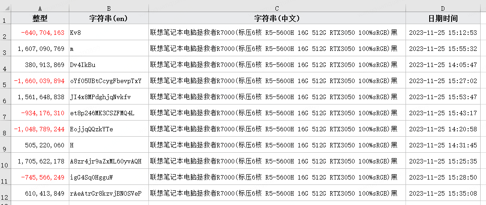

### <font style="color:rgb(31, 35, 40);">自定义字体</font>
<font style="color:rgb(31, 35, 40);">下面修改4列的4种字体和字号，看一下自适应列宽的效果</font>

```java
new Workbook()
.setAutoSize(true) // <- 自适应列宽
.addSheet(new ListSheet<>(randomTestData()
                          , new Column("整型", "nv").setNumFmt("#,##0_);[Red]-#,##0_);0_)").setFont(new Font("Bauhaus 93", 16))
                          , new Column("字符串(EN)", "sen").setFont(new Font("Trebuchet MS", 20))
                          , new Column("字符串(中文)", "scn").setFont(new Font("微软雅黑", 8))
                          , new Column("日期", "iv").setNumFmt("yyyy-mm-dd hh:mm:ss").setFont(new Font("华文行楷", 14))
                         )).writeTo(Paths.get("F:/excel"));
```


<font style="color:rgb(31, 35, 40);">优化后效果看上去还不错，当然也有一些字体计算出来的结果与实际显示效果可能有很大偏差，此时可以覆写XMLWorksheetWriter#stringWidth方法调整， 内部使用</font>`<font style="color:rgb(31, 35, 40);">SwingUtilities2.getFontMetrics#stringWidth</font>`<font style="color:rgb(31, 35, 40);">方法计算字符串宽度。测试发现windows系统自带的中文字体均能很好的适应， 但几乎所有的英文字体均无法正常适应要么无法适应中文要么无法适应英文所以调整起来还是比较麻烦，EEC也只能取巧处理。</font>

### <font style="color:rgb(31, 35, 40);">Number Format列如何计算宽度</font>
<font style="color:rgb(31, 35, 40);">如果格式化的列使用上面的计算方法就不准确了，格式化后的字符串基本会在原字符串上加一些分隔符，所以一般来说格式化后的长度比原长度更长，比如最常见的数字格式化</font>`<font style="color:rgb(31, 35, 40);">#,##0</font>`<font style="color:rgb(31, 35, 40);">，它的使用是每3位加一个逗号， 列宽与数字大小成正比，数字越大添加的逗号越多宽度越大。</font>

<font style="color:rgb(31, 35, 40);">最终的列宽与每个格式相关，所以计算列宽的方法也在NumFmt实例中，自定义格式化需要重写</font>`<font style="color:rgb(31, 35, 40);">calcNumWidth</font>`<font style="color:rgb(31, 35, 40);">方法来微调，计算方法可以参考</font>`<font style="color:rgb(31, 35, 40);">NumFmt#calcNumWidth</font>`<font style="color:rgb(31, 35, 40);">通用计算方法。</font>

```java
new Workbook()
.setAutoSize(true)
.addSheet(new ListSheet<>(expectList
                          , new Column().setNumFmt(new NumFmt("yyyy-mm-dd hh:mm:ss") { // <-- 设置NumFmt时重置计算方法
                              @Override
                              public double calcNumWidth(double base, Font font) {
                                  // TODO 根据字体和字号计算宽度
                                  return super.calcNumWidth(base, font);
                              }
                          })
                         )).writeTo(Paths.get("F:/excel"));
```

### <font style="color:rgb(31, 35, 40);">指定单列自适应宽度</font>
<font style="color:rgb(31, 35, 40);">除在工作表所有列自适应外还支持单列自适应，可在创建列的时候指定某列自适应列宽</font>`<font style="color:rgb(31, 35, 40);">new Column().autoSize()</font>`

```java
new Workbook()
.addSheet(new ListSheet<>("期末成绩", expectList
                          , new Column("学号", "id")
                          , new Column("姓名", "name").autoSize() // <-单列自适应
                          , new Column("成绩", "score")
                         )
         ).writeTo(Paths.get("F:/excel"));
```


### <font style="color:rgb(31, 35, 40);">戴上紧箍咒吧</font>
<font style="color:rgb(31, 35, 40);">自适应列宽在某种程度上来说可以使文档更美观，但如果某个单元格文字太长会让楼歪掉，这个时候就需要给它戴上一个紧箍咒，不能让它超过我们设定的范围， 这个设定是通过ExcelColumn注解的maxWidth属性实现，Column也可以使用width属性限定，我们看下效果：</font>

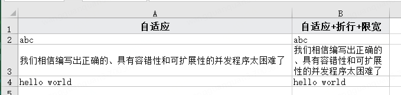

<font style="color:rgb(31, 35, 40);">左边是自适应列宽，右边是自适应列宽+MaxWidth+Wrap的效果，右边的效果只需要添加</font>`<font style="color:rgb(31, 35, 40);">@ExcelColumn(maxWidth = 20D, wrapText = true)</font>`<font style="color:rgb(31, 35, 40);">属性即可。</font>

### <font style="color:rgb(31, 35, 40);">多个属性间的组合逻辑</font>
<font style="color:rgb(31, 35, 40);">当前设置列宽有2个属性，分别是auto-size和width，组合效果如下</font>

| <font style="color:rgb(31, 35, 40);">auto-size</font> | <font style="color:rgb(31, 35, 40);">width</font> | <font style="color:rgb(31, 35, 40);">效果</font> |
| --- | --- | --- |
| <font style="color:rgb(31, 35, 40);">-</font> | <font style="color:rgb(31, 35, 40);">-</font> | <font style="color:rgb(31, 35, 40);">默认固定宽度</font> |
| <font style="color:rgb(31, 35, 40);">TRUE</font> | <font style="color:rgb(31, 35, 40);">-</font> | <font style="color:rgb(31, 35, 40);">自适应宽度</font> |
| <font style="color:rgb(31, 35, 40);">-</font> | <font style="color:rgb(31, 35, 40);">10</font> | <font style="color:rgb(31, 35, 40);">固定宽度10</font> |
| <font style="color:rgb(31, 35, 40);">TRUE</font> | <font style="color:rgb(31, 35, 40);">10</font> | <font style="color:rgb(31, 35, 40);">min(自适应宽度,10)</font> |
| <font style="color:rgb(31, 35, 40);">FALSE</font> | <font style="color:rgb(31, 35, 40);">-</font> | <font style="color:rgb(31, 35, 40);">默认固定宽度</font> |
| <font style="color:rgb(31, 35, 40);">FALSE</font> | <font style="color:rgb(31, 35, 40);">10</font> | <font style="color:rgb(31, 35, 40);">固定宽度10</font> |


## <font style="color:rgb(31, 35, 40);">批注</font>
<font style="color:rgb(31, 35, 40);">表头批注可以使用注释</font>`<font style="color:rgb(31, 35, 40);">HeaderComment</font>`<font style="color:rgb(31, 35, 40);">或创建Column指定</font>`<font style="color:rgb(31, 35, 40);">new Column().setHeaderComment()</font>`<font style="color:rgb(31, 35, 40);">，批定批注时还可以额外指定宽度和高度</font>

### <font style="color:rgb(31, 35, 40);">使用注解</font>
```java
public static class Stock {
    @ExcelColumn("库存")
    private int stock;
    @ExcelColumn(value = "库存健康度", comment = @HeaderComment(value =
                                                           "健康：库存大于阈值20%\n" +
                                                           "正常：库存高于阈值10%\n" +
                                                           "警告：库存高于阈值0～10%\n" +
                                                           "危险：库存低于阈值10%", width = 120))
    private StockHealth stockHealth;
}

// 生成测试数据
List<Stock> list = new ArrayList<>();
list.add(new Stock(60, StockHealth.HEALTHY));
list.add(new Stock(40, StockHealth.NORMAL));
list.add(new Stock(10, StockHealth.DANGER));
// 导出
new Workbook().addSheet(new ListSheet<>(list)).writeTo(Paths.get("F:/excel/批注测试.xlsx"));
```


### <font style="color:rgb(31, 35, 40);">使用Column#setHeaderComment添加</font>
```java
new Workbook().addSheet(new ListSheet<>(list)
                        .setColumns(new Column("库存", "stock")
                                    , new Column("库存健康度", "stockHealth")
                                    .setHeaderComment(new Comment(null,
                                                                  "健康：库存大于阈值20%\n" +
                                                                  "正常：库存高于阈值10%\n" +
                                                                  "警告：库存高于阈值0～10%\n" +
                                                                  "危险：库存低于阈值10%", 120., 60.))))
.writeTo(Paths.get("F:/excel/批注测试.xlsx"));
```

### <font style="color:rgb(31, 35, 40);">使用addComment手动添加批注</font>
<font style="color:rgb(31, 35, 40);">首先需要从Sheet拿到Comments，Comments是一个集合体它可以包含多个批注，目前Comment对象设计不太友好，只能通过ref指定位置没有办法指定row和col指定位置，当然头部批注也可以使用此方法添加，此方法更加灵活。</font>

```plain
Workbook workbook = new Workbook();
ListSheet listSheet = new ListSheet<>(list);
// 获取Comments
Comments comments = listSheet.createComments();
// A2单元格添加批注
comments.addComment("A2", null, "实际库存");
// B4单元格添加批注
comments.addComment("B4", "库存不足", "底于警戒线13%,请尽快添加库存");
workbook.addSheet(listSheet);
workbook.writeTo(Paths.get("F:/excel/批注测试.xlsx"));
```

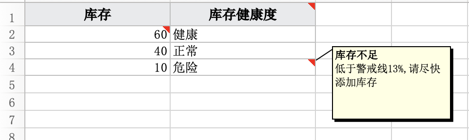

### <font style="color:rgb(31, 35, 40);">实战</font>
<font style="color:rgb(31, 35, 40);">场景：导入并校验数据是否合规，数据不合规时在对应的Cell上更改字体和背景颜色且通过批注添加异常信息</font>

1. <font style="color:rgb(31, 35, 40);">提前检查数据是否合规，如果全部合规就执行导入，如果有一条不合规就提前中断并创建Excel</font>
2. <font style="color:rgb(31, 35, 40);">使用TemplateSheet模板工作表做为输出源，这样可以最大限度保留原始文件样式</font>
3. <font style="color:rgb(31, 35, 40);">检查数据行并按需修改“字体”，“填充色”以及tooltips</font>

```java
public void testDataCheck() throws IOException {
try (ExcelReader reader = ExcelReader.read(Paths.get("F:/excel/students.xlsx"))) {
    // 提前检查数据是否合规（任意一条不合规就中断）
    boolean invalid = reader.sheet(0).dataRows().map(row -> row.too(Student.class)).anyMatch(e -> !check(e));

    // 检查正常的情况下处理导入
    if (!invalid) {
        // TODO 正常业务处理
    } else {
        // 包含不合规的数据则创建一个Excel
        new Workbook().addSheet(new TemplateSheet(Paths.get("F:/excel/students.xlsx")) {
            @Override
            protected void resetBlockData() {
                super.resetBlockData();

                // 获取样式表
                Styles styles = workbook.getStyles();

                // 再次全面检查所有行数据
                for (int i = 0, position = rowBlock.position(); i < position; i++) {
                    org.ttzero.excel.entity.Row row = rowBlock.get(i);
                    Cell[] cells = row.getCells();

                    // 检查必要列

                    // 检查“姓名”（设定第2列为“姓名”
                    Cell cell = cells[1];
                    String v = checkName(cell.stringVal);
                    // "姓名"不合规
                    if (v != null) {
                        // 获取原始样式
                        int style = styles.getStyleByIndex(cell.xf);
                        // 修改字体
                        // 如果仅仅是改字体样式，比如改为红色，加粗，斜体等可以先获取原始字体然后再修改
                        Font font = styles.getFont(style); // 注意：这里拿到的是字体的引用，修改前必须clone一份新字体
                        // 修改字体样式 - 改为斜体
                        style = styles.modifyFont(style, font.clone().italic()); // <- 注意这里clone了原始字体然后再改为斜体，如果不clone则将修改所有使用原始字体的单元格

                        // 修改填充色 - 改为橙色
                        style = styles.modifyFill(style, new Fill(Color.ORANGE));

                        // 添加进样式表并修改单元格样式
                        cell.xf = styles.of(style);

                        // 添加tooltips
                        createComments().addComment(new String(int2Col(2)) + (row.getIndex() + 1), new Comment("", v)); // int2Col(2) 将第2列转为Excel的ref值也就是'B'
                    }
                }
            }
        }.setPrefix("$#@!$")).writeTo(Paths.get("F:/excel/student-checked.xlsx"));
    }
}
}
```

<font style="color:rgb(31, 35, 40);">效果如下</font>


<font style="color:rgb(31, 35, 40);">目前版本暂时不支持读取批注，敬请关注</font>

## <font style="color:rgb(31, 35, 40);">读取Excel中的图片</font>
<font style="color:rgb(31, 35, 40);">导出图片请查看章节    导出Excel#导出图片</font>

<font style="color:rgb(31, 35, 40);">从v0.4.12版本开始支持读取excel文件中的图片，目前有两种途径获取图片信息，一是从ExcelReader中获取所有图片，另一个是从各Worksheet中获取当前Worksheet包含的图片。</font>

**<font style="color:rgb(31, 35, 40);">v0.5.12</font>**<font style="color:rgb(31, 35, 40);">支持读取POI的内嵌图片，读取方法不变</font>`<font style="color:rgb(31, 35, 40);">listPictures</font>`<font style="color:rgb(31, 35, 40);">将返回所有图片</font>

```java
// 从Workbook中获取所有图片
List<Drawings.Picture> pictures = reader.listPictures();

// 取第一个worksheet中包含的图片
List<Drawings.Picture> pictures = reader.sheet(0).listPictures();
```

<font style="color:rgb(31, 35, 40);">返回的</font>`<font style="color:rgb(31, 35, 40);">Drawings.Picture</font>`<font style="color:rgb(31, 35, 40);">类型，包含Worksheet，位置，本地临时路径，网络图片URL（如果是联机图片）以及是否为背景图片等信息，拿到本地临时路径后就可以将图片复制到其它任意位置，另外这里的位置信息是图片左上和右下在单元格的行列位置，对象为</font>`<font style="color:rgb(31, 35, 40);">Dimension</font>`<font style="color:rgb(31, 35, 40);">它包含"首行", "首列", "末行", "末列" 4个位置，例如：下图中图片在worksheet的位置为</font>`<font style="color:rgb(31, 35, 40);">C39:H52</font>`


<font style="color:rgb(31, 35, 40);">下面方法实现图片复制功能</font>

```java
// From workbook
List<Drawings.Picture> pictures = reader.listPictures();

// 如果excel不包含图片则pictures为NULL，所以防止NPE这里判断pictures
if (pictures != null) {
    // Copy images
    for (Drawings.Picture pic : pictures) {
        // 将图片复制到d盘
        Path dest = Paths.get("F:/excel", pic.sheet.getName(), pic.localPath.getFileName().toString());
        if (!Files.exists(dest.getParent())) FileUtil.mkdir(dest.getParent());
        Files.copy(pic.localPath, dest, StandardCopyOption.REPLACE_EXISTING);
    }
}
```

<font style="color:rgb(31, 35, 40);">v0.4.13支持xls的图片读取，方法与xlsx完全一样</font>


<font style="color:rgb(31, 35, 40);">xls图片保存在Workbook globals里，它处于Wroksheet之前，但是通过解析globals并不知道图片由哪个Worksheet引用，引用信息(包含位置信息)存在于各个Worksheet的末尾，为了避免过度解析，默认只记录global里图片的起始位置，调用</font>`<font style="color:rgb(31, 35, 40);">#listPictures</font>`<font style="color:rgb(31, 35, 40);">方法时才会解析图片，调用</font>`<font style="color:rgb(31, 35, 40);">Picture#getSheet()</font>`<font style="color:rgb(31, 35, 40);">或者</font>`<font style="color:rgb(31, 35, 40);">Picture#getDimension()</font>`<font style="color:rgb(31, 35, 40);">时解析引用信息。</font>

_<font style="color:rgb(31, 35, 40);">注意：本地临时路径在关闭ExcelReader后会自动清除，如果想要永久保存图片则需要将其复制到其它地方</font>_

## <font style="color:rgb(31, 35, 40);">读取单元格样式</font>
<font style="color:rgb(31, 35, 40);">EEC从v0.5.6开始支持读取单元格样式，Row对象提供</font>`<font style="color:rgb(31, 35, 40);">getCellStyle</font>`<font style="color:rgb(31, 35, 40);">方法获取单元格样式，此样式仅返回一个int值表示样式索引，如果要获得具体的样式， 你需要从Styles对象中调用具体的</font>`<font style="color:rgb(31, 35, 40);">getFont</font>`<font style="color:rgb(31, 35, 40);">，</font>`<font style="color:rgb(31, 35, 40);">getFill</font>`<font style="color:rgb(31, 35, 40);">，</font>`<font style="color:rgb(31, 35, 40);">getNumFmt</font>`<font style="color:rgb(31, 35, 40);">，</font>`<font style="color:rgb(31, 35, 40);">getBorder</font>`<font style="color:rgb(31, 35, 40);">，</font>`<font style="color:rgb(31, 35, 40);">getVertical</font>`<font style="color:rgb(31, 35, 40);">，</font>`<font style="color:rgb(31, 35, 40);">getHorizontal</font>`<font style="color:rgb(31, 35, 40);">来分别获取 字体，填充，格式化，边框，垂直对齐，水平对齐 6个样式</font>

```java
// 第一步 获取Styles对象
Styles styles = row.getStyles();

// 第二步 获取指定单元格样式
int style = row.getCellStyle(cell);

// 获取字体
Font font = styles.getFont(style);

// 获取边框
Border border = styles.getBorder(style);

// 获取填充 
Fill fill = styles.getFill(style);

// 获取格式化
NumFmt fmt = styles.getNumFmt(style);

// 水平对齐
String horizontal = Horizontals.of(styles.getHorizontal(style))

// 垂直对齐
String vertical = Verticals.of(styles.getVertical(style))
```

<font style="color:rgb(31, 35, 40);">通过上面的方法你可以完整的复制一个excel</font>

## <font style="color:rgb(31, 35, 40);">动态转换</font>
<font style="color:rgb(31, 35, 40);">导出数据时经常会将数据库一些状态值枚举值转为文本输出到Excel中，EEC提供了一个FunctionalInterface类</font>`<font style="color:rgb(31, 35, 40);">ConversionProcessor</font>`<font style="color:rgb(31, 35, 40);">，在创建Column时可以像这样</font><font style="color:rgb(31, 35, 40);"> </font>`<font style="color:rgb(31, 35, 40);">new Column("状态", "status", int.class, n -> ApplyStatusEnum.of((int) n).getDesc()</font>`<font style="color:rgb(31, 35, 40);">将状态这一列的数字值转为状态文本值输出，在v0.5.12版本中又引入了Converter接口 你可以在ExcelColumn注解中使用它，与ConversionProcessor相比Converter是双向的他提供输出转换</font>`<font style="color:rgb(31, 35, 40);">conversion</font>`<font style="color:rgb(31, 35, 40);">和输入转换</font>`<font style="color:rgb(31, 35, 40);">reversion</font>`

```java
@ExcelColumn
private String name;
@ExcelColumn(converter = StatusConvert.class) // <- 指定状态码转换器
private int status;

// 转换器实现
public static class StatusConvert implements Converter<Integer> {
    final String[] statusDesc = { "未开始", "进行中", "完结", "中止" };

    /**
     * Excel读取的文本转为状态码
     * 
     * @param v Excel原始值
     * @param fieldClazz 导入对象中Converter标记的字段类型
     * @return 状态码
     */
    @Override
    public Integer reversion(String v, Class<?> fieldClazz) {
        for (int i = 0; i < statusDesc.length; i++) {
            if (statusDesc[i].equals(v)) {
                return i;
            }
        }
        return null;
    }

    /**
     * 状态码转为文本
     * 
     * @param v 原始值
     * @return 状态说明
     */
    @Override
    public Object conversion(Object v) {
        return v != null ? statusDesc[(int) v] : null;
    }
}
```

## <font style="color:rgb(31, 35, 40);">QA集</font>
### <font style="color:rgb(31, 35, 40);">如何设置样式</font>
<font style="color:rgb(31, 35, 40);">样式设置放在表头Column对象上，使用以下</font>`<font style="color:rgb(31, 35, 40);">setFont</font>`<font style="color:rgb(31, 35, 40);">，</font>`<font style="color:rgb(31, 35, 40);">setFill</font>`<font style="color:rgb(31, 35, 40);">，</font>`<font style="color:rgb(31, 35, 40);">setBorder</font>`<font style="color:rgb(31, 35, 40);">，</font>`<font style="color:rgb(31, 35, 40);">setNumFmt</font>`<font style="color:rgb(31, 35, 40);">，</font>`<font style="color:rgb(31, 35, 40);">setVertical</font>`<font style="color:rgb(31, 35, 40);">，</font>`<font style="color:rgb(31, 35, 40);">setHorizontal</font>`<font style="color:rgb(31, 35, 40);">，</font>`<font style="color:rgb(31, 35, 40);">setWrapText</font>`<font style="color:rgb(31, 35, 40);">7个方法设置字体，填充，边框，格式化，垂直对齐，水平对齐和自动折行 7个样式， 由于EEC包含边框、字体和水平对齐3个打底样式，要去除这些打底样式则需要设置新的样式来替换，边框可以使用</font>`<font style="color:rgb(31, 35, 40);">new Border()</font>`<font style="color:rgb(31, 35, 40);">空边框来清除</font>

```java
new Workbook()
.setAutoSize(true) // <- 自适应列宽
.addSheet(new ListSheet<>(randomTestData()
                          , new Column("整型", "nv").setNumFmt("#,##0_);[Red]-#,##0_);0_)").setFont(new Font("Bauhaus 93", 16))
                          , new Column("字符串(EN)", "sen").setFont(new Font("Trebuchet MS", 20))
                          , new Column("字符串(中文)", "scn").setFont(new Font("微软雅黑", 8))
                          , new Column("日期", "iv").setNumFmt("yyyy-mm-dd hh:mm:ss").setFont(new Font("华文行楷", 14))
                         )).writeTo(Paths.get("F:/excel/1.xlsx"));
```


### <font style="color:rgb(31, 35, 40);">如何忽略表头</font>
`<font style="color:rgb(31, 35, 40);">Sheet#ignoreHeader</font>`<font style="color:rgb(31, 35, 40);">可忽略表头</font>

```java
new Workbook()
.addSheet(new EmptySheet().ignoreHeader()) // <- 忽略表头
.writeTo(Paths.get("F:/excel/1.xlsx"));
```

### <font style="color:rgb(31, 35, 40);">如何进行数据转换</font>
<font style="color:rgb(31, 35, 40);">简单转换可以使用</font>`<font style="color:rgb(31, 35, 40);">ConversionProcessor</font>`<font style="color:rgb(31, 35, 40);">，它仅有一个入参和出参作用于Column列</font>

<font style="color:rgb(31, 35, 40);">如下代码展示将成绩小于60分的转换为"不合格"</font>

```java
new Workbook()
.addSheet(new ListSheet<>(
    new Column("学号", "id"),
    new Column("姓名", "name"),
    new Column("成绩", "score", n -> (int) n < 60 ? "不合格" : n)
)).writeTo(Paths.get("F:/excel/1.xlsx"));
```

<font style="color:rgb(31, 35, 40);">ConversionProcessor只支持输出转换，如果需要输入转换的话则需要使用</font>`<font style="color:rgb(31, 35, 40);">Converter</font>`<font style="color:rgb(31, 35, 40);">接口，它具有两个方法：一个为</font>`<font style="color:rgb(31, 35, 40);">conversion</font>`<font style="color:rgb(31, 35, 40);">输出转换，一个为</font>`<font style="color:rgb(31, 35, 40);">reversion</font>`<font style="color:rgb(31, 35, 40);">输入转换</font>

<font style="color:rgb(31, 35, 40);">下面代码展示将“status”转为状态文本，导入时将状态文本转换'status'值</font>

```java
public class Item {
    // 设置转换器
    @ExcelColumn(converter = StatusConvert.class)
    private int status;
}

public class StatusConvert implements Converter<Integer> {
    final String[] statusDesc = { "未开始", "进行中", "完结", "中止" };

    @Override
    public Integer reversion(String v, Class<?> filedClazz) {
        for (int i = 0; i < statusDesc.length; i++) {
            if (statusDesc[i].equals(v)) {
                return i;
            }
        }
        return null;
    }

    @Override
    public Object conversion(Object v) {
        return v != null ? statusDesc[(int) v] : null;
    }
}
```

### <font style="color:rgb(31, 35, 40);">如何设置斑马线</font>
<font style="color:rgb(31, 35, 40);">斑马线有利于阅读，EEC使用</font>`<font style="color:rgb(31, 35, 40);">XMLZebraLineCellValueAndStyle</font>`<font style="color:rgb(31, 35, 40);">添加斑马线，除表头外每隔一行设置一个填充色做为斑马线样式</font>

<font style="color:rgb(31, 35, 40);">如下示例展示设置橙色斑马线</font>

```java
new Workbook()
.addSheet(new ListSheet<>(Item.randomTestData())
          .setCellValueAndStyle(new XMLZebraLineCellValueAndStyle(new Fill(PatternType.solid, Color.orange))))
.writeTo(Paths.get("F:/excel/斑马线.xlsx"));
```

### <font style="color:rgb(31, 35, 40);">如何设置自适应列宽</font>
<font style="color:rgb(31, 35, 40);">EEC支持工作簿、工作表和指定列三个维度设置自适应列宽，它们的关键词都是</font>`<font style="color:rgb(31, 35, 40);">AutoSize</font>`

```java
new Workbook()
.setAutoSize(true)   // <- 作用于工作薄，所有工作表都自适应列宽
.addSheet(new EmptySheet())
.addSheet(new EmptySheet())
.writeTo(Paths.get("F:/excel/1.xlsx"));

new Workbook()
.addSheet(new EmptySheet().autoSize()) // <- 作用于工作表
.writeTo(Paths.get("F:/excel/1.xlsx"));

new Workbook()
.addSheet(new ListSheet<>(
    new Column("学号", "id"),
    new Column("姓名", "name").autoSize(), // <- 作用某一列
    new Column("成绩", "score"))
         ).writeTo(Paths.get("F:/excel/1.xlsx"));
```

### <font style="color:rgb(31, 35, 40);">如何设置缩放</font>
<font style="color:rgb(31, 35, 40);">缩放是通过扩展参数设置，对应Key为</font>`<font style="color:rgb(31, 35, 40);">Const.ExtendPropertyKey.ZOOM_SCALE</font>`<font style="color:rgb(31, 35, 40);">，范围10-400对应缩放比例10%到400%</font>

```java
new Workbook()
.addSheet(new EmptySheet().putExtProp(Const.ExtendPropertyKey.ZOOM_SCALE, 70)) // <- 设置70%缩放
.writeTo(Paths.get("F:/excel/1.xlsx"));
```


### <font style="color:rgb(31, 35, 40);">扩展参数说明</font>
<font style="color:rgb(31, 35, 40);">由于程序越写越复杂，工作表Worksheet新添加功能都需要定义新的属性，为了限制无限增加的属性所以将这些属性放到扩展参数中，扩展参数由一个Map组成，使用</font>`<font style="color:rgb(31, 35, 40);">putExtProp</font>`<font style="color:rgb(31, 35, 40);">设置属性</font>`<font style="color:rgb(31, 35, 40);">getExtPropValue</font>`<font style="color:rgb(31, 35, 40);">获取扩展属性</font>

<font style="color:rgb(31, 35, 40);">当前已支持扩展属性有</font>

| <font style="color:rgb(31, 35, 40);">属性</font> | <font style="color:rgb(31, 35, 40);">用途</font> | <font style="color:rgb(31, 35, 40);">类型</font> |
| --- | --- | --- |
| <font style="color:rgb(31, 35, 40);">FREEZE</font> | <font style="color:rgb(31, 35, 40);">冻结窗格</font> | <font style="color:rgb(31, 35, 40);">Dimension</font> |
| <font style="color:rgb(31, 35, 40);">STYLE_DESIGN</font> | <font style="color:rgb(31, 35, 40);">运态样式</font> | <font style="color:rgb(31, 35, 40);">StyleProcessor</font> |
| <font style="color:rgb(31, 35, 40);">MERGE_CELLS</font> | <font style="color:rgb(31, 35, 40);">合并单元格</font> | <font style="color:rgb(31, 35, 40);">List<Dimension></font> |
| <font style="color:rgb(31, 35, 40);">AUTO_FILTER</font> | <font style="color:rgb(31, 35, 40);">筛选</font> | <font style="color:rgb(31, 35, 40);">Dimension</font> |
| <font style="color:rgb(31, 35, 40);">DATA_VALIDATION</font> | <font style="color:rgb(31, 35, 40);">数据验证</font> | <font style="color:rgb(31, 35, 40);">List<Validation></font> |
| <font style="color:rgb(31, 35, 40);">ZOOM_SCALE</font> | <font style="color:rgb(31, 35, 40);">缩放</font> | <font style="color:rgb(31, 35, 40);">Integer</font> |


### <font style="color:rgb(31, 35, 40);">可能出现的几种异常</font>
+ <font style="color:rgb(31, 35, 40);">java.lang.NoSuchMethodError: org.dom4j.io.SAXReader.createDefault()Lorg/dom4j/io/SAXReader; 这个异常是因为dom4j版本不一致，EEC使用的是org.dom4j:dom4j:2.1.3，如果项目中已引入dom4j则需要排除已有的低版本dom4j，低版本dom4j存在XXE安全漏洞不建议使用</font>

## <font style="color:rgb(31, 35, 40);">报表类导出样式示例</font>
<font style="color:rgb(31, 35, 40);">得益于EEC的扩展性，处理报表类样式可以轻松实现，下面展示如何简单制作报表</font>

### <font style="color:rgb(31, 35, 40);">分组斑马线</font>
<font style="color:rgb(31, 35, 40);">首先我们定义一个Group接口，用于指定分组字段</font>

```java
public interface Group {
    String groupBy();
}
```

<font style="color:rgb(31, 35, 40);">然后再定义一个StyleProcessor用于处理分组斑马线样式</font>

```java
public static class GroupStyleProcessor<U extends Group> implements StyleProcessor<U> {
    private String group;
    private int s, o;
    @Override
    public int build(U u, int style, Styles sst) {
        if (group == null) {
            group = u.groupBy();
            s = sst.addFill(new Fill(PatternType.solid, new Color(239, 245, 235)));
            return style;
        }
        // 根据Group的值添加斑马线
        if (u.groupBy() != null && !group.equals(u.groupBy())) {
            group = u.groupBy();
            o ^= 1;
        }
        return o == 1 ? Styles.clearFill(style) | s : style;
    }
}
```

<font style="color:rgb(31, 35, 40);">导出时使用GroupStyleProcessor按订单号分组的斑马线</font>

```java
new Workbook().setAutoSize(true)
.addSheet(new ListSheet<>(testData()).setStyleProcessor(new GroupStyleProcessor<>()))
.writeTo(Paths.get("F:/excel"));

public class OrderDetail implements Group {
    。。。其它字段

    @Override
    public String groupBy() {
        return orderNo;
    }
}
```

<font style="color:rgb(31, 35, 40);">只需要这两步我们就可以得到如下样式，根据订单号分组斑马线，这个效果可以非常明显区分不同订单的商品</font>

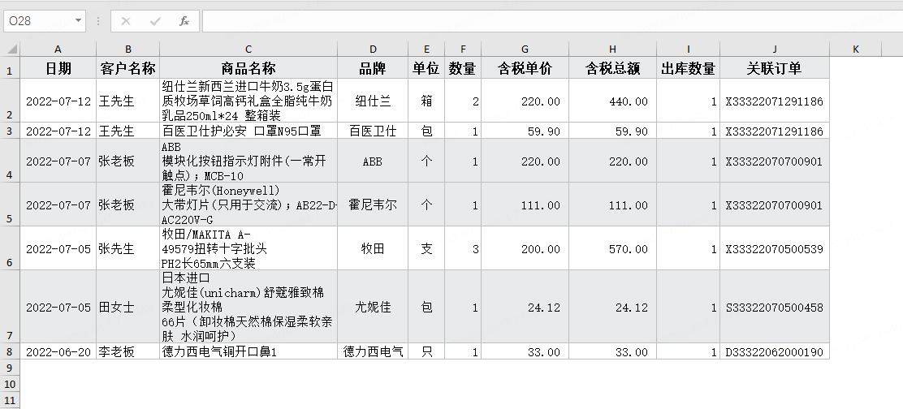

### <font style="color:rgb(31, 35, 40);">分组合并</font>
<font style="color:rgb(31, 35, 40);">上面的样式虽然区分了不同的订单，有利于导入到其它系统，但为了更能体现</font>**<font style="color:rgb(31, 35, 40);">每日</font>**<font style="color:rgb(31, 35, 40);">的订单我们还需要将日期进行分组，学习更多单元格合并功能请</font>[<font style="color:rgb(31, 35, 40);">点击这里</font>](https://github.com/wangguanquan/eec/wiki/%E5%90%88%E5%B9%B6%E5%8D%95%E5%85%83%E6%A0%BC)<font style="color:rgb(31, 35, 40);"> </font><font style="color:rgb(31, 35, 40);">，好吧！接着改造>>></font>

<font style="color:rgb(31, 35, 40);">我们为每个订单添加一个小计，用于订单内商品数量和价格合计，然后每个订单内"日期“、“客户”和“关联订单”两列做合并</font>

```java
// 用于保存合并单元格
List<Dimension> mergeCells = new ArrayList<>();
String date = null, order = null;
int row = 2, dateFrom = row, orderFrom = row; // 记录订单/日期的起始位置
E summary = null, allSummary = createSummary();
for (int i = 0, size = list.size(); i < size; ) {
    E e = list.get(i);
    if (!e.orderNo.equals(order)) {
        if (order != null) {
            list.add(i++, summary);
            size++;
            // 合并客户名和订单号
            mergeCells.add(new Dimension(orderFrom, (short) 2, row, (short) 2));
            mergeCells.add(new Dimension(orderFrom, (short) 10, row, (short) 10));
            // 合并小计
            mergeCells.add(new Dimension(row, (short) 3, row, (short) 5));
            row++;
        }
        summary = createSummary();
        summary.orderNo = e.orderNo;
        summary.date = e.date;

        order = e.orderNo;
        orderFrom = row;
    } else {
        e.orderNo = null;
        e.customer = null;
    }
    if (!e.date.equals(date)) {
        if (date != null) {
            // 合并日期
            mergeCells.add(new Dimension(dateFrom, (short) 1, row - 1, (short) 1));
        }
        dateFrom = row;
        date = e.date;
    } else e.date = null;

    // 累计
    summary.num += e.num;
    summary.totalAmount = summary.totalAmount.add(e.totalAmount);

    allSummary.num += e.num;
    allSummary.totalAmount = allSummary.totalAmount.add(e.totalAmount);

    i++;
    row++;
}
// 添加最后一个订单小计以及合计数据
list.add(summary);
mergeCells.add(new Dimension(dateFrom, (short) 1, row, (short) 1));
mergeCells.add(new Dimension(orderFrom, (short) 2, row, (short) 2));
mergeCells.add(new Dimension(orderFrom, (short) 10, row, (short) 10));
mergeCells.add(new Dimension(row, (short) 3, row, (short) 5));

allSummary.date = "总计："; allSummary.productName = null; allSummary.orderNo = "--";
list.add(allSummary);
row++;
mergeCells.add(new Dimension(row, (short) 1, row, (short) 5));
```

<font style="color:rgb(31, 35, 40);">上面的代码并没有什么逻辑，一是判断订单不同时追加一行小计，二是添加日期，客户和订单三列的合并。</font>

<font style="color:rgb(31, 35, 40);">有了上面的合并单元格收集后我们就可以添加到扩展参数中了</font>

```java
new Workbook().cancelOddFill().setAutoSize(true)
.addSheet(new ListSheet<>(testData())
          .putExtProp(Const.ExtendPropertyKey.MERGE_CELLS, mergeCells)).writeTo(Paths.get("F:/excel"));
```

<font style="color:rgb(31, 35, 40);">现在的效果如下：</font>

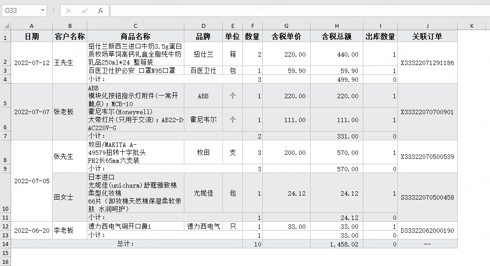

<font style="color:rgb(31, 35, 40);">看上去还行，有合并和小计数据了，但是斑马线好像不太友好的样子，为了美观下一步我们去掉第一列的斑马线颜色，并将小计字体加粗处理。</font>

<font style="color:rgb(31, 35, 40);">为了标记小计，我们增加一个接口，定义如下</font>

```java
public interface Summary {
    default boolean isSummary() {
        return false;
    }
}
```

<font style="color:rgb(31, 35, 40);">普通行isSummary返回false，小计行返回true</font>

<font style="color:rgb(31, 35, 40);">然后再实现小计的样式</font>

```java
public static class GroupStyleProcessor2<U extends Group & Summary> implements StyleProcessor<U> {
    private String group;
    private int s, o, i;
    @Override
    public int build(U u, int style, Styles sst) {
        if (group == null) {
            group = u.groupBy();
            s = sst.addFill(new Fill(PatternType.solid, new Color(239, 245, 235)));
            return style;
        }
        // 小计加粗字体
        if (u.isSummary()) {
            Font font = sst.getFont(style).clone();
            font.bold();
            style = Styles.clearFont(style) | sst.addFont(font);
        }
        else if (u.groupBy() != null && !group.equals(u.groupBy())) {
            group = u.groupBy();
            o ^= 1;
            i = 0;
        }
        return o == 1 && ++i > 1 ? Styles.clearFill(style) | s : style;
    }
}
```

<font style="color:rgb(31, 35, 40);">现在它的效果是这样</font>


<font style="color:rgb(31, 35, 40);">现在一个漂亮的报表已经呈现，没有模板似乎也很轻松。</font>

## <font style="color:rgb(31, 35, 40);">EEC与E3 support兼容性对照表</font>
<font style="color:rgb(31, 35, 40);">eec支持xlsx格式读取/写入，eec-e3-support支持xls格式读取，后者依赖前者，但是两个工具经常不在一起发版，版本可能存在不兼容的情况。</font>

<font style="color:rgb(31, 35, 40);">下面列出两者相互兼容的映射表</font>

| <font style="color:rgb(31, 35, 40);">eec</font> | <font style="color:rgb(31, 35, 40);">更新说明</font> | <font style="color:rgb(31, 35, 40);">eec-e3-support</font> |
| --- | --- | --- |
| [<font style="color:rgb(31, 35, 40);">0.5.20</font>](https://github.com/wangguanquan/eec/releases/tag/v0.5.20) | <font style="color:rgb(31, 35, 40);">2024-11-13   </font><font style="color:rgb(31, 35, 40);">- 新增SimpleSheet简单工作表，简化导出的数据格式   </font><font style="color:rgb(31, 35, 40);">- CSVSheetWriter新增分隔符delimiter属性   </font><font style="color:rgb(31, 35, 40);">- 提升OpenJDK8-21的兼容性</font> | <font style="color:rgb(31, 35, 40);">0.5.19</font> |
| [<font style="color:rgb(31, 35, 40);">0.5.19</font>](https://github.com/wangguanquan/eec/releases/tag/v0.5.19) | <font style="color:rgb(31, 35, 40);">2024-09-22   </font><font style="color:rgb(31, 35, 40);">- 支持增加自定义属性   </font><font style="color:rgb(31, 35, 40);">- 支持设置“只读”标识，设置只读后打开Excel后无法编辑   </font><font style="color:rgb(31, 35, 40);">- 删除部分已标记为过时的方法</font> | |
| [<font style="color:rgb(31, 35, 40);">0.5.18</font>](https://github.com/wangguanquan/eec/releases/tag/v0.5.18) | <font style="color:rgb(31, 35, 40);">2024-08-13   </font><font style="color:rgb(31, 35, 40);">- 增加CSVSheet的兼容性, Excel转CSV支持保存BOM   </font><font style="color:rgb(31, 35, 40);">- 增加ResultSetSheet的类型兼容性   </font><font style="color:rgb(31, 35, 40);">- ListMapSheet支持泛型   </font><font style="color:rgb(31, 35, 40);">- 删除I18N相关代码降低复杂度   </font><font style="color:rgb(31, 35, 40);">- 精简BloomFilter降低复杂度，精简后仅支持String类型</font> | <font style="color:rgb(31, 35, 40);">0.5.15</font> |
| [<font style="color:rgb(31, 35, 40);">0.5.17</font>](https://github.com/wangguanquan/eec/releases/tag/v0.5.17) | <font style="color:rgb(31, 35, 40);">2024-07-18   </font><font style="color:rgb(31, 35, 40);">- 修复部分情况下Row#toMap抛下标越界问题(#380)</font> | |
| [<font style="color:rgb(31, 35, 40);">0.5.16</font>](https://github.com/wangguanquan/eec/releases/tag/v0.5.16) | <font style="color:rgb(31, 35, 40);">2024-06-29   </font><font style="color:rgb(31, 35, 40);">- 输入转换Converter#reversion增加数据类型提升扩展性(#376)， [兼容问题参考](./版本兼容性升级指引)   </font><font style="color:rgb(31, 35, 40);">- 修复读取自定义theme颜色会出现偏差的问题</font> | |
| [<font style="color:rgb(31, 35, 40);">0.5.15</font>](https://github.com/wangguanquan/eec/releases/tag/v0.5.15) | <font style="color:rgb(31, 35, 40);">2024-05-21   </font><font style="color:rgb(31, 35, 40);">- 修复onProgress出现越界问题   </font><font style="color:rgb(31, 35, 40);">- 修复data-supplier计算offset出现偏差使得导出数据缺失的问题   </font><font style="color:rgb(31, 35, 40);">- 删除部分已标记为过时的方法</font> | |
| [<font style="color:rgb(31, 35, 40);">0.5.14</font>](https://github.com/wangguanquan/eec/releases/tag/v0.5.14) | <font style="color:rgb(31, 35, 40);">2024-04-22   </font><font style="color:rgb(31, 35, 40);">- 新增数据验证Validation   </font><font style="color:rgb(31, 35, 40);">- 新增超链接注解Hyperlink   </font><font style="color:rgb(31, 35, 40);">- 新增模板工作表TemplateSheet   </font><font style="color:rgb(31, 35, 40);">- 新增TypeCastException用于Row转对象时如果出现类型转换异常时携带行列等信息   </font><font style="color:rgb(31, 35, 40);">- ListSheet新增data-supplier减化分片开发难度   </font><font style="color:rgb(31, 35, 40);">- 新增zoomScale扩展属性支持设置工作表缩放比例   </font><font style="color:rgb(31, 35, 40);">- 修复读取双色填充样式时抛异常</font> | <font style="color:rgb(31, 35, 40);">0.5.14</font> |
| [<font style="color:rgb(31, 35, 40);">0.5.13</font>](https://github.com/wangguanquan/eec/releases/tag/v0.5.13) | <font style="color:rgb(31, 35, 40);">2024-02-20   </font><font style="color:rgb(31, 35, 40);">- logback安全更新   </font><font style="color:rgb(31, 35, 40);">- 新增全属性工作表FullSheet以读取更多属性，它集合了MergeSheet和CalcSheet的功能   </font><font style="color:rgb(31, 35, 40);">- 新增扩展属性AutoFilter用于添加列筛选功能   </font><font style="color:rgb(31, 35, 40);">- 修复继承自ListSheet的工作表初始无法获取对象类型导致单元格空白的问题   </font><font style="color:rgb(31, 35, 40);">- 修复部分场景下边框颜色无法设置的问题   </font><font style="color:rgb(31, 35, 40);">- 修复部分Excel的indexed颜色与标准有所不同导致获取颜色不正确的问题   </font><font style="color:rgb(31, 35, 40);">- 修复部分场景读取Excel发生IndexOutOfBound异常   </font><font style="color:rgb(31, 35, 40);">- 修复HeaderStyle注解设置样式时，字段样式被全局样式替换的问题</font> | <font style="color:rgb(31, 35, 40);">0.5.13</font> |
| [<font style="color:rgb(31, 35, 40);">0.5.12</font>](https://github.com/wangguanquan/eec/releases/tag/v0.5.12) | <font style="color:rgb(31, 35, 40);">2023-11-26   </font><font style="color:rgb(31, 35, 40);">- 移除watch改用slf4j输出日志   </font><font style="color:rgb(31, 35, 40);">- 新增进度窗口`onProgress`   </font><font style="color:rgb(31, 35, 40);">- 优化自适应列宽算法使其支持更多字体和大小   </font><font style="color:rgb(31, 35, 40);">- 数据转换器功能增强，ExcelColumn增加converter属性以支持导出/导入时双向数据转换(#362)   </font><font style="color:rgb(31, 35, 40);">- 支持读取xlsx格式wps的内嵌图片(#363)   </font><font style="color:rgb(31, 35, 40);">-</font><font style="color:rgb(31, 35, 40);"> </font>**<font style="color:rgb(31, 35, 40);">部分类的注释改为中文，后续会将全部注释改为中文</font>** | <font style="color:rgb(31, 35, 40);">0.5.12</font> |
| [<font style="color:rgb(31, 35, 40);">0.5.11</font>](https://github.com/wangguanquan/eec/releases/tag/v0.5.11) | <font style="color:rgb(31, 35, 40);">2023-10-08   </font><font style="color:rgb(31, 35, 40);">- 优化ExcelReader性能   </font><font style="color:rgb(31, 35, 40);">- 增加`setHeaderColumnReadOption`方法提高ExcelReader丰富性   </font><font style="color:rgb(31, 35, 40);">- 修复读取16进制转义字符时出现乱码问题   </font><font style="color:rgb(31, 35, 40);">- 修复非法UTF8字符导致写文件异常   </font><font style="color:rgb(31, 35, 40);">- 无数据且能获取表头信息时正常写表头(#361)   </font><font style="color:rgb(31, 35, 40);">- 屏蔽JDK17以上版本使用ExcelReader抛异常的问题</font> | <font style="color:rgb(31, 35, 40);">0.5.11</font> |
| [<font style="color:rgb(31, 35, 40);">0.5.10</font>](https://github.com/wangguanquan/eec/releases/tag/v0.5.10) | <font style="color:rgb(31, 35, 40);">2023-08-20   </font><font style="color:rgb(31, 35, 40);">- 修复单元格长度过长导致内容错位的异常(#354)   </font><font style="color:rgb(31, 35, 40);">- 支持导出图片</font> | <font style="color:rgb(31, 35, 40);">0.5.10</font> |
| [<font style="color:rgb(31, 35, 40);">0.5.9</font>](https://github.com/wangguanquan/eec/releases/tag/v0.5.9) | <font style="color:rgb(31, 35, 40);">2023-05-10   </font><font style="color:rgb(31, 35, 40);">- 修复dom4j默认构造器容易造成XXE安全漏洞   </font><font style="color:rgb(31, 35, 40);">- v0.5.x 升级到 v0.5.9   </font><font style="color:rgb(31, 35, 40);">- v0.4.x 升级到 v0.4.15</font> | <font style="color:rgb(31, 35, 40);">0.5.8</font> |
| [<font style="color:rgb(31, 35, 40);">0.5.8</font>](https://github.com/wangguanquan/eec/releases/tag/v0.5.8) | <font style="color:rgb(31, 35, 40);">2023-04-08   </font><font style="color:rgb(31, 35, 40);">- 删除部分已标记为过时的方法和类，兼容处理请查看[wiki升级指引]   </font><font style="color:rgb(31, 35, 40);">- 重命名xxOddFill为xxZebraLine   </font><font style="color:rgb(31, 35, 40);">- 修复自动分页后打开文件弹出警告   </font><font style="color:rgb(31, 35, 40);">- 取消默认斑马线，增加XMLZebraLineCellValueAndStyle自定义斑马线   </font><font style="color:rgb(31, 35, 40);">- 表头背景从666699调整为E9EAEC，斑马线颜色从EFF5EB调整为E9EAEC   </font><font style="color:rgb(31, 35, 40);">- 单个Column可以指定auto-size属性(#337)   </font><font style="color:rgb(31, 35, 40);">- 提供入口自定义处理未知的数据类型   </font><font style="color:rgb(31, 35, 40);">- 导出数据支持指定起始行号(#345)   </font><font style="color:rgb(31, 35, 40);">- 修复xls解析RK Value丢失精度问题   </font><font style="color:rgb(31, 35, 40);">- 修复部分已知BUG(#334, #342, #346)</font> | |
| [<font style="color:rgb(31, 35, 40);">0.5.7</font>](https://github.com/wangguanquan/eec/releases/tag/v0.5.7) | <font style="color:rgb(31, 35, 40);">2023-02-17   </font><font style="color:rgb(31, 35, 40);">- 修复读取font-size时因为浮点数造成异常   </font><font style="color:rgb(31, 35, 40);">- 修复auto-size重置列宽时抛Buffer异常   </font><font style="color:rgb(31, 35, 40);">- 新增 #setRowHeight, #setHeaderRowHeight 方法设置行高</font> | <font style="color:rgb(31, 35, 40);">0.5.6</font> |
| [<font style="color:rgb(31, 35, 40);">0.5.6</font>](https://github.com/wangguanquan/eec/releases/tag/v0.5.6) | <font style="color:rgb(31, 35, 40);">2023-01-07   </font><font style="color:rgb(31, 35, 40);">- 读取文件时支持指定表头，对于多行表头尤为有效   </font><font style="color:rgb(31, 35, 40);">- 提供Row#toMap方法将行数据转为LinkedHashMap(#294)   </font><font style="color:rgb(31, 35, 40);">- 提供Row#isBlank方法用于判断所有单元格的值是否为空(#314)   </font><font style="color:rgb(31, 35, 40);">- 读取文件转时支持自定义HeaderRow   </font><font style="color:rgb(31, 35, 40);">- 读文件时支持获取单元格样式   </font><font style="color:rgb(31, 35, 40);">- 修复部分BUG(#308, #320, #323)</font> | |
| [<font style="color:rgb(31, 35, 40);">0.5.5</font>](https://github.com/wangguanquan/eec/releases/tag/v0.5.5) | <font style="color:rgb(31, 35, 40);">2022-11-07   </font><font style="color:rgb(31, 35, 40);">- Row转对象时如果出异常将提示具体的行和列信息(#284)   </font><font style="color:rgb(31, 35, 40);">- 导出结束后删除zip包(#296)   </font><font style="color:rgb(31, 35, 40);">- 修复部分BUG(#297,#298)   </font> | <font style="color:rgb(31, 35, 40);">0.5.4</font> |
| [<font style="color:rgb(31, 35, 40);">0.5.4</font>](https://github.com/wangguanquan/eec/releases/tag/v0.5.4) | <font style="color:rgb(31, 35, 40);">2022-08-28   </font><font style="color:rgb(31, 35, 40);">- 支持显示/隐藏网络线   </font><font style="color:rgb(31, 35, 40);">- 支持显示/隐藏指定列   </font><font style="color:rgb(31, 35, 40);">- 字体增加"删除线"样式   </font><font style="color:rgb(31, 35, 40);">- Comment增加width和height两属性，用于调整批注大小   </font><font style="color:rgb(31, 35, 40);">- BIFF8Sheet支持reset重置流用于反复读取   </font><font style="color:rgb(31, 35, 40);">- 修复部分BUG(#282,#285)</font> | |
| [<font style="color:rgb(31, 35, 40);">0.5.3</font>](https://github.com/wangguanquan/eec/releases/tag/v0.5.3) | <font style="color:rgb(31, 35, 40);">2022-07-25   </font><font style="color:rgb(31, 35, 40);">- 修复导出时日期少6天的问题(#269)   </font><font style="color:rgb(31, 35, 40);">- 支持多个ExcelColumn注解，可以实现多行表头(#210)   </font><font style="color:rgb(31, 35, 40);">- 微调表格样式使其更突出内容   </font><font style="color:rgb(31, 35, 40);">- 优化自动计算列宽的算法使其更精准   </font><font style="color:rgb(31, 35, 40);">- 修复部分BUG(#264,#265)</font> | <font style="color:rgb(31, 35, 40);">0.5.0</font> |
| [<font style="color:rgb(31, 35, 40);">0.5.2</font>](https://github.com/wangguanquan/eec/releases/tag/v0.5.2) | <font style="color:rgb(31, 35, 40);">2022-07-16   </font><font style="color:rgb(31, 35, 40);">- (严重)修复单元格字节超过1k时导致SST索引读取死循环问题(#258)   </font><font style="color:rgb(31, 35, 40);">- StatementSheet&ResultSetSheet添加StyleProcessor   </font><font style="color:rgb(31, 35, 40);">实现整行样式调整(#235)   </font><font style="color:rgb(31, 35, 40);">- 修复部分BUG(#257, #260)</font> | |
| [<font style="color:rgb(31, 35, 40);">0.5.1</font>](https://github.com/wangguanquan/eec/releases/tag/v0.5.1) | <font style="color:rgb(31, 35, 40);">2022-07-10   </font><font style="color:rgb(31, 35, 40);">- 提升对非标准Office OpenXML生成的excel读取兼容性(#245, #247)   </font><font style="color:rgb(31, 35, 40);">- 提升读取Excel时Row转Java对象的兼容性(#254)   </font><font style="color:rgb(31, 35, 40);">- 修复部分BUG(#249, #252)</font> | |
| [<font style="color:rgb(31, 35, 40);">0.5.0</font>](https://github.com/wangguanquan/eec/releases/tag/v0.5.0) | <font style="color:rgb(31, 35, 40);">2022-05-22   </font><font style="color:rgb(31, 35, 40);">- 增加StyleDesign用于样式处理（单元格或者整行样式处理）   </font><font style="color:rgb(31, 35, 40);">- 增加FreezePanes用于冻结网格   </font><font style="color:rgb(31, 35, 40);">- 修改部分BUG(#227,#232,#238,#243)   </font><font style="color:rgb(31, 35, 40);">- 读取文件支持自定义注解转对象(#237)</font> | |
| [<font style="color:rgb(31, 35, 40);">0.4.14</font>](https://github.com/wangguanquan/eec/releases/tag/v0.4.14) | <font style="color:rgb(31, 35, 40);">2021-12-19   </font><font style="color:rgb(31, 35, 40);">- 提高对Numbers转xlsx的兼容性   </font><font style="color:rgb(31, 35, 40);">- 值转换从原来的int类型扩大为Object   </font><font style="color:rgb(31, 35, 40);">- 增加@RowNum注解，用于注入行号   </font><font style="color:rgb(31, 35, 40);">- 修改ListSheet.EntryColumn的访问权限，方便实现更多高级特性   </font><font style="color:rgb(31, 35, 40);">- 支持单列数字无表头导出，现在可以简单的导出`List`数据   </font><font style="color:rgb(31, 35, 40);">- 修复已知BUG(#197,#202，#205,#219)   </font><font style="color:rgb(31, 35, 40);">- 将com.google.common包重命名为   </font><font style="color:rgb(31, 35, 40);">org.ttzero.excel.common解决内嵌引起的包冲突(#200)</font> | <font style="color:rgb(31, 35, 40);">0.4.13</font> |
| [<font style="color:rgb(31, 35, 40);">0.4.13</font>](https://github.com/wangguanquan/eec/releases/tag/v0.4.13) | <font style="color:rgb(31, 35, 40);">2021-08-09   </font><font style="color:rgb(31, 35, 40);">- 支持xls获取图片   </font><font style="color:rgb(31, 35, 40);">- `@ExcelColumn`注解增加`colIndex`属性，用于指定列顺序(#188)   </font><font style="color:rgb(31, 35, 40);">- 读取文件时`Worksheet#getIndex()`返回Sheet在文件中的下标而非id(#193)   </font><font style="color:rgb(31, 35, 40);">- 修复部分BUG(#182,#190)</font> | |
| [<font style="color:rgb(31, 35, 40);">0.4.12.1</font>](https://github.com/wangguanquan/eec/releases/tag/v0.4.12.1) | <font style="color:rgb(31, 35, 40);">2021-05-20   </font><font style="color:rgb(31, 35, 40);">- Hotfix：HeaderStyle注解设置某列cell颜色会影响所有表头样式</font> | <font style="color:rgb(31, 35, 40);">0.4.11</font> |
| [<font style="color:rgb(31, 35, 40);">0.4.12</font>](https://github.com/wangguanquan/eec/releases/tag/v0.4.12) | <font style="color:rgb(31, 35, 40);">2021-05-18   </font><font style="color:rgb(31, 35, 40);">- 增加获取图片功能(#168)   </font><font style="color:rgb(31, 35, 40);">- 支持row()方法转对象(#175)   </font><font style="color:rgb(31, 35, 40);">- 读取文件默认使用包装类而非基本类型，为了方便处理Null类型(#177)   </font><font style="color:rgb(31, 35, 40);">- 增加`@HeaderStyle`注解自定义头部样式</font> | |
| [<font style="color:rgb(31, 35, 40);">0.4.11</font>](https://github.com/wangguanquan/eec/releases/tag/v0.4.11) | <font style="color:rgb(31, 35, 40);">2021-03-28   </font><font style="color:rgb(31, 35, 40);">- 修复导出时删除特殊字符的问题   </font><font style="color:rgb(31, 35, 40);">- 增加wrapText属性控制单元格自动换行   </font><font style="color:rgb(31, 35, 40);">- 增加forceExport属性来强制没有@ExcelColumn注解的属性   </font><font style="color:rgb(31, 35, 40);">- 兼容非标准化BOF记录解析   </font><font style="color:rgb(31, 35, 40);">- 优化short-sector解析   </font><font style="color:rgb(31, 35, 40);">- 极大提升读取xls兼容性   </font><font style="color:rgb(31, 35, 40);">- 增加对EXTSST的解析</font> | |
| [<font style="color:rgb(31, 35, 40);">0.4.10</font>](https://github.com/wangguanquan/eec/releases/tag/v0.4.10) | <font style="color:rgb(31, 35, 40);">2021-01-07   </font><font style="color:rgb(31, 35, 40);">- 增加兼容性（Office for Mac）   </font><font style="color:rgb(31, 35, 40);">- 修复部分BUG(#147,#148,#159,#161)</font> | <font style="color:rgb(31, 35, 40);">0.4.10</font> |
| [<font style="color:rgb(31, 35, 40);">0.4.9</font>](https://github.com/wangguanquan/eec/releases/tag/v0.4.9) | <font style="color:rgb(31, 35, 40);">2020-11-15   </font><font style="color:rgb(31, 35, 40);">- 修复读取文件时的BUG(#146)   </font><font style="color:rgb(31, 35, 40);">- 增加读取高版本Office导出的xls文件格式的兼容性</font> | <font style="color:rgb(31, 35, 40);">0.4.9</font> |
| [<font style="color:rgb(31, 35, 40);">0.4.8</font>](https://github.com/wangguanquan/eec/releases/tag/v0.4.8) | <font style="color:rgb(31, 35, 40);">2020-10-09   </font><font style="color:rgb(31, 35, 40);">- ExcelColumn注解增加format属性来支持自定义单元格格式化   </font><font style="color:rgb(31, 35, 40);">- 为减少数据泄露风险，现在对象属性必须明确指定   </font><font style="color:rgb(31, 35, 40);">ExcelColumn注解才会被导出</font> | <font style="color:rgb(31, 35, 40);">0.4.6</font> |
| [<font style="color:rgb(31, 35, 40);">0.4.7</font>](https://github.com/wangguanquan/eec/releases/tag/v0.4.7) | <font style="color:rgb(31, 35, 40);">2020-08-14   </font><font style="color:rgb(31, 35, 40);">- 安全更新，修复dom4j小于2.1.3版本可能启用XXE攻击。   </font><font style="color:rgb(31, 35, 40);">- ExcelColumn注解增加comment属性，允许在Excel列头添加“批注”功能   </font><font style="color:rgb(31, 35, 40);">- 修复一些已知BUG</font> | |
| [<font style="color:rgb(31, 35, 40);">0.4.6</font>](https://github.com/wangguanquan/eec/releases/tag/v0.4.4) | <font style="color:rgb(31, 35, 40);">2020-04-20   </font><font style="color:rgb(31, 35, 40);">- 优化SharedStringTable   </font><font style="color:rgb(31, 35, 40);">- 支持读取Excel97~2003文件(需要依懒eec-e3-support)   </font><font style="color:rgb(31, 35, 40);">- 修复一些已知BUG</font> | |


> 更新: 2024-12-31 20:31:15  
> 原文: <https://www.yuque.com/tulingzhouyu/db22bv/gghp2hsgd58g071n>