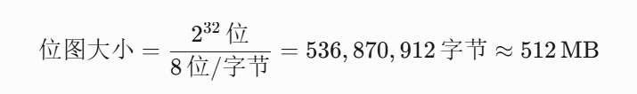
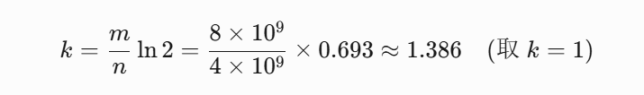
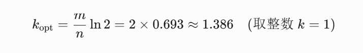
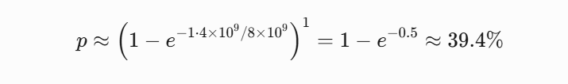
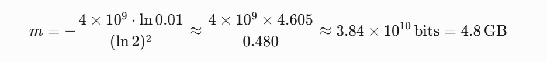

# 1G内存，如何快速判某个无符号整数是否在40亿数据中

## **<font style="color:rgba(0, 0, 0, 0.9);background-color:rgb(252, 252, 252);">方案一：流式读取实时比对</font>**
### **<font style="color:rgba(0, 0, 0, 0.9);background-color:rgb(252, 252, 252);">核心思想</font>**
<font style="color:rgba(0, 0, 0, 0.9);background-color:rgb(252, 252, 252);">分块读取文件，实时遍历比对目标值。</font>

### **<font style="color:rgba(0, 0, 0, 0.9);background-color:rgb(252, 252, 252);">实现步骤</font>**
1. **<font style="color:rgba(0, 0, 0, 0.9);background-color:rgb(252, 252, 252);">分块读取</font>**<font style="color:rgba(0, 0, 0, 0.9);background-color:rgb(252, 252, 252);">：使用</font><font style="color:rgba(0, 0, 0, 0.9);background-color:rgb(252, 252, 252);"> </font>`<font style="color:rgba(0, 0, 0, 0.9);background-color:rgb(252, 252, 252);">BufferedInputStream</font>`<font style="color:rgba(0, 0, 0, 0.9);background-color:rgb(252, 252, 252);"> </font><font style="color:rgba(0, 0, 0, 0.9);background-color:rgb(252, 252, 252);">设置512MB缓冲区。</font>
2. **<font style="color:rgba(0, 0, 0, 0.9);background-color:rgb(252, 252, 252);">实时比对</font>**<font style="color:rgba(0, 0, 0, 0.9);background-color:rgb(252, 252, 252);">：遍历当前内存块中的所有整数。</font>

### **<font style="color:rgba(0, 0, 0, 0.9);background-color:rgb(252, 252, 252);">示例代码</font>**
```java
import java.io.*;

public class StreamChecker {
    public static boolean isExist(String filePath, int target) throws IOException {
        try (BufferedInputStream bis = new BufferedInputStream(new FileInputStream(filePath))) {
            byte[] buffer = new byte[512 * 1024 * 1024]; // 512MB缓冲区
            int bytesRead;
            while ((bytesRead = bis.read(buffer)) != -1) {
                // 每4字节转换为一个整数（小端序）
                for (int i = 0; i < bytesRead; i += 4) {
                    int num = (buffer[i] & 0xFF) 
                    | ((buffer[i+1] & 0xFF) << 8) 
                    | ((buffer[i+2] & 0xFF) << 16) 
                    | ((buffer[i+3] & 0xFF) << 24);
                    if (num == target) return true;
                }
            }
        }
        return false;
    }

    public static void main(String[] args) throws IOException {
        System.out.println(isExist("data.bin", 123456));
    }
}
```

### **<font style="color:rgba(0, 0, 0, 0.9);background-color:rgb(252, 252, 252);">计算过程</font>**
+ **<font style="color:rgba(0, 0, 0, 0.9);background-color:rgb(252, 252, 252);">数据总量</font>**<font style="color:rgba(0, 0, 0, 0.9);background-color:rgb(252, 252, 252);">：40亿个整数 × 4字节 = 16GB。</font>
+ **<font style="color:rgba(0, 0, 0, 0.9);background-color:rgb(252, 252, 252);">读取时间</font>**<font style="color:rgba(0, 0, 0, 0.9);background-color:rgb(252, 252, 252);">：</font>
    - <font style="color:rgba(0, 0, 0, 0.9);background-color:rgb(252, 252, 252);">机械硬盘（100MB/s）：16GB / 100MB/s ≈ 163秒 ≈ 2.7分钟。</font>
    - <font style="color:rgba(0, 0, 0, 0.9);background-color:rgb(252, 252, 252);">SSD（500MB/s）：16GB / 500MB/s ≈ 32秒。</font>

### **<font style="color:rgba(0, 0, 0, 0.9);background-color:rgb(252, 252, 252);">优缺点</font>**
| **<font style="background-color:rgb(252, 252, 252);">优点</font>** | **<font style="background-color:rgb(252, 252, 252);">缺点</font>** |
| :---: | :---: |
| <font style="background-color:rgb(252, 252, 252);">1. 无需预处理，零额外内存占用</font> | <font style="background-color:rgb(252, 252, 252);">1. 单次查询时间极长（2分钟以上）</font> |
| <font style="background-color:rgb(252, 252, 252);">2. 实现简单</font> | <font style="background-color:rgb(252, 252, 252);">2. 多次查询需重复全量读取文件</font> |


---

## **<font style="color:rgba(0, 0, 0, 0.9);background-color:rgb(252, 252, 252);">方案二：位图</font>**
### **<font style="color:rgba(0, 0, 0, 0.9);background-color:rgb(252, 252, 252);">核心思想</font>**
<font style="color:rgba(0, 0, 0, 0.9);background-color:rgb(252, 252, 252);">每个整数直接映射到512MB位图中的二进制位。</font>

### **<font style="color:rgba(0, 0, 0, 0.9);background-color:rgb(252, 252, 252);">内存计算</font>**
+ **<font style="color:rgba(0, 0, 0, 0.9);background-color:rgb(252, 252, 252);">位图大小</font>**<font style="color:rgba(0, 0, 0, 0.9);background-color:rgb(252, 252, 252);">：</font><font style="color:rgba(0, 0, 0, 0.9);background-color:rgb(252, 252, 252);">2</font><font style="color:rgba(0, 0, 0, 0.9);background-color:rgb(252, 252, 252);">32</font><font style="color:rgba(0, 0, 0, 0.9);background-color:rgb(252, 252, 252);">位</font><font style="color:rgba(0, 0, 0, 0.9);background-color:rgb(252, 252, 252);">=</font><font style="color:rgba(0, 0, 0, 0.9);background-color:rgb(252, 252, 252);">8</font><font style="color:rgba(0, 0, 0, 0.9);background-color:rgb(252, 252, 252);">2</font><font style="color:rgba(0, 0, 0, 0.9);background-color:rgb(252, 252, 252);">32</font><font style="color:rgba(0, 0, 0, 0.9);background-color:rgb(252, 252, 252);">字节</font><font style="color:rgba(0, 0, 0, 0.9);background-color:rgb(252, 252, 252);">=</font><font style="color:rgba(0, 0, 0, 0.9);background-color:rgb(252, 252, 252);">536</font><font style="color:rgba(0, 0, 0, 0.9);background-color:rgb(252, 252, 252);">,</font><font style="color:rgba(0, 0, 0, 0.9);background-color:rgb(252, 252, 252);">870</font><font style="color:rgba(0, 0, 0, 0.9);background-color:rgb(252, 252, 252);">,</font><font style="color:rgba(0, 0, 0, 0.9);background-color:rgb(252, 252, 252);">912</font><font style="color:rgba(0, 0, 0, 0.9);background-color:rgb(252, 252, 252);">字节</font><font style="color:rgba(0, 0, 0, 0.9);background-color:rgb(252, 252, 252);">≈</font><font style="color:rgba(0, 0, 0, 0.9);background-color:rgb(252, 252, 252);">512</font><font style="color:rgba(0, 0, 0, 0.9);background-color:rgb(252, 252, 252);">MB</font>
+ **<font style="color:rgba(0, 0, 0, 0.9);background-color:rgb(252, 252, 252);">覆盖范围</font>**<font style="color:rgba(0, 0, 0, 0.9);background-color:rgb(252, 252, 252);">：所有32位整数（0 ≤ x < 4,294,967,296）。</font>

### **<font style="color:rgba(0, 0, 0, 0.9);background-color:rgb(252, 252, 252);">示例代码</font>**
```java
import java.io.*;

public class BitmapChecker {
    private static final int BITMAP_SIZE = 1 << 29; // 2^32 bits = 512MB
    private final byte[] bitmap = new byte[BITMAP_SIZE];

    public void build(String filePath) throws IOException {
        try (BufferedInputStream bis = new BufferedInputStream(new FileInputStream(filePath))) {
            byte[] buffer = new byte[4]; // 每个整数4字节
            while (bis.read(buffer) != -1) {
                int num = (buffer[0] & 0xFF) 
                | ((buffer[1] & 0xFF) << 8) 
                | ((buffer[2] & 0xFF) << 16) 
                | ((buffer[3] & 0xFF) << 24);
                int index = num / 8;
                int offset = num % 8;
                bitmap[index] |= (1 << offset);
            }
        }
    }

    public boolean query(int num) {
        int index = num / 8;
        int offset = num % 8;
        return (bitmap[index] & (1 << offset)) != 0;
    }

    public static void main(String[] args) throws IOException {
        BitmapChecker checker = new BitmapChecker();
        checker.build("data.bin");
        System.out.println(checker.query(123456));
    }
}
```

### **<font style="color:rgba(0, 0, 0, 0.9);background-color:rgb(252, 252, 252);">优缺点</font>**
| **<font style="background-color:rgb(252, 252, 252);">优点</font>** | **<font style="background-color:rgb(252, 252, 252);">缺点</font>** |
| :---: | :---: |
| <font style="background-color:rgb(252, 252, 252);">1. 查询时间</font><font style="background-color:rgb(252, 252, 252);"> </font>_<font style="background-color:rgb(252, 252, 252);">O</font>_<font style="background-color:rgb(252, 252, 252);">(</font><font style="background-color:rgb(252, 252, 252);">1</font><font style="background-color:rgb(252, 252, 252);">)</font><font style="background-color:rgb(252, 252, 252);">，零误判</font> | <font style="background-color:rgb(252, 252, 252);">1. 仅支持32位整数（最大42.9亿）</font> |
| <font style="background-color:rgb(252, 252, 252);">2. 内存固定（512MB）</font> | <font style="background-color:rgb(252, 252, 252);">2. </font>**<font style="background-color:rgb(252, 252, 252);">无法处理超范围数据</font>** |


---

### 扩展点：<font style="color:rgba(0, 0, 0, 0.9);background-color:rgb(252, 252, 252);">位图为何无法处理超出范围的数据？</font>
#### <font style="color:rgba(0, 0, 0, 0.9);background-color:rgb(252, 252, 252);">1. 位图的内存分配与整数范围</font>
##### <font style="color:rgba(0, 0, 0, 0.9);background-color:rgb(252, 252, 252);">(1) 位图设计原理</font>
+ **<font style="color:rgba(0, 0, 0, 0.9);background-color:rgb(252, 252, 252);">位图大小</font>**<font style="color:rgba(0, 0, 0, 0.9);background-color:rgb(252, 252, 252);">：位图需要覆盖所有可能的整数取值。</font>
    - <font style="color:rgba(0, 0, 0, 0.9);background-color:rgb(252, 252, 252);">对于 </font>**<font style="color:rgba(0, 0, 0, 0.9);background-color:rgb(252, 252, 252);">32位无符号整数</font>**<font style="color:rgba(0, 0, 0, 0.9);background-color:rgb(252, 252, 252);">，取值范围为</font><font style="color:rgba(0, 0, 0, 0.9);background-color:rgb(252, 252, 252);"> </font><font style="color:rgba(0, 0, 0, 0.9);background-color:rgb(252, 252, 252);">0</font><font style="color:rgba(0, 0, 0, 0.9);background-color:rgb(252, 252, 252);">≤</font>_<font style="color:rgba(0, 0, 0, 0.9);background-color:rgb(252, 252, 252);">x</font>_<font style="color:rgba(0, 0, 0, 0.9);background-color:rgb(252, 252, 252);"><</font><font style="color:rgba(0, 0, 0, 0.9);background-color:rgb(252, 252, 252);">2</font><font style="color:rgba(0, 0, 0, 0.9);background-color:rgb(252, 252, 252);">32</font><font style="color:rgba(0, 0, 0, 0.9);background-color:rgb(252, 252, 252);">（即0到4,294,967,295）。</font>
    - <font style="color:rgba(0, 0, 0, 0.9);background-color:rgb(252, 252, 252);">所需内存计算：</font>
    - 
+ **<font style="color:rgba(0, 0, 0, 0.9);background-color:rgb(252, 252, 252);">映射规则</font>**<font style="color:rgba(0, 0, 0, 0.9);background-color:rgb(252, 252, 252);">：  
</font><font style="color:rgba(0, 0, 0, 0.9);background-color:rgb(252, 252, 252);">每个整数</font><font style="color:rgba(0, 0, 0, 0.9);background-color:rgb(252, 252, 252);"> </font>_<font style="color:rgba(0, 0, 0, 0.9);background-color:rgb(252, 252, 252);">x</font>_<font style="color:rgba(0, 0, 0, 0.9);background-color:rgb(252, 252, 252);"> </font><font style="color:rgba(0, 0, 0, 0.9);background-color:rgb(252, 252, 252);">直接映射到位图中的第</font><font style="color:rgba(0, 0, 0, 0.9);background-color:rgb(252, 252, 252);"> </font>_<font style="color:rgba(0, 0, 0, 0.9);background-color:rgb(252, 252, 252);">x</font>_<font style="color:rgba(0, 0, 0, 0.9);background-color:rgb(252, 252, 252);"> </font><font style="color:rgba(0, 0, 0, 0.9);background-color:rgb(252, 252, 252);">个二进制位，存在则置1，否则为0。</font>

##### <font style="color:rgba(0, 0, 0, 0.9);background-color:rgb(252, 252, 252);">(2) 超范围数据的处理问题</font>
<font style="color:rgba(0, 0, 0, 0.9);background-color:rgb(252, 252, 252);">如果输入的整数超过32位（例如64位整数），位图方案将面临以下问题：</font>

| **<font style="background-color:rgb(252, 252, 252);">问题</font>** | **<font style="background-color:rgb(252, 252, 252);">原因</font>** |
| :---: | :---: |
| **<font style="background-color:rgb(252, 252, 252);">内存爆炸性增长</font>** | <font style="background-color:rgb(252, 252, 252);">64位整数范围是</font><font style="background-color:rgb(252, 252, 252);"> </font><font style="background-color:rgb(252, 252, 252);">0</font><font style="background-color:rgb(252, 252, 252);">≤</font>_<font style="background-color:rgb(252, 252, 252);">x</font>_<font style="background-color:rgb(252, 252, 252);"><</font><font style="background-color:rgb(252, 252, 252);">2</font><font style="background-color:rgb(252, 252, 252);">64</font><font style="background-color:rgb(252, 252, 252);">，位图需</font><font style="background-color:rgb(252, 252, 252);"> </font><font style="background-color:rgb(252, 252, 252);">2</font><font style="background-color:rgb(252, 252, 252);">64</font><font style="background-color:rgb(252, 252, 252);">位</font><font style="background-color:rgb(252, 252, 252);">≈</font><font style="background-color:rgb(252, 252, 252);">2</font><font style="background-color:rgb(252, 252, 252);">EB</font><font style="background-color:rgb(252, 252, 252);">（远超1G内存限制）。</font> |
| **<font style="background-color:rgb(252, 252, 252);">索引计算错误</font>** | <font style="background-color:rgb(252, 252, 252);">在位图代码中，索引计算基于32位逻辑，高位数据会被截断或溢出，导致错误映射。</font> |


---

#### <font style="color:rgba(0, 0, 0, 0.9);background-color:rgb(252, 252, 252);">2. Java代码示例分析</font>
##### <font style="color:rgba(0, 0, 0, 0.9);background-color:rgb(252, 252, 252);">(1) 代码逻辑</font>
```java
public class BitmapChecker {
    private static final int BITMAP_SIZE = 1 << 29; // 2^32 bits = 512MB
    private final byte[] bitmap = new byte[BITMAP_SIZE];

    public void build(String filePath) throws IOException {
        // 读取数据并填充位图
        int num = ...; // 从文件解析的整数
        int index = num / 8;
        int offset = num % 8;
        bitmap[index] |= (1 << offset);
    }

    public boolean query(int num) {
        int index = num / 8;
        int offset = num % 8;
        return (bitmap[index] & (1 << offset)) != 0;
    }
}
```

##### <font style="color:rgba(0, 0, 0, 0.9);background-color:rgb(252, 252, 252);">(2) 超范围数据的崩溃场景</font>
<font style="color:rgba(0, 0, 0, 0.9);background-color:rgb(252, 252, 252);">假设输入整数为64位的</font><font style="color:rgba(0, 0, 0, 0.9);background-color:rgb(252, 252, 252);"> </font>`<font style="color:rgba(0, 0, 0, 0.9);background-color:rgb(252, 252, 252);">x = 5,000,000,000</font>`<font style="color:rgba(0, 0, 0, 0.9);background-color:rgb(252, 252, 252);">（超过32位最大值4,294,967,295）：</font>

###### <font style="color:rgba(0, 0, 0, 0.9);background-color:rgb(252, 252, 252);">索引计算溢出：  
</font><font style="color:rgba(0, 0, 0, 0.9);background-color:rgb(252, 252, 252);">Java中 </font>`<font style="color:rgba(0, 0, 0, 0.9);background-color:rgb(252, 252, 252);">int</font>`<font style="color:rgba(0, 0, 0, 0.9);background-color:rgb(252, 252, 252);"> 类型为32位有符号整数，当 </font>`<font style="color:rgba(0, 0, 0, 0.9);background-color:rgb(252, 252, 252);">num</font>`<font style="color:rgba(0, 0, 0, 0.9);background-color:rgb(252, 252, 252);"> 超过 231−1 时，计算结果可能为负值或错误值。</font>
```java
int num = 5_000_000_000; // 实际超出int范围，编译报错
int index = num / 8;      // 溢出导致index为负数或错误值
```

###### <font style="color:rgba(0, 0, 0, 0.9);background-color:rgb(252, 252, 252);">数组越界：  
</font><font style="color:rgba(0, 0, 0, 0.9);background-color:rgb(252, 252, 252);">若强行用 </font>`<font style="color:rgba(0, 0, 0, 0.9);background-color:rgb(252, 252, 252);">long</font>`<font style="color:rgba(0, 0, 0, 0.9);background-color:rgb(252, 252, 252);"> 存储 </font>`<font style="color:rgba(0, 0, 0, 0.9);background-color:rgb(252, 252, 252);">num</font>`<font style="color:rgba(0, 0, 0, 0.9);background-color:rgb(252, 252, 252);">，但 </font>`<font style="color:rgba(0, 0, 0, 0.9);background-color:rgb(252, 252, 252);">index</font>`<font style="color:rgba(0, 0, 0, 0.9);background-color:rgb(252, 252, 252);"> 仍为 </font>`<font style="color:rgba(0, 0, 0, 0.9);background-color:rgb(252, 252, 252);">int</font>`<font style="color:rgba(0, 0, 0, 0.9);background-color:rgb(252, 252, 252);"> 类型：</font>
```java
long num = 5_000_000_000L;
int index = (int) (num / 8); // 强制转换导致数据截断（index=705,032,704）
```

    - <font style="color:rgba(0, 0, 0, 0.9);background-color:rgb(252, 252, 252);">此时</font><font style="color:rgba(0, 0, 0, 0.9);background-color:rgb(252, 252, 252);"> </font>`<font style="color:rgba(0, 0, 0, 0.9);background-color:rgb(252, 252, 252);">index = 5,000,000,000 / 8 = 625,000,000</font>`<font style="color:rgba(0, 0, 0, 0.9);background-color:rgb(252, 252, 252);">，但</font><font style="color:rgba(0, 0, 0, 0.9);background-color:rgb(252, 252, 252);"> </font>`<font style="color:rgba(0, 0, 0, 0.9);background-color:rgb(252, 252, 252);">int</font>`<font style="color:rgba(0, 0, 0, 0.9);background-color:rgb(252, 252, 252);"> </font><font style="color:rgba(0, 0, 0, 0.9);background-color:rgb(252, 252, 252);">最大正值为</font><font style="color:rgba(0, 0, 0, 0.9);background-color:rgb(252, 252, 252);"> </font><font style="color:rgba(0, 0, 0, 0.9);background-color:rgb(252, 252, 252);">2</font><font style="color:rgba(0, 0, 0, 0.9);background-color:rgb(252, 252, 252);">31</font><font style="color:rgba(0, 0, 0, 0.9);background-color:rgb(252, 252, 252);">−</font><font style="color:rgba(0, 0, 0, 0.9);background-color:rgb(252, 252, 252);">1</font><font style="color:rgba(0, 0, 0, 0.9);background-color:rgb(252, 252, 252);">=</font><font style="color:rgba(0, 0, 0, 0.9);background-color:rgb(252, 252, 252);">2</font><font style="color:rgba(0, 0, 0, 0.9);background-color:rgb(252, 252, 252);">,</font><font style="color:rgba(0, 0, 0, 0.9);background-color:rgb(252, 252, 252);">147</font><font style="color:rgba(0, 0, 0, 0.9);background-color:rgb(252, 252, 252);">,</font><font style="color:rgba(0, 0, 0, 0.9);background-color:rgb(252, 252, 252);">483</font><font style="color:rgba(0, 0, 0, 0.9);background-color:rgb(252, 252, 252);">,</font><font style="color:rgba(0, 0, 0, 0.9);background-color:rgb(252, 252, 252);">647</font><font style="color:rgba(0, 0, 0, 0.9);background-color:rgb(252, 252, 252);">，未溢出。</font>
    - **<font style="color:rgba(0, 0, 0, 0.9);background-color:rgb(252, 252, 252);">致命问题</font>**<font style="color:rgba(0, 0, 0, 0.9);background-color:rgb(252, 252, 252);">：位图仅覆盖32位整数（0到4.29亿），而</font><font style="color:rgba(0, 0, 0, 0.9);background-color:rgb(252, 252, 252);"> </font>`<font style="color:rgba(0, 0, 0, 0.9);background-color:rgb(252, 252, 252);">num=50亿</font>`<font style="color:rgba(0, 0, 0, 0.9);background-color:rgb(252, 252, 252);"> </font><font style="color:rgba(0, 0, 0, 0.9);background-color:rgb(252, 252, 252);">超出范围，但代码仍会错误地将其映射到位图的有效区间内，导致：</font>
        * **<font style="color:rgba(0, 0, 0, 0.9);background-color:rgb(252, 252, 252);">误判</font>**<font style="color:rgba(0, 0, 0, 0.9);background-color:rgb(252, 252, 252);">：若位图中</font><font style="color:rgba(0, 0, 0, 0.9);background-color:rgb(252, 252, 252);"> </font>`<font style="color:rgba(0, 0, 0, 0.9);background-color:rgb(252, 252, 252);">index=625,000,000</font>`<font style="color:rgba(0, 0, 0, 0.9);background-color:rgb(252, 252, 252);"> </font><font style="color:rgba(0, 0, 0, 0.9);background-color:rgb(252, 252, 252);">的位置恰好为1，则系统错误认为50亿存在。</font>
        * **<font style="color:rgba(0, 0, 0, 0.9);background-color:rgb(252, 252, 252);">数据污染</font>**<font style="color:rgba(0, 0, 0, 0.9);background-color:rgb(252, 252, 252);">：写入超范围数据会破坏位图的原始状态。</font>

---

#### <font style="color:rgba(0, 0, 0, 0.9);background-color:rgb(252, 252, 252);">3. 超范围数据的解决方案</font>
##### <font style="color:rgba(0, 0, 0, 0.9);background-color:rgb(252, 252, 252);">(1) 分片位图（Sharded Bitmap）</font>
+ **<font style="color:rgba(0, 0, 0, 0.9);background-color:rgb(252, 252, 252);">核心思想</font>**<font style="color:rgba(0, 0, 0, 0.9);background-color:rgb(252, 252, 252);">：将超范围整数哈希映射到多个32位分片。</font>
    - <font style="color:rgba(0, 0, 0, 0.9);background-color:rgb(252, 252, 252);">例如，使用哈希函数将64位整数映射到32位空间，再分1024个位图（每个分片512KB）。</font>
    - **<font style="color:rgba(0, 0, 0, 0.9);background-color:rgb(252, 252, 252);">总内存</font>**<font style="color:rgba(0, 0, 0, 0.9);background-color:rgb(252, 252, 252);">：</font><font style="color:rgba(0, 0, 0, 0.9);background-color:rgb(252, 252, 252);">1024</font><font style="color:rgba(0, 0, 0, 0.9);background-color:rgb(252, 252, 252);">×</font><font style="color:rgba(0, 0, 0, 0.9);background-color:rgb(252, 252, 252);">512</font><font style="color:rgba(0, 0, 0, 0.9);background-color:rgb(252, 252, 252);">KB</font><font style="color:rgba(0, 0, 0, 0.9);background-color:rgb(252, 252, 252);">=</font><font style="color:rgba(0, 0, 0, 0.9);background-color:rgb(252, 252, 252);">512</font><font style="color:rgba(0, 0, 0, 0.9);background-color:rgb(252, 252, 252);">MB</font><font style="color:rgba(0, 0, 0, 0.9);background-color:rgb(252, 252, 252);">。</font>
+ **<font style="color:rgba(0, 0, 0, 0.9);background-color:rgb(252, 252, 252);">代码修改</font>**<font style="color:rgba(0, 0, 0, 0.9);background-color:rgb(252, 252, 252);">：</font>

```java
public class ShardedBitmapChecker {
    private static final int SHARD_COUNT = 1024;
    private final byte[][] bitmaps = new byte[SHARD_COUNT][1 << 17]; // 每个分片512KB

    private int getShardId(long num) {
        return (int) (num % SHARD_COUNT);
    }

    private int getIndexInShard(long num) {
        return (int) (num / SHARD_COUNT / 8); // 位图索引
    }

    public void add(long num) {
        int shard = getShardId(num);
        int index = getIndexInShard(num);
        int offset = (int) (num % 8);
        bitmaps[shard][index] |= (1 << offset);
    }

    public boolean contains(long num) {
        int shard = getShardId(num);
        int index = getIndexInShard(num);
        int offset = (int) (num % 8);
        return (bitmaps[shard][index] & (1 << offset)) != 0;
    }
}
```

+ **<font style="color:rgba(0, 0, 0, 0.9);background-color:rgb(252, 252, 252);">局限性</font>**<font style="color:rgba(0, 0, 0, 0.9);background-color:rgb(252, 252, 252);">：</font>
    - **<font style="color:rgba(0, 0, 0, 0.9);background-color:rgb(252, 252, 252);">哈希冲突</font>**<font style="color:rgba(0, 0, 0, 0.9);background-color:rgb(252, 252, 252);">：不同超范围整数可能映射到同一分片位置，导致误判（需额外去重机制）。</font>

##### <font style="color:rgba(0, 0, 0, 0.9);background-color:rgb(252, 252, 252);">(2) 压缩位图（Roaring Bitmap）</font>
+ **<font style="color:rgba(0, 0, 0, 0.9);background-color:rgb(252, 252, 252);">核心思想</font>**<font style="color:rgba(0, 0, 0, 0.9);background-color:rgb(252, 252, 252);">：对稀疏数据动态压缩存储，仅记录存在的整数。</font>
+ **<font style="color:rgba(0, 0, 0, 0.9);background-color:rgb(252, 252, 252);">内存优化</font>**<font style="color:rgba(0, 0, 0, 0.9);background-color:rgb(252, 252, 252);">：稀疏数据下内存占用远小于传统位图。</font>
+ **<font style="color:rgba(0, 0, 0, 0.9);background-color:rgb(252, 252, 252);">Java库</font>**<font style="color:rgba(0, 0, 0, 0.9);background-color:rgb(252, 252, 252);">：使用</font><font style="color:rgba(0, 0, 0, 0.9);background-color:rgb(252, 252, 252);"> </font>`<font style="color:rgba(0, 0, 0, 0.9);background-color:rgb(252, 252, 252);">org.roaringbitmap.RoaringBitmap</font>`<font style="color:rgba(0, 0, 0, 0.9);background-color:rgb(252, 252, 252);">。</font>

```java
import org.roaringbitmap.RoaringBitmap;

public class RoaringBitmapChecker {
    private final RoaringBitmap bitmap = new RoaringBitmap();

    public void add(int num) {
        bitmap.add(num);
    }

    public boolean contains(int num) {
        return bitmap.contains(num);
    }
}
```

+ **<font style="color:rgba(0, 0, 0, 0.9);background-color:rgb(252, 252, 252);">局限性</font>**<font style="color:rgba(0, 0, 0, 0.9);background-color:rgb(252, 252, 252);">：</font>
    - <font style="color:rgba(0, 0, 0, 0.9);background-color:rgb(252, 252, 252);">仍无法直接处理超范围整数（需结合分片或其他映射）。</font>

---

#### <font style="color:rgba(0, 0, 0, 0.9);background-color:rgb(252, 252, 252);">4. 总结</font>
| **<font style="background-color:rgb(252, 252, 252);">方案</font>** | **<font style="background-color:rgb(252, 252, 252);">原始位图（32位）</font>** | **<font style="background-color:rgb(252, 252, 252);">分片位图（64位→32位）</font>** | **<font style="background-color:rgb(252, 252, 252);">压缩位图（Roaring）</font>** |
| :---: | :---: | :---: | :---: |
| **<font style="background-color:rgb(252, 252, 252);">支持整数范围</font>** | <font style="background-color:rgb(252, 252, 252);">0 ≤ x < 4.29亿</font> | <font style="background-color:rgb(252, 252, 252);">全范围（需哈希映射）</font> | <font style="background-color:rgb(252, 252, 252);">0 ≤ x < 2^32</font> |
| **<font style="background-color:rgb(252, 252, 252);">内存占用</font>** | <font style="background-color:rgb(252, 252, 252);">512MB（固定）</font> | <font style="background-color:rgb(252, 252, 252);">512MB（固定分片）</font> | <font style="background-color:rgb(252, 252, 252);">动态（稀疏数据更小）</font> |
| **<font style="background-color:rgb(252, 252, 252);">误判率</font>** | <font style="background-color:rgb(252, 252, 252);">0%（精确匹配）</font> | <font style="background-color:rgb(252, 252, 252);">>0%（哈希冲突）</font> | <font style="background-color:rgb(252, 252, 252);">0%（精确匹配）</font> |
| **<font style="background-color:rgb(252, 252, 252);">实现复杂度</font>** | <font style="background-color:rgb(252, 252, 252);">简单</font> | <font style="background-color:rgb(252, 252, 252);">中等</font> | <font style="background-color:rgb(252, 252, 252);">简单（依赖第三方库）</font> |


+ **<font style="color:rgba(0, 0, 0, 0.9);background-color:rgb(252, 252, 252);">位图的硬性限制</font>**<font style="color:rgba(0, 0, 0, 0.9);background-color:rgb(252, 252, 252);">：  
</font><font style="color:rgba(0, 0, 0, 0.9);background-color:rgb(252, 252, 252);">位图的覆盖范围由初始化时分配的内存大小决定。若输入数据超出预设的整数范围（如32位→4.29亿），则：</font>
    1. **<font style="color:rgba(0, 0, 0, 0.9);background-color:rgb(252, 252, 252);">写入时</font>**<font style="color:rgba(0, 0, 0, 0.9);background-color:rgb(252, 252, 252);">：超范围整数会被错误映射到有效区间，污染数据。</font>
    2. **<font style="color:rgba(0, 0, 0, 0.9);background-color:rgb(252, 252, 252);">查询时</font>**<font style="color:rgba(0, 0, 0, 0.9);background-color:rgb(252, 252, 252);">：超范围整数可能误判为存在，或漏判实际存在的值。</font>
+ **<font style="color:rgba(0, 0, 0, 0.9);background-color:rgb(252, 252, 252);">解决方案</font>**<font style="color:rgba(0, 0, 0, 0.9);background-color:rgb(252, 252, 252);">：</font>
    - **<font style="color:rgba(0, 0, 0, 0.9);background-color:rgb(252, 252, 252);">分片位图</font>**<font style="color:rgba(0, 0, 0, 0.9);background-color:rgb(252, 252, 252);">：通过哈希映射支持超范围数据，但需容忍哈希冲突。</font>
    - **<font style="color:rgba(0, 0, 0, 0.9);background-color:rgb(252, 252, 252);">压缩位图</font>**<font style="color:rgba(0, 0, 0, 0.9);background-color:rgb(252, 252, 252);">：优化稀疏数据的内存占用，但仍受限于预设的整数范围。</font>

---

## **<font style="color:rgba(0, 0, 0, 0.9);background-color:rgb(252, 252, 252);">方案三：布隆过滤器（</font>****<font style="color:#DF2A3F;background-color:rgb(252, 252, 252);">有严重问题</font>****<font style="color:rgba(0, 0, 0, 0.9);background-color:rgb(252, 252, 252);">）</font>**
### **<font style="color:rgba(0, 0, 0, 0.9);background-color:rgb(252, 252, 252);">核心思想</font>**
<font style="color:rgba(0, 0, 0, 0.9);background-color:rgb(252, 252, 252);">通过多个哈希函数降低冲突概率，允许可控的误判率。</font>

### **<font style="color:rgba(0, 0, 0, 0.9);background-color:rgb(252, 252, 252);">误判率计算</font>**
+ **<font style="color:rgba(0, 0, 0, 0.9);background-color:rgb(252, 252, 252);">总内存</font>**<font style="color:rgba(0, 0, 0, 0.9);background-color:rgb(252, 252, 252);">：</font>_<font style="color:rgba(0, 0, 0, 0.9);background-color:rgb(252, 252, 252);">m=</font>_<font style="color:rgba(0, 0, 0, 0.9);background-color:rgb(252, 252, 252);">1GB = 8×109 bits</font>
+ **<font style="color:rgba(0, 0, 0, 0.9);background-color:rgb(252, 252, 252);">元素数量</font>**<font style="color:rgba(0, 0, 0, 0.9);background-color:rgb(252, 252, 252);">：</font>_<font style="color:rgba(0, 0, 0, 0.9);background-color:rgb(252, 252, 252);">n</font>_<font style="color:rgba(0, 0, 0, 0.9);background-color:rgb(252, 252, 252);">=4×10^9</font>
+ **<font style="color:rgba(0, 0, 0, 0.9);background-color:rgb(252, 252, 252);">哈希函数数量</font>**<font style="color:rgba(0, 0, 0, 0.9);background-color:rgb(252, 252, 252);">（理论最优）：</font>



+ **<font style="color:rgba(0, 0, 0, 0.9);background-color:rgb(252, 252, 252);">误判率</font>**<font style="color:rgba(0, 0, 0, 0.9);background-color:rgb(252, 252, 252);">：</font>


### **<font style="color:rgba(0, 0, 0, 0.9);background-color:rgb(252, 252, 252);">示例代码</font>**
```java
import java.io.*;
import java.security.MessageDigest;
import java.security.NoSuchAlgorithmException;

public class BloomFilterChecker {
    private static final int FILTER_SIZE = 1 << 30; // 1GB = 8,589,934,592 bits
    private final byte[] filter = new byte[FILTER_SIZE];
    private final MessageDigest md5 = MessageDigest.getInstance("MD5");

    public BloomFilterChecker() throws NoSuchAlgorithmException {}

    private int[] getHashes(int num) {
        byte[] hash = md5.digest(String.valueOf(num).getBytes());
        return new int[] {
            (hash[0] & 0xFF) | ((hash[1] & 0xFF) << 8),
            (hash[2] & 0xFF) | ((hash[3] & 0xFF) << 8)
        };
    }

    public void build(String filePath) throws IOException {
        try (BufferedInputStream bis = new BufferedInputStream(new FileInputStream(filePath))) {
            byte[] buffer = new byte[4];
            while (bis.read(buffer) != -1) {
                int num = (buffer[0] & 0xFF) 
                | ((buffer[1] & 0xFF) << 8) 
                | ((buffer[2] & 0xFF) << 16) 
                | ((buffer[3] & 0xFF) << 24);
                int[] hashes = getHashes(num);
                for (int h : hashes) {
                    int index = h % FILTER_SIZE;
                    filter[index] = 1;
                }
            }
        }
    }

    public boolean query(int num) {
        int[] hashes = getHashes(num);
        for (int h : hashes) {
            int index = h % FILTER_SIZE;
            if (filter[index] == 0) return false;
        }
        return true; // 可能误判
    }

    public static void main(String[] args) throws Exception {
        BloomFilterChecker checker = new BloomFilterChecker();
        checker.build("data.bin");
        System.out.println(checker.query(123456));
    }
}
```

### **<font style="color:rgba(0, 0, 0, 0.9);background-color:rgb(252, 252, 252);">优缺点</font>**
| **<font style="background-color:rgb(252, 252, 252);">优点</font>** | **<font style="background-color:rgb(252, 252, 252);">缺点</font>** |
| :---: | :---: |
| <font style="background-color:rgb(252, 252, 252);">支持任意数据类型</font> | **<font style="color:#DF2A3F;background-color:rgb(252, 252, 252);">高误判率（1G内存下≈39%）</font>** |
| <font style="background-color:rgb(252, 252, 252);">内存效率高</font> | <font style="background-color:rgb(252, 252, 252);">无法删除元素</font> |


---

### 补充 1：误判率计算与调整影响
<font style="color:rgba(0, 0, 0, 0.9);background-color:rgb(252, 252, 252);">布隆过滤器的行为由以下三个参数决定：</font>

1. **<font style="color:rgba(0, 0, 0, 0.9);background-color:rgb(252, 252, 252);">位数组大小（m）</font>**<font style="color:rgba(0, 0, 0, 0.9);background-color:rgb(252, 252, 252);">：总内存位数（单位：bit）。</font>
2. **<font style="color:rgba(0, 0, 0, 0.9);background-color:rgb(252, 252, 252);">元素数量（n）</font>**<font style="color:rgba(0, 0, 0, 0.9);background-color:rgb(252, 252, 252);">：需存储的元素总数。</font>
3. **<font style="color:rgba(0, 0, 0, 0.9);background-color:rgb(252, 252, 252);">哈希函数数量（k）</font>**<font style="color:rgba(0, 0, 0, 0.9);background-color:rgb(252, 252, 252);">：映射元素的独立哈希函数数量。</font>

#### <font style="color:rgba(0, 0, 0, 0.9);background-color:rgb(252, 252, 252);">(1) 误判率公式</font>
<font style="color:rgba(0, 0, 0, 0.9);background-color:rgb(252, 252, 252);">误判率</font><font style="color:rgba(0, 0, 0, 0.9);background-color:rgb(252, 252, 252);"> </font>_<font style="color:rgba(0, 0, 0, 0.9);background-color:rgb(252, 252, 252);">p</font>_<font style="color:rgba(0, 0, 0, 0.9);background-color:rgb(252, 252, 252);"> </font><font style="color:rgba(0, 0, 0, 0.9);background-color:rgb(252, 252, 252);">由以下公式决定：</font>


#### <font style="color:rgba(0, 0, 0, 0.9);background-color:rgb(252, 252, 252);">(2) 最优哈希函数数量</font>
<font style="color:rgba(0, 0, 0, 0.9);background-color:rgb(252, 252, 252);">当</font><font style="color:rgba(0, 0, 0, 0.9);background-color:rgb(252, 252, 252);"> </font>_<font style="color:rgba(0, 0, 0, 0.9);background-color:rgb(252, 252, 252);">k</font>_<font style="color:rgba(0, 0, 0, 0.9);background-color:rgb(252, 252, 252);">=</font>_<font style="color:rgba(0, 0, 0, 0.9);background-color:rgb(252, 252, 252);">n</font>__<font style="color:rgba(0, 0, 0, 0.9);background-color:rgb(252, 252, 252);">m</font>_<font style="color:rgba(0, 0, 0, 0.9);background-color:rgb(252, 252, 252);">ln</font><font style="color:rgba(0, 0, 0, 0.9);background-color:rgb(252, 252, 252);">2</font><font style="color:rgba(0, 0, 0, 0.9);background-color:rgb(252, 252, 252);"> </font><font style="color:rgba(0, 0, 0, 0.9);background-color:rgb(252, 252, 252);">时，误判率最低：</font>


#### <font style="color:rgba(0, 0, 0, 0.9);background-color:rgb(252, 252, 252);">(3) 内存需求公式</font>
<font style="color:rgba(0, 0, 0, 0.9);background-color:rgb(252, 252, 252);">给定目标误判率</font><font style="color:rgba(0, 0, 0, 0.9);background-color:rgb(252, 252, 252);"> </font>_<font style="color:rgba(0, 0, 0, 0.9);background-color:rgb(252, 252, 252);">p</font>_<font style="color:rgba(0, 0, 0, 0.9);background-color:rgb(252, 252, 252);">，所需内存位数</font><font style="color:rgba(0, 0, 0, 0.9);background-color:rgb(252, 252, 252);"> </font>_<font style="color:rgba(0, 0, 0, 0.9);background-color:rgb(252, 252, 252);">m</font>_<font style="color:rgba(0, 0, 0, 0.9);background-color:rgb(252, 252, 252);"> </font><font style="color:rgba(0, 0, 0, 0.9);background-color:rgb(252, 252, 252);">为：</font>


---

#### <font style="color:rgba(0, 0, 0, 0.9);background-color:rgb(252, 252, 252);">1G内存下的参数计算（40亿元素）</font>
##### <font style="color:rgba(0, 0, 0, 0.9);background-color:rgb(252, 252, 252);">(1) 已知条件</font>
+ **<font style="color:rgba(0, 0, 0, 0.9);background-color:rgb(252, 252, 252);">总内存</font>**<font style="color:rgba(0, 0, 0, 0.9);background-color:rgb(252, 252, 252);">：</font>_<font style="color:rgba(0, 0, 0, 0.9);background-color:rgb(252, 252, 252);">m</font>_<font style="color:rgba(0, 0, 0, 0.9);background-color:rgb(252, 252, 252);">=</font><font style="color:rgba(0, 0, 0, 0.9);background-color:rgb(252, 252, 252);">1</font><font style="color:rgba(0, 0, 0, 0.9);background-color:rgb(252, 252, 252);">GB</font><font style="color:rgba(0, 0, 0, 0.9);background-color:rgb(252, 252, 252);">=</font><font style="color:rgba(0, 0, 0, 0.9);background-color:rgb(252, 252, 252);">8</font><font style="color:rgba(0, 0, 0, 0.9);background-color:rgb(252, 252, 252);">×</font><font style="color:rgba(0, 0, 0, 0.9);background-color:rgb(252, 252, 252);">1</font><font style="color:rgba(0, 0, 0, 0.9);background-color:rgb(252, 252, 252);">0</font><font style="color:rgba(0, 0, 0, 0.9);background-color:rgb(252, 252, 252);">9</font><font style="color:rgba(0, 0, 0, 0.9);background-color:rgb(252, 252, 252);">bits</font>
+ **<font style="color:rgba(0, 0, 0, 0.9);background-color:rgb(252, 252, 252);">元素数量</font>**<font style="color:rgba(0, 0, 0, 0.9);background-color:rgb(252, 252, 252);">：</font>_<font style="color:rgba(0, 0, 0, 0.9);background-color:rgb(252, 252, 252);">n</font>_<font style="color:rgba(0, 0, 0, 0.9);background-color:rgb(252, 252, 252);">=</font><font style="color:rgba(0, 0, 0, 0.9);background-color:rgb(252, 252, 252);">4</font><font style="color:rgba(0, 0, 0, 0.9);background-color:rgb(252, 252, 252);">×</font><font style="color:rgba(0, 0, 0, 0.9);background-color:rgb(252, 252, 252);">1</font><font style="color:rgba(0, 0, 0, 0.9);background-color:rgb(252, 252, 252);">0</font><font style="color:rgba(0, 0, 0, 0.9);background-color:rgb(252, 252, 252);">9</font>
+ **<font style="color:rgba(0, 0, 0, 0.9);background-color:rgb(252, 252, 252);">每个元素分配位数</font>**<font style="color:rgba(0, 0, 0, 0.9);background-color:rgb(252, 252, 252);">：</font>
+ 

##### <font style="color:rgba(0, 0, 0, 0.9);background-color:rgb(252, 252, 252);">(2) 计算最优哈希函数数量</font>


##### <font style="color:rgba(0, 0, 0, 0.9);background-color:rgb(252, 252, 252);">(3) 计算实际误判率</font>


---

#### <font style="color:rgba(0, 0, 0, 0.9);background-color:rgb(252, 252, 252);">3. 参数调整对误判率的影响</font>
##### <font style="color:rgba(0, 0, 0, 0.9);background-color:rgb(252, 252, 252);">场景一：降低误判率到1%</font>
+ **<font style="color:rgba(0, 0, 0, 0.9);background-color:rgb(252, 252, 252);">目标误判率</font>**<font style="color:rgba(0, 0, 0, 0.9);background-color:rgb(252, 252, 252);">：</font>_<font style="color:rgba(0, 0, 0, 0.9);background-color:rgb(252, 252, 252);">p</font>_<font style="color:rgba(0, 0, 0, 0.9);background-color:rgb(252, 252, 252);">=</font><font style="color:rgba(0, 0, 0, 0.9);background-color:rgb(252, 252, 252);">0.01</font>
+ **<font style="color:rgba(0, 0, 0, 0.9);background-color:rgb(252, 252, 252);">所需内存计算</font>**<font style="color:rgba(0, 0, 0, 0.9);background-color:rgb(252, 252, 252);">：</font>
+ 
+ **<font style="color:rgba(0, 0, 0, 0.9);background-color:rgb(252, 252, 252);">最优哈希函数数量</font>**<font style="color:rgba(0, 0, 0, 0.9);background-color:rgb(252, 252, 252);">：</font>
+ 
+ **<font style="color:rgba(0, 0, 0, 0.9);background-color:rgb(252, 252, 252);">实际误判率</font>**<font style="color:rgba(0, 0, 0, 0.9);background-color:rgb(252, 252, 252);">：</font>
+ 

##### <font style="color:rgba(0, 0, 0, 0.9);background-color:rgb(252, 252, 252);">场景二：固定内存下的参数权衡</font>
| **<font style="background-color:rgb(252, 252, 252);">每个元素分配位数（m/n）</font>** | **<font style="background-color:rgb(252, 252, 252);">哈希函数数量（k）</font>** | **<font style="background-color:rgb(252, 252, 252);">实际误判率（p）</font>** |
| :---: | :---: | :---: |
| <font style="background-color:rgb(252, 252, 252);">2 bits</font> | <font style="background-color:rgb(252, 252, 252);">1</font> | <font style="background-color:rgb(252, 252, 252);">~39%</font> |
| <font style="background-color:rgb(252, 252, 252);">4 bits</font> | <font style="background-color:rgb(252, 252, 252);">3</font> | <font style="background-color:rgb(252, 252, 252);">~14%</font> |
| <font style="background-color:rgb(252, 252, 252);">8 bits</font> | <font style="background-color:rgb(252, 252, 252);">5</font> | <font style="background-color:rgb(252, 252, 252);">~2%</font> |
| <font style="background-color:rgb(252, 252, 252);">10 bits</font> | <font style="background-color:rgb(252, 252, 252);">7</font> | <font style="background-color:rgb(252, 252, 252);">~0.8%</font> |


---

#### <font style="color:rgba(0, 0, 0, 0.9);background-color:rgb(252, 252, 252);">4. Java代码中的参数问题</font>
##### <font style="color:rgba(0, 0, 0, 0.9);background-color:rgb(252, 252, 252);">(1) 代码示例回顾</font>
```java
public class BloomFilterChecker {
    private static final int FILTER_SIZE = 1 << 30; // 1GB = 8,589,934,592 bits
    private final byte[] filter = new byte[FILTER_SIZE];

    // 使用两个哈希函数（MD5生成16字节哈希，取前4字节拆分为两个哈希值）
    private int[] getHashes(int num) {
        byte[] hash = md5.digest(String.valueOf(num).getBytes());
        return new int[] {
            (hash[0] & 0xFF) | ((hash[1] & 0xFF) << 8),
            (hash[2] & 0xFF) | ((hash[3] & 0xFF) << 8)
        };
    }
}
```

##### <font style="color:rgba(0, 0, 0, 0.9);background-color:rgb(252, 252, 252);">(2) 参数分析</font>
+ **<font style="color:rgba(0, 0, 0, 0.9);background-color:rgb(252, 252, 252);">哈希函数数量</font>**<font style="color:rgba(0, 0, 0, 0.9);background-color:rgb(252, 252, 252);">：代码中固定使用2个哈希函数，但理论最优值为1（1G内存下）。</font>
+ **<font style="color:rgba(0, 0, 0, 0.9);background-color:rgb(252, 252, 252);">位数组利用率</font>**<font style="color:rgba(0, 0, 0, 0.9);background-color:rgb(252, 252, 252);">：</font>
    - <font style="color:rgba(0, 0, 0, 0.9);background-color:rgb(252, 252, 252);">代码声明</font><font style="color:rgba(0, 0, 0, 0.9);background-color:rgb(252, 252, 252);"> </font>`<font style="color:rgba(0, 0, 0, 0.9);background-color:rgb(252, 252, 252);">FILTER_SIZE = 1 << 30</font>`<font style="color:rgba(0, 0, 0, 0.9);background-color:rgb(252, 252, 252);">（即1GB内存），但</font><font style="color:rgba(0, 0, 0, 0.9);background-color:rgb(252, 252, 252);"> </font>`<font style="color:rgba(0, 0, 0, 0.9);background-color:rgb(252, 252, 252);">byte[]</font>`<font style="color:rgba(0, 0, 0, 0.9);background-color:rgb(252, 252, 252);"> </font><font style="color:rgba(0, 0, 0, 0.9);background-color:rgb(252, 252, 252);">实际占用</font><font style="color:rgba(0, 0, 0, 0.9);background-color:rgb(252, 252, 252);"> </font><font style="color:rgba(0, 0, 0, 0.9);background-color:rgb(252, 252, 252);">1</font><font style="color:rgba(0, 0, 0, 0.9);background-color:rgb(252, 252, 252);">GB</font><font style="color:rgba(0, 0, 0, 0.9);background-color:rgb(252, 252, 252);">×</font><font style="color:rgba(0, 0, 0, 0.9);background-color:rgb(252, 252, 252);">8</font><font style="color:rgba(0, 0, 0, 0.9);background-color:rgb(252, 252, 252);">=</font><font style="color:rgba(0, 0, 0, 0.9);background-color:rgb(252, 252, 252);">8</font><font style="color:rgba(0, 0, 0, 0.9);background-color:rgb(252, 252, 252);">×</font><font style="color:rgba(0, 0, 0, 0.9);background-color:rgb(252, 252, 252);">1</font><font style="color:rgba(0, 0, 0, 0.9);background-color:rgb(252, 252, 252);">0</font><font style="color:rgba(0, 0, 0, 0.9);background-color:rgb(252, 252, 252);">9</font><font style="color:rgba(0, 0, 0, 0.9);background-color:rgb(252, 252, 252);">bits</font><font style="color:rgba(0, 0, 0, 0.9);background-color:rgb(252, 252, 252);">，与理论计算一致。</font>
+ **<font style="color:rgba(0, 0, 0, 0.9);background-color:rgb(252, 252, 252);">哈希值范围</font>**<font style="color:rgba(0, 0, 0, 0.9);background-color:rgb(252, 252, 252);">：</font>
    - <font style="color:rgba(0, 0, 0, 0.9);background-color:rgb(252, 252, 252);">MD5生成128位哈希，但代码仅使用前4字节（32位），可能导致哈希冲突率高于预期。</font>

---

#### <font style="color:rgba(0, 0, 0, 0.9);background-color:rgb(252, 252, 252);">5. 参数设计建议</font>
##### <font style="color:rgba(0, 0, 0, 0.9);background-color:rgb(252, 252, 252);">(1) 哈希函数选择</font>
+ **<font style="color:rgba(0, 0, 0, 0.9);background-color:rgb(252, 252, 252);">均匀分布</font>**<font style="color:rgba(0, 0, 0, 0.9);background-color:rgb(252, 252, 252);">：选择如MurmurHash3、SHA-256等高质量哈希函数。</font>
+ **<font style="color:rgba(0, 0, 0, 0.9);background-color:rgb(252, 252, 252);">动态生成多个哈希</font>**<font style="color:rgba(0, 0, 0, 0.9);background-color:rgb(252, 252, 252);">：通过单个哈希函数生成多个独立哈希值（如“双重哈希”法）。</font>

##### <font style="color:rgba(0, 0, 0, 0.9);background-color:rgb(252, 252, 252);">(2) 误判率与内存的权衡</font>
+ **<font style="color:rgba(0, 0, 0, 0.9);background-color:rgb(252, 252, 252);">高精度场景</font>**<font style="color:rgba(0, 0, 0, 0.9);background-color:rgb(252, 252, 252);">：需保证</font><font style="color:rgba(0, 0, 0, 0.9);background-color:rgb(252, 252, 252);"> </font>_<font style="color:rgba(0, 0, 0, 0.9);background-color:rgb(252, 252, 252);">m</font>_<font style="color:rgba(0, 0, 0, 0.9);background-color:rgb(252, 252, 252);">/</font>_<font style="color:rgba(0, 0, 0, 0.9);background-color:rgb(252, 252, 252);">n</font>_<font style="color:rgba(0, 0, 0, 0.9);background-color:rgb(252, 252, 252);">≥</font><font style="color:rgba(0, 0, 0, 0.9);background-color:rgb(252, 252, 252);">10</font><font style="color:rgba(0, 0, 0, 0.9);background-color:rgb(252, 252, 252);">，否则误判率无法接受。</font>
+ **<font style="color:rgba(0, 0, 0, 0.9);background-color:rgb(252, 252, 252);">内存敏感场景</font>**<font style="color:rgba(0, 0, 0, 0.9);background-color:rgb(252, 252, 252);">：允许较高误判率以节省内存。</font>

##### <font style="color:rgba(0, 0, 0, 0.9);background-color:rgb(252, 252, 252);">(3) 公式工具</font>
+ **<font style="color:rgba(0, 0, 0, 0.9);background-color:rgb(252, 252, 252);">在线计算器</font>**<font style="color:rgba(0, 0, 0, 0.9);background-color:rgb(252, 252, 252);">：使用</font>[**<font style="background-color:rgb(252, 252, 252);">Bloom Filter Calculator</font>**](https://hur.st/bloomfilter/)<font style="color:rgba(0, 0, 0, 0.9);background-color:rgb(252, 252, 252);">快速验证参数组合。</font>

---

#### <font style="color:rgba(0, 0, 0, 0.9);background-color:rgb(252, 252, 252);">6. 总结</font>
| **<font style="background-color:rgb(252, 252, 252);">参数</font>** | **<font style="background-color:rgb(252, 252, 252);">影响</font>** | **<font style="background-color:rgb(252, 252, 252);">设计原则</font>** |
| :---: | :---: | :---: |
| **<font style="background-color:rgb(252, 252, 252);">位数组大小</font>** | <font style="background-color:rgb(252, 252, 252);">内存↑ → 误判率↓，但硬件成本↑</font> | <font style="background-color:rgb(252, 252, 252);">根据误判率公式计算最小需求</font> |
| **<font style="background-color:rgb(252, 252, 252);">哈希函数数</font>** | <font style="background-color:rgb(252, 252, 252);">数量↑ → 冲突率↑ → 误判率↑，但映射覆盖率↑</font> | <font style="background-color:rgb(252, 252, 252);">按</font><font style="background-color:rgb(252, 252, 252);"> </font>_<font style="background-color:rgb(252, 252, 252);">k</font>_<font style="background-color:rgb(252, 252, 252);">=</font>_<font style="background-color:rgb(252, 252, 252);">n</font>__<font style="background-color:rgb(252, 252, 252);">m</font>_<font style="background-color:rgb(252, 252, 252);">ln</font><font style="background-color:rgb(252, 252, 252);">2</font><font style="background-color:rgb(252, 252, 252);"> </font><font style="background-color:rgb(252, 252, 252);">选择，避免过多或过少</font> |
| **<font style="background-color:rgb(252, 252, 252);">元素数量</font>** | <font style="background-color:rgb(252, 252, 252);">数量↑ → 误判率↑（固定内存下）</font> | <font style="background-color:rgb(252, 252, 252);">预估最大规模，预留20%冗余</font> |


<font style="color:rgba(0, 0, 0, 0.9);background-color:rgb(252, 252, 252);">在1G内存下，布隆过滤器仅能为40亿元素提供约39%的误判率，</font>**<font style="color:rgba(0, 0, 0, 0.9);background-color:rgb(252, 252, 252);">位图是更优方案</font>**<font style="color:rgba(0, 0, 0, 0.9);background-color:rgb(252, 252, 252);">。若必须使用布隆过滤器，需明确告知用户其准确性限制。</font>

---

### 补充 2：**<font style="color:rgba(0, 0, 0, 0.9);background-color:rgb(252, 252, 252);">为何说布隆过滤器更适用于非数字元素？</font>**
#### **<font style="color:rgba(0, 0, 0, 0.9);background-color:rgb(252, 252, 252);">（1）数字元素的更优方案</font>**
+ **<font style="color:rgba(0, 0, 0, 0.9);background-color:rgb(252, 252, 252);">小范围整数</font>**<font style="color:rgba(0, 0, 0, 0.9);background-color:rgb(252, 252, 252);">：使用位图（Bitmap），零误判且内存可控（如32位整数仅需512MB）。</font>
+ **<font style="color:rgba(0, 0, 0, 0.9);background-color:rgb(252, 252, 252);">大范围稀疏整数</font>**<font style="color:rgba(0, 0, 0, 0.9);background-color:rgb(252, 252, 252);">：使用压缩位图（如Roaring Bitmap）或分片位图，仍可保证零误判。</font>

#### **<font style="color:rgba(0, 0, 0, 0.9);background-color:rgb(252, 252, 252);">（2）非数字元素的唯一选择</font>**
+ **<font style="color:rgba(0, 0, 0, 0.9);background-color:rgb(252, 252, 252);">字符串、二进制数据等</font>**<font style="color:rgba(0, 0, 0, 0.9);background-color:rgb(252, 252, 252);">：无法直接映射到整数范围，位图无法使用，布隆过滤器成为唯一可行的空间高效方案。</font>

#### **<font style="color:rgba(0, 0, 0, 0.9);background-color:rgb(252, 252, 252);">（3）</font>**<font style="color:rgba(0, 0, 0, 0.9);background-color:rgb(252, 252, 252);">布隆过滤器 vs 位图（Bitmap）</font>
| **<font style="background-color:rgb(252, 252, 252);">特性</font>** | **<font style="background-color:rgb(252, 252, 252);">布隆过滤器</font>** | **<font style="background-color:rgb(252, 252, 252);">位图（Bitmap）</font>** |
| :---: | :---: | :---: |
| **<font style="background-color:rgb(252, 252, 252);">支持数据类型</font>** | <font style="background-color:rgb(252, 252, 252);">任意可哈希类型（通用性）</font> | <font style="background-color:rgb(252, 252, 252);">整数（需有限范围）</font> |
| **<font style="background-color:rgb(252, 252, 252);">误判率</font>** | <font style="background-color:rgb(252, 252, 252);">>0%（可调）</font> | <font style="background-color:rgb(252, 252, 252);">0%</font> |
| **<font style="background-color:rgb(252, 252, 252);">内存效率</font>** | <font style="background-color:rgb(252, 252, 252);">高（依赖误判率）</font> | <font style="background-color:rgb(252, 252, 252);">极高（1 bit/元素）</font> |
| **<font style="background-color:rgb(252, 252, 252);">适用场景</font>** | <font style="background-color:rgb(252, 252, 252);">非数字、大范围稀疏数据</font> | <font style="background-color:rgb(252, 252, 252);">小范围密集整数</font> |


---

## **<font style="color:rgba(0, 0, 0, 0.9);background-color:rgb(252, 252, 252);">方案对比与选型</font>**
### **<font style="color:rgba(0, 0, 0, 0.9);background-color:rgb(252, 252, 252);">性能对比表</font>**
| **<font style="background-color:rgb(252, 252, 252);">指标</font>** | **<font style="background-color:rgb(252, 252, 252);">流式读取</font>** | **<font style="background-color:rgb(252, 252, 252);">位图</font>** | **<font style="background-color:rgb(252, 252, 252);">布隆过滤器</font>** |
| :---: | :---: | :---: | :---: |
| **<font style="background-color:rgb(252, 252, 252);">预处理时间</font>** | <font style="background-color:rgb(252, 252, 252);">无</font> | <font style="background-color:rgb(252, 252, 252);">5-10分钟（SSD）</font> | <font style="background-color:rgb(252, 252, 252);">5-10分钟（SSD）</font> |
| **<font style="background-color:rgb(252, 252, 252);">查询时间</font>** | _<font style="background-color:rgb(252, 252, 252);">O</font>_<font style="background-color:rgb(252, 252, 252);">(</font>_<font style="background-color:rgb(252, 252, 252);">N</font>_<font style="background-color:rgb(252, 252, 252);">)</font> | _<font style="background-color:rgb(252, 252, 252);">O</font>_<font style="background-color:rgb(252, 252, 252);">(</font><font style="background-color:rgb(252, 252, 252);">1</font><font style="background-color:rgb(252, 252, 252);">)</font> | _<font style="background-color:rgb(252, 252, 252);">O</font>_<font style="background-color:rgb(252, 252, 252);">(</font>_<font style="background-color:rgb(252, 252, 252);">k</font>_<font style="background-color:rgb(252, 252, 252);">)</font> |
| **<font style="background-color:rgb(252, 252, 252);">内存占用</font>** | <font style="background-color:rgb(252, 252, 252);">512MB（缓冲区）</font> | <font style="background-color:rgb(252, 252, 252);">512MB（固定）</font> | <font style="background-color:rgb(252, 252, 252);">1GB（可调）</font> |
| **<font style="background-color:rgb(252, 252, 252);">误判率</font>** | <font style="background-color:rgb(252, 252, 252);">0%</font> | <font style="background-color:rgb(252, 252, 252);">0%</font> | <font style="color:#DF2A3F;background-color:rgb(252, 252, 252);">39%</font><font style="background-color:rgb(252, 252, 252);">（1G内存）</font> |
| **<font style="background-color:rgb(252, 252, 252);">适用场景</font>** | <font style="background-color:rgb(252, 252, 252);">单次查询</font> | <font style="background-color:rgb(252, 252, 252);">高频精确查询</font> | <font style="background-color:rgb(252, 252, 252);">低频容忍误判</font> |


### **<font style="color:rgba(0, 0, 0, 0.9);background-color:rgb(252, 252, 252);">选型建议</font>**
1. **<font style="color:rgba(0, 0, 0, 0.9);background-color:rgb(252, 252, 252);">精确查询（32位整数）</font>**<font style="color:rgba(0, 0, 0, 0.9);background-color:rgb(252, 252, 252);">：必选位图（零误判，内存可控）。</font>
2. **<font style="color:rgba(0, 0, 0, 0.9);background-color:rgb(252, 252, 252);">允许误判的非数字数据</font>**<font style="color:rgba(0, 0, 0, 0.9);background-color:rgb(252, 252, 252);">：布隆过滤器（需接受内存与误判率的权衡）。</font>
3. **<font style="color:rgba(0, 0, 0, 0.9);background-color:rgb(252, 252, 252);">超范围整数（如64位）</font>**<font style="color:rgba(0, 0, 0, 0.9);background-color:rgb(252, 252, 252);">：分片位图或布隆过滤器。</font>
4. **<font style="color:rgba(0, 0, 0, 0.9);background-color:rgb(252, 252, 252);">纯单次查询</font>**<font style="color:rgba(0, 0, 0, 0.9);background-color:rgb(252, 252, 252);">：流式读取（无需预处理，但延迟不可接受）。</font>

---

## **<font style="color:rgba(0, 0, 0, 0.9);background-color:rgb(252, 252, 252);">总结</font>**
+ **<font style="color:rgba(0, 0, 0, 0.9);background-color:rgb(252, 252, 252);">位图是32位整数的最优解</font>**<font style="color:rgba(0, 0, 0, 0.9);background-color:rgb(252, 252, 252);">：零误判、内存低、查询快。</font>
+ **<font style="color:rgba(0, 0, 0, 0.9);background-color:rgb(252, 252, 252);">布隆过滤器适合非数字数据</font>**<font style="color:rgba(0, 0, 0, 0.9);background-color:rgb(252, 252, 252);">：在1G内存下误判率约39%，需权衡准确性。</font>
+ **<font style="color:rgba(0, 0, 0, 0.9);background-color:rgb(252, 252, 252);">流式读取仅限极低频场景</font>**<font style="color:rgba(0, 0, 0, 0.9);background-color:rgb(252, 252, 252);">：无预处理但查询延迟极高。</font>


> 更新: 2025-05-13 22:24:47  
> 原文: <https://www.yuque.com/tulingzhouyu/db22bv/vecuyu37dugscmio>