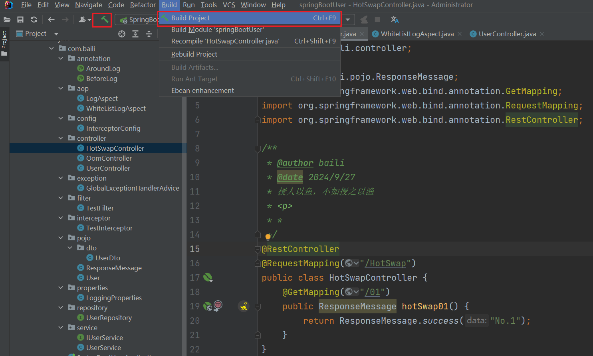
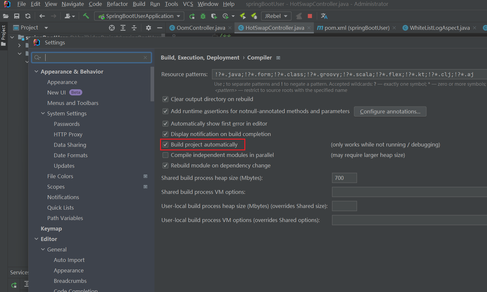
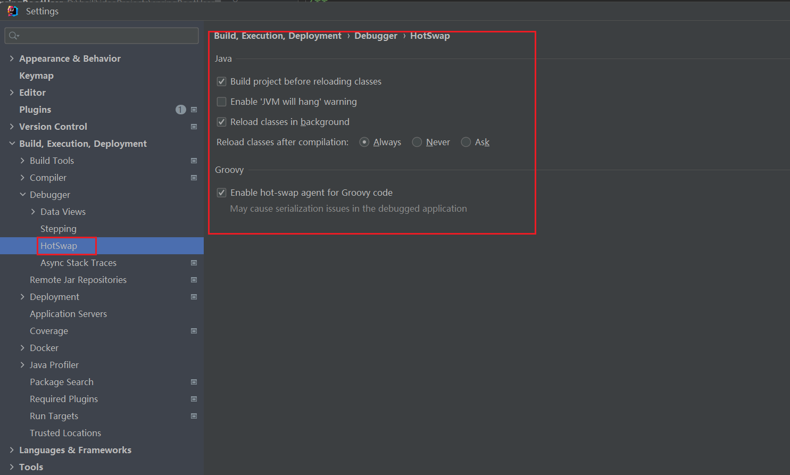
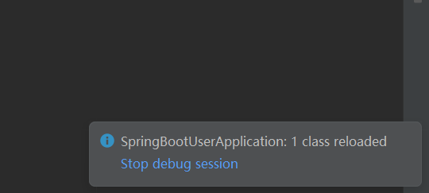
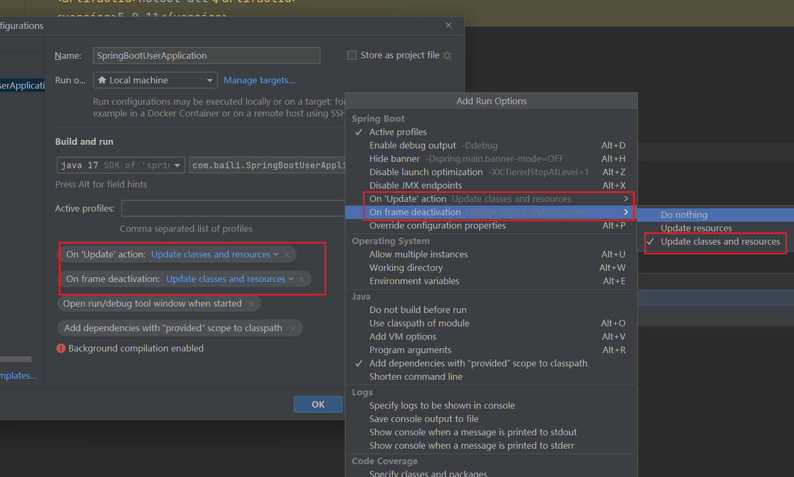

# IDEA + Spring Boot 的三种热加载方案，看完弄懂，不用加班

## **背景**
在日常开发中，我们需要经常修改 Java 代码，手动重启项目，查看修改后的效果。如果在项目小时，重启速度比较快，等待的时间是较短的。但是随着项目逐渐变大，重启的速度变慢，等待时间 1-2 min 是比较常见的。

这样就导致我们开发效率降低，影响我们的下班时间，哈哈哈~那么是否有方式能够实现，在我们修改完 Java 代码之后，能够不重启项目呢？

答案是有的，通过**热部署**的方式。并且实现的方式还是非常多，接下来就为大家一一展示。

## 方式一：spring-boot-devtools
`spring-boot-devtools` 是 Spring Boot 提供的开发者工具，它会监控当前应用所在的 classpath 下的文件发生变化，进行**自动重启**。

注意，`spring-boot-devtools` 并**没有**采用热部署的方式，而是一种**较快的重启方式**。其官方文档解释如下：

> “FROM 《Spring Boot 2.X 中文文档 —— 开发者工具》 Spring Boot 通过使用两个类加载器来提供了重启技术。 
>

+ 不改变的类（例如，第三方 jar）被加载到 **base** 类加载器中。
+ 经常处于开发状态的类被加载到 **restart** 类加载器中。

当应用重启时，**restart** 类加载器将被丢弃，并重新创建一个新的。这种方式意味着应用重启比**冷启动**要快得多，因为省去 **base** 类加载器的处理步骤，并且可以直接使用。 

在项目中，我们需要在 `pom.xml` 中，引入 `spring-boot-devtools` 依赖如下：

```xml
<dependency>
  <groupId>org.springframework.boot</groupId>
  <artifactId>spring-boot-devtools</artifactId>
  <optional>true</optional> <!-- 可选 -->
</dependency>
```

### **演示**
① Run 或者 Debug 运行 Spring Boot 应用。

使用浏览器，访问  `http://localhost:8081/HotSwap/01`  接口，返回结果为 `"No.1"`。

② 修改 HotSwapController 的 `#hotSwap01()` 方法，设置返回值为 `"No.2"`。

**【关键】** 我们现在仅仅需要修改了 Java 代码，需要重新编译下代码。点击 IDEA 的菜单 `Build` -> `Build Project`，**手动**进行编译 或者 快捷键编译

+ Mac：Command + F9
+ Windows：Ctrl + F9



此时，IDEA 控制台会看到 Spring Boot 重新启动的日志如下：

```powershell
2024-09-27T15:11:54.380+08:00  INFO 37972 --- [springbootUser] [   File Watcher] rtingClassPathChangeChangedEventListener : Restarting due to 1 class path change (0 additions, 1 deletion, 0 modifications)
2024-09-27T15:11:54.633+08:00  INFO 37972 --- [springbootUser] [      Thread-14] j.LocalContainerEntityManagerFactoryBean : Closing JPA EntityManagerFactory for persistence unit 'default'
2024-09-27T15:11:54.633+08:00  INFO 37972 --- [springbootUser] [      Thread-14] com.zaxxer.hikari.HikariDataSource       : HikariPool-3 - Shutdown initiated...
2024-09-27T15:11:54.636+08:00  INFO 37972 --- [springbootUser] [      Thread-14] com.zaxxer.hikari.HikariDataSource       : HikariPool-3 - Shutdown completed.
执行过滤器 destroy() 方法。

  .   ____          _            __ _ _
 /\\ / ___'_ __ _ _(_)_ __  __ _ \ \ \ \
( ( )\___ | '_ | '_| | '_ \/ _` | \ \ \ \
 \\/  ___)| |_)| | | | | || (_| |  ) ) ) )
  '  |____| .__|_| |_|_| |_\__, | / / / /
 =========|_|==============|___/=/_/_/_/

 :: Spring Boot ::                (v3.3.3)
```

+ 所以 `spring-boot-devtools` 真的不是热部署，而是更快的重启方式。

使用浏览器，再次访问 `http://localhost:8081/HotSwap/01` 接口，返回结果为 `"No.2"`，成功！

③ 可能有会觉得**手动**`Build Project` 有点麻烦，IDEA 还提供的**自动编译**的选项。设置方式，点击 IDEA 的菜单 `IntelliJ IDEA` -> `Preference...`，然后选择 `Compiler` 选项卡，将 `Build project automatically` 勾选上，修改完成后将焦点移出 IDEA ，触发自动编译。



> “注意，`Build project automatically` 后面的一行提示，自动编译仅在项目**不处于运行**，或者处于 **Debug 运行中**时，才会自动生效。
>

所以一定要 **Debug** 运行 Spring Boot 项目。

## 方式二： IDEA 提供了 HotSwap 插件，可以实现真正的热部署。


### **演示**
① Run 或者 Debug 运行 Spring Boot 应用。

使用浏览器，访问 `http://localhost:8081/HotSwap/01` 接口，返回结果为 `"No.1"`。

② 修改 HotSwapController 的 `#hotSwap01()` 方法，设置返回值为 `"No.2"`。

**【关键】** 我们现在仅仅需要修改了 Java 代码，需要重新编译下代码。点击 IDEA 的菜单 `Build` -> `Build Project`，**手动**进行编译 或者 快捷键编译

+ Mac：Command + F9
+ Windows：Ctrl + F9


此时，我们在 IDEA 中可以看修改的类被重载的提示。如下图所示：



使用浏览器，再次访问 `http://localhost:8081/HotSwap/01` 接口，返回结果为 `"NO.2"`，成功！

③ 尝试将 `Build project automatically` 勾选上，希望实现自动编译，操作步骤如下图：



+ 要注意，需要**焦点**从 IDEA 离开。例如说，在我们修改完接口的代码之后，可能会切换到浏览器或者 Postman 对该接口进行测试，此时 IDEA 就会自动更新代码和资源，进行热部署。

现在，我们来 修改 HotSwapController 的 `#hotSwap01()` 方法，设置返回值为 `"NO.2"`。

**鼠标点击电脑操作系统任务栏**，以达到 IDEA **失去焦点**的效果。我们在 IDEA 中可以看修改的类被重载的提示。如下图所示：


使用浏览器，再次访问 `http://localhost:8081/HotSwap/01` 接口，返回结果为 `"No.2"`，成功！

## **方式三：Jrebel**
插件市场搜索安装 Jrebel。然后试用 OR 想办法激活。

使用时 采用 jrebel 启动，而不是 idea 原生启动，这个时候修改了文件内容，就会触发热部署。


> 更新: 2024-09-27 20:42:47  
> 原文: <https://www.yuque.com/tulingzhouyu/db22bv/orglz6qr4ggvgcuz>