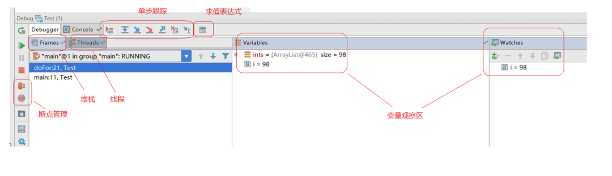
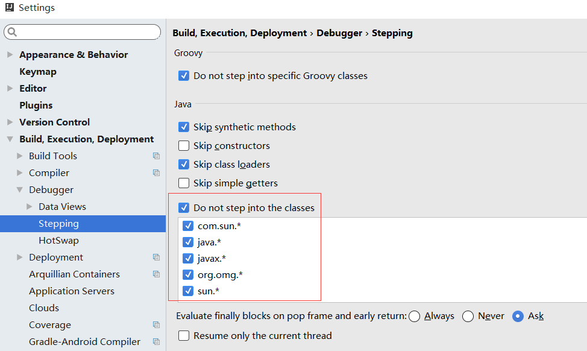
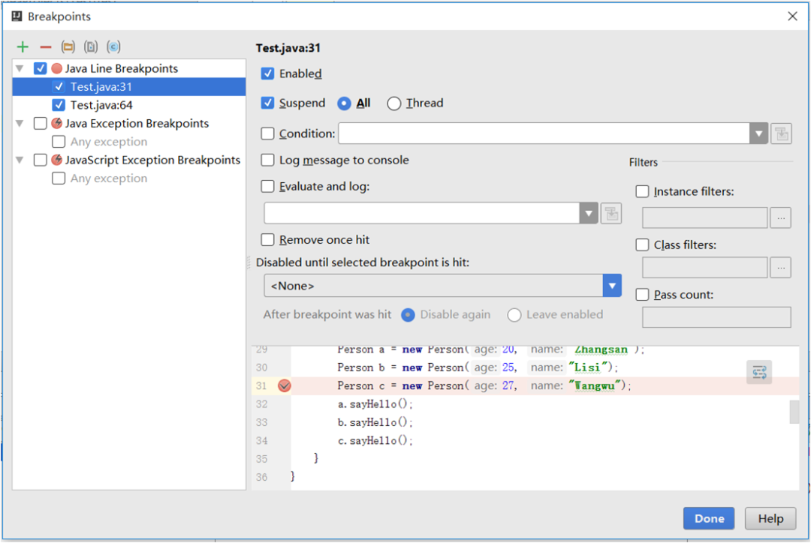
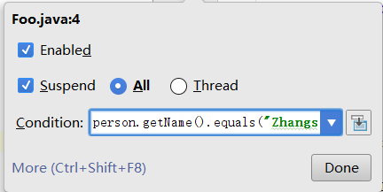
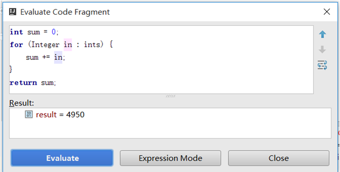
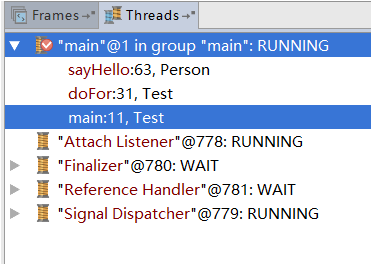
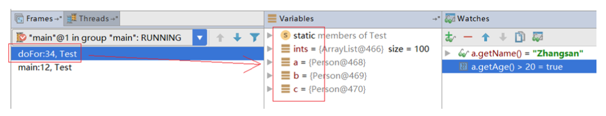

# IDEA 调试技巧你都知道哪些？

---

在软件开发的过程中，可以说调试是一项基本技能。调试的英文单词为 debug ，顾名思义，就是去除 bug 的意思。俗话说的好，编程就是制造 bug 的过程，所以 debug 的重要性毋庸置疑，如果能熟练掌握调试技能，也就可以很快的定位出代码中的 bug。要知道，看的懂代码不一定写的出代码，写的出代码不一定能调试好代码，为了能写出没有 bug 的代码，我们必须得掌握一些基本的调试技巧。 

工欲善其事，必先利其器。无论你的开发工具是 IntelliJ IDEA 还是 Eclipse ，调试器都是标配。在遇到有问题的程序时，合理的利用调试器的跟踪和断点技巧，可以很快的定位出问题原因。虽然说合理利用日志也可以方便定位线上问题，但是日志并不是调试工具，不要在开发环境把 System.out.println 当作调试手段，掌握调试器自带的调试技能才是正道。

### 一、实战 IDEA 调试技巧
如果你是做 Java 开发的，相信你不会没有听过 IntelliJ IDEA ，和大多数 Java 开发者一样，我一开始的时候也是用 Eclipse 来进行开发，但是自从换了 IDEA 之后，就再也离不开它了，彻底变成了 IDEA 的忠实粉丝

不得不说，JetBrains 这家来自捷克的软件公司真的是良心企业，所出产品皆是精品，除了 IDEA，还有 WebStorm，PhpStorm，PyCharm 等，风格都是很类似的，一些类似的快捷键包括调试技巧也是通用的。

打开 IDEA 的调试面板，如下图所示，可以大致的将其分成五个部分：

+ 单步跟踪
+ 断点管理
+ 求值表达式
+ 堆栈和线程
+ 变量观察

#### 1.1 单步跟踪
说起调试，估计很多人第一反应就是对程序进行一步一步的跟踪分析，其实 IDEA 提供了很多快捷键来帮助我们跟踪程序，大抵可以列出下面几个技巧：

+ Show Execution Point

调试时往往需要浏览代码，对代码进行分析，有时候在浏览若干个源文件之后就找不到当前执行到哪了，可能很多人会使用 Navigate Back 来返回，虽然也可以返回去，但可能需要点多次返回按钮，相对来说使用这个技巧快速定位到当前调试器正在执行的代码行要更简便。

+ Step Over

这是最基本的单步命令，每一次都是执行一行代码，如果该行代码有方法会直接跳过，可以说真的是一步一个脚印。

+ Step In / Force Step In

Step Over 会跳过方法的执行，可以观察方法的返回值，但如果需要进到方法里面，观察方法的执行细节，则需要使用 Step In 命令了。另外，Step In 命令也会跳过 jdk 自带的系统方法，如果要跟踪系统方法的执行细节，需要使用 Force Step In 命令。

关于单步的时候忽略哪些系统方法，可以在 IDEA 的配置项 `Settings -> Build, Execution, Deployment -> Debugger -> Stepping` 中进行配置，如下图所示。

+ Step Out

当使用 Step In 命令跟踪到一个方法的内部时，如果发现自己不想继续调这个方法了，可以直接把这个方法执行完，并停在调用该方法的下一行位置，这就是 Step Out 命令。

+ Drop to Frame

这一招可以说是调试器的一大杀器。在单步调试的时候，如果由于粗心导致单步过了头，没有看到关键代码的执行情况，譬如想定位下某个中间变量的值，这个时候如果能回到那行关键代码再执行一遍就好了，Drop to Frame 就提供了我们这个能力，它可以回到方法调用的地方（跟 Step Out 不一样，Step Out 是回到方法调用的下一行），让我们可以再调试一次这个方法，这一次可不要再粗心了。

Drop to frame 的原理其实也非常简单，顾名思义，它将堆栈的最上面一个栈帧删除（也就是当前正在执行的方法），让程序回到上一个栈帧（父方法），可以想见，这只会恢复堆栈中的局部变量，全局变量无法恢复，如果方法中有对全局变量进行操作的地方，是没有办法再来一遍的。

+ Run to Cursor / Force Run to Cursor

这两个命令在需要临时断点时非常有用，譬如已经知道自己想分析哪一行代码了，但又不需要下很多无谓的断点，可以直接使用该命令执行到某行，Force Run to Cursor 甚至可以无视所有断点，直接到达我们想分析的地方。

#### 1.2 断点管理
断点是调试器的基础功能之一，可以让程序暂停在需要的地方，帮助我们进行分析程序的运行过程。在 IDEA 中断点管理如下图所示，合理使用断点技巧可以快速让程序停在我们想停的地方：

可以将断点分成两种类型：行断点指的是在特定的某行代码上暂停下来，而全局断点是在某个条件满足时停下来，并不限于停在固定的某一行，譬如当出现异常时暂停程序。

##### 1.2.1 行断点
+ Suspend (All / Thread)
+ Condition

条件断点。这应该也是每个使用调试器的开发者都应该掌握的一个技巧，当遇到遍历比较大的 List 或 Map 对象时，譬如有 1000 个 Person 对象，你不可能每个对象都调一遍，你可能只想在 `person.name = 'Zhangsan'` 的时候让断点断下来，就可以使用条件断点，如下图所示：

+ Log message to console
+ Evaluate and log

当看到上面的 Suspend 这个选项的时候有的人可能会感到奇怪，我下一个断点不就是为了让程序停下来吗？还需要这个选项干什么？是不是有点多余？难道你下个断点却不想让程序停下来？

在发现 Evaluate and log 这个技巧之前，我对这一点也感觉很奇怪，直到有一天我突然发现 Suspend Off + Evaluate and log 的配合真的是太有用了。前面有讲过，不要把 `System.out.println` 当作调试手段，因为你完全可以用这个技巧来打印所有你想打印的信息，而不需要修改你的源代码。

+ Remove once hit

一次性断点。上面介绍的 Run to Cursor 就是一次性断点的例子。

+ Instance filters
+ Class filters
+ Pass count

这几个我用的不是很多，但应该也是非常有用的技巧可以先记下来。在 IDEA 里每个对象都有一个实例ID，Instance filters 就是用于当断点处代码所处的实例和设定ID匹配则断下来。Pass count 则是在断点执行到第几次的时候暂停下来。

##### 1.2.2 全局断点
+ Exception breakpoints
+ Method breakpoints
+ Field watchpoints

个人感觉这几个技巧都不是很常用，感兴趣的同学自己实验一把吧。

#### 1.3 求值表达式
在一堆单步跟踪的按钮旁边，有一个不显眼的按钮，这个按钮就是 “求值表达式”。它在调试的时候很有用，可以查看某个变量的值，也可以计算某个表达式的值，甚至还可以计算自己的一段代码的值，这分别对应下面两种不同的模式：

+ 表达式模式（Expression Mode）
+ 代码片段模式（Code Fragment Mode）

这两个模式类似于 Eclipse 里面的 Expression View 和 Display View。在 Display View 里也可以编写一段代码来执行，确实非常强大，但是要注意的是，这里只能写代码片段，不能自定义方法，如下图：

#### 1.4 堆栈和线程
这个没什么好说的，一个视图可以查看当前的所有线程，另一个视图可以查看当前的函数堆栈。在线程视图里可以进行 Thread dump，分析每个线程当前正在做什么；堆栈视图里可以切换栈帧，结合右边的变量观察区，可以方便的查看每个函数里的局部变量和参数。

+ 线程视图
+ 堆栈视图

#### 1.5 变量观察
变量区和观察区可以合并在一起，也可以分开来显示（如下图所示），我比较喜欢分开来显示，这样局部变量、参数以及静态变量显示在变量区，要观察的表达式显示在观察区。

观察区类似于求值表达式中的 Expression mode，你可以添加需要观察的表达式，在调试的时候可以实时的看到表达式的值。变量区的内容相对是固定的，随着左边的栈帧调整，值也会变得不同。在这里还可以修改变量原有的值。

> 更新: 2024-10-18 16:29:25  
> 原文: <https://www.yuque.com/tulingzhouyu/db22bv/gr221nqtgcp3oqg5>