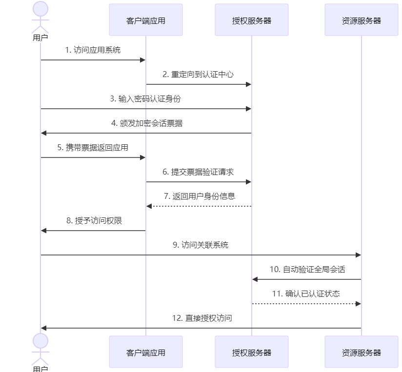
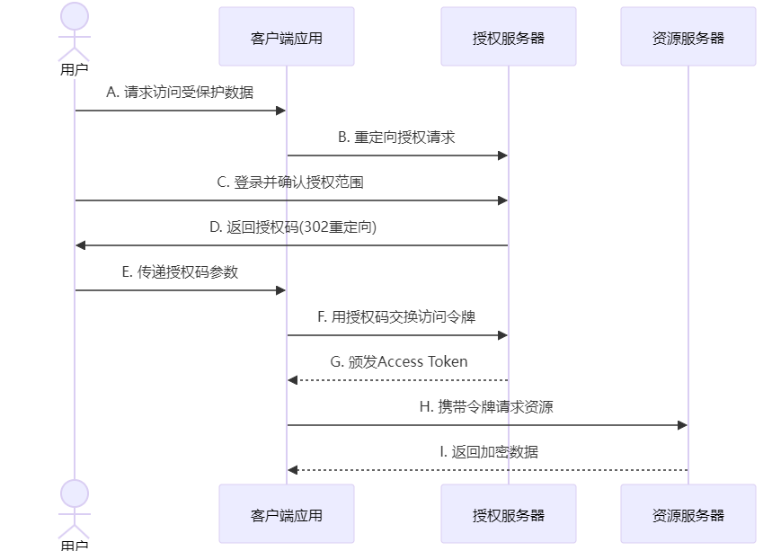

# SSO 与 Oauth 的区别

# 前言
在数字化浪潮深度渗透的现代生活中，用户每天需要与数十个网络应用进行交互。从企业级管理系统到社交娱乐平台，使用便捷性与数据安全性已成为评估数字服务的黄金标准。

作为支撑现代身份验证体系的两大支柱，SSO（单点登录）与OAuth（开放授权）技术正是实现这一平衡的核心引擎。

**需要明确的是，OAuth本质上并非SSO解决方案**，但两者的功能交集常引发开发者的认知混淆。

在本文中，我们将阐明 OAuth 和 SSO 之间的区别，并帮助您确定应该使用哪一个。

# 一、概念介绍
## 1.1 SSO：单点登录
+ **SSO（Single Sign-On，单点登录）**

一种**身份验证**方法，允许用户通过身份提供商（IdP）进行一次身份验证即可访问多个应用程序，它的核心目标是减少用户在不同系统之间重复输入用户名和密码的繁琐操作，提高用户体验和工作效率

## 1.2 OAuth：开放授权
+ **OAuth（Open Authorization，开放授权）**

一种**授权协议**，它允许用户授权第三方应用访问他们在某一服务提供商处的某些特定资源，而无需将自己的用户名和密码提供给第三方应用。

# 二、SSO 技术原理
## 2.1 SSO 核心构成
+ **中心认证服务器**

SSO 系统通常包含一个中心认证服务器，它负责对用户的身份进行验证。当用户首次访问某个应用系统时，该应用系统会将用户重定向到中心认证服务器进行登录

+ **票据（Ticket）机制**

用户在中心认证服务器成功登录后，服务器会生成一个包含用户身份信息的票据（通常是一个加密的字符串），并将该票据返回给用户的浏览器。用户的浏览器会将这个票据保存在 Cookie 中或者作为 URL 参数传递给后续访问的其他应用系统。

+ **应用系统验证**

当用户访问其他应用系统时，这些应用系统会从用户的请求中获取票据，并将其发送回中心认证服务器进行验证。如果票据验证通过，应用系统就会认为用户已经通过身份验证，允许用户访问相应的资源。

## 2.2 实现原理
SSO的实现原理如下图所示：

1. 用户首次访问一个需要身份验证的应用程序或系统。
2. 应用程序或系统将用户重定向到IdP，用户在IdP上进行身份验证，通常是输入用户名和密码。
3. IdP向用户颁发令牌Token，该令牌包含有关用户身份验证的信息。
4. 用户被重定向回原始的应用程序或系统，并将令牌传递给该应用程序或系统，应用程序或系统使用令牌来验证用户身份，并授予用户访问权限。
5. 如果用户访问其他需要身份验证的应用程序或系统，该应用程序或系统将使用相同的令牌到IdP进行用户身份验证。

## 2.3 SSO 的应用场景
+ **企业内部应用整合**

对于大型企业来说，拥有众多的内部应用系统，如 ERP、CRM、HR 等。通过实施 SSO，可以大大提高员工的工作效率，减少因密码管理问题带来的工作中断

+ **跨域联合登录**

在一些跨组织或跨域的场景中，SSO 也可以发挥重要作用。例如，多个企业之间进行合作，需要共享某些应用资源，通过建立联合 SSO 系统，可以实现用户在不同企业域之间的无缝登录

+ **云服务集成**

随着云计算的发展，许多企业将应用部署在云平台上。云服务提供商可以提供 SSO 解决方案，使得企业用户可以方便地访问多个云服务应用。

# 三、OAuth 技术原理
## 3.1 OAuth 授权流程
+ **角色划分：**OAuth 涉及三个主要角色，分别是资源所有者（通常是用户）、资源服务器（存储用户资源的服务器）和客户端应用（想要访问用户资源的第三方应用）。
+ **授权流程：**
    - 用户首先访问客户端应用，客户端应用向用户请求授权访问其在资源服务器上的某些资源；
    - 用户同意授权后，客户端应用会将用户重定向到资源服务器的授权页面；
    - 用户在授权页面上确认授权，资源服务器会生成一个授权码（Authorization Code）并返回给客户端应用；
    - 客户端应用使用授权码向资源服务器换取访问令牌（Access Token）；
    - 客户端应用使用访问令牌向资源服务器请求访问用户的资源。

## 3.2 OAuth 2.0
目前最新的版本为 OAuth 2.0 版，主要有四个主体：

+ **授权服务器**：负责颁发访问令牌（Access Token），Authing 是授权服务器。
+ **资源所有者**：应用的用户是资源的所有者，授权其他人访问其资源。
+ **调用方**：调用方请求获取访问令牌（Access Token），经过用户授权后，Authing 为其颁发访问令牌（Access Token）。调用方可以携带访问令牌（Access Token）到资源服务器访问用户的资源。
+ **资源服务器**：接受访问令牌（Access Token），然后验证它的被赋予的权限项目，最后返回资源。

## 3.3 OAuth 2.0 授权模式
OAuth 2.0 有四种授权模式：

1. **授权码（Authorization-code）**：指的是第三方应用先申请一个授权码，然后再用该码获取令牌。该方式是最常用的流程，安全性也最高，它适用于那些有后端的 Web 应用。
2. **隐藏式（Implicit）**：该模式面向纯前端应用，App 认证服务器只返还一次授权码。
3. **密码式（Password）**：允许客户端或者第三方应用，直接使用用户的账号密码进行令牌的获取。该方式在用户端应用广泛。
4. **凭证式（Client credentials）**：适用于没有前端的命令行应用，即在命令行下请求令牌。该方式操作简单，只需要发送客户请求，即可获得访问令牌（Access Token），但这种方式非常不安全，需要对客户端完全信任，且客户端本身需要具备安全性。

## 3.4 OAuth 的应用场景
+ **第三方应用授权**

如前面提到的图片编辑应用访问云存储照片的例子，OAuth 为各种第三方应用提供了一种安全、便捷的授权方式，让用户可以自由选择授权哪些应用访问自己的资源

+ **社交网络平台开放 API**

社交网络平台通常通过 OAuth 允许第三方开发者基于其平台开发应用。这些应用可以在用户授权的情况下获取用户在社交网络上的部分信息，如发布动态、获取好友列表等，从而丰富了社交网络平台的生态

+ **移动应用授权**

在移动应用领域，OAuth 也被广泛应用。例如，一些移动支付应用需要访问用户的银行账户信息，通过 OAuth 可以在保证安全的前提下获取用户的授权。

> 更新: 2025-03-14 19:54:04  
> 原文: <https://www.yuque.com/tulingzhouyu/db22bv/bfiqnz5gam9yqb6o>