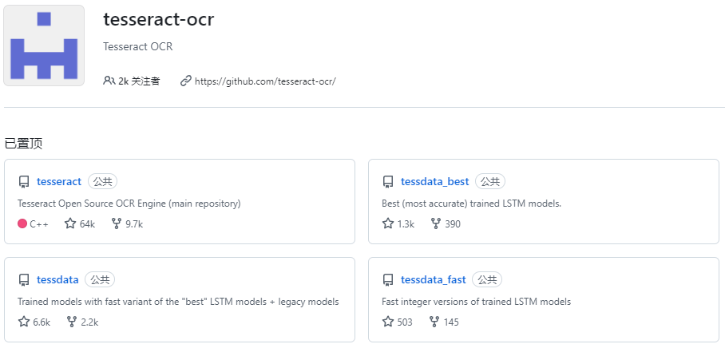
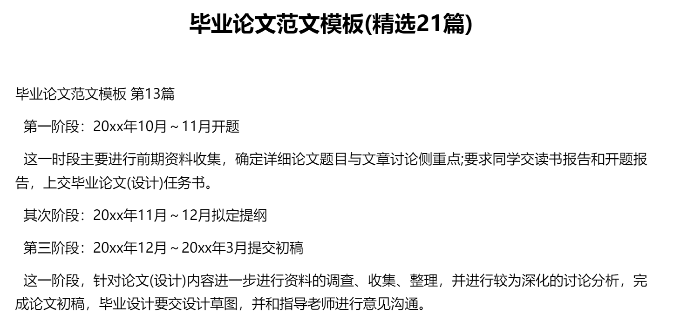
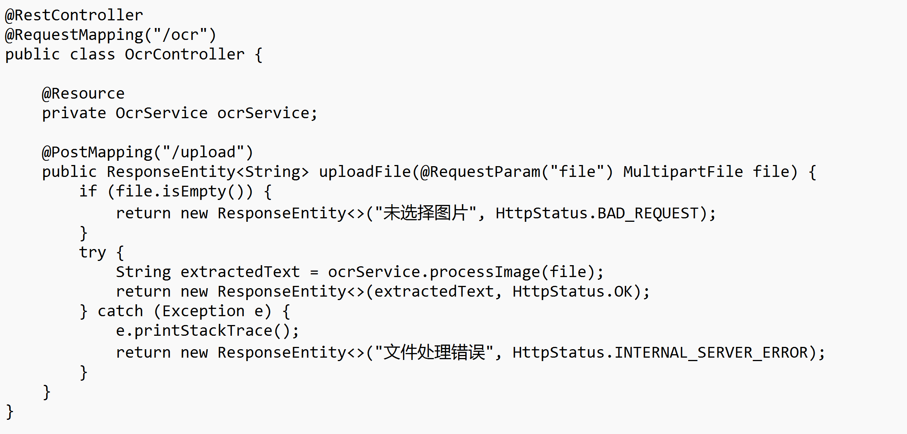
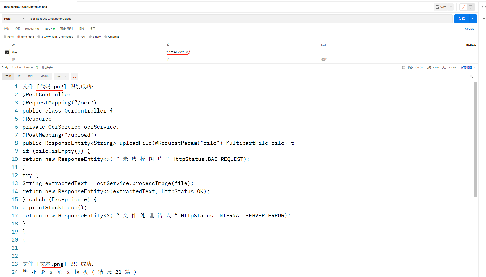

# Spring Boot 实现OCR图片文字识别

## 1、前言
之前在某一个项目中，客户要求根据上传的文档图片系统自动识别图片内容，这就需要到了`OCR`技术，我们公司一般做法通常是使用`阿里云`或`腾讯云`的`OCR`图片识别（大厂的训练量更多更大，识别更精准）无奈客户资金有限，又希望我们满足需求，最后我们决定采用开源`Tesseract` 文字识别 `OCR` 引擎来实现

`Tesseract` 是一个功能强大的 `OCR` 引擎，其发展经历了多个版本的迭代。最初由惠普实验室开发，后由 Google 维护和发展。`Tesseract` 通过神经网络和图像处理技术，对图像中的文字进行识别和提取。

## 2、什么是 Tess4J
`Tess4J` 是一个 `Java` 的 `OCR`（光学字符识别）库，基于 `Tesseract OCR` 引擎实现。`Tess4J` 为 Java 开发者提供了一个便捷的接口，能够在 Java 项目中轻松调用 `Tesseract` 的 OCR 功能。

> **温馨提示**  
Tess4J 只是就是封装了Tesseract OCR的API，让Java可以直接调用，千万不要错误以为是Tess4J实现的
>

## 3、ocr 前置准备
### 3.1 配置 Tesseract 数据文件
`Tess4J` 依赖 `Tesseract` 数据文件来识别不同语言的文本。可以从 [Tesseract Github仓库](https://github.com/tesseract-ocr) 下载所需语言的训练数据。  
  
如上图所示：Tesseract有三个独立的语言模型存储库 tessdata、tessdata-best、tessdata-fast 他们分别都存储了语言模型，主要有以下区别

| 数据模型存储库 | 描述 | 速度 | 识别精度 | 支持再训练 |
| --- | --- | --- | --- | --- |
| tessdata_best | 最好（最准确）的训练LSTM模型 | 最慢 | 最高 | 支持 |
| tessdata | 使用“最佳”LSTM模型+遗留模型的快速变体训练模型 | 均衡 | 均衡 | 不支持 |
| tessdata_fast | 训练LSTM模型的快速版本 | 最快 | 最低 | 不支持 |


选择Tesseract最高的 `tessdata_best` 中文数据文件，下载完成后，将数据文件放在项目的资源目录中，`src/main/resources/tessdata`

> 如果你只是处理中文、英文的文字识别，无需将整个库下载，找到chi_sim.traineddata 和eng.traineddata下载即可
>

如果整个存储库下载过大，大家根据自己的需求下载对应语言版本或者特殊的模型（**如数学公式：equ.traineddata 模型**），语言版本参考官方地址：[https://tesseract-ocr.github.io/tessdoc/Data-Files.html](https://tesseract-ocr.github.io/tessdoc/Data-Files.html)

## 4、代码实现
### 4.1 配置 Maven 依赖
```xml
<dependency>
  <groupId>org.springframework.boot</groupId>
  <artifactId>spring-boot-starter-web</artifactId>
</dependency>

<dependency>
  <groupId>org.springframework.boot</groupId>
  <artifactId>spring-boot-starter-test</artifactId>
  <scope>test</scope>
</dependency>

<!-- https://mvnrepository.com/artifact/net.sourceforge.tess4j/tess4j -->
<dependency>
  <groupId>net.sourceforge.tess4j</groupId>
  <artifactId>tess4j</artifactId>
  <version>5.13.0</version>
</dependency>
```

### 4.2 application 配置
```yaml
server:
  port: 8080
  servlet:
    encoding:
      charset: utf-8

spring:
  application:
    name: bailiOcr
  # 文件大小限制
  servlet:
    multipart:
      enabled: true
      max-file-size: 10MB
      max-request-size: 10MB
      file-size-threshold: 0

# 配置 tess4j 数据
tess4j:
  dataPath: D:\baili\ideaProjects\springBootOCR\tessData
  language: eng+chi_sim
```

### 4.3 创建 OCR 服务类
首先，创建一个 OCR 服务类，用于处理图片文字识别的逻辑

```java
import jakarta.annotation.Resource;
import net.sourceforge.tess4j.Tesseract;
import org.springframework.stereotype.Service;
import org.springframework.web.multipart.MultipartFile;

import javax.imageio.ImageIO;
import java.awt.image.BufferedImage;

@Service
public class OcrService {

    @Resource
    private Tesseract tesseract;
    public String processImage(MultipartFile file) throws Exception {
        BufferedImage image = ImageIO.read(file.getInputStream());
        return tesseract.doOCR(image);
    }
}
```

### 4.4 创建OCRController
创建一个控制器，用于处理前端请求并调用 OCR 服务

```java
import com.baili.springbootocr.service.OcrService;
import jakarta.annotation.Resource;
import org.springframework.http.HttpStatus;
import org.springframework.http.ResponseEntity;
import org.springframework.web.bind.annotation.PostMapping;
import org.springframework.web.bind.annotation.RequestMapping;
import org.springframework.web.bind.annotation.RequestParam;
import org.springframework.web.bind.annotation.RestController;
import org.springframework.web.multipart.MultipartFile;

@RestController
@RequestMapping("/ocr")
public class OcrController {  

    @Resource
    private OcrService ocrService;

    @PostMapping("/upload")
    public ResponseEntity<String> uploadFile(@RequestParam("file") MultipartFile file) {
        if (file.isEmpty()) {
            return new ResponseEntity<>("未选择图片", HttpStatus.BAD_REQUEST);
        }
        try {
            String extractedText = ocrService.processImage(file);
            return new ResponseEntity<>(extractedText, HttpStatus.OK);
        } catch (Exception e) {
            e.printStackTrace();
            return new ResponseEntity<>("文件处理错误", HttpStatus.INTERNAL_SERVER_ERROR);
        }  
    }

    @PostMapping("/batchUpload")
    public ResponseEntity<Object> uploadFiles(@RequestParam("files") MultipartFile[] files) {
        // 如果未选择任何文件，直接返回 BAD_REQUEST 的状态
        if (files == null || files.length == 0) {
            return new ResponseEntity<>("未选择图片", HttpStatus.BAD_REQUEST);
        }

        // 保存每个文件的处理结果
        StringBuilder resultBuilder = new StringBuilder(); // 用于拼接返回的字符串结果

        for (MultipartFile file : files) {
            if (file.isEmpty()) {
                // 处理空文件的情况
                resultBuilder
                .append("文件 [")
                .append(file.getOriginalFilename())
                .append("] 为空，跳过处理。\n");
                continue;
            }
            try {
                // 调用 OCR 服务识别当前图片
                String extractedText = ocrService.processImage(file);
                resultBuilder
                .append("文件 [")
                .append(file.getOriginalFilename())
                .append("] 识别成功：\n")
                .append(extractedText)
                .append("\n\n");
            } catch (Exception e) {
                // 处理异常（如无法解析图片）
                resultBuilder
                .append("文件 [")
                .append(file.getOriginalFilename())
                .append("] 处理失败，错误信息：")
                .append(e.getMessage())
                .append("\n\n");
            }
        }

        // 返回拼接的结果内容和状态
        return new ResponseEntity<>(resultBuilder.toString(), HttpStatus.OK);
    }
}
```

### 4.5 开始调试
准备图片，就以本篇文章开头文案图片来测试；

>   
使用Apifox或Postman进行调试，这里使用Postman测试效果如下：  

>

## 5、总结
通过以上步骤，我们成功地在 Spring Boot 项目中集成了 Tess4J，实现了图片文字识别功能。

本文详细介绍了从项目初始化、服务类和控制器的编写到最终测试，希望对大家有所帮助。如果有更复杂的需求，可以进一步优化和扩展此项目。


> 更新: 2025-01-22 22:05:42  
> 原文: <https://www.yuque.com/tulingzhouyu/db22bv/yog2483rordgfvtl>