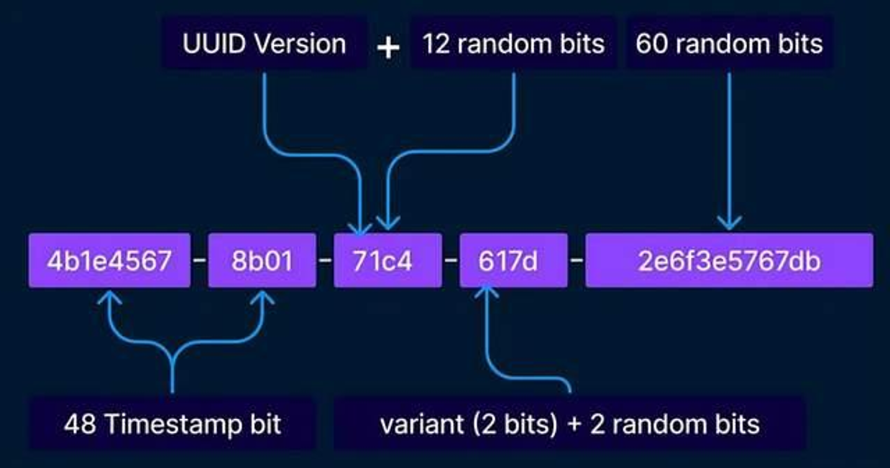
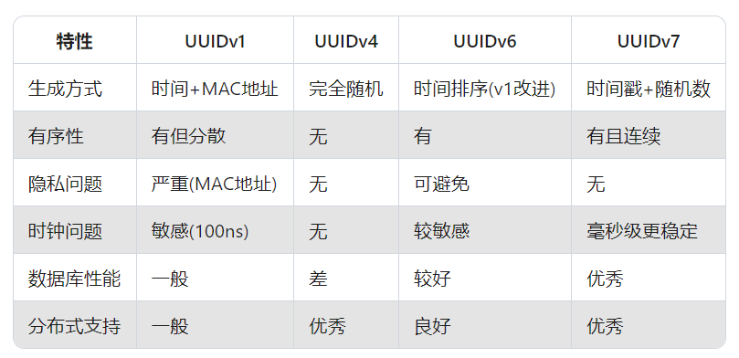

# UUIDv7：打破谣言，我就是要用UUID做主键！凭什么它是最强主键候选者？

<font style="color:rgba(0, 0, 0, 0.88);">在互联网技术圈，一直流传着一个"常识"：UUID不适合用作数据库主键。这个观点被广泛传播，以至于很多开发者不假思索地接受了它。但今天，我要大声说：</font>**<font style="color:rgba(0, 0, 0, 0.88);">这个观点已经过时了！</font>**<font style="color:rgba(0, 0, 0, 0.88);"> 随着UUIDv7的出现，我们可以自信地使用UUID作为主键，同时享受其带来的诸多优势。</font>

## <font style="color:rgba(0, 0, 0, 0.88);">传统UUID的痛点：为什么人们说UUID不适合做主键？</font>
<font style="color:rgba(0, 0, 0, 0.88);">传统观点认为UUID不适合做主键，主要是基于UUIDv4（完全随机版本）的特性：</font>

1. **<font style="color:rgba(0, 0, 0, 0.88);">索引分裂问题</font>**<font style="color:rgba(0, 0, 0, 0.88);">：完全随机的UUIDv4会导致数据库B+树索引频繁分裂，因为新插入的数据可能位于索引的任何位置，无法利用局部性原理。</font>
2. **<font style="color:rgba(0, 0, 0, 0.88);">存储空间较大</font>**<font style="color:rgba(0, 0, 0, 0.88);">：UUID占用16字节，相比自增ID的4字节(32位)或8字节(64位)更大</font><font style="color:rgba(0, 0, 0, 0.88);">。</font>
3. **<font style="color:rgba(0, 0, 0, 0.88);">查询性能影响</font>**<font style="color:rgba(0, 0, 0, 0.88);">：随机分布的UUID可能导致缓存命中率降低，增加I/O操作</font><font style="color:rgba(0, 0, 0, 0.88);">。</font>

<font style="color:rgba(0, 0, 0, 0.88);">这些观点在UUIDv4时代确实有其道理，但随着UUIDv7的出现，情况已经发生了根本性改变。</font>

## <font style="color:rgba(0, 0, 0, 0.88);">UUIDv7的革命性改进</font>
<font style="color:rgba(0, 0, 0, 0.88);">UUIDv7是UUID家族的最新成员，它完美解决了传统UUID的痛点。</font>

### <font style="color:rgba(0, 0, 0, 0.88);">1. 时间有序性设计</font>
<font style="color:rgba(0, 0, 0, 0.88);">UUIDv7是一种128位的全局唯一标识符，由RFC 9256规范定义。</font>

<font style="color:rgba(0, 0, 0, 0.88);">结构包括48位Unix时间戳（毫秒为单位）、版本号（7）、变体号（6）以及剩余的74位随机数据。</font>

<font style="color:rgba(0, 0, 0, 0.88);">UUIDv7的结构如下：</font>

```plain
+-+-+-+-+-+-+-+-+-+-+-+-+-+-+-+-+-+-+-+-+-+-+-+-+-+-+-+-+-+-+-+-+
|                       unix_ts_ms (48 bits)                    |
+-+-+-+-+-+-+-+-+-+-+-+-+-+-+-+-+-+-+-+-+-+-+-+-+-+-+-+-+-+-+-+-+
|  ver (4 bits) |         rand_a (12 bits)                      |
+-+-+-+-+-+-+-+-+-+-+-+-+-+-+-+-+-+-+-+-+-+-+-+-+-+-+-+-+-+-+-+-+
| var (2 bits) |                rand_b (62 bits)                |
+-+-+-+-+-+-+-+-+-+-+-+-+-+-+-+-+-+-+-+-+-+-+-+-+-+-+-+-+-+-+-+-+
```



<font style="color:rgba(0, 0, 0, 0.88);">关键改进：</font>

+ **<font style="color:rgba(0, 0, 0, 0.88);">48位Unix时间戳</font>**<font style="color:rgba(0, 0, 0, 0.88);">使用自1970年1月1日以来的毫秒数，比UUIDv1的100纳秒Gregorian时间戳更直观 。</font>
+ **<font style="color:rgba(0, 0, 0, 0.88);">时间有序</font>**<font style="color:rgba(0, 0, 0, 0.88);">新生成的UUID会自然按时间顺序排列，极大改善了数据库索引的局部性 。</font>
+ **<font style="color:rgba(0, 0, 0, 0.88);">保留随机性</font>**<font style="color:rgba(0, 0, 0, 0.88);">仍有74位随机数(rand_a+rand_b)保证唯一性。</font>

### <font style="color:rgba(0, 0, 0, 0.88);">2. 数据库性能优化</font>
<font style="color:rgba(0, 0, 0, 0.88);">在MySQL等使用B+树索引的数据库中，UUIDv7表现出色：</font>

+ **<font style="color:rgba(0, 0, 0, 0.88);">减少索引分裂</font>**<font style="color:rgba(0, 0, 0, 0.88);">时间有序性使得新数据倾向于插入到B+树的右侧，减少节点分裂 。</font>
+ **<font style="color:rgba(0, 0, 0, 0.88);">降低I/O压力</font>**<font style="color:rgba(0, 0, 0, 0.88);">顺序插入减少脏页刷盘频率，提高写入性能 。</font>
+ **<font style="color:rgba(0, 0, 0, 0.88);">缓存友好</font>**<font style="color:rgba(0, 0, 0, 0.88);">相邻数据更可能位于同一数据页，提高缓存命中率 。</font>

<font style="color:rgba(0, 0, 0, 0.88);"></font>

### <font style="color:rgba(0, 0, 0, 0.88);">3. 分布式系统优势</font>
<font style="color:rgba(0, 0, 0, 0.88);">相比自增ID，UUIDv7在分布式环境中优势明显：</font>

+ **<font style="color:rgba(0, 0, 0, 0.88);">无中心化协调</font>**<font style="color:rgba(0, 0, 0, 0.88);">各节点可独立生成ID，无需协调 。</font>
+ **<font style="color:rgba(0, 0, 0, 0.88);">避免ID冲突</font>**<font style="color:rgba(0, 0, 0, 0.88);">解决了分库分表时自增ID冲突的问题 。</font>
+ **<font style="color:rgba(0, 0, 0, 0.88);">提前生成ID</font>**<font style="color:rgba(0, 0, 0, 0.88);">应用层可先生成ID再批量插入，减少数据库往返 。</font>

<font style="color:rgba(0, 0, 0, 0.88);"></font>

## <font style="color:rgba(0, 0, 0, 0.88);">UUIDv7 vs 其他版本：为什么v7是最佳选择</font>
<font style="color:rgba(0, 0, 0, 0.88);">让我们比较各版本UUID的特性：</font>

  
 <font style="color:rgba(0, 0, 0, 0.88);">从表格可见，UUIDv7在几乎所有关键指标上都表现优异。</font>

<font style="color:rgba(0, 0, 0, 0.88);"></font>

## <font style="color:rgba(0, 0, 0, 0.88);">实战：如何在你的项目中使用UUIDv7</font>
### <font style="color:rgba(0, 0, 0, 0.88);">1. 生成UUIDv7</font>
<font style="color:rgba(0, 0, 0, 0.88);">各语言都有成熟的库支持UUIDv7生成：</font>

**<font style="color:rgba(0, 0, 0, 0.88);">Java示例</font>**<font style="color:rgba(0, 0, 0, 0.88);">：</font>

```plain

// 使用uuid-creator库
import com.fasterxml.uuid.Generators;
import com.fasterxml.uuid.impl.TimeBasedGenerator;
public class UUIDGeneration {
    public static void main(String[] args) {
        TimeBasedGenerator generator = Generators.timeBasedGenerator();
        System.out.println(generator.generate());
    }
}
```

**<font style="color:rgba(0, 0, 0, 0.88);">JavaScript示例</font>**<font style="color:rgba(0, 0, 0, 0.88);">：</font>

```plain

// 使用uuidv7库
import { uuidv7 } from 'uuidv7';
console.log(uuidv7());
```

**<font style="color:rgba(0, 0, 0, 0.88);">Go示例</font>**<font style="color:rgba(0, 0, 0, 0.88);">：</font>

```plain

package main
import (
    "fmt"
    "github.com/google/uuid"
)
func main() {
    id, _ := uuid.NewV7()
    fmt.Println("Generated UUIDv7:", id)
}
```

**<font style="color:rgba(0, 0, 0, 0.88);">Python示例</font>**<font style="color:rgba(0, 0, 0, 0.88);">：</font>

```plain
import time
import random
import secrets

def generate_uuidv7():
    # 获取当前时间戳（毫秒级别）
    ts = int(time.time() * 1000)
    # 时间戳部分占60位
    timestamp = (ts << 4) & 0xFFFFFFFFFFFFFFF0
    
    # 设置版本号为7（UUIDv7的版本号为0111）
    version = 0b0111 << 12
    
    # 生成随机数部分（84位）
    # 使用secrets模块提高随机性和安全性
    random_part = secrets.randbits(84)
    
    # 组合各部分形成完整的UUIDv7
    uuidv7 = timestamp | version | random_part
    
    # 格式化为标准的UUID字符串形式
    return '{:08x}-{:04x}-{:04x}-{:04x}-{:012x}'.format(
        (uuidv7 >> 96) & 0xFFFFFFFF,
        (uuidv7 >> 80) & 0xFFFF,
        (uuidv7 >> 64) & 0xFFFF,
        (uuidv7 >> 48) & 0xFFFF,
        uuidv7 & 0xFFFFFFFFFFFF
    )

# 示例：生成并打印UUIDv7
print(generate_uuidv7())    
```

### <font style="color:rgba(0, 0, 0, 0.88);">2. 数据库中使用</font>
<font style="color:rgba(0, 0, 0, 0.88);">在MySQL中，建议将UUID存储为16字节的二进制格式而非36字符的字符串，可节省空间并提高效率。</font>

```plain

# 表结构设计
CREATE TABLE users (
    id BINARY(16) PRIMARY KEY,
    username VARCHAR(50) NOT NULL,
    email VARCHAR(100) NOT NULL,
    created_at TIMESTAMP DEFAULT CURRENT_TIMESTAMP,
    INDEX idx_created_at (created_at)
) ENGINE=InnoDB;
```

#### <font style="color:rgba(0, 0, 0, 0.88);">插入数据（应用层生成）</font>
```plain

// Java示例：生成并转换UUIDv7
UUID uuid = Generators.timeBasedGenerator().generate();
byte[] uuidBytes = new byte[16];
ByteBuffer.wrap(uuidBytes)
    .putLong(uuid.getMostSignificantBits())
    .putLong(uuid.getLeastSignificantBits());
// JDBC插入
String sql = "INSERT INTO users (id, username, email) VALUES (?, ?, ?)";
try (PreparedStatement stmt = connection.prepareStatement(sql)) {
    stmt.setBytes(1, uuidBytes);
    stmt.setString(2, "john_doe");
    stmt.setString(3, "john@example.com");
    stmt.executeUpdate();
}
```

<font style="color:rgba(0, 0, 0, 0.88);"></font>

<font style="color:rgba(0, 0, 0, 0.88);">PostgreSQL原生支持UUID类型，可直接使用：</font>

```plain

CREATE TABLE orders (
    id UUID PRIMARY KEY DEFAULT uuid_generate_v7(),
    -- 其他字段
);
```

### <font style="color:rgba(0, 0, 0, 0.88);">3. SQL直接生成</font>
<font style="color:rgba(0, 0, 0, 0.88);">某些数据库支持直接用SQL生成UUIDv7：</font>

**<font style="color:rgba(0, 0, 0, 0.88);">PostgreSQL实现</font>**<font style="color:rgba(0, 0, 0, 0.88);">：</font>

```plain
select
  -- timestamp
  lpad(to_hex(((extract(epoch from now()) * 1000)::bigint >> 16)), 8, '0') || '-' ||
  lpad(to_hex(((extract(epoch from now()) * 1000
    + (date_part('milliseconds', now())::bigint % 1000))::bigint & 0xffff)), 4, '0') || '-' ||
  -- version
  lpad(to_hex((0x7000 + (random() * 0x0fff)::int)), 4, '0') || '-' ||
  -- variant
  lpad(to_hex((0x8000 + (random() * 0x3fff)::int)), 4, '0') || '-' ||
  -- randomness
  lpad(to_hex((floor(random() * (2^48))::bigint >> 16)), 12, '0') AS uuid7;
```

**<font style="color:rgba(0, 0, 0, 0.88);">SQLite实现</font>**<font style="color:rgba(0, 0, 0, 0.88);">：</font>

```plain
select
  -- timestamp
  format('%08x', ((strftime('%s') * 1000) >> 16)) || '-' ||
  format('%04x', ((strftime('%s') * 1000)
    + ((strftime('%f') * 1000) % 1000)) & 0xffff) || '-' ||
  -- version
  format('%04x', 0x7000 + abs(random()) % 0x0fff) || '-' ||
  -- variant
  format('%04x', 0x8000 + abs(random()) % 0x3fff) || '-' ||
  -- randomness
  format('%012x', abs(random()) >> 16) as value;
```

## <font style="color:rgba(0, 0, 0, 0.9);">常见问题解答</font>
**<font style="color:rgba(0, 0, 0, 0.9);">Q：UUIDv7会不会出现重复？</font>**<font style="color:rgba(0, 0, 0, 0.9);"></font>

**<font style="color:rgba(0, 0, 0, 0.9);">A</font>**<font style="color:rgba(0, 0, 0, 0.9);">：理论上有可能，但概率极低。48位时间戳(约8925年才轮回)加上74位随机数，冲突概率可以忽略不计</font><font style="color:rgba(0, 0, 0, 0.9);">。</font>

<font style="color:rgba(0, 0, 0, 0.9);"></font>

**<font style="color:rgba(0, 0, 0, 0.9);">Q：时钟回拨会影响UUIDv7吗？</font>**<font style="color:rgba(0, 0, 0, 0.9);"></font>

**<font style="color:rgba(0, 0, 0, 0.9);">A</font>**<font style="color:rgba(0, 0, 0, 0.9);">：毫秒级时间戳比UUIDv1的100纳秒更稳定，且现代系统有NTP同步，影响很小。一些实现还加入了时钟回拨保护机制</font><font style="color:rgba(0, 0, 0, 0.9);">。</font>

<font style="color:rgba(0, 0, 0, 0.9);"></font>

**<font style="color:rgba(0, 0, 0, 0.9);">Q：存储空间比自增ID大怎么办？</font>**<font style="color:rgba(0, 0, 0, 0.9);"></font>

**<font style="color:rgba(0, 0, 0, 0.9);">A</font>**<font style="color:rgba(0, 0, 0, 0.9);">：16字节在大多数应用中不是问题。如果确实敏感，可考虑二进制存储而非字符串形式</font><font style="color:rgba(0, 0, 0, 0.9);">。</font>

<font style="color:rgba(0, 0, 0, 0.9);"></font>

**<font style="color:rgba(0, 0, 0, 0.9);">Q：所有数据库都适合吗？</font>**<font style="color:rgba(0, 0, 0, 0.9);"></font>

**<font style="color:rgba(0, 0, 0, 0.9);">A</font>**<font style="color:rgba(0, 0, 0, 0.9);">：B+树类数据库(MySQL, PostgreSQL等)受益明显，LSM树数据库(如Cassandra)影响较小</font><font style="color:rgba(0, 0, 0, 0.9);">。</font>

<font style="color:rgba(0, 0, 0, 0.9);"></font>

## <font style="color:rgba(0, 0, 0, 0.9);">结语</font>
<font style="color:rgba(0, 0, 0, 0.9);">技术界的"常识"需要与时俱进。UUIDv7的出现彻底改变了UUID作为主键的适用性，它兼具全局唯一性和时间有序性，是分布式时代理想的主键选择。</font>

**<font style="color:rgba(0, 0, 0, 0.9);">是时候重新考虑你的主键策略了！</font>**<font style="color:rgba(0, 0, 0, 0.9);"> 不妨在下一个项目中尝试UUIDv7，体验它带来的性能提升和开发便利。</font>

如果你对UUIDv7有任何疑问或使用经验，欢迎在评论区分享交流！觉得本文有帮助的话，请点赞、转发，让更多开发者了解UUIDv7的强大之处。

<font style="color:rgba(6, 8, 31, 0.88);"></font>

<font style="color:rgba(6, 8, 31, 0.88);">关注公众号「</font>**<font style="color:rgba(6, 8, 31, 0.88);">Fox爱分享</font>**<font style="color:rgba(6, 8, 31, 0.88);">」</font><font style="color:rgb(64, 64, 64);">，获取更多技术干货！</font>


> 更新: 2025-07-07 20:15:07  
> 原文: <https://www.yuque.com/tulingzhouyu/db22bv/rg2bx73rmb19ik9u>