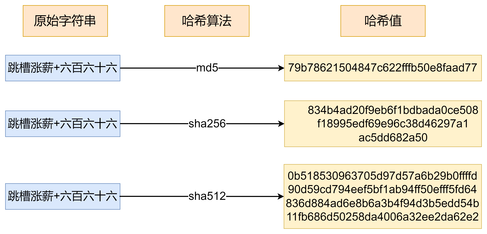
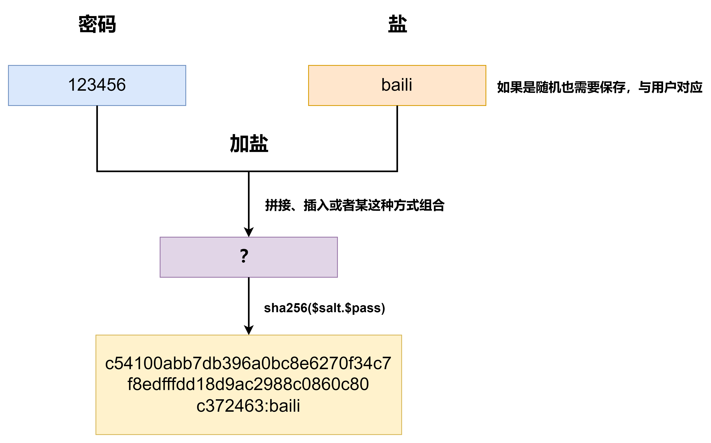

# 为什么QQ忘记密码只能重置，不能直接告诉你原密码？腾讯面试官揭秘：你的密码连系统都不知道！

#### **<font style="color:rgb(64, 64, 64);">一个让千万网友抓狂的瞬间</font>**
> <font style="color:rgb(64, 64, 64);">“密码错误！”</font><font style="color:rgb(64, 64, 64);">  
</font><font style="color:rgb(64, 64, 64);">第5次输入生日+纪念日+手机尾号的排列组合后，你瘫在椅子上哀嚎：“QQ啊QQ，连我自己都不记得密码了，你为什么不直接告诉我？！”</font>
>
> <font style="color:rgb(64, 64, 64);">最气的是新设置的密码说重复了。</font>
>

**<font style="color:rgb(64, 64, 64);">停！这个问题，连腾讯面试官都在考！</font>**  
<font style="color:rgb(64, 64, 64);">最近一位小伙伴爆料，腾讯面试时被问：“</font>**<font style="color:rgb(64, 64, 64);">为什么QQ忘记密码只能重置，不能直接告诉你原密码？</font>**<font style="color:rgb(64, 64, 64);">”  </font><font style="color:rgb(64, 64, 64);">小伙伴脑子嗡的一声（</font><font style="color:rgb(64, 64, 64);">内心OS：这题像问我为啥呼吸要喘气？？</font><font style="color:rgb(64, 64, 64);">）</font>


**<font style="color:rgb(64, 64, 64);">答案出乎意料：</font>****<font style="color:#DF2A3F;">因为QQ自己也不知道你的密码！</font>**  
<font style="color:rgb(64, 64, 64);">（是不是感觉大脑突然宕机？别急，往下看！）</font>

### **<font style="color:rgb(64, 64, 64);">1. 你的密码，在服务器眼里竟是“乱码”？</font>**
#### **<font style="color:rgb(64, 64, 64);">1.1 黑客电影里的“密码库”都是骗人的！</font>**
<font style="color:rgb(64, 64, 64);">电影里黑客轻松盗取“密码库”的场景，在现实中根本不存在！</font><font style="color:rgb(64, 64, 64);">  
</font>**<font style="color:rgb(64, 64, 64);">真相是：腾讯服务器里，压根没存你的真实密码！</font>**<font style="color:rgb(64, 64, 64);">  
</font><font style="color:rgb(64, 64, 64);">当你设置密码“1314520”时，系统会把它丢进一个**“魔法搅拌机”**（哈希算法），出来就变成：</font><font style="color:rgb(64, 64, 64);">  
</font>`<font style="color:rgb(64, 64, 64);">4f3d7a2e1c...</font>`<font style="color:rgb(64, 64, 64);">（64位乱码）</font><font style="color:rgb(64, 64, 64);">  
</font>**<font style="color:rgb(64, 64, 64);">哪怕马化腾本人登录QQ，看到的也只是这串“火星文”！</font>**



#### **<font style="color:rgb(64, 64, 64);">1.2 为什么非要搞这么麻烦？</font>**
<font style="color:rgb(64, 64, 64);">想象一下：如果腾讯存了你的明文密码——</font><font style="color:rgb(64, 64, 64);">  
</font><font style="color:rgb(64, 64, 64);">✅</font><font style="color:rgb(64, 64, 64);"> 程序员小哥可能偷偷看你密码</font><font style="color:rgb(64, 64, 64);">  
</font><font style="color:rgb(64, 64, 64);">✅</font><font style="color:rgb(64, 64, 64);"> 黑客攻破服务器就能盗走所有账号</font><font style="color:rgb(64, 64, 64);">  
</font><font style="color:rgb(64, 64, 64);">✅</font><font style="color:rgb(64, 64, 64);"> 甚至你的“1314520”会在黑市被反复倒卖！</font>

> **<font style="color:rgb(64, 64, 64);">中国最大程序员社区CSDN泄露事件</font>**
>
> 2011年600万用户密码被公开，只因用明文存密码（就像把日记本摊开在广场）。
>
> 有人十年后还在收到勒索邮件：“我知道你2011年的密码是123456...”
>

**<font style="color:rgb(64, 64, 64);">而“魔法搅拌机”的绝妙之处在于：</font>**<font style="color:rgb(64, 64, 64);">  
</font><font style="color:rgb(64, 64, 64);">搅碎的“密码汁”无法还原！</font>**<font style="color:rgb(64, 64, 64);">（哈希不可逆）</font>**<font style="color:rgb(64, 64, 64);">  
</font><font style="color:rgb(64, 64, 64);">从此，全世界只有你自己知道“1314520”！</font>

### **<font style="color:rgb(64, 64, 64);">2. 加盐！给你的密码撒一把“秘密调料”</font>**
#### **<font style="color:rgb(64, 64, 64);">2.1 当全中国人都在用“123456”...</font>**
<font style="color:rgb(64, 64, 64);">你以为“密码搅拌机”很安全？太天真！</font><font style="color:rgb(64, 64, 64);">  
</font><font style="color:rgb(64, 64, 64);">黑客早就整理了《全球常用密码哈希值词典》：</font>

+ <font style="color:rgb(64, 64, 64);">123456 → a1b2c3d4...</font>
+ <font style="color:rgb(64, 64, 64);">password → x9y8z7...</font><font style="color:rgb(64, 64, 64);">  
</font>**<font style="color:rgb(64, 64, 64);">只要对照词典，分分钟破解你的“懒人密码”！</font>**

> **<font style="color:rgb(64, 64, 64);">某婚恋网泄露事件</font>**
>
> 某知名婚恋网的工程师自信满满："我们用MD5加密，绝对安全！"
>
> 结果黑客掏出**彩虹表（密码破解词典）**，10分钟破解60%用户密码！
>
> **<font style="color:rgb(64, 64, 64);">血腥现场：</font>**
>
> **<font style="color:rgb(64, 64, 64);">✅</font>****<font style="color:rgb(64, 64, 64);"> 痴情男给女神充的10万金币被盗</font>**
>
> **<font style="color:rgb(64, 64, 64);">✅</font>****<font style="color:rgb(64, 64, 64);"> 骗子用真实账号编造"杀猪盘"</font>**
>
> **<font style="color:rgb(64, 64, 64);">✅</font>****<font style="color:rgb(64, 64, 64);"> 有人发现"自己"同时和8个人网恋</font>**
>

#### **<font style="color:rgb(64, 64, 64);">2.2 腾讯的绝招：撒一把“盐”</font>**
<font style="color:rgb(64, 64, 64);">工程师们灵机一动：</font>**<font style="color:rgb(64, 64, 64);">在搅拌密码前，随机撒一把“盐”（Salt）！</font>**<font style="color:rgb(64, 64, 64);">  
</font><font style="color:rgb(64, 64, 64);">比如你的密码“1314520”+盐“%t7#k” → 搅拌后变成</font>`<font style="color:rgb(64, 64, 64);">7g8h9i...</font>`<font style="color:rgb(64, 64, 64);">  
</font>**<font style="color:rgb(64, 64, 64);">从此：</font>**<font style="color:rgb(64, 64, 64);">  
</font><font style="color:rgb(64, 64, 64);">✅</font><font style="color:rgb(64, 64, 64);"> 同样的密码，每次“加盐”后结果完全不同</font><font style="color:rgb(64, 64, 64);">  
</font><font style="color:rgb(64, 64, 64);">✅</font><font style="color:rgb(64, 64, 64);"> 黑客的密码词典彻底失效！</font><font style="color:rgb(64, 64, 64);">  
</font><font style="color:rgb(64, 64, 64);">（这就好比全国人民都吃西红柿炒蛋，但你家偏要加榴莲——神仙也猜不出味道！）</font>



### **<font style="color:rgb(64, 64, 64);">SHA-256 + Salt代码示例</font>**
```java
String password = "123456";  
String salt = "1abd1c";  
// 创建SHA-256摘要对象  
MessageDigest messageDigest = MessageDigest.getInstance("SHA-256");  
messageDigest.update((password + salt).getBytes());  
// 计算哈希值  
byte[] result = messageDigest.digest();  
// 将哈希值转换为十六进制字符串  
String hexString = new HexBinaryAdapter().marshal(result);  
System.out.println("Original String: " + password);  
System.out.println("SHA-256 Hash: " + hexString.toLowerCase());
```

### **<font style="color:rgb(64, 64, 64);">3.为什么找回密码比登天还难？</font>**
#### **<font style="color:rgb(64, 64, 64);">3.1 你眼中的密码 VS 系统眼中的密码</font>**
| **你输入的密码** | **系统眼中的模样** |
| --- | --- |
| `<font style="color:rgb(64, 64, 64);">1314520</font>` | `<font style="color:rgb(64, 64, 64);">4f3d7a2e1c...</font>` |
| `<font style="color:rgb(64, 64, 64);">5201314</font>` | `<font style="color:rgb(64, 64, 64);">8b9c0d3e2f...</font>` |


**<font style="color:rgb(64, 64, 64);">当你忘记密码时：</font>**<font style="color:rgb(64, 64, 64);">  
</font><font style="color:rgb(64, 64, 64);">❌</font><font style="color:rgb(64, 64, 64);"> 系统无法把</font>`<font style="color:rgb(64, 64, 64);">4f3d7a2e1c...</font>`<font style="color:rgb(64, 64, 64);">变回“1314520”</font><font style="color:rgb(64, 64, 64);">  
</font><font style="color:rgb(64, 64, 64);">✅</font><font style="color:rgb(64, 64, 64);"> 只能请你重新设置密码，再搅拌一次存进去！</font>

#### **<font style="color:rgb(64, 64, 64);">3.2 终极安全逻辑</font>**
> <font style="color:rgb(64, 64, 64);">“</font>**<font style="color:rgb(64, 64, 64);">最好的保密，就是连自己都别相信！</font>**<font style="color:rgb(64, 64, 64);">”</font><font style="color:rgb(64, 64, 64);">—— 腾讯安全工程师的至理名言</font>
>

<font style="color:rgb(64, 64, 64);">你的密码就像</font>**<font style="color:rgb(64, 64, 64);">一份独一无二的记忆</font>**<font style="color:rgb(64, 64, 64);">：</font><font style="color:rgb(64, 64, 64);">  
</font><font style="color:rgb(64, 64, 64);">✅</font><font style="color:rgb(64, 64, 64);"> 系统只验证，不窥探</font><font style="color:rgb(64, 64, 64);">  
</font><font style="color:rgb(64, 64, 64);">✅</font><font style="color:rgb(64, 64, 64);"> 工程师无法查看</font><font style="color:rgb(64, 64, 64);">  
</font><font style="color:rgb(64, 64, 64);">✅</font><font style="color:rgb(64, 64, 64);"> 黑客即便盗库也束手无策</font><font style="color:rgb(64, 64, 64);">  
</font>**<font style="color:rgb(64, 64, 64);">这才是真正的“绝对安全”！</font>**

### **<font style="color:rgb(64, 64, 64);">下次忘记密码时，请骄傲地重置吧！</font>**
**<font style="color:rgb(64, 64, 64);">因为：</font>**<font style="color:rgb(64, 64, 64);">  
</font><font style="color:rgb(64, 64, 64);">🔐</font><font style="color:rgb(64, 64, 64);"> 你的密码是腾讯都无法破解的“量子态”</font><font style="color:rgb(64, 64, 64);">  
</font><font style="color:rgb(64, 64, 64);">🔐</font><font style="color:rgb(64, 64, 64);"> 每一次重置，都在为全球网络安全做贡献</font><font style="color:rgb(64, 64, 64);">  
</font><font style="color:rgb(64, 64, 64);">🔐</font><font style="color:rgb(64, 64, 64);"> 这串“1314520”，是只属于你的数字浪漫</font>

**<font style="color:rgb(64, 64, 64);">你现在还敢用“生日+姓名缩写”当密码吗？</font>**

> **<font style="color:rgb(64, 64, 64);">高校教务系统「集体裸考」</font>**
>
> <font style="color:rgb(64, 64, 64);">某985大学，5万学生密码统一设为学号+生日</font>
>
> <font style="color:rgb(64, 64, 64);">黑客用「撞库攻击」一夜盗空选课系统：</font>
>
> <font style="color:rgb(64, 64, 64);">✅</font><font style="color:rgb(64, 64, 64);"> 学霸被篡改成《母猪产后护理》课</font>
>
> <font style="color:rgb(64, 64, 64);">✅</font><font style="color:rgb(64, 64, 64);"> 富二代收到"不转钱就挂科"邮件</font>
>
> <font style="color:rgb(64, 64, 64);">✅</font><font style="color:rgb(64, 64, 64);"> 校长信箱被塞满《重修爱情》小黄文</font>
>
> 教授含泪补刀：这届学生用密码的水平，还不如ATM机密码「666666」安全！
>


> 更新: 2025-02-27 17:08:26  
> 原文: <https://www.yuque.com/tulingzhouyu/db22bv/gnf8lg73ncl1kg29>