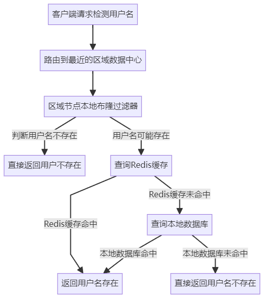
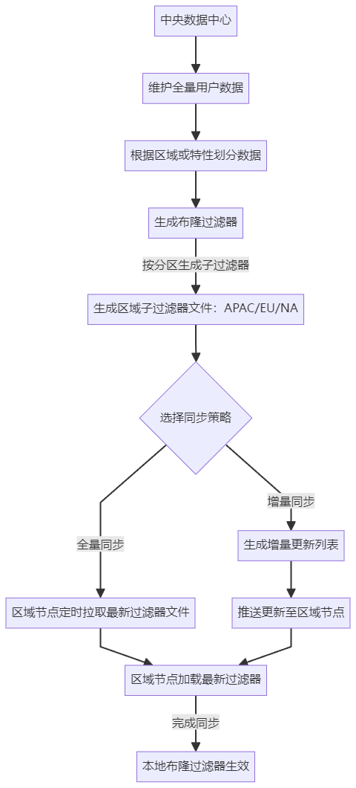

# 亿级数据如何高效校验用户名是否被占用

### 
### **<font style="color:rgba(0, 0, 0, 0.82);">任务拆解</font>**
+ **<font style="color:rgba(0, 0, 0, 0.82);">目标</font>**<font style="color:rgba(0, 0, 0, 0.82);">：判断某用户名是否存在，要求响应时间达到</font>**<font style="color:rgba(0, 0, 0, 0.82);">毫秒级</font>**<font style="color:rgba(0, 0, 0, 0.82);">。</font>
+ **<font style="color:rgba(0, 0, 0, 0.82);">面临的挑战</font>**<font style="color:rgba(0, 0, 0, 0.82);">：</font>

<font style="color:rgba(0, 0, 0, 0.82);">a.</font><font style="color:rgba(0, 0, 0, 0.82);"> </font>**<font style="color:rgba(0, 0, 0, 0.82);">用户总量庞大（亿级数量级）</font>**

    - <font style="color:rgba(0, 0, 0, 0.82);">系统需存储和查询亿级用户名，传统单机或单一数据库方案难以承载。</font>
    - <font style="color:rgba(0, 0, 0, 0.82);">数据规模庞大可能导致查询延迟增加，无法满足毫秒级响应需求。</font>

<font style="color:rgba(0, 0, 0, 0.82);">b.</font><font style="color:rgba(0, 0, 0, 0.82);"> </font>**<font style="color:rgba(0, 0, 0, 0.82);">高并发请求</font>**

    - <font style="color:rgba(0, 0, 0, 0.82);">系统需支持高峰期的高并发访问，可能达到每秒数十万甚至百万次查询请求。</font>
    - <font style="color:rgba(0, 0, 0, 0.82);">高并发场景下，单点（如数据库、缓存）可能成为性能瓶颈，导致系统崩溃。</font>

<font style="color:rgba(0, 0, 0, 0.82);">c.</font><font style="color:rgba(0, 0, 0, 0.82);"> </font>**<font style="color:rgba(0, 0, 0, 0.82);">数据库不能成为性能瓶颈</font>**

    - <font style="color:rgba(0, 0, 0, 0.82);">数据库直接查询亿级数据的性能较低，无法满足毫秒级响应需求。</font>
    - <font style="color:rgba(0, 0, 0, 0.82);">在缓存未命中或高并发情况下，数据库容易因压力过大导致延迟增加或宕机。</font>
+ **<font style="color:rgba(0, 0, 0, 0.82);">核心思路</font>**<font style="color:rgba(0, 0, 0, 0.82);">：尽可能减少对数据库的访问，优先利用缓存或高效的数据结构（如布隆过滤器）进行快速判断，结合分布式设计提升系统的可扩展性和高并发处理能力。</font>

### <font style="color:rgba(0, 0, 0, 0.82);">落地思路</font>
<font style="color:rgba(0, 0, 0, 0.82);">在亿级用户的高并发场景下，系统需要一个分而治之、多层优化的完整架构。以下为核心模块的设计：</font>

1. **<font style="color:rgba(0, 0, 0, 0.82);">区域负载均衡</font>**<font style="color:rgba(0, 0, 0, 0.82);">：</font>
    - <font style="color:rgba(0, 0, 0, 0.82);">客户端请求最先进入区域负载均衡模块。</font>
    - <font style="color:rgba(0, 0, 0, 0.82);">通过 IP 地址、地理位置等信息，将用户请求路由到距离最近的区域数据中心，降低网络延迟。</font>
    - **<font style="color:rgba(0, 0, 0, 0.82);">优点</font>**<font style="color:rgba(0, 0, 0, 0.82);">：</font>
        * <font style="color:rgba(0, 0, 0, 0.82);">分散不同区域请求的压力，减少主数据中心的负载。</font>
        * <font style="color:rgba(0, 0, 0, 0.82);">提升用户的响应速度，优先向最近地理区域发送请求。</font>
2. **<font style="color:rgba(0, 0, 0, 0.82);">网关负载均衡</font>**<font style="color:rgba(0, 0, 0, 0.82);">：</font>
    - <font style="color:rgba(0, 0, 0, 0.82);">区域的流量进入区域内网关，由网关进一步分发流量到后端服务实例。</font>
    - **<font style="color:rgba(0, 0, 0, 0.82);">网关的职责</font>**<font style="color:rgba(0, 0, 0, 0.82);">：</font>
        * <font style="color:rgba(0, 0, 0, 0.82);">流量分发：通过一致性哈希算法将请求分配到对应的服务实例，避免服务节点的过载。</font>
        * <font style="color:rgba(0, 0, 0, 0.82);">流控：在服务过载或流量洪峰时，网关可限制请求数量，保护后端服务。</font>
3. **<font style="color:rgba(0, 0, 0, 0.82);">布隆过滤器</font>**<font style="color:rgba(0, 0, 0, 0.82);">：</font>
    - <font style="color:rgba(0, 0, 0, 0.82);">在服务实例中首先使用布隆过滤器，对用户名进行快速检测，判断是否存在。</font>
    - **<font style="color:rgba(0, 0, 0, 0.82);">作用</font>**<font style="color:rgba(0, 0, 0, 0.82);">：</font>
        * <font style="color:rgba(0, 0, 0, 0.82);">布隆过滤器能够以极低的内存成本快速判断某用户名是否“可能存在”，过滤掉 99% 的“确认不存在”的请求，避免后续进入缓存和数据库。</font>
    - **<font style="color:rgba(0, 0, 0, 0.82);">布隆过滤器设置</font>**<font style="color:rgba(0, 0, 0, 0.82);">：</font>
        * <font style="color:rgba(0, 0, 0, 0.82);">初始化时，将已有注册用户名（如从分布式数据库加载）加入布隆过滤器。</font>
        * <font style="color:rgba(0, 0, 0, 0.82);">定期执行增量更新（如新增用户名定期同步到布隆过滤器）。</font>
        * <font style="color:rgba(0, 0, 0, 0.82);">容量和误报率设计（如支持 10 亿用户，误报率控制在 0.01%）。</font>
4. **<font style="color:rgba(0, 0, 0, 0.82);">Redis 缓存层</font>**<font style="color:rgba(0, 0, 0, 0.82);">：</font>
    - <font style="color:rgba(0, 0, 0, 0.82);">对布隆过滤器判断“可能存在”的用户名，进一步通过 Redis 查询。</font>
    - **<font style="color:rgba(0, 0, 0, 0.82);">职责</font>**<font style="color:rgba(0, 0, 0, 0.82);">：</font>
        * <font style="color:rgba(0, 0, 0, 0.82);">提供高性能、高并发的缓存存储，快速返回是否存在结果。</font>
        * <font style="color:rgba(0, 0, 0, 0.82);">避免频繁访问数据库，保护数据库性能。</font>
    - **<font style="color:rgba(0, 0, 0, 0.82);">优化策略</font>**<font style="color:rgba(0, 0, 0, 0.82);">：</font>
        * <font style="color:rgba(0, 0, 0, 0.82);">使用</font><font style="color:rgba(0, 0, 0, 0.82);"> </font>**<font style="color:rgba(0, 0, 0, 0.82);">分布式 Redis 集群</font>**<font style="color:rgba(0, 0, 0, 0.82);">，设计基于一致性哈希的分片策略，确保缓存的水平扩展性。</font>
        * <font style="color:rgba(0, 0, 0, 0.82);">开启 LRU 策略，针对热点用户名缓存经常访问的数据。</font>
        * <font style="color:rgba(0, 0, 0, 0.82);">实现防缓存穿透机制（将不存在的数据缓存为短期空值）。</font>
5. **<font style="color:rgba(0, 0, 0, 0.82);">分布式数据库</font>**<font style="color:rgba(0, 0, 0, 0.82);">：</font>
    - <font style="color:rgba(0, 0, 0, 0.82);">对于缓存未命中（布隆过滤器误报）的用户名，将最终确认是否存在的请求提交到数据库（只作为最终保障）。</font>
    - **<font style="color:rgba(0, 0, 0, 0.82);">设计策略</font>**<font style="color:rgba(0, 0, 0, 0.82);">：</font>
        * <font style="color:rgba(0, 0, 0, 0.82);">按用户名哈希值或首字母进行分库分表，快速定位对应的数据库分片进行查询。</font>
        * <font style="color:rgba(0, 0, 0, 0.82);">通过数据库读写分离，只读数据库实例为查询服务提供高性能支撑。</font>
6. **<font style="color:rgba(0, 0, 0, 0.82);">服务降级机制</font>**<font style="color:rgba(0, 0, 0, 0.82);">：</font>
    - <font style="color:rgba(0, 0, 0, 0.82);">在高峰期（如 Redis 或数据库负载过高时），可返回默认降级结果（如“用户名可能存在”或提示“稍后重试”），确保系统整体稳定性。</font>

### 补充
1. **<font style="color:rgba(0, 0, 0, 0.82);">区域负载均衡的实现</font>**<font style="color:rgba(0, 0, 0, 0.82);">：  
</font><font style="color:rgba(0, 0, 0, 0.82);">使用全球部署的负载均衡服务（如 Nginx、阿里云负载均衡、CDN）作为第一层。</font>
    - **<font style="color:rgba(0, 0, 0, 0.82);">路由规则</font>**<font style="color:rgba(0, 0, 0, 0.82);">：</font>
        * <font style="color:rgba(0, 0, 0, 0.82);">基于用户的地理位置（通过 IP 地址）选择最近的区域节点。</font>
        * <font style="color:rgba(0, 0, 0, 0.82);">例如，中国的用户分配到华北、华东、华南等区域，海外用户分配到欧美、东南亚等区域。</font>
2. **<font style="color:rgba(0, 0, 0, 0.82);">网关负载均衡的实现</font>**<font style="color:rgba(0, 0, 0, 0.82);">：  
</font><font style="color:rgba(0, 0, 0, 0.82);">使用</font><font style="color:rgba(0, 0, 0, 0.82);"> </font>**<font style="color:rgba(0, 0, 0, 0.82);">Spring Cloud Gateway</font>**<font style="color:rgba(0, 0, 0, 0.82);"> </font><font style="color:rgba(0, 0, 0, 0.82);">或</font><font style="color:rgba(0, 0, 0, 0.82);"> </font>**<font style="color:rgba(0, 0, 0, 0.82);">Nginx+Upstream</font>**<font style="color:rgba(0, 0, 0, 0.82);"> </font><font style="color:rgba(0, 0, 0, 0.82);">的方式实现服务网关。</font>
    - **<font style="color:rgba(0, 0, 0, 0.82);">网关职责扩展</font>**<font style="color:rgba(0, 0, 0, 0.82);">：</font>
        * <font style="color:rgba(0, 0, 0, 0.82);">第一层限流：通过 API 限额保护每个服务实例不被突发流量压垮。</font>
        * <font style="color:rgba(0, 0, 0, 0.82);">请求分发：根据用户名的哈希值或请求特征，将任务分配到不同的服务实例。</font>
        * <font style="color:rgba(0, 0, 0, 0.82);">可执行第一层布隆过滤器逻辑，避免不必要的内部流量。</font>
3. **<font style="color:rgba(0, 0, 0, 0.82);">布隆过滤器逻辑的实现</font>**<font style="color:rgba(0, 0, 0, 0.82);">：</font>
    - <font style="color:rgba(0, 0, 0, 0.82);">初始化布隆过滤器时，将所有现有用户名加载到布隆过滤器中：</font>

```java
bloomFilter = BloomFilter.create(Funnels.stringFunnel(Charsets.UTF_8), 1_000_000_000, 0.001);
```

    - <font style="color:rgba(0, 0, 0, 0.82);">用户发起请求后，布隆过滤器判断是否“可能存在”：</font>

```java
boolean mightExist = bloomFilter.mightContain(username);  
if (!mightExist) return false; // 不存在，直接返回
```

4. **<font style="color:rgba(0, 0, 0, 0.82);">Redis 缓存的实现与优化</font>**<font style="color:rgba(0, 0, 0, 0.82);">：</font>
    - <font style="color:rgba(0, 0, 0, 0.82);">如果布隆过滤器认为用户名“可能存在”，则查询 Redis：</font>

```java
String cacheResult = redisUtil.get("username:" + username);  
if (cacheResult != null) {  
    return "1".equals(cacheResult);  
}
```

    - **<font style="color:rgba(0, 0, 0, 0.82);">优化措施</font>**<font style="color:rgba(0, 0, 0, 0.82);">：</font>
        * <font style="color:rgba(0, 0, 0, 0.82);">防缓存穿透：当用户名不存在时存储空值，过期时间设置为短时（比如 5 分钟）。</font>
        * <font style="color:rgba(0, 0, 0, 0.82);">防缓存击穿（热点数据）：</font>
            + <font style="color:rgba(0, 0, 0, 0.82);">缓存失效时，通过分布式锁限制单个请求查询数据库，避免热点问题。</font>
5. **<font style="color:rgba(0, 0, 0, 0.82);">分布式数据库的实现</font>**<font style="color:rgba(0, 0, 0, 0.82);">：</font>
    - <font style="color:rgba(0, 0, 0, 0.82);">按用户名哈希值确定分片逻辑：</font>

```java
int shardId = username.hashCode() % totalShards;
```

    - <font style="color:rgba(0, 0, 0, 0.82);">每个分片作为独立的数据库实例（如 MySQL 数据分片），提供水平扩展。</font>
6. **<font style="color:rgba(0, 0, 0, 0.82);">服务降级的实现</font>**<font style="color:rgba(0, 0, 0, 0.82);">：</font>
    - <font style="color:rgba(0, 0, 0, 0.82);">在高并发或系统临界点下，通过熔断机制快速降级：</font>

```java
if (redisTimeoutException || databaseOverload) {  
    return "服务繁忙，请稍后重试";  
}
```

### 流程图
检测流程：

## 


布隆过滤器同步流程：




> 更新: 2025-04-20 19:36:16  
> 原文: <https://www.yuque.com/tulingzhouyu/db22bv/ga5283bapabmtog3>