# 全托管数据可视化平台，快速搭建运维监控大盘 - 北冥

> 针对中小型项目实现全托管数据可视化平台
>


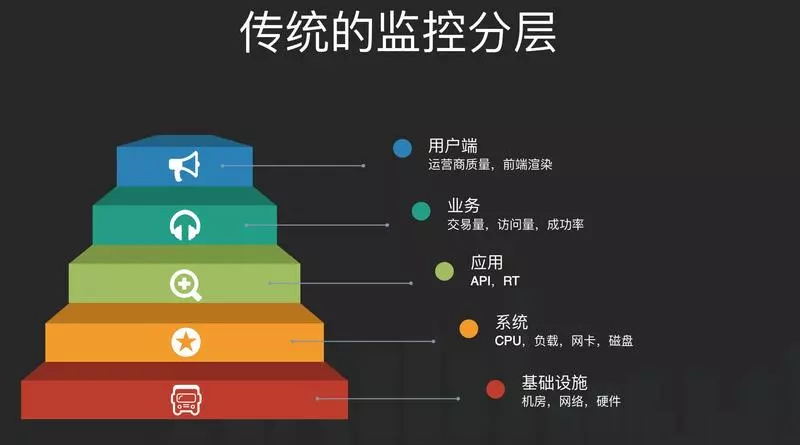


### 环境介绍


+ 数据来源：SpringBoot + Actuator
+ 数据采集：Prometheus
+ 数据展示：Grafana


### 监控维度


+ JVM
+ MySQL
+ Redis
+ 服务器信息


### 演示环境


+ Ubuntu
+ Docker


### Prometheus介绍


`Prometheus`是一个开源的系统监控和报警系统，现在已经加入到`CNCF`基金会，成为继`K8S`之后第二个在`CNCF`托管的项目，在`Kubernetes`容器管理系统中，通常会搭配`Prometheus`进行监控，同时也支持多种`exporter`采集数据，还支持`pushgateway`进行数据上报，`Prometheus`性能足够支撑上万台规模的集群。


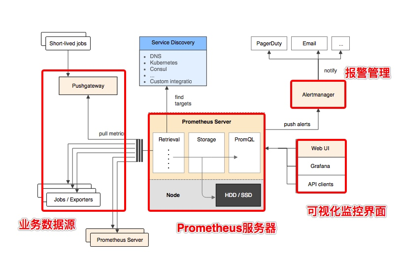


+ **Prometheus 服务器**


Prometheus Server 是 Prometheus组件中的核心部分，负责实现对监控数据的获取，存储以及查询。


+ **NodeExporter 业务数据源**


业务数据源通过 Pull/Push 两种方式推送数据到 Prometheus Server。


+ **AlertManager 报警管理器**


Prometheus 通过配置报警规则，如果符合报警规则，那么就将报警推送到 AlertManager，由其进行报警处理。


+ **可视化监控界面**


Prometheus 收集到数据之后，由 WebUI 界面进行可视化图标展示。目前我们可以通过自定义的 API 客户端进行调用数据展示，也可以直接使用 Grafana 解决方案来展示。


简单地说，Prometheus 的实现架构也并不复杂。**其实就是收集数据、处理数据、可视化展示，再进行数据分析进行报警处理**。 但其珍贵之处在于提供了一整套可行的解决方案，并且形成了一整个生态，能够极大地降低我们的研发成本。


### Grafana


Grafana 是一款用 GO 语言开发的开源数据可视化工具，可以做数据监控和数据统计，带有告警功能。


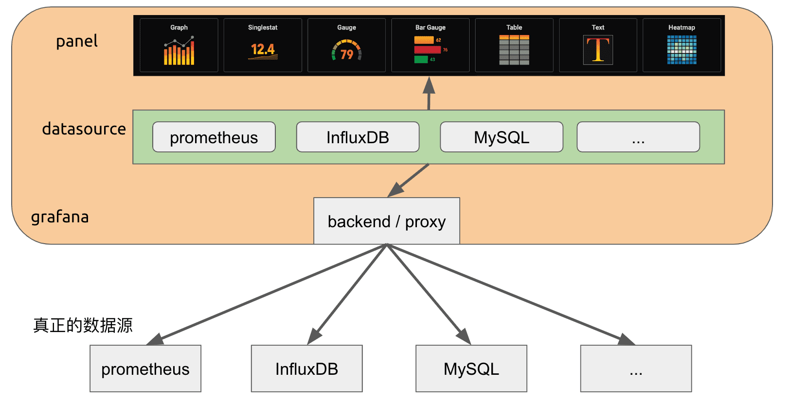


**特点：**


+ **可视化**  
Grafana 拥有快速灵活的客户端图表，面板插件有许多不同方式的可视化指标和日志，官方库中具有丰富的仪表盘插件，比如热图、折线图、图表等多种展示方式，让我们复杂的数据展示的美观而优雅。
+ **报警和通知**  
可视化地为最重要的指标定义警报规则。Grafana 将持续评估它们，并发送通知。
+ **动态仪表盘**  
使用模板变量创建动态和可重用的仪表板，这些模板变量作为下拉菜单出现在仪表板顶部。
+ **混合数据源**  
在同一个图中混合不同的数据源!可以根据每个查询指定数据源。这甚至适用于自定义数据源。
+ **注释**  
注释来自不同数据源图表。将鼠标悬停在事件上可以显示完整的事件元数据和标记。
+ **过滤器**  
Grafana 使用 Ad-hoc 过滤器允许动态创建新的键/值过滤器，这些过滤器会自动应用于使用该数据源的所有查询。


### 搭建篇-SpringBoot配置


> 怎么创建一个SpringBoot项目相比都知道我就不赘述了。
>


+ POM配置


```xml
<?xml version="1.0" encoding="UTF-8"?>
<project xmlns="http://maven.apache.org/POM/4.0.0" xmlns:xsi="http://www.w3.org/2001/XMLSchema-instance"
         xsi:schemaLocation="http://maven.apache.org/POM/4.0.0 https://maven.apache.org/xsd/maven-4.0.0.xsd">
    <modelVersion>4.0.0</modelVersion>

    <parent>
        <groupId>org.springframework.boot</groupId>
        <artifactId>spring-boot-starter-parent</artifactId>
        <version>3.0.2</version>
        <relativePath/> <!-- lookup parent from repository -->
    </parent>

    <groupId>org.beiming.talk</groupId>
    <artifactId>beiming-talk-backend</artifactId>

    <properties>
        <java.version>17</java.version>
    </properties>

    <dependencies>

        <dependency>
            <groupId>org.springframework.boot</groupId>
            <artifactId>spring-boot-starter-web</artifactId>
        </dependency>

        <dependency>
            <groupId>org.springframework.boot</groupId>
            <artifactId>spring-boot-starter-actuator</artifactId>
        </dependency>

        <!-- https://mvnrepository.com/artifact/io.micrometer/micrometer-registry-prometheus -->
        <dependency>
            <groupId>io.micrometer</groupId>
            <artifactId>micrometer-registry-prometheus</artifactId>
            <version>1.10.4</version>
        </dependency>

    </dependencies>

    <build>
        <plugins>
            <plugin>
                <groupId>org.springframework.boot</groupId>
                <artifactId>spring-boot-maven-plugin</artifactId>
            </plugin>
        </plugins>
    </build>

</project>
```


+ 配置信息配置


```yaml
server:
  port: 8080
spring:
  application:
    name: beiming-talk
management:
  endpoints:
    web:
      exposure:
        include: '*'
  metrics:
    tags:
      application: ${spring.application.name}
```


+ 注入实例


```java
@Bean
public MeterRegistryCustomizer<MeterRegistry> configurer(@Value("${spring.application.name}") String applicationName) {
        return (registry) -> registry.config().commonTags("application", applicationName);
 }
```


+ 检查是否OK


```plain
http://你的IP:你的端口/actuator/prometheus
```


+ 效果演示


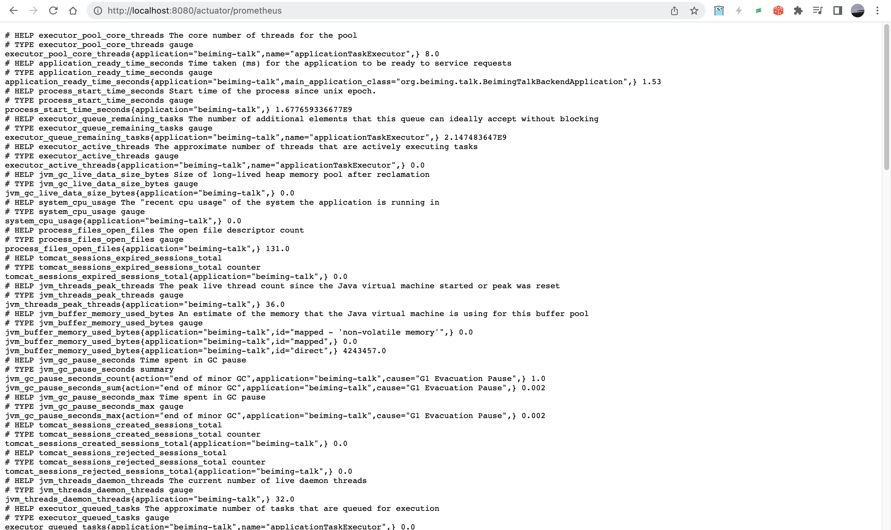


### Prometheus安装


> 重点：全Docker环境演示，通过Docker-Compose安装，后面不再提及！！！
>


+ 在/etc/prometheus/目录下创建`prometheus.yml`文件


```yaml
#vim /etc/prometheus/prometheus.yml

# my global config
global:
  scrape_interval: 15s # Set the scrape interval to every 15 seconds. Default is every 1 minute.
  evaluation_interval: 15s # Evaluate rules every 15 seconds. The default is every 1 minute.
  # scrape_timeout is set to the global default (10s).

# Alertmanager configuration
alerting:
  alertmanagers:
    - static_configs:
        - targets:
          # - alertmanager:9093

# Load rules once and periodically evaluate them according to the global 'evaluation_interval'.
rule_files:
  # - "first_rules.yml"
  # - "second_rules.yml"

# A scrape configuration containing exactly one endpoint to scrape:
# Here it's Prometheus itself.
scrape_configs:
  # The job name is added as a label `job=<job_name>` to any timeseries scraped from this config.
  - job_name: "prometheus"

    # metrics_path defaults to '/metrics'
    # scheme defaults to 'http'.

    static_configs:
      - targets: ["172.17.0.1:3001"]
  #SpringBoot应用配置
  - job_name: 'application_example'
    scrape_interval: 5s
    metrics_path: '/actuator/prometheus'
    static_configs:
      - targets: ['172.17.0.1:8080']
```


+ 配置信息:


```yaml
version: "3.7"
services:
  prometheus:
    image: prom/prometheus:latest
    restart: always
    user: root
    ports:
      - "9090:9090"
    volumes:
      - "/etc/prometheus/prometheus.yml:/etc/prometheus/prometheus.yml"
      - "./prometheus_data:/prometheus"
    command:
      - "--config.file=/etc/prometheus/prometheus.yml"
      - "--storage.tsdb.path=/prometheus"
      - "--web.console.libraries=/etc/prometheus/console_libraries"
      - "--web.console.templates=/etc/prometheus/consoles"
```


+ 访问 

访问地址：http://localhost:9090/

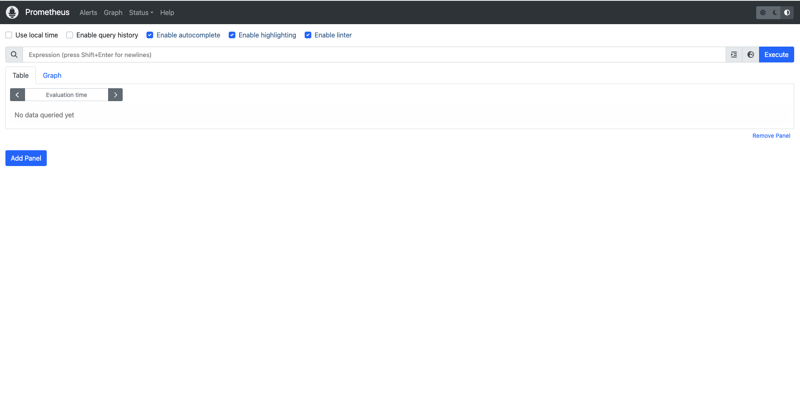


### Grafana安装


> 默认用户名为admin
>


+ 安装


```yaml
version: '3'

services:
  grafana:
    image: grafana/grafana:latest
    container_name: grafana
    ports:
      - "3000:3000"
    volumes:
      - grafana_data:/var/lib/grafana
    environment:
      - GF_SERVER_ROOT_URL=http://localhost:3000
      - GF_SECURITY_ADMIN_PASSWORD=自己定密码
      - GF_INSTALL_PLUGINS=grafana-piechart-panel,grafana-worldmap-panel,redis-datasource
volumes:
  grafana_data:
```


+ 访问


+ 数据源配置


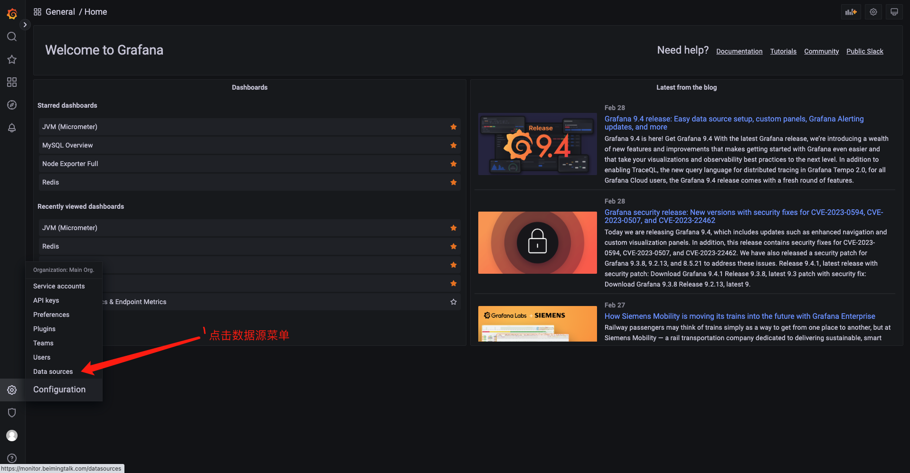


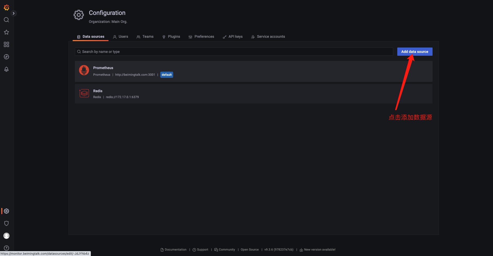


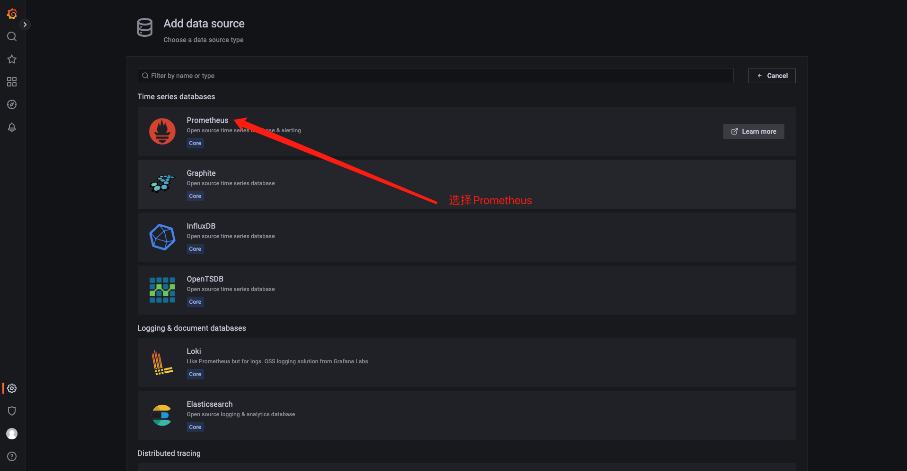


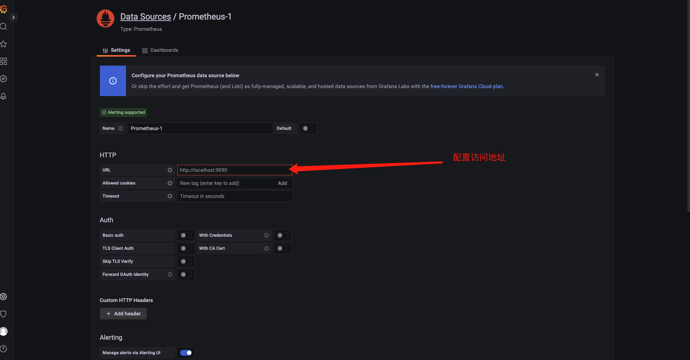


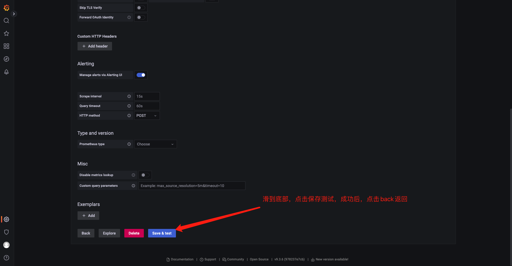


+ 打开grafana官方地址：[https://grafana.com/grafana/dashboards/](https://grafana.com/grafana/dashboards/)


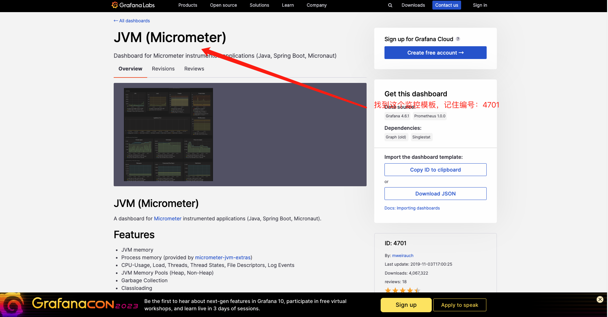


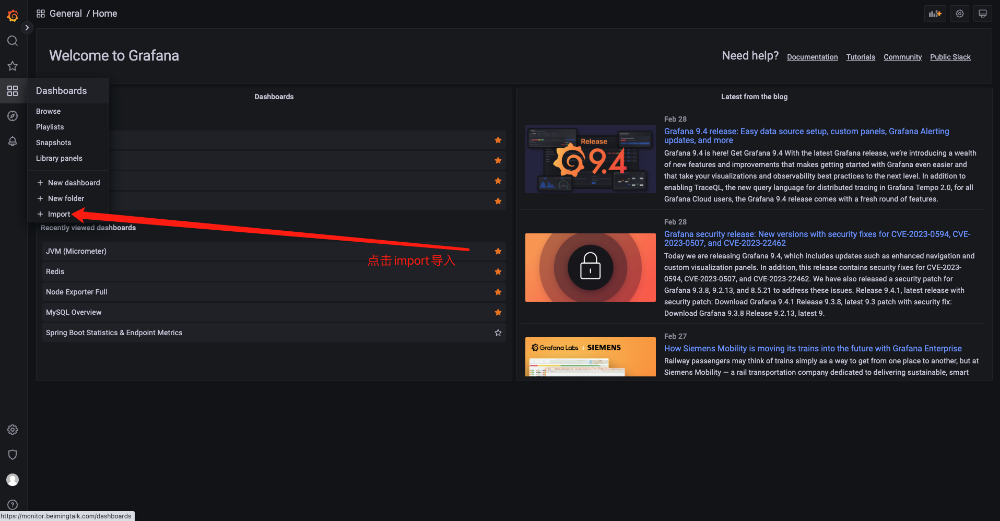


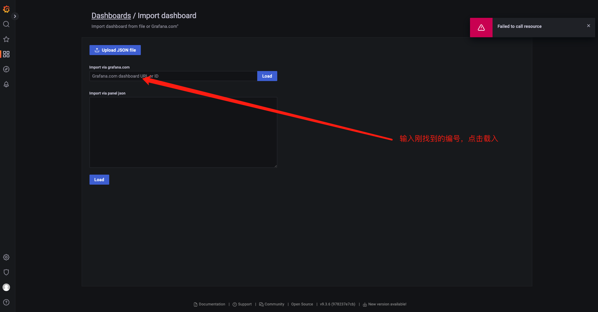


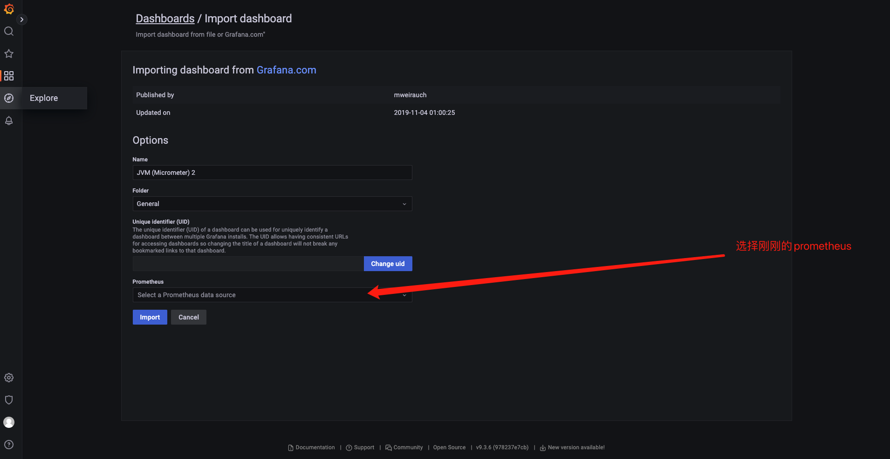


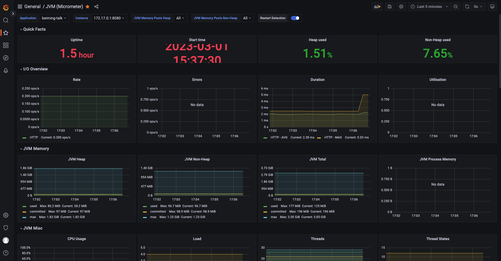


### MySQL监控


```yaml
  mysqld-exporter:
    image: prom/mysqld-exporter
    ports:
      - "9104:9104"
    environment:
      - DATA_SOURCE_NAME=账号:密码@(你的IP:3306)/数据库名称
```


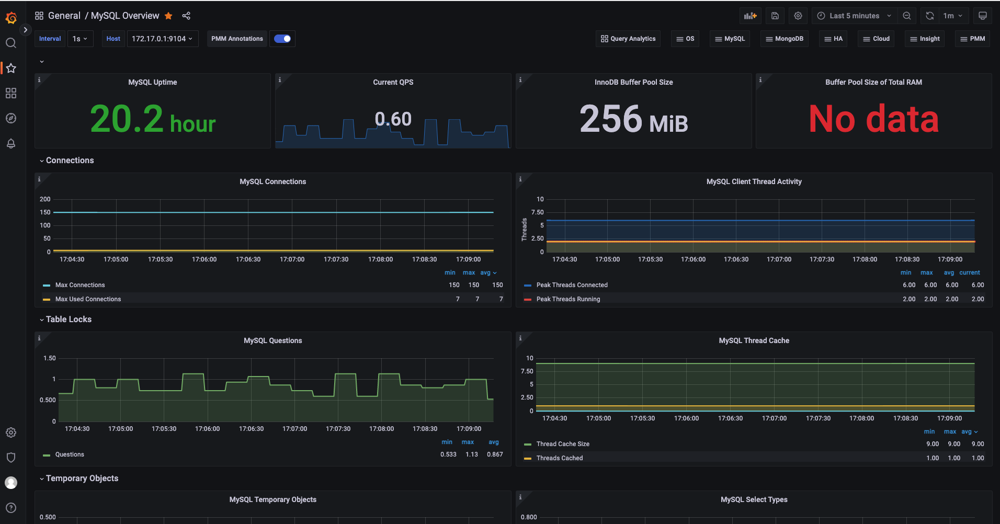


### 机器监控


```yaml
  node-exporter:
     image: quay.io/prometheus/node-exporter
     container_name: node-exporter
     restart: always
     ports:
      - "9100:9100"
```


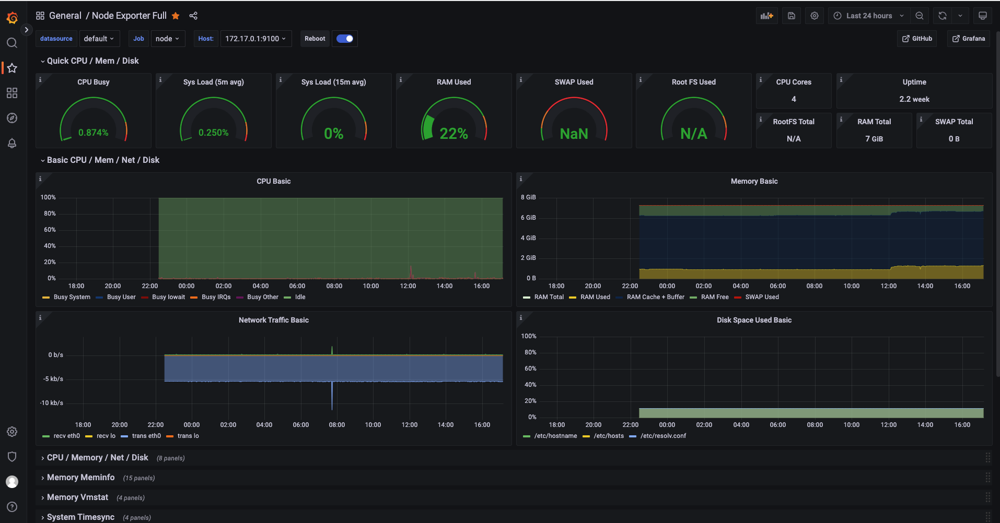


### Redis监控，不用配置探针


> 直接面板可以监控
>


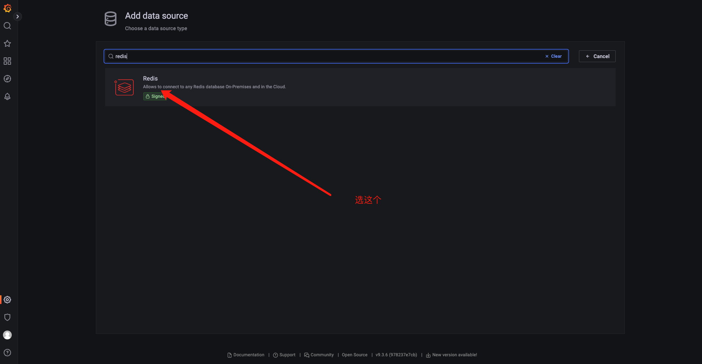


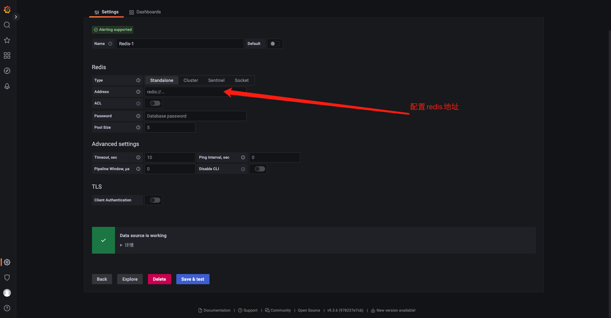


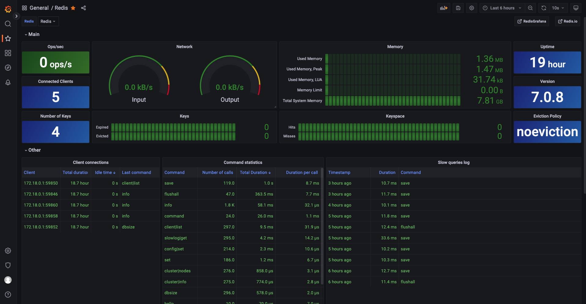


> 更新: 2023-09-07 19:53:52  
> 原文: <https://www.yuque.com/tulingzhouyu/db22bv/slqukz1g48gkng2q>