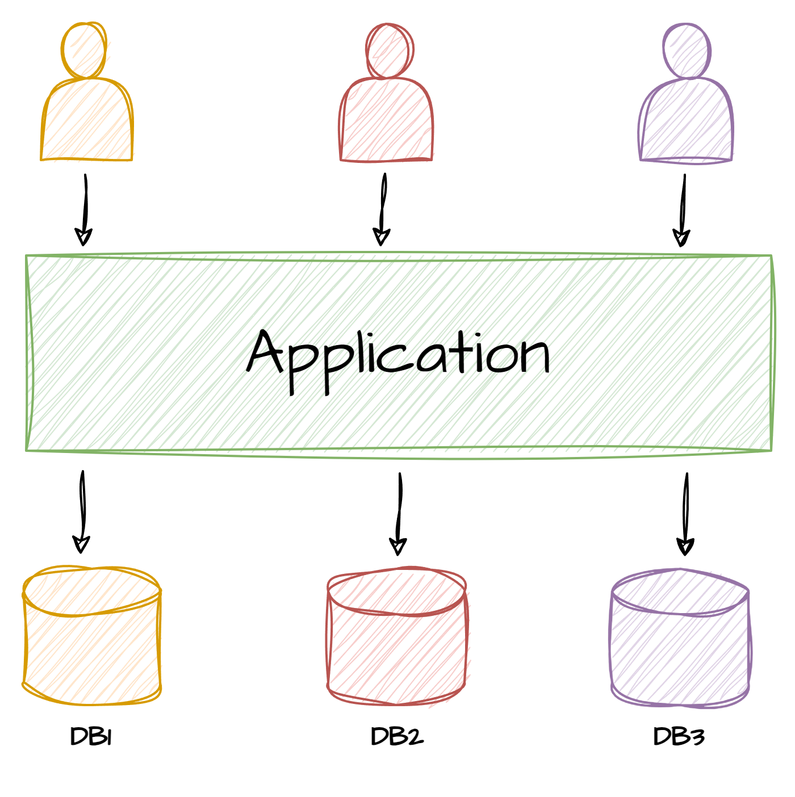
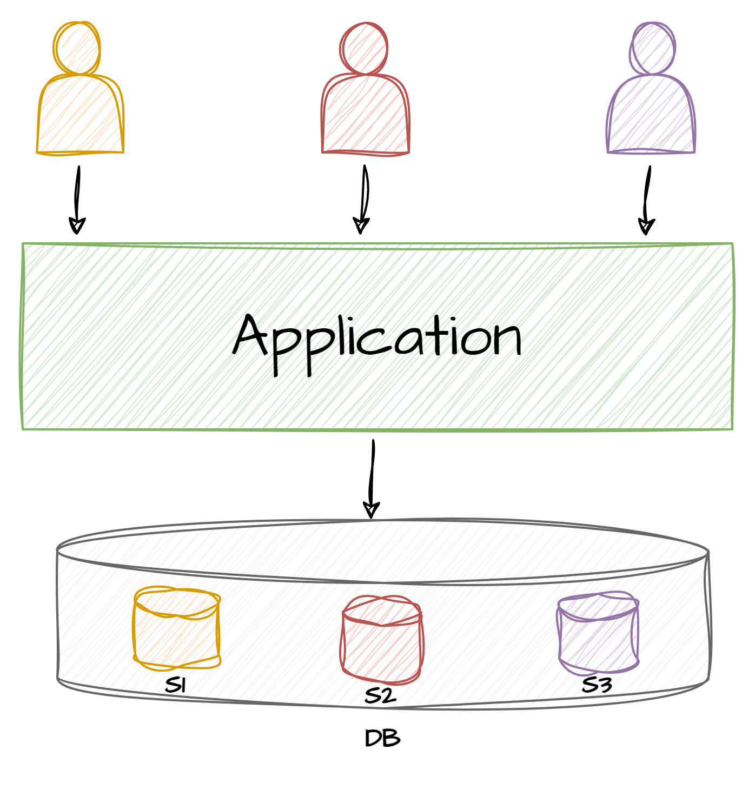
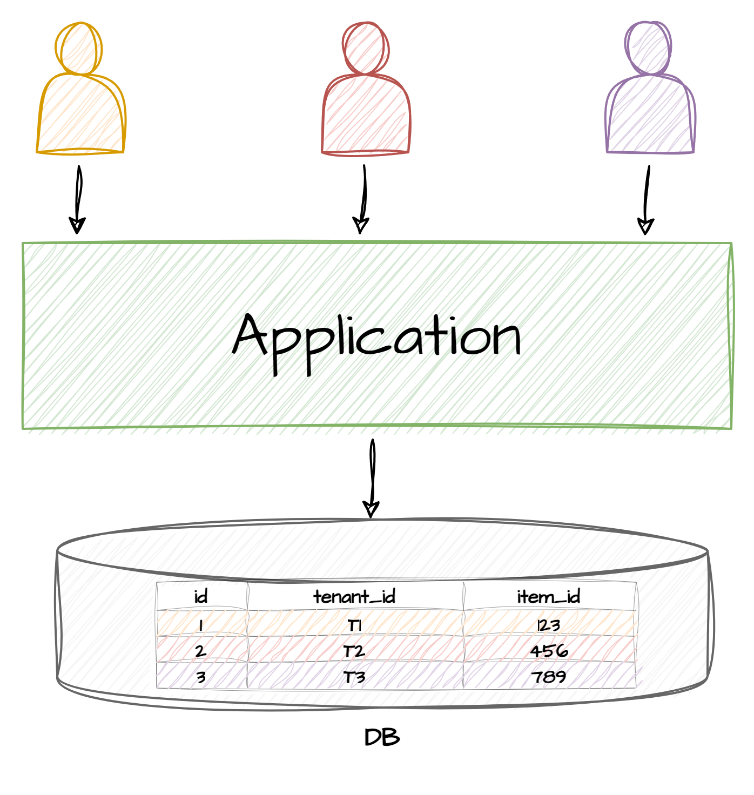
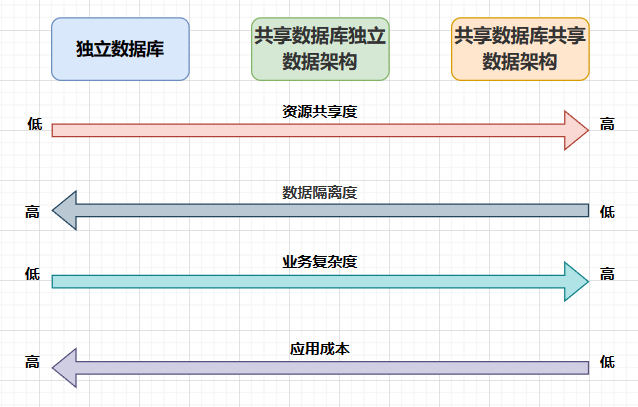
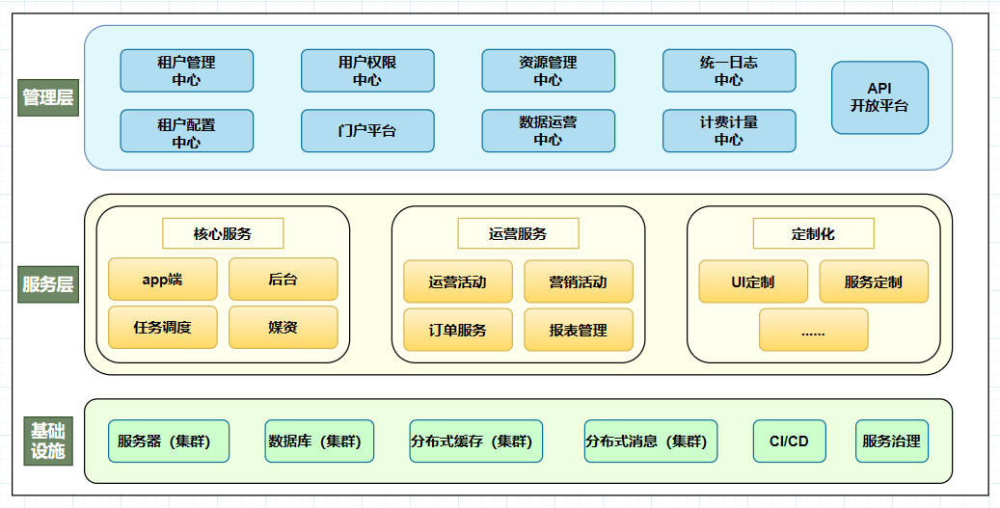
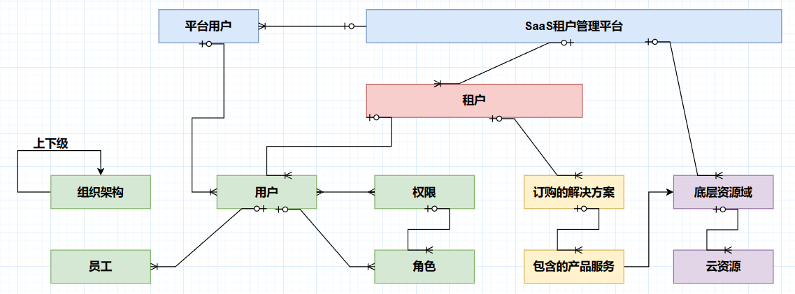

# 多租户技术架构

### 一、多租户的概念
**多租户本质上是一种软件的技术架构，**它最核心的特征是**多个租户可以共享一个系统实例，**并且租户间是可以**实现数据和行为的隔离**，这可以说是多租户技术架构里最重要的两点了。

多租户架构是 SaaS 模式中的重要且常见的架构，通过共享和复用资源降低成本，提高效率和可扩展性。其中最需要关注就是：**数据/行为的隔离、身份/角色的认证与授权、底层硬件资源管理、高性能与高可用、定制化和可扩展、数据一致性、系统安全性等。**

这里就不过多赘述了，下面会将概念详细铺开。如果要找一个生活中容易理解的场景做比喻，那么多租户的概念其实就和租房子的概念类似，只不过在各自的专业领域所涉及到的术语和具体实现会不一样。

---

### 二、隔离模式
一般来说多租户常见的有3种隔离模式：**独立数据库**、**共享数据但独立数据架构**、**共享数据库且共享数据架构**。

#### 2.1独立数据库模式

**2.1.1特征**

**一个租户一个数据库，隔离级别最高，对系统底层所涉及到的计算、存储、网络等资源的隔离。**

和传统软件模式（SaaS）的区别：

**独立数据库模式有标准的租户身份识别、租户入驻流程、计费体系、运营流程等。**除此之外，本质上其提供的服务还是端到端的 SaaS 模式，某种意义上可以看作每一个租户都各自拥有一套端到端的基础设施。

**2.1.2优点**

+ 满足**强隔离**需求：一些租户为了保证系统和数据的安全性，可能会提出非常严格的隔离要求，期望软件产品能够部署在一套完全独立的环境中，不和其它租户的实例、数据放在一起；
+ **计费逻辑简单：**在这种独立数据库模式模式下，计费模型相对是比较简单的；
+ 降低故障影响：因为每个租户的系统都部署在独立的环境中，如果一个环境出现故障，并不会影响其他租户的软件服务。

**2.1.3缺点**

+ **规模化**问题：由于租户是各自独立的环境，每入驻一个租户就需要准备、创建、运营一套 SaaS 环境，如果只有少量租户还可以管理，一旦租户的数量多起来，管理和运营这些环境将会是非常大的挑战；
+ **成本问题：**每个租户都需要单独的部署环境，那么花费在每个租户上的成本就会非常高，会大幅度降低 SaaS 软件服务的盈利能力；
+ **敏捷迭代问题：**一般来说 SaaS 模式的优势是可以很快响应市场变化，可以迅速迭代产品功能，但是在这种独立数据库模式模式下更管理、运维这些租户的 SaaS 环境会变得非常复杂且低效；
+ **基础设施的监控：**同样地，在这种非中心化的模式下，对每个租户的基础设施的运维与监控也是非常复杂且繁琐的。

#### 2.2共享数据库独立数据架构

**2.2.1**

**多个租户或者所有租户共享数据库，每个租户会拥有一个 schema 形成逻辑上的隔离，而并不是物理上的隔离（还在一个实例内）。**即多个租户共享一套基础设施，降低 Saas 软件服务的资源成本。

简单介绍下 schema：

**schema 就是数据对象的集合，这个集合包含了各种对象如：表、视图、存储过程和索引等。**如果把数据库看作是一个仓库，那么schema就是一个个的房间，表就是 一个个的柜子。user 是 schema 的 administrator，有操控每个 schema 的权限。

**但需要说明的是，MySQL 数据库中没有 schema 这个概念，但是一个 MySQL 实例可以有多个数据库。**

**2.2.2优点**

+ **高效管理：**在上述共享策略下，所有的租户都可以集中管理，同时监控基础设施将更容易，且产品的迭代可以更快；
+ **低成本：**相对于独立数据库模式模式的独立数据库，共享数据库的成本更低，还可以方便地根据用户的使用需求动态地扩展系统；
+ **隔离性较好：**虽然同在一个实例内，但是做了逻辑区分，租户使用的库不一样，隔离效果还是比较好的。

**2.2.3缺点**

+ **租户相互影响**：由于所有租户共享同一资源，**当一个租户占用大量机器时会消耗很多资源，其它租户的使用很可能会受到影响**。在这种情况下，对整个系统架构的可用性和扩展性的要求就比较高了，同时可能也考虑适当地**设计限流、降级和熔断等措施**来应对；
+ **运维工作量大：**每增加一个租户，都需要为其需要创建新的业务数据库来进行管理，还可能需要与开发人员共同维护这些数据库；
+ **租户计费困难：**所有租户共享资源，使得计费可能更加困难，但在研发资源较为充足的时候也不是很大的问题。

#### 2.3共享数据库共享数据架构

**2.3.1特征**

所有租户共享一个数据库实例，共享同一个数据库，只不过**在每张表都加上租户标识字段**用以区分。

**2.3.2优点**

+ **资源成本低：**一个实例的一个数据库就可以搞定所有租户的数据，**支持的租户数量理论上可以很多**；
+ **便于迭代：**在开发的时候只需要额外关注租户标识字段就好，**产品迭代维护起来也能很方便；**

**2.3.3缺点**

+ **隔离性差：**所有租户的数据都放在一起，一旦业务层没有做好对租户标识的区分，**很容易造成租户的数据混乱；**
+ **性能瓶颈：**随着租户数据量的成倍增加，**单表的性能一定会逐步下降，**且性能优化会受限于基础资源的不足；
+ **扩展性差：****一旦业务变得复杂，业务之间的耦合也会变紧，**可能会引起分布式事务、数据不一致性等一系列的系统问题。

---

### 三、隔离方案选型
关于怎么对上述提到的 3 种隔离模式的选型，从以下 4 个维度来做比较：

1. **资源共享度：**即多个租户之间的对基础设置的共享程度如何，是独立数据库模式还是schema还是共用数据库？
2. **数据隔离度：**当租户对于业务数据的隔离要求比较高时可以选择独立数据库模式，成本比较紧张或者在初始阶段可以考虑共享数据库；
3. **业务复杂度：**有些核心业务是比较复杂的，对整体的服务和底层资源的考验都比较大，其它业务可以适当做一些简化；
4. **应用成本：**既然选用多租户技术框架，那么说明用户肯定是达到了一定的量级，运营、维护、硬件等的综合成本一定要考虑。

---

### 四、架构模型
#### 4.1模型分层
在这里笔者分为了3个层次：管理层、服务层、基础设施，如多租户架构图示（一）所示，下面展开讲一下这样分层的原因。

+ **管理层**

这一层有点类似于阿里云的控制台，阿里云自己内部可以监控每个租户的大致情况，租户自己可以监控到自己付费的资源情况。

    1. **对于开发者而言，这一层主要就是对租户的管理：**即租户购买了哪些服务、租户之间的隔离、对租户的计费等。就像房东对一栋楼每个房间租户的管理：几层几号房租给了谁、要租多久、租金包含什么等，房东只管出租和维护房子，不会管里面租户的日常生活。
    2. **对于租户而言，就是对花钱租的服务进行管理：**即具体购买了哪些系统、哪些资源、怎么角色授权等。比如租户租了个一室一厅一卫，客厅怎么布置、厨房要不要做饭、卫生间的垃圾几天丢一次，这些东西房东基本不会干涉的。
+ **服务层**

这一层就是具体提供的系统服务了，这些服务是由开发者开发的，一般情况下所有租户都是共享一套代码和系统的，特殊定制化的服务除外。

    1. 对于开发者而言，普通传统 SaaS 开发模式下，对每一个客户都得定制开发一套系统，虽然定制化的内容可能大同小异，不会有本质上的区别，但受到数据隔离、底层资源和角色授权等方面的限制，只能单独为每个客户部署一套服务和一套资源。

**一旦客户的数量多起来，劣势是非常明显的：开发成本和部署的成本都太高了，且可复用程度低。**

多租户模式下，如果有一套优秀的、成熟的多租户技术架构，那么无论对于开发者还是租户，都是省时省力省钱且高效的。像阿里云提供的 CDN 内容分发、OSS 对象存储、RDS 云数据库、SLB 负载均衡等可供租户购买的服务，都是经过市场打磨的优秀产品。

    2. 对于租户而言，这层就是购买的具体服务了，这些购买的服务一般会作为底座，用于支撑租户的业务发展。**举个例子：A 公司花 10 万元买了阿里云的一些产品服务来支撑自己公司的业务，A 公司将这些业务投入市场后，销售价格可以为 15 万元，而可能阿里云为一个租户提供产品服务的实际成本仅为 5 万元。**
+ **基础设施**

**这一层有点类似于 IaaS 基础设施即服务的概念。**我们知道，无论什么软件服务都要基于 CPU、内存、磁盘、路由器、交换器等一系列的硬件设施。

    1. 对于开发者而言，基础设施要么自建要么采购。就目前来说，市场上只有少数几个厂家拥有成熟的硬件设施解决方案，所以软件服务的开发者一般以采购为主；
    2. 对于租户而言，对基础设施是无感的：租户不必关心具体的底层硬件结构，只需要关注服务层的告警，如有告警可以提出紧急工单对接开发者。

#### 4.2模型关系
这个模型里我理解可以分为 4 种体系：SaaS平台体系、权限角色体系、业务体系与云资源体系。如多租户架构图示（二）所示，每种体系之间都有各自的关联关系。为方便大家理解，每种关系我都展开讲讲。

+ **SaaS平台与租户的关系：**这个平台里面有多个租户，一般的话采用共享数据库独立数据架构的模式，容纳几十个租户应该问题不大。
+ **租户与组织用户的关系：**租户一般指的是企业或者组织，通常会有一些员工担任管理员的角色来管理购买的 SaaS 服务。
+ **用户与权限角色的关系：**面对众多的 SaaS 服务系统，一般只会选择性地给用户授予某些权限，比如管理员、超级管理员等。
+ **租户与业务的关系：**一般来说这里的业务指的是租户自己的业务，租户需要依赖购买的 SaaS 服务来支撑这些业务。
+ **业务与底层资源的关系：**底层资源一般指的是服务器等硬件资源，但是业务通常不关心底层资源。
+ **租户与底层资源的关系：**租户需要在购买的时候知道底层硬件的配置，其运维和告警等由 SaaS 管理平台的开发者负责。

> 更新: 2024-10-09 15:55:52  
> 原文: <https://www.yuque.com/tulingzhouyu/db22bv/mtggz9h1ebao5b5z>