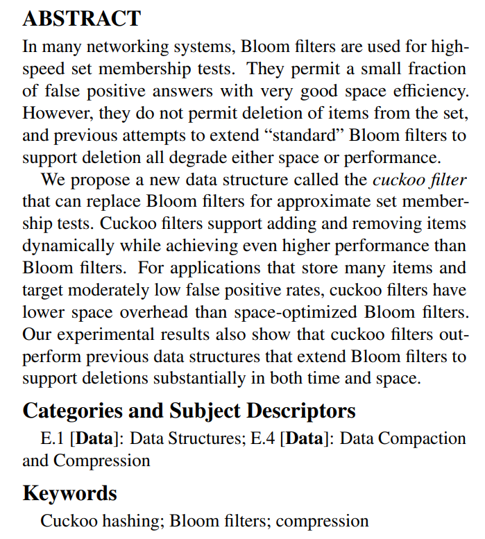
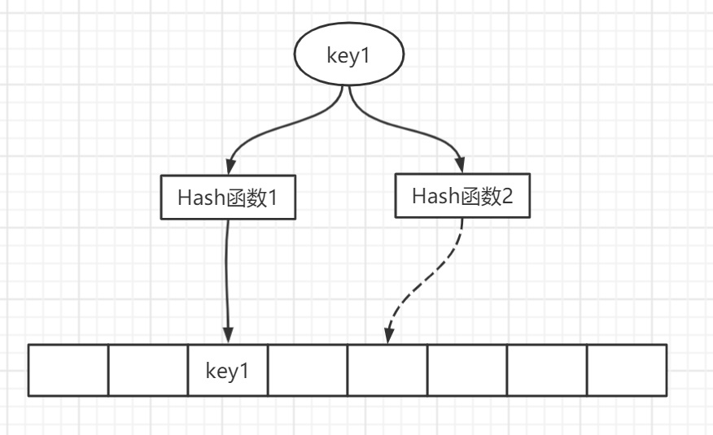
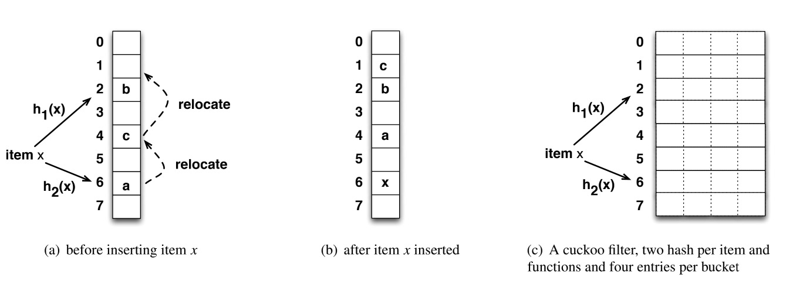
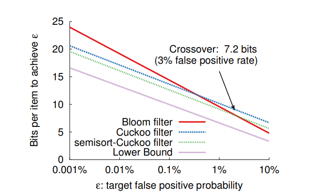
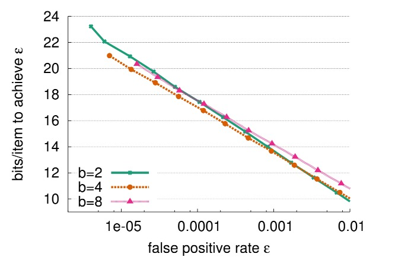

# 布谷鸟过滤器（Cuckoo Filter)

## 1 概述
在允许一定误判率的大数据量下的查找是否存在问题上可以使用布隆过滤器，详情上篇文章。布隆过滤器在工程应用方面已经比较成熟了，上一篇文章中，谈到了布隆过滤器的一些缺点，比如不支持删除操作、查询效率弱，因为多个随机哈希函数探测的是bit数组中多个不同的点，所以会导致低CPU缓存命中率。

针对此2014年的一篇文章[《Cuckoo Filter：Better Than Bloom》](https://www.cs.cmu.edu/~dga/papers/cuckoo-conext2014.pdf)基于**布谷鸟哈希算法**提出了**布谷鸟过滤器**，不过看文章的名字有点碰瓷的感觉了，这篇文章解决了布隆过滤器存在的问题。

布谷鸟过滤器用更低的空间开销解决了布隆过滤器不能删除元素的问题，做到了更好的效果，具体的

> 1. It supports adding and removing items dynamically;
> 2. It provides higher lookup performance than traditional Bloom filters, even when close to full (e.g., 95% space utilized);
> 3. It is easier to implement than alternatives such as the quotient filter;
> 4. It uses less space than Bloom filters in many practical applications, if the target false positive rate  is less than 3%
>

+ 支持动态的添加和删除元素
+ 提供了比传统布隆过滤器更高的查找性能，即使在接近满的情况下（比如空间利用率达到 95% 的时候）
+ 比起商过滤器它更容易实现
+ 如果要求误判率低于3%，它比布隆过滤器有更低的空间开销

## 2 布谷鸟哈希
布谷鸟哈希是2001 年由Rasmus Pagh 和Flemming Friche Rodler 提出。本质上来说它为解决哈希冲突提供了另一种策略，利用较少计算换取了较大空间。它具有占用空间小、查询迅速等特性。名称源于采取了一种和布谷鸟一样的养娃方法

> 布谷鸟交配后，雌性**布谷鸟**就准备产蛋了，但它却不会自己筑巢。它会来到像知更**鸟**、刺嘴莺等那些比它小的**鸟**类的巢中，移走原来的那窝蛋中的一个，用自己的蛋来取而代之。相对于它的体形来说，它的蛋是偏小的，而且蛋上的斑纹同它混入的其他**鸟**的蛋也非常相似，所以不易被分辨出来。如果不是这样，它的蛋肯定会被扔出去。
>

是一种鸠占鹊巢的策略，最原始的布谷鸟哈希方法是使用两个哈希函数对一个`key`进行哈希，得到桶中的两个位置，此时

+ 如果两个位置都为为空则将`key`随机存入其中一个位置
+ 如果只有一个位置为空则存入为空的位置
+ 如果都不为空，则随机踢出一个元素，踢出的元素再重新计算哈希找到相应的位置

当然假如存在绝对的空间不足，那老是踢出也不是办法，所以一般会设置一个**踢出阈值**，如果在某次插入行为过程中连续踢出超过阈值，则进行扩容。

## 3 布谷鸟过滤器

上图（a）(b)展示了一个基本的布谷鸟哈希表的插入操作，是由一个桶数组组成，每个插入项都有由散列函数h1(x)和h2(x)确定的两个候选桶，具体操作上文中已经描述，此处不再赘述。

而基本的布谷鸟过滤器也是由两个或者多个哈希函数构成，布谷鸟过滤器的布谷鸟哈希表的基本单位称为**条目（entry）**。 每个条目存储一个**指纹（fingerprint）**，指纹指的是使用一个哈希函数生成的n位比特位，n的具体大小由所能接受的误判率来设置，论文中的例子使用的是8bits的指纹大小。

哈希表由一个桶数组组成，其中一个桶可以有多个条目（比如上述图c中有四个条目）。而每个桶中有四个指纹位置，意味着一次哈希计算后布谷鸟有四个“巢“可用，而且四个巢是连续位置，可以更好的利用cpu高速缓存。也就是说每个桶的大小是4*8bits。

### 3.1 插入
布谷鸟过滤器的插入是重点，与朴素的布谷鸟哈希不同，布谷鸟过滤器采取了两个并不独立的哈希函数，具体的

i1=hash(x)

i2=i1⊕hash(f)

i1i2即计算出来两个桶的索引，其中第一个桶的索引是通过某个哈希函数计算出来，第二个是使用第一个索引和**指纹的哈希**做了一个异或操作，进行异或操作的好处是，因为异或操作的特性：同为0不同为1，且0和任何数异或是这个数的本身。那么i1也可以通过i2和指纹异或来计算。 换句话说，在桶中迁走一个键，我们直接用当前桶的索引i和存储在桶中的指纹计算它的备用桶。

具体的指纹是通过哈希函数取一定量的比特位

f=fingerprint(x)

**为什么不直接用索引1和指纹做异或操作**，关于这个问题文中给了解释，因为指纹一般只是key映射出来的少量bit位置，那么假如不进行哈希操作，当指纹的比特位与整个桶数组相比很小时，那么备用位置使用“i⊕指纹”，将被放置到离桶i1很近的位置，比如使用八位的指纹大小，最多只能改变i1的低八位，所以也就是两个候选通的位置最多相差256，不利于均匀分配。

### 3.2 查找
布谷鸟过滤器的查找过程很简单，给定一个项x，算法首先根据上述插入公式，计算x的指纹和两个候选桶。然后读取这两个桶：如果两个桶中的任何现有指纹匹配，则布谷鸟过滤器返回true，否则过滤器返回false。此时，只要不发生桶溢出，就可以确保没有假阴性。

### 3.3 删除
标准布隆过滤器不能删除，因此删除单个项需要重建整个过滤器，而计数布隆过滤器需要更多的空间。布谷鸟过滤器就像计数布隆过滤器，可以通过从哈希表删除相应的指纹删除插入的项，其他具有类似删除过程的过滤器比布谷鸟过滤器更复杂。

具体删除的过程也很简单，检查给定项的两个候选桶；如果任何桶中的指纹匹配，则从该桶中删除匹配指纹的一份副本。

## 4 布谷鸟过滤器不足以及性能、参数分析
### 4.1 缺点
+ **删除不完美，存在误删的概率。**删除的时候只是删除了一份指纹副本，并不能确定此指纹副本是要删除的key的指纹。同时这个问题也导致了假阳性的情况。
+ **插入复杂度比较高。**随着插入元素的增多，复杂度会越来越高，因为存在桶满，踢出的操作，所以需要重新计算，但综合来讲复杂度还是常数级别。
+ **存储空间的大小必须为2的指数**的限制让空间效率打了折扣。
+ **同一个元素最多插入kb次**，（k指哈希函数的个数，b指的桶中能装指纹的个数也可以说是桶的尺寸大小）如果布谷鸟过滤器支持删除，则必须存储同一项的多个副本。 插入同一项kb+1次将导致插入失败。 这类似于计数布隆过滤器，其中重复插入会导致计数器溢出。

### 4.2 不同过滤器比较

上图是布谷鸟过滤器其他过滤器比较，假阳性率与每个元素的空间成本。对于低假阳性率（低于3%），布谷鸟过滤器比空间优化的布隆过滤器每个元素需要更少的存储空间。

布谷鸟过滤器有一个负载阈值。 在达到最大可行负载因子后，插入不再稳定，并且越来越有可能失败，因此哈希表必须扩容才能存储更多的项。 而对于布隆过滤器来说可以继续将新项，不过是以增加假阳性率为代价。 为了保持相同的目标假阳性率，布隆过滤器也必须扩容。

### 4.3 桶的尺寸
桶的尺寸是指每个桶能放的指纹个数，保持布谷鸟过滤器的总大小（桶数组）不变，但改变桶的大小（上述例子使用的是大小为4）会导致两个后果：

**(1)****较大的桶可以提高表的利用率**(即b越大假阳性率越大) ，使用k=2个哈希函数时，当桶大小b=1（即直接映射哈希表）时，负载因子α为50%，但使用桶大小b=2、4或8时则分别会增加到84%、95%和98%。

**(2)****较大的桶需要较长的指纹才能保持相同的假阳性率**(即b越大f越大)。 使用较大的桶时，每次查找都会检查更多的条目，从而有更大的概率产生指纹冲突。

所以要基于以上寻找一个最合适的桶大小

上图是，在不同的不同桶大小下（b=2，4，8），每个项的均摊空间成本与测量的假阳性率。文章的作者对此作了实验，基于上述的结果，空间最优桶大小取决于目标假阳性率ϵ：当ϵ>0.002时，每桶有两个条目比每桶使用四个条目产生的结果略好，当ϵ减小到0.00001<ϵ≤0.002时，桶的大小选取4可以最小化空间。

另外在大多数应用情况下，选择两个哈希函数，桶的大小选择4，能够达到最佳或接近最佳的空间效率的假阳性率。

> 更新: 2024-10-31 10:27:08  
> 原文: <https://www.yuque.com/tulingzhouyu/db22bv/kxb1pes1rv2mltqe>