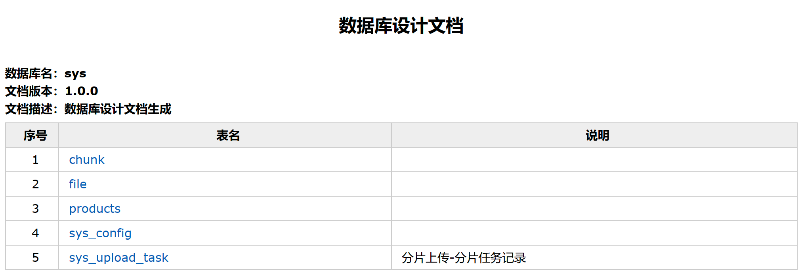
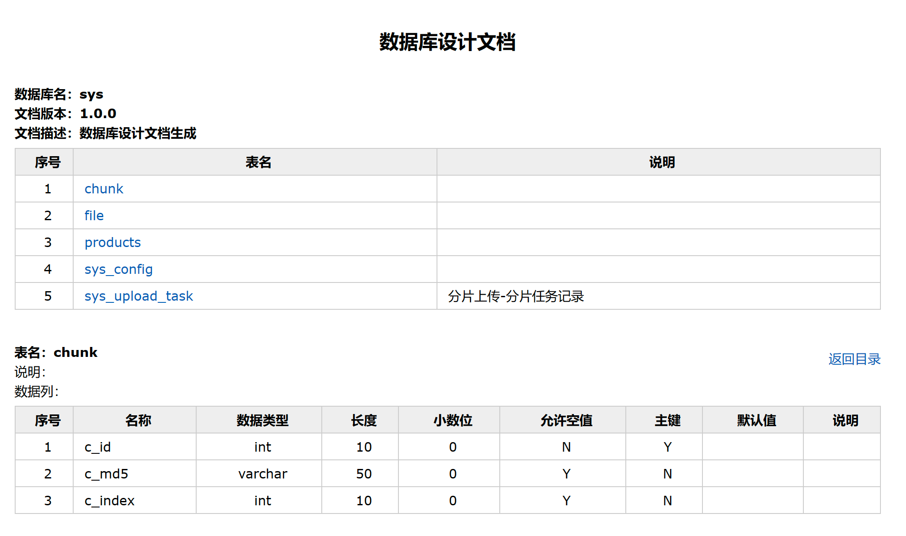
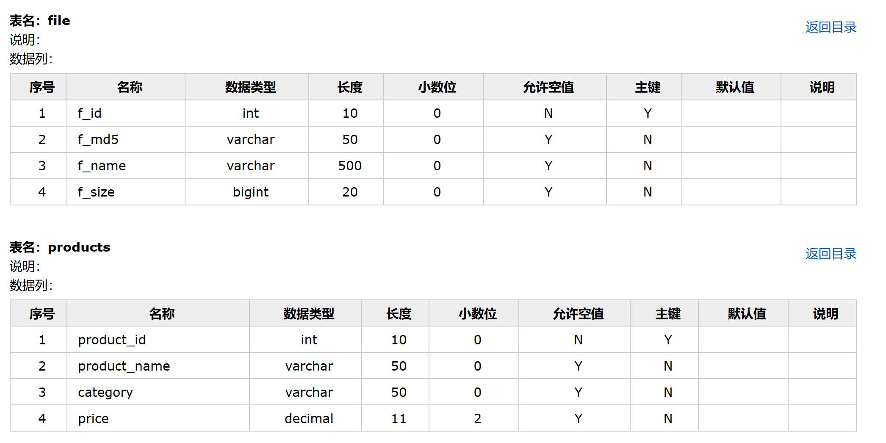

# 快速生成数据库表映射工具-Screw



本篇文章主要是帮助还在手工维护数据库表关系的老爷们，直接进入主题：

## <font style="color:rgb(89, 89, 89);">screw 特点</font>
+ <font style="color:rgb(89, 89, 89);">简洁、轻量、设计良好。不需要 powerdesigner 这种重量的建模工具</font>
+ <font style="color:rgb(89, 89, 89);">多数据库支持 。支持市面常见的数据库类型 MySQL、Oracle、SqlServer</font>
+ <font style="color:rgb(89, 89, 89);">多种格式文档。支持 MD、HTML、WORD 格式</font>
+ <font style="color:rgb(89, 89, 89);">灵活扩展。支持用户自定义模板和展示样式</font>

## <font style="color:rgb(89, 89, 89);">支持数据库类型</font>
+ <font style="color:rgb(89, 89, 89);">[</font><font style="color:rgb(89, 89, 89);">✔️</font><font style="color:rgb(89, 89, 89);">] MySQL</font>
+ <font style="color:rgb(89, 89, 89);">[</font><font style="color:rgb(89, 89, 89);">✔️</font><font style="color:rgb(89, 89, 89);">] MariaDB</font>
+ <font style="color:rgb(89, 89, 89);">[</font><font style="color:rgb(89, 89, 89);">✔️</font><font style="color:rgb(89, 89, 89);">] TIDB</font>
+ <font style="color:rgb(89, 89, 89);">[</font><font style="color:rgb(89, 89, 89);">✔️</font><font style="color:rgb(89, 89, 89);">] Oracle</font>
+ <font style="color:rgb(89, 89, 89);">[</font><font style="color:rgb(89, 89, 89);">✔️</font><font style="color:rgb(89, 89, 89);">] SqlServer</font>
+ <font style="color:rgb(89, 89, 89);">[</font><font style="color:rgb(89, 89, 89);">✔️</font><font style="color:rgb(89, 89, 89);">] PostgreSQL</font>
+ <font style="color:rgb(89, 89, 89);">[</font><font style="color:rgb(89, 89, 89);">✔️</font><font style="color:rgb(89, 89, 89);">] Cache DB</font>

## <font style="color:rgb(89, 89, 89);">生成文档类型</font>
+ <font style="color:rgb(89, 89, 89);">[</font><font style="color:rgb(89, 89, 89);">✔️</font><font style="color:rgb(89, 89, 89);">] Html</font>
+ <font style="color:rgb(89, 89, 89);">[</font><font style="color:rgb(89, 89, 89);">✔️</font><font style="color:rgb(89, 89, 89);">] Word</font>
+ <font style="color:rgb(89, 89, 89);">[</font><font style="color:rgb(89, 89, 89);">✔️</font><font style="color:rgb(89, 89, 89);">] Markdown</font>

## <font style="color:rgb(89, 89, 89);">代码</font>
用 springboot3 + jdk17 进行测试。

```java
<?xml version="1.0" encoding="UTF-8"?>
<project xmlns="http://maven.apache.org/POM/4.0.0" xmlns:xsi="http://www.w3.org/2001/XMLSchema-instance"
         xsi:schemaLocation="http://maven.apache.org/POM/4.0.0 https://maven.apache.org/xsd/maven-4.0.0.xsd">
    <modelVersion>4.0.0</modelVersion>
    <parent>
        <groupId>org.springframework.boot</groupId>
        <artifactId>spring-boot-starter-parent</artifactId>
        <version>3.2.5</version>
        <relativePath/> <!-- lookup parent from repository -->
    </parent>
    <groupId>com.baiLi.screw</groupId>
    <artifactId>screwDemo</artifactId>
    <version>1.0.0</version>
    <name>screwDemo</name>
    <description>screwDemo</description>
    <properties>
        <java.version>17</java.version>
    </properties>
    <dependencies>
        <dependency>
            <groupId>org.springframework.boot</groupId>
            <artifactId>spring-boot-starter-jdbc</artifactId>
        </dependency>

        <dependency>
            <groupId>com.mysql</groupId>
            <artifactId>mysql-connector-j</artifactId>
            <scope>runtime</scope>
        </dependency>

        <dependency>
            <groupId>org.springframework.boot</groupId>
            <artifactId>spring-boot-starter-test</artifactId>
            <scope>test</scope>
        </dependency>

        <dependency>
            <groupId>cn.smallbun.screw</groupId>
            <artifactId>screw-core</artifactId>
            <version>1.0.5</version>
        </dependency>

        <dependency>
            <groupId>com.zaxxer</groupId>
            <artifactId>HikariCP</artifactId>
            <version>5.1.0</version>
        </dependency>
    </dependencies>

    <build>
        <plugins>
            <plugin>
                <groupId>org.springframework.boot</groupId>
                <artifactId>spring-boot-maven-plugin</artifactId>
            </plugin>
        </plugins>
    </build>

</project>
```

```java
@Test
void document() {
    //数据源
    HikariConfig hikariConfig = new HikariConfig();
    hikariConfig.setDriverClassName("com.mysql.cj.jdbc.Driver");
    hikariConfig.setJdbcUrl("jdbc:mysql://localhost:3306/sys");
    hikariConfig.setUsername("root");
    hikariConfig.setPassword("1qaz@WSX");
    //设置可以获取tables remarks信息
    hikariConfig.addDataSourceProperty("useInformationSchema", "true");
    hikariConfig.setMinimumIdle(2);
    hikariConfig.setMaximumPoolSize(5);
    DataSource dataSource = new HikariDataSource(hikariConfig);
    //生成配置
    String fileOutputDir = "C:\\Users\\Desktop\\screw_word";
    EngineConfig engineConfig = EngineConfig.builder()
            //生成文件路径
            .fileOutputDir(fileOutputDir)
            //打开目录
            .openOutputDir(true)
            //文件类型
            .fileType(EngineFileType.HTML)
            //生成模板实现
            .produceType(EngineTemplateType.freemarker)
            //自定义文件名称
            .fileName("screw_mysql").build();

    //忽略表
    ArrayList<String> ignoreTableName = new ArrayList<>();
    ignoreTableName.add("test_user");
    ignoreTableName.add("test_group");
    //忽略表前缀
    ArrayList<String> ignorePrefix = new ArrayList<>();
    ignorePrefix.add("test_");
    //忽略表后缀
    ArrayList<String> ignoreSuffix = new ArrayList<>();
    ignoreSuffix.add("_test");
    ProcessConfig processConfig = ProcessConfig.builder()
            //指定生成逻辑、当存在指定表、指定表前缀、指定表后缀时，将生成指定表，其余表不生成、并跳过忽略表配置
            //根据名称指定表生成
//                .designatedTableName(new ArrayList<>())
            //根据表前缀生成
//                .designatedTablePrefix(new ArrayList<>())
            //根据表后缀生成
//                .designatedTableSuffix(new ArrayList<>())
            //忽略表名
            .ignoreTableName(ignoreTableName)
            //忽略表前缀
            .ignoreTablePrefix(ignorePrefix)
            //忽略表后缀
            .ignoreTableSuffix(ignoreSuffix).build();
    //配置
    Configuration config = Configuration.builder()
            //版本
            .version("1.0.0")
            //描述
            .description("数据库设计文档生成")
            //数据源
            .dataSource(dataSource)
            //生成配置
            .engineConfig(engineConfig)
            //生成配置
            .produceConfig(processConfig)
            .build();
    //执行生成
    new DocumentationExecute(config).execute();
}
```

## <font style="color:rgb(89, 89, 89);">数据库数据截图</font>


## <font style="color:rgb(89, 89, 89);">生成文档截图</font>





> 更新: 2024-04-26 20:05:28  
> 原文: <https://www.yuque.com/tulingzhouyu/db22bv/mengqwt50gtu2ek5>