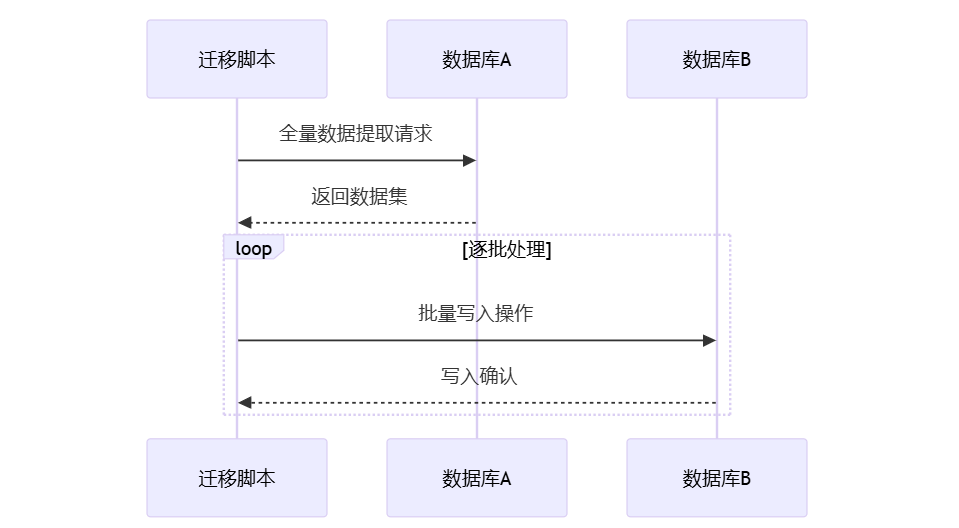
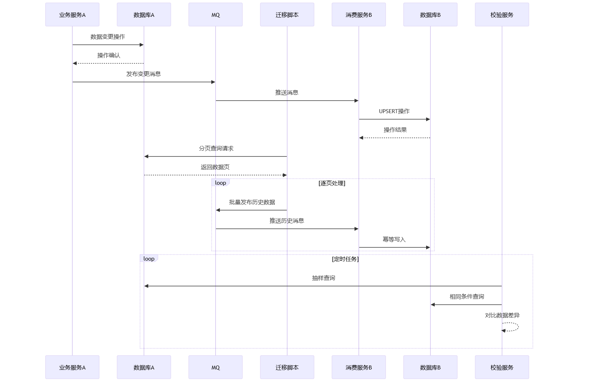
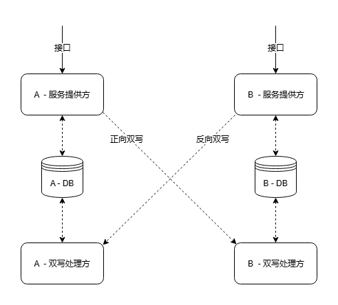

# 怎么在业务不停机地情况下迁移数据库

## 1. 为什么要做数据迁移？
随着系统业务的发展，基本上都会面临数据迁移问题，比如说：

分库分表，由单库迁移到分库分表后的集群

服务上云，由自建数据库迁移到云上数据库等等

所以我们在让新的服务接管数据之前，就要保证全部或部分数据已经要在新的数据库中了，这样业务才能够平滑过渡并切换。

## 2. 怎么做数据迁移？
### 2.1 静态数据迁移方案

**核心流程**：把数据从 A 服务迁移到 B 服务中，所需的步骤：

1. 把 A 里的数据都取出来
2. 把数据塞进 B 里面

没有了！就这么简单~~~

**适用场景**：仅适用于绝对静态数据（迁移期间数据零变更、零增长、零删除）的极简场景。

**局限性**：实际业务中需迁移的用户数据往往具有动态特征（持续更新/增长/删除），且数据体量庞大，此时静态迁移方案存在以下问题：

+ 无法捕获迁移期间的增量变更
+ 缺失数据一致性保障机制
+ 难以应对删除等反向操作

**解决方案**：需采用双写机制实现动态数据同步。

### 2.2 基于双写的数据迁移方案

#### 2.2.1 什么叫“双写”呢？
简单地讲，就是在 A 的数据发生变化时，通过某种方式（如消息队列，下称 MQ）异步通知到 B，然后 B 业务对数据进行修改。这种方式有点像 MySQL 基于 binlog 的主从同步。

#### 2.2.2 核心流程
1. 建立双写机制  
通过 MQ 建立 A → B 的单向通路，在 A 处理数据修改后，通过 MQ 发送消息，内含一份**最新版本的数据**；  
B 在收到消息后，根据消息内容对数据表进行**插入或更新**操作，以保证数据状态与 MQ 中的消息一致。  
这样，A 中的数据更新后，B 中对应的数据也就能很快地同步。  
不过，我们在处理消息时，通常会保证处理逻辑是幂等的。幂等逻辑的作用，会在下一步有所体现。
2. 历史数据迁移  
上面的通路建立后，最近发生变化的数据会进行更新，但大多数据不会被更改，所以也就不会进行同步。这个时候，就需要我们把所有历史数据全部导入 B 服务中。  
但在实际操作中，我们很难判断哪些数据是**没有**被更新过的历史数据。不过在幂等双写机制的帮助下，我们也不需要做这个判断——编写迁移脚本，**直接把表中的数据遍历一遍，通过双写通路发过去**就好了，反正相同的消息在 B 那边处理两遍的效果是一样的。
3. 校验数据完整性  
通过某些方法（如服务间调用）获取数据，将新老数据进行对比，确保迁移过程中未产生数据不一致的情况。

这样，我们就把 A 数据库中的所有数据都迁移到了 B 数据库中，而且在 A 的数据发生变化的同时，B 也可以在很短的时间内（通常不到 0.5s）完成更新。

双写时，需要针对不同类型的数据制定不同的迁移方案和消息格式：

1. 内容数据  
内容数据中每行只包含各种内容，这种数据我们通常都会通过主键（如 `id` 列）去标明唯一性。此时，双写数据应包含行 ID，以及该行下的所有需要迁移的内容。  
业务在处理双写数据时，会根据 ID 在数据库中查找。数据不存在时则进行插入，数据存在时则对现有数据进行更新。
2. 关系数据  
与内容数据不同，表明实体间关系的数据中主键的地位并没有那么高，真正标明唯一性的字段可能是表中的一到多个外键。此时，双写数据可以不考虑 ID，而只提供外键值和其他附加内容。  
类似地，业务在处理数据时，会通过外键来检索现有数据。
3. 缓存数据  
这里的“缓存数据”是指由现有内容经加工后生成的数据，比如文本分析结果、或统计数据等。这些数据如果方便重算，则没有迁移的必要——迁移过去重新计算就可以了。

## 4. 怎么做业务过渡？
相同的业务逻辑出现两遍，就比较容易破坏两边业务的一致性，所以除了数据迁移外，数据的处理逻辑通常也会由业务 A 迁移至业务 B。这就要求在 B 端构建相同或相似的业务逻辑和接口，然后将 A 端的调用迁移到 B 端去。

此时通常有三种方案：客户端切换、路由切换和业务代理。__

1. 客户端切换  
对于后端来说，这是最简单的一种：什么都不用做，只需实现客户端修改代码，将之前对 A 服务的调用改为对 B 服务的调用，这样也就完成了逻辑切换。  
但对于某些客户端来说，通过客户端切换所有流量并不现实，所以还是需要在后端实现向前兼容：对老客户端保留老接口，但要通过某种方式将逻辑转移到新服务上。
2. 路由切换  
这个涉及到了一些运维操作。简单来讲，就是在 B 服务中实现一份接口，要求与 A 的接口描述与接口逻辑保持**完全一致**。然后，通过上层服务器的路由规则，将所有 A 的接口调用重定向到 B 即可。  
这种方案同样简便可行，但会将业务的特殊规则带到服务器配置中，这样会将配置复杂化，不利于运维操作。
3. 业务代理  
这种方法较为复杂，但可以把所有工作量都放在后端，不涉及到其它部门。而且，当 A 中的现有逻辑非常复杂时，通常也只会考虑这种方案。  
具体来讲，就是在 B 中实现内部 RPC / API 接口，然后在 A 中移除对现有数据库的读写依赖，改为进行服务间调用。这样，A 的接口得以保留，但业务逻辑已经转移到了 B 中。

## 5. 一些极端的场景要如何应对？
### 5.1 数据可能会被删除
这种情况的解决方案简单粗暴：针对删除的操作**新建一条双写通路**，或在现有的消息中添加特定信息以标记该消息表示的是更新还是删除操作。  
但要注意一点：删除消息的处理逻辑最好也是幂等操作。

### 5.2 数据量极大
当数据量很大，如达到亿级别时，迁移历史数据的耗时会很久，此外，幂等逻辑的存在也会拖慢消息的处理速度。  
此时，可以考虑进行多段、不同粒度的迁移。

此前，我们在双写 / 数据迁移时，都是一条一条数据去迁移的，接收端插入数据也同样是一条一条来插入。但如果我们一次性把多条数据进行打包，在一条消息中发送多条数据内容，接收端也就可以使用一条语句来插入多条数据。但这样操作的话，消息处理逻辑的幂等性就很难保证。  
所以我们会采用以下策略：

+ 首先，通过批量迁移的方式迁移数据库中的全部数据，此时没有双写信号，所以消息接收方只负责将数据无脑插入；
+ 第二步，上线针对单条数据的双写逻辑，此时的消息处理应该是幂等的；
+ 第三步，找出所有**批量迁移开始后新产生的数据**，将其通过双写接口进行迁移；  
此时，由于处理方的幂等性，我们只需要保证找到的数据只多不少即可。所以，此步迁移数据的时间点划分可以设为批量迁移开始时间的数小时前。
+ 最后，校验数据完整性。

这样，我们就提高了数据迁移的整体速度。

举个具体例子来表明成果：  
有一个项目需要迁移 3.5 亿左右的数据到新库，而单条数据迁移的吞吐量大概在每分钟 10000 条。按照这个速率，将所有数据完整迁移需要 25 天。  
而我们采用了批量迁移的方法，在第一步时，遍历所有用户，将每个用户的所有数据打包为一条消息，并通过 MQ 迁移。这一步只用了 27 个小时就迁移了大部分数据。  
然后，上线了幂等的双写逻辑，再花费不到 4 小时对新产生的数据进行迁移。  
这样我们只用了不到 31 小时就将所有数据迁移完成，迁移速率提高了 18 倍。  
为了保险，我们在批量迁移无人值守（如半夜）的时候把迁移速率调的很低。事实上那个时候是几乎没有请求的，如果把速率调高，可以使批量迁移的时间缩短 4 小时以上。

此外，在批量迁移的过程中，还可以应用一些小技巧：

+ 批量迁移时如果单批数据量过大，为避免消息堆积占用 MQ 内存，消息可以在放入 MQ 前进行压缩；
+ 在进行粗粒度数据迁移时，可以考虑关闭或去除接收方的数据库约束检查，以提高接收方数据写入的速率。此时，数据完整性由发送方来保证。粗粒度迁移过后，在上线幂等的细粒度迁移前，再恢复数据库约束。

### 5.3 无法一次性迁移所有数据逻辑
有时业务逻辑复杂，迁移成本很高，无法一次性地将接口全部迁移过去。这时我们就需要采取一些“曲线救国”的策略，让两端的数据保持一致，且服务同时可用。  
为此，我们需要添加 B → A 的**反向双写**机制。**通过 B 服务的接口产生**的数据，将会经过反向双写的通道回写至 A 中。这样，两端数据就能保持同步。此时再慢慢地迁移 A 的业务逻辑即可。  

不过在构建反向双写时，需要格外注意两端数据流向，以避免双写“死循环”的事故出现。

> 更新: 2025-05-08 20:55:32  
> 原文: <https://www.yuque.com/tulingzhouyu/db22bv/neg4bg6cwmkkoccr>