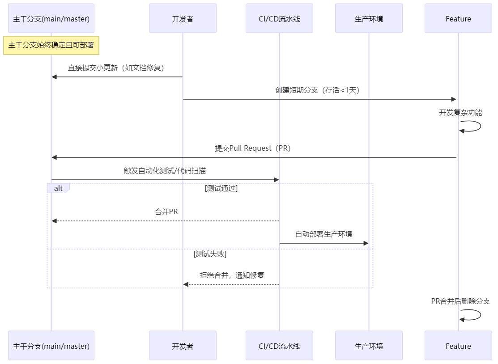

# 深入解析 Git 代码管理模型

# 
## 前言
在当今软件开发的世界里，高效的代码管理对于项目的成功至关重要，Git 作为一款强大的分布式版本控制系统，提供了多种灵活的代码管理模型，以适应不同规模团队和项目的需求。比如Git Flow、GitHub Flow、GitLab Flow等专业术语，开发者常陷入选择困境。本文为您拆解五大主流分支模型，助您找到最适合团队的版本管理方案。

## GitFlow 模型
### 什么是 GitFlow？
GitFlow 模型由 **Vincent Driessen** 提出，是一种非常经典且系统化的 Git 分支管理模型。它专为中大型团队设计，适合处理复杂的版本管理流程和阶段性开发工作。这种模型定义了明确的分支类型和流程，代码管理严格，分工明确，从而确保所有功能的开发、测试和发布都井井有条。

---

### GitFlow 的主要分支
1. **主分支（master）**
    - 用于存储稳定、可直接部署到生产环境的代码。
    - 不允许直接在 `master` 上进行修改，所有更新均通过分支合并完成。
    - 每次版本发布后会在 `master` 打上版本标签。
2. **开发分支（develop）**
    - 承担主要的开发工作，是项目的核心分支。
    - 所有新的功能开发或代码修改，最终都会被集成到 develop 分支并在此进行测试。
    - 禁止直接修改，仅通过合并 Feature/Release/Hotfix 分支更新。
3. **功能分支（feature）**
    - 用于开发新功能，基于 `develop` 分支拉取。
    - 功能完成后，合并回 `develop`，随后删除功能分支。
    - 重在实现单一功能，避免代码冲突和开发中断。
4. **发布分支（release）**
    - 在开发阶段结束并准备发布新版本时，从 `develop` 创建的分支。
    - 用于进行发布前的最终测试、修复小问题，但不再引入新功能。
    - 修复完成后，合并到 `master` 和 `develop` 分支，对外发布。
5. **热修复分支（hotfix）**
    - 用于紧急修复线上环境中的问题，直接从 `master` 分支拉取。
    - 修复完成后，同样会被合并回 `master` 和 `develop`。

---

### GitFlow 的工作流程步骤

1. **初始化分支**
    - 项目初始化时会分别创建 `master` 和 `develop` 分支。
    - `master` 分支用于管理线上稳定代码，而 `develop` 用于持续开发。
2. **功能开发**
    - 开发新功能时，从 `develop` 分支拉出 `feature` 分支进行单一功能开发。
    - 功能完成后，合并到 `develop` 分支，并删除 `feature` 分支。
3. **版本发布**
    - 当需要发布一个新版本时，从 `develop` 分支创建 `release` 分支。
    - 在 `release` 分支进行版本测试，修复仅影响此版本的问题。
    - 发布完成后，`release` 分支合并到 `master` 和 `develop`，并创建版本标签。
4. **热修复管理**
    - 如果线上代码出现问题，从 `master` 分支创建 `hotfix` 分支进行修复。
    - 修复后，`hotfix` 分支合并回 `master` 和 `develop`，以保持代码一致性。

### GitFlow 的优缺点
#### 优点：
+ 分支管理明确，分工清晰，可应对复杂的大型团队协作。
+ 每个分支定义了明确的职责，降低了代码冲突风险。
+ 提供了完整的开发→测试→发布工作流，有助于保证代码的稳定性。
+ 通过 `release` 和 `hotfix` 分支，能够对线上的版本和问题进行快速响应。

#### 缺点：
+ **复杂性高：** 对小型团队或简单项目而言，GitFlow 的流程可能显得繁琐。
+ **学习成本：** 新手需要花费较多时间学习不同分支的用途及其操作。
+ **不适合持续交付：** GitFlow 偏向阶段性发布，而不是高频率的小版本更新。

---

### GitFlow 的适用场景
+ **中大型团队协作：** GitFlow 非常适合多个团队合作的大型项目，明确的分支结构让成员分工更加清晰。
+ **阶段性发布项目：** 如果项目以大版本的形式完成迭代，可以充分利用 `release` 分支进行测试和修复。
+ **高稳定性需求：** 适合追求稳定和高质量代码的项目，尤其是在各版本正式发布前需要严密测试的场景。

---

### 小结
GitFlow 是一种功能强大、逻辑清晰的分支管理模型，但它的复杂性使得它更适用于中大型团队或复杂项目。如果团队规模较小或者项目要求快速迭代，其他更简洁的模型（如 GitHub Flow）可能更为适合。

---

## GitHub Flow 模型
### 什么是 GitHub Flow？
GitHub Flow 是由 **GitHub** 提出的简洁、高效的 Git 分支管理模型，专注于 **快速迭代** 和 **持续集成/持续部署（CI/CD）**。与 GitFlow 等复杂模型相比，GitHub Flow 的结构简单，工作流程清晰，主要适合 **小型团队** 或 **开发迭代快的项目**。

不同于繁琐的多层分支管理，GitHub Flow 仅使用一个 `master` 分支和短暂的功能分支（feature branch）。开发者的代码完成后会直接合并到 `master`，并立即部署。

---

### GitHub Flow 的主要分支和角色
1. **主分支（master）**
    - 用于存储稳定 **且生产环境可以直接部署** 的代码。
    - 任何提交到 `master` 的代码都必须是功能完整、通过测试的。
    - 所有发布的代码直接从 `master` 分支获取。
2. **功能分支（feature branch）**
    - 每个功能（或者修复任务）在 `master` 的基础上拉取一个独立的功能分支。
    - 功能开发完成后，功能分支会通过 **Pull Request（PR）** 合并回 `master`，然后功能分支被删除。

---

### GitHub Flow 的核心工作流程

GitHub Flow 的整个开发过程可以分为以下六步：

1. **创建功能分支**
    - 开发一个新的功能时，从 `master` 分支创建一个功能分支。
    - 功能分支命名一般使用语义化的规则，如 `feature/add-login` 或 `bugfix/fix-login-error`。
2. **在功能分支中开发**
    - 所有功能代码都在独立的功能分支中完成，避免对 `master` 分支的任何干扰。
    - 开发完成后，确保功能代码通过了本地测试。
3. **提交 Pull Request**
    - 开发完成后，提交 **Pull Request（PR）** 以合并功能分支到 `master`。
    - PR 通常由其他开发者进行代码审查（Code Review）和测试。
4. **代码审查和测试**
    - 项目团队对 PR 进行代码审查，确保代码质量。
    - 同时，持续集成工具会自动执行测试流程，验证功能完整性。
5. **合并到 master**
    - 如果 PR 获得批准并通过所有测试，则功能分支会合并到 `master`。
    - 合并后，功能分支被删除，保持分支管理的整洁性。
6. **部署生产环境**
    - 由于 `master` 分支始终是稳定版本，合并完成后可以立即部署到生产环境。

---

### GitHub Flow 的优缺点
#### 优点：
1. **简单高效**
    - 只有两个主要分支（`master` 和功能分支），分支管理成本极低。
    - 工作流程短，适合持续发布和快速迭代。
2. **敏捷开发支持**
    - PR 和 CI/CD 流程让开发快速集成，并快速部署完整的功能到生产环境。
3. **降低冲突**
    - 每个功能在独立分支开发，避免了多人在主分支协作时的代码冲突。
4. **持续部署的天然契合**
    - 合并即部署的机制，适合于频繁发布小更新（如微服务、前端均适用）。

#### 缺点：
1. **不适合复杂版本管理**
    - 没有 `release` 或 `hotfix` 分支，对同时维护多个版本的项目支持较弱。
2. **代码质量依赖测试和审查**
    - 如果测试机制或代码审查流程不完善，可能会直接将问题代码合并进生产环境。
3. **对部署要求高**
    - 需要一个完善的自动化部署和测试流程，否则 “master 合并即部署” 的模式会造成风险。

---

### GitHub Flow 的适用场景
1. **小型团队：**
    - 人员较少，主要专注于快速开发和部署功能。
2. **持续交付项目：**
    - 项目需要频繁发布功能或者版本（如前端开发、小型微服务）。
3. **简单项目：**
    - 不存在多个并行版本或需要长期维护的复杂代码库。
4. **自动化能力强的团队：**
    - 团队有成熟的 CI/CD 工具支撑，能够快速验证和部署代码。

---

### 小结
GitHub Flow 是一种以简洁和效率优先的 Git 分支管理策略，主要适用于 **持续交付** 的开发模式。对于需要快速迭代的小型项目或小团队，GitHub Flow 是非常合适的。  
但如果项目复杂度较高，存在多个版本或需要兼顾长期维护，GitHub Flow 的局限性会较为明显，此时可以结合其他模型（如 GitLab Flow 或 GitFlow）选择更适合的策略。

---

## GitLab Flow 模型
### 什么是 GitLab Flow？
GitLab Flow 是由 GitLab 提出的分支管理模型，结合了 GitHub Flow 的简洁性和多环境部署需求的能力。  
相比 GitHub Flow，GitLab Flow 通过 **环境分支**（如测试、生产环境分支）实现代码在不同阶段的隔离管理，适合需要 **严格环境控制** 和 **持续交付（CD）** 的中大型项目。其核心思想是 **上游优先（Upstream First）**：所有代码变更必须先从主分支（`master`）流入，再通过自动化流程同步到下游环境。

---

### GitLab Flow 的主要分支和角色
1. **主分支（master）**
    - 唯一可信代码源，存储可直接部署到生产环境的稳定代码。
    - 所有功能开发和问题修复必须通过合并请求（MR）进入此分支。
    - 通过 CI/CD 自动同步到下游环境分支（如 `staging`）。
2. **功能分支（feature branch）**
    - 从 `master` 分支创建，用于独立开发新功能或修复问题。
    - 开发完成后通过 MR 合并到 `master`，**禁止直接合并到环境分支**。
3. **环境分支**
    - **测试分支（staging）**：通过 CI/CD 从 `master` 自动部署到测试环境，仅用于验证代码，禁止直接修改。
    - **生产环境（production）**：通过 CI/CD 从 `master` 部署（如打版本标签），不维护长期分支。

---

### GitLab Flow 的核心工作流程

GitLab Flow 的整个开发和部署过程可以分为以下九步：

1. **创建功能分支**
    - 从 `master` 分支创建功能分支（如 `feature/login`）。
2. **在功能分支中开发**
    - 开发者完成功能开发，提交代码并运行本地测试。
3. **提交合并请求（Merge Request）**
    - 发起 MR 请求将代码合并到 `master`，触发 CI 流水线（自动化测试）。
4. **代码审查和测试**
    - 团队评审代码，CI 验证通过后合并到 `master`，**删除功能分支**。
5. **自动部署到测试环境**
    - **无需手动同步到 **`**staging**`** 分支**！
    - `master` 分支更新后，CI/CD **自动部署到测试环境（如 **`**staging**`**）**。
6. **质量保证（QA）阶段**
    - QA 团队在测试环境验证功能，发现问题时：
        * **从 **`**master**`** 创建新修复分支**（如 `hotfix/xxx`），修复后重新走 MR 流程。
        * **禁止直接修改测试环境分支代码**。
7. **部署到生产环境**
    - 测试通过后，**通过 CI/CD 直接从 **`**master**`** 分支部署到生产环境**（如打版本标签 `v1.0.0`）。
    - **禁止将 **`**staging**`** 分支代码合并到生产环境**。
8. **后续维护**
    - 生产环境发现问题时：
        * 必须 **从 **`**master**`** 分支创建修复分支**，修复后通过 MR 合并到 `master`。
        * 重新触发 CI/CD 部署到测试和生产环境。
        * **禁止从生产环境分支直接修复问题**。

---

### GitLab Flow 的优缺点
#### 优点：
1. **环境隔离严格**
    - `master` 作为唯一代码源，配合自动化部署降低环境配置错误风险。
2. **版本追溯性强**
    - 生产版本通过标签（如 `v1.0.0`）管理，回滚时直接切换到历史版本。
3. **持续交付支持**
    - MR 机制 + 自动化测试确保快速迭代与代码质量平衡。

#### 缺点：
1. **流程复杂度高**
    - 需严格遵循“上游优先”原则，新人上手成本较高。
2. **依赖自动化工具链**
    - 若 CI/CD 不完善，`staging` 测试和部署流程可能低效。
3. **多版本支持不足**
    - 长期维护多个历史版本需引入 `release/*` 分支，增加管理成本。

---

### GitLab Flow 的适用场景
1. **中大型项目**
    - 需要严格隔离开发、测试和生产环境，避免代码污染。
2. **监管严格行业**
    - 金融、医疗等领域，需通过 `staging` 环境完成合规性验证。
3. **已具备 CI/CD 基建**
    - 需完善的 CI/CD 流程支持，确保 `master` 分支的代码质量。
4. **中等发布频率**
    - 适合每周/双周发布节奏，兼顾迭代速度与稳定性。

---

### 小结
GitLab Flow 的核心是通过 **环境分支与 CI/CD 的强绑定**，实现代码从开发到生产的可控流动，适合已有成熟 CI/CD 工具链的中大型团队，对代码质量和环境稳定性要求较高的场景，

小型团队或无需多环境验证的项目，可能因流程复杂度反而降低效率。

---

## TrunkBased 模型
### 什么是 Trunk-Based Development？
**Trunk-Based Development（主干开发）** 是一种简洁、高效的分支管理模型，其**核心思想**是：所有开发活动直接作用于主干分支（main/master）**或存活时间极短的临时分支**（通常不超过24小时），严格禁止长期存在的功能分支。主干分支始终保持 **可部署状态**，通过高频合并和持续集成保障代码质量。

---

### Trunk-Based Development 的主要分支与特性
1. **主分支（master/main）**
    - **唯一可信源**：所有代码变更必须通过主干分支集成，禁止绕过主干直接部署。
    - **自动化门禁**：通过 CI/CD 强制运行测试，失败则阻止合并。
2. **短期功能分支（feature branch 或临时分支）**
    - 用于单一功能、修复或任务的开发，通常存在时间较短。
    - 提交后尽快通过代码审查和测试合并到主分支。
    - 开发完成后会被删除，避免长期保留。
    - **存活时间**：严格限制在 **24小时内**，超时需拆分任务或强制合并。

---

### Trunk-Based Development 的核心工作流程

1. **直接在主干开发**
    - **前置条件**：小型更新或补丁直接提交到主分支，通常不需要创建临时分支。
    - **代码规范**：确保提交代码经过测试，不会造成主分支不稳定。
2. **短期临时分支开发**
    - **代码拆分**：对于较大的功能或复杂任务，开发者从主分支中拉取一个临时分支，根据具体需求进行开发。
    - **灰度发布**：通过 **特性开关（Feature Flags）** 控制新功能可见性。
3. **持续集成与快速合并****（CI）**
    - 每天或每隔数小时合并一次分支，确保主分支频繁集成小的功能变更。
    - 持续集成（CI）系统会自动运行测试，验证提交不会破坏主分支的稳定性。
4. **频繁发布****（CD）**
    - 主分支始终保持可发布状态，可根据需求频繁更新至生产环境。
    - 结合持续部署（CD）工具，代码合并后可实现自动化上线。
    - **渐进式发布**：使用金丝雀发布或蓝绿部署降低风险。
    - **自动回滚**：监控生产异常时自动回退到上一版本。

---

### Trunk-Based Development 的优缺点
#### 优点：
1. **快速交付**
    - 避免冗长的分支流程，支持频繁的小更新和快速发布。
2. **简单易用**
    - 仅保留核心主干分支，流程简洁，分支管理成本低。
3. **最小化代码冲突**
    - 开发者频繁合并代码，避免长时间分支导致的合并冲突。
4. **快速反馈循环**
    - 开发者立即获知集成结果，加速问题修复。
5. **天然适配 CI/CD**
    - 配合持续集成和持续部署，代码更容易自动化测试和上线。

#### 缺点：
1. **需要严格的测试和审查**
    - 因为主分支频繁接收提交，测试和代码审查的质量决定了项目稳定性。
2. **不适合大型项目**
    - 如果项目规模过大，多人同时在主分支开发可能导致提交混乱或依赖问题。
3. **缺乏长期分支**
    - 对需要维护多个版本或长期支持的项目（如企业级应用）不够友好。
4. **要求高协作**
    - 团队需要高度协同和一致的编码标准，避免低质量代码进入主干。

---

### Trunk-Based Development 的适用场景
1. **小型团队**
    - 开发人员规模较小，沟通成本低，适合快速交付和简化流程的项目。
2. **敏捷开发**
    - 随时部署和迭代功能，适合敏捷团队的快速开发模式。
3. **持续交付或持续部署（CI/CD）**
    - 结合成熟的 CI/CD 工具，Trunk-Based 更能发挥高频发布和自动化集成的优势。
4. **互联网产品**
    - 对于追求快速迭代、部署功能的 SaaS 或 B2C 项目，Trunk-Based 是优选。

---

### 小结
**Trunk-Based Development** 是一种极简和高效的分支管理方式，将开发活动集中在主干分支上，适合快速迭代和频繁部署的项目。它减少了分支管理的复杂性，通过强调频繁合并和持续集成，能够快速交付高质量的代码。然而，对于大型企业项目或需要维护多个版本的团队，Trunk-Based 可能显得不足，需要结合其他模型使用。在团队规模可控且具备成熟 CI/CD 工具的情况下，Trunk-Based Development 是支持敏捷开发的强大策略。

---

## AoneFlow 模型
### 什么是 AoneFlow？
AoneFlow 是阿里巴巴提出的 **环境驱动分支模型**，结合了 GitFlow 的多版本管理能力和 Trunk-Based 的持续交付思想，通过 **预发布分支（pre）** 实现复杂场景下的多版本并行开发和测试。它专注于 **灵活性** 和 **覆盖广泛场景**，通过对分支进行整理和统一命名，使项目在并行开发、版本管理和快速响应需求时更高效，也更加适应大型企业项目的开发需求。

AoneFlow 特别适用于复杂的 **云原生开发** 和 **大规模持续交付的场景**。

---

### AoneFlow 的核心思想
AoneFlow 的设计目的是为了解决以下问题：

+ 适应复杂场景（支持多版本同时开发与交付）。
+ 优化 GitFlow 模型中的冗长开发流程，减少人为干扰。
+ 更好地支持 Trunk-Based Development 的持续交付需求，但增加复杂版本支持。
+ 在功能开发和紧急修复方面，提供高效的分支管理。

由此，AoneFlow 将分支划分为三种关键类别：**主干分支、预发分支和功能分支**。

---

### AoneFlow 的主要分支和特点
1. **主干分支（master/main 应用分支）**
    - 永远指向最新的 **稳定生产代码**。
    - 每次生产级发布都会在 `main` 上打对应版本的 Git 标签（如 `v1.0.0`）。
    - 主干分支直接维护生产环境，不直接开发功能。
2. **预发布分支（pre）**
    - 用于代码上线前的测试、修复和回归验证。
    - 功能分支的代码会合并到此分支，经过测试后再进入生产分支。
    - **环境隔离**：每个预发布分支对应一个 **独立测试环境**（如 `pre_v1.0`、`pre_v2.0`）。
    - **多版本并行**：可以有多个预发布分支，支持同时上线多个版本（如 `pre_v1.1`、`pre_v1.2`）。
3. **功能分支（feature/bugfix）**
    - **来源分支**：从主干分支或预发分支创建，主要用于开发指定功能或修复问题，**不直接合并到主干**。
    - 单个功能完成后，通过合并请求（Merge Request）提交到预发布分支。
    - 代码合并并经过代码审查及测试后，进入预发布分支，再逐一推送到生产环境。
    - **命名规范**：如 `feature/login`、`bugfix/header`，明确分支用途。

---

### AoneFlow 的核心工作流程

AoneFlow 的开发和部署过程通常包括以下几个阶段：

1. **功能分支开发**
    - 开发者从预发布分支或主干分支中拉取一个特定功能分支（如 `feature/add-login`）。
    - 功能开发完成后，提交研发测试。
2. **代码审查与测试**
    - 提交功能分支代码，创建合并请求（MR）。
    - 通过代码审查和单元测试后，合并到对应的预发布分支。
3. **预发布验证**
    - 在预发布分支（例如 `pre_v1.0`）中，对功能代码进行完整的集成测试、回归测试及用户验收（**对应独立测试环境**）。
    - 测试失败时，从预发布分支创建修复分支（`bugfix/xxx`），修复后重新合并。
    - 每个预发布分支可能同时集成多个功能分支。
4. **生产环境发布**
    - 测试完成的预发布分支可合并到主干分支，并标记对应的版本号（如 `v1.0.0`）。
    - 将主干更新推送到生产环境，预发布分支可保留或删除。。
5. **多版本并行管理**
    - 可以存在多个预发布分支和对应的功能分支，支持多个版本的开发线同时推进（如 `pre_v1.0` 与 `pre_v2.0`）。

---

### AoneFlow 的优缺点
#### 优点：
1. **灵活高效**
    - 引入预发布分支，能够对多个功能进行分批合并和测试，同时支持多个版本的交付。
2. **多版本并行开发**
    - 不同版本的开发、测试和维护完全独立，复杂项目能够更好地管理冗长的开发周期。
3. **稳定性保障**
    - 主干分支始终保持稳定，生产级代码通过预发布分支和测试的多层保障才上线。
4. **适合大型团队**
    - 明确的分支结构，适合跨团队协作，多开发线并行推进且不干扰。

#### 缺点：
1. **复杂度较高**
    - 对小团队而言，AoneFlow 的多分支管理显得繁琐，不适合简单项目或快速迭代需求。
2. **依赖强大的测试和 CI/CD 流程**
    - 为了确保整个流程顺利推进，团队需要有完善的自动化测试和持续部署工具。
3. **学习成本高**
    - 与 GitFlow 类似，团队需要深入理解每个分支的作用和使用场景，设计完成的流程需要团队成员协同执行。

---

### AoneFlow 的适用场景
1. **大型复杂项目**
    - 特别适合需要支持多个版本并行开发与发布的大型企业项目。
2. **云原生开发**
    - 在微服务架构下，多个版本和功能模块并行推进需要高效的分支管理模型。
3. **跨团队协作的复杂场景**
    - 适合大型团队或多团队联合开发，通过分支隔离降低开发冲突。
4. **高频交付与高质量要求**
    - 在持续交付（CD）的流程中，通过预发布分支保障生产环境质量，对上线版本严格把关。

---

### 小结
AoneFlow 是一种为解决 **企业级复杂项目** 而设计的分支管理模型，灵活的 **预发布分支机制** 和对多环境、并行开发的强支持，让它特别适合大型团队在复杂场景中使用。尽管其复杂度较高，但合理使用可以极大地提升项目的协作、高频交付能力，同时确保代码质量。对于需要快速响应需求且多团队协作的企业，AoneFlow 是一种强大的代码管理解决方案。

---

## 五种模型的横向对比
以下是五种主流分支管理模型的优缺点和适用场景的横向对比，帮助你快速了解不同模型的特点，选择适合的开发流程。

---

表格

| **模型名称** | **优点** | **缺点** | **适用场景** |
| --- | --- | --- | --- |
| **GitHub Flow** | 1. 流程简单，对开发者要求低，易于上手。 2. 优化部分：适合持续交付，符合敏捷开发。 3. 没有过多分支，冲突少，易管理。 | 1. 不适合维护多个版本（没有支持 Release 分支）。 2. 代码合并后立即进入生产，可能增加部署风险。 | 适合小型团队或简单项目。 产品迭代较快，更新频繁（如前端项目、持续交付型服务、短期开发的项目）。 |
| **GitFlow** | 1. 多分支设计，支持多版本维护。 2. 提供稳定的发布流程（Release 分支确保发布质量）。 3. 结构清晰，便于管理。 | 1. 分支结构复杂，流程较重。 2. 合并频繁，测试环节成本高。 3. 对紧急修复响应速度较慢。 | 适合大型团队或版本复杂的项目，比如需要维护多个发布版本（如企业级应用、传统软件开发、大型产品开发）。 |
| **GitLab Flow** | 1. 引入环境分支（如 `staging`、`production`），适合多阶段部署。 2. 提供灵活部署方案，多环境测试后上线。 3. 流程相对清晰。 | 1. 仍然需要多人协作，复杂性高于 GitHub Flow。 2. 需要成熟的 CI/CD 支持，否则管理成本较高。 | 适合需要多阶段测试的场景（如云原生应用）。 适用中型团队或对生产部署流程要求严格的项目。 |
| **Trunk-Based Development** | 1. 简化分支管理（只有主干分支和短期功能分支），分支简单、轻量级。 2. 非常适合敏捷开发和 CI/CD 流程。 3. 减少长期分支的代码冲突。 | 1. 严格依赖持续集成和自动化测试。 2. 不适合多版本并行开发或复杂项目。 3. 开发团队协作要求高。 | 适合小型团队或者快速持续交付的场景（如互联网项目、频繁迭代的服务，如 SaaS、小型微服务）。 |
| **AoneFlow** | 1. 灵活性强，支持多版本并行开发与发布（通过预发布分支）。 2. 主干高度稳定，质量保障好。 3. 适合复杂应用和云原生场景。 | 1. 对团队流程理解要求高（学习曲线较陡峭）。 2. 分支较多，管理成本高于 Trunk-Based。 3. 严重依赖成熟 CI/CD。 | 适合复杂场景，比如云原生开发及大规模并行项目（如阿里巴巴内部场景）。 适合需要支持多版本、多人协作的大型项目。 |

---

## 总结建议
1. **小型团队、快速敏捷开发：**
    - 推荐使用 **GitHub Flow** 或 **Trunk-Based Development**。
    - 两种模型都简单，适合快速迭代。
2. **大型团队、多版本发布场景：**
    - 推荐使用 **GitFlow** 或 **AoneFlow**。
    - GitFlow 提供了传统的分支管理方案，而 AoneFlow 更灵活且适合现代化云原生开发。
3. **中型团队、注重环境管理和部署：**
    - 推荐 **GitLab Flow**，通过引入环境分支（如测试/生产），团队协作成本较低。

选择时需要综合考虑 **团队规模** 和 **项目特点**。

如果流程复杂但版本管理需求高，AoneFlow 是非常适用的；规模小而敏捷要求高时，选择 GitHub Flow 或 Trunk-Based Development 更合适。

> 更新: 2025-03-18 20:11:03  
> 原文: <https://www.yuque.com/tulingzhouyu/db22bv/iohmkdkgppfthm1v>