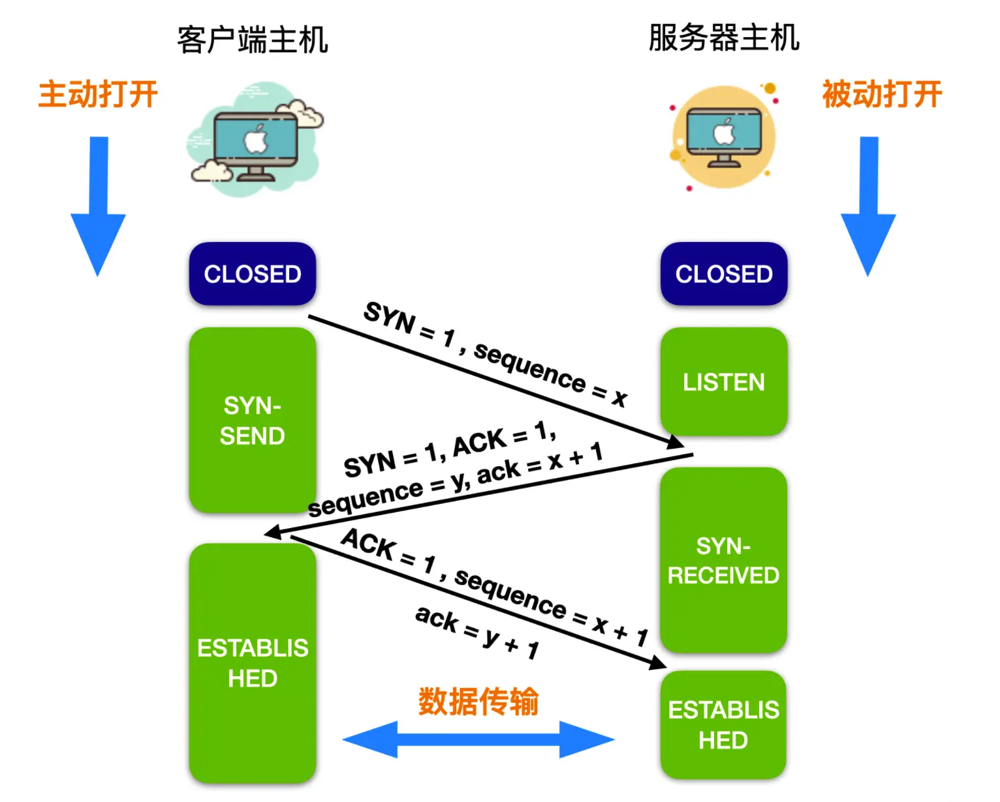
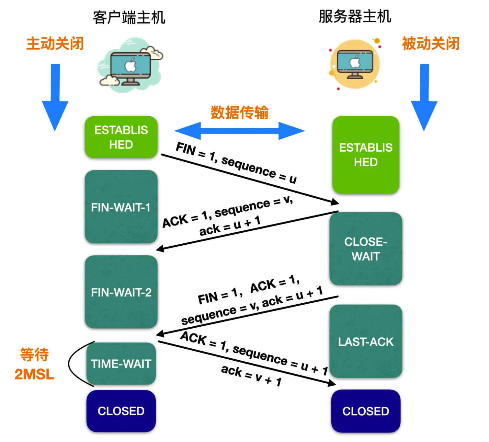
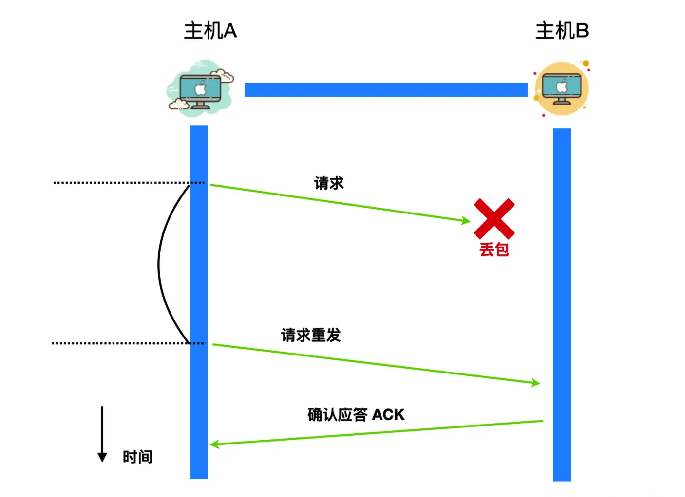
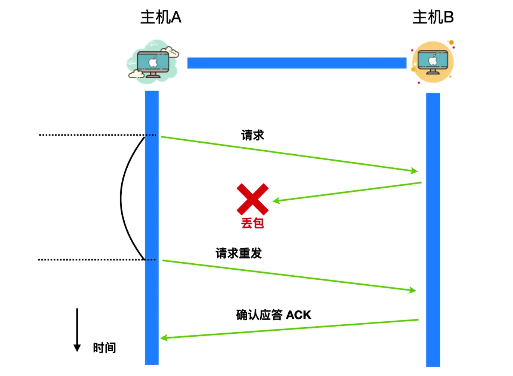
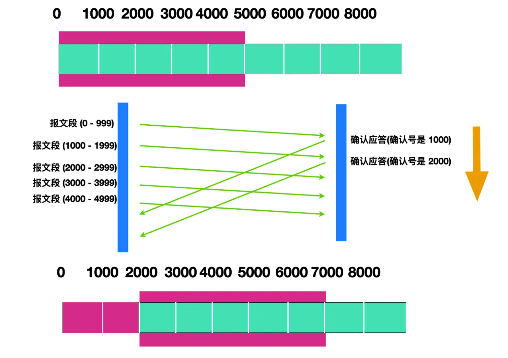
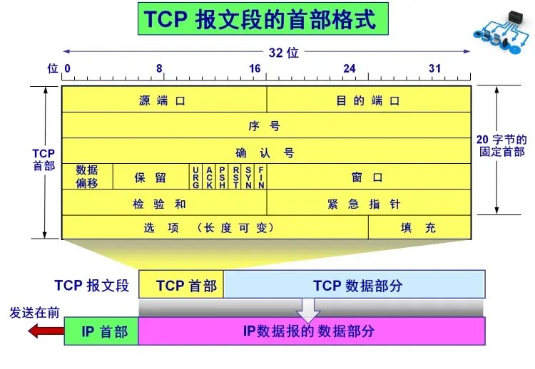
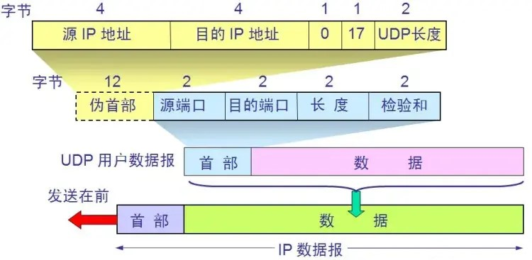
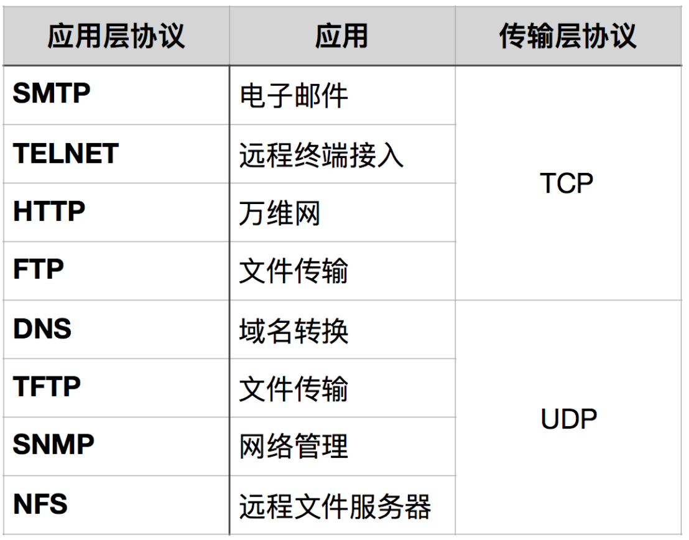
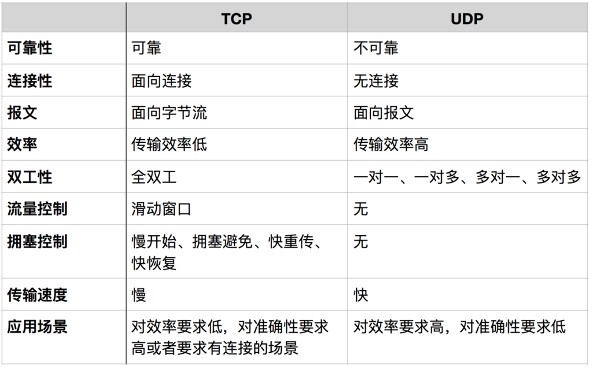

# 面试官：你知道TCP与UDP的区别吗？

TCP（传输控制协议）和UDP（用户数据报协议）是互联网中两个核心的传输层协议，它们各自采用不同的方式来确保数据从源头传输到目的地。今天就详细探讨TCP与UDP协议的主要区别：

### 1. 连接的建立
+ **TCP**：TCP (Transmission Control Protocol，传输控制协议) 是一种面向连接的协议。这意味着在数据传输开始之前，必须先建立连接。TCP通过三次握手过程来建立连接，确保两端的通信是同步的。
+ **UDP**：UDP (User Datagram Protocol，用户数据报协议) 是一种面向数据报的协议。UDP发送数据之前不需要建立连接，它直接将数据包发送给接收方，不保证数据包的顺序、完整性或可靠性。

**TCP 三次握手与四次挥手如下：**

### 2. 数据传输的可靠性
+ **TCP**：提供高可靠性的数据传输。它通过序列号、确认应答、重传机制、流量控制和拥塞控制等技术来确保数据完整无误地传输到接收方。
+ **UDP**：不保证数据传输的可靠性。它发送的数据包可能会丢失、重复或到达顺序错乱，不提供错误恢复功能。

### 3. 数据传输的速度和效率
+ **TCP**：由于需要进行连接管理、错误检测和恢复，以及维持连接状态，其数据传输速度相对较慢，协议开销较大。
+ **UDP**：由于不需要建立连接，且几乎没有错误恢复机制，使得UDP的数据传输速度较快，协议开销小，效率较高。

### 4. 报文段
**TCP**报文段核心数据如下：

+ **序列号（Sequence Number）**：用于确保报文段的顺序传输，这是TCP提供可靠传输服务的关键部分。
+ **确认号（Acknowledgment Number）**：接收方用它来告诉发送方已成功接收到的数据，是实现可靠传输的另一机制。
+ **数据偏移（Data Offset）**：指出TCP头部的长度，这对于解析变长的选项字段是必要的。
+ **控制位（Control Bits）**：包括SYN、ACK、FIN等标志，用于建立连接、确认收到数据和连接终止。
+ **窗口大小（Window Size）**：用于流量控制，它告诉发送方可以发送的数据量，以防止接收方被过多数据淹没。
+ **校验和（Checksum）**：提供端到端的错误检测能力。
+ **紧急指针（Urgent Pointer）**：当URG标志被设置时，表示报文段中有紧急数据，需要优先处理。

**UDP**：UDP报文段核心数据如下：

+ **源端口和目的端口**：用于标识发送和接收应用程序。
+ **长度**：指示UDP头部和数据的总长度。
+ **校验和**：提供端到端的错误检测能力，但在UDP中，这是可选的，因为UDP不保证可靠性。

### 5. 流量控制和拥塞控制
+ **TCP**：具有流量控制和拥塞控制机制，可以根据网络条件调整数据传输速率，避免网络拥堵。
+ **UDP**：不提供流量控制和拥塞控制机制，发送方的发送速率不会根据网络条件进行调整。

### 6. 使用场景
+ **TCP**：适用于需要高可靠性的应用，如网页浏览、电子邮件、文件传输等。
+ **UDP**：适用于对传输速度和效率要求高、可以容忍一定数据丢失的应用，如在线视频会议、实时游戏、流媒体等。

### 7.总结

> 更新: 2024-10-10 19:45:29  
> 原文: <https://www.yuque.com/tulingzhouyu/db22bv/dsqhapgfmv21gqe1>