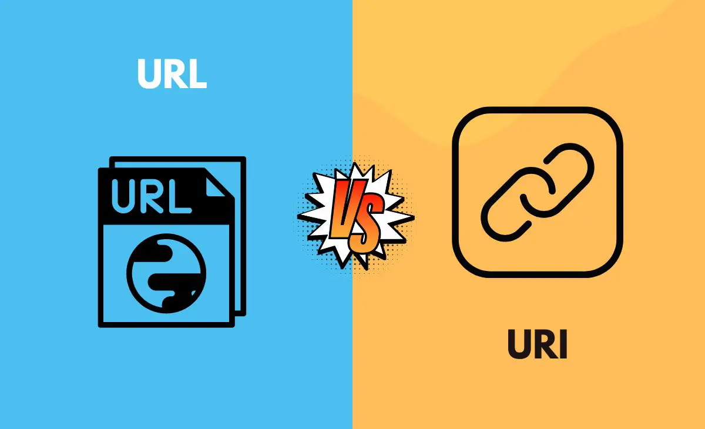

# URL vs URI

## 

互联网的使用因人而异，有些人用它进行研究，有些人则用来交换信息或数据。在我们浏览网站和网页时，常常会遇到 URL 和 URI 这两个术语。由于它们的发音相似，很多人对它们之间的区别并不清楚。

**URL（统一资源定位符）**和 **URI（统一资源标识符）**在网站的运行中都是不可或缺的，尽管它们常常被混用。

## 什么是 URL
**URI 可以同时表示资源的名称（URN）和位置（URL），而 URL 仅用于描述资源在互联网上的位置。**本文将比较和对比 URL 和 URI，并阐明它们之间的区别。

主要区别在于它们的功能。URI 用于标识资源的名称和位置，而 URL 是 URI 的一个子集，仅用于标识资源的位置。URL 不包含资源的名称或其他信息。它们在目的、使用场景和协议规范等方面也存在差异。

URL 是一种用于识别网页或网站位置的工具。每个网页或网站的地址可能因资源而异，**URL 的唯一目的是帮助用户找到目标资源。**用户只需点击 URL，即可访问相关内容。URL 代表“统一资源定位符”，通常由一串字符和地址组成，是在网络上查找信息的常用方式。

URL 包含协议描述，例如以 http 或 https 开头的 Web 资源，或以 ftp 开头的文件资源，甚至以 mailto 开头的电子邮件地址。URL 的主要部分用于协议，其余部分则指向具体资源，如网站名称或程序名称。

## 什么是 URI
URL 和 URN 是构成 URI 的两个**子集**，分别提供资源的位置和名称。**URI 是一串字符，通过资源的位置和/或名称来标识网络上的资源，允许以标准化的方式识别资源。**

URI 可以分为**定位器**、**名称**或**两者**，表明它可以描述 URL 和 / 或 URN。无论采用哪种方式，URI 中的“identifier”术语都突显了资源的重要性。

URI 的第一类是 URL，它定义了访问资源的方式，并包含资源名称和协议。URN 则需要与其他标识符具有全球唯一性，并具备国际影响力。

## 什么是 URN
**URN（统一资源名称）**是一种用于唯一标识资源的标准化方式。与 URL（统一资源定位符）不同，URN 主要关注资源的名称，而不是其位置。

URN 是一种用于标识特定资源的工具，旨在提供一个长期有效的标识符。无论资源的存储位置如何变化，URN 仍然可以用来唯一标识该资源。URN 通常属于特定的命名空间，例如 ISBN（国际标准书号）用于唯一标识书籍。

URN 的结构和格式可能因命名空间而异，但其核心目的是确保资源的唯一性和持久性。URN 在数字图书馆、学术出版和其他需要持久标识符的领域中非常有用，能够有效地支持资源的管理和引用。

URN 与 URL 和 URI的区别

主要区别在于它们的功能。URN 用于提供资源的持久性标识，而 URL 则用于描述资源在互联网上的位置。URN 不包含资源的访问路径或其他信息，因此它更关注资源的身份而非获取方式。

## **URL 和 URI 之间的区别**
| **比较参数** | **URL** | **URI** |
| --- | --- | --- |
| **代表** | 统一资源定位器也称为 URL。 | 统一资源的标识符。 |
| **包含/告诉** | 仅给出位置。 | URL 和 URN 包含在其子集中。 |
| **目标** | 定位多个地点。 | 可用资源的分类。 |
| **例** | https//:quoteslyfe.com  | ISBN 0-486-356757-4   |
| **用于** | 对 Internet 上的各种网站进行搜索。 | XML 和标记库。 |

## URI 和 URL 的关系
URI 是 URL 的父级，而 URL 是 URI 的子级。

可能有人会感到困惑，为什么 URL 包含 URI，反而是 URL 的子级呢？请注意，这里所说的是“级别”，而不是“包含”。

并不是说 URL 是 URI 的一部分，而是强调 URL 是其子级。

要理解这个概念，可以将其类比于 Java 的继承关系：URL 继承了 URI 的特性。从这个角度来看，理解起来就简单多了。

由于 URL 继承了 URI 的所有内容，因此它比 URI 更加详细，但 URI 仍然是其父级。

## **结论**
URI 和 URL 是与互联网密切相关的重要概念，由于它们之间的相似性，二者常常被互相替代和关联使用。

> 更新: 2024-10-06 21:15:44  
> 原文: <https://www.yuque.com/tulingzhouyu/db22bv/bcbdogqk962elhbz>