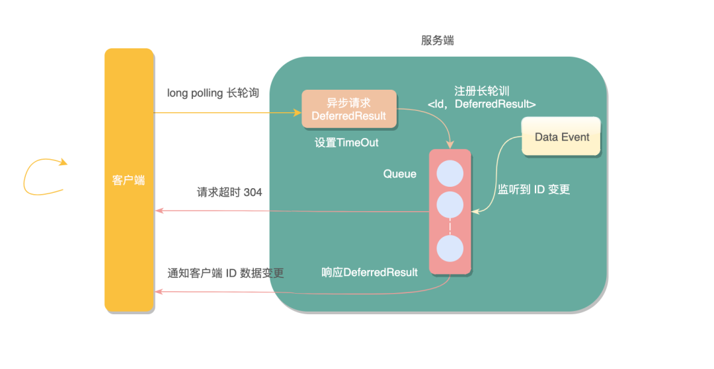
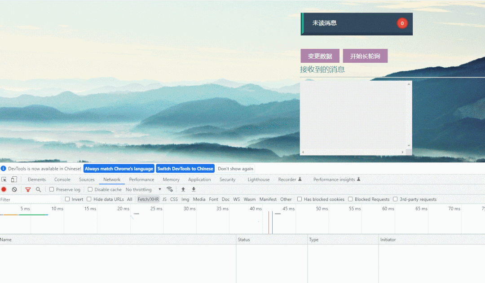
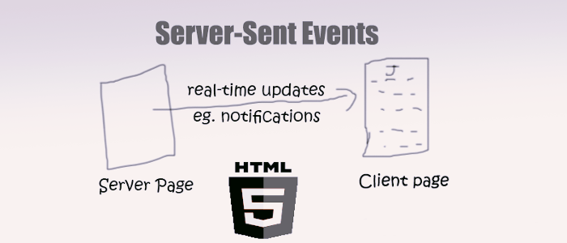
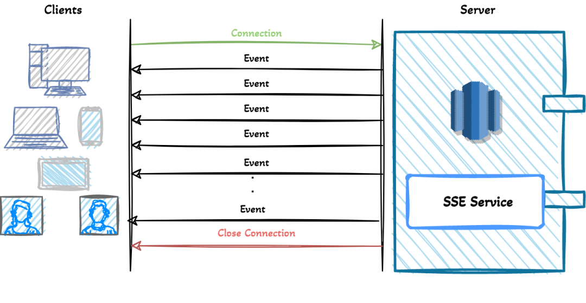
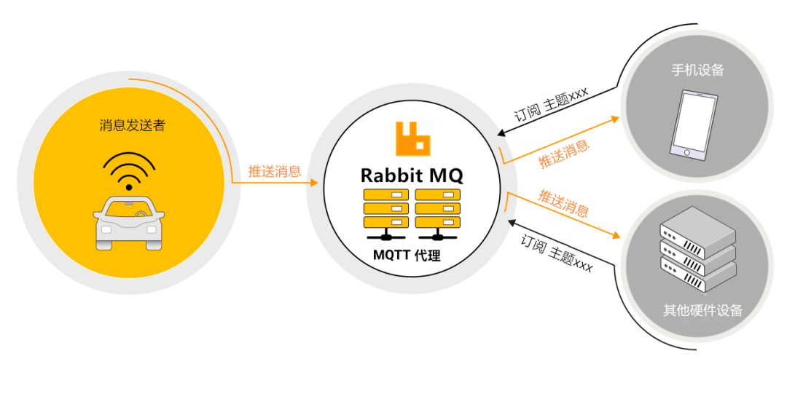
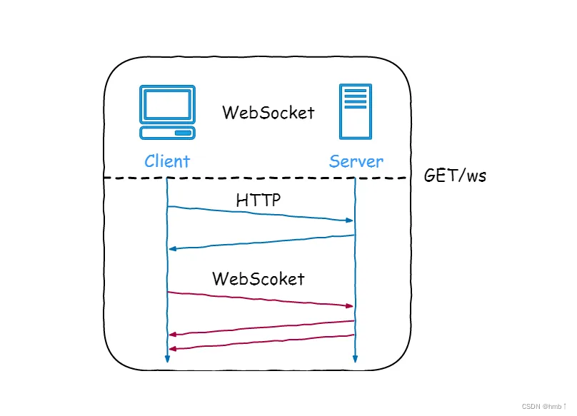
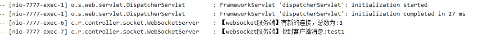
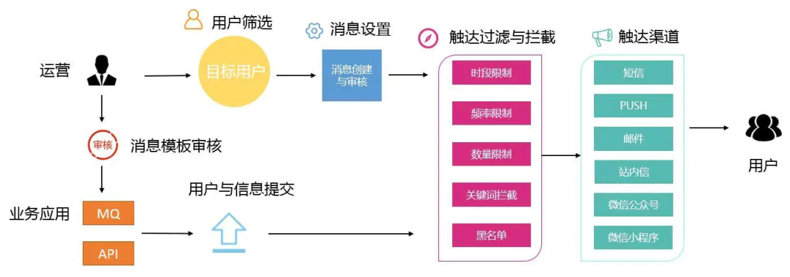
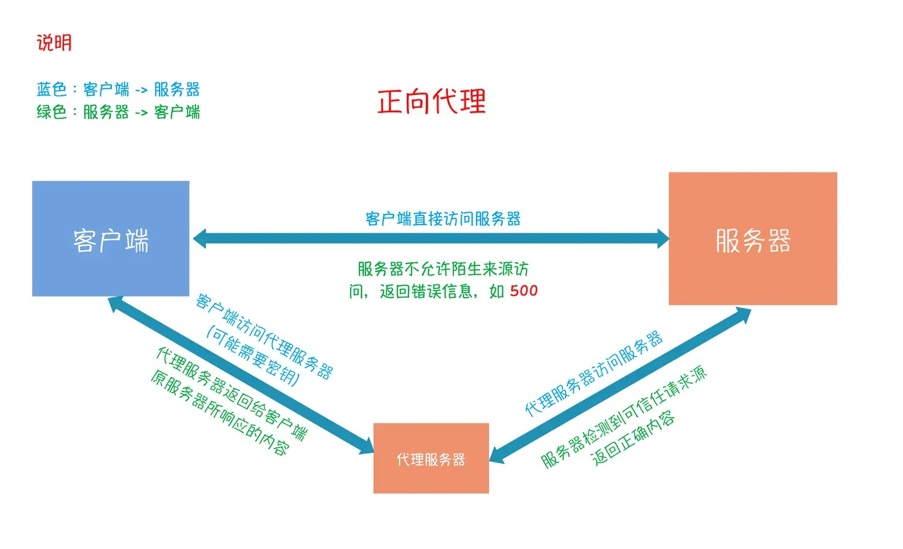
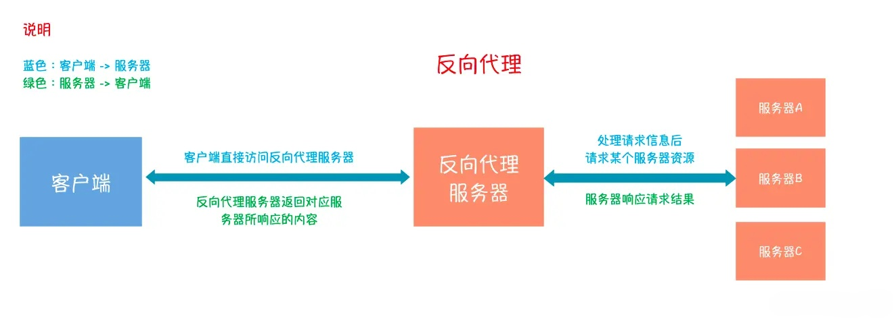

# 💎网络面试题集合

# <font style="color:#01B2BC;">实时消息推送的方案</font>
## 场景：
我们都遇到过这种场景：

1. 在刷短视频的时候当别人评论或者点赞了你的视频，系统会主动给你推送一条动态。


2. 在跟别人在线聊天的时候也需要实时感知到


 3. 在进行多人在线游戏的时候需要实时知道别人出的牌和释放的技能：


4.甚至在线下使用一些共享设备比如共享单车， 当在手机点击“开锁”，系统也会实时推送消息给共享单车进行开锁：


给大家介绍几个常见的实现方案：


## <font style="color:rgb(14, 136, 235);">Github地址</font>
<font style="color:black;">文中所提到的案例我都一一的做了实现</font>

<font style="color:rgb(14, 136, 235);"> </font>[<font style="color:rgb(14, 136, 235);">https://gitee.com/xscodeit/xushu_springboot_demos.git</font>](https://gitee.com/xscodeit/xushu_springboot_demos.git)

## <font style="color:#262626;">短轮询</font><font style="color:#262626;"></font>
<font style="color:black;">轮询(</font><font style="color:rgb(30, 107, 184);">polling</font><font style="color:black;">)应该是实现消息推送方案中最简单的一种，这里我们暂且将轮询分为</font><font style="color:rgb(30, 107, 184);">短轮询</font><font style="color:black;">和</font><font style="color:rgb(30, 107, 184);">长轮询</font><font style="color:black;">。</font><font style="color:black;">  
</font>

<font style="color:black;">短轮询很好理解，指定的时间间隔，由浏览器向服务器发出</font><font style="color:rgb(30, 107, 184);">HTTP</font><font style="color:black;">请求，服务器实时返回未读消息数据给客户端，浏览器再做渲染显示。</font>

<font style="color:black;">一个简单的JS定时器就可以搞定，每秒钟请求一次未读消息数接口，返回的数据展示即可。</font>

```plain
setInterval(() => {
  // 方法请求
  messageCount().then((res) => {
      if (res.code === 200) {
          this.messageCount = res.data
      }
  })
}, 1000);
```

<font style="color:black;">效果还是可以的，短轮询实现固然简单，缺点也是显而易见，由于推送数据并不会频繁变更，无论后端此时是否有新的消息产生，客户端都会进行请求，势必会对服务端造成很大压力，浪费带宽和服务器资源。</font>


## <font style="color:#262626;">长轮询</font><font style="color:#262626;"></font>
<font style="color:black;">长轮询是对上边短轮询的一种改进版本，在尽可能减少对服务器资源浪费的同时，保证消息的相对实时性。长轮询在中间件中应用的很广泛，比如</font><font style="color:rgb(30, 107, 184);">Nacos</font><font style="color:black;">和</font><font style="color:rgb(30, 107, 184);">apollo</font><font style="color:black;">配置中心，消息队列</font><font style="color:rgb(30, 107, 184);">kafka</font><font style="color:black;">、</font><font style="color:rgb(30, 107, 184);">RocketMQ</font><font style="color:black;">中都有用到长轮询。</font>

<font style="color:black;">这次我使用</font><font style="color:rgb(30, 107, 184);">apollo</font><font style="color:black;">配置中心实现长轮询的方式，应用了一个类</font><font style="color:rgb(30, 107, 184);">DeferredResult</font><font style="color:black;">，它是在</font><font style="color:rgb(30, 107, 184);">servelet3.0</font><font style="color:black;">后经过Spring封装提供的一种异步请求机制，直意就是延迟结果。</font>



<font style="color:rgb(30, 107, 184);">DeferredResult</font><font style="color:black;">可以允许容器线程快速释放占用的资源，不阻塞请求线程，以此接受更多的请求提升系统的吞吐量，然后启动异步工作线程处理真正的业务逻辑，处理完成调用</font><font style="color:rgb(30, 107, 184);">DeferredResult.setResult(200)</font><font style="color:black;">提交响应结果。</font>

<font style="color:black;">下边我们用长轮询来实现消息推送。</font>

<font style="color:black;">因为一个ID可能会被多个长轮询请求监听，所以我采用了</font><font style="color:rgb(30, 107, 184);">guava</font><font style="color:black;">包提供的</font><font style="color:rgb(30, 107, 184);">Multimap</font><font style="color:black;">结构存放长轮询，一个key可以对应多个value。一旦监听到key发生变化，对应的所有长轮询都会响应。前端得到非请求超时的状态码，知晓数据变更，主动查询未读消息数接口，更新页面数据。</font>

```plain
@Controller
@RequestMapping("/polling")
public class PollingController {

    // 存放监听某个Id的长轮询集合
    // 线程同步结构
    public static Multimap<String, DeferredResult<String>> watchRequests = Multimaps.synchronizedMultimap(HashMultimap.create());

    /**
     * 作者：徐庶
     * 设置监听
     */
    @GetMapping(path = "watch/{id}")
    @ResponseBody
    public DeferredResult<String> watch(@PathVariable String id) {
        // 延迟对象设置超时时间
        DeferredResult<String> deferredResult = new DeferredResult<>(TIME_OUT);
        // 异步请求完成时移除 key，防止内存溢出
        deferredResult.onCompletion(() -> {
            watchRequests.remove(id, deferredResult);
        });
        // 注册长轮询请求
        watchRequests.put(id, deferredResult);
        return deferredResult;
    }

    /**
     * 作者：徐庶
     * 变更数据
     */
    @GetMapping(path = "publish/{id}")
    @ResponseBody
    public String publish(@PathVariable String id) {
        // 数据变更 取出监听ID的所有长轮询请求，并一一响应处理
        if (watchRequests.containsKey(id)) {
            Collection<DeferredResult<String>> deferredResults = watchRequests.get(id);
            for (DeferredResult<String> deferredResult : deferredResults) {
                deferredResult.setResult("我更新了" + new Date());
            }
        }
        return "success";
    }
```

<font style="color:black;">当请求超过设置的超时时间，会抛出</font><font style="color:rgb(30, 107, 184);">AsyncRequestTimeoutException</font><font style="color:black;">异常，这里直接用</font><font style="color:rgb(30, 107, 184);">@ControllerAdvice</font><font style="color:black;">全局捕获统一返回即可，前端获取约定好的状态码后再次发起长轮询请求，如此往复调用。</font>

```plain
@ControllerAdvice
public class AsyncRequestTimeoutHandler {

    @ResponseStatus(HttpStatus.NOT_MODIFIED)
    @ResponseBody
    @ExceptionHandler(AsyncRequestTimeoutException.class)
    public String asyncRequestTimeoutHandler(AsyncRequestTimeoutException e) {
        System.out.println("异步请求超时");
        return "304";
    }
}
```

<font style="color:black;">我们来测试一下，首先页面发起长轮询请求</font><font style="color:rgb(30, 107, 184);">/polling/watch/10086</font><font style="color:black;">监听消息更变，请求被挂起，不变更数据直至超时，再次发起了长轮询请求；紧接着手动变更数据</font><font style="color:rgb(30, 107, 184);">/polling/publish/10086</font><font style="color:black;">，长轮询得到响应，前端处理业务逻辑完成后再次发起请求，如此循环往复。</font>



<font style="color:black;">长轮询相比于短轮询在性能上提升了很多，但依然会产生较多的请求，这是它的一点不完美的地方。</font>


## <font style="color:rgb(255, 255, 255);">SSE</font><font style="color:rgb(68, 153, 231);">  
</font>
<font style="color:black;">很多人可能不知道，服务端向客户端推送消息，其实除了可以用</font><font style="color:rgb(30, 107, 184);">WebSocket</font><font style="color:black;">这种耳熟能详的机制外，还有一种服务器发送事件(</font><font style="color:rgb(30, 107, 184);">Server-sent events</font><font style="color:black;">)，简称</font><font style="color:rgb(30, 107, 184);">SSE</font><font style="color:black;">。</font>

<font style="color:rgb(30, 107, 184);">SSE</font><font style="color:black;">它是基于</font><font style="color:rgb(30, 107, 184);">HTTP</font><font style="color:black;">协议的，我们知道一般意义上的HTTP协议是无法做到服务端主动向客户端推送消息的，但SSE是个例外，它变换了一种思路。</font>



<font style="color:black;">SSE在服务器和客户端之间打开一个单向通道，服务端响应的不再是一次性的数据包而是</font><font style="color:rgb(30, 107, 184);">text/event-stream</font><font style="color:black;">类型的数据流信息，在有数据变更时从服务器流式传输到客户端。</font>

<font style="color:black;">整体的实现思路有点类似于在线视频播放，视频流会连续不断的推送到浏览器，你也可以理解成，客户端在完成一次用时很长（网络不畅）的下载。</font>



<font style="color:rgb(30, 107, 184);">SSE</font><font style="color:black;">与</font><font style="color:rgb(30, 107, 184);">WebSocket</font><font style="color:black;">作用相似，都可以建立服务端与浏览器之间的通信，实现服务端向客户端推送消息，但还是有些许不同：</font>

+ **<font style="color:rgb(1, 1, 1);">SSE 是基于HTTP协议的，它们不需要特殊的协议或服务器实现即可工作；</font>****<font style="color:rgb(30, 107, 184);">WebSocket</font>****<font style="color:rgb(1, 1, 1);">需单独服务器来处理协议。</font>**
+ **<font style="color:rgb(1, 1, 1);">SSE 单向通信，只能由服务端向客户端单向通信；webSocket全双工通信，即通信的双方可以同时发送和接受信息。</font>**
+ **<font style="color:rgb(1, 1, 1);">SSE 实现简单开发成本低，无需引入其他组件；WebSocket传输数据需做二次解析，开发门槛高一些。</font>**
+ **<font style="color:rgb(1, 1, 1);">SSE 默认支持断线重连；WebSocket则需要自己实现。</font>**
+ **<font style="color:rgb(1, 1, 1);">SSE 只能传送文本消息，二进制数据需要经过编码后传送；WebSocket默认支持传送二进制数据。</font>**

**<font style="color:rgb(14, 136, 235);">SSE 与 WebSocket 该如何选择？</font>**

**<font style="color:rgb(14, 136, 235);">“</font>**

<font style="color:rgb(14, 136, 235);">技术并没有好坏之分，只有哪个更合适</font>

<font style="color:black;">SSE好像一直不被大家所熟知，一部分原因是出现了WebSockets，这个提供了更丰富的协议来执行双向、全双工通信。对于游戏、即时通信以及需要双向近乎实时更新的场景，拥有双向通道更具吸引力。</font>

<font style="color:black;">但是，在某些情况下，不需要从客户端发送数据。而你只需要一些服务器操作的更新。比如：站内信、未读消息数、状态更新、股票行情、监控数量等场景，</font><font style="color:rgb(30, 107, 184);">SEE</font><font style="color:black;">不管是从实现的难易和成本上都更加有优势。此外，SSE 具有</font><font style="color:rgb(30, 107, 184);">WebSockets</font><font style="color:black;">在设计上缺乏的多种功能，例如：</font><font style="color:rgb(30, 107, 184);">自动重新连接</font><font style="color:black;">、</font><font style="color:rgb(30, 107, 184);">事件ID</font><font style="color:black;">和</font><font style="color:rgb(30, 107, 184);">发送任意事件</font><font style="color:black;">的能力。</font>

<font style="color:black;">前端只需进行一次HTTP请求，带上唯一ID，打开事件流，监听服务端推送的事件就可以了</font>

```plain
<script>
    let source = null;
    let userId = 7777
    if (window.EventSource) {
        // 建立连接
        source = new EventSource('http://localhost:7777/sse/sub/'+userId);
        setMessageInnerHTML("连接用户=" + userId);
        /**
         * 连接一旦建立，就会触发open事件
         * 另一种写法：source.onopen = function (event) {}
         */
        source.addEventListener('open', function (e) {
            setMessageInnerHTML("建立连接。。。");
        }, false);
        /**
         * 客户端收到服务器发来的数据
         * 另一种写法：source.onmessage = function (event) {}
         */
        source.addEventListener('message', function (e) {
            setMessageInnerHTML(e.data);
        });
    } else {
        setMessageInnerHTML("你的浏览器不支持SSE");
    }
</script>
```

<font style="color:black;">服务端的实现更简单，创建一个</font><font style="color:rgb(30, 107, 184);">SseEmitter</font><font style="color:black;">对象放入</font><font style="color:rgb(30, 107, 184);">sseEmitterMap</font><font style="color:black;">进行管理</font>

```plain
private static Map<String, SseEmitter> sseEmitterMap = new ConcurrentHashMap<>();

/**
 * 创建连接
 *
 * @date: 2022/7/12 14:51
 * @auther: 作者：徐庶
 */
public static SseEmitter connect(String userId) {
    try {
        // 设置超时时间，0表示不过期。默认30秒
        SseEmitter sseEmitter = new SseEmitter(0L);
        // 注册回调
        sseEmitter.onCompletion(completionCallBack(userId));
        sseEmitter.onError(errorCallBack(userId));
        sseEmitter.onTimeout(timeoutCallBack(userId));
        sseEmitterMap.put(userId, sseEmitter);
        count.getAndIncrement();
        return sseEmitter;
    } catch (Exception e) {
        log.info("创建新的sse连接异常，当前用户：{}", userId);
    }
    return null;
}

/**
 * 给指定用户发送消息
 *
 * @date: 2022/7/12 14:51
 * @auther: 作者：徐庶
 */
public static void sendMessage(String userId, String message) {

    if (sseEmitterMap.containsKey(userId)) {
        try {
            sseEmitterMap.get(userId).send(message);
        } catch (IOException e) {
            log.error("用户[{}]推送异常:{}", userId, e.getMessage());
            removeUser(userId);
        }
    }
}
```

<font style="color:black;">我们模拟服务端推送消息，看下客户端收到了消息，和我们预期的效果一致</font>

<font style="color:black;">。</font>

**<font style="color:rgb(14, 136, 235);">注意：</font>**<font style="color:black;"> SSE不支持</font><font style="color:rgb(30, 107, 184);">IE</font><font style="color:black;">浏览器，对其他主流浏览器兼容性做的还不错。</font>


## <font style="color:#262626;">MQTT</font><font style="color:#262626;"></font>
<font style="color:black;">什么是 MQTT协议？</font>

<font style="color:rgb(30, 107, 184);">MQTT</font><font style="color:black;"> </font><font style="color:black;">全称(Message Queue Telemetry Transport)：一种基于发布/订阅（</font><font style="color:rgb(30, 107, 184);">publish</font><font style="color:black;">/</font><font style="color:rgb(30, 107, 184);">subscribe</font><font style="color:black;">）模式的</font><font style="color:rgb(30, 107, 184);">轻量级</font><font style="color:black;">通讯协议，通过订阅相应的主题来获取消息，是物联网（</font><font style="color:rgb(30, 107, 184);">Internet of Thing</font><font style="color:black;">）中的一个标准传输协议。</font>

<font style="color:black;">该协议将消息的发布者（</font><font style="color:rgb(30, 107, 184);">publisher</font><font style="color:black;">）与订阅者（</font><font style="color:rgb(30, 107, 184);">subscriber</font><font style="color:black;">）进行分离，因此可以在不可靠的网络环境中，为远程连接的设备提供可靠的消息服务，使用方式与传统的MQ有点类似。</font>



<font style="color:rgb(30, 107, 184);">TCP</font><font style="color:black;">协议位于传输层，</font><font style="color:rgb(30, 107, 184);">MQTT</font><font style="color:black;"> </font><font style="color:black;">协议位于应用层，</font><font style="color:rgb(30, 107, 184);">MQTT</font><font style="color:black;"> </font><font style="color:black;">协议构建于</font><font style="color:rgb(30, 107, 184);">TCP/IP</font><font style="color:black;">协议上，也就是说只要支持</font><font style="color:rgb(30, 107, 184);">TCP/IP</font><font style="color:black;">协议栈的地方，都可以使用</font><font style="color:rgb(30, 107, 184);">MQTT</font><font style="color:black;">协议。</font>

<font style="color:black;">为什么要用 MQTT协议？</font>

<font style="color:rgb(30, 107, 184);">MQTT</font><font style="color:black;">协议为什么在物联网（IOT）中如此受偏爱？而不是其它协议，比如我们更为熟悉的</font><font style="color:black;"> </font><font style="color:rgb(30, 107, 184);">HTTP</font><font style="color:black;">协议呢？</font>

+ **<font style="color:black;">首先</font>****<font style="color:rgb(30, 107, 184);">HTTP</font>****<font style="color:black;">协议它是一种同步协议，客户端请求后需要等待服务器的响应。而在物联网（IOT）环境中，设备会很受制于环境的影响，比如带宽低、网络延迟高、网络通信不稳定等，显然异步消息协议更为适合</font>****<font style="color:rgb(30, 107, 184);">IOT</font>****<font style="color:black;">应用程序。</font>**
+ **<font style="color:rgb(30, 107, 184);">HTTP</font>****<font style="color:black;">是单向的，如果要获取消息客户端必须发起连接，而在物联网（IOT）应用程序中，设备或传感器往往都是客户端，这意味着它们无法被动地接收来自网络的命令。</font>**
+ **<font style="color:black;">通常需要将一条命令或者消息，发送到网络上的所有设备上。</font>****<font style="color:rgb(30, 107, 184);">HTTP</font>****<font style="color:black;">要实现这样的功能不但很困难，而且成本极高。</font>**

<font style="color:black;">具体的MQTT协议介绍和实践，这里我就不再赘述了，大家可以参考我之前的两篇文章，里边写的也都很详细了。</font>

<font style="color:black;">MQTT协议的介绍</font>

**<font style="color:black;">我也没想到 springboot + rabbitmq 做智能家居，会这么简单</font>**

<font style="color:black;">MQTT实现消息推送</font>

**<font style="color:black;">未读消息（小红点），前端 与 RabbitMQ 实时消息推送实践，贼简单~</font>**

## Websocket
<font style="color:rgb(30, 107, 184);">websocket</font><font style="color:black;">应该是大家都比较熟悉的一种实现消息推送的方式，上边我们在讲SSE的时候也和websocket进行过比较。</font>

<font style="color:black;">WebSocket是一种在</font><font style="color:rgb(30, 107, 184);">TCP</font><font style="color:black;">连接上进行全双工通信的协议，建立客户端和服务器之间的通信渠道。浏览器和服务器仅需一次握手，两者之间就直接可以创建持久性的连接，并进行双向数据传输。</font>



<font style="color:rgb(136, 136, 136);">图片源于网络</font>

<font style="color:black;">springboot整合websocket，先引入</font><font style="color:rgb(30, 107, 184);">websocket</font><font style="color:black;">相关的工具包，和SSE相比额外的开发成本。</font>

```plain
<!-- 引入websocket -->
<dependency>
    <groupId>org.springframework.boot</groupId>
    <artifactId>spring-boot-starter-websocket</artifactId>
</dependency>
```

<font style="color:black;">服务端使用</font><font style="color:rgb(30, 107, 184);">@ServerEndpoint</font><font style="color:black;">注解标注当前类为一个websocket服务器，客户端可以通过</font><font style="color:rgb(30, 107, 184);">ws://localhost:7777/webSocket/10086</font><font style="color:black;">来连接到WebSocket服务器端。</font>

```plain
@Component
@Slf4j
@ServerEndpoint("/websocket/{userId}")
public class WebSocketServer {
    //与某个客户端的连接会话，需要通过它来给客户端发送数据
    private Session session;
    private static final CopyOnWriteArraySet<WebSocketServer> webSockets = new CopyOnWriteArraySet<>();
    // 用来存在线连接数
    private static final Map<String, Session> sessionPool = new HashMap<String, Session>();
    /**
     * 作者：徐庶
     * 链接成功调用的方法
     */
    @OnOpen
    public void onOpen(Session session, @PathParam(value = "userId") String userId) {
        try {
            this.session = session;
            webSockets.add(this);
            sessionPool.put(userId, session);
            log.info("websocket消息: 有新的连接，总数为:" + webSockets.size());
        } catch (Exception e) {
        }
    }
    /**
     * 作者：徐庶
     * 收到客户端消息后调用的方法
     */
    @OnMessage
    public void onMessage(String message) {
        log.info("websocket消息: 收到客户端消息:" + message);
    }
    /**
     * 作者：徐庶
     * 此为单点消息
     */
    public void sendOneMessage(String userId, String message) {
        Session session = sessionPool.get(userId);
        if (session != null && session.isOpen()) {
            try {
                log.info("websocket消: 单点消息:" + message);
                session.getAsyncRemote().sendText(message);
            } catch (Exception e) {
                e.printStackTrace();
            }
        }
    }
}
```

<font style="color:black;">前端初始化打开WebSocket连接，并监听连接状态，接收服务端数据或向服务端发送数据。</font>

```plain
<script>
    var ws = new WebSocket('ws://localhost:7777/webSocket/10086');
    // 获取连接状态
    console.log('ws连接状态：' + ws.readyState);
    //监听是否连接成功
    ws.onopen = function () {
        console.log('ws连接状态：' + ws.readyState);
        //连接成功则发送一个数据
        ws.send('test1');
    }
    // 接听服务器发回的信息并处理展示
    ws.onmessage = function (data) {
        console.log('接收到来自服务器的消息：');
        console.log(data);
        //完成通信后关闭WebSocket连接
        ws.close();
    }
    // 监听连接关闭事件
    ws.onclose = function () {
        // 监听整个过程中websocket的状态
        console.log('ws连接状态：' + ws.readyState);
    }
    // 监听并处理error事件
    ws.onerror = function (error) {
        console.log(error);
    }
    function sendMessage() {
        var content = $("#message").val();
        $.ajax({
            url: '/socket/publish?userId=10086&message=' + content,
            type: 'GET',
            data: { "id": "7777", "content": content },
            success: function (data) {
                console.log(data)
            }
        })
    }
</script>
```

<font style="color:black;">页面初始化建立websocket连接，之后就可以进行双向通信了，效果还不错</font>




## <font style="color:#262626;">自定义推送</font><font style="color:#262626;"></font>
<font style="color:black;">上边我们给我出了6种方案的原理和代码实现，但在实际业务开发过程中，不能盲目的直接拿过来用，还是要结合自身系统业务的特点和实际场景来选择合适的方案。</font>

<font style="color:black;">推送最直接的方式就是使用第三推送平台，毕竟</font>**<font style="color:rgb(14, 136, 235);">钱能解决的需求都不是问题</font>**<font style="color:black;">，无需复杂的开发运维，直接可以使用，省时、省力、省心，像goEasy、极光推送都是很不错的三方服务商。</font>

<font style="color:black;">一般大型公司都有自研的消息推送平台，像我们本次实现的web站内信只是平台上的一个触点而已，短信、邮件、微信公众号、小程序凡是可以触达到用户的渠道都可以接入进来。</font>



<font style="color:rgb(136, 136, 136);">图片来源于网络</font>

<font style="color:black;">消息推送系统内部是相当复杂的，诸如消息内容的维护审核、圈定推送人群、触达过滤拦截（推送的规则频次、时段、数量、黑白名单、关键词等等）、推送失败补偿非常多的模块，技术上涉及到大数据量、高并发的场景也很多。所以我们今天的实现方式在这个庞大的系统面前只是小打小闹。</font>

# <font style="color:#01B2BC;">轻松搞懂IO多路复用</font>
## 什么是 IO 多路复用？
先说结论，IO 多路复用是一种在单个线程中管理多个 IO 操作的技术。它允许一个进程或线程监视多个文件描述符，并且在其中任何一个文件描述符就绪（可读、可写或异常）时执行相应的操作，而无需阻塞其他操作。

---

这样可能不太好理解，我们看看没有 IO 多路复用时，BIO NIO 是怎么处理的。

如果现在有 1W 个文件描述符：

+ **BIO 的处理逻辑**
    - <font style="color:rgb(51, 51, 51);">服务端采用单线程，当 accept 一个请求后，在 recv 或 send 调用阻塞时，将无法 accept 其他请求（必须等上一个请求处 recv 或 send 完），</font><font style="color:rgb(10, 191, 91);">无法处理并发。</font>
    - <font style="color:rgb(51, 51, 51);">服务端采用多线程，当 accept 一个请求后，开启线程进行 recv，可以完成并发处理，但随着请求数增加需要增加系统线程，</font><font style="color:rgb(10, 191, 91);">大量的线程占用很大的内存空间，并且线程切换会带来很大的开销，1W 个线程真正发生读写事件的线程数不会超过20%，每次  accept 都开一个线程也是一种资源浪费</font>
+ **NIO 的处理逻辑**
    - <font style="color:rgb(51, 51, 51);">服务器端当 accept 一个请求后，加入 fds 集合（文件描述符集合），每次轮询一遍 fds 集合 recv (非阻塞) 数据，没有数据则立即返回错误，</font><font style="color:rgb(10, 191, 91);">每次轮询所有 fd（包括没有发生读写事件的 fd ）会很浪费 cpu 资源</font>
+ **<font style="color:rgb(0, 0, 0);">IO多路复用处理逻辑</font>**
    - <font style="color:rgb(51, 51, 51);">服务器端采用单线程通过 select/epoll 等系统调用获取 fd 列表，遍历有事件的 fd 进行accept/recv/send，使其能</font><font style="color:rgb(10, 191, 91);">支持更多的并发连接请求。</font>
    - 相比于 BIO、NIO，IO 多路复用最大的区别就是**获取有事件的文件描述符方式发生了转变**，BIO，NIO 都是主动去轮询获取 fd，多路复用是将 **fd 都交给内核去监控**，当某个 fd 能够读写时由内核告知应用程序处理，这样就从**主动轮询变成了清闲的被动**了，通过这种方式现在就<font style="color:rgb(51, 51, 51);">可以一次处理多路 IO 了</font>**<font style="color:rgb(51, 51, 51);">。</font>**

---

<font style="color:rgb(36, 41, 47);">accept 用于建立连接，recv 用于接收客户端发送的数据，send 用于向客户端发送数据</font>

---

刚刚我们提到的 I/O 操作都是针对文件描述符的，那什么是文件描述符呢？

## 什么是文件描述符？
很简单，文件描述符其实就是一个数字而已，又或者可以理解为指针。

提到 I/O 操作就逃不过文件这个概念，在 Linux 中有一个很经典的说法 everything is file，一切皆文件，比如：文件IO、网络IO、管道IO 等等。那我们在进行 I/O 操作的时候，是怎么知道从哪个文件读数据，往哪个文件写数据的呢？这时候就是通过文件描述符来找到确切的文件。**<font style="color:rgb(51, 51, 51);">有了文件描述符，进程可以对文件一无所知</font>**<font style="color:rgb(51, 51, 51);">，比如文件在磁盘的什么位置、加载到内存中又是怎样管理的等等，这些信息统统交由操作系统打理，进程无需关心，操作系统只需要给进程一个文件描述符就足够了。</font>

# <font style="color:#01B2BC;">HTTP 和 RPC 接口区别</font>
<font style="color:rgb(21, 23, 26);">HTTP 与 RPC 接口是两种常见的接口通信协议。本文将会介绍它们的定义，区别和相同之处，应用场景。</font>

## <font style="color:rgb(21, 23, 26);">HTTP 接口</font>
HTTP 是一种应用层通信协议，它的主要作用是在服务器和 Web 浏览器之间进行数据传输。HTTP的核心是客户端向服务器发送请求，并等待服务器的响应。

+ 在 Web 应用中，HTTP 主要用于传输 HTML、CSS、JavaScript 等Web资源。
+ 在接口设计方面，HTTP 接口通常使用 RESTful 架构。RESTful 架构是一种设计风格，通过使用 HTTP 方法（如GET、POST、PUT、DELETE等）和统一资源标识符（URI）来定义资源和操作。采用 RESTful 架构可以使 HTTP 接口具有良好的可读性、可维护性和可扩展性。

## <font style="color:rgb(21, 23, 26);">RPC 接口</font>
RPC（Remote Procedure Call）是一种远程过程调用协议，它允许客户端应用程序通过网络调用远程服务器上的函数或过程。

+ RPC接口通常利用二进制协议进行通信，比如ProtoBuf、Thrift、Msgpack等。当然，也可以选择使用HTTP协议或TCP协议等其他方式。
+ 在接口设计方面，RPC接口通常使用接口定义语言（IDL）来描述。IDL是一种描述接口和数据结构的语言，它可以将接口和数据结构定义转换为多种编程语言，从而方便不同编程语言之间的接口通信。

## <font style="color:rgb(21, 23, 26);">HTTP 接口与 RPC 接口的区别和相同之处</font>
1. **<font style="color:rgb(21, 23, 26);">通信协议不同：</font>**<font style="color:rgb(21, 23, 26);">HTTP 使用文本协议，RPC 使用二进制协议。</font>
2. **<font style="color:rgb(21, 23, 26);">调用方式不同：</font>**<font style="color:rgb(21, 23, 26);">HTTP 接口通过 URL 进行调用，RPC 接口通过函数调用进行调用。</font>
3. **<font style="color:rgb(21, 23, 26);">参数传递方式不同：</font>**<font style="color:rgb(21, 23, 26);">HTTP 接口使用 URL 参数或者请求体进行参数传递，RPC 接口使用函数参数进行传递。</font>
4. **<font style="color:rgb(21, 23, 26);">接口描述方式不同：</font>**<font style="color:rgb(21, 23, 26);">HTTP 接口使用 RESTful 架构描述接口，RPC 接口使用接口定义语言（IDL）描述接口。</font>
5. **<font style="color:rgb(21, 23, 26);">性能表现不同：</font>**<font style="color:rgb(21, 23, 26);">RPC 接口通常比 HTTP 接口更快，因为它使用二进制协议进行通信，而且使用了一些性能优化技术，例如连接池、批处理等。此外，RPC 接口通常支持异步调用，可以更好地处理高并发场景。</font>

<font style="color:rgb(21, 23, 26);">HTTP 接口和 RPC 接口的相同之处在于，它们都是用于接口通信的协议。它们都需要定义接口、参数和返回值等信息，并通过网络进行通信。此外，它们都支持多种数据格式的编解码，可以根据需求进行灵活的选择。</font>

## <font style="color:rgb(21, 23, 26);">HTTP 接口和 RPC 接口的应用场景</font>
<font style="color:rgb(21, 23, 26);">HTTP 接口适用于 Web 应用程序和浏览器之间的通信。它通常用于传输 HTML、CSS、JavaScript 和其他 Web 资源，以及 RESTful 风格的 API 服务。</font>

<font style="color:rgb(21, 23, 26);">RPC 接口适用于分布式系统之间的通信。它可以在多种编程语言之间进行通信，支持多种协议和数据格式。RPC 接口通常用于处理高并发、高吞吐量的场景，例如大型的分布式计算、大数据处理等。</font>

# <font style="color:#01B2BC;">什么是正向代理与反向代理？</font>
## 什么是代理？
### 
代理是一种网络服务模式，它充当客户端和目标服务器之间的中介。在代理服务器的模型中，客户端不直接与目标服务器通信，而是将请求发送到代理服务器，然后代理服务器将请求转发给目标服务器。目标服务器的响应也通过代理服务器返回给客户端。

代理的主要作用包括：

1. 访问控制：代理可以控制对特定资源的访问，实施安全策略。
2. 性能优化：代理可以缓存常见请求的结果，减少服务器负载，加快响应速度。
3. 匿名性：代理可以隐藏客户端的真实身份，提供一定程度的匿名性。
4. 内容过滤：代理可以过滤请求和响应，例如屏蔽不良网站或数据。
5. 监控：代理可以监控网络流量，记录访问日志。

## 什么是反向代理？
### 
反向代理（Reverse Proxy）是代理服务器的另一种形式，它位于客户端与服务器之间，但是客户端通常不知道反向代理的存在。在这种模型中，客户端发起的请求首先到达反向代理服务器，然后反向代理服务器将请求转发到后端的一组服务器之一。服务器的响应再通过反向代理返回给客户端。

反向代理的主要作用包括：

1. 负载均衡：将请求分发到多个后端服务器，平衡负载。
2. 故障转移：在后端服务器发生故障时，自动将流量切换到健康的服务器。
3. SSL终端：处理SSL加密和解密，减轻后端服务器的负担。
4. 缓存静态内容：缓存不经常变化的内容，提高响应速度。
5. 访问控制：控制对后端服务器的访问。
6. 隐藏服务器细节：不向客户端暴露后端服务器的具体信息。

## 反向代理就是负载均衡吗？
虽然反向代理可以执行负载均衡的任务，但它们并不完全相同。负载均衡是一种将工作量（如网络流量）平均分配到多个服务器上的概念，以优化资源使用、最大化吞吐量、最小化响应时间，并避免过载任何单一服务器。

反向代理通常包含负载均衡的功能，但它提供更多额外的功能，如SSL终端、缓存、访问控制等。因此，可以说反向代理是一种多功能的网络服务，它包含了负载均衡的功能，但不限于此。

  
 


> 更新: 2024-06-21 21:36:58  
> 原文: <https://www.yuque.com/tulingzhouyu/db22bv/om32fi26bha6ufgm>