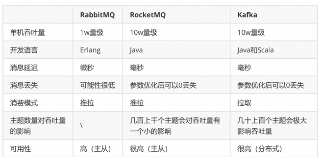
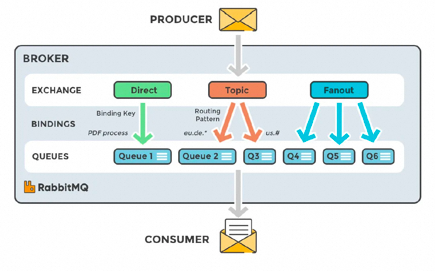
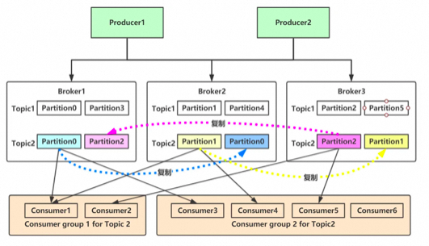
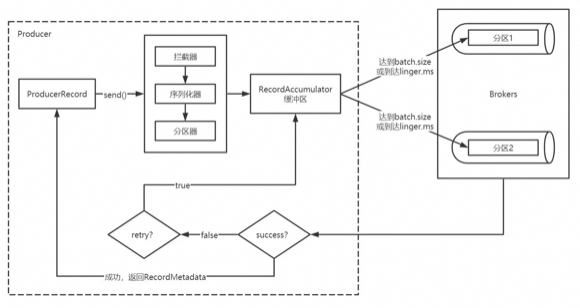
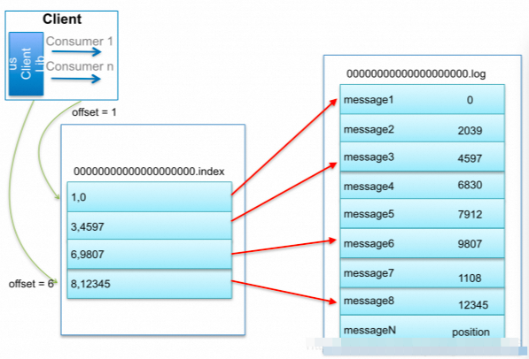
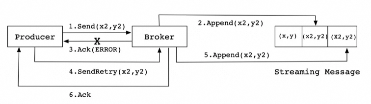
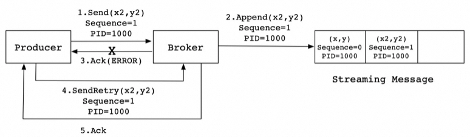
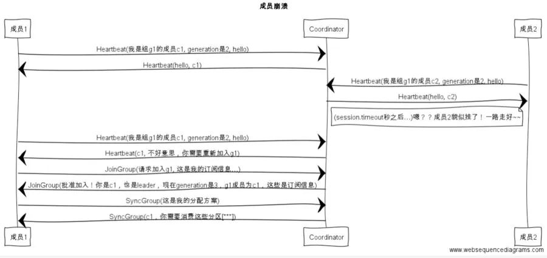

# Kafka篇

<font style="color:rgb(255, 129, 36);">Why kafka</font>

<font style="color:rgb(62, 62, 62);">消息队列的作用：</font>**<font style="color:rgb(62, 62, 62);">异步、削峰填谷、解耦</font>**

**<font style="color:rgb(62, 62, 62);">中小型公司</font>**<font style="color:rgb(62, 62, 62);">，技术挑战不是特别高，用 </font>**<font style="color:rgb(62, 62, 62);">RabbitMQ</font>**<font style="color:rgb(62, 62, 62);"> （开源、社区活跃）是不错的选择；大型公司，基础架构研发实力较强，用 </font>**<font style="color:rgb(62, 62, 62);">RocketMQ</font>**<font style="color:rgb(62, 62, 62);">（Java二次开发） 是很好的选择。</font>

<font style="color:rgb(62, 62, 62);">如果是</font>**<font style="color:rgb(62, 62, 62);">大数据领域</font>**<font style="color:rgb(62, 62, 62);">的实时计算、日志采集等场景，用 Kafka 是业内标准的，绝对没问题，社区活跃度很高，绝对不会黄，何况几乎是全世界这个领域的事实性规范。</font>



<font style="color:rgb(255, 104, 39);">RabbitMQ</font>

<font style="color:rgb(62, 62, 62);">RabbitMQ开始是用在电信业务的可靠通信的，也是少有的几款</font>**<font style="color:rgb(62, 62, 62);">支持AMQP</font>**<font style="color:rgb(62, 62, 62);">协议的产品之一。</font>

**<font style="color:rgb(62, 62, 62);">优点：</font>**

+ <font style="color:rgb(62, 62, 62);">轻量级，快速，部署使用方便</font>
+ <font style="color:rgb(62, 62, 62);">支持灵活的路由配置。RabbitMQ中，在生产者和队列之间有一个交换器模块。根据配置的路由规则，生产者发送的消息可以发送到不同的队列中。路由规则很灵活，还可以自己实现。</font>
+ <font style="color:rgb(62, 62, 62);">RabbitMQ的客户端支持大多数的编程语言，支持AMQP协议。</font>



**<font style="color:rgb(62, 62, 62);">缺点：</font>**

+ <font style="color:rgb(62, 62, 62);">如果有大量消息堆积在队列中，性能会急剧下降</font>
+ <font style="color:rgb(62, 62, 62);">每秒处理几万到几十万的消息。如果应用要求高的性能，不要选择RabbitMQ。 </font>
+ <font style="color:rgb(62, 62, 62);">RabbitMQ是Erlang开发的，功能扩展和二次开发代价很高。</font>

<font style="color:rgb(255, 104, 39);">RocketMQ</font>

<font style="color:rgb(62, 62, 62);">借鉴了Kafka的设计并做了很多改进，</font>**<font style="color:rgb(62, 62, 62);">几乎具备了消息队列应该具备的所有特性和功能。</font>**

+ <font style="color:rgb(62, 62, 62);">RocketMQ主要用于有序，事务，流计算，消息推送，日志流处理，binlog分发等场景。</font>
+ <font style="color:rgb(62, 62, 62);">经过了历次的双11考验，性能，稳定性可靠性没的说。</font>
+ <font style="color:rgb(62, 62, 62);">java开发，阅读源代码、扩展、二次开发很方便。</font>
+ <font style="color:rgb(62, 62, 62);">对电商领域的响应延迟做了很多优化。</font>
+ <font style="color:rgb(62, 62, 62);">每秒处理几十万的消息，同时响应在毫秒级。如果应用很关注响应时间，可以使用RocketMQ。</font>
+ <font style="color:rgb(62, 62, 62);">性能比RabbitMQ高一个数量级。</font>
+ <font style="color:rgb(62, 62, 62);">支持死信队列，DLX 是一个非常有用的特性。它可以处理</font>**<font style="color:rgb(62, 62, 62);">异常情况下，消息不能够被消费者正确消费而被置入死信队列中</font>**<font style="color:rgb(62, 62, 62);">的情况，后续分析程序可以通过消费这个死信队列中的内容来分析当时所遇到的异常情况，进而可以</font>**<font style="color:rgb(62, 62, 62);">改善和优化系统。</font>**

**<font style="color:rgb(62, 62, 62);">缺点：</font>**

<font style="color:rgb(62, 62, 62);">跟周边系统的整合和兼容不是很好。</font>

<font style="color:rgb(255, 104, 39);">Kafka</font>

**<font style="color:rgb(62, 62, 62);">高可用</font>**<font style="color:rgb(62, 62, 62);">，几乎所有相关的开源软件都支持，满足大多数的应用场景，尤其是大数据和流计算领域，</font>

+ <font style="color:rgb(62, 62, 62);">Kafka高效，可伸缩，消息持久化。支持分区、副本和容错。</font>
+ <font style="color:rgb(62, 62, 62);">对批处理和异步处理做了大量的设计，因此Kafka可以得到非常高的性能。</font>
+ <font style="color:rgb(62, 62, 62);">每秒处理几十万异步消息消息，如果开启了压缩，最终可以达到每秒处理2000w消息的级别。</font>
+ <font style="color:rgb(62, 62, 62);">但是由于是异步的和批处理的，延迟也会高，不适合电商场景。</font>

<font style="color:rgb(255, 129, 36);">What Kafka</font>

+ <font style="color:rgb(62, 62, 62);">Producer API：允许应用程序将记录流发布到一个或多个Kafka主题。</font>
+ <font style="color:rgb(62, 62, 62);">Consumer API：允许应用程序订阅一个或多个主题并处理为其生成的记录流。</font>
+ <font style="color:rgb(62, 62, 62);">Streams API：允许应用程序充当流处理器，将输入流转换为输出流。</font>



<font style="color:rgb(255, 104, 39);">消息Message</font>

<font style="color:rgb(62, 62, 62);">Kafka的数据单元称为消息。可以把消息看成是数据库里的一个“数据行”或一条“记录”。</font>

**<font style="color:rgb(62, 62, 62);">批次</font>**

<font style="color:rgb(62, 62, 62);">为了提高效率，消息被分批写入Kafka。提高吞吐量却加大了响应时间。</font>

**<font style="color:rgb(62, 62, 62);">主题Topic</font>**

<font style="color:rgb(62, 62, 62);">通过主题进行分类，类似数据库中的表。</font>

**<font style="color:rgb(62, 62, 62);">分区Partition</font>**

<font style="color:rgb(62, 62, 62);">Topic可以被分成若干分区分布于kafka集群中，方便扩容</font>

<font style="color:rgb(62, 62, 62);">单个分区内是有序的，partition设置为一才能保证全局有序</font>

**<font style="color:rgb(62, 62, 62);">副本Replicas</font>**

<font style="color:rgb(62, 62, 62);">每个主题被分为若干个分区，每个分区有多个副本。</font>

**<font style="color:rgb(62, 62, 62);">生产者Producer</font>**

<font style="color:rgb(62, 62, 62);">生产者在默认情况下把</font>**<font style="color:rgb(62, 62, 62);">消息均衡地分布</font>**<font style="color:rgb(62, 62, 62);">到主题的所有分区上：</font>

+ <font style="color:rgb(62, 62, 62);">直接指定消息的分区</font>
+ <font style="color:rgb(62, 62, 62);">根据消息的key散列取模得出分区</font>
+ <font style="color:rgb(62, 62, 62);">轮询指定分区。</font>

**<font style="color:rgb(62, 62, 62);">消费者Comsumer</font>**

<font style="color:rgb(62, 62, 62);">消费者通过</font>**<font style="color:rgb(62, 62, 62);">偏移量</font>**<font style="color:rgb(62, 62, 62);">来区分已经读过的消息，从而消费消息。把每个分区最后读取的消息偏移量保存在Zookeeper 或Kafka上，如果消费者关闭或重启，它的</font>**<font style="color:rgb(62, 62, 62);">读取状态不会丢失。</font>**

**<font style="color:rgb(62, 62, 62);">消费组ComsumerGroup</font>**

<font style="color:rgb(62, 62, 62);">消费组保证</font>**<font style="color:rgb(62, 62, 62);">每个分区只能被一个消费者</font>**<font style="color:rgb(62, 62, 62);">使用，避免重复消费。如果群组内一个消费者失效，消费组里的其他消费者可以</font>**<font style="color:rgb(62, 62, 62);">接管失效消费者的工作再平衡</font>**<font style="color:rgb(62, 62, 62);">，重新分区。</font>

**<font style="color:rgb(62, 62, 62);">节点Broker</font>**

<font style="color:rgb(62, 62, 62);">连接生产者和消费者，</font>**<font style="color:rgb(62, 62, 62);">单个broker可以轻松处理</font>**<font style="color:rgb(62, 62, 62);">数千个分区</font>**<font style="color:rgb(62, 62, 62);">以及</font>**<font style="color:rgb(62, 62, 62);">每秒百万级的消息量。</font>

+ <font style="color:rgb(62, 62, 62);">broker接收来自生产者的消息，为消息设置偏移量，并提交</font>**<font style="color:rgb(62, 62, 62);">消息到磁盘保存</font>**<font style="color:rgb(62, 62, 62);">。</font>
+ <font style="color:rgb(62, 62, 62);">broker为消费者提供服务，响应读取分区的请求，</font>**<font style="color:rgb(62, 62, 62);">返回已经提交到磁盘上的消息。</font>**

**<font style="color:rgb(62, 62, 62);">集群</font>**

<font style="color:rgb(62, 62, 62);">每隔分区都有一个</font>**<font style="color:rgb(62, 62, 62);">首领</font>**<font style="color:rgb(62, 62, 62);">，当分区被分配给多个broker时，会通过首领进行</font>**<font style="color:rgb(62, 62, 62);">分区复制。 </font>**

**<font style="color:rgb(62, 62, 62);">生产者Offset</font>**

<font style="color:rgb(62, 62, 62);">消息写入的时候，每一个分区都有一个offset，即每个分区的最新最大的offset。</font>

**<font style="color:rgb(62, 62, 62);">消费者Offset</font>**

<font style="color:rgb(62, 62, 62);">不同消费组中的消费者可以针对一个分区存储不同的Offset，互不影响。</font>

**<font style="color:rgb(62, 62, 62);">LogSegment</font>**

+ <font style="color:rgb(62, 62, 62);">一个分区由多个LogSegment组成，</font>
+ <font style="color:rgb(62, 62, 62);">一个LogSegment由</font><font style="color:rgb(136, 136, 136);background-color:rgb(245, 245, 245);">.log .index .timeindex</font><font style="color:rgb(62, 62, 62);">组成</font>
+ <font style="color:rgb(136, 136, 136);background-color:rgb(245, 245, 245);">.log</font><font style="color:rgb(62, 62, 62);">追加是顺序写入的，文件名是以文件中第一条message的offset来命名的</font>
+ <font style="color:rgb(136, 136, 136);background-color:rgb(245, 245, 245);">.Index</font><font style="color:rgb(62, 62, 62);">进行日志删除的时候和数据查找的时候可以快速定位。</font>
+ <font style="color:rgb(136, 136, 136);background-color:rgb(245, 245, 245);">.timeStamp</font><font style="color:rgb(62, 62, 62);">则根据</font>**<font style="color:rgb(62, 62, 62);">时间戳查找对应的偏移量</font>**<font style="color:rgb(62, 62, 62);">。</font>

<font style="color:rgb(255, 129, 36);">How Kafka</font>

**<font style="color:rgb(62, 62, 62);">优点</font>**

+ **<font style="color:rgb(62, 62, 62);">高吞吐量：</font>**<font style="color:rgb(62, 62, 62);">单机每秒处理几十上百万的消息量。即使存储了TB及消息，也保持稳定的性能。</font>
    - **<font style="color:rgb(62, 62, 62);">零拷贝</font>**<font style="color:rgb(62, 62, 62);"> 减少内核态到用户态的拷贝，磁盘通过sendfile实现</font>**<font style="color:rgb(62, 62, 62);">DMA</font>**<font style="color:rgb(62, 62, 62);"> 拷贝Socket buffer</font>
    - **<font style="color:rgb(62, 62, 62);">顺序读写</font>**<font style="color:rgb(62, 62, 62);"> 充分利用磁盘顺序读写的超高性能</font>
    - **<font style="color:rgb(62, 62, 62);">页缓存mmap</font>**<font style="color:rgb(62, 62, 62);">，将磁盘文件</font>**<font style="color:rgb(62, 62, 62);">映射</font>**<font style="color:rgb(62, 62, 62);">到内存, 用户通过修改内存就能修改磁盘文件。</font>
+ **<font style="color:rgb(62, 62, 62);">高性能：</font>**<font style="color:rgb(62, 62, 62);">单节点支持上千个客户端，并保证零停机和零数据丢失。</font>
+ **<font style="color:rgb(62, 62, 62);">持久化：</font>**<font style="color:rgb(62, 62, 62);">将消息持久化到磁盘。通过将数据持久化到硬盘以及replication防止数据丢失。</font>
+ **<font style="color:rgb(62, 62, 62);">分布式系统</font>**<font style="color:rgb(62, 62, 62);">，易扩展。所有的组件均为分布式的，无需停机即可扩展机器。</font>
+ **<font style="color:rgb(62, 62, 62);">可靠性</font>**<font style="color:rgb(62, 62, 62);"> - Kafka是分布式，分区，复制和容错的。</font>
+ **<font style="color:rgb(62, 62, 62);">客户端状态维护：</font>**<font style="color:rgb(62, 62, 62);">消息被处理的状态是在Consumer端维护，当失败时能自动平衡。</font>

**<font style="color:rgb(62, 62, 62);">应用场景</font>**

+ **<font style="color:rgb(62, 62, 62);">日志收集：</font>**<font style="color:rgb(62, 62, 62);">用Kafka可以收集各种服务的Log，通过大数据平台进行处理；</font>
+ **<font style="color:rgb(62, 62, 62);">消息系统：</font>**<font style="color:rgb(62, 62, 62);">解耦生产者和消费者、缓存消息等；</font>
+ **<font style="color:rgb(62, 62, 62);">用户活动跟踪：</font>**<font style="color:rgb(62, 62, 62);">Kafka经常被用来记录Web用户或者App用户的各种活动，如浏览网页、搜索、点击等活动，这些活动信息被各个服务器发布到Kafka的Topic中，然后消费者通过订阅这些Topic来做运营数据的实时的监控分析，也可保存到数据库；</font>

<font style="color:rgb(255, 129, 36);">生产消费基本流程</font>



1. <font style="color:rgb(62, 62, 62);">Producer创建时，会创建一个Sender线程并设置为守护线程。</font>
2. <font style="color:rgb(62, 62, 62);">生产的消息先经过拦截器->序列化器->分区器，然后将消息缓存在缓冲区。</font>
3. <font style="color:rgb(62, 62, 62);">批次发送的条件为：缓冲区数据大小达到</font>**<font style="color:rgb(62, 62, 62);">batch.size</font>**<font style="color:rgb(62, 62, 62);">或者</font>**<font style="color:rgb(62, 62, 62);">linger.ms</font>**<font style="color:rgb(62, 62, 62);">达到上限。</font>
4. <font style="color:rgb(62, 62, 62);">批次发送后，发往指定分区，然后落盘到broker；</font>
    - **<font style="color:rgb(62, 62, 62);">acks=0</font>**<font style="color:rgb(62, 62, 62);">只要将消息放到缓冲区，就认为消息已经发送完成。</font>
    - **<font style="color:rgb(62, 62, 62);">acks=1</font>**<font style="color:rgb(62, 62, 62);">表示消息</font>**<font style="color:rgb(62, 62, 62);">只需要写到主分区</font>**<font style="color:rgb(62, 62, 62);">即可。在该情形下，如果主分区收到消息确认之后就宕机了，而副本分区还没来得及同步该消息，则该消息丢失。</font>
    - **<font style="color:rgb(62, 62, 62);">acks=all （默认）</font>**<font style="color:rgb(62, 62, 62);">首领分区会等待</font>**<font style="color:rgb(62, 62, 62);">所有的ISR副本分区确认记录</font>**<font style="color:rgb(62, 62, 62);">。该处理保证了只要有一个ISR副本分区存活，消息就不会丢失。</font>
5. <font style="color:rgb(62, 62, 62);">如果生产者配置了</font>**<font style="color:rgb(62, 62, 62);">retrires参数大于0并且未收到确认</font>**<font style="color:rgb(62, 62, 62);">，那么客户端会对该消息进行重试。</font>
6. <font style="color:rgb(62, 62, 62);">落盘到broker成功，返回生产元数据给生产者。</font>

**<font style="color:rgb(62, 62, 62);">Leader选举</font>**

+ <font style="color:rgb(62, 62, 62);">Kafka会在Zookeeper上针对每个Topic维护一个称为ISR（in-sync replica）的集合；</font>
+ <font style="color:rgb(62, 62, 62);">当集合中副本都跟Leader中的副本同步了之后，kafka才会认为消息已提交；</font>
+ <font style="color:rgb(62, 62, 62);">只有这些跟Leader保持同步的Follower才应该被选作新的Leader；</font>
+ <font style="color:rgb(62, 62, 62);">假设某个topic有N+1个副本，kafka可以容忍N个服务器不可用，冗余度较低</font><font style="color:rgb(62, 62, 62);">如果ISR中的副本都丢失了，则：</font>
    - <font style="color:rgb(62, 62, 62);">可以等待ISR中的副本任何一个恢复，接着对外提供服务，需要时间等待；</font>
    - <font style="color:rgb(62, 62, 62);">从OSR中选出一个副本做Leader副本，此时会造成数据丢失；</font>

**<font style="color:rgb(62, 62, 62);">副本消息同步</font>**

<font style="color:rgb(62, 62, 62);">首先，Follower 发送 FETCH 请求给 Leader。接着，Leader 会读取底层日志文件中的消 息数据，再更新它内存中的 Follower 副本的 LEO 值，更新为 FETCH 请求中的 fetchOffset 值。最后，尝试更新分区高水位值。Follower 接收到 FETCH 响应之后，会把消息写入到底层日志，接着更新 LEO 和 HW 值。</font>

**<font style="color:rgb(62, 62, 62);">相关概念：LEO和HW。</font>**

+ <font style="color:rgb(62, 62, 62);">LEO：即日志末端位移(log end offset)，记录了该副本日志中下一条消息的位移值。如果LEO=10，那么表示该副本保存了10条消息，位移值范围是[0, 9]。</font>
+ <font style="color:rgb(62, 62, 62);">HW：水位值HW（high watermark）即已备份位移。对于同一个副本对象而言，其HW值不会大于LEO值。小于等于HW值的所有消息都被认为是“已备份”的（replicated）。</font>

**<font style="color:rgb(62, 62, 62);">Rebalance</font>**

+ <font style="color:rgb(62, 62, 62);">组成员数量发生变化</font>
+ <font style="color:rgb(62, 62, 62);">订阅主题数量发生变化</font>
+ <font style="color:rgb(62, 62, 62);">订阅主题的分区数发生变化</font>

<font style="color:rgb(62, 62, 62);">leader选举完成后，当以上三种情况发生时，Leader根据配置的</font>**<font style="color:rgb(62, 62, 62);">RangeAssignor</font>**<font style="color:rgb(62, 62, 62);">开始分配消费方案，即哪个consumer负责消费哪些topic的哪些partition。一旦完成分配，leader会将这个方案封装进</font>**<font style="color:rgb(62, 62, 62);">SyncGroup</font>**<font style="color:rgb(62, 62, 62);">请求中发给coordinator，非leader也会发SyncGroup请求，只是内容为空。coordinator接收到分配方案之后会把方案塞进SyncGroup的response中发给各个consumer。这样组内的所有成员就都知道自己应该消费哪些分区了。</font>

**<font style="color:rgb(62, 62, 62);">分区分配算法RangeAssignor</font>**

+ <font style="color:rgb(62, 62, 62);">原理是按照消费者总数和分区总数进行整除运算平均分配给所有的消费者；</font>
+ <font style="color:rgb(62, 62, 62);">订阅Topic的消费者按照名称的字典序排序，分均分配，剩下的字典序从前往后分配；</font>

**<font style="color:rgb(62, 62, 62);">增删改查</font>**

```plain
kafka-topics.sh --zookeeper localhost:2181/myKafka --create --topic topic_x                                 --partitions 1 --replication-factor 1kafka-topics.sh --zookeeper localhost:2181/myKafka --delete --topic topic_xkafka-topics.sh --zookeeper localhost:2181/myKafka --alter --topic topic_x                                --config max.message.bytes=1048576kafka-topics.sh --zookeeper localhost:2181/myKafka --describe --topic topic_x
```

**<font style="color:rgb(62, 62, 62);">如何查看偏移量为23的消息？</font>**

<font style="color:rgb(62, 62, 62);">通过查询跳跃表</font><font style="color:rgb(136, 136, 136);background-color:rgb(245, 245, 245);">ConcurrentSkipListMap</font><font style="color:rgb(62, 62, 62);">，定位到在00000000000000000000.index ，通过二分法在偏移量索引文件中找到不大于 23 的</font>**<font style="color:rgb(62, 62, 62);">最大索引项</font>**<font style="color:rgb(62, 62, 62);">，即offset 20 那栏，然后从日志分段文件中的物理位置为320 开始顺序查找偏移量为 23 的消息。</font>



**<font style="color:rgb(62, 62, 62);">切分文件</font>**

+ **<font style="color:rgb(62, 62, 62);">大小分片</font>**<font style="color:rgb(62, 62, 62);"> 当前日志分段文件的大小超过了 broker 端参数 log.segment.bytes 配置的值；</font>
+ **<font style="color:rgb(62, 62, 62);">时间分片</font>**<font style="color:rgb(62, 62, 62);"> 当前日志分段中消息的最大时间戳与系统的时间戳的差值大于log.roll.ms配置的值；</font>
+ **<font style="color:rgb(62, 62, 62);">索引分片</font>**<font style="color:rgb(62, 62, 62);"> 偏移量或时间戳索引文件大小达到broker端 log.index.size.max.bytes配置的值；</font>
+ **<font style="color:rgb(62, 62, 62);">偏移分片</font>**<font style="color:rgb(62, 62, 62);"> 追加的消息的偏移量与当前日志分段的偏移量之间的差值大于 Integer.MAX_VALUE；</font>

<font style="color:rgb(255, 129, 36);">一致性</font>

<font style="color:rgb(255, 104, 39);">幂等性</font>

<font style="color:rgb(62, 62, 62);">保证在消息重发的时候，消费者不会重复处理。即使在</font>**<font style="color:rgb(62, 62, 62);">消费者收到重复消息的时候，重复处理</font>**<font style="color:rgb(62, 62, 62);">，也</font><font style="color:rgb(62, 62, 62);">要</font>**<font style="color:rgb(62, 62, 62);">保证最终结果的一致性</font>**<font style="color:rgb(62, 62, 62);">。所谓幂等性，数学概念就是：f(f(x)) = f(x)</font><font style="color:rgb(62, 62, 62);"> </font>



**<font style="color:rgb(62, 62, 62);">如何实现？</font>**

<font style="color:rgb(62, 62, 62);">添加唯一ID，类似于数据库的主键，用于唯一标记一个消息。</font>

```plain
ProducerID：#在每个新的Producer初始化时，会被分配一个唯一的PIDSequenceNumber：#对于每个PID发送数据的每个Topic都对应一个从0开始单调递增的SN值
```



**<font style="color:rgb(62, 62, 62);">如何选举</font>**

1. <font style="color:rgb(62, 62, 62);">使用 Zookeeper 的</font>**<font style="color:rgb(62, 62, 62);">分布式锁选举控制器</font>**<font style="color:rgb(62, 62, 62);">，并在节点加入集群或退出集群时通知控制器。</font>
2. <font style="color:rgb(62, 62, 62);">控制器负责在节点加入或离开集群时进行分区Leader选举。</font>
3. <font style="color:rgb(62, 62, 62);">控制器使用epoch</font><font style="color:rgb(136, 136, 136);background-color:rgb(245, 245, 245);">忽略小的纪元</font><font style="color:rgb(62, 62, 62);">来避免</font>**<font style="color:rgb(62, 62, 62);">脑裂</font>**<font style="color:rgb(62, 62, 62);">：两个节点同时认为自己是当前的控制器。</font>

<font style="color:rgb(255, 129, 36);">可用性</font>

+ <font style="color:rgb(62, 62, 62);">创建Topic的时候可以指定 --replication-factor 3 ，表示不超过broker的副本数</font>
+ <font style="color:rgb(62, 62, 62);">只有Leader是负责读写的节点，Follower定期地到Leader上Pull数据。</font>
+ <font style="color:rgb(62, 62, 62);">ISR是Leader负责维护的与其保持同步的Replica列表，即当前活跃的副本列表。如果一个Follow落后太多，Leader会将它从ISR中移除。选举时优先从ISR中挑选Follower。 </font>
+ <font style="color:rgb(62, 62, 62);">设置 acks=all 。Leader收到了ISR中所有Replica的ACK，才向Producer发送ACK。</font>

<font style="color:rgb(255, 129, 36);">面试题</font>

<font style="color:rgb(62, 62, 62);">  
</font>

**<font style="color:rgb(62, 62, 62);">线上问题rebalance</font>**

<font style="color:rgb(136, 136, 136);">因集群架构变动导致的消费组内重平衡，如果kafka集内节点较多，比如数百个，那重平衡可能会耗时导致</font>**<font style="color:rgb(136, 136, 136);">数分钟到数小时</font>**<font style="color:rgb(136, 136, 136);">，此时kafka基本处于不可用状态，对kafka的TPS影响极大。</font>

<font style="color:rgb(62, 62, 62);">产生的原因：</font>

+ <font style="color:rgb(62, 62, 62);">组成员数量发生变化</font>
+ <font style="color:rgb(62, 62, 62);">订阅主题数量发生变化</font>
+ <font style="color:rgb(62, 62, 62);">订阅主题的分区数发生变化</font>**<font style="color:rgb(62, 62, 62);">组成员崩溃和组成员主动离开是两个不同的场景。</font>**<font style="color:rgb(62, 62, 62);">因为在崩溃时成员并不会主动地告知coordinator此事，coordinator有可能需要一个完整的session.timeout周期(心跳周期)才能检测到这种崩溃，这必然会造成consumer的滞后。可以说离开组是主动地发起rebalance；而崩溃则是被动地发起rebalance。</font><font style="color:rgba(0, 0, 0, 0.9);">  
</font>
+ <font style="color:rgba(0, 0, 0, 0.9);">  
</font>

<font style="color:rgb(62, 62, 62);">解决方案：</font>


```plain
加大超时时间 session.timout.ms=6s加大心跳频率 heartbeat.interval.ms=2s增长推送间隔 max.poll.interval.ms=t+1 minutes
```

<font style="color:rgb(62, 62, 62);">  
</font>

**<font style="color:rgb(62, 62, 62);">ZooKeeper 的作用</font>**

<font style="color:rgb(62, 62, 62);">目前，Kafka 使用 ZooKeeper 存放集群元数据、成员管理、Controller 选举，以及其他一些管理类任务。之后，等 KIP-500 提案完成后，Kafka 将完全不再依赖于 ZooKeeper。</font>

+ **<font style="color:rgb(62, 62, 62);">存放元数据</font>**<font style="color:rgb(62, 62, 62);">是指主题分区的所有数据都保存在 ZooKeeper 中，其他“人”都要与它保持对齐。</font>
+ **<font style="color:rgb(62, 62, 62);">成员管理</font>**<font style="color:rgb(62, 62, 62);">是指 Broker 节点的注册、注销以及属性变更等 。</font>
+ **<font style="color:rgb(62, 62, 62);">Controller 选举</font>**<font style="color:rgb(62, 62, 62);">是指选举集群 Controller，包括但不限于主题删除、参数配置等。</font>

<font style="color:rgb(62, 62, 62);">一言以蔽之:</font>**<font style="color:rgb(62, 62, 62);">KIP-500 ，是使用社区自研的基于 Raft 的共识算法，实现 Controller 自选举。</font>**

<font style="color:rgb(62, 62, 62);">同样是存储元数据，这几年</font>**<font style="color:rgb(62, 62, 62);">基于Raft算法的etcd</font>**<font style="color:rgb(62, 62, 62);">认可度越来越高。</font>

<font style="color:rgb(62, 62, 62);">越来越多的系统开始用它保存关键数据。比如，</font>**<font style="color:rgb(62, 62, 62);">秒杀系统经常用它保存各节点信息</font>**<font style="color:rgb(62, 62, 62);">，以便控制消费 MQ 的服务数量。还有些</font>**<font style="color:rgb(62, 62, 62);">业务系统的配置数据</font>**<font style="color:rgb(62, 62, 62);">，也会通过 etcd 实时</font>**<font style="color:rgb(62, 62, 62);">同步给业务系统的各节点</font>**<font style="color:rgb(62, 62, 62);">，比如，秒杀管理后台会使用 etcd 将</font>**<font style="color:rgb(62, 62, 62);">秒杀活动的配置数据实时同步给秒杀 API 服务各节点。</font>**

<font style="color:rgb(62, 62, 62);">  
</font>

**<font style="color:rgb(62, 62, 62);">Replica副本的作用</font>**

**<font style="color:rgb(62, 62, 62);">Kafka 只有 Leader 副本才能 对外提供读写服务，响应 Clients 端的请求。Follower 副本只是采用拉(PULL)的方 式，被动地同步 Leader 副本中的数据，并且在 Leader 副本所在的 Broker 宕机后，随时准备应聘 Leader 副本。</font>**

+ **<font style="color:rgb(62, 62, 62);">自 Kafka 2.4 版本开始</font>**<font style="color:rgb(62, 62, 62);">，社区可以通过配置参数，允许 Follower 副本有限度地提供读服务。</font>
+ <font style="color:rgb(62, 62, 62);">之前确保一致性的主要手段是高水位机制， 但高水位值无法保证 Leader 连续变更场景下的数据一致性，因此，社区引入了</font>**<font style="color:rgb(62, 62, 62);"> Leader Epoch </font>**<font style="color:rgb(62, 62, 62);">机制，来修复高水位值的弊端。</font>

<font style="color:rgb(62, 62, 62);">  
</font>

**<font style="color:rgb(62, 62, 62);">为什么不支持读写分离?</font>**

+ **<font style="color:rgb(62, 62, 62);">自 Kafka 2.4 之后</font>**<font style="color:rgb(62, 62, 62);">，Kafka 提供了有限度的读写分离。</font>
+ **<font style="color:rgb(62, 62, 62);">场景不适用。</font>**<font style="color:rgb(62, 62, 62);">读写分离适用于那种读负载很大，而写操作相对不频繁的场景。</font>
+ **<font style="color:rgb(62, 62, 62);">同步机制。</font>**<font style="color:rgb(62, 62, 62);">Kafka 采用 PULL 方式实现 Follower 的同步，同时复制延迟较大。</font>

<font style="color:rgb(62, 62, 62);">  
</font>

**<font style="color:rgb(62, 62, 62);">如何防止重复消费</font>**

+ <font style="color:rgb(62, 62, 62);">代码层面每次消费需提交offset；</font>
+ <font style="color:rgb(62, 62, 62);">通过Mysql的</font>**<font style="color:rgb(62, 62, 62);">唯一键约束</font>**<font style="color:rgb(62, 62, 62);">，结合Redis查看</font>**<font style="color:rgb(62, 62, 62);">id是否被消费</font>**<font style="color:rgb(62, 62, 62);">，存Redis可以直接使用set方法；</font>
+ <font style="color:rgb(62, 62, 62);">量大且允许误判的情况下，使用布隆过滤器也可以；</font>

<font style="color:rgb(62, 62, 62);">  
</font>

**<font style="color:rgb(62, 62, 62);">如何保证数据不会丢失</font>**

+ **<font style="color:rgb(62, 62, 62);">生产者</font>**<font style="color:rgb(62, 62, 62);">生产消息可以通过comfirm配置</font>**<font style="color:rgb(62, 62, 62);">ack=all</font>**<font style="color:rgb(62, 62, 62);">解决；</font>
+ **<font style="color:rgb(62, 62, 62);">Broker</font>**<font style="color:rgb(62, 62, 62);">同步过程中leader宕机可以通过配置</font>**<font style="color:rgb(62, 62, 62);">ISR副本+重试</font>**<font style="color:rgb(62, 62, 62);">解决；</font>
+ **<font style="color:rgb(62, 62, 62);">消费者</font>**<font style="color:rgb(62, 62, 62);">丢失可以</font>**<font style="color:rgb(62, 62, 62);">关闭自动提交</font>**<font style="color:rgb(62, 62, 62);">offset功能，系统处理完成时提交offset；</font>

<font style="color:rgb(62, 62, 62);">  
</font>

**<font style="color:rgb(62, 62, 62);">如何保证顺序消费</font>**

+ <font style="color:rgb(62, 62, 62);">单 topic，单partition，单 consumer，单线程消费，吞吐量低，不推荐；</font>
+ **<font style="color:rgb(62, 62, 62);">如只需保证单key有序</font>**<font style="color:rgb(62, 62, 62);">，为每个key申请单独内存 queue，每个线程分别消费一个内存 queue 即可，这样就能保证单key（例如用户id、活动id）顺序性。</font>

<font style="color:rgb(62, 62, 62);">  
</font>

**<font style="color:rgb(62, 62, 62);">【线上】如何解决积压消费</font>**

+ **<font style="color:rgb(62, 62, 62);">修复consumer</font>**<font style="color:rgb(62, 62, 62);">，使其具备消费能力，并且扩容N台；</font>
+ <font style="color:rgb(62, 62, 62);">写一个</font>**<font style="color:rgb(62, 62, 62);">分发的程序</font>**<font style="color:rgb(62, 62, 62);">，将Topic均匀分发到临时Topic中；</font>
+ <font style="color:rgb(62, 62, 62);">同时</font>**<font style="color:rgb(62, 62, 62);">起N台consumer</font>**<font style="color:rgb(62, 62, 62);">，消费不同的</font>**<font style="color:rgb(62, 62, 62);">临时Topic；</font>**

<font style="color:rgb(62, 62, 62);">  
</font>

**<font style="color:rgb(62, 62, 62);">如何避免消息积压</font>**

+ <font style="color:rgb(62, 62, 62);">提高消费并行度</font>
+ <font style="color:rgb(62, 62, 62);">批量消费</font>
+ <font style="color:rgb(62, 62, 62);">减少组件IO的交互次数</font>
+ <font style="color:rgb(62, 62, 62);">优先级消费</font>


```plain
if (maxOffset - curOffset > 100000) {  // TODO 消息堆积情况的优先处理逻辑  // 未处理的消息可以选择丢弃或者打日志  return ConsumeConcurrentlyStatus.CONSUME_SUCCESS;}// TODO 正常消费过程return ConsumeConcurrentlyStatus.CONSUME_SUCCESS;
```

<font style="color:rgb(62, 62, 62);">  
</font>

**<font style="color:rgb(62, 62, 62);">如何设计消息队列</font>**

<font style="color:rgb(62, 62, 62);">需要支持快速水平扩容，broker+partition，partition放不同的机器上，增加机器时将数据根据topic做迁移，分布式需要考虑一致性、可用性、分区容错性</font>

+ **<font style="color:rgb(62, 62, 62);">一致性：</font>**<font style="color:rgb(62, 62, 62);">生产者的消息确认、消费者的幂等性、Broker的数据同步；</font>
+ **<font style="color:rgb(62, 62, 62);">可用性：</font>**<font style="color:rgb(62, 62, 62);">数据如何保证不丢不重、数据如何持久化、持久化时如何读写；</font>
+ **<font style="color:rgb(62, 62, 62);">分区容错：</font>**<font style="color:rgb(62, 62, 62);">采用何种选举机制、如何进行多副本同步；</font>
+ **<font style="color:rgb(62, 62, 62);">海量数据：</font>**<font style="color:rgb(62, 62, 62);">如何解决消息积压、海量Topic性能下降；</font>

<font style="color:rgb(62, 62, 62);">性能上，可以借鉴</font>**<font style="color:rgb(62, 62, 62);">时间轮、零拷贝、IO多路复用、顺序读写、压缩批处理</font>**<font style="color:rgb(62, 62, 62);">。</font>


> 更新: 2024-04-29 20:14:54  
> 原文: <https://www.yuque.com/tulingzhouyu/db22bv/cvwg6enm2flskiry>