# SpringCloud篇

<font style="color:rgb(255, 129, 36);">Why SpringCloud</font>

<font style="color:rgb(136, 136, 136);">Spring cloud 是一系列框架的有序集合。它利用 spring boot 的开发便利性巧妙地简化了分布式系统基础设施的开发，如</font>**<font style="color:rgb(136, 136, 136);">服务发现注册、配置中心、消息总线、负载均衡、断路器、数据监控</font>**<font style="color:rgb(136, 136, 136);">等，都可以用 spring boot 的开发风格做到一键启动和部署。</font>

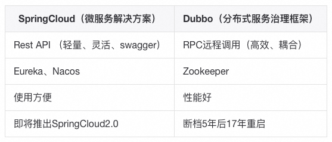

<font style="color:rgb(62, 62, 62);">SpringBoot是Spring推出用于解决传统框架配置文件冗余，装配组件繁杂的基于Maven的解决方案，</font>**<font style="color:rgb(62, 62, 62);">旨在快速搭建单个微服务</font>**<font style="color:rgb(62, 62, 62);">，SpringCloud是依赖于SpringBoot的，而SpringBoot并不是依赖与SpringCloud，甚至还可以和Dubbo进行优秀的整合开发。</font><font style="color:rgba(0, 0, 0, 0.9);">  
</font>

<font style="color:rgb(62, 62, 62);">MartinFlower 提出的微服务之间是通过RestFulApi进行通信，具体实现：</font>

+ <font style="color:rgb(62, 62, 62);">RestTemplate：基于HTTP协议；</font>
+ <font style="color:rgb(62, 62, 62);">Feign：封装了ribbon和</font>Hystrix<font style="color:rgb(62, 62, 62);"> </font><font style="color:rgb(62, 62, 62);">、RestTemplate 简化了客户端开发工作量；</font>
+ <font style="color:rgb(62, 62, 62);">RPC：基于TCP协议，序列化和传输效率提升明显；</font>
+ <font style="color:rgb(62, 62, 62);">MQ：异步解耦微服务之间的调用；</font>

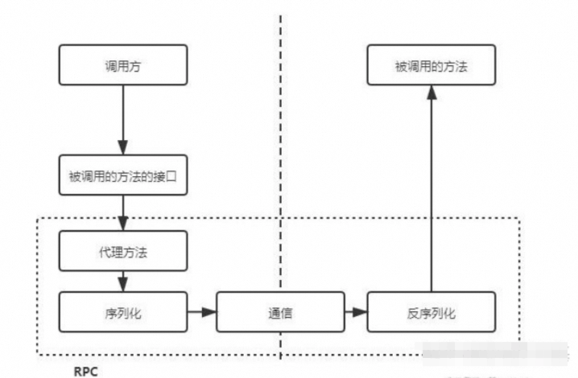

<font style="color:rgb(255, 129, 36);">Spring Boot</font>

<font style="color:rgb(136, 136, 136);">Spring Boot 通过</font>**<font style="color:rgb(136, 136, 136);">简单的步骤</font>**<font style="color:rgb(136, 136, 136);">就可以创建一个 Spring 应用。</font>

<font style="color:rgb(136, 136, 136);">Spring Boot 为 Spring 整合第三方框架提供了</font>**<font style="color:rgb(136, 136, 136);">开箱即用功能</font>**<font style="color:rgb(136, 136, 136);">。</font>

<font style="color:rgb(136, 136, 136);">Spring Boot 的核心思想是</font>**<font style="color:rgb(136, 136, 136);">约定大于配置</font>**<font style="color:rgb(136, 136, 136);">。</font>

**<font style="color:rgb(62, 62, 62);">Spring Boot 解决的问题</font>**

+ <font style="color:rgb(62, 62, 62);">搭建后端框架时需要手动添加 Maven 配置，涉及很多 XML 配置文件，增加了搭建难度和时间成本。</font>
+ <font style="color:rgb(62, 62, 62);">将项目编译成 war 包，部署到 Tomcat 中，项目部署依赖 Tomcat，这样非常不方便。</font>
+ <font style="color:rgb(62, 62, 62);">应用监控做的比较简单，通常都是通过一个没有任何逻辑的接口来判断应用的存活状态。</font>

**<font style="color:rgb(62, 62, 62);">Spring Boot 优点</font>**

**<font style="color:rgb(62, 62, 62);">自动装配：</font>**<font style="color:rgb(62, 62, 62);">Spring Boot 会根据某些规则对所有配置的 Bean 进行初始化。可以减少了很多重复性的工作。</font>

<font style="color:rgb(62, 62, 62);">比如使用 MongoDB 时，只需加入 MongoDB 的 Starter 包，然后配置 的连接信息，就可以直接使用 MongoTemplate 自动装配来操作数据库了。简化了 Maven Jar 包的依赖，降低了烦琐配置的出错几率。</font>

**<font style="color:rgb(62, 62, 62);">内嵌容器：</font>**<font style="color:rgb(62, 62, 62);">Spring Boot 应用程序可以不用部署到外部容器中，比如 Tomcat。</font>

<font style="color:rgb(62, 62, 62);">应用程序可以直接通过 Maven 命令编译成可执行的 jar 包，通过 java-jar 命令启动即可，非常方便。</font>

**<font style="color:rgb(62, 62, 62);">应用监控：</font>**<font style="color:rgb(62, 62, 62);">Spring Boot 中自带监控功能 Actuator，可以实现对程序内部运行情况进行监控。</font>

<font style="color:rgb(62, 62, 62);">比如 Bean 加载情况、环境变量、日志信息、线程信息等。当然也可以自定义跟业务相关的监控，通过Actuator 的端点信息进行暴露。</font>


```plain
spring-boot-starter-web          //用于快速构建基于 Spring MVC 的 Web 项目。spring-boot-starter-data-redis   //用于快速整合并操作 Redis。spring-boot-starter-data-mongodb //用于对 MongoDB 的集成。spring-boot-starter-data-jpa     //用于操作 MySQL。
```

```plain
自定义一个Starter
```

1. <font style="color:rgb(62, 62, 62);">创建 Starter 项目，定义 Starter 需要的配置（Properties）类，比如数据库的连接信息；</font>
2. <font style="color:rgb(62, 62, 62);">编写自动配置类，自动配置类就是获取配置，根据配置来自动装配 Bean；</font>
3. <font style="color:rgb(62, 62, 62);">编写 spring.factories 文件加载自动配置类，Spring 启动的时候会扫描 spring.factories 文件；</font>
4. <font style="color:rgb(62, 62, 62);">编写配置提示文件 spring-configuration-metadata.json（不是必须的），在添加配置的时候，我们想要知道具体的配置项是什么作用，可以通过编写提示文件来提示；</font>
5. <font style="color:rgb(62, 62, 62);">在项目中引入自定义 Starter 的 Maven 依赖，增加配置值后即可使用。</font>

**<font style="color:rgb(62, 62, 62);">Spring Boot Admin</font>**<font style="color:rgb(62, 62, 62);">（将 actuator 提供的数据进行可视化）</font>

+ <font style="color:rgb(62, 62, 62);">显示应用程序的监控状态、查看 JVM 和线程信息</font>
+ <font style="color:rgb(62, 62, 62);">应用程序上下线监控 </font>
+ <font style="color:rgb(62, 62, 62);">可视化的查看日志、动态切换日志级别</font>
+ <font style="color:rgb(62, 62, 62);">HTTP 请求信息跟踪等实用功能</font>

<font style="color:rgb(255, 129, 36);">GateWay / Zuul</font>

<font style="color:rgb(136, 136, 136);">GateWay⽬标是取代Netflflix Zuul，它基于Spring5.0+SpringBoot2.0+WebFlux等技术开发，提供</font>**<font style="color:rgb(136, 136, 136);">统⼀的路由</font>**<font style="color:rgb(136, 136, 136);">⽅式（反向代理）并且基于 </font>**<font style="color:rgb(136, 136, 136);">Filter</font>**<font style="color:rgb(136, 136, 136);">(定义过滤器对请求过滤，完成⼀些功能) 链的⽅式提供了⽹关基本的功能，例如：鉴权、流量控制、熔断、路径重写、⽇志监控。</font>

**<font style="color:rgb(62, 62, 62);">组成：</font>**

+ **<font style="color:rgb(62, 62, 62);">路由route：</font>**<font style="color:rgb(62, 62, 62);"> ⽹关最基础的⼯作单元。路由由⼀个ID、⼀个⽬标URL、⼀系列的断⾔（匹配条件判断）和Filter过滤器组成。如果断⾔为true，则匹配该路由。</font>
+ **<font style="color:rgb(62, 62, 62);">断⾔predicates：</font>**<font style="color:rgb(62, 62, 62);">参考了Java8中的断⾔Predicate，匹配Http请求中的所有内容（类似于nginx中的location匹配⼀样），如果断⾔与请求相匹配则路由。</font>
+ **<font style="color:rgb(62, 62, 62);">过滤器filter：</font>**<font style="color:rgb(62, 62, 62);">标准的Spring webFilter，使⽤过滤器在请求之前或者之后执⾏业务逻辑。</font><font style="color:rgb(62, 62, 62);">请求前</font><font style="color:rgb(136, 136, 136);background-color:rgb(245, 245, 245);">pre</font><font style="color:rgb(62, 62, 62);">类型过滤器：做</font>**<font style="color:rgb(62, 62, 62);">参数校验、权限校验、流量监控、⽇志输出、协议转换等；</font>**<font style="color:rgb(62, 62, 62);">请求前</font><font style="color:rgb(136, 136, 136);background-color:rgb(245, 245, 245);">post</font><font style="color:rgb(62, 62, 62);">类型的过滤器：做</font>**<font style="color:rgb(62, 62, 62);">响应内容、响应头</font>**<font style="color:rgb(62, 62, 62);">的修改、</font>**<font style="color:rgb(62, 62, 62);">⽇志的输出、流量监控</font>**<font style="color:rgb(62, 62, 62);">等。</font>

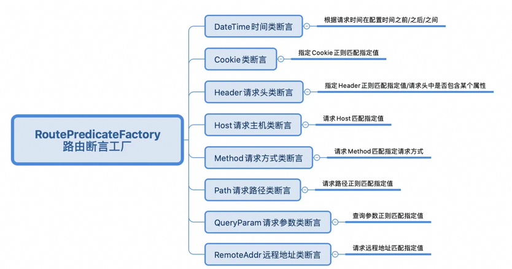

**<font style="color:rgb(62, 62, 62);">GateWayFilter </font>**<font style="color:rgb(62, 62, 62);">应⽤到单个路由路由上 、</font>**<font style="color:rgb(62, 62, 62);">GlobalFilter </font>**<font style="color:rgb(62, 62, 62);">应⽤到所有的路由上。</font>

<font style="color:rgb(255, 129, 36);">Eureka / Zookeeper</font>

<font style="color:rgb(136, 136, 136);">服务注册中⼼本质上是为了解耦服务提供者和服务消费者，为了⽀持弹性扩缩容特性，⼀个微服务的提供者的数量和分布往往是动态变化的。</font>


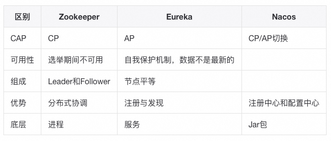

**<font style="color:rgb(62, 62, 62);">Eureka</font>**<font style="color:rgb(62, 62, 62);">通过</font>**<font style="color:rgb(62, 62, 62);">⼼跳检测、健康检查</font>**<font style="color:rgb(62, 62, 62);">和</font>**<font style="color:rgb(62, 62, 62);">客户端缓存</font>**<font style="color:rgb(62, 62, 62);">等机制，提⾼系统的灵活性、可伸缩性和可⽤性。</font>

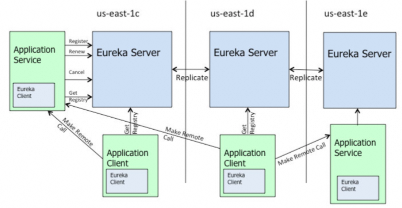

1. <font style="color:rgb(62, 62, 62);">us-east-1c、us-east-1d，us-east-1e代表不同的机房，</font>**<font style="color:rgb(62, 62, 62);">每⼀个Eureka Server都是⼀个集群；</font>**
2. <font style="color:rgb(62, 62, 62);">Service作为服务提供者向Eureka中注册服务，Eureka接受到注册事件会在</font>**<font style="color:rgb(62, 62, 62);">集群和分区中进⾏数据同步</font>**<font style="color:rgb(62, 62, 62);">，Client作为消费端（服务消费者）可以从Eureka中获取到服务注册信息，进⾏服务调⽤；</font>
3. <font style="color:rgb(62, 62, 62);">微服务启动后，会周期性地向Eureka</font>**<font style="color:rgb(62, 62, 62);">发送⼼跳</font>**<font style="color:rgb(62, 62, 62);">（默认周期为30秒）以续约⾃⼰的信息；</font>
4. <font style="color:rgb(62, 62, 62);">Eureka在⼀定时间内</font>**<font style="color:rgb(62, 62, 62);">（默认90秒）没有接收到</font>**<font style="color:rgb(62, 62, 62);">某个微服务节点的⼼跳，Eureka将会注销该微服务节点；</font>
5. <font style="color:rgb(62, 62, 62);">Eureka Client</font>**<font style="color:rgb(62, 62, 62);">会缓存Eureka Server中的信息</font>**<font style="color:rgb(62, 62, 62);">。即使所有的Eureka Server节点都宕掉，服务消费者依然可以使⽤缓存中的信息找到服务提供者；</font>

**<font style="color:rgb(62, 62, 62);">Eureka缓存</font>**

<font style="color:rgb(136, 136, 136);">新服务上线后，服务消费者不能立即访问到刚上线的新服务，需要过⼀段时间后才能访问？或是将服务下线后，服务还是会被调⽤到，⼀段时候后才彻底停⽌服务，访问前期会导致频繁报错！</font>

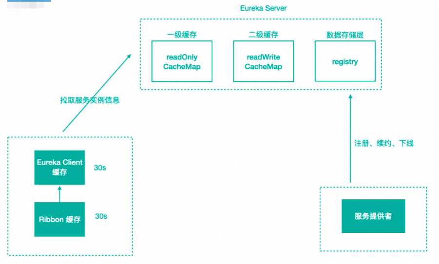

<font style="color:rgb(62, 62, 62);">服务注册到注册中⼼后，服务实例信息是</font>**<font style="color:rgb(62, 62, 62);">存储在Registry表</font>**<font style="color:rgb(62, 62, 62);">中的，也就是内存中。但Eureka为了提⾼响应速度，在内部做了优化，加⼊了两层的缓存结构，将Client需要的实例信息，直接缓存起来，获取的时候直接从缓存中拿数据然后响应给 Client。 </font>

+ <font style="color:rgb(62, 62, 62);">第⼀层缓存是</font>**<font style="color:rgb(62, 62, 62);">readOnlyCacheMap</font>**<font style="color:rgb(62, 62, 62);">，采⽤</font>**<font style="color:rgb(62, 62, 62);">ConcurrentHashMap</font>**<font style="color:rgb(62, 62, 62);">来存储数据的，主要负责定时与readWriteCacheMap进⾏数据同步，默认同步时间为 </font>**<font style="color:rgb(62, 62, 62);">30</font>**<font style="color:rgb(62, 62, 62);"> 秒⼀次。</font>
+ <font style="color:rgb(62, 62, 62);">第⼆层缓存是</font>**<font style="color:rgb(62, 62, 62);">readWriteCacheMap</font>**<font style="color:rgb(62, 62, 62);">，采⽤</font>**<font style="color:rgb(62, 62, 62);">Guava</font>**<font style="color:rgb(62, 62, 62);">来实现缓存。缓存过期时间默认为</font>**<font style="color:rgb(62, 62, 62);">180</font>**<font style="color:rgb(62, 62, 62);">秒，当服务</font>**<font style="color:rgb(62, 62, 62);">下线、过期、注册、状态变更</font>**<font style="color:rgb(62, 62, 62);">等操作都会清除此缓存中的数据。</font>
+ <font style="color:rgb(62, 62, 62);">如果两级缓存都无法查询，会</font>**<font style="color:rgb(62, 62, 62);">触发缓存的加载</font>**<font style="color:rgb(62, 62, 62);">，从存储层拉取数据到缓存中，然后再返回给 Client。</font><font style="color:rgb(62, 62, 62);">Eureka之所以设计⼆级缓存机制，也是为了</font>**<font style="color:rgb(62, 62, 62);">提⾼ Eureka Server 的响应速度，缺点是缓存会导致 Client获取不到最新的服务实例信息</font>**<font style="color:rgb(62, 62, 62);">，然后导致⽆法快速发现新的服务和已下线的服务。</font>

**<font style="color:rgb(62, 62, 62);">解决方案</font>**

+ <font style="color:rgb(62, 62, 62);">我们可以</font>**<font style="color:rgb(62, 62, 62);">缩短读缓存的更新时间</font>**<font style="color:rgb(62, 62, 62);">让服务发现变得更加及时，或者</font>**<font style="color:rgb(62, 62, 62);">直接将只读缓存关闭</font>**<font style="color:rgb(62, 62, 62);">，同时可以缩短客户端如ribbon服务的定时刷新间隔，多级缓存也导致C层⾯（数据⼀致性）很薄弱。</font>
+ <font style="color:rgb(62, 62, 62);">Eureka Server 中会有</font>**<font style="color:rgb(62, 62, 62);">定时任务去检测失效</font>**<font style="color:rgb(62, 62, 62);">的服务，将服务实例信息从注册表中移除，也可以将这个失效检测的时间缩短，这样服务下线后就能够及时从注册表中清除。</font>

**<font style="color:rgb(62, 62, 62);">自我保护机制开启条件</font>**

+ <font style="color:rgb(62, 62, 62);">期望最小每分钟能够续租的次数（实例* 频率 * 比例==10* 2 *0.85）</font>
+ <font style="color:rgb(62, 62, 62);">期望的服务实例数量（10）</font>

**<font style="color:rgb(62, 62, 62);">健康检查</font>**

+ <font style="color:rgb(62, 62, 62);">Eureka Client 会定时发送心跳给 Eureka Server 来证明自己处于健康的状态；</font>
+ <font style="color:rgb(62, 62, 62);">集成SBA以后可以把所有健康状态信息一并返回给eureka；</font>

<font style="color:rgb(255, 129, 36);">Feign / Ribbon</font>

+ Feign<font style="color:rgb(62, 62, 62);"> </font><font style="color:rgb(62, 62, 62);">可以与 Eureka 和 Ribbon 组合使用以支持负载均衡；</font>
+ <font style="color:rgb(62, 62, 62);">Feign 可以与 Hystrix 组合使用，支持熔断回退；</font>
+ <font style="color:rgb(62, 62, 62);">Feign 可以与ProtoBuf实现快速的RPC调用；</font>

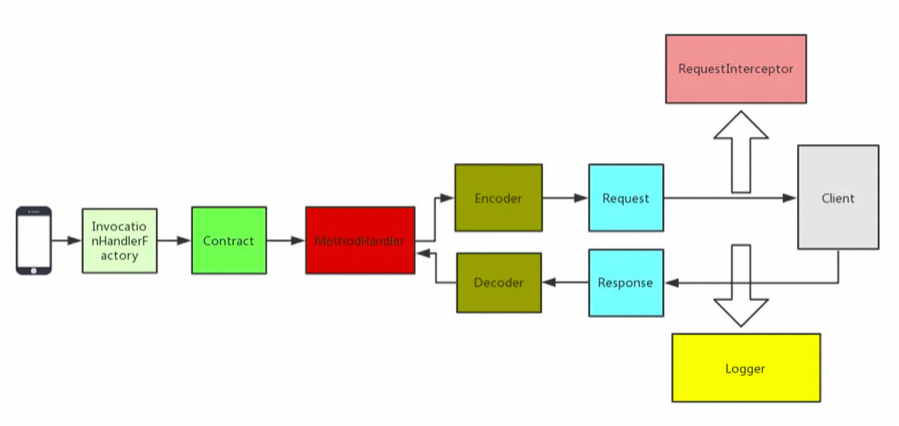

+ **<font style="color:rgb(62, 62, 62);">InvocationHandlerFactory 代理</font>**<font style="color:rgb(62, 62, 62);">采用 JDK 的动态代理方式生成代理对象，当我们调用这个接口，实际上是要去调用远程的 HTTP API；</font>
+ **<font style="color:rgb(62, 62, 62);">Contract 契约组件</font>**<font style="color:rgb(62, 62, 62);">比如请求类型是 GET 还是 POST，请求的 URI 是什么；</font>
+ **<font style="color:rgb(62, 62, 62);">Encoder 编码组件 \ Decoder 解码组件</font>**<font style="color:rgb(62, 62, 62);">通过该组件我们可以将请求信息采用指定的编码方式进行编解码后传输；</font>
+ **<font style="color:rgb(62, 62, 62);">Logger 日志记录</font>**<font style="color:rgb(62, 62, 62);">负责 Feign 中记录日志的，可以指定 Logger 的级别以及自定义日志的输出；</font>
+ **<font style="color:rgb(62, 62, 62);">Client 请求执行组件</font>**<font style="color:rgb(62, 62, 62);">负责 HTTP 请求执行的组件，Feign 中默认的 Client 是通过 JDK 的 HttpURLConnection 来发起请求的，在每次发送请求的时候，都会创建新的 HttpURLConnection 链接，Feign 的性能会很差，可以通过扩展该接口，使用 Apache HttpClient 等基于连接池的高性能 HTTP 客户端。</font>
+ **<font style="color:rgb(62, 62, 62);">Retryer 重试组件</font>**<font style="color:rgb(62, 62, 62);">负责重试的组件，Feign 内置了重试器，当 HTTP 请求出现 IO 异常时，Feign 会限定一个最大重试次数来进行重试操作。</font>
+ **<font style="color:rgb(62, 62, 62);">RequestInterceptor 请求拦截器</font>**<font style="color:rgb(62, 62, 62);">可以为 Feign 添加多个拦截器，在请求执行前设置一些扩展的参数信息。</font>

**<font style="color:rgb(62, 62, 62);">Feign最佳使用技巧</font>**

+ <font style="color:rgb(62, 62, 62);">继承特性</font>
+ <font style="color:rgb(62, 62, 62);">拦截器</font><font style="color:rgb(62, 62, 62);">比如添加指定的请求头信息，这个可以用在服务间传递某些信息的时候。</font>
+ <font style="color:rgb(62, 62, 62);">GET 请求多参数传递</font>
+ <font style="color:rgb(62, 62, 62);">日志配置</font><font style="color:rgb(62, 62, 62);">FULL 会输出全部完整的请求信息。</font>
+ <font style="color:rgb(62, 62, 62);">异常解码器</font><font style="color:rgb(62, 62, 62);">异常解码器中可以获取异常信息，而不是简单的一个code，然后转换成对应的异常对象返回。</font>
+ <font style="color:rgb(62, 62, 62);">源码查看是如何继承Hystrix</font><font style="color:rgb(62, 62, 62);">HystrixFeign.builder 中可以看到继承了 Feign 的 Builder，增加了 Hystrix的SetterFactory， build 方法里，对 invocationHandlerFactory 进行了重写， create 的时候</font>**<font style="color:rgb(62, 62, 62);">返回HystrixInvocationHandler</font>**<font style="color:rgb(62, 62, 62);">， 在 invoke 的时候</font>**<font style="color:rgb(62, 62, 62);">会将请求包装成 HystrixCommand 去执行</font>**<font style="color:rgb(62, 62, 62);">，这里就自然的集成了 Hystrix。</font>

**<font style="color:rgb(62, 62, 62);">Ribbon</font>**

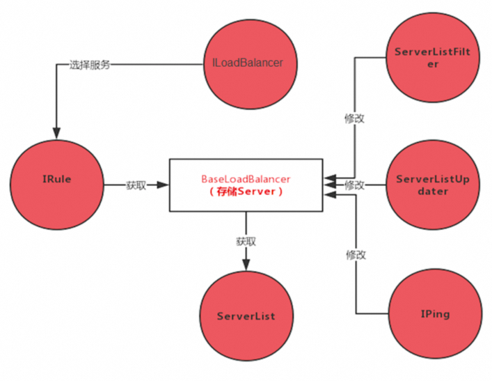

**<font style="color:rgb(62, 62, 62);">使用方式</font>**

+ **<font style="color:rgb(62, 62, 62);">原生 API</font>**<font style="color:rgb(62, 62, 62);">，Ribbon 是 Netflix 开源的，没有使用 Spring Cloud，需要使用 Ribbon 的原生 API；</font>
+ **<font style="color:rgb(62, 62, 62);">Ribbon + RestTemplate</font>**<font style="color:rgb(62, 62, 62);">，整合Spring Cloud 后，可以基于 RestTemplate 提供负载均衡的服务；</font>
+ **<font style="color:rgb(62, 62, 62);">Ribbon + Feign</font>**<font style="color:rgb(62, 62, 62);">；</font>

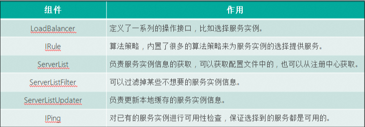

**<font style="color:rgb(62, 62, 62);">负载均衡算法</font>**

+ <font style="color:rgb(62, 62, 62);">RoundRobinRule 是</font>**<font style="color:rgb(62, 62, 62);">轮询的算法</font>**<font style="color:rgb(62, 62, 62);">，A和B轮流选择。</font>
+ <font style="color:rgb(62, 62, 62);">RandomRule 是</font>**<font style="color:rgb(62, 62, 62);">随机算法</font>**<font style="color:rgb(62, 62, 62);">，这个就比较简单了，在服务列表中随机选取。</font>
+ <font style="color:rgb(62, 62, 62);">BestAvailableRule 选择一个</font>**<font style="color:rgb(62, 62, 62);">最小的并发请求 server。</font>**

**<font style="color:rgb(62, 62, 62);">自定义负载均衡算法</font>**

+ <font style="color:rgb(62, 62, 62);">实现 Irule 接口</font>
+ <font style="color:rgb(62, 62, 62);">继承 AbstractLoadBalancerRule 类</font>

**<font style="color:rgb(62, 62, 62);">自定义负载均衡使用场景</font>**<font style="color:rgb(62, 62, 62);">（核心）</font>

+ **灰度发布**<font style="color:rgb(62, 62, 62);">灰度发布是能够平滑过渡的一种发布方式，在发布过程中，先发布一部分应用，让指定的用户使用刚发布的应用，等到测试没有问题后，再将其他的全部应用发布。如果新发布的有问题，只需要将这部分恢复即可，不用恢复所有的应用。</font>
+ **<font style="color:rgb(62, 62, 62);">多版本隔离</font>**<font style="color:rgb(62, 62, 62);">多版本隔离跟灰度发布类似，为了兼容或者过度，某些应用会有多个版本，这个时候如何保证 1.0 版本的客户端不会调用到 1.1 版本的服务，就是我们需要考虑的问题。</font>
+ **<font style="color:rgb(62, 62, 62);">故障隔离</font>**<font style="color:rgb(62, 62, 62);">当线上某个实例发生故障后，为了不影响用户，我们一般都会先留存证据，比如：线程信息、JVM 信息等，然后将这个实例重启或直接停止。然后线下根据一些信息分析故障原因，如果我能做到故障隔离，就可以直接将出问题的实例隔离，不让正常的用户请求访问到这个出问题的实例，只让指定的用户访问，这样就可以单独用特定的用户来对这个出问题的实例进行测试、故障分析等。</font>

<font style="color:rgb(255, 129, 36);">Hystrix / Sentinel</font>

**<font style="color:rgb(62, 62, 62);">服务雪崩场景</font>**

<font style="color:rgb(62, 62, 62);">自己即是服务消费者，同时也是服务提供者，同步调用等待结果导致资源耗尽。</font>

**<font style="color:rgb(62, 62, 62);">解决方案</font>**

<font style="color:rgb(62, 62, 62);">服务方：扩容、限流，排查代码问题，增加硬件监控；</font>

<font style="color:rgb(62, 62, 62);">消费方：使用Hystrix资源隔离，熔断降级，快速失败；</font>

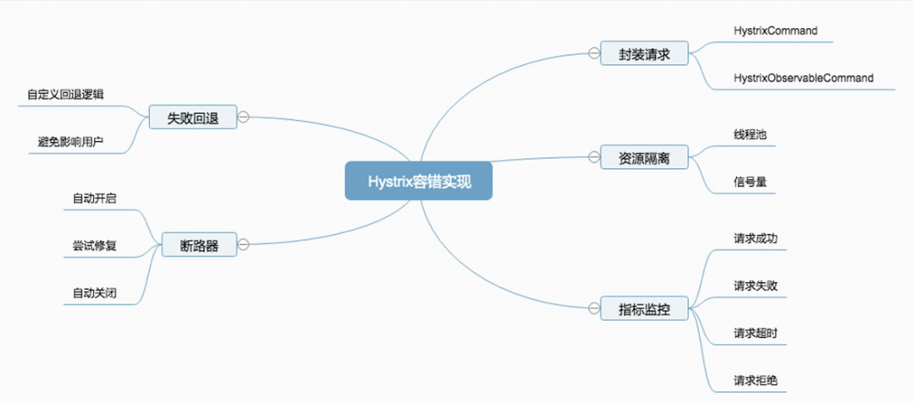

**<font style="color:rgb(62, 62, 62);">Hystrix断路保护器的作用</font>**

+ **<font style="color:rgb(62, 62, 62);">封装请求</font>**<font style="color:rgb(62, 62, 62);">会将用户的操作进行统一封装，统一封装的目的在于进行统一控制。</font>
+ **<font style="color:rgb(62, 62, 62);">资源隔离限流</font>**<font style="color:rgb(62, 62, 62);">会将对应的资源按照指定的类型进行隔离，比如</font>**<font style="color:rgb(62, 62, 62);">线程池</font>**<font style="color:rgb(62, 62, 62);">和</font>**<font style="color:rgb(62, 62, 62);">信号量</font>**<font style="color:rgb(62, 62, 62);">。</font>
    - <font style="color:rgb(62, 62, 62);">计数器限流，例如5秒内技术1000请求，超数后限流，未超数重新计数；</font>
    - <font style="color:rgb(62, 62, 62);">滑动窗口限流，解决计数器不够精确的问题，把一个窗口拆分多滚动窗口；</font>
    - <font style="color:rgb(62, 62, 62);">令牌桶限流，类似景区售票，售票的速度是固定的，拿到令牌才能去处理请求；</font>
    - <font style="color:rgb(62, 62, 62);">漏桶限流，生产者消费者模型，实现了恒定速度处理请求，能够绝对防止突发流量；</font>
+ **<font style="color:rgb(62, 62, 62);">失败回退</font>**<font style="color:rgb(62, 62, 62);">其实是一个备用的方案，就是说当请求失败后，有没有备用方案来满足这个请求的需求。</font>
+ **<font style="color:rgb(62, 62, 62);">断路器</font>**<font style="color:rgb(62, 62, 62);">这个是</font>**<font style="color:rgb(62, 62, 62);">最核心</font>**<font style="color:rgb(62, 62, 62);">的，，如果断路器处于打开的状态，那么所有请求都将失败，执行回退逻辑。如果断路器处于关闭状态，那么请求将会被正常执行。有些场景我们需要手动打开断路器强制降级。</font>
+ **<font style="color:rgb(62, 62, 62);">指标监控</font>**<font style="color:rgb(62, 62, 62);">会对请求的</font>**<font style="color:rgb(62, 62, 62);">生命周期进行监控</font>**<font style="color:rgb(62, 62, 62);">，请求成功、失败、超时、拒绝等状态，都会被监控起来。</font>

**<font style="color:rgb(62, 62, 62);">Hystrix使用上遇到的坑</font>**

+ <font style="color:rgb(62, 62, 62);">配置可以对接</font>**<font style="color:rgb(62, 62, 62);">配置中心</font>**<font style="color:rgb(62, 62, 62);">进行动态调整</font><font style="color:rgb(62, 62, 62);">Hystrix 的配置项非常多，如果不对接配置中心，所有的配置只能在代码里修改，在集群部署的难以应对紧急情况，我们项目只设置一个 CommandKey，其他的都在配置中心进行指定，紧急情况如需隔离部分请求时，只需在配置中心进行修改以后，强制更新即可。</font>
+ <font style="color:rgb(62, 62, 62);">回退逻辑中可以</font>**<font style="color:rgb(62, 62, 62);">手动埋点</font>**<font style="color:rgb(62, 62, 62);">或者通过</font>**<font style="color:rgb(62, 62, 62);">输出日志</font>**<font style="color:rgb(62, 62, 62);">进行告警</font><font style="color:rgb(62, 62, 62);">当请求失败或者超时，会执行回退逻辑，如果有大量的回退，则证明某些服务出问题了，这个时候我们可以在回退的逻辑中进行埋点操作，上报数据给监控系统，也可以输出回退的日志，统一由日志收集的程序去进行处理，这些方式都可以将问题暴露出去，然后通过实时数据分析进行告警操作。</font>
+ <font style="color:rgb(62, 62, 62);">用 </font>**<font style="color:rgb(62, 62, 62);">ThreadLocal</font>**<font style="color:rgb(62, 62, 62);">配合</font>**<font style="color:rgb(62, 62, 62);">线程池隔离</font>**<font style="color:rgb(62, 62, 62);">模式需当心</font><font style="color:rgb(62, 62, 62);">当我们用了线程池隔离模式的时候，被隔离的方法会包装成一个 Command 丢入到独立的线程池中进行执行，这个时候就是从 A 线程切换到了 B 线程，ThreadLocal 的数据就会丢失。</font>
+ **<font style="color:rgb(62, 62, 62);">Gateway中</font>**<font style="color:rgb(62, 62, 62);">多用信号量隔离</font><font style="color:rgb(62, 62, 62);">网关是所有请求的入口，路由的服务数量会很多，几十个到上百个都有可能，如果用线程池隔离，那么需要创建上百个独立的线程池，开销太大，用信号量隔离开销就小很多，还能起到限流的作用。</font>

<font style="color:rgb(62, 62, 62);">[^常见问题]: Hystrix的超时时间要⼤于Ribbon的超时时间，因为Hystrix将请求包装了起来，特别需要注意的是，如果Ribbon开启了重试机制，⽐如重试3 次，Ribbon 的超时为 1 秒，那么Hystrix 的超时时间应该⼤于 3 秒，否则就会出现 Ribbon 还在重试中，⽽ Hystrix 已经超时的现象。</font>

**<font style="color:rgb(62, 62, 62);">Sentinel</font>**

<font style="color:rgb(136, 136, 136);">Sentinel是⼀个⾯向云原⽣微服务的流量控制、熔断降级组件。</font>

<font style="color:rgb(136, 136, 136);">替代Hystrix，针对问题：服务雪崩、服务降级、服务熔断、服务限流</font>

<font style="color:rgb(62, 62, 62);">Hystrix区别：</font>

+ <font style="color:rgb(62, 62, 62);">独⽴可部署</font>Dashboard<font style="color:rgb(62, 62, 62);">（基于 Spring Boot 开发）控制台组件；</font>
+ <font style="color:rgb(62, 62, 62);">不依赖任何框架/库，减少代码开发，通过UI界⾯配置即可完成细粒度控制；</font>

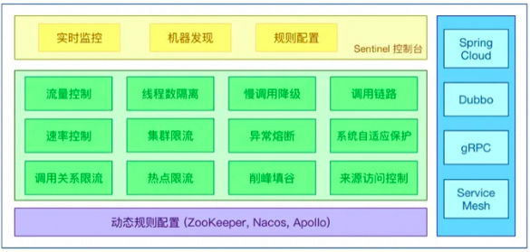

**<font style="color:rgb(62, 62, 62);">丰富的应⽤场景：</font>**<font style="color:rgb(62, 62, 62);">Sentinel 承接了阿⾥巴巴近 10 年的双⼗⼀⼤促流量的核⼼场景，例如秒杀、消息削峰填⾕、集群流量控制、实时熔断下游不可⽤应⽤等。</font>

**<font style="color:rgb(62, 62, 62);">完备的实时监控：</font>**<font style="color:rgb(62, 62, 62);">可以看到500 台以下规模的集群的汇总也可以看到单机的秒级数据。</font>

**<font style="color:rgb(62, 62, 62);">⼴泛的开源⽣态：</font>**<font style="color:rgb(62, 62, 62);">与 SpringCloud、Dubbo的整合。您只需要引⼊相应的依赖并进⾏简单的配置即可快速地接⼊ Sentinel。</font>

**<font style="color:rgb(62, 62, 62);">区别：</font>**

+ <font style="color:rgb(62, 62, 62);">Sentinel不会像Hystrix那样放过⼀个请求尝试⾃我修复，就是明明确确按照时间窗⼝来，熔断触发后，时间窗⼝内拒绝请求，时间窗⼝后就恢复。</font>
+ <font style="color:rgb(62, 62, 62);">Sentinel Dashboard中添加的规则数据存储在内存，微服务停掉规则数据就消失，在⽣产环境下不合适。可以将Sentinel规则数据持久化到Nacos配置中⼼，让微服务从Nacos获取。</font>

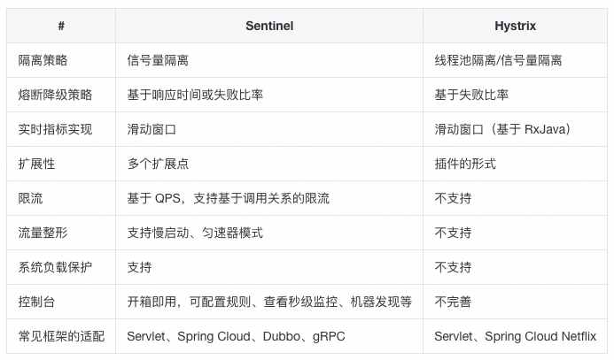

<font style="color:rgb(255, 129, 36);">Config / Nacos</font>

<font style="color:rgb(136, 136, 136);">Nacos是阿⾥巴巴开源的⼀个针对微服务架构中</font>**<font style="color:rgb(136, 136, 136);">服务发现、配置管理</font>**<font style="color:rgb(136, 136, 136);">和</font>**<font style="color:rgb(136, 136, 136);">服务管理平台</font>**<font style="color:rgb(136, 136, 136);">。</font>

<font style="color:rgb(136, 136, 136);">Nacos就是</font>**<font style="color:rgb(136, 136, 136);">注册中⼼+配置中⼼</font>**<font style="color:rgb(136, 136, 136);">的组合（Nacos=Eureka+Confifig+Bus）</font>

**<font style="color:rgb(62, 62, 62);">Nacos</font>**<font style="color:rgb(62, 62, 62);">功能特性</font>

+ <font style="color:rgb(62, 62, 62);">服务发现与健康检查</font>
+ <font style="color:rgb(62, 62, 62);">动态配置管理</font>
+ <font style="color:rgb(62, 62, 62);">动态DNS服务</font>
+ <font style="color:rgb(62, 62, 62);">服务和元数据管理</font>

**<font style="color:rgb(62, 62, 62);">保护阈值：</font>**

<font style="color:rgb(62, 62, 62);">当服务A健康实例数/总实例数 < 保护阈值 的时候，说明健康实例真的不多了，这个时候保护阈值会被触发（状态true），nacos将会把该服务所有的实例信息（健康的+不健康的）全部提供给消费者，消费者可能访问到不健康的实例，请求失败，但这样也⽐造成雪崩要好，牺牲了⼀些请求，保证了整个系统的⼀个可⽤。</font>

**<font style="color:rgb(62, 62, 62);">Nacos </font>**<font style="color:rgb(62, 62, 62);">数据模型（领域模型）</font>

+ **<font style="color:rgb(62, 62, 62);">Namespace</font>**<font style="color:rgb(62, 62, 62);"> 代表不同的环境，如开发dev、测试test、⽣产环境prod</font>
+ **<font style="color:rgb(62, 62, 62);">Group</font>**<font style="color:rgb(62, 62, 62);"> 代表某项⽬，⽐如爪哇云项⽬</font>
+ **<font style="color:rgb(62, 62, 62);">Service</font>**<font style="color:rgb(62, 62, 62);"> 某个项⽬中具体xxx服务</font>
+ **<font style="color:rgb(62, 62, 62);">DataId </font>**<font style="color:rgb(62, 62, 62);">某个项⽬中具体的xxx配置⽂件</font>

<font style="color:rgb(62, 62, 62);">可以通过 Spring Cloud 原⽣注解 </font><font style="color:rgb(136, 136, 136);background-color:rgb(245, 245, 245);">@RefreshScope</font><font style="color:rgb(62, 62, 62);"> 实现配置⾃动更新。</font>

<font style="color:rgb(255, 129, 36);">Bus / Stream</font>

<font style="color:rgb(136, 136, 136);">Spring Cloud Stream 消息驱动组件帮助我们更快速，更⽅便的去构建</font>**<font style="color:rgb(136, 136, 136);">消息驱动</font>**<font style="color:rgb(136, 136, 136);">微服务的；</font>

<font style="color:rgb(136, 136, 136);">本质：屏蔽掉了底层不同</font>**<font style="color:rgb(136, 136, 136);">MQ</font>**<font style="color:rgb(136, 136, 136);">消息中间件之间的差异，统⼀了</font>**<font style="color:rgb(136, 136, 136);">MQ</font>**<font style="color:rgb(136, 136, 136);">的编程模型，降低了学习、开发、维护</font>**<font style="color:rgb(136, 136, 136);">MQ</font>**<font style="color:rgb(136, 136, 136);">的成本，⽬前⽀持Rabbit、Kafka两种消息；</font>

<font style="color:rgb(255, 129, 36);">Sleuth / Zipkin</font>

**<font style="color:rgb(62, 62, 62);">全链路追踪</font>**

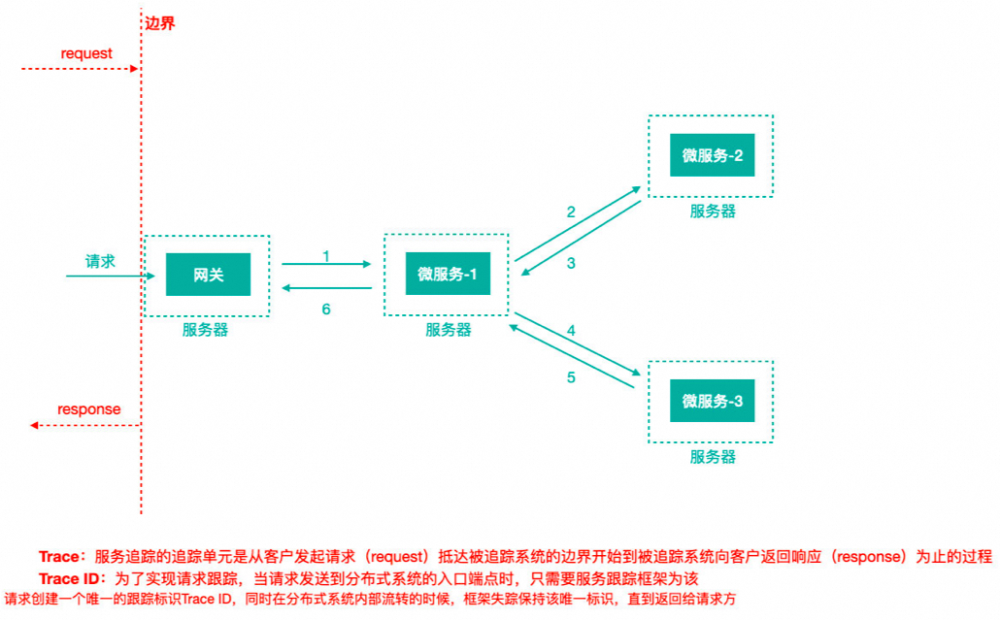

**<font style="color:rgb(62, 62, 62);">Trace ID：</font>**<font style="color:rgb(62, 62, 62);">当请求发送到分布式系统的⼊⼝端点时，Sleuth为该请求创建⼀个唯⼀的跟踪标识Trace ID，在分布式系统内部流转的时候，框架始终保持该唯⼀标识，直到返回给请求⽅；</font>

**<font style="color:rgb(62, 62, 62);">Span ID：</font>**<font style="color:rgb(62, 62, 62);">为了统计各处理单元的时间延迟，当请求到达各个服务组件时，也是通过⼀个唯⼀标识SpanID来标记它的开始，具体过程以及结束；</font>

<font style="color:rgb(62, 62, 62);">Spring Cloud Sleuth （追踪服务框架）可以追踪服务之间的调⽤，Sleuth可以记录⼀个服务请求经过哪些服务、服务处理时⻓等，根据这些，我们能够理清各微服务间的调⽤关系及进⾏问题追踪分析；</font>

**<font style="color:rgb(62, 62, 62);">耗时分析：</font>**<font style="color:rgb(62, 62, 62);">通过 Sleuth 了解采样请求的耗时，分析服务性能问题（哪些服务调⽤⽐较耗时）；</font>

**<font style="color:rgb(62, 62, 62);">链路优化：</font>**<font style="color:rgb(62, 62, 62);">发现频繁调⽤的服务，针对性优化等；</font>

**<font style="color:rgb(62, 62, 62);">聚合展示：</font>**<font style="color:rgb(62, 62, 62);">数据信息发送给 Zipkin 进⾏聚合，利⽤ Zipkin 存储并展示数据。</font>

<font style="color:rgb(255, 129, 36);">安全认证</font>

+ <font style="color:rgb(62, 62, 62);">Session</font><font style="color:rgb(62, 62, 62);">认证中最常用的一种方式，也是最简单的。存在</font>**<font style="color:rgb(62, 62, 62);">多节点session丢失</font>**<font style="color:rgb(62, 62, 62);">的情况，可通过</font>**<font style="color:rgb(62, 62, 62);">nginx粘性Cookie和Redis</font>**<font style="color:rgb(62, 62, 62);">集中式Session存储解决。</font>
+ <font style="color:rgb(62, 62, 62);">HTTP Basic Authentication </font><font style="color:rgb(62, 62, 62);">服务端针对请求头中base64加密的Authorization 和用户名和密码进行</font>**<font style="color:rgb(62, 62, 62);">校验</font>**<font style="color:rgb(62, 62, 62);">。</font>
+ <font style="color:rgb(62, 62, 62);">Token</font><font style="color:rgb(62, 62, 62);">Session 只是一个 key，</font>**<font style="color:rgb(62, 62, 62);">会话信息存储在后端</font>**<font style="color:rgb(62, 62, 62);">。而 Token 中会存储用户的信息，然后通过加密算法进行加密，只有服务端才能解密，</font>**<font style="color:rgb(62, 62, 62);">服务端拿到 Token 后进行解密获取用户信息。</font>**
+ JWT<font style="color:rgb(62, 62, 62);">认证</font>

<font style="color:rgb(136, 136, 136);">JWT（JSON Web Token）用户提供用户名和密码给认证服务器，服务器验证用户提交信息的合法性；如果验证成功，会产生并返回一个 Token，用户可以使用这个 Token 访问服务器上受保护的资源。</font>

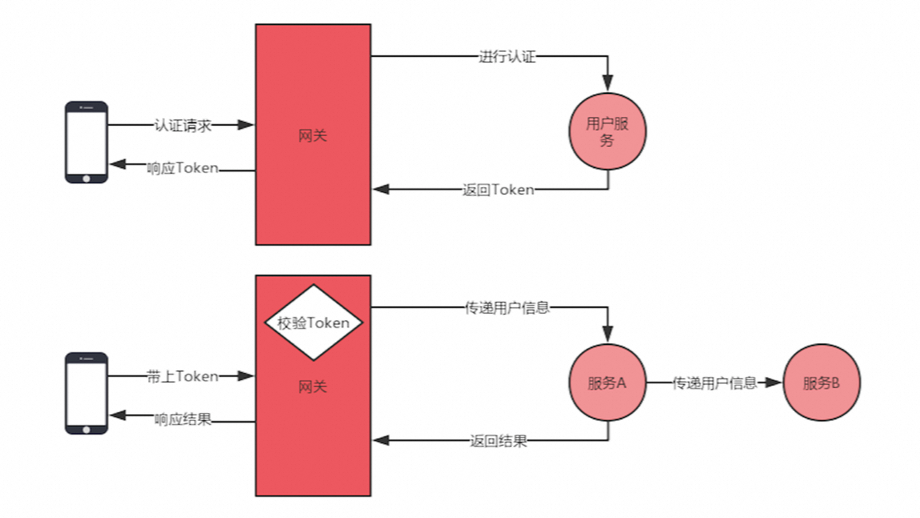

1. <font style="color:rgb(62, 62, 62);">认证服务提供认证的 API，校验用户信息，返回认证结果；</font>
2. <font style="color:rgb(62, 62, 62);">通过JWTUtils中的RSA算法，生成JWT token，token里封装用户id和有效期；</font>
3. <font style="color:rgb(62, 62, 62);">服务间参数通过请求头进行传递，服务内部通过 ThreadLocal 进行上下文传递；</font>
4. <font style="color:rgb(62, 62, 62);">Hystrix导致ThreadLocal失效的问题可以通过，重写 Hystrix 的 Callable 方法，传递需要的数据；</font>

**<font style="color:rgb(62, 62, 62);">Token最佳实践</font>**

+ <font style="color:rgb(62, 62, 62);">设置</font>**<font style="color:rgb(62, 62, 62);">较短（合理）的过期时间。</font>**
+ <font style="color:rgb(62, 62, 62);">注销的 Token </font>**<font style="color:rgb(62, 62, 62);">及时清除</font>**<font style="color:rgb(62, 62, 62);">（放入 Redis 中做一层过滤）。</font><font style="color:rgb(62, 62, 62);">虽然不能修改 Token 的信息，但是能在验证层面做一层过滤来进行处理。</font>
+ <font style="color:rgb(62, 62, 62);">监控 Token 的</font>**<font style="color:rgb(62, 62, 62);">使用频率</font>**<font style="color:rgb(62, 62, 62);">。</font><font style="color:rgb(62, 62, 62);">为了防止数据被别人爬取，最常见的就是监控使用频率，程序写出来的爬虫程序访问频率是有迹可循的 </font>
+ <font style="color:rgb(62, 62, 62);">核心功能敏感操作可以使用</font>**<font style="color:rgb(62, 62, 62);">动态验证</font>**<font style="color:rgb(62, 62, 62);">（验证码）。</font><font style="color:rgb(62, 62, 62);">比如提现的功能，要求在提现时再次进行验证码的验证，防止不是本人操作。</font>
+ **<font style="color:rgb(62, 62, 62);">网络环境、浏览器</font>**<font style="color:rgb(62, 62, 62);">信息等识别。</font><font style="color:rgb(62, 62, 62);">银行 APP 对环境有很高的要求，使用时如果断网，APP 会自动退出，重新登录，因为网络环境跟之前使用的不一样了，还有一些浏览器的信息之类的判断，这些都是可以用来保证后端 API 的安全。</font>
+ **<font style="color:rgb(62, 62, 62);">加密密钥</font>**<font style="color:rgb(62, 62, 62);">支持动态修改。</font><font style="color:rgb(62, 62, 62);">如果 Token 的加密密钥泄露了，也就意味着别人可以伪造你的 Token，可以将密钥存储在配置中心，以支持动态修改刷新，需要注意的是建议在流量低峰的时候去做更换的操作，否则 Token 全部失效，所有在线的请求都会重新申请 Token，并发量会比较大。</font>

<font style="color:rgb(255, 129, 36);">灰度发布</font>

**<font style="color:rgb(62, 62, 62);">痛点：</font>**

+ <font style="color:rgb(62, 62, 62);">服务数量多，业务变动频繁，一周一发布；</font>
+ <font style="color:rgb(62, 62, 62);">灰度发布能降低发布失败风险，</font>**<font style="color:rgb(62, 62, 62);">减少影响范围</font>**<font style="color:rgb(62, 62, 62);">；</font><font style="color:rgb(62, 62, 62);">通过灰度发布，先让一部分用户体验新的服务，或者只让测试人员进行测试，等功能正常后再全部发布，这样能降低发布失败带来的影响范围；</font>
+ <font style="color:rgb(62, 62, 62);">当发布出现故障时，可以</font>**<font style="color:rgb(62, 62, 62);">快速回滚</font>**<font style="color:rgb(62, 62, 62);">，不影响用户；</font><font style="color:rgb(62, 62, 62);">灰度后如果发现这个节点有问题，那么只需回滚这个节点即可，当然不回滚也没关系，通过灰度策略隔离，也不会影响正常用户；</font>

<font style="color:rgb(62, 62, 62);">可以通过Ribbon的负载均衡策略进行灰度发布，可以使用更可靠的Discovery。</font>

**<font style="color:rgb(62, 62, 62);">Discovery</font>**

<font style="color:rgb(136, 136, 136);">基于Discovery 服务注册发现、Ribbon 负载均衡、Feign 和 RestTemplate 调用等组件的企业级微服务开源解决方案，包括灰度发布、灰度路由、服务隔离等功能。</font>

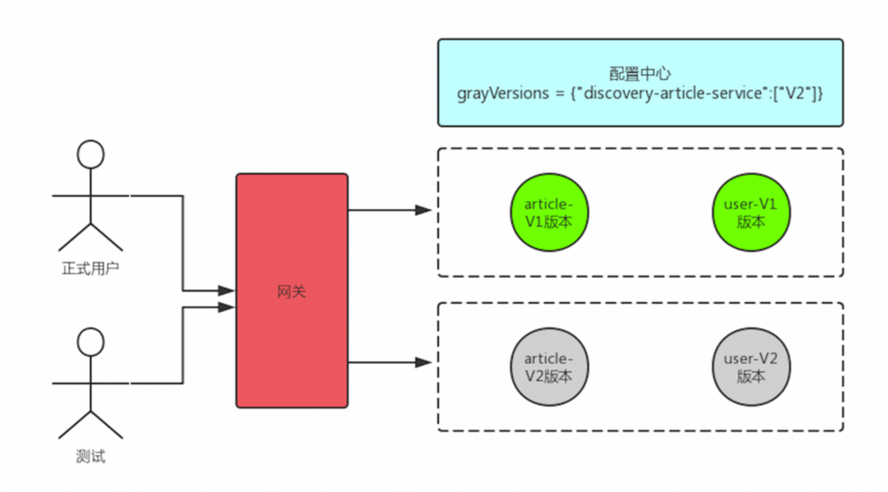

1. <font style="color:rgb(62, 62, 62);">首先将需要发布的服务从转发过程中移除，等流量剔除之后再发布。</font>
2. <font style="color:rgb(62, 62, 62);">部分机器中的版本进行升级，用户默认还是请求老的服务，通过版本来支持测试请求。</font>
3. <font style="color:rgb(62, 62, 62);">测试完成之后，让新的版本接收正常流量，然后部署下一个节点，以此类推。</font>

```plain
grayVersions = {"discovery-article-service":["1.01"]}
```

<font style="color:rgb(255, 129, 36);">多版本隔离</font>

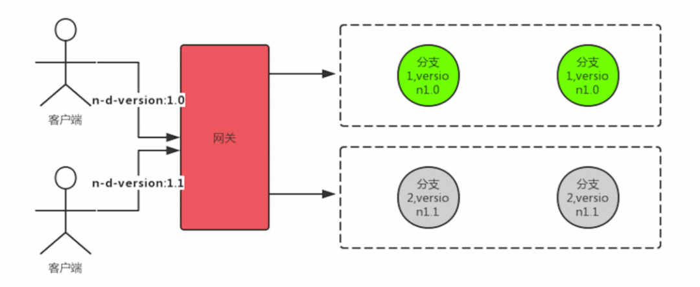

**<font style="color:rgb(62, 62, 62);">本地复用测试服务</font>**<font style="color:rgb(62, 62, 62);">-Eureka Zone亮点</font>

**<font style="color:rgb(62, 62, 62);">region</font>**<font style="color:rgb(62, 62, 62);"> 地理上的分区，比如北京、上海等</font>

**<font style="color:rgb(62, 62, 62);">zone</font>**<font style="color:rgb(62, 62, 62);"> 可以简单理解为 region 内的具体机房</font>

<font style="color:rgb(62, 62, 62);">在调用的过程中会优先选择相同的 zone 发起调用，当找不到相同名称的 zone 时会选择其他的 zone 进行调用，我们可以利用这个特性来解决本地需要启动多个服务的问题。</font>

<font style="color:rgb(62, 62, 62);">[^]: 当你访问修改的服务 A 时，这个服务依赖了 B、C 两个服务，B 和 C 本地没有启动，B 和 C 找不到相同的 zone 就会选择其他的 zone 进行调用，也就是会调用到测试环境部署的 B 和 C 服务，这样一来就解决了本地部署多个服务的问题。</font>

<font style="color:rgb(62, 62, 62);">  
</font>

**<font style="color:rgb(62, 62, 62);">各组件调优</font>**

<font style="color:rgb(62, 62, 62);">当你对网关进行压测时，会发现并发量一直上不去，错误率也很高。因为你用的是默认配置，这个时候我们就需要去调整配置以达到最优的效果。</font>

<font style="color:rgb(62, 62, 62);">首先我们可以对容器进行调优，最常见的就是</font>**<font style="color:rgb(62, 62, 62);">内置的 Tomcat</font>**<font style="color:rgb(62, 62, 62);"> 容器了。</font>


```plain
server.tomcat.accept-count //请求队列排队数server.tomcat.max-threads //最大线程数server.tomcat.max-connections //最大连接数
```

**<font style="color:rgb(62, 62, 62);">Hystrix</font>**<font style="color:rgb(62, 62, 62);"> 的信号量（semaphore）隔离模式，并发量上不去很大的原因都在这里，信号量默认值是 100，也就是最大并发只有 100，超过 100 就得等待。</font>

```plain
//信号量zuul.semaphore.max-semaphores //信号量：最大并发数//线程池hystrix.threadpool.default.coreSize //最大线程数hystrix.threadpool.default.maximumSize //队列的大hystrix.threadpool.default.maxQueueSize //等参数
```

<font style="color:rgb(62, 62, 62);">配置</font>**<font style="color:rgb(62, 62, 62);">Gateway</font>**<font style="color:rgb(62, 62, 62);">并发信息</font>

```plain
gateway.host.max-per-route-connections //每个路由的连接数 gateway.host.max-total-connections //总连接数
```

<font style="color:rgb(62, 62, 62);">调整</font>**<font style="color:rgb(62, 62, 62);">Ribbon</font>**<font style="color:rgb(62, 62, 62);"> 的并发配置</font>

```plain
ribbon.MaxConnectionsPerHost //单服务并发数ribbon.MaxTotalConnections   //总并发数
```

<font style="color:rgb(62, 62, 62);">修改</font>**<font style="color:rgb(62, 62, 62);">Feign</font>**<font style="color:rgb(62, 62, 62);">默认的HttpURLConnection 替换成 httpclient 来提高性能</font>

```plain
feign.httpclient.max-connections-per-route//每个路由的连接数feign.httpclient.max-connections //总连接数
```

<font style="color:rgb(62, 62, 62);">Gateway+配置中心实现动态路由</font>

<font style="color:rgb(62, 62, 62);">Feign+配置中心实现动态日志</font>


> 更新: 2024-04-29 20:15:47  
> 原文: <https://www.yuque.com/tulingzhouyu/db22bv/al1s35tm0qed1dd4>