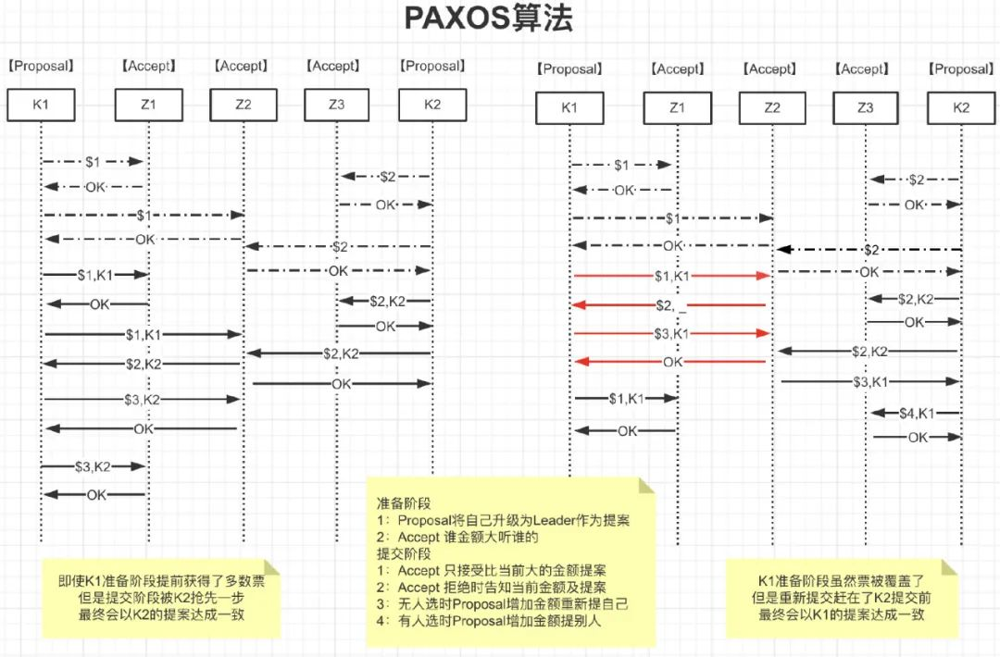
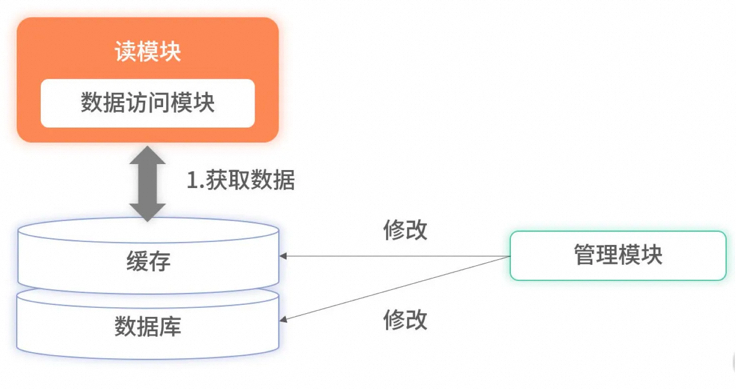
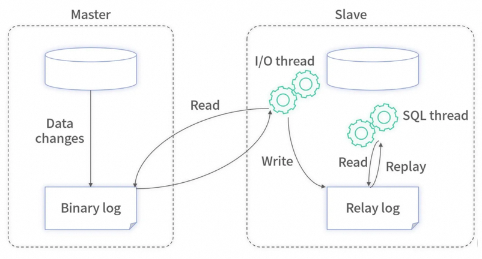
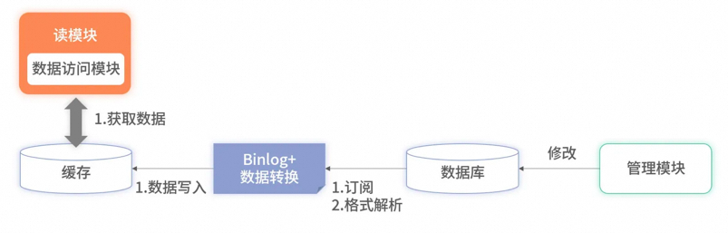
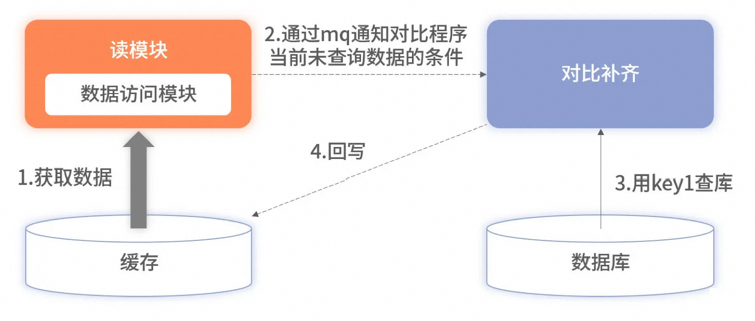
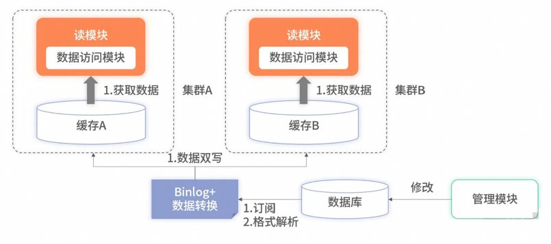
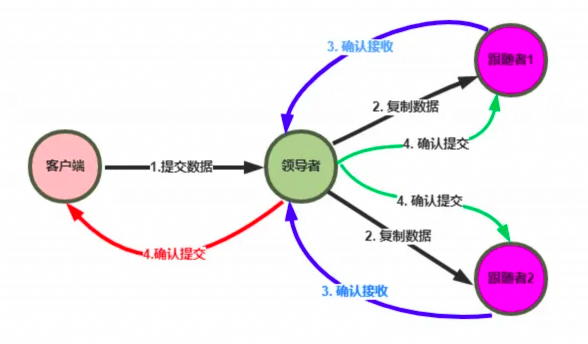
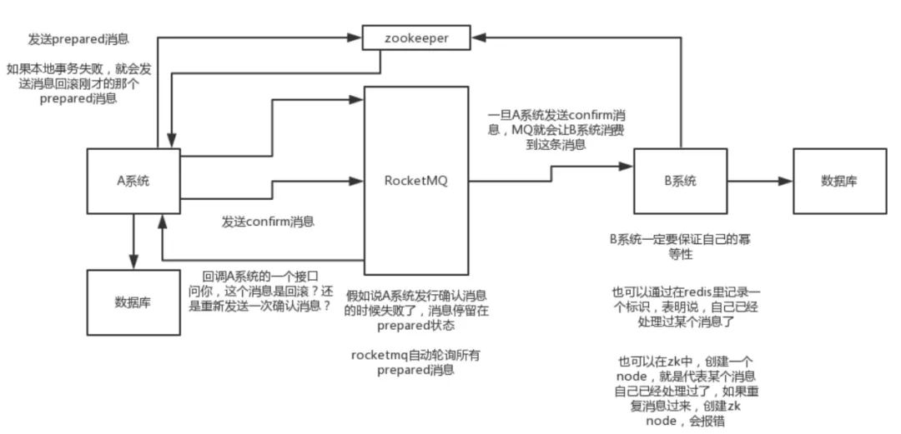

# 分布式篇

<font style="color:rgb(136, 136, 136);">分布式系统是一个硬件或软件组件分布在不同的网络计算机上，彼此之间仅仅通过消息传递进行通信和协调的系统。</font>

<font style="color:rgb(255, 129, 36);">发展历程</font>

+ <font style="color:rgb(62, 62, 62);">入口级负载均衡</font>
    - <font style="color:rgb(62, 62, 62);">网关负载均衡</font>
    - <font style="color:rgb(62, 62, 62);">客户端负载均衡</font>
+ <font style="color:rgb(62, 62, 62);">单应用架构</font>
    - <font style="color:rgb(62, 62, 62);">应用服务和数据服务分离</font>
    - <font style="color:rgb(62, 62, 62);">应用服务集群</font>
    - <font style="color:rgb(62, 62, 62);">应用服务中心化SAAS</font>
+ <font style="color:rgb(62, 62, 62);">数据库主备读写分离</font>
    - <font style="color:rgb(62, 62, 62);">全文搜索引擎加快数据统计</font>
    - <font style="color:rgb(62, 62, 62);">缓存集群缓解数据库读压力</font>
    - <font style="color:rgb(62, 62, 62);">分布式消息中间件缓解数据库写压力</font>
    - <font style="color:rgb(62, 62, 62);">数据库水平拆分适应微服务</font>
    - <font style="color:rgb(62, 62, 62);">数据库垂直拆分解决慢查询</font>
+ <font style="color:rgb(62, 62, 62);">划分上下文拆分微服务</font>
    - <font style="color:rgb(62, 62, 62);">服务注册发现（Eureka、Nacos）</font>
    - <font style="color:rgb(62, 62, 62);">配置动态更新（Config、Apollo）</font>
    - <font style="color:rgb(62, 62, 62);">业务灰度发布（Gateway、Feign）</font>
    - <font style="color:rgb(62, 62, 62);">统一安全认证（Gateway、Auth）</font>
    - <font style="color:rgb(62, 62, 62);">服务降级限流（Hystrix、Sentinel）</font>
    - <font style="color:rgb(62, 62, 62);">接口检查监控（Actuator、Prometheus）</font>
    - <font style="color:rgb(62, 62, 62);">服务全链路追踪（Sleuth、Zipkin）</font>

<font style="color:rgb(255, 129, 36);">CAP</font>

+ **<font style="color:rgb(62, 62, 62);">一致性</font>**<font style="color:rgb(62, 62, 62);">（2PC、3PC、Paxos、Raft）</font>
    - <font style="color:rgb(62, 62, 62);">强一致性：</font>**<font style="color:rgb(62, 62, 62);">数据库一致性</font>**<font style="color:rgb(62, 62, 62);">，牺牲了性能</font>
    - **<font style="color:rgb(62, 62, 62);">ACID：</font>**<font style="color:rgb(62, 62, 62);">原子性、一致性、隔离性、持久性</font>
    - <font style="color:rgb(62, 62, 62);">弱一致性：</font>**<font style="color:rgb(62, 62, 62);">数据库和缓存，延迟双删、重试</font>**
    - <font style="color:rgb(62, 62, 62);">单调读一致性：</font>**<font style="color:rgb(62, 62, 62);">缓存一致性</font>**<font style="color:rgb(62, 62, 62);">，ID或者IP哈希</font>
    - <font style="color:rgb(62, 62, 62);">最终一致性：</font>**<font style="color:rgb(62, 62, 62);">边缘业务</font>**<font style="color:rgb(62, 62, 62);">，消息队列</font>
+ **<font style="color:rgb(62, 62, 62);">可用性</font>**<font style="color:rgb(62, 62, 62);">（多级缓存、读写分离）</font>
    - **<font style="color:rgb(62, 62, 62);">BASE</font>**<font style="color:rgb(62, 62, 62);"> 基本可用：</font><font style="color:rgb(62, 62, 62);">限流导致响应速度慢、降级导致用户体验差</font>
    - <font style="color:rgb(62, 62, 62);">Basically Availabe 基本可用 </font>
    - <font style="color:rgb(62, 62, 62);">Soft state 软状态</font>
    - <font style="color:rgb(62, 62, 62);">Eventual Consistency 最终一致性</font>
+ <font style="color:rgb(62, 62, 62);">分区容忍性（一致性Hash解决扩缩容问题）</font>

<font style="color:rgb(255, 129, 36);">一致性</font>

<font style="color:rgb(62, 62, 62);">  
</font>

**<font style="color:rgb(62, 62, 62);">XA方案</font>**

**<font style="color:rgb(62, 62, 62);">2PC</font>**<font style="color:rgb(62, 62, 62);">协议：两阶段提交协议，P是指</font>**<font style="color:rgb(62, 62, 62);">准备</font>**<font style="color:rgb(62, 62, 62);">阶段，C是指</font>**<font style="color:rgb(62, 62, 62);">提交</font>**<font style="color:rgb(62, 62, 62);">阶段</font>

+ <font style="color:rgb(62, 62, 62);">准备阶段：询问是否可以开始，写Undo、Redo日志，收到响应；</font>
+ <font style="color:rgb(62, 62, 62);">提交阶段：执行Redo日志进行Commit，执行Undo日志进行Rollback；</font>

**<font style="color:rgb(62, 62, 62);">3PC</font>**<font style="color:rgb(62, 62, 62);">协议：将提交阶段分为</font>**<font style="color:rgb(62, 62, 62);">CanCommit、PreCommit、DoCommit</font>**<font style="color:rgb(62, 62, 62);">三个阶段</font>

**<font style="color:rgb(62, 62, 62);">CanCommit</font>**<font style="color:rgb(62, 62, 62);">：发送canCommit请求，并开始等待；</font>

**<font style="color:rgb(62, 62, 62);">PreCommit</font>**<font style="color:rgb(62, 62, 62);">：收到全部Yes，写Undo、Redo日志。超时或者No，则中断；</font>

**<font style="color:rgb(62, 62, 62);">DoCommit</font>**<font style="color:rgb(62, 62, 62);">：执行Redo日志进行</font>**<font style="color:rgb(62, 62, 62);">Commit</font>**<font style="color:rgb(62, 62, 62);">，执行Undo日志进行</font>**<font style="color:rgb(62, 62, 62);">Rollback；</font>**

<font style="color:rgb(62, 62, 62);">区别是第二步，参与者</font>**<font style="color:rgb(62, 62, 62);">自身增加了超时，如果失败可以及时释放资源。</font>**

<font style="color:rgb(62, 62, 62);">  
</font>

**<font style="color:rgb(62, 62, 62);">Paxos算法</font>**

<font style="color:rgb(136, 136, 136);">如何在一个发生异常的分布式系统中，快速且正确地在集群内部对某个数据的值达成一致。</font>

<font style="color:rgb(62, 62, 62);">参与者（例如Kafka）的一致性可以由协调者（例如Zookeeper）来保证，协调者的一致性就只能由Paxos保证了</font>

<font style="color:rgb(62, 62, 62);">Paxos算法中的角色：</font>

+ **<font style="color:rgb(62, 62, 62);">Client：</font>**<font style="color:rgb(62, 62, 62);">客户端、例如，对分布式文件服务器中文件的写请求。</font>
+ **<font style="color:rgb(62, 62, 62);">Proposer</font>**<font style="color:rgb(62, 62, 62);">：提案发起者，根据Accept返回选择最大N对应的V，发送[N+1,V]</font>
+ **<font style="color:rgb(62, 62, 62);">Acceptor</font>**<font style="color:rgb(62, 62, 62);">：决策者，Accept以后会拒绝小于N的提案，并把自己的[N,V]返回给Proposer</font>
+ **<font style="color:rgb(62, 62, 62);">Learners</font>**<font style="color:rgb(62, 62, 62);">：最终决策的学习者、学习者充当该协议的复制因素</font>

```plain
//算法约束P1:一个Acceptor必须接受它收到的第一个提案。//考虑到半数以上才作数，一个Accpter得接受多个相同v的提案P2a:如果某个v的提案被accept，那么被Acceptor接受编号更高的提案必须也是vP2b:如果某个v的提案被accept，那么从Proposal提出编号更高的提案必须也是v//如何确保v的提案Accpter被选定后，Proposal都能提出编号更高的提案呢针对任意的[Mid,Vid]，有半数以上的Accepter集合S，满足以下二选一：S中接受的提案都大于Mid  S中接受的提案若小于Mid，编号最大的那个值为Vid
```



<font style="color:rgb(62, 62, 62);">面试题：如何保证Paxos算法活性</font>

<font style="color:rgb(62, 62, 62);">假设存在这样一种极端情况，有两个Proposer依次提出了一系列编号递增的提案，导致最终陷入死循环，没有value被选定：</font>

+ **<font style="color:rgb(62, 62, 62);">通过选取主Proposer</font>**<font style="color:rgb(62, 62, 62);">，规定只有主Proposer才能提出议案。只要主Proposer和过半的Acceptor能够正常网络通信，主Proposer提出一个编号更高的提案，该提案终将会被批准；</font>
+ <font style="color:rgb(62, 62, 62);">每个Proposer发送提交提案的时间设置为</font>**<font style="color:rgb(62, 62, 62);">一段时间内随机</font>**<font style="color:rgb(62, 62, 62);">，保证不会一直死循环；</font>

<font style="color:rgb(62, 62, 62);">  
</font>

**<font style="color:rgb(62, 62, 62);">Raft算法</font>**

<font style="color:rgb(136, 136, 136);">Raft 是一种为了管理复制日志的一致性算法</font>

<font style="color:rgb(62, 62, 62);">Raft使用</font>**<font style="color:rgb(62, 62, 62);">心跳机制</font>**<font style="color:rgb(62, 62, 62);">来触发选举。当server启动时，初始状态都是</font>**<font style="color:rgb(62, 62, 62);">follower</font>**<font style="color:rgb(62, 62, 62);">。每一个server都有一个定时器，超时时间为election timeout（</font>**<font style="color:rgb(62, 62, 62);">一般为150-300ms</font>**<font style="color:rgb(62, 62, 62);">），如果某server</font>**<font style="color:rgb(62, 62, 62);">没有超时的情况</font>**<font style="color:rgb(62, 62, 62);">下收到来自领导者或者候选者的任何消息，</font>**<font style="color:rgb(62, 62, 62);">定时器重启</font>**<font style="color:rgb(62, 62, 62);">，如果超时，它就</font>**<font style="color:rgb(62, 62, 62);">开始一次选举</font>**<font style="color:rgb(62, 62, 62);">。</font>

**<font style="color:rgb(62, 62, 62);">Leader异常</font>**<font style="color:rgb(62, 62, 62);">：异常期间Follower会超时选举，完成后Leader比较彼此步长</font>

**<font style="color:rgb(62, 62, 62);">Follower异常</font>**<font style="color:rgb(62, 62, 62);">：恢复后直接同步至Leader当前状态</font>

**<font style="color:rgb(62, 62, 62);">多个Candidate</font>**<font style="color:rgb(62, 62, 62);">：选举时失败，失败后超时继续选举</font>

<font style="color:rgb(62, 62, 62);">  
</font>

**<font style="color:rgb(62, 62, 62);">数据库和Redis的一致性</font>**

<font style="color:rgb(62, 62, 62);">全量缓存保证高效读取</font>



<font style="color:rgb(62, 62, 62);">所有数据都存储在缓存里，读服务在查询时不会再降级到数据库里，所有的请求都完全依赖缓存。此时，因降级到数据库导致的毛刺问题就解决了。但全量缓存并</font>**<font style="color:rgb(62, 62, 62);">没有解决更新时的分布式事务</font>**<font style="color:rgb(62, 62, 62);">问题，反而把问题放大了。因为全量缓存</font>**<font style="color:rgb(62, 62, 62);">对数据更新要求更加严格</font>**<font style="color:rgb(62, 62, 62);">，要求所有数据库</font>**<font style="color:rgb(62, 62, 62);">已有数据和实时更新</font>**<font style="color:rgb(62, 62, 62);">的数据必须完全同步至缓存，不能有遗漏。对于此问题，一种有效的方案是采用</font>**<font style="color:rgb(62, 62, 62);">订阅数据库的 Binlog</font>****<font style="color:rgb(62, 62, 62);"> </font>**<font style="color:rgb(62, 62, 62);">实现数据同步。</font>



<font style="color:rgb(62, 62, 62);">现在很多开源工具（如阿里的 Canal等）可以模拟主从复制的协议。通过模拟协议读取主数据库的 Binlog 文件，从而获取主库的所有变更。对于这些变更，它们开放了各种接口供业务服务获取数据。</font>



<font style="color:rgb(62, 62, 62);">将 Binlog 的中间件挂载至目标数据库上，就可以</font>**<font style="color:rgb(62, 62, 62);">实时获取该数据库的所有变更数</font>****<font style="color:rgb(62, 62, 62);">据</font>**<font style="color:rgb(62, 62, 62);">。对这些变更数据解析后，便可</font>**<font style="color:rgb(62, 62, 62);">直接写入缓存里</font>**<font style="color:rgb(62, 62, 62);">。优点还有：</font>

+ <font style="color:rgb(62, 62, 62);">大幅提升了读取的速度，降低了延迟；</font>
+ <font style="color:rgb(62, 62, 62);">Binlog 的主从复制是基于 </font>**<font style="color:rgb(62, 62, 62);">ACK</font>**<font style="color:rgb(62, 62, 62);"> 机制， 解决了分布式事务的问题；</font><font style="color:rgb(62, 62, 62);">如果同步缓存失败了，被消费的 Binlog 不会被确认，下一次会重复消费，数据最终会写入缓存中；</font>

**<font style="color:rgb(62, 62, 62);">缺点</font>**<font style="color:rgb(62, 62, 62);">不可避免：1、增加复杂度 2、消耗缓存资源 3、需要筛选和压缩数据 4、极端情况数据丢失；</font>



<font style="color:rgb(62, 62, 62);">可以通过异步校准方案进行补齐，但是会损耗数据库性能。但是此方案会隐藏中间件使用错误的细节，线上环境前期更重要的是记录日志排查再做后续优化，不能本末倒置。</font>

<font style="color:rgb(255, 129, 36);">可用性</font>

<font style="color:rgb(62, 62, 62);">  
</font>

**<font style="color:rgb(62, 62, 62);">心跳检测</font>**

<font style="color:rgb(136, 136, 136);">以</font>**<font style="color:rgb(136, 136, 136);">固定的频率</font>**<font style="color:rgb(136, 136, 136);">向其他节点汇报当前节点状态的方式。收到心跳，说明网络和节点的状态是健康的。心跳汇报时，一般会携带一些附加的</font>**<font style="color:rgb(136, 136, 136);">状态、元数据，以便管理</font>**<font style="color:rgb(136, 136, 136);">。</font>

**<font style="color:rgb(62, 62, 62);">周期检测心跳机制</font>**<font style="color:rgb(62, 62, 62);">：超时未返回</font>

**<font style="color:rgb(62, 62, 62);">累计失效检测机制</font>**<font style="color:rgb(62, 62, 62);">：重试超次数</font>

<font style="color:rgb(62, 62, 62);">  
</font>

**<font style="color:rgb(62, 62, 62);">多机房实时热备</font>**



<font style="color:rgb(62, 62, 62);">两套缓存集群可以分别部署到不同城市的机房。读服务也相应地部署到不同城市或不同分区。在承接请求时，不同机房或分区的读服务只依赖同样属性的缓存集群。此方案有两个好处。</font>

1. **<font style="color:rgb(62, 62, 62);">提升了性能</font>**<font style="color:rgb(62, 62, 62);">。读服务不要分层，读服务要尽可能地和缓存数据源靠近。</font>
2. **<font style="color:rgb(62, 62, 62);">增加了可用</font>**<font style="color:rgb(62, 62, 62);">。当单机房出现故障时，可以秒级将所有流量都切换至存活的机房或分区。</font>

<font style="color:rgb(62, 62, 62);">此方案虽然带来了性能和可用性的提升，但代价是资源成本的上升。</font>

<font style="color:rgb(255, 129, 36);">分区容错性</font>

<font style="color:rgb(136, 136, 136);">分布式系统对于错误包容的能力</font>

<font style="color:rgb(62, 62, 62);">通过限流、降级、兜底、重试、负载均衡等方式增强系统的健壮性</font>

<font style="color:rgb(62, 62, 62);">  
</font>

**<font style="color:rgb(62, 62, 62);">日志复制</font>**



1. **<font style="color:rgb(62, 62, 62);">Leader</font>**<font style="color:rgb(62, 62, 62);">把指令添加到日志中，发起 RPC 给其他的服务器，让他们复制这条信息；</font>
2. **<font style="color:rgb(62, 62, 62);">Leader</font>**<font style="color:rgb(62, 62, 62);">会不断的重试，直到所有的 Follower响应了ACK并复制了所有的日志条目；</font>
3. <font style="color:rgb(62, 62, 62);">通知所有的</font>**<font style="color:rgb(62, 62, 62);">Follower</font>**<font style="color:rgb(62, 62, 62);">提交，同时Leader该表这条日志的状态，并返回给客户端；</font>

<font style="color:rgb(62, 62, 62);">  
</font>

**<font style="color:rgb(62, 62, 62);">主备（Master-Slave）</font>**

<font style="color:rgb(62, 62, 62);">主机宕机时，备机接管主机的一切工作，主机恢复正常后，以自动（热备）或手动（冷备）方式将服务切换到主机上运行，</font>**<font style="color:rgb(62, 62, 62);">Mysql</font>**<font style="color:rgb(62, 62, 62);">和</font>**<font style="color:rgb(62, 62, 62);">Redis</font>**<font style="color:rgb(62, 62, 62);">中常用。</font>

<font style="color:rgb(62, 62, 62);">MySQL之间数据复制的基础是</font>**<font style="color:rgb(62, 62, 62);">二进制日志文件</font>**<font style="color:rgb(62, 62, 62);">（binary log fifile）。它的数据库中所有操作都会以“事件”的方式记录在二进制日志中，其他数据库作为slave通过一个</font>**<font style="color:rgb(62, 62, 62);">I/O线程与主服务器保持通信</font>**<font style="color:rgb(62, 62, 62);">，并</font>**<font style="color:rgb(62, 62, 62);">监控</font>**<font style="color:rgb(62, 62, 62);">master的二进制日志文件的变化，如果发现master二进制日志文件发生变化，则会把变化复制到自己的</font>**<font style="color:rgb(62, 62, 62);">中继日志</font>**<font style="color:rgb(62, 62, 62);">中，然后slave的一个SQL线程会把相关的“事件”执行到自己的数据库中，以此实现从数据库和主数据库的</font>**<font style="color:rgb(62, 62, 62);">一致性</font>**<font style="color:rgb(62, 62, 62);">，也就实现了</font>**<font style="color:rgb(62, 62, 62);">主从复制。</font>**

<font style="color:rgb(62, 62, 62);">  
</font>

**<font style="color:rgb(62, 62, 62);">互备（Active-Active）</font>**

<font style="color:rgb(62, 62, 62);">指两台主机同时运行各自的服务工作且</font>**<font style="color:rgb(62, 62, 62);">相互监测</font>**<font style="color:rgb(62, 62, 62);">情况。在数据库高可用部分，常见的互备是</font>**<font style="color:rgb(62, 62, 62);">MM</font>**<font style="color:rgb(62, 62, 62);">模式。MM模式即</font>**<font style="color:rgb(62, 62, 62);">Multi-Master</font>**<font style="color:rgb(62, 62, 62);">模式，指一个系统存在多个master，每个master都具有</font>**<font style="color:rgb(62, 62, 62);">read-write</font>**<font style="color:rgb(62, 62, 62);">能力，会根据</font>**<font style="color:rgb(62, 62, 62);">时间戳或业务逻辑</font>**<font style="color:rgb(62, 62, 62);">合并版本。</font>

<font style="color:rgb(62, 62, 62);">  
</font>

**<font style="color:rgb(62, 62, 62);">集群（Cluster）模式</font>**

<font style="color:rgb(62, 62, 62);">是指有多个节点在运行，同时可以通过主控节点</font>**<font style="color:rgb(62, 62, 62);">分担服务</font>**<font style="color:rgb(62, 62, 62);">请求。如Zookeeper。集群模式需要解决主控节点</font>**<font style="color:rgb(62, 62, 62);">本身的高可用</font>**<font style="color:rgb(62, 62, 62);">问题，一般采用主备模式。</font>

<font style="color:rgb(255, 129, 36);">分布式事务</font>

<font style="color:rgb(62, 62, 62);">  
</font>

**<font style="color:rgb(62, 62, 62);">XA方案</font>**

<font style="color:rgb(255, 104, 39);">两阶段提交 | 三阶段提交</font>

+ <font style="color:rgb(62, 62, 62);">准备阶段的资源锁定，存在性能问题，严重时会造成死锁问题；</font>
+ <font style="color:rgb(62, 62, 62);">提交事务请求后，出现网络异常，部分数据收到并执行，会造成一致性问；</font>

<font style="color:rgb(62, 62, 62);">  
</font>

**<font style="color:rgb(62, 62, 62);">TCC方案</font>**

<font style="color:rgb(255, 104, 39);">Try Confirm Cancel / 短事务</font>

+ **<font style="color:rgb(62, 62, 62);">Try</font>**<font style="color:rgb(62, 62, 62);"> </font><font style="color:rgb(62, 62, 62);">阶段：这个阶段说的是对各个服务的资源做检测以及对资源进行</font>**<font style="color:rgb(62, 62, 62);">锁定或者预留；</font>**
+ **<font style="color:rgb(62, 62, 62);">Confirm</font>**<font style="color:rgb(62, 62, 62);"> </font><font style="color:rgb(62, 62, 62);">阶段：这个阶段说的是在各个服务中</font>**<font style="color:rgb(62, 62, 62);">执行实际的操作；</font>**
+ **<font style="color:rgb(62, 62, 62);">Cancel</font>****<font style="color:rgb(62, 62, 62);"> </font>**<font style="color:rgb(62, 62, 62);">阶段：如果任何一个服务的业务方法执行出错，那么就需要</font>**<font style="color:rgb(62, 62, 62);">进行补偿</font>**<font style="color:rgb(62, 62, 62);">/回滚；</font>

<font style="color:rgb(62, 62, 62);">  
</font>

**<font style="color:rgb(62, 62, 62);">Saga方案</font>**

<font style="color:rgb(62, 62, 62);">事务性补偿 / 长事务</font>

+ <font style="color:rgb(62, 62, 62);">流程长、流程多、调用第三方业务</font>

<font style="color:rgb(62, 62, 62);">  
</font>

**<font style="color:rgb(62, 62, 62);">本地消息表（eBay）</font>**

<font style="color:rgb(62, 62, 62);">  
</font>

**<font style="color:rgb(62, 62, 62);">MQ最终一致性</font>**



<font style="color:rgb(62, 62, 62);">比如阿里的 RocketMQ 就支持消息事务（核心：</font>**<font style="color:rgb(62, 62, 62);">双端确认，重试幂</font>**<font style="color:rgb(62, 62, 62);">等）</font>

1. <font style="color:rgb(62, 62, 62);">A(订单) 系统先发送一个 </font>**<font style="color:rgb(62, 62, 62);">prepared</font>**<font style="color:rgb(62, 62, 62);"> 消息到 mq，prepared 消息发送失败则取消操作不执行了；</font>
2. <font style="color:rgb(62, 62, 62);">发送成功后，那么执行本地事务，执行成功和和失败发送</font>**<font style="color:rgb(62, 62, 62);">确认和回滚</font>**<font style="color:rgb(62, 62, 62);">消息到mq；</font>
3. <font style="color:rgb(62, 62, 62);">如果发送了确认消息，那么此时 B**(仓储)** 系统会接收到确认消息，然后执行本地的事务；</font>
4. <font style="color:rgb(62, 62, 62);">mq 会自动</font>**<font style="color:rgb(62, 62, 62);">定时轮询</font>**<font style="color:rgb(62, 62, 62);">所有 prepared 消息回调的接口，确认事务执行状态；</font>
5. <font style="color:rgb(62, 62, 62);">B 的事务失败后自动</font>**<font style="color:rgb(62, 62, 62);">不断重试</font>**<font style="color:rgb(62, 62, 62);">直到成功，达到一定次数后发送报警由人工来手工回滚和补偿；</font>

<font style="color:rgb(62, 62, 62);">  
</font>

**<font style="color:rgb(62, 62, 62);">最大努力通知方案（订单 -> 积分）</font>**

1. <font style="color:rgb(62, 62, 62);">系统 A 本地事务执行完之后，发送个消息到 MQ；</font>
2. <font style="color:rgb(62, 62, 62);">这里会有个专门消费 MQ 的</font>**<font style="color:rgb(62, 62, 62);">最大努力通知服务</font>**<font style="color:rgb(62, 62, 62);">，接着调用系统 B 的接口；</font>
3. <font style="color:rgb(62, 62, 62);">要是系统 B 执行失败了，就定时尝试重新调用系统 B，反复 N 次，最后还是不行就放弃；</font>

<font style="color:rgb(62, 62, 62);">你找一个严格</font>**<font style="color:rgb(62, 62, 62);">资金</font>**<font style="color:rgb(62, 62, 62);">要求绝对不能错的场景，你可以说你是用的</font><font style="color:rgb(62, 62, 62);"> </font>**<font style="color:rgb(62, 62, 62);">TCC 方案</font>**<font style="color:rgb(62, 62, 62);">；</font>

<font style="color:rgb(62, 62, 62);">如果是一般的分布式事务场景，例如积分数据，可以用可靠消息</font>**<font style="color:rgb(62, 62, 62);">最终一致性方案。</font>**

<font style="color:rgb(62, 62, 62);">如果分布式场景</font>**<font style="color:rgb(62, 62, 62);">允许不一致</font>**<font style="color:rgb(62, 62, 62);">，可以使用最大努力通知方案。</font>

<font style="color:rgb(255, 129, 36);">面试题</font><font style="color:rgb(62, 62, 62);"></font>

**<font style="color:rgb(62, 62, 62);">分布式Session实现方案</font>**

+ <font style="color:rgb(62, 62, 62);">基于JWT的Token，数据从cache或者数据库中获取；</font>
+ <font style="color:rgb(62, 62, 62);">基于Tomcat的Redis，简单配置conf文件；</font>
+ <font style="color:rgb(62, 62, 62);">基于Spring的Redis，支持SpringCloud和Springboot；</font>


> 更新: 2024-04-29 20:12:47  
> 原文: <https://www.yuque.com/tulingzhouyu/db22bv/trxy9wdwidr0mw62>