# 💎最新一线互联网面经解析

## 天明寄语：
面经不分先后，不分厂区**持续整理中**。基本频率最高的技术栈无非就是 面试突击直播间跟大家讲到的那几个技术栈 和 三高的场景题。面试实则只要解决两个问题：**1有面试机会**，**2有较高通过率**。（[面试突击训练营](https://www.processon.com/view/link/659551179dab311b9589ef15)）

不怕不知道，就怕不知道自己不知道。等哪天不知道自己已知道才是真正拿到手软的阶段，千万不要在愚昧之巅故步自封，也别跌入绝望之谷不奋力前行。（认知4阶段 [达克效应](https://mbd.baidu.com/newspage/data/dtlandingsuper?nid=dt_4266316918707001571&sourceFrom=search_a)）

各位可先借助[Deepseek模拟](https://www.yuque.com/tulingzhouyu/db22bv/hui27uxgygih3oq8)或者[AI虚拟视频面](https://www.nowcoder.com/ai/partner/chat?pageEnter=AI%E6%A8%A1%E6%8B%9F%E9%9D%A2%E8%AF%95)，看每个题是否能聊个几分钟，一份面经是否能输出1h以上。如果不行，参看解析部分的笔记，回过头来再次复盘。最好能自我进行发散思维**知其然更要知其所以然**，不要仅限于参考笔记部分，更要已此为基础拓宽自己的知识体系，加油！

## 滴滴三面Offer历程
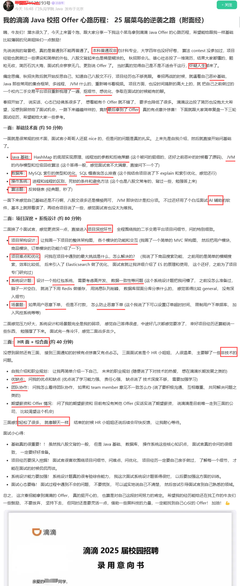

### 解析：一面：
1，**Java基础**可参看[HashMap实现原理](https://www.yuque.com/tulingzhouyu/db22bv/flzcleillddvwrm2) 以及 [Java并发面试合集](https://www.yuque.com/tulingzhouyu/db22bv/xawecw91rvkqgiil) 和[JVM面试题合集](https://www.yuque.com/tulingzhouyu/db22bv/na254w56n5uogg0b)中内存模型**垃圾回收**部分 漏标 多标解决

2，MySQL**索引和优化** 参看 [MySQL索引设计有哪些原则](https://www.yuque.com/tulingzhouyu/db22bv/ilhr9xhhtrqcq3zd)，[索引失效场景](https://www.yuque.com/tulingzhouyu/db22bv/azdpa9ibwn27gzbn)，[MySQL面试集合](https://www.yuque.com/tulingzhouyu/db22bv/so6mi5fptaanzosx#QU4rO)中SQL优化部分

3，**操作系统** 参考 [进程和线程的区别](https://www.yuque.com/tulingzhouyu/db22bv/hga4qyehlx72yhmy) 以及 [Java死锁如何解决](https://www.yuque.com/tulingzhouyu/db22bv/yhez1gsatz4004rs)

4，手撕算法参看 [数据结构预算法](#) 

### 解析：二面：
纯项目场景 可参考面试必看项目亮点和难点部分 如[分销平台](https://www.yuque.com/tulingzhouyu/db22bv/nn6meztozbalk68e) 就包含了三高场景，或者直接参考 如何设计一个[秒杀系统](https://www.yuque.com/tulingzhouyu/db22bv/zmh8bxm30a2a81p2) / [12306抢票系统](https://www.yuque.com/tulingzhouyu/db22bv/dcufnmtc6ut2f4gt)  / [抢红包系统](https://www.yuque.com/tulingzhouyu/db22bv/cy32uw7gte1y304l)  等场景题，从整体架构到核心亮点难点，并附带了关键部分的源码。最后一问防止恶意刷，在上面场景中都有讲到，如果觉得不够可参看 [接口怎么防刷](https://www.yuque.com/tulingzhouyu/db22bv/sabap6mrnfbv92gf) 场景

### 解析：三面：
正如博主所说，HR小姐姐你就放心大胆的聊即可，如果到此环节你还被刷，只能说明你不会说话，当然你得保持积极主动心态。

### 总结：
很多小伙伴自己不努力，被虐到怀疑人生，确抱怨行情。一定要像博主痛定思痛，逼自己恶补。只要努力条件一般欠的再多，还了还是一样能拿到满意Offer。技术栈包含：最新**AI ，Java基础，MySQL，Redis，MQ**，网络，Spring，并发和锁（视频内容）。除了偏八股的，一定要把**项目经验**整出三高。关键要看**场景**的和深入**原理**的部分是否能征服面试官。加油！

## 懂车帝一面
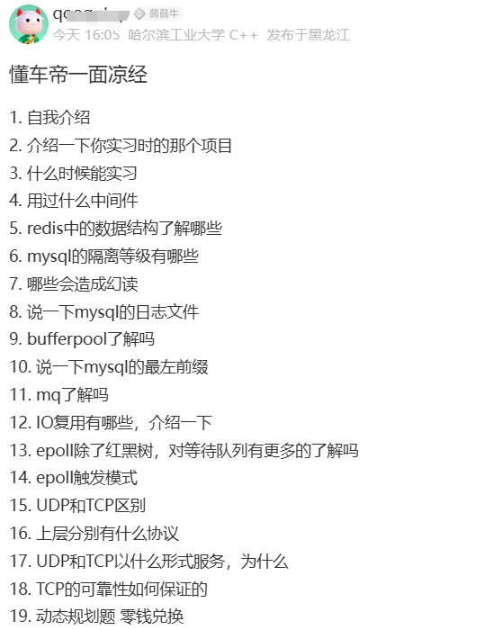

### 解析：一面：
1，**Redis常见数据类型 **参看** **[**Redis数据类型及实现原理**](https://www.yuque.com/tulingzhouyu/db22bv/fmv901lw0u8oew5x)

2，**MySQL隔离级别，三大日志**， 可参看 [MySQL事务隔离级别及实现原理](https://www.yuque.com/tulingzhouyu/db22bv/so6mi5fptaanzosx#ZVvBF)

3，**BufferPool** 以及 **索引相关** 参看 [MySQL合集](https://www.yuque.com/tulingzhouyu/db22bv/so6mi5fptaanzosx#p3wyq)

4，**MQ相关** 这个问题可能换成MQ对比或Kafka为什么快，可参看 [RocketMQ的存储模型和底层优化](https://www.yuque.com/tulingzhouyu/db22bv/xmoqrypne7cv9pft)及类比

5，**IO复用** 参看  [BIO、NIO、AIO 之间的区别](https://www.yuque.com/tulingzhouyu/db22bv/ebyqq248o1x34zlc) 以及 [什么是IO多路复用](https://www.yuque.com/tulingzhouyu/db22bv/fkkq38gi8f2vlu04)

6，**Epoll网络模型**参看 [select，poll和epoll ](https://www.yuque.com/tulingzhouyu/db22bv/awtqo38ngq6iysi5)

7，**UDP和TCP** 参考 [UDP和TCP的区别](https://www.yuque.com/tulingzhouyu/db22bv/dsqhapgfmv21gqe1)

8，手撕算法参看 [数据结构预算法](#) 

  

### 总结：
此份面经非常有通用性，不管什么计算机语言，尤其应届。基本就考察这三个中间件**MySQL，Redis，MQ**+计算机网络。应聘这第一个**Redis和MQ相关**的估计没有答好，故没有连续追问。

## 腾讯后端一面
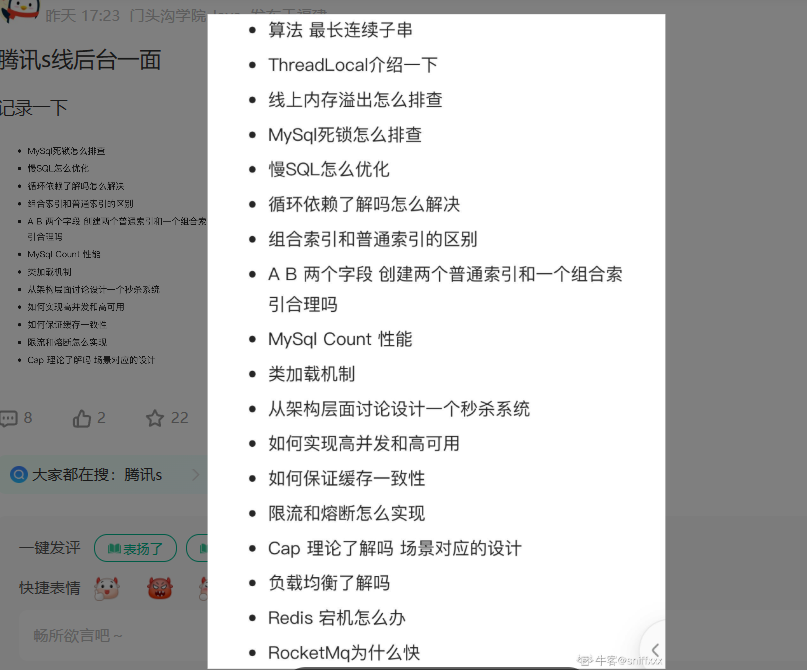

### 解析：一面：
1，**手撕算法参看 **[**数据结构预算法**](#)** **

2，**TreadLocal**介绍一下，此基础八股，主要为引出后面场景题， 可参看[TreadLocal底层原理及常用场景](https://www.yuque.com/tulingzhouyu/db22bv/mgfanm75ihe1rdho) 

3，**内存溢出排查** 可参看 线上问题排查系列中的 [内存溢出排查](https://www.yuque.com/tulingzhouyu/db22bv/bge6y0bkwbd07awu) 关键在于过程具体问题具体分析

4，Spring循环依赖 和 依赖注入  参看 [Spring如何解决循环依赖](https://www.yuque.com/tulingzhouyu/db22bv/ys4ul3b33vkyl82e) 和 [Spring面试集合](https://www.yuque.com/tulingzhouyu/db22bv/hnf1tsxt4echn1eb) 中DI部分

5，**MySQL死锁问题，**可参看[MySQL如何解决死锁](https://www.yuque.com/tulingzhouyu/db22bv/uzuoiq2tpfqgmbv1)，以及 [MySQL死锁排查](https://www.yuque.com/tulingzhouyu/db22bv/lgaw0d9podklhr3e)

6，**普通、联合索引， 慢SQL优化 ** 参看 [MySQL索引设计有哪些原则](https://www.yuque.com/tulingzhouyu/db22bv/ilhr9xhhtrqcq3zd)，[索引失效场景](https://www.yuque.com/tulingzhouyu/db22bv/azdpa9ibwn27gzbn)，[MySQL面试集合](https://www.yuque.com/tulingzhouyu/db22bv/so6mi5fptaanzosx#QU4rO)中SQL优化部分

7，**MySQL count性能，**可参看** **[count(*)count(1)count(x)的区别](https://www.yuque.com/tulingzhouyu/db22bv/zxxswr2ounp9qd7k)

8，**秒杀场景题** 参考   如何设计一个[秒杀系统](https://www.yuque.com/tulingzhouyu/db22bv/zmh8bxm30a2a81p2) 中间如何解决**三高，数据一致性，熔断限流，CAP，负载均衡**皆有详细解答

9，**Redis宕机怎么办？** 参考 [ Redis面试合集](https://www.yuque.com/tulingzhouyu/db22bv/du5hpy6podycogxo)中 持久化 和 集群高可用部分

10，**RocketMQ 为什么快？**  这个问题可能换成MQ对比或Kafka为什么快，可参看 [RocketMQ的存储模型和底层优化](https://www.yuque.com/tulingzhouyu/db22bv/xmoqrypne7cv9pft)

  

### 总结：
最近不少互联网大佬回归，各大厂之前裁的多，现在招聘回暖。各位一定要好好抓住机会。这份面试题还是有代表性的，技术栈包含： **Java基础，MySQL，Redis，MQ**，Spring，并发和锁。穿插了场景题，关键问题的解决方案，这些各位可以发散和深入。不要局限于单个面试题的记忆，要理解并发散类似的问题。

## 京东零售一面
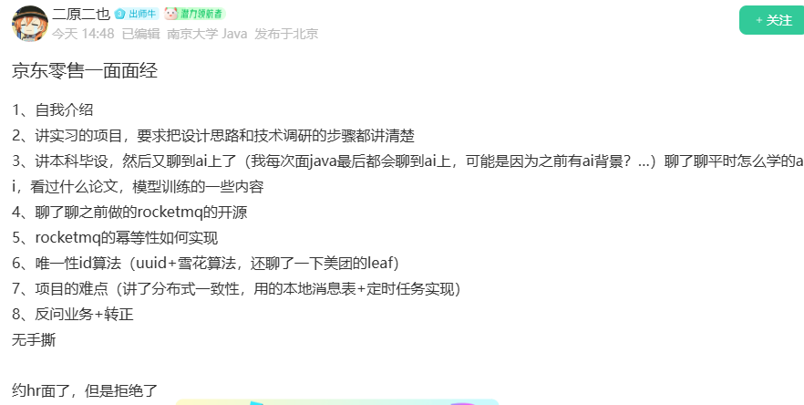

### 解析：
1，**项目场景**可参看项目和场景题部分如  [如何设计一个秒杀系统](https://www.yuque.com/tulingzhouyu/db22bv/zmh8bxm30a2a81p2) 等

2，AI相关在[AI大模型DeepSeek入门到精通](https://www.yuque.com/tulingzhouyu/db22bv/leha4rq5ho0p1a1p) 以及相关章节

3，**模型训练**相关[大模型平台接入最佳实践](https://www.yuque.com/tulingzhouyu/db22bv/mnd1elg90vn4iyns/edit?toc_node_uuid=tm-8oqE6SN7VODen) 中章节五微调训练

4，**Rocket和幂等性** 参看 [Rocket推拉模式](https://www.yuque.com/tulingzhouyu/db22bv/iz20l15657osg030) 和[什么是幂等性](https://www.yuque.com/tulingzhouyu/db22bv/hs6krm3wlpkg03m5)， [6种方法搞定幂等性 ](https://www.yuque.com/tulingzhouyu/db22bv/vas0gtz93ym3ggdl)

5，**唯一ID** 参看 [互联网大厂分布式ID解决方案](https://www.yuque.com/tulingzhouyu/db22bv/lb1cltxgw0eygfvf)

6，项目难点**分布式一致性** 参看 [最大努力通知&事务消息&本地消息表区别是什么](https://www.yuque.com/tulingzhouyu/db22bv/ixyq9hkze8q2qn1l)

### 总结：
到此基本面试题已完毕。技术栈包含：最新**AI ，DeepSeek**, **Java基础，MySQL，Redis，MQ**，网络，Spring，并发和锁。穿插了不少基础部分，也有偏八股的，这些各位可以发散和深入。关键要看偏**场景**的和深入**原理**的部分是否能征服面试官。

## 小米实习二面
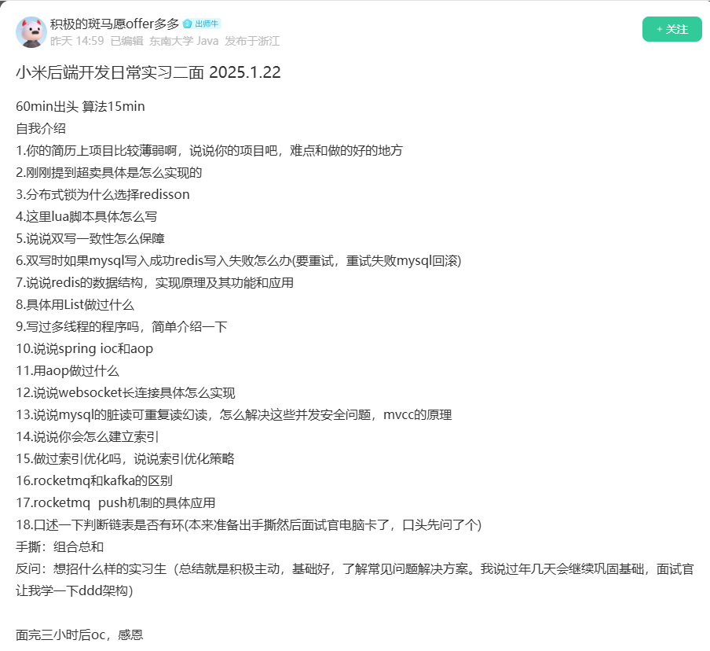

### 解析：
1，**超卖**在 [如何设计一个秒杀系统](https://www.yuque.com/tulingzhouyu/db22bv/zmh8bxm30a2a81p2) 中减库存章节有详细讲解

2，**redisson分布式锁**和**lua**在 [Redis面试题集合](https://www.yuque.com/tulingzhouyu/db22bv/du5hpy6podycogxo) 中六种方案中 

3，**双写时数据一致性问题**参看 ** **[**双写一致性问题如何解决**](https://www.yuque.com/tulingzhouyu/db22bv/tr4oiknyzf0viap1)** 和**[** Canal神器详解**](https://www.yuque.com/tulingzhouyu/db22bv/ugdfg4q0ccqo0r28)

4，**Redis数据结构及原理**和**List做过什么** 参看 [Redis数据类型及实现原理](https://www.yuque.com/tulingzhouyu/db22bv/fmv901lw0u8oew5x/edit?toc_node_uuid=jGASPLbedv2GrcGp#redisobject)

5，说说**多线程**和Spring **IOC AOP**属于基础八股参看Java基础

6，**WebSocket具体实现**参看  [网络面试集合](https://www.yuque.com/tulingzhouyu/db22bv/om32fi26bha6ufgm#ZZRst) 中七中消息推送方案

7，MySQL并发问题：脏读可重复读幻读，MVCC原理 参看 [MVCC实现机制](https://www.yuque.com/tulingzhouyu/db22bv/dramscudnm47xh5s)

8，怎么**建索引**，**索引优化策略** 参看 [MySQL索引设计有哪些原则](https://www.yuque.com/tulingzhouyu/db22bv/ilhr9xhhtrqcq3zd)，[索引失效场景](https://www.yuque.com/tulingzhouyu/db22bv/azdpa9ibwn27gzbn)，[MySQL面试集合](https://www.yuque.com/tulingzhouyu/db22bv/so6mi5fptaanzosx#QU4rO)中SQL优化部分

9，**Rocket和Kafka**以及**推拉模式**应用 参看 [Rocket推拉模式](https://www.yuque.com/tulingzhouyu/db22bv/iz20l15657osg030) 和 [Kafka面试集合](https://www.yuque.com/tulingzhouyu/db22bv/bubwm3kyevkt68m8#Tkn3Q)中消息队列对比部分

10，手撕算法参看 [数据结构预算法](#) 

### 总结：
到此基本面试题已完毕。技术栈包含：**Java基础，MySQL，Redis，MQ**，网络，Spring，并发和锁。穿插了不少基础部分，也有偏八股的，这些各位可以发散和深入。关键要看偏**场景**的和深入**原理**的部分是否能征服面试官。

## 虾皮后端实习一面
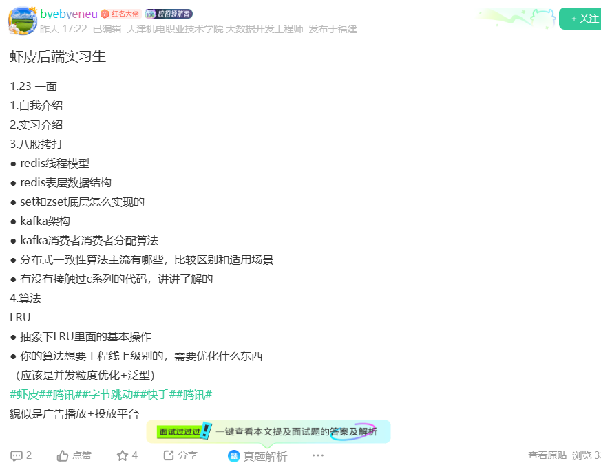

### 解析：
1**，Redis线程模型 **参看 [Redis单线程模型效率为什么也能那么高](https://www.yuque.com/tulingzhouyu/db22bv/sw8n2boxdf4g1y38) 和 [Redis6为什么引入多线程](about:blank)

**2，redis表层数据结构及底层实现** 参看 [Redis数据类型及实现原理](https://www.yuque.com/tulingzhouyu/db22bv/fmv901lw0u8oew5x/edit?toc_node_uuid=jGASPLbedv2GrcGp#redisobject)

**3，Kafka架构和消费分配算法**参看 [Kafka消费者分区策略](https://www.yuque.com/tulingzhouyu/db22bv/pxt0lionnhv3mfab/edit?toc_node_uuid=8ml7qWsPkfPE5MSo)

4，**分布式一致性算法** 参看 [Raft算法](https://www.yuque.com/tulingzhouyu/db22bv/ywiia55xxy96lkcg) 和 [Paxos算法](https://www.yuque.com/tulingzhouyu/db22bv/sh5gb8mbgvo6alip)

5，C系列代码**实则考察查看源码能力** 前面聊到Redis底层数据结构和原理引入

6，**LRU 算法 **直接参看[Redis淘汰策略详解](https://www.yuque.com/tulingzhouyu/db22bv/fn1agyxs0t15wlvu)源码解析部分

### 总结：
到此基本面试题已完毕。技术栈包含： Redis，MQ，分布式，偏八股。不知是否UP主回答的深度不够，故到此结束，感觉机会不会很大。

## 字节一面
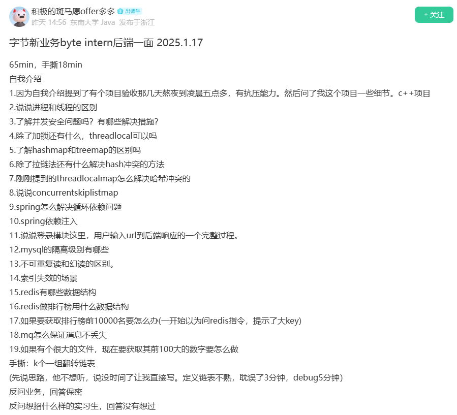

### 解析：
1**，线程和进程 **参看 [线程和进程的区别](https://www.yuque.com/tulingzhouyu/db22bv/hga4qyehlx72yhmy)  

**2，并发安全性和解决措施** 参看 [如何确保线程安全](https://www.yuque.com/tulingzhouyu/db22bv/souuu0lez7inc14r)  和 [并发面试合集](https://www.yuque.com/tulingzhouyu/db22bv/xawecw91rvkqgiil#jlbC7)并发部分

**3，除了加锁和ThreadLocal可以吗 **参看 [并发面试合集](https://www.yuque.com/tulingzhouyu/db22bv/xawecw91rvkqgiil#UPwi1)ThreadLocal底层原理部分

4，**HashMap和TreeMap以及Hash冲突** 参看基础部分的List,Map,Table比较 和 [HashMap底层原理](https://www.yuque.com/tulingzhouyu/db22bv/flzcleillddvwrm2)

5， 说说**ConcurrentSkipList** 参看并发编程 [ConcurrentSkipList系列原理](https://www.yuque.com/tulingzhouyu/db22bv/ln9qeqinrwe13ugn/edit?toc_node_uuid=vFb5MFAB9SEDEjlJ#5Df20)

6，Spring循环依赖 和 依赖注入  参看 [Spring如何解决循环依赖](https://www.yuque.com/tulingzhouyu/db22bv/ys4ul3b33vkyl82e) 和 [Spring面试集合](https://www.yuque.com/tulingzhouyu/db22bv/hnf1tsxt4echn1eb) 中DI部分

7，说说**登录模块完整过程**，纯场景看自己期望薪资深入如登录方式，安全机制，分布式单点，会话管理等

8，**MySQL隔离级别以及RR和RC区别** 参看 [MySQL面试合集](https://www.yuque.com/tulingzhouyu/db22bv/so6mi5fptaanzosx#Chmb8) 隔离级别和MVCC原理部分

9，怎么**索引失效场景**参看 [MySQL索引设计有哪些原则](https://www.yuque.com/tulingzhouyu/db22bv/ilhr9xhhtrqcq3zd)，[索引失效场景](https://www.yuque.com/tulingzhouyu/db22bv/azdpa9ibwn27gzbn)，

**10，redis数据结构及原理**和**排行用什么** 参看 [Redis数据类型及实现原理](https://www.yuque.com/tulingzhouyu/db22bv/fmv901lw0u8oew5x/edit?toc_node_uuid=jGASPLbedv2GrcGp#redisobject)

11，如何获取前10000排名 参看 [Redis的大Key问题如何解决](https://www.yuque.com/tulingzhouyu/db22bv/fg51mlsueyfivzrh) 

12，MQ消息不丢失 参看 [Kafka如何消息可靠](https://www.yuque.com/tulingzhouyu/db22bv/fyuce7d7zglkpwp5) 自己去类推其他MQ或翻看突击宝典

13，手撕算法参看 [数据结构预算法](#)  中排序方法 和 堆排序法等

### 总结：
总的来说题这份面试题还是有代表性的，由浅入深，有宽度和深度。穿插八股+场景以及解决方案。整个流程1h以上。各位备战的小伙伴可作为参考，自行搜索面试宝典中这些技术栈相关场景题。

## 美团一面
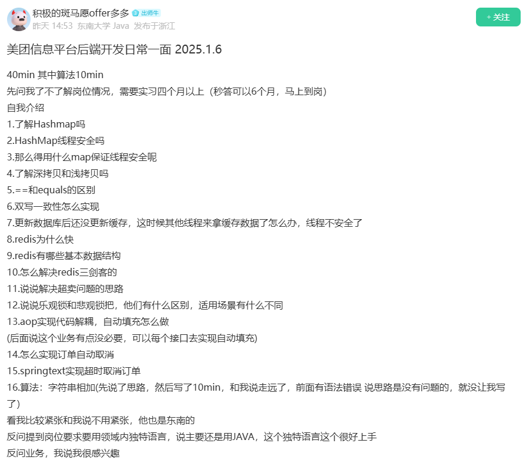

### 解析：
**1，HashMap和TreeMap以及Hash冲突 **参看基础部分的List,Map,Table比较 **和 **[**HashMap底层原理**](https://www.yuque.com/tulingzhouyu/db22bv/flzcleillddvwrm2)

**2， 深拷贝浅拷贝**参看** **[**2025最新突击学员面经**](https://www.yuque.com/tulingzhouyu/db22bv/qpirnvr2l4h7mvq0)中Object和Clone方法

**3，双写一致性 ** 参看** **[**双写一致性问题如何解决**](https://www.yuque.com/tulingzhouyu/db22bv/tr4oiknyzf0viap1)** 和**[** Canal神器详解**](https://www.yuque.com/tulingzhouyu/db22bv/ugdfg4q0ccqo0r28)

**4，Redis线程模型 **参看 [Redis单线程模型效率为什么也能那么高](https://www.yuque.com/tulingzhouyu/db22bv/sw8n2boxdf4g1y38) 和 [Redis6为什么引入多线程](about:blank)

**5，redis表层数据结构及底层实现 **参看** **[**Redis数据类型及实现原理**](https://www.yuque.com/tulingzhouyu/db22bv/fmv901lw0u8oew5x/edit?toc_node_uuid=jGASPLbedv2GrcGp#redisobject)

**6，Redis三剑客  **参看 [Redis合集](https://www.yuque.com/tulingzhouyu/db22bv/du5hpy6podycogxo#UZ89a)中的击穿穿透雪崩

**7， 超卖问题 **参看 [如何设计一个秒杀场景](https://www.yuque.com/tulingzhouyu/db22bv/zmh8bxm30a2a81p2#nY8CA)中的 扣减库存和超卖处理

**8，乐观锁悲观锁 **参看** **[**锁的优化机制**](https://www.yuque.com/tulingzhouyu/db22bv/zo7ggsr0o0xg9ghk)

**9，AOP **参看** **[**Spring合集**](https://www.yuque.com/tulingzhouyu/db22bv/hnf1tsxt4echn1eb#otpQI)中AOP实现原理部分

**10**，**订单延迟处理 **参看 场景题 [订单未支付处理](https://www.yuque.com/tulingzhouyu/db22bv/xiyx85s3fkxqhd4y)

**11**，手撕算法参看 [数据结构预算法](#)   

### 总结：
总的来说题这份面试题还是有代表性的，由浅入深，有宽度和深度。穿插八股+场景以及解决方案。整个流程1h以上。各位备战的小伙伴可作为参考，自行搜索面试宝典中这些技术栈和相关场景题。

      

## 阿里高德
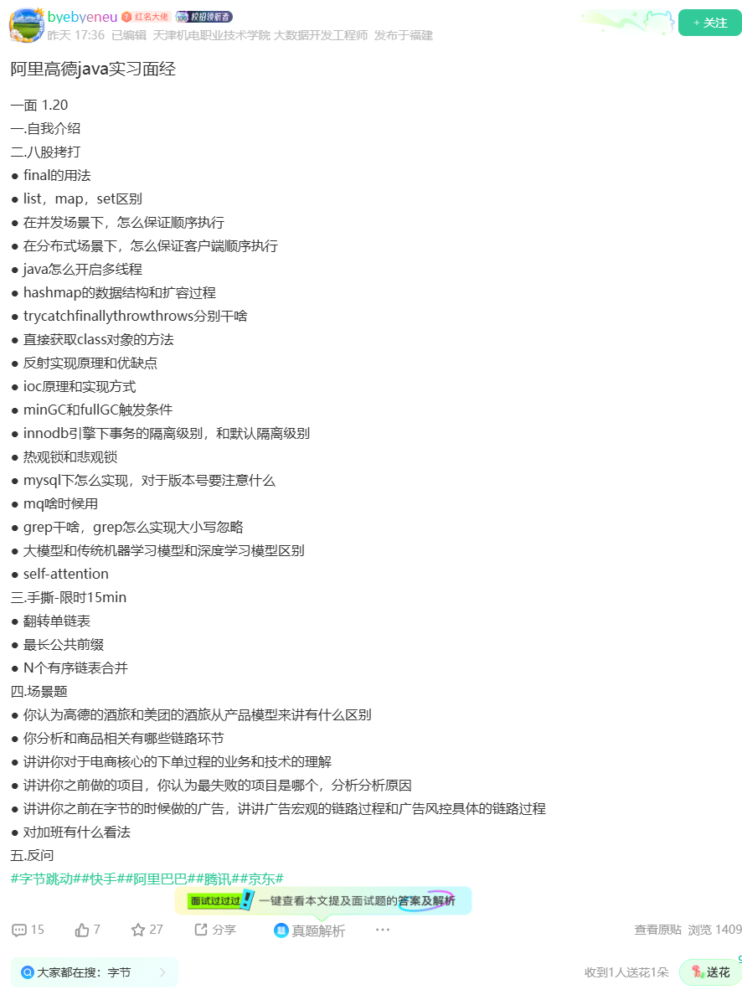

### 解析：
1**，可先自行模拟面 或 翻看面试突击宝典，基本大同小异**

### 总结：
      

## 华为OD 2年经验
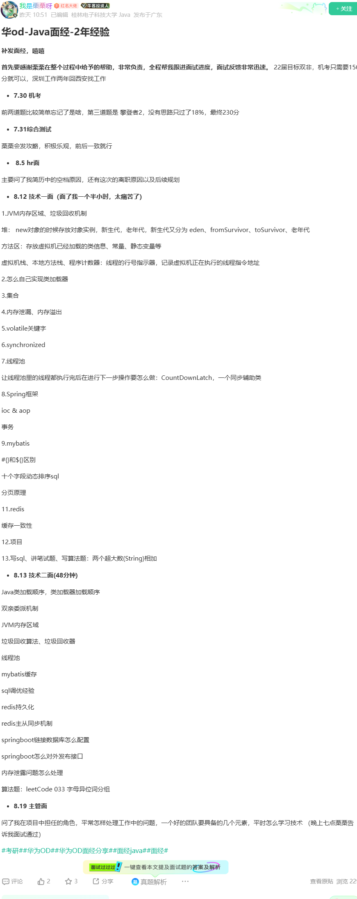

### 解析：
**1，可先自行模拟面 或 翻看面试突击宝典，基本大同小异**

### 总结：
## 腾讯音乐 二面
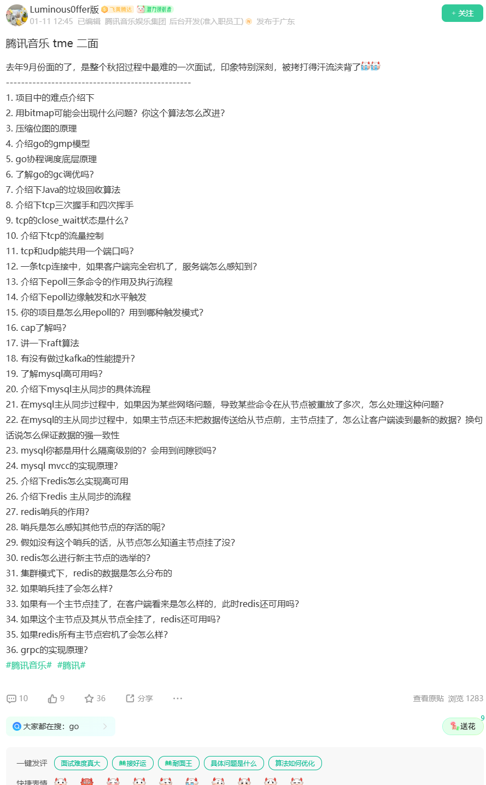

### 解析：
1**，可先自行模拟面 或 翻看面试突击宝典，基本大同小异**

### 总结：

> 更新: 2025-03-17 19:57:48  
> 原文: <https://www.yuque.com/tulingzhouyu/db22bv/dit82ge59e96zfbh>