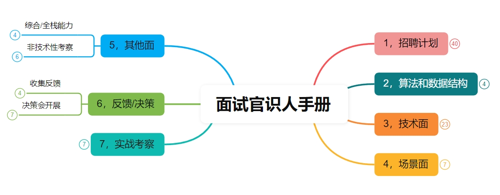

# 💎面试官识人手册

> **面试管识人**：理论上此篇主要是给担任面试官的小伙伴的，但应聘者能做到知己知彼不是更好吗。
>
> **招聘识人流程：****计划目标制定， 面试技术栈，面试场景，面试反馈/决策**
>
> [**天明**](https://www.yuque.com/tianming-aroh0)**荐语：流程-模板仅供参考，请勿照搬！**
>

话不多说，先上大图：

更多细节可：验证码TiMi

[https://www.processon.com/embed/6845273c451e8a0318499649?cid=6845273c451e8a031849964c](https://www.processon.com/embed/6845273c451e8a0318499649?cid=6845273c451e8a031849964c)

> 更新: 2025-06-19 08:56:49  
> 原文: <https://www.yuque.com/tulingzhouyu/db22bv/ggq27mk8xlt2uwzv>