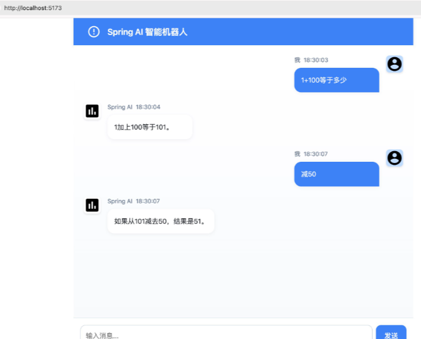

# AI 全渠道客户服务中心项目

最近部分小伙伴说Java 卷不动了，面临失业，被裁风险，面试问及AI，Deepseek,面试题和项目场景不在少数。部分程序员可能会思考，AI赛道就好进吗？你又不写算法搞科研，只是让项目集成AI让他集成大模型更加智能化这有何难呢？

今年各位大佬已经归位，重点强调AI时代即将到来，Java将重新主导AI应用领域，准备突击新的赛道让简历和面试在竞争者中脱颖而出的小伙伴，可参看这里给大家优化的一份 AI Agent 智能体平台项目。

### **<font style="color:rgb(6, 6, 7);">项目描述</font>**
<font style="color:rgb(6, 6, 7);">AI Cloud全渠道客户服务中心是一个基于Java的AI微服务</font>**<font style="color:rgb(6, 6, 7);">大型平台</font>**<font style="color:rgb(6, 6, 7);">，</font><font style="color:rgba(6, 8, 31, 0.88);">日均</font>**<font style="color:rgba(6, 8, 31, 0.88);">10万</font>**<font style="color:rgba(6, 8, 31, 0.88);">+API调用服务。</font><font style="color:rgb(6, 6, 7);">该项目集成了先进的人工智能技术，通过大模型应用、呼叫中心、在线客服机器人、呼入机器人、人工在线客服以及工单系统，实现了多渠道覆盖和</font>**<font style="color:rgb(6, 6, 7);">多场景</font>**<font style="color:rgb(6, 6, 7);">应用的智能化服务等</font>**<font style="color:rgb(6, 6, 7);">几十种解决方案</font>**<font style="color:rgb(6, 6, 7);">。它不仅提升了服务效率和协同工作效率，还通过一呼即应的AI语音服务和稳定的功能，为企业提供</font>**<font style="color:rgb(6, 6, 7);">高性价比</font>**<font style="color:rgb(6, 6, 7);">的客服体验，从而推动企业服务的创新和升级。</font>

### **<font style="color:rgb(6, 6, 7);">所用技术</font>**
+ **<font style="color:rgb(6, 6, 7);">框架</font>**<font style="color:rgb(6, 6, 7);">：Spring Boot、Spring Cloud Alibaba</font>
+ **<font style="color:rgb(6, 6, 7);">数据库</font>**<font style="color:rgb(6, 6, 7);">：MySQL、ShardingSphere</font>
+ **<font style="color:rgb(6, 6, 7);">缓存</font>**<font style="color:rgb(6, 6, 7);">：Redis</font>
+ **<font style="color:rgb(6, 6, 7);">消息队列</font>**<font style="color:rgb(6, 6, 7);">：Kafka</font>
+ **<font style="color:rgb(6, 6, 7);">安全</font>**<font style="color:rgb(6, 6, 7);">：Spring Security、JWT</font>
+ **<font style="color:rgb(6, 6, 7);">AI框架</font>**<font style="color:rgb(6, 6, 7);">：Spring AI，Spring AI Alibaba，DeepSeek</font>
+ **<font style="color:rgb(6, 6, 7);">监控与网关</font>**<font style="color:rgb(6, 6, 7);">：Higress</font>
+ **<font style="color:rgb(6, 6, 7);">存储</font>**<font style="color:rgb(6, 6, 7);">：MinIO</font>

### **<font style="color:rgb(6, 6, 7);">项目亮点</font>**
1. **<font style="color:rgb(6, 6, 7);">高性能架构</font>**<font style="color:rgb(6, 6, 7);">：</font>
    - <font style="color:rgb(6, 6, 7);">使用Higress作为API网关，支持高性能和丰富的功能特性。</font><font style="color:rgba(6, 8, 31, 0.88);">采用多级缓存架构，将API查询延迟控制在100ms以内</font>
    - <font style="color:rgb(6, 6, 7);">通过ShardingSphere实现数据库的分库分表，提升数据处理能力。</font><font style="color:rgba(6, 8, 31, 0.88);">解决了亿级消息数据存储问题</font>
    - <font style="color:rgb(6, 6, 7);">使用MinIO作为对象存储，优化文件存储和访问效率。支持PB级文档存储，100+种格式在线预览。</font>
2. **<font style="color:rgb(6, 6, 7);">AI能力集成</font>**<font style="color:rgb(6, 6, 7);">：</font>
    - <font style="color:rgb(6, 6, 7);">集成Spring AI,Spring AI Alibaba框架，支持对话、绘图等AI功能。并完善处理AI模型故障转移，准确率90%以上</font>
    - <font style="color:rgb(6, 6, 7);">提供了Model、Prompt、RAG、Tools等AI应用开发所需的必备能力，支持从低层次的提示词模板到高层次的智能体和对话记忆等功能。提供多轮对话和用户历史数据管理，提升用户体验。</font>
3. **<font style="color:rgb(6, 6, 7);">优化策略</font>**<font style="color:rgb(6, 6, 7);">：</font>
    - **<font style="color:rgb(6, 6, 7);">缓存优化</font>**<font style="color:rgb(6, 6, 7);">：引入Redis缓存热点数据，减少数据库压力。缓存命中率90%以上。</font>
    - **<font style="color:rgb(6, 6, 7);">异步处理</font>**<font style="color:rgb(6, 6, 7);">：集成Kafka实现异步消息处理，提升系统吞吐量。</font><font style="color:rgba(6, 8, 31, 0.88);">提高系统可用性达99.99%</font>
    - **<font style="color:rgb(6, 6, 7);">限流与熔断</font>**<font style="color:rgb(6, 6, 7);">：通过Higress设置合理的限流规则，并启用熔断器模式，确保高并发场景下的稳定性</font><font style="color:rgb(6, 6, 7);">。</font>
4. **<font style="color:rgb(6, 6, 7);">用户体验</font>**<font style="color:rgb(6, 6, 7);">：</font>
    - <font style="color:rgb(6, 6, 7);">提供社区讨论、评论和点赞功能，增强用户互动。并加入AI评论审核等功能，提升用户体验。</font>
    - <font style="color:rgb(6, 6, 7);">基于Spring AI Alibaba和通义大模型，通过RAG能力和向量数据库优化查询效率，并通过Higress插件实现服务的高可用性和安全性。最终，该项目在开源官网的流量提升了20%，人工答疑成本降低了20%，准确率达到了90%以上</font>

### **<font style="color:rgb(6, 6, 7);">项目难点</font>**
1. **<font style="color:rgb(6, 6, 7);">高并发请求处理</font>**<font style="color:rgb(6, 6, 7);">：</font>
    - <font style="color:rgba(6, 8, 31, 0.88);">采用多级缓存(本地缓存+Redis集群)架构，将高频请求延迟控制在200ms以内</font>
    - <font style="color:rgba(6, 8, 31, 0.88);">设计了分布式锁+消息队列的架构，实现消息会话峰值1000+TPS的稳定处理</font>
    - <font style="color:rgba(6, 8, 31, 0.88);">使用分库分表技术，解决了亿级消息数据存储问题（视情况写）</font>
2. **<font style="color:rgb(6, 6, 7);">数据一致性</font>**<font style="color:rgb(6, 6, 7);">：</font>
    - <font style="color:rgb(6, 6, 7);">分布式架构下如何保证数据一致性是一个关键问题</font><font style="color:rgb(6, 6, 7);">。</font>
    - <font style="color:rgb(6, 6, 7);">解决方案：使用ShardingSphere的分布式事务和Canal监控MySQL的Binlog，确保数据的实时同步和一致性</font><font style="color:rgb(6, 6, 7);">。</font>
    - <font style="color:rgb(6, 6, 7);">并且加入</font><font style="color:rgba(6, 8, 31, 0.88);">补偿机制处理分布式事务异常，确保数据最终一致性</font>
3. **<font style="color:rgb(6, 6, 7);">AI模型调用优化</font>**<font style="color:rgb(6, 6, 7);">：</font>
    - <font style="color:rgb(6, 6, 7);">如何在保证AI功能的同时，降低模型调用成本和延迟</font><font style="color:rgb(6, 6, 7);">。</font>
    - <font style="color:rgb(6, 6, 7);">解决方案：通过Spring AI的全局参数和增强函数调用能力，优化数据库操作和模型调用流程。并加入异步消息处理缓存热点，优化资源池，响应时间控制在100ms内。</font>

---

### **<font style="color:rgb(6, 6, 7);">场景题及答案</font>**
#### **<font style="color:rgb(6, 6, 7);">1. 场景题：高并发场景下的性能优化</font>**
**<font style="color:rgb(6, 6, 7);">问题</font>**<font style="color:rgb(6, 6, 7);">：  
</font><font style="color:rgb(6, 6, 7);">在AI Cloud项目中，当面临高并发请求时，系统可能会出现响应延迟和资源瓶颈。请描述一下你是如何优化系统的性能以应对这种情况的？</font>

**<font style="color:rgb(6, 6, 7);">答案</font>**<font style="color:rgb(6, 6, 7);">：  
</font><font style="color:rgb(6, 6, 7);">在AI Cloud项目中，我们采取了以下策略来优化高并发场景下的性能：</font>

1. **<font style="color:rgb(6, 6, 7);">使用Higress网关</font>**<font style="color:rgb(6, 6, 7);">：通过Higress的负载均衡和限流功能，合理分配请求到不同的服务实例，避免单点过载。同时，启用熔断器模式，当某个服务出现故障时，自动切换到备用服务，确保系统的高可用性</font><font style="color:rgb(6, 6, 7);">。</font>

```yaml
apiVersion: gateway.higress.io/v1
kind: RateLimit
metadata:
  name: ai-cloud-rate-limit
spec:
  rules:
    - match:
        path: /api/*
      limit:
        requestsPerSecond: 100
```

2. **<font style="color:rgb(6, 6, 7);">异步消息处理</font>**<font style="color:rgb(6, 6, 7);">：集成Kafka实现异步消息队列，将非实时性任务（如日志记录、通知推送等）放入队列中异步处理，减少主线程的负担，提升系统吞吐量</font><font style="color:rgb(6, 6, 7);">。</font>
3. **<font style="color:rgb(6, 6, 7);">缓存优化</font>**<font style="color:rgb(6, 6, 7);">：引入Redis缓存热点数据，如用户信息、常见查询结果等，减少对数据库的直接访问，降低数据库压力，提升响应速度</font><font style="color:rgb(6, 6, 7);">。</font>
4. **<font style="color:rgb(6, 6, 7);">数据库分库分表</font>**<font style="color:rgb(6, 6, 7);">：使用ShardingSphere对数据库进行分库分表操作，将数据分散到多个数据库和表中，提升数据读写性能</font><font style="color:rgb(6, 6, 7);">。</font>
5. **<font style="color:rgb(6, 6, 7);">资源池化</font>**<font style="color:rgb(6, 6, 7);">：对数据库连接、线程等资源进行池化管理，减少资源创建和销毁的开销，提升资源利用率</font><font style="color:rgb(6, 6, 7);">。</font>

<font style="color:rgb(6, 6, 7);">通过以上优化措施，系统在高并发场景下的响应时间显著降低，资源利用率大幅提升。</font>

---

#### **<font style="color:rgb(6, 6, 7);">2. 场景题：AI模型调用的优化</font>**
**<font style="color:rgb(6, 6, 7);">问题</font>**<font style="color:rgb(6, 6, 7);">： 当第三方API？  
</font><font style="color:rgb(6, 6, 7);">在AI Cloud项目中，AI模型的调用是性能瓶颈之一。你是如何优化AI模型调用的性能，同时保证调用的准确性和效率的？</font>

**<font style="color:rgb(6, 6, 7);">答案</font>**<font style="color:rgb(6, 6, 7);">：  
</font><font style="color:rgb(6, 6, 7);">为了优化AI模型调用的性能，我们采取了以下策略：</font>

1. **<font style="color:rgb(6, 6, 7);">缓存机制</font>**<font style="color:rgb(6, 6, 7);">：对于高频且重复的查询请求，我们使用Redis缓存模型的调用结果。如果缓存中存在相同请求的结果，则直接返回缓存数据，避免重复调用模型</font><font style="color:rgb(6, 6, 7);">。</font>
2. **<font style="color:rgb(6, 6, 7);">模型预热</font>**<font style="color:rgb(6, 6, 7);">：在系统启动时，对常用模型进行预加载和预热，确保模型在首次调用时能够快速响应</font><font style="color:rgb(6, 6, 7);">。</font>
3. **<font style="color:rgb(6, 6, 7);">异步调用</font>**<font style="color:rgb(6, 6, 7);">：对于一些非实时性要求的模型调用，我们采用异步方式处理。将请求放入队列，由后台线程池逐步处理，减少对主线程的阻塞</font><font style="color:rgb(6, 6, 7);">。</font>
4. **<font style="color:rgb(6, 6, 7);">负载均衡</font>**<font style="color:rgb(6, 6, 7);">：通过Higress网关对AI模型服务进行负载均衡，将请求分发到多个模型服务实例，提升模型调用的整体性能</font><font style="color:rgb(6, 6, 7);">。</font>
5. **<font style="color:rgb(6, 6, 7);">优化提示词</font>**<font style="color:rgb(6, 6, 7);">：在调用AI模型时，我们对提示词进行优化，减少不必要的信息，提高模型的响应速度</font><font style="color:rgb(6, 6, 7);">。</font>

<font style="color:rgb(6, 6, 7);">通过这些优化措施，AI模型的调用性能得到了显著提升，同时保证了调用的准确性和效率。</font>

---

#### **<font style="color:rgb(6, 6, 7);">3. 场景题：分布式事务一致性</font>**
**<font style="color:rgb(6, 6, 7);">问题</font>**<font style="color:rgb(6, 6, 7);">：  
</font><font style="color:rgb(6, 6, 7);">在AI Cloud项目中，由于采用了分库分表的架构，分布式事务的一致性是一个关键问题。你是如何解决分布式事务一致性问题的？</font>

**<font style="color:rgb(6, 6, 7);">答案</font>**<font style="color:rgb(6, 6, 7);">：  
</font><font style="color:rgb(6, 6, 7);">为了保证分布式事务的一致性，我们采取了以下措施：</font>

1. **<font style="color:rgb(6, 6, 7);">使用ShardingSphere的分布式事务</font>**<font style="color:rgb(6, 6, 7);">：ShardingSphere提供了两阶段提交、补偿事务（TCC）和本地消息表等多种分布式事务解决方案。我们根据业务场景选择了合适的事务模式，确保数据在多个分片之间的同步和一致性</font><font style="color:rgb(6, 6, 7);">。</font>
2. **<font style="color:rgb(6, 6, 7);">Canal监控MySQL Binlog</font>**<font style="color:rgb(6, 6, 7);">：通过Canal监控MySQL的Binlog日志，实时捕获数据库的变更操作，并将这些变更同步到其他分片或服务中，确保数据的最终一致性</font><font style="color:rgb(6, 6, 7);">。</font>
3. **<font style="color:rgb(6, 6, 7);">本地消息表</font>**<font style="color:rgb(6, 6, 7);">：在一些业务场景中，我们使用本地消息表的方式实现分布式事务。通过在本地数据库中记录消息状态，确保消息的可靠传递和事务的完整性</font><font style="color:rgb(6, 6, 7);">。</font>
4. **<font style="color:rgb(6, 6, 7);">重试机制</font>**<font style="color:rgb(6, 6, 7);">：在分布式事务中，我们引入了重试机制。如果某个事务在某个分片中失败，系统会自动重试，确保事务的最终成功</font><font style="color:rgb(6, 6, 7);">。</font>

<font style="color:rgb(6, 6, 7);">通过这些措施，我们有效地解决了分布式事务一致性问题，确保了数据的完整性和准确性。</font>

---

#### **<font style="color:rgb(6, 6, 7);">4. 场景题：AI模型的故障转移</font>**
**<font style="color:rgb(6, 6, 7);">问题</font>**<font style="color:rgb(6, 6, 7);">：  
</font><font style="color:rgb(6, 6, 7);">在AI Cloud项目中，如果某个AI模型服务出现故障，你是如何实现故障转移，确保系统的可用性的？</font>

**<font style="color:rgb(6, 6, 7);">答案</font>**<font style="color:rgb(6, 6, 7);">：  
</font><font style="color:rgb(6, 6, 7);">为了确保AI模型服务的高可用性，我们实现了以下故障转移机制：</font>

1. **<font style="color:rgb(6, 6, 7);">Higress网关的熔断器模式</font>**<font style="color:rgb(6, 6, 7);">：通过Higress网关的熔断器模式，当某个AI模型服务出现故障时，自动切换到备用服务实例</font><font style="color:rgb(6, 6, 7);">。</font>
2. **<font style="color:rgb(6, 6, 7);">多实例部署</font>**<font style="color:rgb(6, 6, 7);">：我们将AI模型服务部署在多个实例上，通过负载均衡将请求分发到不同的实例，确保即使某个实例出现故障，其他实例仍能正常响应</font><font style="color:rgb(6, 6, 7);">。</font>
3. **<font style="color:rgb(6, 6, 7);">健康检查</font>**<font style="color:rgb(6, 6, 7);">：定期对AI模型服务进行健康检查，如果发现某个服务实例不可用，立即从负载均衡池中移除，并启动新的实例</font><font style="color:rgb(6, 6, 7);">。</font>
4. **<font style="color:rgb(6, 6, 7);">降级策略</font>**<font style="color:rgb(6, 6, 7);">：在某些情况下，如果AI模型服务完全不可用，我们采用降级策略，返回预定义的默认结果或提示用户稍后再试</font><font style="color:rgb(6, 6, 7);">。</font>

<font style="color:rgb(6, 6, 7);">通过这些措施，我们确保了AI模型服务的高可用性，即使在部分服务故障的情况下，系统仍能正常运行。</font>

---

#### **<font style="color:rgb(6, 6, 7);">5. 场景题：社区功能的性能优化</font>**
**<font style="color:rgb(6, 6, 7);">问题</font>**<font style="color:rgb(6, 6, 7);">：  
</font><font style="color:rgb(6, 6, 7);">在AI Cloud项目中，社区讨论、评论和点赞功能是用户交互的重要部分。这些功能可能会对数据库造成较大压力，你是如何优化这些功能的性能的？</font>

**<font style="color:rgb(6, 6, 7);">答案</font>**<font style="color:rgb(6, 6, 7);">：  
</font><font style="color:rgb(6, 6, 7);">为了优化社区功能的性能，我们采取了以下措施：</font>

1. **<font style="color:rgb(6, 6, 7);">缓存热点数据</font>**<font style="color:rgb(6, 6, 7);">：对于热门帖子、评论和点赞数据，我们使用Redis缓存这些热点数据，减少对数据库的直接访问</font><font style="color:rgb(6, 6, 7);">。</font>
2. **<font style="color:rgb(6, 6, 7);">异步处理</font>**<font style="color:rgb(6, 6, 7);">：将评论和点赞操作放入消息队列（如Kafka），由后台线程池异步处理。这样可以减少对主线程的阻塞，提升用户体验</font><font style="color:rgb(6, 6, 7);">。</font>
3. **<font style="color:rgb(6, 6, 7);">分页查询优化</font>**<font style="color:rgb(6, 6, 7);">：对于帖子和评论的分页查询，我们优化了SQL语句，避免全表扫描，同时使用索引加速查询</font><font style="color:rgb(6, 6, 7);">。</font>
4. **<font style="color:rgb(6, 6, 7);">读写分离</font>**<font style="color:rgb(6, 6, 7);">：通过ShardingSphere实现数据库的读写分离，将查询操作和写入操作分别路由到不同的数据库实例，提升数据库的读写性能</font><font style="color:rgb(6, 6, 7);">。</font>
5. **<font style="color:rgb(6, 6, 7);">限流策略</font>**<font style="color:rgb(6, 6, 7);">：通过Higress网关对社区功能的接口设置限流策略，避免短时间内大量请求对数据库造成过大压力</font><font style="color:rgb(6, 6, 7);">。</font>

<font style="color:rgb(6, 6, 7);">通过这些优化措施，社区功能的性能得到了显著提升，用户体验也得到了改善。</font>

<font style="color:rgb(6, 6, 7);">通过对AI Cloud项目的优化，系统在高并发场景下的稳定性显著提升，响应速度大幅加快，用户体验得到极大改善</font>

#### **<font style="color:rgb(6, 6, 7);">6. 场景题：Spring AI 接入最新Deepseek满血版</font>**
<font style="color:rgb(6, 6, 7);">问题：  
</font><font style="color:rgb(6, 6, 7);">在AI Cloud项目中，Spring AI 如何接入最新Deepseek满血版？用户问问题每次都是新的一次对话，无法做到多轮次，如何解决对话记忆多轮追问的问题。</font>

<font style="color:rgb(6, 6, 7);">答案：  
</font><font style="color:rgb(6, 6, 7);">硅基流动满血版ds密钥参看</font>[AI大模型Deepseek](https://www.yuque.com/tulingzhouyu/db22bv/mhxbg9dqfhfms5qz)

<font style="color:rgb(6, 6, 7);">在application.properties添加如下配置：</font>

```yaml
spring.ai.openai.base-url=https://api.siliconflow.cn/
spring.ai.openai.api-key=你自己的密钥
spring.ai.openai.chat.options.model=deepseek-ai/DeepSeek-V3
logging.level.org.springframework.ai.chat.client.advisor=DEBUG
```

<font style="color:rgb(6, 6, 7);">pom.xml添加openai starter，因为接口是兼容openai api规范的。</font>

```yaml
<dependency>
			<groupId>org.springframework.ai</groupId>
			<artifactId>spring-ai-openai-spring-boot-starter</artifactId>
</dependency>
```

<font style="color:rgb(77, 77, 77);">新建</font>`<font style="color:rgb(199, 37, 78);background-color:rgb(249, 242, 244);">Config</font>`<font style="color:rgb(77, 77, 77);">配置类，设置智能体的人设。</font>

```java
@Configuration
class Config {
    @Bean
    ChatClient chatClient(ChatClient.Builder builder) {
        return builder.defaultSystem("你是一个智能机器人,你的名字叫 Spring AI智能机器人").build();

    }
}

```

<font style="color:rgb(6, 6, 7);">新建ChatbotController类,因为需要流式传输，后端需要支持流式响应，前端要能逐步接收并显示数据。可能需要使用Server-Sent Events（SSE）或者WebSocket。不过考虑到简单性，SSE可能更容易在Spring中实现，因为它是基于HTTP的，不需要额外的协议。</font>

```java
@RestController
@CrossOrigin("*")
@Slf4j
public class ChatbotController {
   
    private final ChatClient chatClient;

    public ChatbotController(ChatClient chatClient {
        this.chatClient = chatClient;
    }

    @PostMapping(value = "/chat/stream", produces = MediaType.TEXT_EVENT_STREAM_VALUE)
    public Flux<ServerSentEvent<String>> streamChat(@RequestBody ChatRequest request) {
        //用户id
        String userId = request.userId();

        return chatClient.prompt(request.message())
                .stream().content().map(content -> ServerSentEvent.builder(content).event("message").build())
                //问题回答结速标识,以便前端消息展示处理
                .concatWithValues(ServerSentEvent.builder("[DONE]").build())
                .onErrorResume(e -> Flux.just(ServerSentEvent.builder("Error: " + e.getMessage()).event("error").build()));
    }

    record ChatRequest(String userId, String message) {

    }
}
```

1. <font style="color:rgba(0, 0, 0, 0.75);">使用标准</font><font style="color:rgba(0, 0, 0, 0.75);"> </font>`<font style="color:rgb(199, 37, 78);background-color:rgb(249, 242, 244);">ServerSentEvent</font>`<font style="color:rgba(0, 0, 0, 0.75);"> </font><font style="color:rgba(0, 0, 0, 0.75);">构建响应</font>
2. <font style="color:rgba(0, 0, 0, 0.75);">增加结束标识</font><font style="color:rgba(0, 0, 0, 0.75);"> </font>`<font style="color:rgb(199, 37, 78);background-color:rgb(249, 242, 244);">[DONE]</font>`<font style="color:rgba(0, 0, 0, 0.75);"> </font><font style="color:rgba(0, 0, 0, 0.75);">事件</font>
3. <font style="color:rgba(0, 0, 0, 0.75);">支持事件类型区分（</font>`<font style="color:rgb(199, 37, 78);background-color:rgb(249, 242, 244);">message/error</font>`<font style="color:rgba(0, 0, 0, 0.75);">）</font>

接口测试

```java
curl -X POST -H "Content-Type: application/json" -d '{"userId":"testuserid", "message":"你好"}' http://localhost:8080/chat/stream 
event:message
data:你好
event:message
data:！
event:message
data:我是  ...............................................
```

<font style="color:rgb(6, 6, 7);">前端调用</font>

npm create vite@latest

实际效果：


#### <font style="color:rgb(79, 79, 79);">对话记忆(多轮对话)</font>
<font style="color:rgb(77, 77, 77);">到目前为止对话实现，其实存在一个大问题，用户问问题每次都是新的一次对话，无法做到多轮次，就是常说的对话记忆，如下图所示问题所在：</font>


<font style="color:rgb(77, 77, 77);">如上图所示，大模型两次回复是独立的，没有形成对话记忆，要实现这个功能，Spring AI提供了Advisors API，MessageChatMemoryAdvisor主要实现对话记忆，本文基于内存的方式，首先Config类新增内存记忆的Bean。</font>

```java
@Configuration
class Config {

    @Bean
    ChatClient chatClient(ChatClient.Builder builder) {
        return builder.defaultSystem("你是一个智能机器人,你的名字叫 Spring AI智能机器人").build();
    }

    @Bean
    InMemoryChatMemory inMemoryChatMemory() {
        return new InMemoryChatMemory();
    }

}
```


<font style="color:rgb(77, 77, 77);"></font>

<font style="color:rgb(77, 77, 77);">对话接口修改如下：</font>

```java
@PostMapping(value = "/chat/stream", produces = MediaType.TEXT_EVENT_STREAM_VALUE)
    public Flux<ServerSentEvent<String>> streamChat(@RequestBody ChatRequest request) {
        //用户id
        String userId = request.userId();

        return chatClient.prompt(request.message())
                .advisors(new MessageChatMemoryAdvisor(inMemoryChatMemory, userId, 10), new SimpleLoggerAdvisor())
                .stream().content().map(content -> ServerSentEvent.builder(content).event("message").build())
                //问题回答结速标识,以便前端消息展示处理
                .concatWithValues(ServerSentEvent.builder("[DONE]").build())
                .onErrorResume(e -> Flux.just(ServerSentEvent.builder("Error: " + e.getMessage()).event("error").build()));
    }
 
```

<font style="color:rgb(77, 77, 77);"> </font>

**<font style="color:rgb(77, 77, 77);">核心代码分析</font>**<font style="color:rgb(77, 77, 77);">：</font>

<font style="color:rgb(77, 77, 77);">new </font>**<font style="color:rgb(77, 77, 77);">MessageChatMemoryAdvisor</font>**<font style="color:rgb(77, 77, 77);">(inMemoryChatMemory, userId, 10)</font>

<font style="color:rgb(6, 6, 7);">负责管理聊天历史记录（</font>`ChatMemory`<font style="color:rgb(6, 6, 7);">），并提供某种策略或建议（</font>`Advisor`<font style="color:rgb(6, 6, 7);">）来优化聊天记忆的使用。</font>

+ `**ChatMemory**`<font style="color:rgb(6, 6, 7);">：通常用于存储聊天历史记录，可能包括消息内容、时间戳、用户ID等。</font>
+ `**Advisor**`<font style="color:rgb(6, 6, 7);">：可能表示这个类会根据某些规则或策略来处理聊天记忆，例如清理旧消息、优化存储、提供上下文等。</font>

构造函数<font style="color:rgb(6, 6, 7);">接收三个参数：</font>

1. `**inMemoryChatMemory**`<font style="color:rgb(6, 6, 7);">：</font>
    - <font style="color:rgb(6, 6, 7);">这是一个对象，是某种内存中的聊天历史存储（</font>`InMemoryChatMemory`<font style="color:rgb(6, 6, 7);">）。它可能是一个数据结构（如数组、列表或哈希表），用于存储当前会话的聊天记录。</font>
    - <font style="color:rgb(6, 6, 7);">这个参数可能是 </font>`MessageChatMemoryAdvisor`<font style="color:rgb(6, 6, 7);"> 的主要依赖，用于读取和操作聊天历史。</font>
2. `**userId**`<font style="color:rgb(6, 6, 7);">：</font>
    - <font style="color:rgb(6, 6, 7);">这是一个用户标识符，用于区分不同的用户会话。</font>
    - <font style="color:rgb(6, 6, 7);">在多用户场景下，</font>`userId`<font style="color:rgb(6, 6, 7);"> 是必要的，以确保每个用户的聊天历史被正确隔离和管理。</font>
3. `**10**`<font style="color:rgb(6, 6, 7);">：</font>
    - <font style="color:rgb(6, 6, 7);">这个参数是一个配置值，例如：</font>
        * **<font style="color:rgb(6, 6, 7);">限制聊天历史的长度</font>**<font style="color:rgb(6, 6, 7);">：只保留最近的 10 条消息。</font>
        * **<font style="color:rgb(6, 6, 7);">设置某种阈值</font>**<font style="color:rgb(6, 6, 7);">：例如清理旧消息的频率或触发条件。</font>
        * **<font style="color:rgb(6, 6, 7);">其他配置</font>**<font style="color:rgb(6, 6, 7);">：例如内存大小限制、优先级等。</font>

<font style="color:rgb(77, 77, 77);">对话添加一个上下文记忆增强，每个用户数据是隔离的，10表示历史对话数据最多取10条，每次向大模型发送消息，实际上会把用户前面的问题一起组装到Prompt中。</font>

<font style="color:rgb(77, 77, 77);">修改后实现的支持对话记忆的功能：</font>



<font style="color:rgb(77, 77, 77);">这样就实现了上下文记忆。</font>

##### 更多详情：
[Spring AI 快速接入 DeepSeek构建 AI智能机器人](https://blog.csdn.net/renpeng301/article/details/145369138)

<font style="color:rgb(6, 6, 7);">AI 和大模型相关细节可参看</font>**<font style="color:rgb(6, 6, 7);"> </font>**[**AI大模型Deepseek目录**](https://www.yuque.com/tulingzhouyu/db22bv/mdm69mxldu64dfld)<font style="color:rgb(6, 6, 7);">下面的文档。</font>

<font style="color:rgb(6, 6, 7);">需要准备更多此方面面试的可参看 图灵课堂关于</font>**<font style="color:rgb(6, 6, 7);"> </font>**[**吃透AI大模型面试夺命连环33问 **](https://www.bilibili.com/video/BV1YKAeemExE/?spm_id_from=333.1365.list.card_archive.click&vd_source=04d13f3e51316f05440d2eb2411de9f3)<font style="color:rgb(6, 6, 7);">| 3天刷完RAG+大模型微调+LangChain+LangGraph+DeepSeek，面试一套搞定！</font>

更多项目可参看**<font style="color:#117CEE;">中科院和云计算与大数据研究所</font>**公布的相关产品：

<font style="color:rgb(6, 6, 7);">Higress框架可用于零代码构建AI应用，通过Envoy数据面和WASM插件实现热更新，避免后端插件更新导致的服务中断。同时，Higress还提供了Token流控、WAF插件集成、AI Proxy插件等功能，以保障服务的稳定性和安全性</font>

<font style="color:rgb(6, 6, 7);">Spring AI Alibaba提供了Model、Prompt、RAG、Tools等AI应用开发所需的必备能力，支持从低层次的提示词模板到高层次的智能体和对话记忆等功能。</font>

Langchain4J也让Java能直接对接DS，GPT这样的模型，开源的Jlama框架更能让Java本地去运行百亿参数的模型。

**Java+AI的三大主攻方向**：

1：Agent应用开发，2：模型私有定制化，3智能搜索和广告推荐


**相关产品**：

<font style="color:rgb(0, 0, 0);">01AI Cloud Infra：面向智能计算/存储/网络/资源虚拟化/软硬件协同/异构资源兼容/超智融合等方面有创新性的解决方案或产品。</font>

<font style="color:rgb(0, 0, 0);">02AI Cloud Platform：面向异构资源调度/多云智算资源管理/智算服务/机器学习服务/大模型服务/训推加速/模型精调及评测/智能服务编排/面向AI原生应用的软件工程等方面有创新性的解决方案或产品。</font>

<font style="color:rgb(0, 0, 0);">03AI Cloud Networking：面向智能云网关/网络大模型/自智云网成熟度/人工智能网络等方面的产品服务能力。</font>

<font style="color:rgb(0, 0, 0);">04AI Cloud Native：面向云服务提供商及企业用户，专注于面向AI的云原生产品、服务及解决方案。涉及云原生AI容器、云原生AI弹性调度、云原生AI制品仓库、AI作业管理支持以及云原生AI降本增效等领域。</font>

<font style="color:rgb(0, 0, 0);">05AI Cloud MaaS：面向模型云服务提供商及企业用户，包括模型服务支持、应用开发、应用市场、SDK/API部署等模型云服务产品及解决方案。</font>

<font style="color:rgb(0, 0, 0);">06AI Cloud Tool/API：面向人工智能工具提供商及企业用户，包括基础工具(如智能体，文件检索等)和针对特定行业定制的场景化工具（如财报助手、尽调报告生成等）产品及解决方案。</font>

<font style="color:rgb(0, 0, 0);">07AI Cloud SaaS：面向企业与各行业需求开发，包装形成开箱即用的AISaaS，为用户提供便捷的AI服务入口，AISaaS主要面向SaaS服务和解决方案提供商、AI原生应用开发和服务商、ISV、集成商等。</font>

<font style="color:rgb(0, 0, 0);">08AI Cloud Agent：面向AI Agent相关服务方和用户单位，涵盖Agent开发平台、针对不同场景的任务型Agent、Agent市场等不同产品服务、解决方案以及落地应用实践。</font>

<font style="color:rgb(0, 0, 0);">09AI Cloud 低无代码：构建资源生成式复用和模型可视化编排能力，形成面向技术人员和业务人员的两种开发模式，提供智能化低无代码开发或可视化模型应用编排的解决方案或产品。</font>

<font style="color:rgb(0, 0, 0);">10AI Cloud Edge：面向边缘AI芯片、边缘AI盒子/一体机、云边协同AI软件平台、边缘大模型等解决方案或产品。</font>

<font style="color:rgb(0, 0, 0);">11AI Cloud企业级人工智能应用：面向企业级人工智能算力、数据平台、模型应用、安全合规等解决方案和服务产品。</font>

<font style="color:rgb(0, 0, 0);">12AI Cloud政务大模型：面向政务智能云、数据治理、政务大模型训练生产管理、政务知识管理、政务智能体、政务大模型安全，以及一网通办、一网统管等政务大模型多样化场景服务方面开展的创新性解决方案和场景落地。</font>

<font style="color:rgb(0, 0, 0);">13AI轻量云：专为快速部署与高效运行AI应用而设计，提供轻量化、易上手的云上AI解决方案，专注于轻量级资源调度、多云环境管理与智能服务的整合，涵盖智能算力服务、智能模型训练、推理加速、以及智能服务编排。</font>

<font style="color:rgb(0, 0, 0);">14AI Cloud MSP：面向人工智能云管理服务提供商，即大模型工程化交付过程中，提供全栈服务能力或专项服务能力的厂商。分为模型交付云管理服务和智算云建设运营管理两类工程化场景全栈服务能力及AI工程化交付专项服务能力。</font>

<font style="color:rgb(0, 0, 0);">15AI Cloud Stability：面向算力资源稳定性/算力资源运维运营/算力资源异构兼容/万卡集群稳定性/大模型稳定性/智能可观测/AIOPS/智能运维/AI应用稳定性等方面有创新性的解决方案或产品。</font>

<font style="color:rgb(0, 0, 0);">16AI Cloud Security：面向AI Cloud服务商，对向用户交付的AI Cloud，具备网络安全、模型安全、数据保护等安全能力；面向安全服务商，基于AI Cloud向用户交付安全大模型、风控大模型等产品和服务。</font>

<font style="color:rgb(0, 0, 0);">17AI Cloud Open Source：面向开源AI Cloud服务商与开源大模型应用提供商，考察企业在AI云基础设施、平台、服务等全流程中的项目开源与社区生态建设能力；面向甲方企业，基于开源大模型、开源AI云服务、开放数据等进行应用落地实践以及开源项目社区贡献。</font>

<font style="color:rgb(6, 6, 7);">18Al Cloud 交通大模型 ： 针对公路、铁路、港口、民航、物流等交通细分领域，面向技术提供方，提供的大模型落地实践的产品或服务；面向建设需求方，基于交通运输行业实际业务需求，在细分领域及场景应用方面开展的创新性解决方案和应用落地实践。</font>


> 更新: 2025-02-25 15:03:51  
> 原文: <https://www.yuque.com/tulingzhouyu/db22bv/be26ylhi7t6gnn9n>