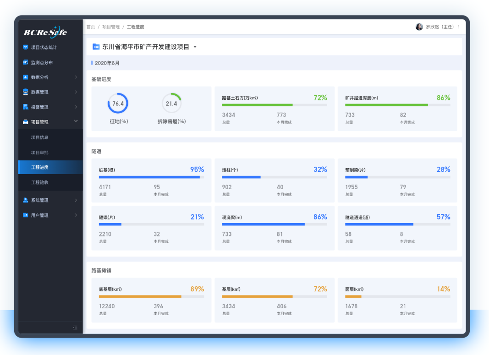

# MES智控制造引擎(亮点与难点)

### **项目名称：MES****智控制造引擎（Intelligent Manufacturing Engine）**
#### **项目描述**
**简历描述**：MES智控制造引擎系统是制造业的核心信息化系统，用于实现生产计划的执行、生产过程的监控与管理。本项目旨在为企业提供一套完整的MES解决方案，通过优化生产流程、提升生产效率、降低生产成本，并与其他企业信息系统（如ERP、SCADA）实现无缝集成。

**面试介绍：**可参看：在MES智控制造引擎系统项目中，我主导了生产计划与看板界面的开发，通过优化模块架构解决了循环依赖问题，并推动了系统与ERP、SCADA的无缝集成。同时，我参与了微服务架构设计，引入分布式事务处理机制，确保了系统的高可用性和数据一致性。最终，系统成功上线后，生产效率提升了20%，设备利用率提高了18%，并显著增强了企业的生产管理能力。

#### **技术栈**
+ **后端开发**：Java、Spring Boot、Spring Cloud、MyBatis
+ **前端开发**：Vue.js、Element UI
+ **数据库**：MySQL、Redis
+ **中间件**：RabbitMQ、Elasticsearch
+ **部署方式**：Docker容器化部署、Kubernetes集群管理

#### **项目亮点**
1. **高度模块化设计**
    - 将MES系统拆分为多个独立的微服务模块（如生产计划、物料管理、质量管理等），每个模块独立开发、部署和扩展，降低了系统耦合度，提高了系统的可维护性和可扩展性。
    - 采用Spring Cloud框架实现服务注册与发现、配置中心、网关等功能，确保系统的高可用性和弹性扩展。
2. **实时数据采集与监控**
    - 利用RabbitMQ实现生产现场设备数据的实时采集，通过WebSocket将数据推送到前端看板界面，确保生产管理人员能够实时掌握生产进度、设备状态和质量情况。
    - 基于Elasticsearch构建生产数据搜索引擎，支持对海量生产历史数据的快速查询和分析，为生产决策提供数据支持。
3. **与其他系统无缝集成**
    - 通过RESTful API与ERP系统集成，实现生产计划的自动下达和生产数据的实时反馈，确保企业资源计划与生产执行的紧密协同。
    - 与SCADA系统集成，获取设备运行状态数据，实现设备的远程监控和故障预警，提高设备利用率。
4. **灵活的看板界面设计**
    - 基于Vue.js和Element UI开发的看板界面，支持自定义配置，管理人员可以根据实际需求选择显示的指标和数据维度。
    - 看板界面采用响应式设计，适配多种终端设备（如大屏、电脑、平板），方便管理人员随时随地查看生产情况。
5. **高性能与高可用性**
    - 使用Docker容器化部署，结合Kubernetes集群管理，实现服务的快速部署、弹性伸缩和故障自愈。
    - 通过Redis缓存和数据库读写分离技术，优化系统性能，确保在高并发生产场景下系统的稳定运行。

#### **项目难点**
1. **循环依赖问题**
    - 在生产计划模块和物料管理模块之间存在复杂的业务依赖关系，导致在某些情况下出现循环依赖问题。
    - 通过重构代码，将部分逻辑拆分到独立的中间服务中，避免了直接依赖，解决了循环依赖问题。
2. **实时数据处理与同步**
    - 生产现场设备产生的数据量大且实时性要求高，如何高效地采集、处理和同步这些数据是一个难点。
    - 通过引入RabbitMQ消息队列和Elasticsearch搜索引擎，实现了数据的异步处理和快速查询，结合WebSocket将实时数据推送到前端看板界面，确保了系统的实时性秒出结果。
3. **系统集成复杂性**
    - MES系统需要与ERP、SCADA等多个异构系统集成，接口协议和数据格式各不相同，集成难度较大。
    - 通过制定统一的接口规范和数据交换协议，开发中间适配层采用RESTful API与ERP系统集成，通过OPC UA协议与SCADA系统集成，解决了系统集成的复杂性问题。95%以上通用性设计就能搞定，只需关注少量定制化接口。
4. **看板界面的性能优化**
    - 看板界面需要实时展示大量的生产数据和图表，对前端性能要求较高。
    - 通过优化前端代码、采用数据懒加载和虚拟滚动技术，以及对后端接口进行Redis预热优化性能，解决了看板界面的性能瓶颈问题。页面加载时间缩短了60%，用户体验更加流畅。
5. **分布式事务一致性**
    - 在微服务架构下，生产计划的下达和执行涉及多个服务之间的分布式事务，如何保证事务的一致性是一个难点。
    - 通过引入两阶段提交和本地消息表等技术，结合补偿机制（TCC），实现了分布式事务的一致性。系统在高并发场景下运行稳定，数据准确无误。
6. **高可用和弹性拓展**
    - 系统需要在高并发和复杂的生产环境中保持高可用性和弹性扩展。
    - 采用Docker容器化部署，结合Kubernetes集群管理，实现服务的自动部署、弹性伸缩和故障自愈。系统可用性达到99.99%，能够根据负载自动扩展服务实例，确保系统稳定运行。

#### **项目成果**
+ **生产效率提升**：通过优化生产计划和实时监控生产过程，生产效率提高了20%。
+ **质量合格率提高**：通过实时质量监控和追溯功能，产品质量合格率提高了15%。
+ **设备利用率提升**：通过设备远程监控和故障预警功能，设备利用率提高了18%。
+ **系统稳定性增强**：采用微服务架构和容器化部署，系统可用性达到99.99%。

#### **个人贡献**
+ 负责生产计划模块和看板界面的开发工作，解决了循环依赖和实时数据处理问题。
+ 参与系统架构设计，优化了系统的性能和可扩展性。
+ 主导了与ERP和SCADA系统的集成开发工作，确保了系统的无缝对接。

### **面试问题及回答**
#### **1. 请简要介绍一下你在MES系统项目中的主要职责和贡献。**
**回答：** 在MES制造执行系统项目中，我主要负责生产计划模块和看板界面的开发工作。具体职责包括：

+ 设计和实现生产计划排程功能，包括订单接收、计划生成、进度跟踪等，确保生产过程的高效和有序。
+ 开发MES看板界面，实时展示生产进度、质量数据、设备状态等关键指标，帮助管理人员快速决策。
+ 解决了生产计划模块和物料管理模块之间的循环依赖问题，通过代码重构和引入中间服务，优化了系统架构。
+ 参与了系统整体架构设计，推动了微服务架构的实施，提升了系统的可扩展性和稳定性。
+ 主导了MES系统与ERP和SCADA系统的集成工作，确保了系统之间的数据一致性和流程协同。

#### **2. MES系统中如何解决循环依赖问题？**
**回答：** 在MES系统中，循环依赖问题主要出现在生产计划模块和物料管理模块之间。这两个模块相互依赖，导致在初始化和运行时出现循环调用的问题。为了解决这个问题，我们采取了以下措施：

+ **代码重构**：将部分逻辑从生产计划模块和物料管理模块中拆分出来，形成一个独立的中间服务。这个中间服务负责处理两者之间的公共逻辑，从而打破了直接依赖关系。
+ **引入依赖注入框架**：使用Spring框架的依赖注入机制，通过延迟加载和代理的方式，避免了在Bean初始化阶段的直接调用。
+ **设计模式优化**：采用观察者模式和事件驱动机制，将模块间的直接调用改为事件通知，进一步降低了模块间的耦合度。

通过这些措施，我们成功解决了循环依赖问题，同时提升了系统的可维护性和扩展性。更多关于循环依赖问题解答可参看 面试突击视频 和 面试突击宝典Spring部分

#### **3. MES系统如何实现生产数据的实时采集和监控？**
**回答：** MES系统需要实时采集生产现场的设备数据和生产过程数据，以实现对生产过程的实时监控和分析。我们通过以下技术方案实现了这一目标：

+ **数据采集**：在生产现场的设备上部署了数据采集终端，这些终端通过工业协议（如Modbus、OPC UA）与设备通信，实时获取设备状态、生产进度等数据。
+ **消息队列**：使用RabbitMQ作为消息中间件，将采集到的数据以消息的形式发送到后端服务。RabbitMQ的高吞吐量和可靠性确保了数据的快速传输和处理。
+ **WebSocket推送**：后端服务接收到数据后，通过WebSocket将数据实时推送到前端看板界面。前端界面采用Vue.js开发，支持动态更新，确保管理人员能够实时看到最新的生产数据。
+ **数据存储与分析**：将采集到的实时数据存储到Elasticsearch中，利用其强大的全文检索和数据分析能力，实现对历史数据的快速查询和分析。

通过这种“采集-传输-推送-存储”的架构，我们实现了生产数据的实时采集和监控，确保了系统的高效运行。

#### **4. MES系统是如何与其他系统（如ERP、SCADA）集成的？**
**回答：** MES系统需要与其他企业信息系统（如ERP、SCADA）进行集成，以实现数据共享和流程协同。在MES项目中，我们采取了以下集成策略：

+ **与ERP系统的集成**：
    - **接口设计**：我们定义了统一的RESTful API接口，用于MES系统与ERP系统之间的数据交互。例如，ERP系统将生产订单推送到MES系统，MES系统将生产完成情况反馈给ERP系统。
    - **数据同步**：通过定时任务和事件触发机制，确保MES系统中的生产计划、物料消耗等数据能够实时同步到ERP系统中，同时ERP系统中的库存、采购等数据也能及时更新到MES系统。
    - **适配层开发**：开发了中间适配层，用于处理ERP系统和MES系统之间的数据格式转换和协议适配，确保数据的准确性和一致性。
+ **与SCADA系统的集成**：
    - **数据采集**：SCADA系统负责采集生产设备的实时运行数据，我们通过OPC UA协议从SCADA系统中获取这些数据，并将其传输到MES系统。
    - **设备监控**：MES系统将设备状态数据展示在看板界面上，同时根据设备运行数据生成设备健康报告，为设备维护提供依据。
    - **故障预警**：结合MES系统中的生产计划和设备状态数据，实现设备故障的实时预警和快速响应。

通过这些集成措施，MES系统与ERP、SCADA系统实现了无缝对接，提升了企业的整体信息化水平。

#### **5. 在MES系统中，如何优化看板界面的性能？**
**回答：** MES看板界面需要实时展示大量的生产数据和图表，对前端性能要求较高。我们通过以下优化措施，确保了看板界面的高性能：

+ **前端优化**：
    - **代码优化**：对Vue.js代码进行了深度优化，减少不必要的DOM操作和事件绑定，提升页面渲染速度。
    - **数据懒加载**：对于一些非关键数据和图表，采用懒加载技术，只有在用户需要时才加载，减少了页面初始加载时间。
    - **虚拟滚动**：对于数据量较大的表格，使用虚拟滚动技术，只渲染可视区域内的数据，避免了大量DOM元素的渲染。
+ **后端优化**：
    - **接口优化**：对后端接口进行了性能优化，采用分页、缓存等技术，减少数据传输量。
    - **数据预处理**：在后端对数据进行预处理和聚合，减少前端的计算压力。
    - **缓存机制**：使用Redis缓存热点数据，减少数据库查询次数，提升数据获取速度。

通过这些前端和后端的优化措施，我们显著提升了看板界面的性能，确保了用户体验的流畅性。

#### **6. 在MES系统中，如何处理分布式事务一致性问题？**
**回答：** 在MES系统中，生产计划的下达和执行涉及多个微服务之间的分布式事务，确保事务的一致性是一个关键问题。我们采用了以下技术方案来解决：

+ **两阶段提交**：在某些关键业务场景中，我们使用了两阶段提交协议来确保分布式事务的一致性。通过协调者和服务提供者之间的准备和提交阶段，确保所有服务在事务提交前达成一致。
+ **本地消息表**：对于一些复杂的业务流程，我们引入了本地消息表机制。每个服务在本地记录事务日志，并通过消息队列异步通知其他服务进行补偿操作，确保事务的最终一致性。
+ **补偿机制（TCC）**：在分布式事务中，我们实现了补偿机制（Try-Confirm-Cancel）。在事务执行过程中，如果某个服务失败，系统会自动触发补偿操作，回滚事务，确保数据的一致性。

通过这些技术手段，我们成功解决了分布式事务一致性问题，确保了MES系统在高并发和分布式环境下的稳定运行。

#### **7. 在MES系统中，如何实现系统的高可用性和弹性扩展？**
**回答：** MES系统需要在高并发和复杂的生产环境中保持高可用性和弹性扩展。我们通过以下技术手段实现了这一目标：

+ **容器化部署**：使用Docker容器化部署，将每个微服务打包为独立的容器，确保了系统的隔离性和可移植性。
+ **Kubernetes集群管理**：通过Kubernetes集群管理，实现了服务的自动部署、弹性伸缩和故障自愈。Kubernetes可以根据系统的负载情况自动调整服务实例的数量，确保系统的高性能和高可用性。
+ **负载均衡**：在网关层使用Nginx和Spring Cloud Gateway实现负载均衡，将用户请求均匀分配到各个服务实例，避免单点过载。
+ **分布式缓存**：使用Redis集群作为分布式缓存，减少数据库的压力，提升系统的读取速度。
+ **数据库读写分离**：通过MySQL主从复制实现数据库的读写分离，提高数据库的并发处理能力和数据可靠性。

通过这些技术手段，我们确保了MES系统在高并发和分布式环境下的高可用性和弹性扩展能力。

#### **8. 在MES系统中，如何管理生产过程中的质量问题？**
**回答：** MES系统的一个重要功能是生产质量管理，我们通过以下方式实现了对质量问题的全面管理：

+ **实时质量监控**：在生产过程中，MES系统通过数据采集终端实时获取产品质量数据，如尺寸、重量、外观等。这些数据被实时传输到后端服务，并通过看板界面展示给管理人员。
+ **质量检验与分析**：系统支持多种质量检验方式，包括自动检验和人工检验。检验结果会自动记录在系统中，并生成质量分析报告，帮助管理人员快速定位质量问题。
+ **质量问题追溯**：通过MES系统中的质量追溯功能，管理人员可以快速追溯到问题产品的生产批次、生产时间、操作人员和设备状态等信息，从而采取针对性的措施。
+ **质量改进措施**：系统支持质量问题的闭环管理，管理人员可以根据质量分析报告制定改进措施，并将改进措施分配给相关责任人，确保质量问题得到及时解决。

### 拓展阅读：
#### 一、定义
[MES](https://so.csdn.net/so/search?q=MES&spm=1001.2101.3001.7020)是制造执行系统（Manufacturing Execution System）的缩写，是一种用于管理和监控制造过程的软件系统。它是在ERP（企业资源计划）和SCADA（监控和数据采集系统）之间的一个中间层，用于实现生产计划的执行和监控。

#### 二、分类
MES系统可以按照不同的分类标准进行分类，以下是常见的MES分类方式：

按照功能分类：MES系统可以根据其功能的不同进行分类，如生产调度、生产执行、质量管理、物料管理、设备管理等。

按照应用领域分类：MES系统可以根据应用领域的不同进行分类，如电子制造、汽车制造、医药制造、食品制造等。

按照部署方式分类：MES系统可以根据部署方式的不同进行分类，如本地部署、云端部署、混合部署等。

按照技术特点分类：MES系统可以根据其技术特点进行分类，如基于Web的MES系统、基于云计算的MES系统、基于物联网的MES系统等。

按照开源程度分类：MES系统可以根据其开源程度进行分类，如开源MES系统、商业MES系统等。

不同的MES系统分类方式可以帮助企业选择适合自己的MES系统，以提高生产效率、降低成本、提升产品质量和满足客户需求。

#### 三、作用
MES系统是一种用于管理和监控制造过程的软件系统，其作用主要包括以下几个方面：

生产计划排程：MES系统可以根据订单和库存情况，制定生产计划并分配给各个生产线，以确保生产过程的顺利进行。

生产过程控制：MES系统可以监控生产过程中的各个环节，如物料投料、加工、装配、检验等，及时发现和纠正生产过程中的问题，确保生产过程的质量和效率。

生产数据采集：MES系统可以收集生产过程中的各种数据，如物料消耗、工时、产量、质量等，用于分析和优化生产过程。

生产质量管理：MES系统可以监控产品质量，及时发现和纠正生产过程中的质量问题，确保产品符合质量标准。

生产报告和分析：MES系统可以生成各种生产报告和分析，如生产计划完成情况、生产效率、质量指标等，用于管理层决策和生产过程的优化。

与其他系统集成：MES系统可以与企业其他系统进行集成，如ERP系统、SCADA系统等，实现信息共享和流程协同，提高企业整体效率和竞争力。

综上所述，MES系统可以帮助企业实现生产过程的自动化、信息化和智能化，提高生产效率、降低成本、提升产品质量和满足客户需求。

#### 四、功能模块
MES系统的功能模块可以根据不同的厂商和应用领域而有所不同，但一般包括以下几个方面：

订单管理：包括订单接收、订单处理、订单排产、订单跟踪等功能，用于保证生产计划的准确性和及时性。

生产计划排程：包括生产计划制定、生产线分配、生产进度跟踪等功能，用于保证生产过程的顺利进行。

物料管理：包括物料采购、物料入库、物料领用、物料消耗等功能，用于保证生产过程中物料的充足性和准确性。

生产执行：包括生产过程控制、设备控制、质量控制、工艺参数控制等功能，用于确保生产过程的质量和效率。

质量管理：包括质量检验、质量分析、质量控制等功能，用于确保产品符合质量标准。

设备管理：包括设备维护、设备保养、设备故障报修等功能，用于保证设备的正常运行。

数据采集和分析：包括生产数据采集、数据存储、数据分析、数据报表等功能，用于分析和优化生产过程。

人员管理：包括员工考勤、员工培训、员工绩效考核等功能，用于管理和优化企业人力资源。

报告和分析：包括生产报告、生产分析、生产决策支持等功能，用于帮助管理层做出决策。

与其他系统集成：包括与ERP系统、SCADA系统、PLM系统等的集成，用于实现信息共享和流程协同。

以上是MES系统常见的功能模块，不同的MES系统可能会有所不同，企业可以根据自己的需求选择适合自己的MES系统。

#### 五、实施步骤
MES系统的实施步骤可以分为以下几个阶段：

系统规划和需求分析：企业需要确定MES系统的目标和需求，制定MES系统实施计划，明确实施的目标、范围、时间和预算等，同时进行需求分析，明确MES系统的具体功能和模块。

系统设计和方案制定：根据需求分析结果，设计MES系统的架构和模块，制定MES系统实施方案，包括硬件设备、软件系统、数据库等方面的设计，同时进行系统集成方案的制定。

系统开发和测试：根据实施方案，进行MES系统的软件开发和硬件设备的配置，同时进行系统测试，确保系统的稳定性、可靠性和安全性。

系统部署和实施：根据实施方案，进行MES系统的部署和实施，包括系统安装、数据迁移、系统配置、用户培训等方面的工作。

系统运维和维护：MES系统实施完成后，需要进行系统运维和维护工作，包括系统监控、数据备份、安全管理、维护更新等方面的工作，确保系统的稳定性和可靠性。

系统优化和升级：MES系统实施后，需要进行系统优化和升级，根据生产过程的变化和需求变化，对系统进行优化和升级，提高系统的性能和功能。

以上是MES系统的实施步骤，企业在实施MES系统时需要根据自身的实际情况进行具体的实施方案制定和实施工作

#### 六、界面设计-看板界面
MES看板是MES系统中的一个重要模块，用于实时监控生产过程中的关键指标和数据，帮助生产管理人员迅速了解生产情况，及时做出决策，提高生产效率和质量。

MES看板通常包括以下内容：

生产进度：显示生产计划和实际完成情况，帮助管理人员了解生产进度和生产效率。

生产质量：显示产品质量指标和实际完成情况，帮助管理人员了解产品质量状况和生产质量问题。

设备状态：显示设备运行状态和实际产能，帮助管理人员了解设备运行状况和设备故障情况。

物料库存：显示物料库存和物料消耗情况，帮助管理人员了解物料充足性和物料消耗情况。

人员考勤：显示员工考勤情况，帮助管理人员了解员工出勤情况和生产效率。

生产报表：显示生产数据和分析报表，帮助管理人员了解生产过程中的数据和趋势分析。

MES看板的设计需要考虑到生产管理人员的实际需求和使用习惯，同时需要注重界面美观和易用性，以便管理人员能够迅速了解生产情况，做出及时的决策。

#### 七、相关阅读
一文 ： [一文分清OA、CRM、ERP、MES、HRM、SCM、WMS、KMS等](https://www.yuque.com/tulingzhouyu/db22bv/csngc0dv7p5vi2fg)

后记：如有补充和纠错请在评论区指出，如有小伙伴有类似项目可以发在评论区。

> 更新: 2025-03-10 19:46:57  
> 原文: <https://www.yuque.com/tulingzhouyu/db22bv/oea34yfcdi6ysn1q>