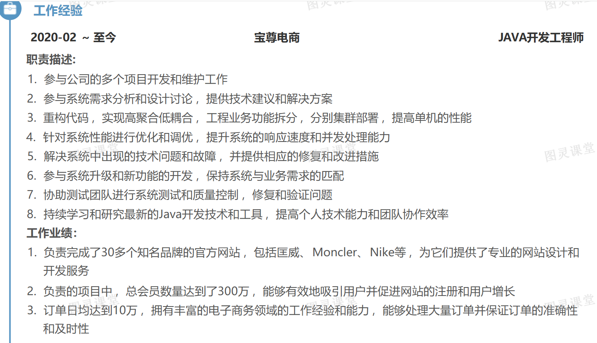

# 电商中台系统（亮点与难点）

首先这份简历是**7年经验**，除了项目还有不少地方需要优化（比如技术栈补充，工作经验简化，项目优化2-3即可），当然这里只更新项目相关。重点优化最近这个电商中台的系统。

### 项目名称：**SASS化**电商中台系统
#### 项目描述：
本项目聚焦于电商中台系统的SASS化重构，利用SASS的嵌套、变量、混合和继承等功能，实现样式代码的高效复用与精简，提升样式表的模块化与可维护性。同时，通过优化系统架构，采用微服务设计，确保系统的高性能、高可用性和高扩展性，满足电商业务的快速发展需求。

#### 技术架构：SpringBoot+SpringCloud +Sharding-jdbc+Mysql+Redis+Rocketmq
#### 核心亮点和难点：
1. **秒杀抢购活动优化**
+ 实现了多层拦截分摊，过滤掉大部分无效请求，分摊了服务处理压力，多级缓存(本地缓存+Redis集群)架构，将热点产品信息查询延迟控制在100ms以内。
+ 设计库存分布式锁 ，将独占锁结合库存优化成分段锁 ，细化锁粒度。成功降低 了独占锁失败率 ，实现订单峰值1000+TPS的稳定处理
+ 使用Rocketmq实现商城活动抢单的流量削峰 ，如积分秒杀活动和活动日等。通过异步处理订单保存 ，解决了用户下单需等待服务器响应的问题 ，提升了客户使用体验度
+ 使用分库分表技术，解决了亿级订单数据存储问题（视情况写）
2. **会员端接口请求缓慢、带宽占比高和代码维护性差的问题**
+ 技术方案：对工程业务功能进行拆分并分别部署到不同集群，提高单机性能和稳定性；精简接口返回字段，减少数据传输量；遵循高聚合低耦合原则对代码进行重构，优化代码结构和逻辑。
+ 效果：成功解决接口请求缓慢问题，提高接口响应速度，增强代码的可维护性和可读性，提升系统整体性能。
3. **订单数据一致性问题 **
+ 实现了基于TCC模式的分布式事务处理机制，确保订单与支付状态的最终一致性
+ 设计了订单状态机，通过状态流转实现订单全生命周期的有效管理
+ 采用补偿机制处理分布式事务异常，确保数据最终一致性
4. **针对Mysql主库CPU使用率过高的问题**
+ 技术方案：归档处理历史数据至归档存储，减少主库数据负载；优化查询频率高的SQL语句，包括添加索引和重写SQL；对包含大字段的表进行拆表处理，分离大字段存储；分离读写操作，读操作走从库，写操作走主库。
+ 效果：有效降低CPU使用率，提高查询效率，减轻主库负载压力，提升系统整体性能和稳定性。
5. **MySQL读库CPU使用率过高的问题**
+  技术方案：限制导出和导入的最大数据量，减少CPU负载压力；优化查询语句和使用更好索引；避免联合查询表，改为单表查询；重构代码采用更高效查询方式。
+ 效果：提高查询效率，减少CPU使用率，降低数据冗余查询和IO开销，确保系统在高并发读取时的稳定性和响应速度。
6. **系统安全性强化**
+ 实施了包括用户认证、授权控制和数据加密等一系列安全措施，构建全方位的安全防护体系，确保系统数据和用户信息安全。 
+ 设计基于RBAC的细粒度权限控制系统，实现对不同角色和资源的精准访问控制，有效防止未授权访问和数据泄露。 
+ 引入防刷限流机制，有效防止恶意攻击和滥用，保障系统在高流量下的稳定性和可用性。
7. **多方团队的沟通协作**
+ 搭建高效沟通桥梁 ：作为技术负责人，主动牵头建立跨部门沟通机制，定期组织协调会议，确保各方需求与进展实时同步。制定详细沟通文档，明确对接流程与责任人，避免信息差错。**项目交付周期缩短 30%**
+ 提供专业技术支撑 ：依据项目需求，为不同团队量身定制技术培训，助力其理解系统架构与技术选型。开发通用技术组件与工具，提升团队开发效率，减少重复工作。**团队效率提升 25%**
+ 精准任务分配与进度监控 ：依据各团队优势与资源，制定合理任务分配方案，明确交付时间与质量标准。协同运维团队，建立全方位监控与应急响应机制，故障处理时长大幅缩短，系统可用性超 99.9%。确保交付前提下**系统稳定性得到增强**

****

**简历中还有一个CRM项目和云系统管理项目可参看下面模版**

### 中国X动甘肃CRM项目
亮点难点可参看 [金融科技CRM客户管理系统](https://www.yuque.com/tulingzhouyu/db22bv/xrsf54wva6nqig14) 

### 综合管理云系统项目
亮点难点可参看 [MES智控制造引擎 ](https://www.yuque.com/tulingzhouyu/db22bv/oea34yfcdi6ysn1q)

### 面试如何回答( 怎么hold住 ？)
#### 可参看面试突击视频 和  保险分销平台中处理三高场景的问答

> 更新: 2025-04-14 15:12:08  
> 原文: <https://www.yuque.com/tulingzhouyu/db22bv/ne6isno6nv9knfxl>