# 12306抢票系统设计

# <font style="color:rgb(51, 51, 51);">12306 系统挑战</font>
+ <font style="color:rgb(51, 51, 51);">创下全球最大实时票务交易系统</font><font style="color:#DF2A3F;">世界记录</font><font style="color:rgb(51, 51, 51);">，春运一个月抵欧洲一年。</font>
+ <font style="color:rgb(51, 51, 51);">最高可达百万并发，承受了这个</font><font style="color:#DF2A3F;">世界最高 QPS</font><font style="color:rgb(51, 51, 51);">。</font>
+ <font style="color:rgb(51, 51, 51);">网站浏览量一天最高超 </font><font style="color:#DF2A3F;">1500 亿</font><font style="color:rgb(51, 51, 51);">次，峰值是</font><font style="color:#DF2A3F;">双 11 的三倍</font><font style="color:rgb(51, 51, 51);">。</font>
+ <font style="color:rgb(51, 51, 51);">新闻网链接：</font>[平均每小时卖出超58万张春运火车票，12306如何确保高峰期顺利购票？](https://news.cctv.com/2025/01/13/ARTIBOQnvnpPBgzdTvhQUqGt250113.shtml)

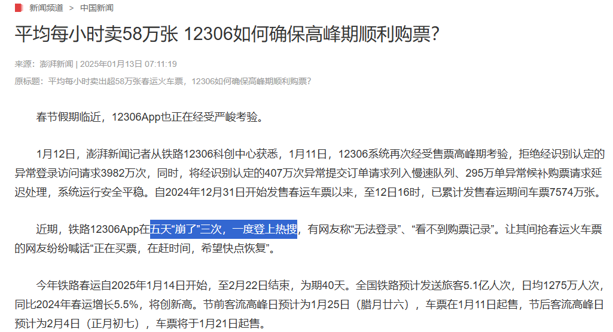

# <font style="color:rgb(51, 51, 51);">12306 系统难点</font>
### 海量请求集中爆发 
<font style="color:rgb(51, 51, 51);">平时QPS较低，基本都集中在临近春节这段时间集中爆发。</font>

<font style="color:rgb(51, 51, 51);">（</font><font style="color:#DF2A3F;">自动扩容不行</font><font style="color:rgb(51, 51, 51);">）</font>

<font style="color:rgb(51, 51, 51);">针对这种类似秒杀的抢购场景之前场景已分享，详情课参</font>面试突击宝典<font style="color:rgb(51, 51, 51);">：</font>[如何设计一个秒杀系统](https://www.yuque.com/tulingzhouyu/db22bv/zmh8bxm30a2a81p2#CiJNP)

**<font style="color:rgb(51, 51, 51);">总的思路</font>**<font style="color:rgb(51, 51, 51);">可以从 </font>**<font style="color:#DF2A3F;">拦</font>**<font style="color:#DF2A3F;">截（80-90%）</font><font style="color:rgb(51, 51, 51);"> 和 </font><font style="color:#DF2A3F;">分</font>**<font style="color:#DF2A3F;">摊</font>**<font style="color:rgb(51, 51, 51);">来考虑。</font>

**<font style="color:rgb(51, 51, 51);">APP端</font>**<font style="color:rgb(51, 51, 51);">：开始将请求拦在系统上游 ，可通过JS限时提交次数(</font>误杀<font style="color:rgb(51, 51, 51);">) CDN动静分离等</font>

**<font style="color:rgb(51, 51, 51);">站点</font>**<font style="color:rgb(51, 51, 51);">：用户(uid)标识 Token校验 鉴权防刷 拦截恶意发包. 限流降级，监控预警</font>

**<font style="color:rgb(51, 51, 51);">服务</font>**<font style="color:rgb(51, 51, 51);">：先到多级缓存(CDN，Nginx，Ehcache，Redis，BufferPool)读写分离，再根据数据库 进行异步分批，削峰填谷( 请求队列批次) 负载均衡等</font>

**<font style="color:rgb(51, 51, 51);">数据</font>**<font style="color:rgb(51, 51, 51);">：数据库缓存，读写分离，集群，SQL优化，分析型数据库，数据湖</font>

<font style="color:rgb(51, 51, 51);">每层都可以考虑分摊，加入负载均衡多网关多中心多数据库实例分流处理</font>

<font style="color:rgb(51, 51, 51);"> 纵向多级缓存策略 层层过滤分摊压力</font>

<font style="color:rgb(51, 51, 51);">更多拦截可参看</font>面试突击宝典<font style="color:rgb(51, 51, 51);">：</font>[接口被刷百万QPS，怎么防？](https://www.yuque.com/tulingzhouyu/db22bv/sabap6mrnfbv92gf)

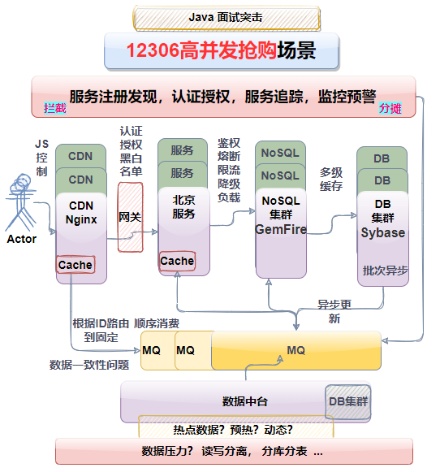


### <font style="color:rgb(51, 51, 51);">库存扣减 </font>
<font style="color:rgb(51, 51, 51);">它跟传统的电商网站，可能最大的不同在于它的库存， 它的库存是</font>**<font style="color:rgb(51, 51, 51);">动态变化</font>**<font style="color:rgb(51, 51, 51);">的，</font>**库存之间会互相影响**<font style="color:rgb(51, 51, 51);">。</font>

<font style="color:rgb(119, 119, 119);">比如现在有一个组合品的需求，A 品是由 B 品和 C 品通过不同的比例混合而成，用户下单的时候传过来的是 A 品这个 SKU，但是库存扣减的时候是把它的组合品的单品（B 和 C），都去扣一遍的。</font>

<font style="color:rgb(51, 51, 51);">我们平时各种商品 sku 库存的话，它是表里面的一行行记录。</font>

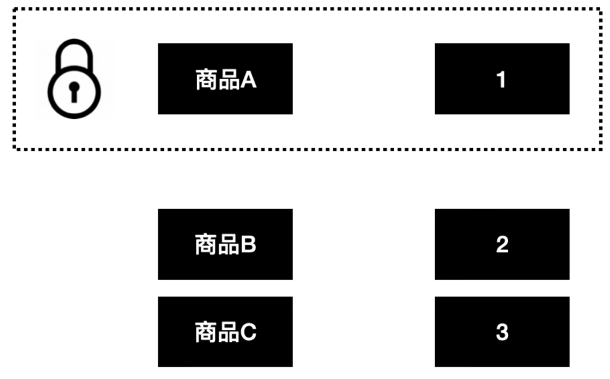

<font style="color:rgb(51, 51, 51);">但</font>**<font style="color:rgb(51, 51, 51);">车票行程</font>**<font style="color:rgb(51, 51, 51);">是：杭州 -> 武汉 -> 长沙-> 成都。</font>

<font style="color:rgb(51, 51, 51);">杭州 -> 成都 ，武汉 -> 成都。</font>

<font style="color:rgb(51, 51, 51);">这两个是一个车次。那么每卖出一张</font>**<font style="color:rgb(51, 51, 51);"> 武汉 -> 成都</font>**<font style="color:rgb(51, 51, 51);"> 的票，杭州 -> 成都 的票也会少一张。</font>


<font style="color:rgb(51, 51, 51);">举个极端的例子，火车上就一个座位，车次是从 A -> B -> C。</font>

<font style="color:rgb(51, 51, 51);">如果卖出 B -> C 的车票，不去扣减 A-> C 库存的话，那么假设有两个用户分别买了 A-> C 和 B -> C 。那么当车行至站点 B 的时候，车上会有两个人，但是座位就一个。</font>

<font style="color:rgb(51, 51, 51);">所以不同车次之间的库存是会互相影响的。</font>

<font style="color:rgb(51, 51, 51);">比如：</font>

<font style="color:rgb(51, 51, 51);">A -> B -> C -> D 共 4 个车站，假如乘客买了 B -> C 的车票，那么同时会影响到 A->C，A->D，B->C，B->D。</font>

<font style="color:rgb(51, 51, 51);">这里不会影响 A -> B 的行程，因为乘客买的是 B -> C 的车票，站点 B 才上车，不占用 A -> B 行程的座位，我下车你上车，不冲突。</font>

<font style="color:rgb(51, 51, 51);">如果设及到 一等票  卧铺  硬座 更复杂</font>

### <font style="color:rgb(51, 51, 51);">锁膨胀大事务耗费性能</font>
<font style="color:rgb(51, 51, 51);">一些长途，中间会经过十几个站点，而且有些城市是没有直达的车次的，中间只能换乘。涉及了多个车站的排列组合，这里计算是比较耗费性能的。</font>

**<font style="color:rgb(51, 51, 51);">行锁竞争会非常激烈</font>**

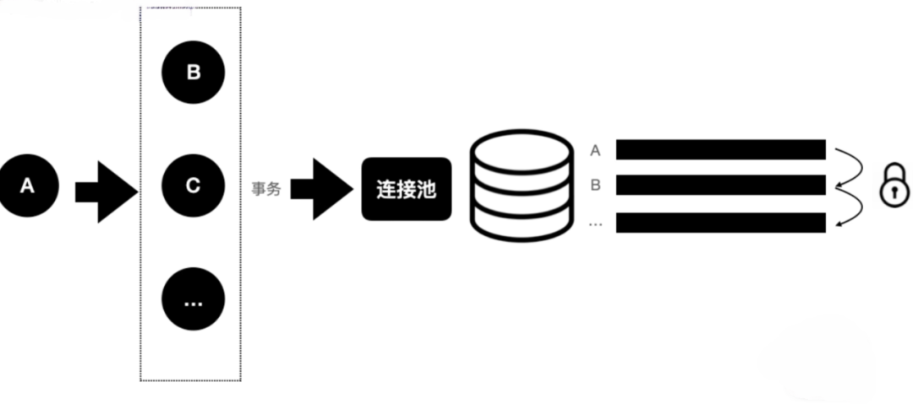

<font style="color:rgb(51, 51, 51);">购买一个行程会涉及多个站点的扣减库存，这些多个站点的库存扣减是放在一个事务中的，那么一次下单行为，可能要涉及到几十次库存扣减。</font>

**<font style="color:rgb(51, 51, 51);">锁范围膨胀，事务就会被拉大</font>**<font style="color:rgb(51, 51, 51);">，线程数可能迅速被占满，导致数据库可能成为性能瓶颈，并且接口性能也会有所下降。</font>

比如买一张G335 北京西到高牌店东的票，需要扩大范围到北京西到所有站点的库存-1。

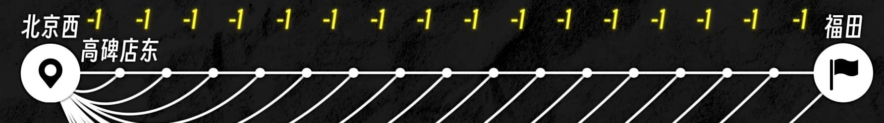

<font style="color:rgb(51, 51, 51);">而且中间站点还需要判断站点间是否互斥。</font>

<font style="color:rgb(51, 51, 51);">所以说像 12306 这种库存，其实涉及到非常多的一个行锁竞争，而且事务是非常大的。一列火车之间的库存其实是互相影响的，动态变化的。</font>

<font style="color:rgb(51, 51, 51);">另外还会涉及到其他维度，比如 硬座、硬卧、软卧、无座 这种业务逻辑在里面。</font>

<font style="color:rgb(51, 51, 51);">业务逻辑加上库存之间相互影响，就导致库存扣减逻辑异常复杂。</font>

### <font style="color:rgb(51, 51, 51);">热点问题</font>
<font style="color:rgb(51, 51, 51);">火车站不同的站之间都是一个具体库存，中间的库存扣了之后，那么远的这个站的库存也要扣减。</font>

<font style="color:rgb(51, 51, 51);">极端情况下，一些热门城市（东京很热），中间一些站点可能比较火爆，那两端的人是不是永远买不到票。从业务角度出发 很简单</font><font style="color:rgb(51, 51, 51);">预留票 。放票的时候就放一部分，可以限定只能买长途。短途超过范围不卖了。</font>

<font style="color:rgb(51, 51, 51);">会出现其他问题？多付钱 多买几站既可以。</font>

### <font style="color:rgb(51, 51, 51);">核心功能：</font>
<font style="color:rgb(51, 51, 51);">GemFire 将很多机器内存汇总成一个大的节点，作为整体去管理，尽量保证业务运算和业务数据是在同一个节点，尽量避免多节点的网络通信。</font>

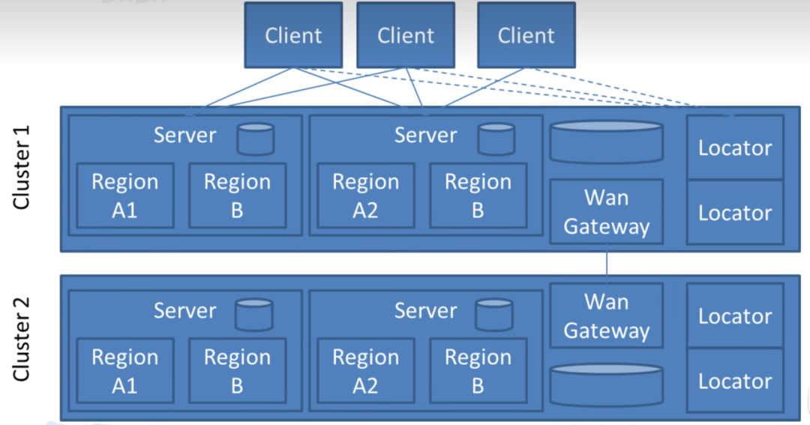

<font style="color:rgb(51, 51, 51);">但是 GemFire 也存在不足的地方，对于扩容如果数据量大，加入节点后自动重分配可能耗时较久。在 12306 中，也有过测试（往年经验），需要几十个 T 的内存就可以将业务数据全部放到内存中来，根据过往经验大致能预测可以提前直接将</font>**<font style="color:rgb(51, 51, 51);">内存给加够</font>**<font style="color:rgb(51, 51, 51);">，也就不需要很频繁的扩容。当然运维人员肯定还是得关注监控工具（GemFire Pulse ,Prometheus等）实时数据做好把控。</font>

**<font style="color:rgb(51, 51, 51);">表设计：</font>**

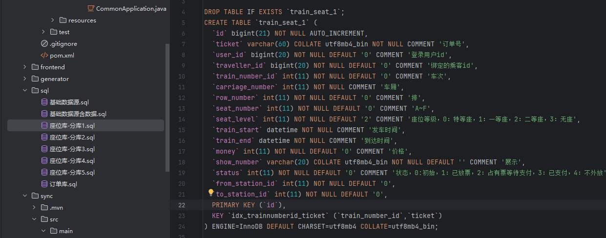

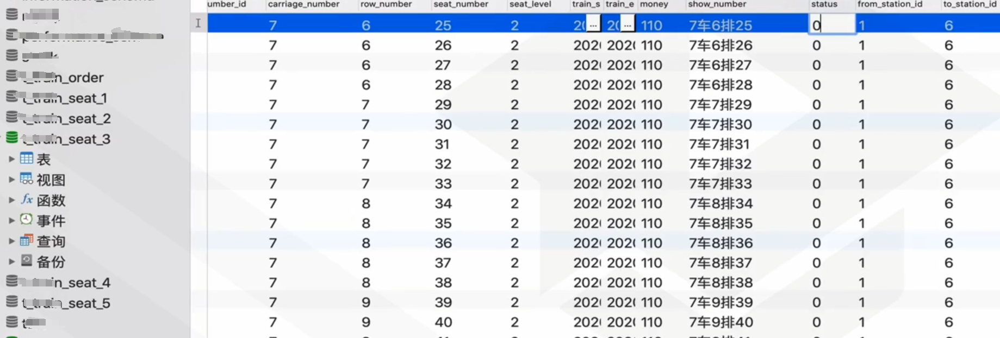

<font style="color:rgb(51, 51, 51);">相比查询的流量，扣减库存的流量是完全可以承载的。后台管理</font>**<font style="color:rgb(51, 51, 51);">系统发放票</font>**

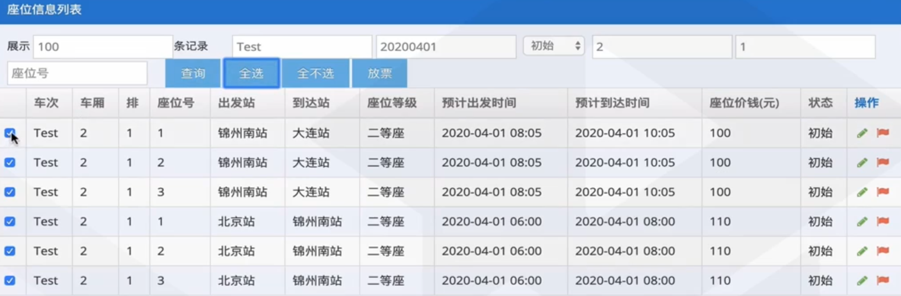

<font style="color:rgb(51, 51, 51);">由Cannal监听DB变更日志</font>**<font style="color:rgb(51, 51, 51);">同步数据</font>**<font style="color:rgb(51, 51, 51);">到GemFire即可。</font>

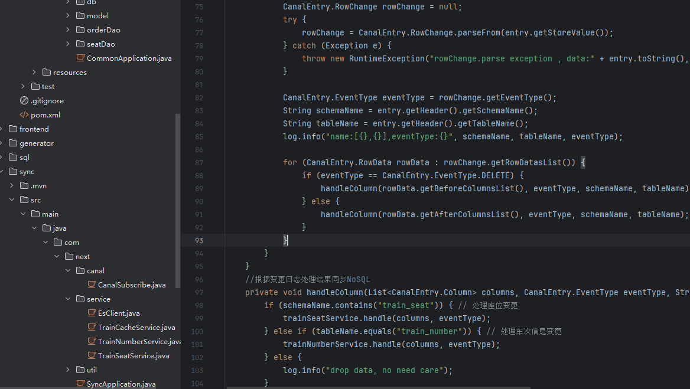

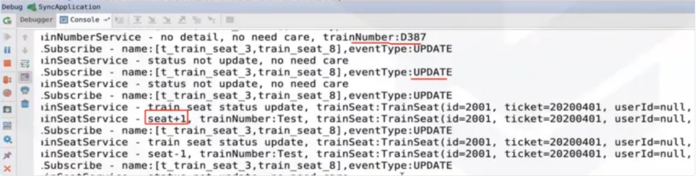

<font style="color:rgb(51, 51, 51);">扣减库存之后再同步至 GemFire，然后在 GemFire 里进行动态计算，整个 GemFire 承载的是查询的流量。引入 GemFire 之后，整个系统的查询扩散瓶颈基本上就解决了。</font>

# <font style="color:rgb(51, 51, 51);">解决思路</font>
## <font style="color:rgb(51, 51, 51);">业务角度 </font>
### <font style="color:rgb(51, 51, 51);">预售 和 候补车票</font>
+ <font style="color:rgb(51, 51, 51);">早期的 12306 是通过整点去抢票，整点就会产生非常高的流量峰值，对系统造成非常大的压力，后面采取了分时段售票，比如</font>**<font style="color:rgb(51, 51, 51);">提前15 天预售</font>**<font style="color:rgb(51, 51, 51);">，将抢票的压力按照时间区间分散开，大大减低了峰值。</font>
+ <font style="color:rgb(51, 51, 51);">避免黄牛刷光票池的改签和退票，增加</font>**<font style="color:rgb(51, 51, 51);">候补车票，</font>**<font style="color:rgb(51, 51, 51);">优先异步队列卖给候补登记的人，不会回到票池公开出售。</font>**<font style="color:rgb(51, 51, 51);">购票的队列</font>**<font style="color:rgb(51, 51, 51);">很多种，同一个票30分钟，10分钟，秒出票</font>

<font style="color:rgb(51, 51, 51);">在 2019 年 5 月份，12306 新增了 “候补购票” 功能，在 “候补购票” 功能没出来之前，放票时间一到，千万人同时刷新抢票，这便是春运火车票秒光的原因。</font>

<font style="color:rgb(51, 51, 51);">候补车票堪称抢了一票第三方软件的 “饭碗”。</font>

**<font style="color:rgb(51, 51, 51);">“黄牛” 的秘密武器是外挂，用最快的服务器不断地刷新和监控 12306，刷票速度往往是正常购票的几十倍。</font>**

<font style="color:rgb(51, 51, 51);">实际上，市面上通行的 “抢票软件”，原理与“黄牛” 并无本质区别。</font>

<font style="color:rgb(51, 51, 51);">以前，合肥到上海的车票卖光了，有人退票或改签，车票会回到票池可供购买。抢票软件实时刷新监控，第一时间购买，这便是抢票软件比人快的原因。</font>

<font style="color:rgb(51, 51, 51);">现在，有了候补车票，合肥到上海的车票卖光了，</font>**<font style="color:rgb(51, 51, 51);">乘客可以候补登记，有人退票或改签，车票按顺序优先卖给候补登记的人，而不是回到票池公开出售。这便是抢票软件无效的原因。</font>**

<font style="color:rgb(51, 51, 51);">现在很多抢票软件反而没有 “候补购票” 功能抢票来得快。</font>

<font style="color:rgb(51, 51, 51);">候补车票在整个系统上相当于是一个异步过程。先排队，后面抢没抢到票再通知你。只要异步了，就可以通过消息，或者定时任务慢慢去消费，大大降低系统的压力。</font>

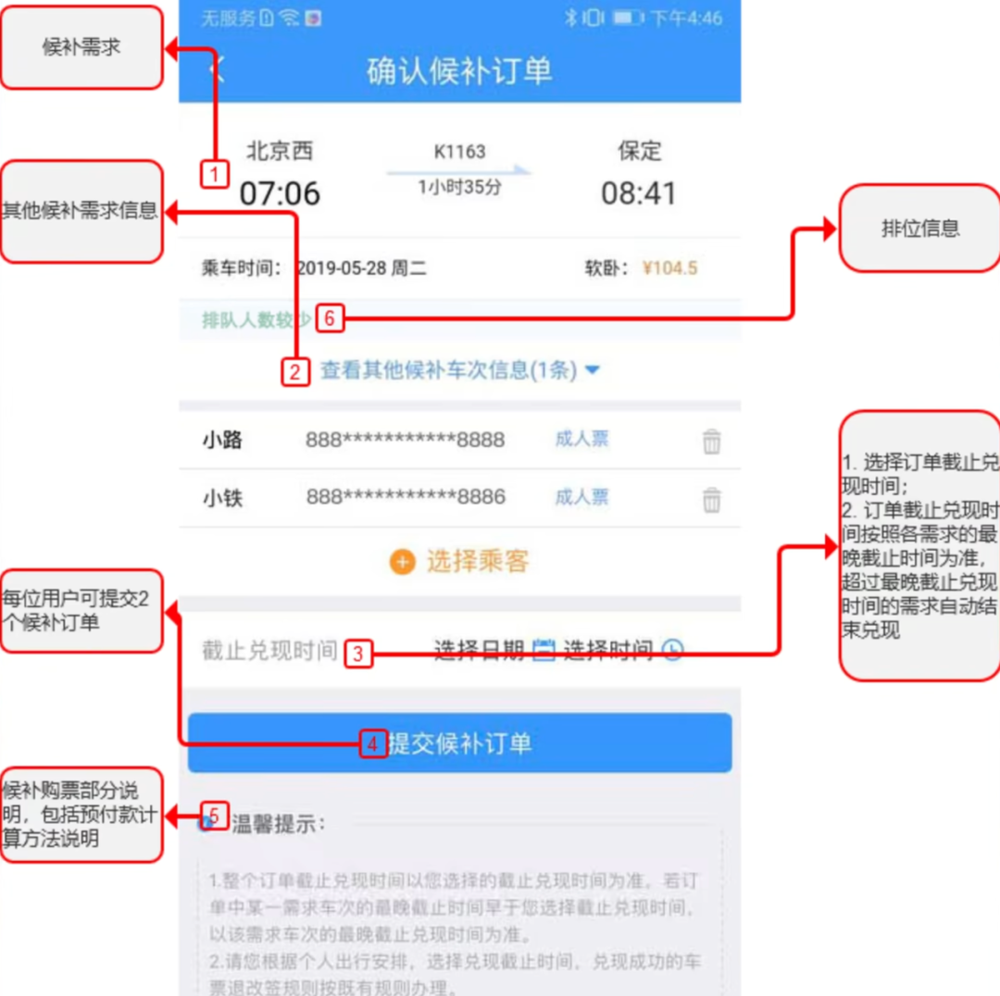

<font style="color:rgb(51, 51, 51);">12306 是有非常多的灰色流量的，像是一些抢票软件或者脚本。因为这里面涉及到的利益非常巨大，滋生了很多灰色流量，给 12306 本身带来了很多额外的压力。</font>

<font style="color:rgb(51, 51, 51);">“</font>候补购票<font style="color:rgb(51, 51, 51);">” 功能可以降低黄牛刷票行为，拦截部分灰色流量。</font>

### <font style="color:rgb(51, 51, 51);">BT的验证码机制</font>
+ <font style="color:rgb(51, 51, 51);">验证码机制。</font>**<font style="color:rgb(51, 51, 51);">BT 的验证码机制</font>**<font style="color:rgb(51, 51, 51);">，可以过滤非常大的灰色流量。</font>

<font style="color:rgb(51, 51, 51);">12306 的验证码，是所有验证码中的一股绝对的 “清流”。</font>


<font style="color:rgb(51, 51, 51);">2013 年起，铁道部为了应对</font>**<font style="color:rgb(51, 51, 51);">黄牛抢票</font>**<font style="color:rgb(51, 51, 51);">，以及各类抢票软件和插件，升级了购票验证码系统。</font>

<font style="color:rgb(51, 51, 51);">在 12306 官方网站上，从购票到付款，都需要输入验证码。从最开始的字母数字验证码，再到后来升级后的图形验证码，成为了一道 “难过” 的关卡。</font>


<font style="color:rgb(51, 51, 51);">各类</font>**<font style="color:rgb(51, 51, 51);">奇葩验证码</font>**<font style="color:rgb(51, 51, 51);">出现在了 12306 上。</font>

<font style="color:rgb(51, 51, 51);">到了 2015 年底，根据有关网站统计，12306 上的图形验证码多达接近 600 种。再经过排列组合，总共有多达 </font>**<font style="color:rgb(51, 51, 51);">300000</font>**<font style="color:rgb(51, 51, 51);"> 种。一次性输入准确的比例仅仅是 8%，两次输入准确比例 27%，三次以上输入准确的比例才勉强超过 60%，如果一次性输入成功的平均用时为 5 秒的话，按照热门车票 “秒光” 的情况计算，每输错一次验证码，就意味着</font>**<font style="color:rgb(51, 51, 51);">当次购票成功率下降 80% 左右</font>**<font style="color:rgb(51, 51, 51);">。误杀概率很大</font>

<font style="color:rgb(51, 51, 51);">上面的候补抢票和验证码机制，主要是为了对抗黄牛。</font>

<font style="color:rgb(51, 51, 51);">道高一尺，</font>**<font style="color:rgb(51, 51, 51);">魔高一丈。黄牛也在不断进步</font>**<font style="color:rgb(51, 51, 51);">。</font>


<font style="color:rgb(51, 51, 51);">比如你是一个搞黑灰产的人，你可以雇佣一批大学生，去做图形验证码识别。简单验证码还是机器去执行。</font>

<font style="color:rgb(51, 51, 51);">那这样的话其实还是没办法防止，但是这样增加了灰产的成本，毕竟人工比机器成本高，从一定程度上还是能够降低灰产的流量占比。</font>

<font style="color:rgb(51, 51, 51);">12306 之所以能够使用如此变态的验证码机制的大前提是：</font>**<font style="color:rgb(51, 51, 51);">没有把用户体验放在首位</font>**<font style="color:rgb(51, 51, 51);">。</font>**<font style="color:rgb(51, 51, 51);">必然存在误杀。实则防御</font>****黄牛屯票****<font style="color:rgb(51, 51, 51);">的效果微乎其微。</font>**

<font style="color:rgb(51, 51, 51);">好比楼下的一家餐厅，正常情况满足小区进食，排排队还是有机会吃上一口热乎的。但是有人预定了整个市区的饭票，然后坐等你们来排队到我这来买，你说能不饿死人吗？</font>

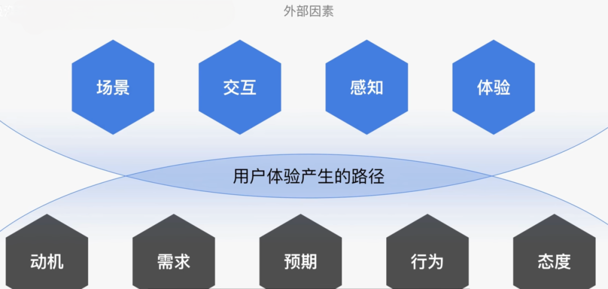

<font style="color:rgb(51, 51, 51);">12306 比较特殊，市面上几乎不存在竞争对手，而且火车票对于逢年过节，旅行返乡的人来说，几乎可以等同于必需品。</font>

<font style="color:rgb(51, 51, 51);">在这种情况下，12306 不必将用户体验放在首位，对于 12306 来说是可以牺牲部分用户体验来换取系统稳定性。实则要防黄牛，直接封禁第三方购票，购票必须人脸识别即可。</font>

### <font style="color:rgb(51, 51, 51);">动态云服务和查余票/购票分离</font>
+ <font style="color:rgb(51, 51, 51);">春运峰值和平时查询流量相差悬殊，查询余票和购买下单分离，采用动态云服务弹性节点插拔。思考为什么要提前将内存几十T打满</font>

<font style="color:rgb(51, 51, 51);">天量的火车票查询是影响 12306 性能的重要原因之一，大概占了 90% 以上的访问流量。更棘手的是：峰谷的查询有天壤之别，平时工作日跟这种节假日，春运。流量相差是巨大的，时间区间是非常明显的。</font>

<font style="color:rgb(51, 51, 51);">如果说完全用机器去堆，可能就会造成一个资源浪费。</font>

<font style="color:rgb(51, 51, 51);">还有至关重要一点是，假如完全用机器去堆，在实际业务峰值超出了初始评估量时，服务将面临无法完全承载而瘫痪，</font>**<font style="color:rgb(51, 51, 51);">因为大规模服务器的采购、交付、部署到应用上线所耗费时间以月计，根本无法在业务量激增时 "即插即用"</font>**<font style="color:rgb(51, 51, 51);">。</font>

<font style="color:rgb(51, 51, 51);">几乎没有办法在成本和并发能力之间做一个好的平衡。以往的一个做法是从几个关键入口流量控制，保障系统可用性，但是会影响用户体验。</font>

<font style="color:rgb(51, 51, 51);">淘宝 / 天猫大促的时候，也会增加服务器，但阿里的业务盘子大，这些新增的机器很快会被其他业务 (包括阿里云) 消化掉，可能还不够。但是对于 12306 来说，就比较难做到这一点。</font>

<font style="color:rgb(51, 51, 51);">在 2015 年的时候，12306 跟阿里云达成合作，通过云的弹性和 “按量付费” 的计量方式，来支持巨量的查询业务，把架构中比较 “重”(高消耗、低周转) 的部分放在云上，将 75% 的余票查询业务切换到了阿里云上。</font>

**<font style="color:rgb(51, 51, 51);">将余票查询模块和 12306 现有系统做分离，在云上独立部署一套余票查询系统。</font>**

<font style="color:rgb(51, 51, 51);">通过动态的云计算，在高峰时段动态去扩容，可以达到分钟级的扩容，这样就避免在平时浪费大量的机器。</font>

<font style="color:rgb(51, 51, 51);">合作后，提高了网站的负载能力。2019 年的春运，12306 挺过了流量的高峰 297 亿次的日访问量。</font>

由于第三方平台查询可能误报，就可能出现奇葩的现象，就是部分小伙伴可能在查询票的时候会发现还有1张某个站点的票，但你永远 抢不到，哪怕抢几次了，几个小时后还是依旧无法抢到此票。离谱他妈给离谱开门的是，你返回是这依旧显示有票可以点击预定。

[铁路X 辟谣](https://www.bilibili.com/video/BV1Dmw2e5EwM/?spm_id_from=333.337.search-card.all.click&vd_source=04d13f3e51316f05440d2eb2411de9f3)说是抢票软件误导，但实际就是12306APP购票如此。[链接](https://www.bilibili.com/video/BV1U2c4eJEp6/?spm_id_from=333.337.search-card.all.click&vd_source=04d13f3e51316f05440d2eb2411de9f3)

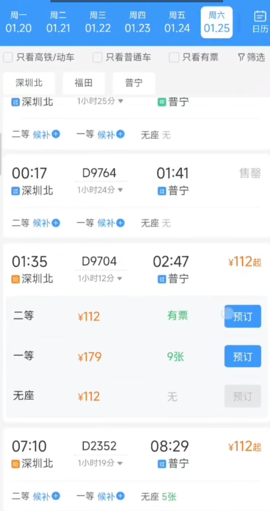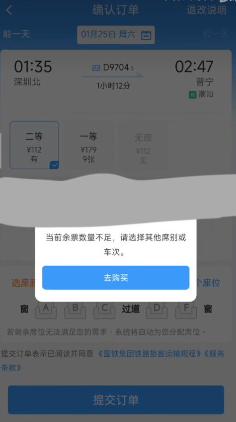

### <font style="color:rgb(51, 51, 51);">预留票和队列区分</font>
相信很多小伙伴再买票的时候会发现线上没票，其他软件或者线下有票，这个其实就是**候补**和**预留票功能**，不会将票全部打入一个池子供人抢购。很多限制终到站和预留票都会在开车前固定时间流出来。还有重点车次都有预留票，只能在代售点取票的。

而且中国国情决定排队也分等级，比如老年人，残障人士，军人等都有特殊通道。线上购票也一样能识别**抢购队列也可做优先区分**。而且有小伙伴自己购票的时候估计也会发现，有时排队一张票需要30分钟左右，有时可能是几小时。这可能不仅仅是因为此票抢购人太多，需要排队时间过久，也可能识别你的请求频率等给你做了降级。这跟黄牛抢票软件低速，快速，高速，极速，光速一个道理。不同等级出票效率肯定不同，加钱才是硬道理。

由于预留长途，就可能出现奇葩的现象，就是部分小伙伴可能在查询票的时候会发现短途无票但长途确有票的情况：[链接](https://www.bilibili.com/video/BV1LK411a7mR?spm_id_from=333.788.recommend_more_video.0&vd_source=04d13f3e51316f05440d2eb2411de9f3)  。所以就算你不用找“**加钱哥**”的第三方，也可以多付一点买个全程票啊。

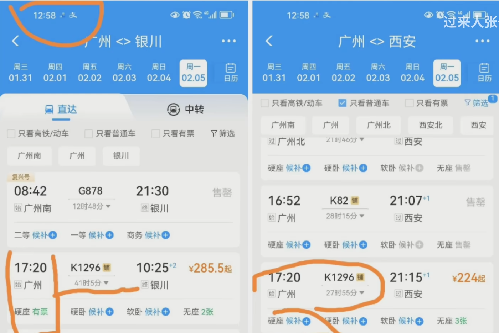


## <font style="color:rgb(51, 51, 51);">技术角度 </font>
### <font style="color:rgb(51, 51, 51);">NoSQL跟DB数据同步</font>
**<font style="color:rgb(51, 51, 51);">历史背景：</font>**

<font style="color:rgb(51, 51, 51);">面对 12306 这种读多写少的场景，可能我们平时会采用 Redis 这种缓存机制，12306 具体选择的解决方案，可能跟我们常见的解决方案有一些不一样。</font>

<font style="color:rgb(51, 51, 51);">12306 通过充分调研，并没有选择 Redis，而是选择了名叫 </font>**<font style="color:rgb(51, 51, 51);">Pivotal GemFire</font>**<font style="color:rgb(51, 51, 51);"> 的产品。</font>

<font style="color:rgb(51, 51, 51);">很多银行、投行，实时交易方面的系统都采用 Pivotal GemFire 作为解决方案。</font>

**<font style="color:rgb(51, 51, 51);">为什么选择 Pivotal GemFire 而不是 Redis？</font>**

<font style="color:rgb(119, 119, 119);">官网VS ：</font>[<font style="color:rgb(119, 119, 119);">https://redis.io/comparisons/redis-vs-gemfire/</font>](https://redis.io/comparisons/redis-vs-gemfire/)

<font style="color:rgb(51, 51, 51);">Redis 是开源的缓存解决方案，而 GemFire 是商用的，我们在互联网项目中为什么使用 Redis 比较多呢，很大原因就是因为 Redis 是开源的，不要钱。</font>

<font style="color:rgb(51, 51, 51);">GemFire，不仅性能强、高可用，而且 GemFire 还会提供一系列的解决方案。</font>

<font style="color:rgb(51, 51, 51);">Redis 主要用作缓存存储，而当时 （12 年左右） 12306 最大的瓶颈主要是在 IO 上面。</font>

<font style="color:rgb(51, 51, 51);">为什么 12306 最大的瓶颈会在 IO 上面呢？这跟 12306 使用读扩散有关。</font>

<font style="color:rgb(51, 51, 51);">读扩散和写扩散常参看</font>面试突击宝典<font style="color:rgb(51, 51, 51);">：</font>[千万级实时聊天系统如何设计](https://www.yuque.com/tulingzhouyu/db22bv/rb7gfu08kchy88sx)<font style="color:rgb(51, 51, 51);">。</font>

<font style="color:rgb(51, 51, 51);">扣减库存</font>**<font style="color:rgb(51, 51, 51);">数据库选用的是 Sybase</font>**<font style="color:rgb(51, 51, 51);">（收费，关系型数据库）</font>

**<font style="color:rgb(51, 51, 51);">数据同步：</font>**

<font style="color:rgb(51, 51, 51);">首先通过后台管理系统根据时间车次座位</font>**<font style="color:rgb(51, 51, 51);">放票，</font>**<font style="color:rgb(51, 51, 51);">更新数据库增加余票，Canal监听bin-log变更，再</font>**<font style="color:rgb(51, 51, 51);">异步更新数据到NoSQL缓存</font>**<font style="color:rgb(51, 51, 51);"> 和 本地Cache多级缓存。前面讲过12306会根据往年压测，提前扩容缓存尽量打满。同步余票到缓存之后，查询余票和扣减直接操作缓存数据。</font>

<font style="color:rgb(51, 51, 51);">查询余票服务 和 下单扣减</font>**<font style="color:rgb(51, 51, 51);">服务分流</font>**<font style="color:rgb(51, 51, 51);">处理。下单抢购完成直接扣减缓存，为确保顺序性可采用分布式锁或者</font>**<font style="color:rgb(51, 51, 51);">排队消费</font>**<font style="color:rgb(51, 51, 51);">。更多实现过程和源码可参看</font>面试突击宝典<font style="color:rgb(51, 51, 51);">：</font>[如何设计一个秒杀系统](https://www.yuque.com/tulingzhouyu/db22bv/zmh8bxm30a2a81p2#nY8CA) <font style="color:rgb(51, 51, 51);">中的扣减库存极限优化部分。缓存扣减同时发送</font>**<font style="color:rgb(51, 51, 51);">异步消息批量更新DB</font>**<font style="color:rgb(51, 51, 51);">，再交由消息队列同步更新情况</font>**<font style="color:rgb(51, 51, 51);">汇总给数据中台</font>**<font style="color:rgb(51, 51, 51);">。数据中台可协调余票预分配以及库存预警重分配等。</font>

<font style="color:rgb(51, 51, 51);">由于数据量较大，最终汇总DB的数据除了sharding分片读写分离之外，还需要做好ES迁移和大数据相关分析性数据库等备份。这样方便快速查询统计</font>

**<font style="color:rgb(51, 51, 51);">附部分核心代码：</font>**

<font style="color:rgb(51, 51, 51);">sharding部分</font>

```java
    @Bean(name = "trainSeatShardingDataSource")
    public DataSource trainSeatShardingDataSource(@Qualifier(DataSources.TRAIN_SEAT_DB_1) DataSource trainSeatDB1,
                                                  @Qualifier(DataSources.TRAIN_SEAT_DB_2) DataSource trainSeatDB2,
                                                  @Qualifier(DataSources.TRAIN_SEAT_DB_3) DataSource trainSeatDB3,
                                                  @Qualifier(DataSources.TRAIN_SEAT_DB_4) DataSource trainSeatDB4,
                                                  @Qualifier(DataSources.TRAIN_SEAT_DB_5) DataSource trainSeatDB5
    ) throws SQLException {
        ShardingRuleConfiguration shardingRuleConfiguration = new ShardingRuleConfiguration();

        // 设置分库的映射
        Map<String, DataSource> dataSourceMap = Maps.newHashMap();
        dataSourceMap.put(DataSources.TRAIN_SEAT_DB_1, trainSeatDB1);
        dataSourceMap.put(DataSources.TRAIN_SEAT_DB_2, trainSeatDB2);
        dataSourceMap.put(DataSources.TRAIN_SEAT_DB_3, trainSeatDB3);
        dataSourceMap.put(DataSources.TRAIN_SEAT_DB_4, trainSeatDB4);
        dataSourceMap.put(DataSources.TRAIN_SEAT_DB_5, trainSeatDB5);

        // 设置表策略
        TableRuleConfiguration tableRuleConfiguration = new TableRuleConfiguration();
        // 1\6 DB1
        // 2\7 DB2
        // 3\8 DB3
        // 4\9 DB4
        // 5\10 DB5
        tableRuleConfiguration.setLogicTable("train_seat");
        tableRuleConfiguration.setActualDataNodes(
                DataSources.TRAIN_SEAT_DB_1 + ".train_seat_1," +
                        DataSources.TRAIN_SEAT_DB_2 + ".train_seat_2," +
                        DataSources.TRAIN_SEAT_DB_3 + ".train_seat_3," +
                        DataSources.TRAIN_SEAT_DB_4 + ".train_seat_4," +
                        DataSources.TRAIN_SEAT_DB_5 + ".train_seat_5," +
                        DataSources.TRAIN_SEAT_DB_1 + ".train_seat_6," +
                        DataSources.TRAIN_SEAT_DB_2 + ".train_seat_7," +
                        DataSources.TRAIN_SEAT_DB_3 + ".train_seat_8," +
                        DataSources.TRAIN_SEAT_DB_4 + ".train_seat_9," +
                        DataSources.TRAIN_SEAT_DB_5 + ".train_seat_10"
        );
        // 设置分库策略
        tableRuleConfiguration.setDatabaseShardingStrategyConfig(new StandardShardingStrategyConfiguration(
                "train_number_id", new TrainSeatDatabaseShardingAlgorithm()));
        // 设置分表策略
        tableRuleConfiguration.setTableShardingStrategyConfig(new StandardShardingStrategyConfiguration(
                "train_number_id", new TrainSeatTableShardingAlgorithm()));

        shardingRuleConfiguration.getTableRuleConfigs().add(tableRuleConfiguration);

        return ShardingDataSourceFactory.createDataSource(dataSourceMap, shardingRuleConfiguration, new ConcurrentHashMap(), new Properties());
    }
```

<font style="color:rgb(51, 51, 51);">CannelSubscribe</font>

```java
  private void canalSubscribe() {
        // 创建链接
        CanalConnector connector = CanalConnectors.newSingleConnector(new InetSocketAddress(AddressUtils.getHostIp(),
                11111), "train", "", "");
        int batchSize = 1000;
        new Thread(() -> {
            try {
                log.info("canal subscribe");
                connector.connect();
                connector.subscribe(".*\\..*");
                connector.rollback();
                while (true) {
                    Message message = connector.getWithoutAck(batchSize); // 获取指定数量的数据
                    long batchId = message.getId();
                    int size = message.getEntries().size();
                    if (batchId == -1 || size == 0) {
                        safeSleep(100);
                        continue;
                    }
                    try {
                        log.info("new message, batchId:{}, size:{}", batchId, size);
                        handleEntry(message.getEntries());
                        connector.ack(batchId); // 提交确认
                    } catch (Exception e1) {
                        log.error("canal data handle exception, batchId:{}", batchId, e1);
                        connector.rollback(batchId); // 处理失败, 回滚数据
                    }
                }
            } catch (Exception e3){
                log.error("canal subscribe exception", e3);
                safeSleep(1000);
                canalSubscribe();
            }
        }).start();
    }

    private void handleEntry(List<CanalEntry.Entry> entrys) throws Exception {
        for (CanalEntry.Entry entry : entrys) {
            if (entry.getEntryType() == CanalEntry.EntryType.TRANSACTIONBEGIN || entry.getEntryType() == CanalEntry.EntryType.TRANSACTIONEND) {
                continue;
            }

            CanalEntry.RowChange rowChange = null;
            try {
                rowChange = CanalEntry.RowChange.parseFrom(entry.getStoreValue());
            } catch (Exception e) {
                throw new RuntimeException("rowChange.parse exception , data:" + entry.toString(), e);
            }

            CanalEntry.EventType eventType = rowChange.getEventType();
            String schemaName = entry.getHeader().getSchemaName();
            String tableName = entry.getHeader().getTableName();
            log.info("name:[{},{}],eventType:{}", schemaName, tableName, eventType);

            for (CanalEntry.RowData rowData : rowChange.getRowDatasList()) {
                if (eventType == CanalEntry.EventType.DELETE) {
                    handleColumn(rowData.getBeforeColumnsList(), eventType, schemaName, tableName);
                } else {
                    handleColumn(rowData.getAfterColumnsList(), eventType, schemaName, tableName);
                }
            }
        }
    }
    //根据变更日志处理结果同步NoSQL
    private void handleColumn(List<CanalEntry.Column> columns, CanalEntry.EventType eventType, String schemaName, String tableName) throws Exception {
        if (schemaName.contains("train_seat")) { // 处理座位变更
            trainSeatService.handle(columns, eventType);
        } else if (tableName.equals("train_number")) { // 处理车次信息变更
            trainNumberService.handle(columns, eventType);
        } else {
            log.info("drop data, no need care");
        }
    }

    private void safeSleep(int mills) {
        try {
            Thread.sleep(mills);
        } catch (Exception e2) {

        }
    }
```

<font style="color:rgb(51, 51, 51);">EsService</font>

```java
   private void saveES(List<TrainNumberDetail> detailList, TrainNumber trainNumber) throws Exception {
        /**
         * A->B fromStationId->toStationId
         *
         * trainNumber: A->B->C  D386:北京->锦州->大连  D387:北京->鞍山->大连
         * 北京-大连？
         * D386: 北京-锦州、锦州-大连、北京-大连
         * D387: 北京-鞍山、鞍山-大连、北京-大连
         *
         * fromStationId->toStationId : trainNumberId1,trainNumberId2，...
         */
        List<String> list = Lists.newArrayListWithExpectedSize(detailList.size() * detailList.size());
        if (detailList.size() == 1) {
            int fromStationId = trainNumber.getFromStationId();
            int toStationId = trainNumber.getToStationId();
            list.add(fromStationId + "_" + toStationId);
        } else {
            // 多段, 保证detailList是有序的
            for (int i = 0; i < detailList.size(); i++) {
                int tmpFromStationId = detailList.get(i).getFromStationId();
                for(int j = i; j < detailList.size(); j++) {
                    int tmpToStationId = detailList.get(j).getToStationId();
                    list.add(tmpFromStationId + "_" + tmpToStationId);
                }
            }
        }
        // 组装批量请求，获取es已经存储的数据
        MultiGetRequest multiGetRequest = new MultiGetRequest();
        for (String item : list) {
            multiGetRequest.add(new MultiGetRequest.Item(TrainEsConstant.INDEX, TrainEsConstant.TYPE, item));
        }
        MultiGetResponse multiGetResponse = esClient.multiGet(multiGetRequest);

        BulkRequest bulkRequest = new BulkRequest();

        // 处理处理的每一项
        for (MultiGetItemResponse itemResponse : multiGetResponse.getResponses()) {
            if (itemResponse.isFailed()) {
                log.error("multiGet item failed, itemResponse:{}", itemResponse);
                continue;
            }
            GetResponse getResponse = itemResponse.getResponse();
            if (getResponse == null) {
                log.error("multiGet item getResponse is null, itemResponse:{}", itemResponse);
                continue;
            }

            // 存储更新es的数据
            Map<String, Object> dataMap = Maps.newHashMap();

            Map<String, Object> map = getResponse.getSourceAsMap();
            if (!getResponse.isExists() || map == null) {
                // add index
                dataMap.put(TrainEsConstant.COLUMN_TRAIN_NUMBER, trainNumber.getName());
                IndexRequest indexRequest = new IndexRequest(TrainEsConstant.INDEX, TrainEsConstant.TYPE, getResponse.getId()).source(dataMap);
                bulkRequest.add(indexRequest);
                continue;
            }

            String origin = (String) map.get(TrainEsConstant.COLUMN_TRAIN_NUMBER);
            Set<String> set = Sets.newHashSet(Splitter.on(",").trimResults().omitEmptyStrings().split(origin));
            if(!set.contains(trainNumber.getName())) {
                // update index
                dataMap.put(TrainEsConstant.COLUMN_TRAIN_NUMBER, origin + "," + trainNumber.getName());
                UpdateRequest updateRequest = new UpdateRequest(TrainEsConstant.INDEX, TrainEsConstant.TYPE, getResponse.getId()).doc(dataMap);
                bulkRequest.add(updateRequest);
            }
        }

        // 批量更新es里的数据
        BulkResponse bulkResponse = esClient.bulk(bulkRequest);
        log.info("es bulk, response:{}", JsonMapper.obj2String(bulkResponse));
        if (bulkResponse.hasFailures()) {
            throw new RuntimeException("es bulk failure");
        }
    }
```

### <font style="color:rgb(51, 51, 51);">余票库存的表二进制设计</font>
<font style="color:rgb(51, 51, 51);">这里的设计思路都是猜测的，并不一定是 12306 真实的设计方案。</font>

**<font style="color:rgb(51, 51, 51);">12306 余票库存的表的设计是非常特色并且重要的</font>**

<font style="color:rgb(51, 51, 51);">首先说一下需要哪几个表来表示余票的库存信息：</font>

<font style="color:rgb(51, 51, 51);">1、基础的车次表：表示车次的编号以及发车时间等具体的车次信息，属于比较稳定的数据。</font>

<font style="color:rgb(51, 51, 51);">2、车的座位表：表示每个座位的具体信息，包括在几车厢、几行、几列，以及该座位的售卖情况。</font>

<font style="color:rgb(51, 51, 51);">3、车的余票表：通过座位表可以计算出每个车位在各个车站区间还有多少余票，但是动态计算比较浪费性能，因此再添加余票表，通过定时计算余票信息放入到余票表中，提高查询的性能。</font>

<font style="color:rgb(51, 51, 51);">（其实还应该有站点表和车厢表，不过不太重要，这里直接就省略了）</font>

**<font style="color:rgb(51, 51, 51);">这里说一下这 3 个表的对应关系：</font>**

<font style="color:rgb(51, 51, 51);">比如车次为 K123，该车上有很多的座位，每个座位对应座位表中的一条数据。</font>

<font style="color:rgb(51, 51, 51);">而余票表指的是 K123 车次上，硬座、硬卧、软卧、无座各有多少张余票，余票表的信息可以由座位表来计算得到。</font>

**<font style="color:rgb(51, 51, 51);">接下来说一下如何通过座位表来表示用户购买的车票：</font>**

<font style="color:rgb(51, 51, 51);">12306 中的车票信息其实是比较复杂的，因为各个车站之间是有依赖关系的，比如 4 个车站 A->B->C->D</font>

<font style="color:rgb(51, 51, 51);">如果乘客购买 B->C 的车票的话，不仅 B->C 的库存要减一，B->D 的库存也要减一，这是排列组合的情况，</font>**<font style="color:rgb(51, 51, 51);">可以考虑通过二进制去简化车票的表示。</font>**

<font style="color:rgb(51, 51, 51);">在座位表中，我们设置一个字段 </font>`<font style="color:rgb(51, 51, 51);background-color:rgb(243, 244, 244);">sell varchar(50)</font>`<font style="color:rgb(51, 51, 51);"> 表示该座位的售卖情况，如果该车次有 4 个站 A->B->C->D，那么 sell 字段的长度就为 3，sell 字段的第一位表示该座位 A->B 的票是否已经被买了，第二位表示 B->C 的票是否已经被买了...</font>

<font style="color:rgb(51, 51, 51);">如果乘客购买 B->C 的车票，则 sell 字段的值为：</font>`<font style="color:rgb(51, 51, 51);background-color:rgb(243, 244, 244);">010</font>`<font style="color:rgb(51, 51, 51);">。</font>

<font style="color:rgb(51, 51, 51);">如果乘客购买 B->D 的车票，此时发现该座位在 B->C 已经被卖出去了，因此不能将该座位出售给这位乘客。</font>

<font style="color:rgb(51, 51, 51);">如果乘客购买 C->D 的车票，则 sell 字段的值为：</font>`<font style="color:rgb(51, 51, 51);background-color:rgb(243, 244, 244);">011</font>`<font style="color:rgb(51, 51, 51);"> ，表示 B->C，C->D 都已经有人了。</font>

<font style="color:rgb(51, 51, 51);">通过座位表来计算出余票，得到余票表。</font>

**<font style="color:rgb(51, 51, 51);">通过余票表提升查询性能</font>**

<font style="color:rgb(51, 51, 51);">这里余票表就相当于是数据库中的视图。</font>

<font style="color:rgb(51, 51, 51);">如果要去查询一个车次中某一个类型的余票还有多少，还需要去对座位表进行计算，这个消耗是比较大的 ，因此通过余票表来加快对于余票的查询。</font>

<font style="color:rgb(51, 51, 51);">可以定时去计算座位表中的数据，将每种类型的座位的余票给统计出来，比如：</font>

<font style="color:rgb(51, 51, 51);">硬卧：xx 张</font>

<font style="color:rgb(51, 51, 51);">硬座：xx 张</font>

<font style="color:rgb(51, 51, 51);">软卧：xx 张</font>

<font style="color:rgb(51, 51, 51);">...</font>

<font style="color:rgb(51, 51, 51);">再将余票表的信息给放入到缓存中，大大提高查询的性能。</font>

### <font style="color:rgb(51, 51, 51);">示例：G1车次从北京南发往上海虹桥</font>
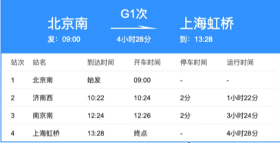

<font style="color:rgb(51, 51, 51);">这意味着可购买组合有：（票  库存）</font>

<font style="color:rgb(51, 51, 51);">1.北京南-济南西</font>

<font style="color:rgb(51, 51, 51);">2.北京南-南京南</font>

<font style="color:rgb(51, 51, 51);">3.北京南-上海虹桥</font>

<font style="color:rgb(51, 51, 51);">4.济南西-南京南</font>

<font style="color:rgb(51, 51, 51);">5.-济南西-上海虹桥</font>

<font style="color:rgb(51, 51, 51);">6.南京南-上海虹桥</font>

<font style="color:rgb(51, 51, 51);">理论上来说bitmaps实际通过string类型来存储最大长度可512MB*8位/字节，但实际上我们为了避免大Key影响性能应该将车次按车厢划分（软卧-软座-硬座座位数是36-60-118）。这里为了演示，假定一个站点先发售10张，直接一个k-v搞定</font>

<font style="color:rgb(51, 51, 51);"></font>

<font style="color:rgb(51, 51, 51);">Key 设计: 车次_城市_车厢等（几等座车厢已区分）</font>_<font style="color:rgb(51, 51, 51);"> </font>_

<font style="color:rgb(51, 51, 51);">  比如： G1_</font><font style="color:rgb(6, 6, 7);">110000</font><font style="color:rgb(51, 51, 51);">_08  </font>

<font style="color:rgb(51, 51, 51);">value设计： bitmaps标识可买状态0，已售状态1.</font>

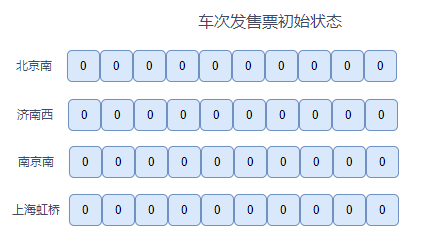

<font style="color:rgb(51, 51, 51);">当乘客想买 北京南-南京南 时，只需判断 北京南，济南西，南京南三个数组中进行或（||）的操作 即可得到库存余票情况。</font>

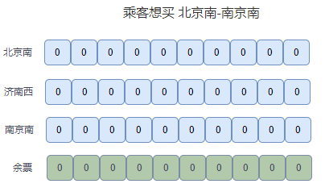

<font style="color:rgb(51, 51, 51);">接下来即可选择某个座位下单购买，</font>

<font style="color:rgb(51, 51, 51);">代码层需要将这三个站点的某个坐次位都set key offset value 为1</font>

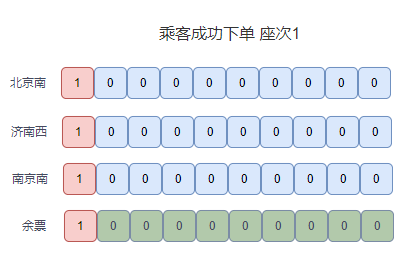

<font style="color:rgb(51, 51, 51);">接下来 更多乘客组合 短中全程票购买之后，可能会是如下结果：</font>

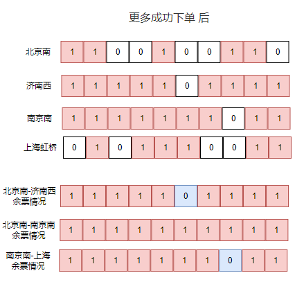

我们在买票的时候会发现，想一站到底会比中途转乘难很多。

**<font style="color:rgb(51, 51, 51);">中间的站点如果太过火爆，导致两边的站点买不到票怎么办？</font>**

<font style="color:rgb(51, 51, 51);">比如 A->B->C->D，对于一个车次中的座位来说，如果 B->C 的乘客非常多，那么是不是就会导致 A->D 买不到票了？</font>

<font style="color:rgb(51, 51, 51);">而且运营部来进行设计，首先考虑的肯定是要</font>**<font style="color:rgb(51, 51, 51);">盈利</font>**<font style="color:rgb(51, 51, 51);">，远途票价比较贵，因此比较倾向于远途的旅客，营业部根据具体的实际情况以及盈利情况来定一下各个区间预留多少票，给每个车站区间都留有一些余票，那么就不会因为某一个区间非常火爆，而导致其他乘客买不到长途的票了。</font>

<font style="color:rgb(51, 51, 51);"></font>

**更多实战落地代码可参看面试突击中的** [7天高并发直播视频](https://www.processon.com/view/link/659551179dab311b9589ef15)


> 更新: 2025-01-24 21:03:52  
> 原文: <https://www.yuque.com/tulingzhouyu/db22bv/dcufnmtc6ut2f4gt>