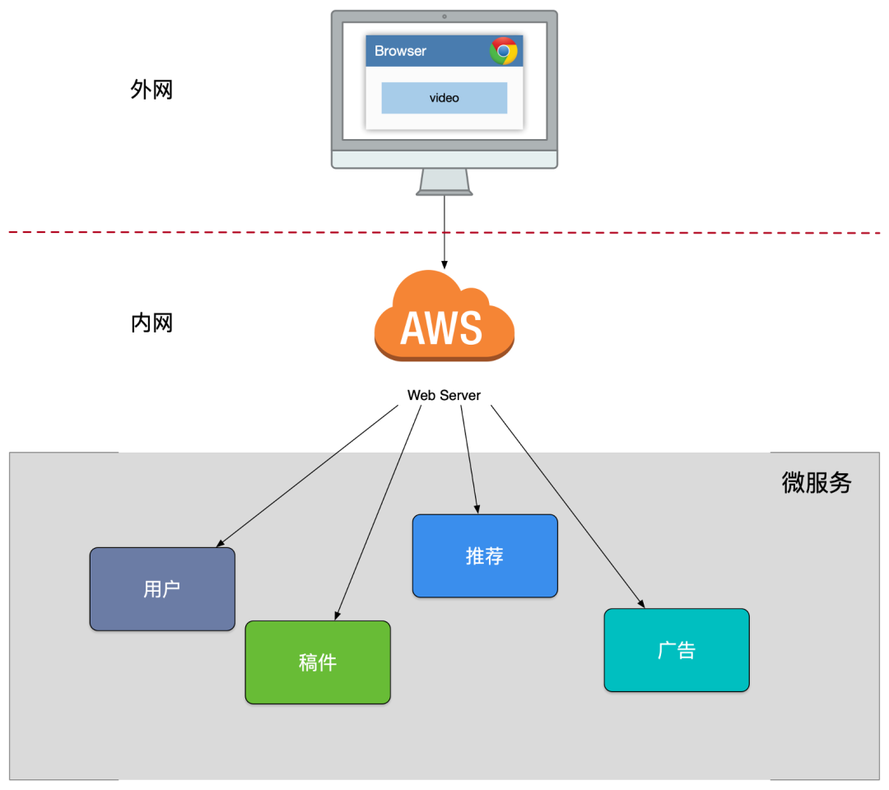
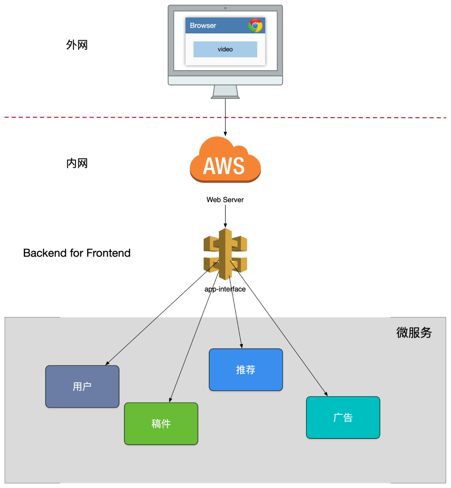
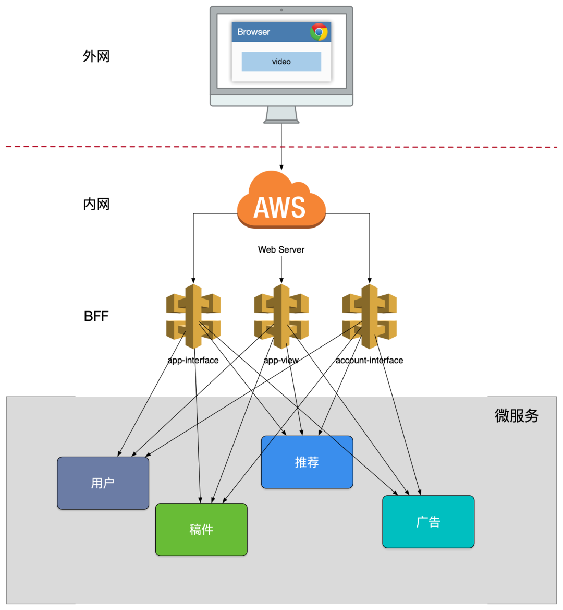
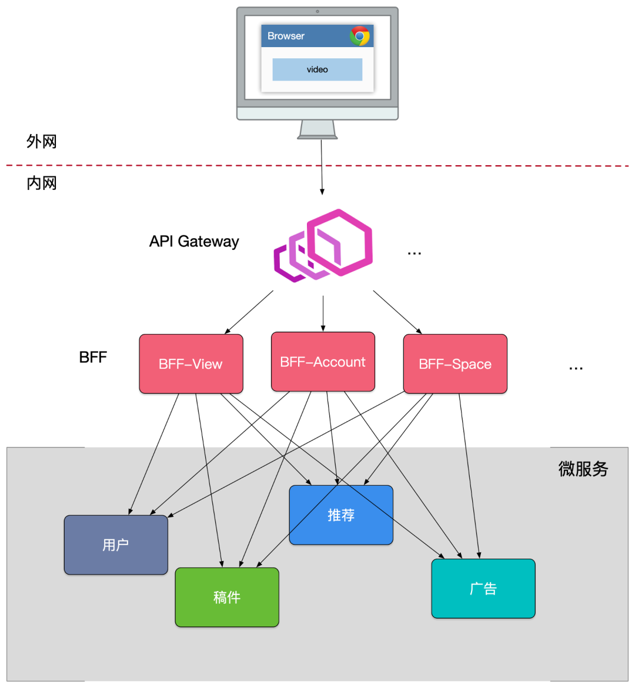
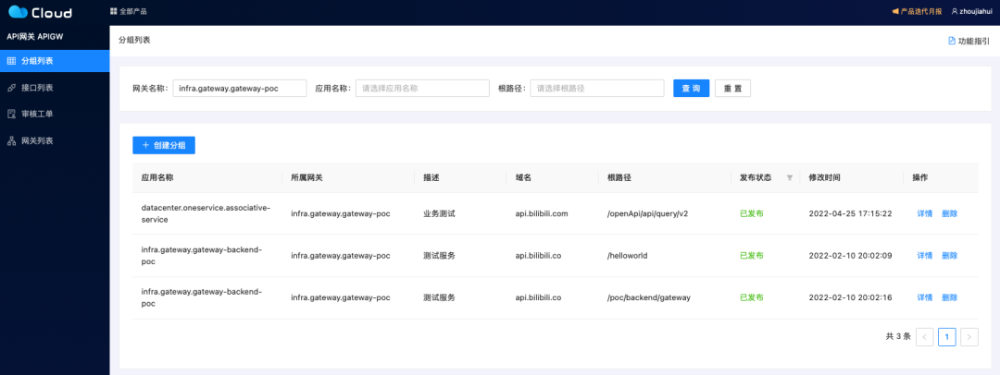

# B站亿级API网关重构之路

**本次分享内容**

1. 项目背景
2. 垂直BFF时代
3. 在电商和直播业务下重构API网关
4. 未来展望

### 背景
如果你在 2015 年就使用 B 站，那么你一定不会忘记那一年 B 站工作日选择性崩溃，周末必然性崩溃的一段时间。也是那一年 B 站投稿量激增，访问量随之成倍上升，而过去的 PHP 全家桶也开始逐渐展露出颓势，运维难、监控难、排查故障难、调用路径深不见底，而也就是在这一年，B 站开始正式用 Go 重构 B 站。

**B 站第一个 Go 项目：bilizone**

bilizone 其实还是一个大而全的应用，bilizone 在当时重构的主要意义是将谁也理不清的 PHP 逻辑梳理成了一个比较标准的 Go 应用。

bilizone 在当时最大的意义就是为用户终端提供了基本稳定的数据结构、相对可靠的接口和比较有效的监控。但因 bilizone 依旧是一个单体应用，所以它依旧继承了单体应用所具有的缺点：

+ 代码复杂度高

方法被滥用、超时设置混乱、牵一发而动全身

+ 一挂全挂

最常见的：超时设置不合理，Goroutine 大量堆积，雪崩

_Goroutine是Go语⾔中并发的执⾏单位。 Goroutine底层是使⽤协程(coroutine)实现， coroutine 是⼀种运⾏在⽤户态的⽤户线程（参考操作系统原理：内核态，⽤户态）它可以由语⾔和框架层调度。 Go在语⾔层⾯实现了调度器，同时对⽹络， IO库进⾏了封装处理，屏蔽了操作系统层⾯的复杂的细节，在语⾔层⾯提供统⼀的关键字⽀持。_

+ 测试及维护成本高

小改动都需要测试所有 case，运维发布胆战心惊 

所以此时 B 站的崩溃频率虽然已经有所降低，但一炸全炸的问题依旧是一个心腹大患。

**而再接下来的一次重构，B 站微服务的全局面貌就将初具雏形。**

为了实现微服务模式下的 bilibili，我们将一个 bilizone 应用拆分成多个独立业务应用，如账号、稿件、广告等等，这些业务通过 SLB 直接对外提供 API。

当时的调用模式如下图所示：

但是随着功能拆分后，我们对外暴露了一批微服务，但是因为缺乏统一的出口而面临了不少困难：

+ 客户端与微服务直接通信，强耦合
+ 需要多次请求，客户端聚合数据，工作量巨大，延迟高。
+ 协议不利于统一，各个部门间有差异，反而需要通过客户端来兼容。
+ 面向 “端” 的 API 适配，耦合到了内部服务。
+ 多终端兼容逻辑复杂，每个服务都需要处理。
+ 统一逻辑无法收敛，比如安全认证、限流。

基于上述问题和我们想要将对端的处理进行内聚的想法，我们自然的而然的就想到在客户端与后端服务之间加一个 app-interface 的组件，这就是接下来的 BFF（Backend for Frontend）模式。

app-interface 的工作模式如下图所示：

有了这个 BFF 之后，我们可以在该服务内进行大量的数据聚合，按照业务场景来设计粗粒度的 API，给后续服务的演进带来的很多优势：

+ 轻量交互：协议精简、聚合。
+ 差异服务：数据裁剪以及聚合、针对终端定制化 API。
+ 动态升级：原有系统兼容升级，更新服务而非协议。
+ 沟通效率提升，协作模式演进为移动业务和网关小组。

BFF 可以认为是一种适配服务，将后端的微服务为客户端的需要进行适配（主要包括聚合裁剪和格式适配等逻辑），向终端设备暴露友好和统一的 API，方便无线设备接入访问后端服务，在其中可能还伴随有埋点、日志、统计等需求。

这个时期的 BFF 还有一个致命的一个问题是整个 app-interface 属于 single point of failure，严重代码缺陷或者流量洪峰可能引发集群宕机所有接口不可用。于是我们在上述基础上进一步迭代，将 app-interface 进行业务拆分，进而多套 BFF 的模式横空出世：

由此模式开始，基本确定了 B 站微服务接口的对接模式，这套模式也随之在全公司内推广开来。

### 垂直 BFF 时代 2016-2019
当 B 站网关的架构发展为多套垂直 BFF 之后，开发团队围绕该模式平稳迭代了相当长的一段时间。而后随着 B 站业务的发展，团队人员的扩充和几次组织架构调整，此时开始出现直播、电商等独立业务，这些业务的发展我们之后再细说。而在这些调整之后，有一个团队的职责越来越清晰：主站网关组。

主站网关组的主要职责就是维护上述各类功能的 BFF 网关，此时 bilibili 的主要流量入口为粉板 App，这里可以简单细说一下粉板 App 上的所有业务组成：

**主站业务**

+ 网关组维护的 BFF，如推荐、稿件播放页等
+ 业务层自行维护的 BFF，如评论、弹幕、账号等

**独立业务**

+ 电商服务
+ 直播服务
+ 动态服务

主站业务的 BFF 其实被分为两类，一类是由网关组负责的 BFF，另一类是业务自行维护的 BFF。

而这两类 BFF 的技术栈其实基本一致，基本功能职责也相差不多，如此划分的原因是让网关组可以更专注于迭代客户端特性功能，免去理解部分独立业务场景的接口，如登陆页应该让对安全更专业账号的同学自行维护。在这里我们也可以简述一下一个新需求应该如何决定参与的 BFF ：

+ 如果这个功能能由业务层的业务 BFF 独立完成，则网关组不需介入。
+ 如果该功能是一个客户端特性需求，如推荐流等复合型业务，需要对接公司大量部门时，则由网关同学参与开发 BFF。

当时主站技术部的后端同学遵循以上两个规则，基本能够满足业务的快速开发和迭代。

我把这段时间称为垂直 BFF 时代，因为基本主站每个业务或多或少都有各种形式的网关存在，大家通过这个网关向外提供接口，该网关和 SLB 进行直接交互。 

### 在电商和直播业务下重构API网关
电商和直播其实并不是同一时期衍生的，直播在主站 PHP 时期就诞生了，而电商相对更晚一些。

当时直播的技术栈组成有 C++、PHP、Go，其中早期大部分业务逻辑由 PHP 和 C++ 实现，稍晚一些也开始逐步试用主站的 Go 实现部分业务逻辑。其中 PHP 负责对终端提供接口，C++ 主要实现核心业务功能。因此我们可以简单理解为直播使用由 PHP 编写的 BFF 网关。

动态团队其实派生自直播团队，因此技术栈和直播当时基本一致，这里可以简单省略。

而众所周知，大部分电商团队的技术栈都是 Java 和 Spring 或 Dubbo。

因这几个业务实现上几乎没有相似的地方，且大家对 gRPC 协议逐渐地认同，因此技术栈上大家基本没有大一统的想法，互相能调通即可。

而随着 B 站团队进一步的壮大、流量持续的增长，进而经历了诸多线上故障、事故分析之后，大家慢慢发现了这套架构下的问题：

+ 单个复杂模块也会导致后续业务集成的高难度，根据康威法则，复杂聚合型 BFF 和多团队之间就出现不匹配问题，团队之间沟通协调成本高，交付效率低下。
+ 很多跨横切面逻辑，比如安全认证，日志监控，限流熔断等。随着时间的推移，功能的迭代，代码变得越来越复杂，技术债越堆越多。

此时我们可能还需要一个能协调横跨切面的组件，将路由、认证、限流、安全等组件全部上提，能够统一更新发布，把业务集成度高的 BFF 层和通用功能服务层进行分层，进而大家开始引入**「统一 API 网关」**。

在新的架构中，统一网关承担了重要的角色，它是解耦拆分和后续升级迁移的利器。在统一网关的配合下，单块 BFF 实现了解耦拆分，各业务线团队可以独立开发和交付各自的微服务，研发效率大大提升。另外，把跨横切面逻辑从 BFF 剥离到网关上去以后，BFF 的开发人员可以更加专注业务逻辑交付，实现了架构上的关注分离（Separation of Concerns）。

### 从多个网关到最后一个统一网关 2022 - 至今

在这两三年的时间里，各个业务团队或多或少都有自己业务网关组建独立的维护团队，也为网关的功能作出过相当多的投入。但随着 B 站业务的发展，公司级中间件功能的不断更替演进，如果将对接各个中间件的工作在每个网关上都实现一次的话带来的人力投入和沟通成本会相当巨大，且实现标准不统一、运营方式不统一无法起到 API 网关所带来的最佳收益。

因此微服务团队开发了一款 B 站内部意义上的标准 API 网关，该 API 网关汇集以往各型网关中流量治理的优秀经验，对相关功能做出完善设计改进。该 API 网关的目前的主要功能除了常规的限流、熔断、降级、染色外，还会基于这些基础功能和公司各类中间件的基础上，提供了：

+ 全链路灰度
+ 流量采样分析、回放
+ 流量安全控制
+ ...

等等进阶型 API 质量治理的相关功能，这些功能业务团队在接入 API 网关后都可以一并获得，为业务的迅速迭代做出力所能及的保障。

### 未来展望
在开发 API 网关的同时，我们也会更进一步关注业务团队开发、对接 API 时的体验，我们将以网关作为统一标准 API 规范的起点，为业务团队提供更有效的 API 开发生态，如：

+ 规划 API 业务域，简化 SRE 运维
+ 标准 API 元信息平台
+ 精确的 API 文档和调试工具
+ 类型安全的 API 集成 SDK
+ API 兼容性保障服务

API 网关是我们 API 治理生态中的一个标志性里程碑，本次 API 网关也以开源形式进行开发：[https://github.com/go-kratos/gateway](https://github.com/go-kratos/gateway)

> 更新: 2024-07-15 22:21:20  
> 原文: <https://www.yuque.com/tulingzhouyu/db22bv/vycfauld0xb8e6rm>