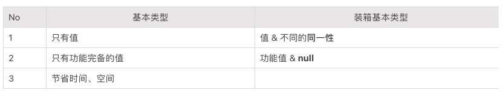

# Effective Java 最佳应用实践

**示例代码**

[附件: effective-demo.ppt](./attachments/Ys-wdZxx2SXW_IGJ/effective-demo.ppt)

_<font style="color:#DF2A3F;">注：将ppt后缀名改为zip后解压</font>_

jdk版本：1.8.0_181


**本次分享内容**

《Effective Java》是一本经典的 Java 学习宝典，值得每位 Java 开发者阅读。本节课将分享书中与平日工作里较密切的知识点

1、创建和销毁对象篇

2、类和接口篇

3、泛型篇

4、方法篇

5、通用程序设计篇

6、异常


### 一  创建和销毁对象篇
#### 1  若有多个构造器参数时，优先考虑构造器
当类构造包含多个参数时，同学们会选择 JavaBeans 模式。在这种模式下，可以调用一个无参构造器来创建对象，然后调用  setter 方法来设置必要和可选的参数。目前较受欢迎的方法之一如在类上加入 Lombok 提供的 @Data 注解，来自动生成 getter/setter、equals 等方法。但是 JavaBeans 模式无法将类做成不可变（immutable，详见 “使可变形最小化” 章节）。这就需要开发者自己掌控值的更新情况，确保线程安全等。

推荐：Builder 模式

Builder 模式通过 builder 对象上，调用类似 setter 的方法，设置相关的参数（类似 Proto Buffers）。最后，通过调用 build 方法来生成不可变的对象（immutable object）。使用 Builder 模式的方法之一包括在类上加入 Lombok 提供的 @Builder 注解。

应用：API Request & Response

在微服务架构中，服务的请求（request）和响应（response）往往包含较多参数。在处理请求的过程中，常常会担心误操作修改了请求的内容。所以，建议使用 Builder 模式。

我们可使用 Builder 模式来构建该类型对象。在构建过程中，若需要引入额外逻辑（e.g. if-else），可先返回 Builder 对象，最后再调用 build 方法。

```java
import lombok.Builder;
/** 请求类 */
@Builder
public class SampleRequest {
    private String paramOne;
    private int paramTwo;
    private boolean paramThree;
}
/** 响应类 */
@Builder
public class SampleResponse {
    private boolean success;
}
/** 服务接口 */
public interface SampleFacade {
    Result<SampleResponse> rpcOne(RequestParam<SampleRequest>);
}
/** 调用 */
public void testRpcOne() {
    SampleRequest request =
    SampleRequest.builder().paramOne("one").paramTwo(2).paramThree(true).build();
    Result<SampleResponse> response = sampleFacade.rpcOne(request);
}
```

#### 2  通过私有构造器强化不可实例化的能力
有些类，例如工具类（utility class），只包含静态字段和静态方法。这些类应尽量确保不被实例化，防止用户误用。

推荐：私有化类构造器

为了防止误导用户，认为该类是专门为了继承而设计的，我们可以将构造器私有化。

```java
public class SampleUtility {
    public static String getXXX() {
        return "test";
    }  
    /** 私有化构造器 */
    private SampleUtility() {}
}
/** 直接调用方法 */
public static void main(String[] args) {
    System.out.println(SampleUtility.getXXX());
}
```

### **二  类和接口篇**
#### 1  最小化类和成员的可访问性
尽可能地使每个类或者成员不被外界访问。

推荐：有的时候，为了测试，我们不得不将某些私有的（private）类、接口或者成员变成包级私有的（package-private）。这里推荐 PowerMock 单元测试框架。PowerMock 是 Mockito 的加强版，可以实现完成对 private/static/final 方法的 Mock（模拟）。通过加入 @PrepareForTest 注解来实现。

```java
public class UserEntity {
    private String callMethod() {
        return "Method";
    }

    private static String callStaticMethod() {
        return "Static Method";
    }
}

@RunWith(PowerMockRunner.class)
@PrepareForTest({UserEntity.class})
public class PrivateDataTest {
    @Test
    public void testPrivate() throws Exception {
        UserEntity user = new UserEntity();
        /** 测试私有的 callMethod 方法 */
        //user.callMethod();
        System.out.println(Whitebox.invokeMethod(user, "callMethod").toString());
        //UserEntity.callStaticMethod();
        System.out.println(Whitebox.invokeMethod(UserEntity.class, "callStaticMethod").toString());
    }
}

```

#### 2  使可变形最小化
不可变类（immutable class）是指类对应的实例被创建后，就无法改变其成员变量值。即实例中包含的所有信息都必须在创建该实例的时候提供，并在对象的生命周期内固定不变。

不可变类一般采用函数（functional）模式，即对应的方法返回一个函数的结果，函数对操作数进行运算但并不修改它。与之相对应的更常见的是过程的（procedure）或者命令式的（imperative）做法。使用这些方法时，将一个过程作用在它们的操作数上，会导致它的状态发生改变。

如在 “若有多个构造器参数时，优先考虑构造器” 一节中提到，不可变对象比较简单，线程安全，只有一种状态。使用该类的开发者无需再做额外的工作来维护约束关系。另外，可变的对象可以有任意复杂的状态。若 mutator 方法（e.g. update）无详细的描述，开发者需要自行阅读方法内容。经常会花费较多时间弄清楚在某方法内，可变对象的哪些字段被更改，方法结束后会不会影响后续的对象操作。推荐传入不可变对象，基于此用更新的参数创建新的不可变对象返回。虽然会创建更多的对象，但是保证了不可变形，以及更可读性。

推荐：Guava Collection 之 Immutable 类

在日常开发中倾向将 Immutable 类（ImmutableList，ImmutableSet，ImmuableMap）和上文提到的函数模式集合，实现 mutator 类方法。

```java
import com.google.common.collect.ImmutableList;
import java.util.ArrayList;
import java.util.List;
public class ImmutableTest {

    /**推荐*/
    private static final ImmutableList<String> SAMPLE_LIST = ImmutableList.of("One", "Two");


    /**不推荐：改变input的信息*/
    public void filterXXX(List<TestObj> input) {
        input.forEach(obj -> obj.setXXX(true));
    }
}
```

### **三  泛型篇**
#### 1  列表优先于数组
数组是协变的（covariant），即 Sub 为 Super 的子类型，那么数组类型 Sub[] 就是 Super[] 的子类型；数组是具体化的，在运行时才知道并检查它们的元素类型约束。而泛型是不可变的和可擦除的（即编译时强化它们的类型信息，并在运行时丢弃）。

需要警惕 public static final 数组的出现。很有可能是个安全漏洞！

```java
public static void main(String[] args) {
    // 使用数组
    String[] strArray = new String[5];
    Object[] objArray = strArray; // 数组是协变的
    objArray[0] = 5; // 运行时发生数组存储异常，但编译时不会有问题

    // 使用列表
    List<String> strList = new ArrayList<>();
    // List<String> 不是 List<Object> 的子类型，下面这行是会在编译时报错的
    // List<Object> objList = strList;

    strList.add("Hello");
    // 编译时会报错，类型不匹配
    //strList.add(5);
}
```

### **四  方法篇**
#### 1  校验参数的有效性
若传递无效的参数值给方法，这个方法在执行复杂、耗时逻辑之前先对参数进行了校验（validation），便很快就会失败，并且可清楚地抛出适当的异常。若没有校验它的参数，就可能会在后续发生各种奇怪的异常，有时难以排查定位原因。

微服务提供的 API request 也应沿用这一思想。即在 API 请求被服务处理之前，先进行参数校验。每个 request 应与对应的 request validator 绑定。若参数值无效，则抛出特定的 ClientException（e.g. IllegalArgumentException）。

#### 2  谨慎设计方法签名
+ 谨慎地选择方法的名称：
+ 执行某个动作的方法通常用动词或者动词短语命名：createXXX，updateXXX，removeXXX，convertXXX，generateXXX
+ 对于返回 boolean 值的方法，一般以 is 开头：isValid，isLive，isEnabled
+ 避免过长的参数列表：目标是四个参数，或者更少。
+ 当参数过多时，建议使用 Pair，Triple 或辅助类（e.g. 静态成员类）

```java
public class SampleListener {
    public ConsumeConcurrentlyStatus consumeMessage(String input) {
        SampleResult result = generateResult(input);
        ...
    } 
    private static SampleResult generateResult(String input) {
        ...
    }
    /** 辅助类 */
    private static class SampleResult {
        private boolean success;
        private List<String> xxxList;
        private int count;
    }
}
```

#### 3  返回零长度的数组或者集合，而不是 null
若一个方法返回 null 而不是零长度的数组或者集合，开发者需要加入 != null 的检查，有时容易忘记出错，报 NullpointerException。

说到此，想额外提一下 Optional。网络上有很多关于 Optional 和 null 的使用讨论。Optional 允许调用者继续一系列流畅的方法调用（e.g. stream.getFirst().orElseThrow(() -> new MyFancyException())）

```java
/** 推荐：提示返回值可能为空。*/
public Optional<Foo> findFoo(String id);
/**
  * 中立：稍显笨重
  * 可考虑 doSomething("bar", null);
  * 或者重载 doSomething("bar"); 和 doSomething("bar", "baz");
  **/
public Foo doSomething(String id, Optional<Bar> barOptional);
/** 
  * 不推荐：违背 Optional 设计的目的。
  * 当 Optional 值缺省时，一般有3种处理方法：1）提供代替的值；2）调用方法提供代替的值；3）抛出异常
  * 这些处理方法可以在字段初始或赋值的时候处理。
   **/
public class Book {
    private List<Pages> pages;
    private Optional<Index> index;
}
/** 
  * 不推荐：违背 Optional 设计的目的。
  * 若为缺省值，可直接不放入列表中。
   **/
List<Optional<Foo>>
```

### **五  通用程序设计篇**
#### 1  如果需要精确的答案，请避免使用 float 和 double
float 和 double 类型主要用于科学工程计算。它们执行二进制浮点运算，为了在数值范围上提供较为精准的快速近似计算。但是，它们并不能提供完全精确的结果，尤其不适合用于货币计算。float 或者 double 精确地表示 0.1 是不可行的。

若需系统来记录十进制小数点，可使用 BigDecimal。

#### 2  基本类型优先于装箱基本类型
基本类型（primitive）例如 int、double、long 和 boolean。每个基本类型都有一个对应的引用类型，称作装箱基本类型（boxed primitive），对应为 Integer、Double、Long 和 Boolean。如书中提到，它们的区别如下：



```java
/** 推荐 */
public int sum(int a, int b) {
    return a + b;
}
/** 不推荐：不必要的装箱 */
public Integer sum(Integer a, Integer b) {
    return a + b;
}
```

若无特殊的使用场景，推荐总是使用基本类型。若不得不使用装箱基本类型，注意 == 操作和 NullPointerException 异常。装箱基本类型的使用场景：

+ 作为集合中的元素（e.g. Set<Long>）
+ 参数化类型（e.g. ThreadLocal<Long>）
+ 反射的方法调用

### **六  异常**
#### 1  每个方法抛出的异常都要有文档
始终要单独地声明受检的异常，并且利用 Javadoc 的 @throws 标记，准确地记录下抛出每个异常的条件。

在日常工作中，调用其他组的 API 时，有时会发现一些意料之外的异常。良好的文档记录，可以帮助 API 调用者更好得处理相关的异常。文档记录可包括：异常的类型，异常的 error code，和描述。

#### 2  其他
一些公司将 API 产生的异常分成 ClientException 和 ServerException。一般 ClientException (e.g. 无效的服务 request) 是由调用方非常规调用 API 导致的异常处理，可不在服务端主要的异常监测范围中。而 ServerException（e.g. 数据库查询超时）是由服务端自身原因导致的问题，平时需要着重监测。


> 更新: 2024-07-15 22:21:21  
> 原文: <https://www.yuque.com/tulingzhouyu/db22bv/ep3vggcvyw79py1f>