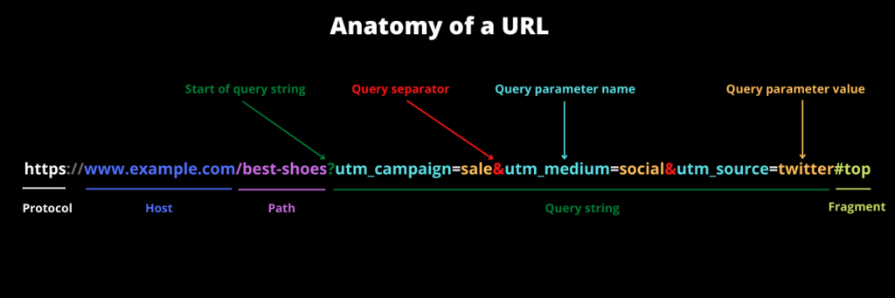

# Restful API设计最佳实践

**本次分享内容**

1. REST API介绍
2. REST API设计建议：资源命名、参数传递、错误状态、版本划分等
3. 一个文章API的设计案例
4. REST API常见问题

## 1.什么是 REST API？
REST API 是当今最常见的 Web 接口形式之一 ，在确保客户端和服务器之间的顺利通信方面发挥了重要作用。

你可以把客户端看作前端，把服务器看作后端。

客户端（前端）和服务器（后端）之间的通信通常不是直接的。因此，我们使用 API（应用编程接口），作为客户端和服务器之间的中介。

因为 API 在这种 client–server 通信中起着至关重要的作用，所以我们在设计 API 时应该遵循最佳实践。这有助于开发人员更好地维护和使用它们。

本次讲解创建 REST API 时可以遵循的一些最佳实践。这将帮助大家创建高效，安全，易于使用和维护的 API。


1. 什么是 REST API？

REST 是 Representational State Transfer 的缩写。它是由 [Roy Fielding](https://en.wikipedia.org/wiki/Roy_Fielding) 博士在 2000 年他的博士[论文](https://www.ics.uci.edu/~fielding/pubs/dissertation/top.htm)中提出一种软件架构风格，用于指导网络应用的设计和开发，使得 [Web](https://so.csdn.net/so/search?q=Web&spm=1001.2101.3001.7020) API（网络应用编程接口）更加简单、灵活、可扩展和易于理解。

任何遵循 REST 设计原则的 API 都被称为 RESTful API。

简单地说，REST API 是两台计算机通过 HTTP（超文本传输协议）进行通信的媒介，与客户端和服务器的通信方式相同。

REST API 使用 URL 唯一标识和定位 RESTful 服务中的资源，一个完整的 URL 结构如下：




## 2.REST API 设计建议
### 1. 用名词表示资源
当你设计一个 REST API 时，端点应该使用名词而非动词。

这是因为 HTTP 方法已经以动词形式执行基本的 CRUD（创建、读取、更新、删除）操作。

GET、POST、PUT、PATCH 和 DELETE 是最常见的 HTTP 动词。还有其他非 HTTP 标准动词，如 COPY、PURGE、LINK、UNLINK 等等。

因此，举例来说，一个端点不应该是这样的：

```plain
https://mysite.com/getPosts
https://mysite.com/createPost
```


它应该是这样的：

```plain
https://mysite.com/posts
```


### 2. 用复数名词表示集合
如果 URL 表示的资源是一个集合应该使用复数名词。

如果你有一个像 `https://mysite.com/post/123` 这样的端点，用 DELETE 请求删除一个帖子，或用 PUT 或 PATCH 更新一个帖子，可能是可以的，但它没有告诉用户在这个集合中可能还有一些其他帖子。这就是为什么你的集合应该使用复数的名词。

所以，不应该是 `https://mysite.com/post/123`，而是 `https://mysite.com/posts/123`。

### 3. 端点使用嵌套显示关系
很多时候，不同的端点相互联系，所以你应该对它们进行嵌套，这样更容易理解它们。

例如，对于一个多用户博客平台，不同的帖子可能是由不同的作者写的，所以在这种情况下，像 `https://mysite.com/posts/author` 这样的端点会成为一个有效的嵌套。

同样地，帖子可能有各自的评论，所以要检索评论，可以使用 `https://mysite.com/posts/{postId}/comments` 这样的端点。

你应该避免超过 3 层的嵌套，因为这可能使 API 不那么优雅，降低可读性。


### 4. 用 HTTP 方法操作资源
使用 URL 指定你要用的资源。使用 HTTP 方法来指定怎么处理这个资源。使用五种 HTTP 方法 POST，GET，PUT/PATCH，DELETE 可以提供 CRUD 功能（创建，获取，更新，删除）。

除了 POST 其他请求都具备幂等性（多次请求的效果相同）。需要注意的是 POST 和 PUT 最大的区别就是幂等性，所以 PUT 也可以用于创建操作，只要在创建前就可以确定资源的 ID。

+ 获取：使用 GET 方法获取资源。GET 请求从不改变资源的状态。无副作用。GET 是幂等的。GET 具有只读的含义。因此，你可以完美的使用缓存。
+ 创建：使用 POST 创建新的资源（非幂等）。
+ 更新：使用 PUT 更新整个资源，PATCH 更新资源部分信息。PUT 和 PATCH 都是幂等的。
+ 删除：使用 DELETE 删除现有资源（幂等）。

简而言之，你应该让 HTTP 动词来处理端点的工作。因此，GET 将检索资源，POST 将创建资源，PUT 将更新整个资源，DELETE 将删除资源，PATCH 更新资源的局部数据。


### 5. 使用 JSON 作为发送和接收数据的格式
在过去，接受和响应 API 请求主要是通过 XML 甚至 HTML 完成的。但如今，JSON（JavaScript Object Notation）已经在很大程度上成为发送和接收 API 数据的事实格式。

以 XML 为例，对数据进行解码和编码往往有点麻烦，所以 XML 不再受到框架的广泛支持。

例如，JavaScript 有一个内置的方法来通过 fetch API 解析 JSON 数据，因为 JSON 主要是为它而生成的。但是如果你使用任何其他编程语言，如 Python 或 PHP，它们现在也都有解析和操作 JSON 数据的方法。

例如，Python 提供`json.load()` 和 `json.dumps()`来处理 JSON 数据。

为了确保客户端正确地解释 JSON 数据，你应该在发出请求时将响应头中的 `Content-Type` 类型设置为 `application/json`。

另一方面，对于服务器端的框架，许多框架会自动设置 `Content-Type`。例如，Express 现在有 `express.json()` 中间件来实现这一目的。body-parser NPM 包也仍然适用于同一目的。


### 6.JSON 键命名使用 camelCase 风格
JSON 键命名风格没有统一的标准。

但是最常见有两种，下划线风格的 snake_case 和小驼峰 camelCase。

不同的语言，不同的公司，不同的开源项目均不相同，团队统一即可。

鉴于 REST API 常被 Java 和 JS 实现的客户端调用，且 Java 和 JS 常用 camelCase 来命名 JSON。此外 [Google JSON Style Guide](https://google.github.io/styleguide/jsoncstyleguide.xml?showone=Property_Name_Format#Property_Name_Format) 也使用 camelCase，所以推荐使用 camelCase 格式命名 JSON 键。


### 7. 使用统一的回包格式，将实际数据包装在 data 字段中
接口回包时我们应该使用统一的回包格式，将实际数据包装在 data 字段中。

```json
{
  "code": 0,
  "msg": "ok",
  "data":{}
}
```

比如查询某个帖子详情 `GET https://mysite.com/posts/{id}`回包内容可以是：

```json
{
  "code": 0,
  "msg": "ok",
  "data": {
    "post": {"id":1, "content":"xxx"}
  }
}
```

其中 code 为 0 表示成功，非 0 表示失败，并在 msg 中记录详细的错误信息。

分页接口回包 data 结构包含 total 总记录数。

比如分页拉取帖子详情。

```json
{
  "code": 0,
  "msg": "ok",
  "data": {
    "total": 100,
    "posts": [
      {"id":1, "content":"xxx"},
      {"id":2, "content":"xxx"},
      {"id":3, "content":"xxx"}
    ]
  }
}
```


### 8. 非资源请求用动词
有时 API 调用并不涉及资源，比如计算、翻译或转换等。

```javascript
GET /translate?from=de&to=en&text=Hallo
GET /calculate?param1=23¶m2=432
```

在这种情况下，API 响应不会返回任何资源，而是执行一个操作并将结果返回给客户端。因此，我们应该在 URL 中使用动词而不是名词，来清楚地区分资源请求和非资源请求。


### 9. 分页返回数据
有时 API 获取的数据可能非常大，一次性返回所有数据是一个糟糕的做法，因为这会带来严重的性能问题和不必要的带宽浪费。

所以，我们应该分页返回数据。

分页返回，常见的实现方式是在 API 参数中提供 page 和 size（offset 和 limit）或 after_id 和 limit。

page 与 size 适合数据总量小的浅分页查询，after_id 和 limit 适合数据总量大的深分页查询。

```plain
// 浅分页
GET https://mysite.com/posts?page=PAGE&size=SIZE

// 深分页
GET https://mysite.com/posts?after_id=AFTER_ID&limit=LIMIT
```


### 10. 考虑特定资源搜索和跨资源搜索
提供对特定资源的搜索很容易。只需使用相应的资源集合 URL，并将搜索字符串附加到查询参数中即可。

```plain
GET /employees?query=Paul
```

如果要对所有资源提供全局搜索，则需要用其他方法。前文提到，对于非资源请求 URL，使用动词而非名词。因此，您的搜索网址可能如下所示：

```plain
GET /search?query=Paul   // 返回 employees, customers, suppliers 等等。
```


### 11.URL Path 使用连字符分隔单词
一个合法的 HTTP URL 组成格式如下：

```plain
http(s)://<host>:<port>/<path>?<query>#<frag>
```


Path 如何分隔单词？REST API 的最佳实践是使用连字符（hyphen），而不是下划线（underscore）或驼峰（camelcase）。这是来自 Mark Masse 的《REST API Design Rulebook》的建议。

此外，搜索引擎也更喜欢使用连字符来分隔单词，使用连字符分隔单词，它们让搜索引擎更准确地理解 URL 中的单词和短语，这样搜索引擎就可以索引单个单词，有助于 SEO，很容易检索到这个 URL，排名靠前。

许多著名公司都遵循该实践方式，如 Stack Overflow。

如一个使用连字符的 REST API URL 可能如下所示：

```plain
https://api.example.com/users/john-doe
```

而使用下划线的 URL 则可能如下所示：

```plain
https://api.example.com/users/john_doe
```

虽然两者在技术上都是有效的 URL，但前者更符合 REST API 的最佳实践。

### 12.URL Query 使用下划线分隔单词
查询字符串是 URL 的组成部分。URL 规范规定查询字符串的不同参数使用与号（&）分隔，参数名与值使用等号（=）分隔。

当我们在 URL Query 中命名参数名称与值时，建议使用下划线。

如一个使用下划线的查询参数可能如下所示：

```plain
first_name=john&last_name=doe
```

而使用连字符的查询参数则可能如下所示：

```plain
first-name=john&last-name=doe
```

虽然在技术上两者都是有效的，但使用下划线表示被连接的不同单词是一个整体，更符合 REST API 的最佳实践，并且更容易读写和阅读。

当然这不是绝对的，对于一些复杂的情况，下划线和连字符可以混用。

```plain
name_birthdate=john_doe-2023_06_09
```

其中 john_doe 表示一个整体，2023_06_09 表示一个整体，二者通过连字符分隔。


### 13. 使用 HTTP 状态码
你应该在对你的 API 请求的响应中始终使用常规的 HTTP 状态代码。这将帮助你的用户知道发生了什么——请求是否成功，或者是否失败，或者其他情况。

下面的表格显示了不同的 HTTP 状态代码范围和它们的含义：

| 状态码 | 含义 |
| --- | --- |
| 1XX | 信息性回应，如 102 表示该资源正在处理中 |
| 2XX | 成功，如 200 表示请求被正确处理 |
| 3XX | 重定向，如 301 表示永久移动 |
| 4XX | 客户端错误，如 400 表示错误的请求，404 表示未找到资源 |
| 5XX | 服务器端错误，如 500 表示内部服务器错误 |


### 14. 提供有用的错误消息
除了提供恰当的 HTTP 状态代码外，还应该在 HTTP 响应正文中提供有用且详细的错误描述。

比如`GET /mysite.com/posts?category=unknow&page=1&size=10` 请求，如果入参有误，应该准确告知调用方。

```json
// 400 Bad Request
{
  "code": 10000,
  "msg":"Invalid category. Valid values are 'biz' or 'tech'"
}
```


### 15. 明确版本划分
REST API 应该有不同的版本，因为如果有不兼容和破坏性的更改，版本号将让你能更容易发布 API，且不会破坏用户的应用程序。

划分 API 版本，常见的做法是在 URL Path 中加入版本标识。

```plain
/v1/employees
/v2/employees
```


许多科技巨头和个人的 REST API 通常是这样做的，例如 Facebook 与 Spotify

当您以这种方式提供 REST API 时，您不需要强迫客户端迁移到新版本，如果他们不想迁移的话。


### 16. 使用 HATEOAS
API 的使用者未必知道，URL 是怎么设计的。一个解决方法就是，在响应中给出相关链接，便于下一步操作。这样的话，用户只要记住一个 URL，就可以发现其他的 URL。这种方法叫做 HATEOAS。


HATEOAS 是 Hypermedia As The Engine Of Application State 的缩写，从字面上理解是 “超媒体即是应用状态引擎” 。其原则就是客户端与服务器的交互完全由超媒体动态提供，客户端无需事先了解如何与数据或服务器交互。相反的，在一些 RPC 服务或 Redis、MySQL 等软件，需要事先了解接口定义或特定的交互语法。


举例来说，GitHub 的 API 都在 [api.github.com](https://api.github.com/) 这个域名。访问它，就可以得到其他 URL。

```json
{
  ...
  "feeds_url": "https://api.github.com/feeds",
  "followers_url": "https://api.github.com/user/followers",
  "following_url": "https://api.github.com/user/following{/target}",
  "gists_url": "https://api.github.com/gists{/gist_id}",
  "hub_url": "https://api.github.com/hub",
  ...
}
```


上面的回应中，挑一个 URL 访问，又可以得到别的 URL。对于用户来说，不需要记住 URL 设计，只要从 api.github.com 一步步查找就可以了。


### 17. 提供准确的 API 文档
当你创建 REST API 时，你需要帮助用户（消费者）正确学习并了解如何使用它。最好的方法是为 API 提供良好的文档。


文档应包含：

+ API 的相关端点
+ 端点的示例请求
+ 在几种编程语言中的实现
+ 不同错误的消息列表及其状态代码


你可以用于 API 文档的最常用工具是 Swagger。你也可以使用 Postman 来记录你的 API，这是软件开发中最常见的 API 测试工具。


### 18. 使用 TLS 保障安全
TLS（Transport Layer Security）指的是传输层安全协议。这对 REST API 的安全性至关重要。使用 SSL 可以保护你的 API，使其更不容易受到恶意攻击。


TLS 证书不难加载到服务器上，而且大多数情况下在第一年是免费的。即使需要购买，它们也并不昂贵。


运行在 TLS 上的 REST API 的 URL 与不运行在 TLS 上的 URL 的明显区别是协议 HTTP 中是否包含 s，`https://mysite.com/posts` 运行在 TLS 上，`http://mysite.com/posts` 不运行在 TLS 上。


你还应考虑其他安全措施，比如对请求做身份校验。


### 19. 使用统一的错误码
同一个服务的不同 API 或不同系统模块的不同服务的 API 应该使用统一的错误码。

统一的错误码有很多优势。

+  易于维护： 统一的错误码可以使 API 的维护更加简单。当需要调整错误信息或添加新的错误时，只需修改一处错误码定义即可，而无需在整个 API 中查找和修改多处。 
+  对调用方友好： 使用统一的错误码可以降低[客户端开发](https://so.csdn.net/so/search?q=%E5%AE%A2%E6%88%B7%E7%AB%AF%E5%BC%80%E5%8F%91&spm=1001.2101.3001.7020)的难度。客户端只需关注预定义的错误码，而无需解析和处理不同形式的错误响应。 
+  错误诊断和日志记录： 统一的错误码可以帮助开发人员更轻松地诊断 API 中的问题。错误日志中使用统一的错误码可以提供更准确的错误信息，帮助定位和解决问题。 


在实际应用中，需要根据具体业务场景来选择合适的错误码策略。错误码的设计应该符合 API 的业务逻辑和语义，同时也需要与客户端开发人员进行充分的沟通和协商。

下面是一些常见的错误。

| code | 说明 |
| --- | --- |
| 10000 | 入参有误 |
| 10001 | Token 非法 |
| 10002 | 请求处理超时 |
| 10003 | 记录未找到 |
| 10004 | DB 写入失败 |
| 10005 | DB 更新失败 |
| 10006 | DB 查询失败 |
| 10007 | DB 删除失败 |
| 10008 | JSON 序列化失败 |
| 10009 | JSON 反序列化失败 |


关于错误码的定义，一般没有固定的规定，不同的系统和应用可能会采用不同的错误码起始值。错误码的起始值通常是根据具体需求和规模来确定的。

比如在大规模的系统中，可能会选择更大的错误码起始值，从 10000、100000 开始，以便在未来可以灵活地添加更多的错误码。


## 3.一个文章API设计
一般来说 API 的外在形式无非就是增删改查（当然具体的业务逻辑肯定要复杂得多），而查询又分为详情和列表两种，在 REST 中这就相当于通用的模板。


例如针对文章（Article）设计 API，那么最基础的 URL 就是这几种：

```plain
GET 	/articles： 文章列表
GET 	/articles/{id}：文章详情
POST 	/articles： 创建文章
PUT 	/articles/{id}：修改文章
PATCH 	/articles/{id}：修改文章的部分信息
DELETE 	/articles/{id}：删除文章
```


将文章 ID 放在 Path 而不是 Query 中的一个好处是可以表示资源之间的层级关系。

例如文章下面会有评论（Comment）和点赞（Like），这两项资源必然会属于某一篇文章，所以它们的 URL 应该是下面这样的。

```plain
GET 	/comments/{id}： 获取单个评论
GET 	/articles/{id}/comments： 某篇文章的评论列表
POST 	/articles/{id}/comments： 为篇文章创建评论
PUT 	/comments/{id}： 修改评论
PATCH 	/comments/{id}： 修改评论的部分信息
DELETE 	/comments/{id}： 删除评论
```

这里有一点比较特殊，永远使用可以指向资源最短的 URL，也就是说既然 /comments/{id} 可以指向一条评论了，就不要用 /articles/{id}/comments/{id} 特意指出所属文章了。

```plain
GET		/articles/{id}/like：查看文章是否被点赞
PUT		/articles/{id}/like：点赞文章
DELETE 	/articles/{id}/like：取消点赞
```

注意，点赞文章我选择了 PUT 而不是 POST，因为我觉得点赞这种行为应该是幂等的，多次操作的结果应该相同。另外，是否点赞可以直接在获取文章详情时返回，而不用单独写一个接口。


## 4.REST API常见问题
### 1. 批量新增接口如何设计？
使用复数形式的资源名称来表示批量新增多个资源的操作，这与新增单个的接口存在冲突，不建议使用。在资源路径后添加一个表示批量操作的子路径，含义简洁明了，建议使用。

```plain
// 不推荐
POST /resources

// 推荐
POST /resources/batch
```


### 2. 批量查询接口如何设计？
根据 ID 获取单个资源可以使用如下 URL。

```plain
GET /resources/{id}
```

如果需要根据 ID 同时删除多个资源，URL 该如何设计呢？

常见的方式有如下几种。


**第一种：Path 传参。**

使用 GET 方法，多个资源 ID 放进 URL Path 中。

```plain
GET /resources/ids/1,2,3...
```

使用 GET 方法时，将多个资源 ID 放到 Path 中传递，并且在路径中加入 ids 标识和单个 ID 接口区分开来。路径中的资源 ID 更具语义化且更具可读性，**建议使用**。


**第二种：Query 传参。**

使用 GET 方法，用多个资源 ID 放进 URL Query 中。

```plain
GET /resources?ids=1,2,3...
```


查询参数可以方便地与其他查询参数一起使用，进行过滤、排序和分页等操作。不过将多个 ID 放到 Query 传递，查询参数不够直观，需要在文档中明确指出如何传递多个 ID。


**注意**，由于浏览器和服务器一般对 URL 的长度存在限制（没有统一标准上限，一般为 8192 字节），上面两种方式如果操作的资源过多无法实现。从实际来看，一般批量操作时需要为 ID 数设置一个上限，这样便不会触及 URL 的上限。


**第三种：Body 传参。**

使用 GET 方法，用多个资源 ID 放进请求体中。

```javascript
GET /resources
Content-Type: application/json

{
  "ids":[1,2,3]
}
```

虽然 HTTP 规范允许 GET 请求发送请求体，但大多数 Web 服务器和客户端库在处理 GET 请求时会忽略请求体。也就是说，大多数 Web 服务器和客户端库并不期望在 GET 请求中包含请求体，并且可能会忽略或拒绝处理请求体中的数据。

HTTP/1.1 规范（RFC 7231）中指出：


> A payload within a GET request message has no defined semantics; sending a payload body on a GET request might cause some existing implementations to reject the request.
>


也就是说 HTTP/1.1 规范虽然允许 GET 请求发送请求体，但是不建议这么做，因为 GET 请求被定义为获取资源的操作，而不是在请求体中发送数据。


根据 RESTful 设计准则，对于 GET 请求，也不应将请求参数放在请求体中。GET 请求的查询参数应该直接放在 URL 中，而不是放在请求体中。


**第四种：POST + Body 传参。**

使用 POST 方法，将多个 ID 封装在请求体中。请求体可以是 JSON 或其他格式的数据，用于传递多个 ID。

```javascript
POST /resources
Content-Type: application/json

{
  "ids": [1, 2, 3]
}
```


由于 POST 语义上不符合实际的查询动作，所以建议使用 GET 方法。


### 3. 批量删除接口如何设计？
删除单个资源可以在 URL Path 中指定资源 ID。

```plain
DELETE /resources/{id}
```

如果需要根据 ID 同时删除多个资源，URL 该如何设计呢？

常见的方式有如下几种。


**第一种：Path 传参。**

使用 DELETE 方法，用逗号分隔将多个资源 ID 放进 URL Path 中。

```json
DELETE /resources/ids/1,2,3...
```

将多个 ID 放到 Path 传递，并且在路径中加入 ids 标识和单个 ID 接口区分开来，清晰明了，**建议使用**。


**第二种：Query 传参。**

使用 DELETE 方法，用多个资源 ID 放进 URL Query 中。

```json
DELETE /resources?ids=1,2,3...
```

将多个 ID 放到 Query 传递，查询参数不够直观，需要在文档中明确指出如何传递多个 ID。


**注意**，由于浏览器和服务器一般对 URL 的长度存在限制（没有统一标准上限，一般为 8192 字节），上面两种方式如果操作的资源过多无法实现。


实际上批量删除操作本身是一个非常敏感的操作，一般会对批量删除资源的数量做严格限制，所以不会出现太长的 URL。


**第三种：Body 传参。**

使用 DELETE 方法，将需要删除的资源的 ID 放到请求体里面。

```json
DELETE /resources
{
  "ids":[1,2,3...]
}
```


HTTP 协议标准并没有规定 DELETE 请求不能带 Body，但是 DELETE 请求体在语义上没有意义，一些网关、代理、防火墙在收到 DELETE 请求后，会把请求的 Body 直接剥离掉，所以不建议 DELETE 携带 Body。


**第四种：POST + Body 传参。**

改用 POST 方法，将需要删除资源的 ID 放到请求体。

```json
POST /resources
Content-Type: application/json

{
  "method": "delete",
  "ids": [1, 2, 3]
}
```

使用 POST 语义上与删除动作不符。

## 5.小结
我们讲解了创建 REST API 时需要记住的一些最佳实践。

将这些最佳实践付诸实践是很重要的，这样您不仅可以创建功能强大的应用程序，而且使其简单可靠，易于使用。

当然，本次讲解的最佳实践也并非您的必然选择。无论您选择哪种方式去实现自己的 REST API，重要的是与团队风格保持一致性，以确保 API 的易用性、可读性和可维护性。


> 更新: 2024-07-15 22:21:21  
> 原文: <https://www.yuque.com/tulingzhouyu/db22bv/hv7t6xfxra7cpusi>